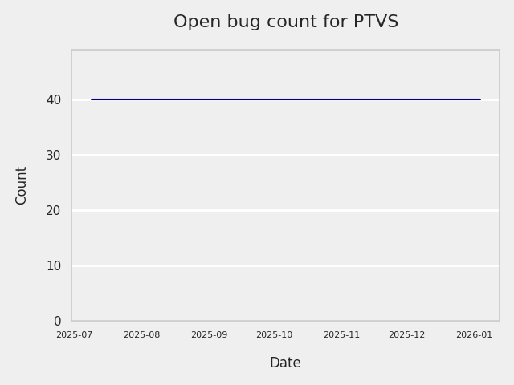
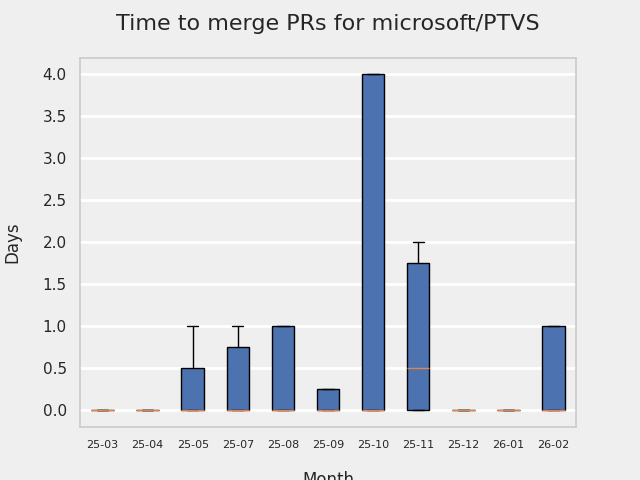
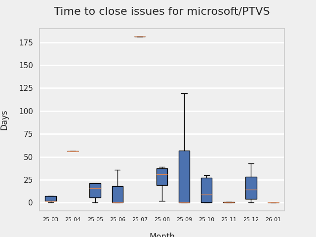
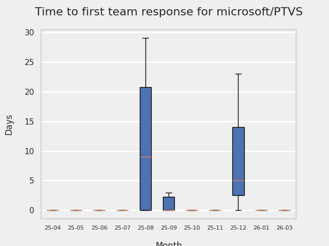
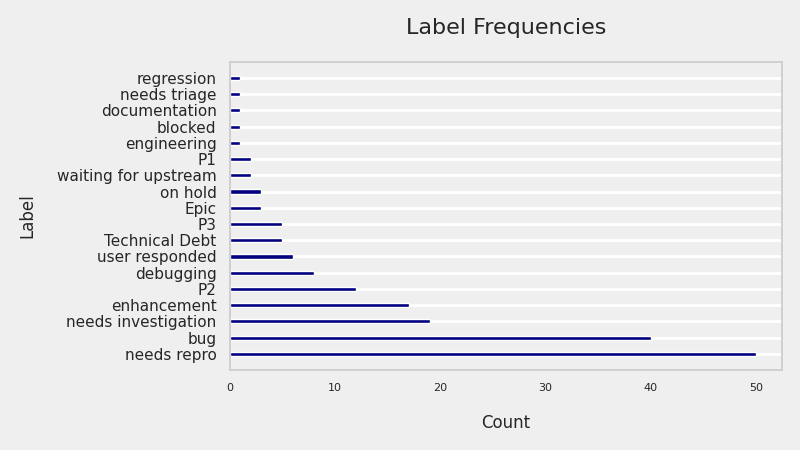
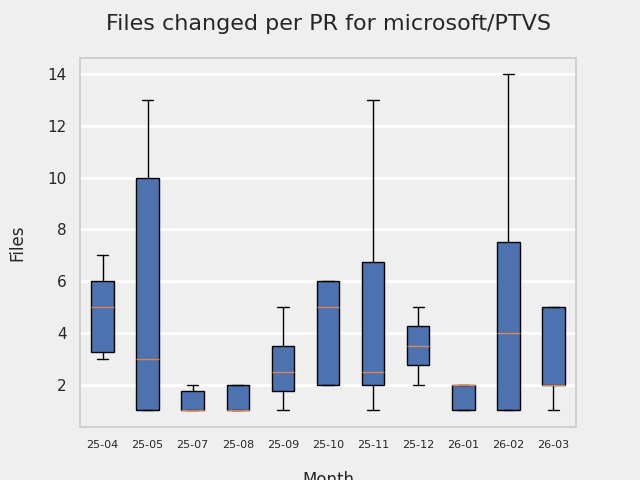
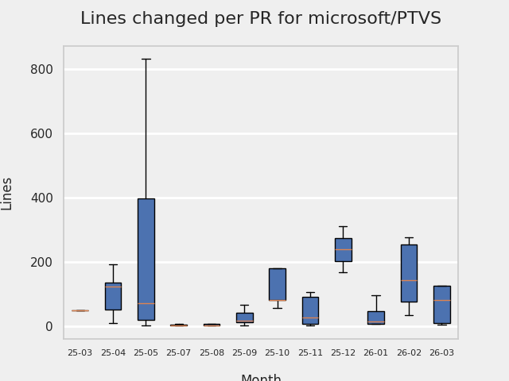
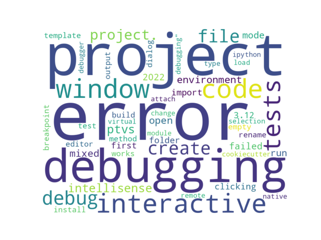

# GITHUB ISSUES REPORT FOR microsoft/PTVS

Generated on 2025-04-29 using: stale=30, all=True

* marks items that are new to report in past 1 day(s)

## FOR ISSUES THAT ARE MARKED AS BUGS:

### Issues in PTVS that need a response from team:

| Days Ago | Issue | Title |
| --- | --- | --- |
 |  OP:55  |[8190](https://github.com/microsoft/PTVS/issues/8190 "Bracket auto-completion only works in first project.") | Bracket auto-completion only works in first project. |
 |  OP:719  |[7598](https://github.com/microsoft/PTVS/issues/7598 "Auto commenting lines using LF or CRLF ") | Auto commenting lines using LF or CRLF  |
 |  OP:818  |[7367](https://github.com/microsoft/PTVS/issues/7367 "No output result after clicking 'Execute Project in Python Interactive'") | No output result after clicking 'Execute Project in Python Interactive' |
 |  OP:1034  |[7064](https://github.com/microsoft/PTVS/issues/7064 "Some intellisense don't work well in interactive window after writing some REPL commands") | Some intellisense don't work well in interactive window after writing some REPL commands |

### Issues in PTVS that have comments from OP after last team response:

| Days Ago | Issue | Title |
| --- | --- | --- |
 |  TM:75, OP:75  |[8121](https://github.com/microsoft/PTVS/issues/8121 "Features not working consistently: task list, navigation dropdown menus") | Features not working consistently: task list, navigation dropdown menus |
 |  TM:230, OP:230  |[7974](https://github.com/microsoft/PTVS/issues/7974 "No change with the type information when change the sys.exc_info with the latest typeshed. ") | No change with the type information when change the sys.exc_info with the latest typeshed.  |
 |  TM:433, OP:285  |[7828](https://github.com/microsoft/PTVS/issues/7828 "IntelliSense for Search Paths doesn't work when import folder outside the workspace.") | IntelliSense for Search Paths doesn't work when import folder outside the workspace. |
 |  TM:614, OP:613  |[7631](https://github.com/microsoft/PTVS/issues/7631 "An unexpected error occured when first creating the conda env.") | An unexpected error occured when first creating the conda env. |
 |  TM:893, OP:893  |[7219](https://github.com/microsoft/PTVS/issues/7219 "No output with using ipython interactive window") | No output with using ipython interactive window |
 |  TM:795, OP:795  |[7206](https://github.com/microsoft/PTVS/issues/7206 "The active environment doesn't change with the Cookiecutter Explorer is open") | The active environment doesn't change with the Cookiecutter Explorer is open |

### Issues in PTVS that have comments from 3rd party after last team response:

| Days Ago | Issue | Title |
| --- | --- | --- |
 |  P:205,  |[7868](https://github.com/microsoft/PTVS/issues/7868 "Interactive Window not working or displaying output ") | Interactive Window not working or displaying output  |
 |  P:183,  |[7068](https://github.com/microsoft/PTVS/issues/7068 "reportMissingImports : Even if the module is successfully installed, a warning will still be displayed in the Error List window") | reportMissingImports : Even if the module is successfully installed, a warning will still be displayed in the Error List window |

### Issues in PTVS that have no external responses since team response in 30+ days:

| Days Ago | Issue | Title |
| --- | --- | --- |
 |  TM:461  |[7807](https://github.com/microsoft/PTVS/issues/7807 "It showed empty class name when type @.") | It showed empty class name when type @. |
 |  TM:544  |[7745](https://github.com/microsoft/PTVS/issues/7745 "There is no info bar appear to suggest install pytest when Test Explorer is open ") | There is no info bar appear to suggest install pytest when Test Explorer is open  |
 |  TM:257  |[6900](https://github.com/microsoft/PTVS/issues/6900 "Python 3.10 fails to hit breakpoints when &quot;Native Code Debugging&quot; is enabled.") | Python 3.10 fails to hit breakpoints when "Native Code Debugging" is enabled. |
 |  TM:795  |[6551](https://github.com/microsoft/PTVS/issues/6551 "Navigation bar is not working") | Navigation bar is not working |

---

## FOR ISSUES THAT ARE NOT MARKED AS BUGS:

### Issues in PTVS that need a response from team:

| Days Ago | Issue | Title |
| --- | --- | --- |
 | \* OP:0  |[8209](https://github.com/microsoft/PTVS/issues/8209 "Error List only works in first project.")  |Error List only works in first project. |
 |  OP:18  |[8204](https://github.com/microsoft/PTVS/issues/8204 "Cannot build a project with RunPythonCommand task from MSBuild/command line") | Cannot build a project with RunPythonCommand task from MSBuild/command line |
 |  OP:48  |[8194](https://github.com/microsoft/PTVS/issues/8194 "Code folding hides entire function/class names in Visual Studio #3580") | Code folding hides entire function/class names in Visual Studio #3580 |
 |  OP:61  |[8184](https://github.com/microsoft/PTVS/issues/8184 "Empty error dialog when trying to run Python file with no Python installed") | Empty error dialog when trying to run Python file with no Python installed |
 |  OP:83  |[8161](https://github.com/microsoft/PTVS/issues/8161 "Unable to clear pytest message") | Unable to clear pytest message |
 |  OP:83  |[8160](https://github.com/microsoft/PTVS/issues/8160 "Failed to create &quot;GitHub->cookiecutter-flask/cookiecutter-flask&quot; template in Cookiecutter.") | Failed to create "GitHub->cookiecutter-flask/cookiecutter-flask" template in Cookiecutter. |
 |  OP:98  |[8143](https://github.com/microsoft/PTVS/issues/8143 "Adding a Flask web project to a docker-orchestration results in WebRole.dll error.") | Adding a Flask web project to a docker-orchestration results in WebRole.dll error. |
 |  OP:125  |[8118](https://github.com/microsoft/PTVS/issues/8118 "VS Crashes When Loading Cookie Template.") | VS Crashes When Loading Cookie Template. |
 |  OP:203  |[8020](https://github.com/microsoft/PTVS/issues/8020 "An error notification pops up after clicking Add Debug Configuration.") | An error notification pops up after clicking Add Debug Configuration. |
 |  OP:253  |[7983](https://github.com/microsoft/PTVS/issues/7983 "Open interactive window，loading all the time after entering enter in the Anaconda environment.") | Open interactive window，loading all the time after entering enter in the Anaconda environment. |
 |  OP:258  |[7978](https://github.com/microsoft/PTVS/issues/7978 "The &quot;remove unused imports&quot; and &quot;Extract method&quot; quick action icons appear only when you select a code.") | The "remove unused imports" and "Extract method" quick action icons appear only when you select a code. |
 |  OP:444  |[7823](https://github.com/microsoft/PTVS/issues/7823 "Unexpected error occured. About Conda env.") | Unexpected error occured. About Conda env. |
 |  OP:469  |[7805](https://github.com/microsoft/PTVS/issues/7805 "Refactor rename incorrect when the referenced method is defined in another project.") | Refactor rename incorrect when the referenced method is defined in another project. |
 |  OP:588  |[7725](https://github.com/microsoft/PTVS/issues/7725 "The VS crashed after choose the progress when remote debug.") | The VS crashed after choose the progress when remote debug. |
 |  OP:620  |[7701](https://github.com/microsoft/PTVS/issues/7701 "No IntelliSense when import a new created django app.") | No IntelliSense when import a new created django app. |
 |  OP:710  |[7616](https://github.com/microsoft/PTVS/issues/7616 "Lots of debug symbols are being loaded at every application start") | Lots of debug symbols are being loaded at every application start |
 |  OP:719  |[7600](https://github.com/microsoft/PTVS/issues/7600 "Modal pop-up persists when a breakpoint cannot resolve conditional expression ") | Modal pop-up persists when a breakpoint cannot resolve conditional expression  |
 |  OP:832  |[7330](https://github.com/microsoft/PTVS/issues/7330 "Unable to create DLL for C++ ") | Unable to create DLL for C++  |
 |  OP:865  |[7274](https://github.com/microsoft/PTVS/issues/7274 "Changing error messages - differences in reported errors between VS and pyright cli") | Changing error messages - differences in reported errors between VS and pyright cli |

### Issues in PTVS that have comments from OP after last team response:

| Days Ago | Issue | Title |
| --- | --- | --- |
 |  TM:104, OP:104  |[8136](https://github.com/microsoft/PTVS/issues/8136 "After installing a package for the first time on Microsoft Store Python, 'pip list' only shows the installed package.") | After installing a package for the first time on Microsoft Store Python, 'pip list' only shows the installed package. |
 |  TM:115, OP:113  |[8125](https://github.com/microsoft/PTVS/issues/8125 "Format Document not responding.") | Format Document not responding. |
 |  TM:119, OP:119  |[8117](https://github.com/microsoft/PTVS/issues/8117 "Inconsistent Display Between &quot;Options > Languages > Python&quot; Page and Popup Window.") | Inconsistent Display Between "Options > Languages > Python" Page and Popup Window. |
 |  TM:133, OP:133  |[7984](https://github.com/microsoft/PTVS/issues/7984 "Cannot run all tests in a large number of tests.") | Cannot run all tests in a large number of tests. |
 |  TM:309, OP:308  |[7829](https://github.com/microsoft/PTVS/issues/7829 "&quot;Python was not found; run without arguments to install from the Microsoft Store...&quot; appeared in Python project. ") | "Python was not found; run without arguments to install from the Microsoft Store..." appeared in Python project.  |
 |  TM:482, OP:482  |[7794](https://github.com/microsoft/PTVS/issues/7794 "Unable to debug python code in a C++ application that embeds the python interpreter") | Unable to debug python code in a C++ application that embeds the python interpreter |
 |  TM:516, OP:515  |[7760](https://github.com/microsoft/PTVS/issues/7760 "Failed to create &quot;tiangolo/full-stack-fastapi-postgresql&quot; template in Cookiecutter. ") | Failed to create "tiangolo/full-stack-fastapi-postgresql" template in Cookiecutter.  |
 |  TM:545, OP:544  |[7743](https://github.com/microsoft/PTVS/issues/7743 "environment load sequence broken") | environment load sequence broken |
 |  TM:480, OP:480  |[7724](https://github.com/microsoft/PTVS/issues/7724 "An error pops up after clicking 'Find' when attach to python remote.") | An error pops up after clicking 'Find' when attach to python remote. |
 |  TM:733, OP:726  |[7429](https://github.com/microsoft/PTVS/issues/7429 "Start without Debug and Start with Debug button not available in right click menu") | Start without Debug and Start with Debug button not available in right click menu |
 |  TM:1022, OP:280  |[6974](https://github.com/microsoft/PTVS/issues/6974 "No IntelliSense when import folder under the workspace.") | No IntelliSense when import folder under the workspace. |
 |  TM:713, OP:372  |[6936](https://github.com/microsoft/PTVS/issues/6936 "Skip tests after clicking “Analyze Code Coverage”.") | Skip tests after clicking “Analyze Code Coverage”. |
 |  TM:165, OP:162  |[6853](https://github.com/microsoft/PTVS/issues/6853 "Unable to install suggested module when using IPython interactive mode.") | Unable to install suggested module when using IPython interactive mode. |
 |  TM:1279, OP:820  |[6750](https://github.com/microsoft/PTVS/issues/6750 "An error pops up when run &quot;Django Check, Django Migrate, Django Create Superuser...&quot;. ") | An error pops up when run "Django Check, Django Migrate, Django Create Superuser...".  |
 |  TM:843, OP:589  |[6876](https://github.com/microsoft/PTVS/issues/6876 "Extract method only works on one line and rename doesn't work at all") | Extract method only works on one line and rename doesn't work at all |
 |  TM:1348, OP:1047  |[6639](https://github.com/microsoft/PTVS/issues/6639 " IntelliSense does not work when changed SearchPath in PythonSettings.json file in open folder.") |  IntelliSense does not work when changed SearchPath in PythonSettings.json file in open folder. |

### Issues in PTVS that have comments from 3rd party after last team response:

| Days Ago | Issue | Title |
| --- | --- | --- |
 |  P:112,  |[8124](https://github.com/microsoft/PTVS/issues/8124 "This prompt box information is not fully displayed when remove virtual environment from project.") | This prompt box information is not fully displayed when remove virtual environment from project. |

### Issues in PTVS that have no external responses since team response in 30+ days:

| Days Ago | Issue | Title |
| --- | --- | --- |
 |  TM:61  |[8179](https://github.com/microsoft/PTVS/issues/8179 "【逆天BUG】在VS中，使用Python交互式窗口代码小测试会转圈无限等待") | 【逆天BUG】在VS中，使用Python交互式窗口代码小测试会转圈无限等待 |
 |  TM:601  |[7715](https://github.com/microsoft/PTVS/issues/7715 "After switching to the &quot;Packages&quot; window a second time, the packages are not displayed.") | After switching to the "Packages" window a second time, the packages are not displayed. |
 |  TM:84  |[7604](https://github.com/microsoft/PTVS/issues/7604 "Django IntelliSense in html files doesn't work.") | Django IntelliSense in html files doesn't work. |
 |  TM:733  |[7541](https://github.com/microsoft/PTVS/issues/7541 "The 'environment.yml' file can not be detected to create a conda env when reload project") | The 'environment.yml' file can not be detected to create a conda env when reload project |
 |  TM:816  |[125](https://github.com/microsoft/PTVS/issues/125 "Automatically attach to subprocesses when debugging") | Automatically attach to subprocesses when debugging |

## MOST FREQUENTLY CHANGED FILES (by # of PRs):

 20: azure-pipelines.yml

 17: package.json

 15: Build/debugpy-version.txt

 10: Python/Product/PythonTools/PythonTools/LanguageServerClient/PythonLanguageClient.cs

  8: azure-pipelines-release.yml

  8: Python/Product/Debugger.Concord/Proxies/Structs/PyFrameObject.cs

  7: Python/Product/Debugger.Concord/TraceManagerLocalHelper.cs

  6: Build/templates/run_tests.yml

  6: Examples/PythonCallingNative/PythonApplication/PythonApplication.pyproj

  6: Python/Product/Debugger.Concord/Debugger.Concord.csproj

  6: Python/Product/Debugger.Concord/Proxies/Structs/PyThreadState.cs

  5: Python/Product/Debugger.Concord/Proxies/Structs/PyFrameObject310.cs

  5: Python/Product/Debugger.Concord/Proxies/Structs/PyFrameObject311.cs

  5: Examples/PythonNative/PythonNative.vcxproj

  5: Python/Product/Debugger.Concord/Proxies/Structs/PyInterpreterState.cs

  5: Python/Product/DebuggerHelper/trace.cpp

