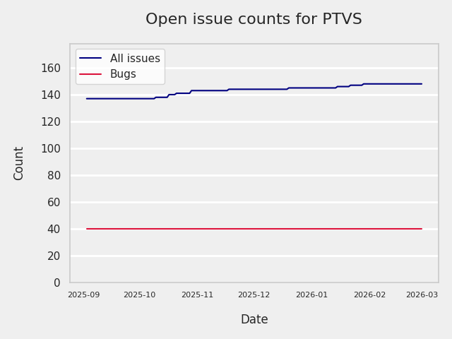
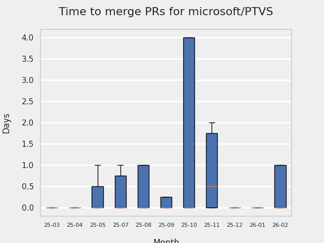
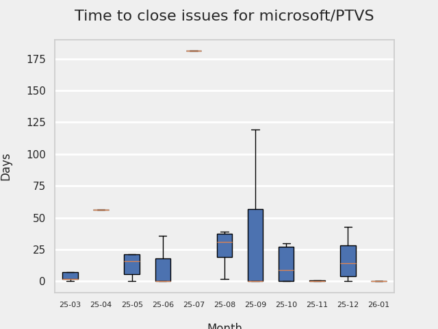
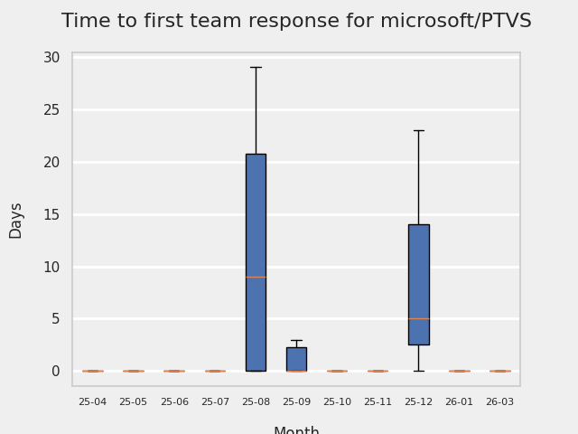
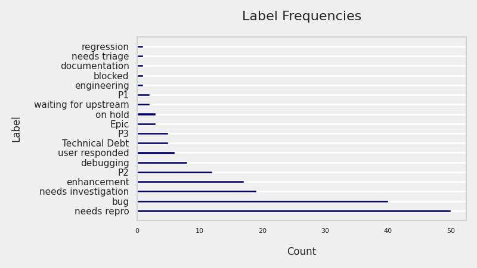
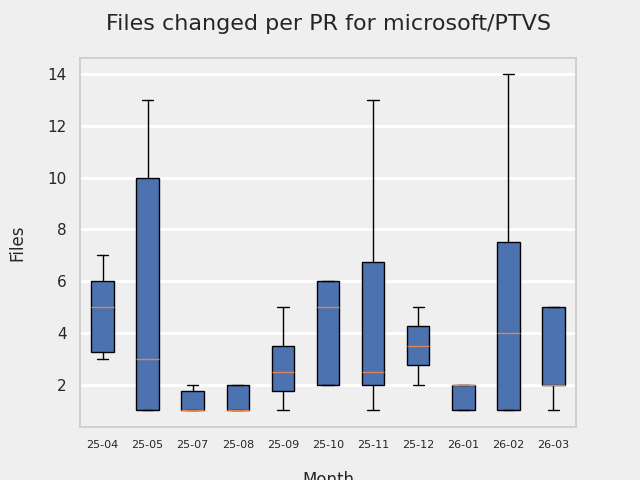
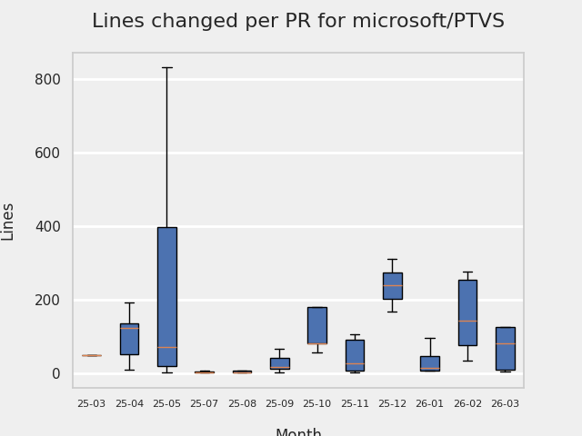
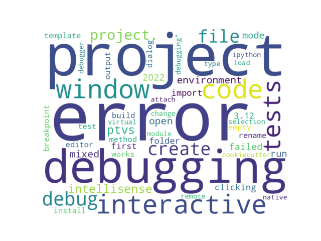

# GITHUB ISSUES REPORT FOR microsoft/PTVS

Generated on 2026-03-08 using: stale=30, all=True

* marks items that are new to report in past 7 day(s)

## FOR ISSUES THAT ARE MARKED AS BUGS:

### Issues in PTVS that need a response from team:

| Days Ago | Issue | Title |
| --- | --- | --- |
 |  OP:362  |[8194](https://github.com/microsoft/PTVS/issues/8194 "Code folding hides entire function/class names in Visual Studio #3580") | Code folding hides entire function/class names in Visual Studio #3580 |
 |  OP:368  |[8190](https://github.com/microsoft/PTVS/issues/8190 "Bracket auto-completion only works in first project.") | Bracket auto-completion only works in first project. |
 |  OP:1033  |[7598](https://github.com/microsoft/PTVS/issues/7598 "Auto commenting lines using LF or CRLF ") | Auto commenting lines using LF or CRLF  |
 |  OP:1131  |[7367](https://github.com/microsoft/PTVS/issues/7367 "No output result after clicking 'Execute Project in Python Interactive'") | No output result after clicking 'Execute Project in Python Interactive' |
 |  OP:1347  |[7064](https://github.com/microsoft/PTVS/issues/7064 "Some intellisense don't work well in interactive window after writing some REPL commands") | Some intellisense don't work well in interactive window after writing some REPL commands |

### Issues in PTVS that have comments from OP after last team response:

| Days Ago | Issue | Title |
| --- | --- | --- |
 |  TM:388, OP:388  |[8121](https://github.com/microsoft/PTVS/issues/8121 "Features not working consistently: task list, navigation dropdown menus") | Features not working consistently: task list, navigation dropdown menus |
 |  TM:544, OP:543  |[7974](https://github.com/microsoft/PTVS/issues/7974 "No change with the type information when change the sys.exc_info with the latest typeshed. ") | No change with the type information when change the sys.exc_info with the latest typeshed.  |
 |  TM:747, OP:598  |[7828](https://github.com/microsoft/PTVS/issues/7828 "IntelliSense for Search Paths doesn't work when import folder outside the workspace.") | IntelliSense for Search Paths doesn't work when import folder outside the workspace. |
 |  TM:928, OP:926  |[7631](https://github.com/microsoft/PTVS/issues/7631 "An unexpected error occured when first creating the conda env.") | An unexpected error occured when first creating the conda env. |
 |  TM:1207, OP:1207  |[7219](https://github.com/microsoft/PTVS/issues/7219 "No output with using ipython interactive window") | No output with using ipython interactive window |
 |  TM:1108, OP:1108  |[7206](https://github.com/microsoft/PTVS/issues/7206 "The active environment doesn't change with the Cookiecutter Explorer is open") | The active environment doesn't change with the Cookiecutter Explorer is open |

### Issues in PTVS that have comments from 3rd party after last team response:

| Days Ago | Issue | Title |
| --- | --- | --- |
 |  P:292,  |[7868](https://github.com/microsoft/PTVS/issues/7868 "Interactive Window not working or displaying output ") | Interactive Window not working or displaying output  |
 |  P:496,  |[7068](https://github.com/microsoft/PTVS/issues/7068 "reportMissingImports : Even if the module is successfully installed, a warning will still be displayed in the Error List window") | reportMissingImports : Even if the module is successfully installed, a warning will still be displayed in the Error List window |
 |  P:274,  |[6900](https://github.com/microsoft/PTVS/issues/6900 "Python 3.10 fails to hit breakpoints when &quot;Native Code Debugging&quot; is enabled.") | Python 3.10 fails to hit breakpoints when "Native Code Debugging" is enabled. |

### Issues in PTVS that have no external responses since team response in 30+ days:

| Days Ago | Issue | Title |
| --- | --- | --- |
 |  TM:340  |[8171](https://github.com/microsoft/PTVS/issues/8171 "&quot;Compare Performance Reports&quot; feature is not working.") | "Compare Performance Reports" feature is not working. |
 |  TM:775  |[7807](https://github.com/microsoft/PTVS/issues/7807 "It showed empty class name when type @.") | It showed empty class name when type @. |
 |  TM:857  |[7745](https://github.com/microsoft/PTVS/issues/7745 "There is no info bar appear to suggest install pytest when Test Explorer is open ") | There is no info bar appear to suggest install pytest when Test Explorer is open  |
 |  TM:1109  |[6551](https://github.com/microsoft/PTVS/issues/6551 "Navigation bar is not working") | Navigation bar is not working |

---

## FOR ISSUES THAT ARE NOT MARKED AS BUGS:

### Issues in PTVS that need a response from team:

| Days Ago | Issue | Title |
| --- | --- | --- |
 | \* OP:4  |[8430](https://github.com/microsoft/PTVS/issues/8430 "Failed to load &quot;Buuntu/fastapi-react&quot; and &quot;MSOneCode/cookiecutter-active-directory-python-graphapi-oauth2-0-access&quot; cookiecutter template with error &quot;name 'unicode' is not defined&quot;")  |Failed to load "Buuntu/fastapi-react" and "MSOneCode/cookiecutter-active-directory-python-graphapi-oauth2-0-access" cookiecutter template with error "name 'unicode' is not defined" |
 |  OP:39  |[8374](https://github.com/microsoft/PTVS/issues/8374 "Failed to create Machine Learning type project.") | Failed to create Machine Learning type project. |
 |  OP:46  |[8366](https://github.com/microsoft/PTVS/issues/8366 "Interactive mode crash with IPYTHON") | Interactive mode crash with IPYTHON |
 |  OP:53  |[8358](https://github.com/microsoft/PTVS/issues/8358 "IntelliSense sometimes doesn't work well in HTML files.") | IntelliSense sometimes doesn't work well in HTML files. |
 |  OP:79  |[8348](https://github.com/microsoft/PTVS/issues/8348 "Mypy's result does not refresh after the first execution") | Mypy's result does not refresh after the first execution |
 |  OP:131  |[8315](https://github.com/microsoft/PTVS/issues/8315 "The option &quot;Python/Native Debugging&quot; is missing.") | The option "Python/Native Debugging" is missing. |
 |  OP:150  |[8303](https://github.com/microsoft/PTVS/issues/8303 "The interactive window not change to the selection virtual environment when open from solution explorer.") | The interactive window not change to the selection virtual environment when open from solution explorer. |
 |  OP:207  |[8274](https://github.com/microsoft/PTVS/issues/8274 "It showed empty in Watch/Locals debugger windows when native debug with Python 3.11.") | It showed empty in Watch/Locals debugger windows when native debug with Python 3.11. |
 |  OP:228  |[8266](https://github.com/microsoft/PTVS/issues/8266 "NullReferenceException") | NullReferenceException |
 |  OP:241  |[8261](https://github.com/microsoft/PTVS/issues/8261 "&quot;An unexpected error occurred&quot; while opening solution file.") | "An unexpected error occurred" while opening solution file. |
 |  OP:251  |[8259](https://github.com/microsoft/PTVS/issues/8259 "import dill   is unresolved in VS 2022 Community") | import dill   is unresolved in VS 2022 Community |
 |  OP:263  |[8256](https://github.com/microsoft/PTVS/issues/8256 "vs关闭时有bug") | vs关闭时有bug |
 |  OP:267  |[8255](https://github.com/microsoft/PTVS/issues/8255 "The &quot;Enable Mixed Mode Debugging&quot; feature in Python projects seems not to support the python3.13t (free-threaded) version.") | The "Enable Mixed Mode Debugging" feature in Python projects seems not to support the python3.13t (free-threaded) version. |
 |  OP:304  |[8230](https://github.com/microsoft/PTVS/issues/8230 "VS can only recognize one environment when Python and Anaconda have the same version.") | VS can only recognize one environment when Python and Anaconda have the same version. |
 |  OP:313  |[8209](https://github.com/microsoft/PTVS/issues/8209 "Error List only works in first project.") | Error List only works in first project. |
 |  OP:331  |[8204](https://github.com/microsoft/PTVS/issues/8204 "Cannot build a project with RunPythonCommand task from MSBuild/command line") | Cannot build a project with RunPythonCommand task from MSBuild/command line |
 |  OP:375  |[8184](https://github.com/microsoft/PTVS/issues/8184 "Empty error dialog when trying to run Python file with no Python installed") | Empty error dialog when trying to run Python file with no Python installed |
 |  OP:396  |[8160](https://github.com/microsoft/PTVS/issues/8160 "Failed to create &quot;GitHub->cookiecutter-flask/cookiecutter-flask&quot; template in Cookiecutter.") | Failed to create "GitHub->cookiecutter-flask/cookiecutter-flask" template in Cookiecutter. |
 |  OP:411  |[8143](https://github.com/microsoft/PTVS/issues/8143 "Adding a Flask web project to a docker-orchestration results in WebRole.dll error.") | Adding a Flask web project to a docker-orchestration results in WebRole.dll error. |
 |  OP:516  |[8020](https://github.com/microsoft/PTVS/issues/8020 "An error notification pops up after clicking Add Debug Configuration.") | An error notification pops up after clicking Add Debug Configuration. |
 |  OP:566  |[7983](https://github.com/microsoft/PTVS/issues/7983 "Open interactive window，loading all the time after entering enter in the Anaconda environment.") | Open interactive window，loading all the time after entering enter in the Anaconda environment. |
 |  OP:571  |[7978](https://github.com/microsoft/PTVS/issues/7978 "The &quot;remove unused imports&quot; and &quot;Extract method&quot; quick action icons appear only when you select a code.") | The "remove unused imports" and "Extract method" quick action icons appear only when you select a code. |
 |  OP:757  |[7823](https://github.com/microsoft/PTVS/issues/7823 "Unexpected error occured. About Conda env.") | Unexpected error occured. About Conda env. |
 |  OP:782  |[7805](https://github.com/microsoft/PTVS/issues/7805 "Refactor rename incorrect when the referenced method is defined in another project.") | Refactor rename incorrect when the referenced method is defined in another project. |
 |  OP:901  |[7725](https://github.com/microsoft/PTVS/issues/7725 "The VS crashed after choose the progress when remote debug.") | The VS crashed after choose the progress when remote debug. |
 |  OP:933  |[7701](https://github.com/microsoft/PTVS/issues/7701 "No IntelliSense when import a new created django app.") | No IntelliSense when import a new created django app. |
 |  OP:1023  |[7616](https://github.com/microsoft/PTVS/issues/7616 "Lots of debug symbols are being loaded at every application start") | Lots of debug symbols are being loaded at every application start |
 |  OP:1033  |[7600](https://github.com/microsoft/PTVS/issues/7600 "Modal pop-up persists when a breakpoint cannot resolve conditional expression ") | Modal pop-up persists when a breakpoint cannot resolve conditional expression  |
 |  OP:1146  |[7330](https://github.com/microsoft/PTVS/issues/7330 "Unable to create DLL for C++ ") | Unable to create DLL for C++  |
 |  OP:1178  |[7274](https://github.com/microsoft/PTVS/issues/7274 "Changing error messages - differences in reported errors between VS and pyright cli") | Changing error messages - differences in reported errors between VS and pyright cli |

### Issues in PTVS that have comments from OP after last team response:

| Days Ago | Issue | Title |
| --- | --- | --- |
 |  TM:235, OP:226  |[8263](https://github.com/microsoft/PTVS/issues/8263 "Env folder not showing in Git Changes after creating virtual environment only with Python3.13.") | Env folder not showing in Git Changes after creating virtual environment only with Python3.13. |
 |  TM:418, OP:418  |[8136](https://github.com/microsoft/PTVS/issues/8136 "After installing a package for the first time on Microsoft Store Python, 'pip list' only shows the installed package.") | After installing a package for the first time on Microsoft Store Python, 'pip list' only shows the installed package. |
 |  TM:429, OP:426  |[8125](https://github.com/microsoft/PTVS/issues/8125 "Format Document not responding.") | Format Document not responding. |
 |  TM:447, OP:446  |[7984](https://github.com/microsoft/PTVS/issues/7984 "Cannot run all tests in a large number of tests.") | Cannot run all tests in a large number of tests. |
 |  TM:796, OP:795  |[7794](https://github.com/microsoft/PTVS/issues/7794 "Unable to debug python code in a C++ application that embeds the python interpreter") | Unable to debug python code in a C++ application that embeds the python interpreter |
 |  TM:830, OP:829  |[7760](https://github.com/microsoft/PTVS/issues/7760 "Failed to create &quot;tiangolo/full-stack-fastapi-postgresql&quot; template in Cookiecutter. ") | Failed to create "tiangolo/full-stack-fastapi-postgresql" template in Cookiecutter.  |
 |  TM:858, OP:858  |[7743](https://github.com/microsoft/PTVS/issues/7743 "environment load sequence broken") | environment load sequence broken |
 |  TM:794, OP:793  |[7724](https://github.com/microsoft/PTVS/issues/7724 "An error pops up after clicking 'Find' when attach to python remote.") | An error pops up after clicking 'Find' when attach to python remote. |
 |  TM:1047, OP:1039  |[7429](https://github.com/microsoft/PTVS/issues/7429 "Start without Debug and Start with Debug button not available in right click menu") | Start without Debug and Start with Debug button not available in right click menu |
 |  TM:1335, OP:593  |[6974](https://github.com/microsoft/PTVS/issues/6974 "No IntelliSense when import folder under the workspace.") | No IntelliSense when import folder under the workspace. |
 |  TM:1026, OP:685  |[6936](https://github.com/microsoft/PTVS/issues/6936 "Skip tests after clicking “Analyze Code Coverage”.") | Skip tests after clicking “Analyze Code Coverage”. |
 |  TM:479, OP:475  |[6853](https://github.com/microsoft/PTVS/issues/6853 "Unable to install suggested module when using IPython interactive mode.") | Unable to install suggested module when using IPython interactive mode. |
 |  TM:1593, OP:1133  |[6750](https://github.com/microsoft/PTVS/issues/6750 "An error pops up when run &quot;Django Check, Django Migrate, Django Create Superuser...&quot;. ") | An error pops up when run "Django Check, Django Migrate, Django Create Superuser...".  |
 |  TM:1157, OP:902  |[6876](https://github.com/microsoft/PTVS/issues/6876 "Extract method only works on one line and rename doesn't work at all") | Extract method only works on one line and rename doesn't work at all |
 |  TM:1661, OP:1360  |[6639](https://github.com/microsoft/PTVS/issues/6639 " IntelliSense does not work when changed SearchPath in PythonSettings.json file in open folder.") |  IntelliSense does not work when changed SearchPath in PythonSettings.json file in open folder. |

### Issues in PTVS that have comments from 3rd party after last team response:

| Days Ago | Issue | Title |
| --- | --- | --- |
 |  P:425,  |[8124](https://github.com/microsoft/PTVS/issues/8124 "This prompt box information is not fully displayed when remove virtual environment from project.") | This prompt box information is not fully displayed when remove virtual environment from project. |
 |  P:161,  |[7829](https://github.com/microsoft/PTVS/issues/7829 "&quot;Python was not found; run without arguments to install from the Microsoft Store...&quot; appeared in Python project. ") | "Python was not found; run without arguments to install from the Microsoft Store..." appeared in Python project.  |

### Issues in PTVS that have no external responses since team response in 30+ days:

| Days Ago | Issue | Title |
| --- | --- | --- |
 |  TM:111  |[8335](https://github.com/microsoft/PTVS/issues/8335 "An error module 'ast' has no attribute 'Str' when use Python 3.14 to launch Flask/Jade Web Project.") | An error module 'ast' has no attribute 'Str' when use Python 3.14 to launch Flask/Jade Web Project. |
 |  TM:131  |[8314](https://github.com/microsoft/PTVS/issues/8314 "Python3.14 failed to hit breakpoint when enable naitve code debug.") | Python3.14 failed to hit breakpoint when enable naitve code debug. |
 |  TM:143  |[8305](https://github.com/microsoft/PTVS/issues/8305 "Visual Studio Insiders Python debugpy attach to remote process fails to get target process.") | Visual Studio Insiders Python debugpy attach to remote process fails to get target process. |
 |  TM:166  |[8276](https://github.com/microsoft/PTVS/issues/8276 "Cannot locate performance tools when launching python profiling") | Cannot locate performance tools when launching python profiling |
 |  TM:375  |[8179](https://github.com/microsoft/PTVS/issues/8179 "【逆天BUG】在VS中，使用Python交互式窗口代码小测试会转圈无限等待") | 【逆天BUG】在VS中，使用Python交互式窗口代码小测试会转圈无限等待 |
 |  TM:914  |[7715](https://github.com/microsoft/PTVS/issues/7715 "After switching to the &quot;Packages&quot; window a second time, the packages are not displayed.") | After switching to the "Packages" window a second time, the packages are not displayed. |
 |  TM:398  |[7604](https://github.com/microsoft/PTVS/issues/7604 "Django IntelliSense in html files doesn't work.") | Django IntelliSense in html files doesn't work. |
 |  TM:1046  |[7541](https://github.com/microsoft/PTVS/issues/7541 "The 'environment.yml' file can not be detected to create a conda env when reload project") | The 'environment.yml' file can not be detected to create a conda env when reload project |

## PULL REQUEST ACTIVITY

### Pull Requests opened in the past 7 day(s):

| | PR | Created By | Created | Days Open | Closed/Merged | Closed/Merged By | Title |
| --- | --- | --- | --- | --- | --- | --- | --- |
| \* | [#8436](https://github.com/microsoft/PTVS/pull/8436) | csigs | 2026-03-08 | 0 | - | - | LEGO: Pull request from lego/hb_00719690-99d0-4d46-875c-cfd2b9712715_20260308101632448 to main |
| \* | [#8435](https://github.com/microsoft/PTVS/pull/8435) | csigs | 2026-03-07 | 1 | - | - | LEGO: Pull request from lego/hb_00719690-99d0-4d46-875c-cfd2b9712715_20260307101816756 to main |
| \* | [#8434](https://github.com/microsoft/PTVS/pull/8434) | csigs | 2026-03-06 | 2 | - | - | LEGO: Pull request from lego/hb_00719690-99d0-4d46-875c-cfd2b9712715_20260306101647754 to main |
| \* | [#8433](https://github.com/microsoft/PTVS/pull/8433) | csigs | 2026-03-05 | 3 | - | - | LEGO: Pull request from lego/hb_00719690-99d0-4d46-875c-cfd2b9712715_20260305101658967 to main |
| \* | [#8432](https://github.com/microsoft/PTVS/pull/8432) | StellaHuang95 | 2026-03-04 | 0 | 2026-03-04 | StellaHuang95 | Update bundled Pylance and Debugpy versions |
| \* | [#8432](https://github.com/microsoft/PTVS/pull/8432) | StellaHuang95 | 2026-03-04 | 0 | 2026-03-04 | StellaHuang95 | Update bundled Pylance and Debugpy versions |
| \* | [#8431](https://github.com/microsoft/PTVS/pull/8431) | csigs | 2026-03-04 | 4 | - | - | LEGO: Pull request from lego/hb_00719690-99d0-4d46-875c-cfd2b9712715_20260304101644730 to main |
| \* | [#8429](https://github.com/microsoft/PTVS/pull/8429) | bschnurr | 2026-03-03 | 0 | 2026-03-03 | bschnurr | Revert to old pipeline |
| \* | [#8429](https://github.com/microsoft/PTVS/pull/8429) | bschnurr | 2026-03-03 | 0 | 2026-03-03 | bschnurr | Revert to old pipeline |
| \* | [#8428](https://github.com/microsoft/PTVS/pull/8428) | csigs | 2026-03-03 | 5 | - | - | LEGO: Pull request from lego/hb_00719690-99d0-4d46-875c-cfd2b9712715_20260303101638218 to main |
| \* | [#8427](https://github.com/microsoft/PTVS/pull/8427) | bschnurr | 2026-03-02 | 0 | 2026-03-02 | bschnurr | try to revert back to old pipeline but keep dev18 |
| \* | [#8427](https://github.com/microsoft/PTVS/pull/8427) | bschnurr | 2026-03-02 | 0 | 2026-03-02 | bschnurr | try to revert back to old pipeline but keep dev18 |
| \* | [#8426](https://github.com/microsoft/PTVS/pull/8426) | bschnurr | 2026-03-02 | 0 | 2026-03-03 | - | try to revert back to old pipeline but keep dev18 |
| \* | [#8425](https://github.com/microsoft/PTVS/pull/8425) | bschnurr | 2026-03-02 | 0 | 2026-03-03 | - | update from old build |
| \* | [#8424](https://github.com/microsoft/PTVS/pull/8424) | csigs | 2026-03-02 | 6 | - | - | LEGO: Pull request from lego/hb_00719690-99d0-4d46-875c-cfd2b9712715_20260302101640234 to main |

### Pull Requests merged in the past 7 day(s):

| | PR | Created By | Created | Days Open | Closed/Merged | Closed/Merged By | Title |
| --- | --- | --- | --- | --- | --- | --- | --- |
| \* | [#8432](https://github.com/microsoft/PTVS/pull/8432) | StellaHuang95 | 2026-03-04 | 0 | 2026-03-04 | StellaHuang95 | Update bundled Pylance and Debugpy versions |
| \* | [#8432](https://github.com/microsoft/PTVS/pull/8432) | StellaHuang95 | 2026-03-04 | 0 | 2026-03-04 | StellaHuang95 | Update bundled Pylance and Debugpy versions |
| \* | [#8429](https://github.com/microsoft/PTVS/pull/8429) | bschnurr | 2026-03-03 | 0 | 2026-03-03 | bschnurr | Revert to old pipeline |
| \* | [#8429](https://github.com/microsoft/PTVS/pull/8429) | bschnurr | 2026-03-03 | 0 | 2026-03-03 | bschnurr | Revert to old pipeline |
| \* | [#8427](https://github.com/microsoft/PTVS/pull/8427) | bschnurr | 2026-03-02 | 0 | 2026-03-02 | bschnurr | try to revert back to old pipeline but keep dev18 |
| \* | [#8427](https://github.com/microsoft/PTVS/pull/8427) | bschnurr | 2026-03-02 | 0 | 2026-03-02 | bschnurr | try to revert back to old pipeline but keep dev18 |

### Pull Requests closed (not merged) in the past 7 day(s):

| | PR | Created By | Created | Days Open | Closed/Merged | Closed/Merged By | Title |
| --- | --- | --- | --- | --- | --- | --- | --- |
| \* | [#8421](https://github.com/microsoft/PTVS/pull/8421) | bschnurr | 2026-02-27 | 3 | 2026-03-03 | - | remove pylance cache attempt |
| \* | [#8425](https://github.com/microsoft/PTVS/pull/8425) | bschnurr | 2026-03-02 | 0 | 2026-03-03 | - | update from old build |
| \* | [#8426](https://github.com/microsoft/PTVS/pull/8426) | bschnurr | 2026-03-02 | 0 | 2026-03-03 | - | try to revert back to old pipeline but keep dev18 |

### Pull Requests still open that were opened more than 7 days ago:

| | PR | Created By | Created | Days Open | Closed/Merged | Closed/Merged By | Title |
| --- | --- | --- | --- | --- | --- | --- | --- |
| \* | [#7702](https://github.com/microsoft/PTVS/pull/7702) | hassan20990 | 2023-08-23 | 928 | - | - | Refactor tests |
| \* | [#7779](https://github.com/microsoft/PTVS/pull/7779) | StellaHuang95 | 2023-12-07 | 822 | - | - | [Draft] Add python 3.12 support |
| \* | [#8337](https://github.com/microsoft/PTVS/pull/8337) | bschnurr | 2025-11-27 | 101 | - | - | improve TestExplorer test |
| \* | [#8338](https://github.com/microsoft/PTVS/pull/8338) | bschnurr | 2025-11-27 | 101 | - | - | Fix TestExplorer by selecting the grouping button in this form 'Proje… |
| \* | [#8344](https://github.com/microsoft/PTVS/pull/8344) | bschnurr | 2025-12-05 | 93 | - | - | NOT ready: Add dynamic runtimesettings (#8341) |
| \* | [#8345](https://github.com/microsoft/PTVS/pull/8345) | csigs | 2025-12-06 | 92 | - | - | LEGO: Pull request from lego/hb_00719690-99d0-4d46-875c-cfd2b9712715_20251206201415174 to main |
| \* | [#8347](https://github.com/microsoft/PTVS/pull/8347) | csigs | 2025-12-09 | 89 | - | - | LEGO: Pull request from lego/hb_00719690-99d0-4d46-875c-cfd2b9712715_20251209201138188 to main |
| \* | [#8351](https://github.com/microsoft/PTVS/pull/8351) | csigs | 2026-01-06 | 61 | - | - | LEGO: Pull request from lego/hb_00719690-99d0-4d46-875c-cfd2b9712715_20260106110929974 to main |
| \* | [#8352](https://github.com/microsoft/PTVS/pull/8352) | csigs | 2026-01-07 | 60 | - | - | LEGO: Pull request from lego/hb_00719690-99d0-4d46-875c-cfd2b9712715_20260107101646914 to main |
| \* | [#8353](https://github.com/microsoft/PTVS/pull/8353) | csigs | 2026-01-08 | 59 | - | - | LEGO: Pull request from lego/hb_00719690-99d0-4d46-875c-cfd2b9712715_20260108112111792 to main |
| \* | [#8354](https://github.com/microsoft/PTVS/pull/8354) | csigs | 2026-01-09 | 58 | - | - | LEGO: Pull request from lego/hb_00719690-99d0-4d46-875c-cfd2b9712715_20260109101818475 to main |
| \* | [#8355](https://github.com/microsoft/PTVS/pull/8355) | csigs | 2026-01-10 | 57 | - | - | LEGO: Pull request from lego/hb_00719690-99d0-4d46-875c-cfd2b9712715_20260110110609136 to main |
| \* | [#8356](https://github.com/microsoft/PTVS/pull/8356) | csigs | 2026-01-11 | 56 | - | - | LEGO: Pull request from lego/hb_00719690-99d0-4d46-875c-cfd2b9712715_20260111101634941 to main |
| \* | [#8357](https://github.com/microsoft/PTVS/pull/8357) | csigs | 2026-01-12 | 55 | - | - | LEGO: Pull request from lego/hb_00719690-99d0-4d46-875c-cfd2b9712715_20260112101645431 to main |
| \* | [#8359](https://github.com/microsoft/PTVS/pull/8359) | csigs | 2026-01-16 | 51 | - | - | LEGO: Pull request from lego/hb_00719690-99d0-4d46-875c-cfd2b9712715_20260116102240319 to main |
| \* | [#8360](https://github.com/microsoft/PTVS/pull/8360) | csigs | 2026-01-17 | 50 | - | - | LEGO: Pull request from lego/hb_00719690-99d0-4d46-875c-cfd2b9712715_20260117101628499 to main |
| \* | [#8361](https://github.com/microsoft/PTVS/pull/8361) | csigs | 2026-01-18 | 49 | - | - | LEGO: Pull request from lego/hb_00719690-99d0-4d46-875c-cfd2b9712715_20260118101647546 to main |
| \* | [#8362](https://github.com/microsoft/PTVS/pull/8362) | csigs | 2026-01-19 | 48 | - | - | LEGO: Pull request from lego/hb_00719690-99d0-4d46-875c-cfd2b9712715_20260119101643046 to main |
| \* | [#8363](https://github.com/microsoft/PTVS/pull/8363) | csigs | 2026-01-20 | 47 | - | - | LEGO: Pull request from lego/hb_00719690-99d0-4d46-875c-cfd2b9712715_20260120101631161 to main |
| \* | [#8367](https://github.com/microsoft/PTVS/pull/8367) | csigs | 2026-01-21 | 46 | - | - | LEGO: Pull request from lego/hb_00719690-99d0-4d46-875c-cfd2b9712715_20260121101713273 to main |
| \* | [#8368](https://github.com/microsoft/PTVS/pull/8368) | csigs | 2026-01-22 | 45 | - | - | LEGO: Pull request from lego/hb_00719690-99d0-4d46-875c-cfd2b9712715_20260122101624046 to main |
| \* | [#8369](https://github.com/microsoft/PTVS/pull/8369) | csigs | 2026-01-23 | 44 | - | - | LEGO: Pull request from lego/hb_00719690-99d0-4d46-875c-cfd2b9712715_20260123101637254 to main |
| \* | [#8370](https://github.com/microsoft/PTVS/pull/8370) | csigs | 2026-01-24 | 43 | - | - | LEGO: Pull request from lego/hb_00719690-99d0-4d46-875c-cfd2b9712715_20260124101646486 to main |
| \* | [#8371](https://github.com/microsoft/PTVS/pull/8371) | csigs | 2026-01-25 | 42 | - | - | LEGO: Pull request from lego/hb_00719690-99d0-4d46-875c-cfd2b9712715_20260125101646401 to main |
| \* | [#8372](https://github.com/microsoft/PTVS/pull/8372) | csigs | 2026-01-26 | 41 | - | - | LEGO: Pull request from lego/hb_00719690-99d0-4d46-875c-cfd2b9712715_20260126101651165 to main |
| \* | [#8373](https://github.com/microsoft/PTVS/pull/8373) | csigs | 2026-01-27 | 40 | - | - | LEGO: Pull request from lego/hb_00719690-99d0-4d46-875c-cfd2b9712715_20260127101900242 to main |
| \* | [#8375](https://github.com/microsoft/PTVS/pull/8375) | csigs | 2026-01-28 | 39 | - | - | LEGO: Pull request from lego/hb_00719690-99d0-4d46-875c-cfd2b9712715_20260128101924523 to main |
| \* | [#8380](https://github.com/microsoft/PTVS/pull/8380) | csigs | 2026-01-29 | 38 | - | - | LEGO: Pull request from lego/hb_00719690-99d0-4d46-875c-cfd2b9712715_20260129101855429 to main |
| \* | [#8384](https://github.com/microsoft/PTVS/pull/8384) | csigs | 2026-01-30 | 37 | - | - | LEGO: Pull request from lego/hb_00719690-99d0-4d46-875c-cfd2b9712715_20260130101647432 to main |
| \* | [#8386](https://github.com/microsoft/PTVS/pull/8386) | csigs | 2026-01-31 | 36 | - | - | LEGO: Pull request from lego/hb_00719690-99d0-4d46-875c-cfd2b9712715_20260131101703496 to main |
| \* | [#8387](https://github.com/microsoft/PTVS/pull/8387) | csigs | 2026-02-01 | 35 | - | - | LEGO: Pull request from lego/hb_00719690-99d0-4d46-875c-cfd2b9712715_20260201101652858 to main |
| \* | [#8388](https://github.com/microsoft/PTVS/pull/8388) | csigs | 2026-02-02 | 34 | - | - | LEGO: Pull request from lego/hb_00719690-99d0-4d46-875c-cfd2b9712715_20260202101704468 to main |
| \* | [#8389](https://github.com/microsoft/PTVS/pull/8389) | csigs | 2026-02-03 | 33 | - | - | LEGO: Pull request from lego/hb_00719690-99d0-4d46-875c-cfd2b9712715_20260203101647980 to main |
| \* | [#8390](https://github.com/microsoft/PTVS/pull/8390) | csigs | 2026-02-04 | 32 | - | - | LEGO: Pull request from lego/hb_00719690-99d0-4d46-875c-cfd2b9712715_20260204101659979 to main |
| \* | [#8391](https://github.com/microsoft/PTVS/pull/8391) | csigs | 2026-02-05 | 31 | - | - | LEGO: Pull request from lego/hb_00719690-99d0-4d46-875c-cfd2b9712715_20260205101632457 to main |
| \* | [#8392](https://github.com/microsoft/PTVS/pull/8392) | csigs | 2026-02-06 | 30 | - | - | LEGO: Pull request from lego/hb_00719690-99d0-4d46-875c-cfd2b9712715_20260206101653826 to main |
| \* | [#8393](https://github.com/microsoft/PTVS/pull/8393) | csigs | 2026-02-07 | 29 | - | - | LEGO: Pull request from lego/hb_00719690-99d0-4d46-875c-cfd2b9712715_20260207101656270 to main |
| \* | [#8394](https://github.com/microsoft/PTVS/pull/8394) | csigs | 2026-02-08 | 28 | - | - | LEGO: Pull request from lego/hb_00719690-99d0-4d46-875c-cfd2b9712715_20260208101700266 to main |
| \* | [#8395](https://github.com/microsoft/PTVS/pull/8395) | csigs | 2026-02-09 | 27 | - | - | LEGO: Pull request from lego/hb_00719690-99d0-4d46-875c-cfd2b9712715_20260209101637525 to main |
| \* | [#8399](https://github.com/microsoft/PTVS/pull/8399) | csigs | 2026-02-10 | 26 | - | - | LEGO: Pull request from lego/hb_00719690-99d0-4d46-875c-cfd2b9712715_20260210101628400 to main |
| \* | [#8401](https://github.com/microsoft/PTVS/pull/8401) | csigs | 2026-02-11 | 25 | - | - | LEGO: Pull request from lego/hb_00719690-99d0-4d46-875c-cfd2b9712715_20260211101707624 to main |
| \* | [#8403](https://github.com/microsoft/PTVS/pull/8403) | csigs | 2026-02-12 | 24 | - | - | LEGO: Pull request from lego/hb_00719690-99d0-4d46-875c-cfd2b9712715_20260212101630471 to main |
| \* | [#8407](https://github.com/microsoft/PTVS/pull/8407) | csigs | 2026-02-19 | 17 | - | - | LEGO: Pull request from lego/hb_00719690-99d0-4d46-875c-cfd2b9712715_20260219101708946 to main |
| \* | [#8408](https://github.com/microsoft/PTVS/pull/8408) | csigs | 2026-02-20 | 16 | - | - | LEGO: Pull request from lego/hb_00719690-99d0-4d46-875c-cfd2b9712715_20260220101646227 to main |
| \* | [#8409](https://github.com/microsoft/PTVS/pull/8409) | csigs | 2026-02-21 | 15 | - | - | LEGO: Pull request from lego/hb_00719690-99d0-4d46-875c-cfd2b9712715_20260221101915589 to main |
|   | [#8410](https://github.com/microsoft/PTVS/pull/8410) | csigs | 2026-02-22 | 14 | - | - | LEGO: Pull request from lego/hb_00719690-99d0-4d46-875c-cfd2b9712715_20260222101657813 to main |
|   | [#8412](https://github.com/microsoft/PTVS/pull/8412) | csigs | 2026-02-23 | 13 | - | - | LEGO: Pull request from lego/hb_00719690-99d0-4d46-875c-cfd2b9712715_20260223101637605 to main |
|   | [#8413](https://github.com/microsoft/PTVS/pull/8413) | csigs | 2026-02-24 | 12 | - | - | LEGO: Pull request from lego/hb_00719690-99d0-4d46-875c-cfd2b9712715_20260224101945033 to main |
|   | [#8417](https://github.com/microsoft/PTVS/pull/8417) | csigs | 2026-02-25 | 11 | - | - | LEGO: Pull request from lego/hb_00719690-99d0-4d46-875c-cfd2b9712715_20260225101645165 to main |
|   | [#8419](https://github.com/microsoft/PTVS/pull/8419) | csigs | 2026-02-26 | 10 | - | - | LEGO: Pull request from lego/hb_00719690-99d0-4d46-875c-cfd2b9712715_20260226101639300 to main |
|   | [#8420](https://github.com/microsoft/PTVS/pull/8420) | csigs | 2026-02-27 | 9 | - | - | LEGO: Pull request from lego/hb_00719690-99d0-4d46-875c-cfd2b9712715_20260227101719298 to main |
|   | [#8422](https://github.com/microsoft/PTVS/pull/8422) | csigs | 2026-02-28 | 8 | - | - | LEGO: Pull request from lego/hb_00719690-99d0-4d46-875c-cfd2b9712715_20260228101623945 to main |
|   | [#8423](https://github.com/microsoft/PTVS/pull/8423) | csigs | 2026-03-01 | 7 | - | - | LEGO: Pull request from lego/hb_00719690-99d0-4d46-875c-cfd2b9712715_20260301101620543 to main |

## MOST FREQUENTLY CHANGED FILES (by # of PRs):

 12: azure-pipelines.yml

 11: package.json

  5: Build/debugpy-version.txt

