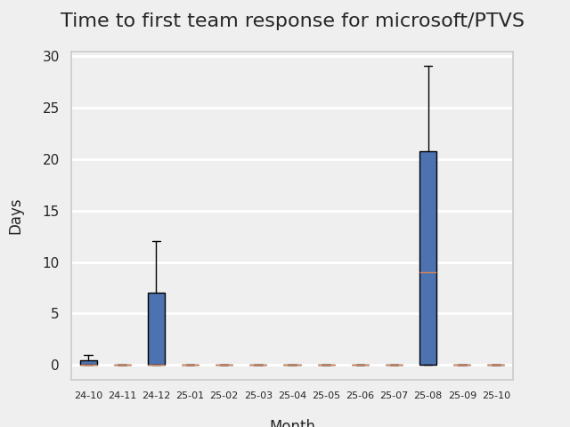

# GITHUB ISSUES REPORT FOR microsoft/PTVS

Generated on 2025-12-21 using: stale=30, all=True

* marks items that are new to report in past 7 day(s)

## FOR ISSUES THAT ARE MARKED AS BUGS:

### Issues in PTVS that need a response from team:

| Days Ago | Issue | Title |
| --- | --- | --- |
 |  OP:285  |[8194](https://github.com/microsoft/PTVS/issues/8194 "Code folding hides entire function/class names in Visual Studio #3580") | Code folding hides entire function/class names in Visual Studio #3580 |
 |  OP:291  |[8190](https://github.com/microsoft/PTVS/issues/8190 "Bracket auto-completion only works in first project.") | Bracket auto-completion only works in first project. |
 |  OP:956  |[7598](https://github.com/microsoft/PTVS/issues/7598 "Auto commenting lines using LF or CRLF ") | Auto commenting lines using LF or CRLF  |
 |  OP:1054  |[7367](https://github.com/microsoft/PTVS/issues/7367 "No output result after clicking 'Execute Project in Python Interactive'") | No output result after clicking 'Execute Project in Python Interactive' |
 |  OP:1270  |[7064](https://github.com/microsoft/PTVS/issues/7064 "Some intellisense don't work well in interactive window after writing some REPL commands") | Some intellisense don't work well in interactive window after writing some REPL commands |

### Issues in PTVS that have comments from OP after last team response:

| Days Ago | Issue | Title |
| --- | --- | --- |
 |  TM:311, OP:311  |[8121](https://github.com/microsoft/PTVS/issues/8121 "Features not working consistently: task list, navigation dropdown menus") | Features not working consistently: task list, navigation dropdown menus |
 |  TM:467, OP:466  |[7974](https://github.com/microsoft/PTVS/issues/7974 "No change with the type information when change the sys.exc_info with the latest typeshed. ") | No change with the type information when change the sys.exc_info with the latest typeshed.  |
 |  TM:670, OP:521  |[7828](https://github.com/microsoft/PTVS/issues/7828 "IntelliSense for Search Paths doesn't work when import folder outside the workspace.") | IntelliSense for Search Paths doesn't work when import folder outside the workspace. |
 |  TM:851, OP:849  |[7631](https://github.com/microsoft/PTVS/issues/7631 "An unexpected error occured when first creating the conda env.") | An unexpected error occured when first creating the conda env. |
 |  TM:1130, OP:1130  |[7219](https://github.com/microsoft/PTVS/issues/7219 "No output with using ipython interactive window") | No output with using ipython interactive window |
 |  TM:1031, OP:1031  |[7206](https://github.com/microsoft/PTVS/issues/7206 "The active environment doesn't change with the Cookiecutter Explorer is open") | The active environment doesn't change with the Cookiecutter Explorer is open |

### Issues in PTVS that have comments from 3rd party after last team response:

| Days Ago | Issue | Title |
| --- | --- | --- |
 |  P:215,  |[7868](https://github.com/microsoft/PTVS/issues/7868 "Interactive Window not working or displaying output ") | Interactive Window not working or displaying output  |
 |  P:419,  |[7068](https://github.com/microsoft/PTVS/issues/7068 "reportMissingImports : Even if the module is successfully installed, a warning will still be displayed in the Error List window") | reportMissingImports : Even if the module is successfully installed, a warning will still be displayed in the Error List window |
 |  P:197,  |[6900](https://github.com/microsoft/PTVS/issues/6900 "Python 3.10 fails to hit breakpoints when &quot;Native Code Debugging&quot; is enabled.") | Python 3.10 fails to hit breakpoints when "Native Code Debugging" is enabled. |

### Issues in PTVS that have no external responses since team response in 30+ days:

| Days Ago | Issue | Title |
| --- | --- | --- |
 |  TM:263  |[8171](https://github.com/microsoft/PTVS/issues/8171 "&quot;Compare Performance Reports&quot; feature is not working.") | "Compare Performance Reports" feature is not working. |
 |  TM:698  |[7807](https://github.com/microsoft/PTVS/issues/7807 "It showed empty class name when type @.") | It showed empty class name when type @. |
 |  TM:780  |[7745](https://github.com/microsoft/PTVS/issues/7745 "There is no info bar appear to suggest install pytest when Test Explorer is open ") | There is no info bar appear to suggest install pytest when Test Explorer is open  |
 |  TM:1032  |[6551](https://github.com/microsoft/PTVS/issues/6551 "Navigation bar is not working") | Navigation bar is not working |

---

## FOR ISSUES THAT ARE NOT MARKED AS BUGS:

### Issues in PTVS that need a response from team:

| Days Ago | Issue | Title |
| --- | --- | --- |
 | \* OP:2  |[8348](https://github.com/microsoft/PTVS/issues/8348 "Mypy's result does not refresh after the first execution")  |Mypy's result does not refresh after the first execution |
 |  OP:13  |[8346](https://github.com/microsoft/PTVS/issues/8346 "Unexpected error with request to report") | Unexpected error with request to report |
 |  OP:54  |[8315](https://github.com/microsoft/PTVS/issues/8315 "The option &quot;Python/Native Debugging&quot; is missing.") | The option "Python/Native Debugging" is missing. |
 |  OP:61  |[8309](https://github.com/microsoft/PTVS/issues/8309 "can't start python interpreter on visual studio 2022 community") | can't start python interpreter on visual studio 2022 community |
 |  OP:73  |[8303](https://github.com/microsoft/PTVS/issues/8303 "The interactive window not change to the selection virtual environment when open from solution explorer.") | The interactive window not change to the selection virtual environment when open from solution explorer. |
 |  OP:89  |[8294](https://github.com/microsoft/PTVS/issues/8294 "devenv.exe 发生意外错误") | devenv.exe 发生意外错误 |
 |  OP:130  |[8274](https://github.com/microsoft/PTVS/issues/8274 "It showed empty in Watch/Locals debugger windows when native debug with Python 3.11.") | It showed empty in Watch/Locals debugger windows when native debug with Python 3.11. |
 |  OP:151  |[8266](https://github.com/microsoft/PTVS/issues/8266 "NullReferenceException") | NullReferenceException |
 |  OP:151  |[8265](https://github.com/microsoft/PTVS/issues/8265 "Python>=3.11 is not in the list of language versions.") | Python>=3.11 is not in the list of language versions. |
 |  OP:164  |[8261](https://github.com/microsoft/PTVS/issues/8261 "&quot;An unexpected error occurred&quot; while opening solution file.") | "An unexpected error occurred" while opening solution file. |
 |  OP:174  |[8259](https://github.com/microsoft/PTVS/issues/8259 "import dill   is unresolved in VS 2022 Community") | import dill   is unresolved in VS 2022 Community |
 |  OP:186  |[8256](https://github.com/microsoft/PTVS/issues/8256 "vs关闭时有bug") | vs关闭时有bug |
 |  OP:190  |[8255](https://github.com/microsoft/PTVS/issues/8255 "The &quot;Enable Mixed Mode Debugging&quot; feature in Python projects seems not to support the python3.13t (free-threaded) version.") | The "Enable Mixed Mode Debugging" feature in Python projects seems not to support the python3.13t (free-threaded) version. |
 |  OP:227  |[8230](https://github.com/microsoft/PTVS/issues/8230 "VS can only recognize one environment when Python and Anaconda have the same version.") | VS can only recognize one environment when Python and Anaconda have the same version. |
 |  OP:236  |[8209](https://github.com/microsoft/PTVS/issues/8209 "Error List only works in first project.") | Error List only works in first project. |
 |  OP:254  |[8204](https://github.com/microsoft/PTVS/issues/8204 "Cannot build a project with RunPythonCommand task from MSBuild/command line") | Cannot build a project with RunPythonCommand task from MSBuild/command line |
 |  OP:298  |[8184](https://github.com/microsoft/PTVS/issues/8184 "Empty error dialog when trying to run Python file with no Python installed") | Empty error dialog when trying to run Python file with no Python installed |
 |  OP:319  |[8160](https://github.com/microsoft/PTVS/issues/8160 "Failed to create &quot;GitHub->cookiecutter-flask/cookiecutter-flask&quot; template in Cookiecutter.") | Failed to create "GitHub->cookiecutter-flask/cookiecutter-flask" template in Cookiecutter. |
 |  OP:334  |[8143](https://github.com/microsoft/PTVS/issues/8143 "Adding a Flask web project to a docker-orchestration results in WebRole.dll error.") | Adding a Flask web project to a docker-orchestration results in WebRole.dll error. |
 |  OP:439  |[8020](https://github.com/microsoft/PTVS/issues/8020 "An error notification pops up after clicking Add Debug Configuration.") | An error notification pops up after clicking Add Debug Configuration. |
 |  OP:489  |[7983](https://github.com/microsoft/PTVS/issues/7983 "Open interactive window，loading all the time after entering enter in the Anaconda environment.") | Open interactive window，loading all the time after entering enter in the Anaconda environment. |
 |  OP:494  |[7978](https://github.com/microsoft/PTVS/issues/7978 "The &quot;remove unused imports&quot; and &quot;Extract method&quot; quick action icons appear only when you select a code.") | The "remove unused imports" and "Extract method" quick action icons appear only when you select a code. |
 |  OP:680  |[7823](https://github.com/microsoft/PTVS/issues/7823 "Unexpected error occured. About Conda env.") | Unexpected error occured. About Conda env. |
 |  OP:705  |[7805](https://github.com/microsoft/PTVS/issues/7805 "Refactor rename incorrect when the referenced method is defined in another project.") | Refactor rename incorrect when the referenced method is defined in another project. |
 |  OP:824  |[7725](https://github.com/microsoft/PTVS/issues/7725 "The VS crashed after choose the progress when remote debug.") | The VS crashed after choose the progress when remote debug. |
 |  OP:856  |[7701](https://github.com/microsoft/PTVS/issues/7701 "No IntelliSense when import a new created django app.") | No IntelliSense when import a new created django app. |
 |  OP:946  |[7616](https://github.com/microsoft/PTVS/issues/7616 "Lots of debug symbols are being loaded at every application start") | Lots of debug symbols are being loaded at every application start |
 |  OP:956  |[7600](https://github.com/microsoft/PTVS/issues/7600 "Modal pop-up persists when a breakpoint cannot resolve conditional expression ") | Modal pop-up persists when a breakpoint cannot resolve conditional expression  |
 |  OP:1069  |[7330](https://github.com/microsoft/PTVS/issues/7330 "Unable to create DLL for C++ ") | Unable to create DLL for C++  |
 |  OP:1101  |[7274](https://github.com/microsoft/PTVS/issues/7274 "Changing error messages - differences in reported errors between VS and pyright cli") | Changing error messages - differences in reported errors between VS and pyright cli |

### Issues in PTVS that have comments from OP after last team response:

| Days Ago | Issue | Title |
| --- | --- | --- |
 |  TM:158, OP:149  |[8263](https://github.com/microsoft/PTVS/issues/8263 "Env folder not showing in Git Changes after creating virtual environment only with Python3.13.") | Env folder not showing in Git Changes after creating virtual environment only with Python3.13. |
 |  TM:341, OP:341  |[8136](https://github.com/microsoft/PTVS/issues/8136 "After installing a package for the first time on Microsoft Store Python, 'pip list' only shows the installed package.") | After installing a package for the first time on Microsoft Store Python, 'pip list' only shows the installed package. |
 |  TM:352, OP:349  |[8125](https://github.com/microsoft/PTVS/issues/8125 "Format Document not responding.") | Format Document not responding. |
 |  TM:370, OP:369  |[7984](https://github.com/microsoft/PTVS/issues/7984 "Cannot run all tests in a large number of tests.") | Cannot run all tests in a large number of tests. |
 |  TM:719, OP:718  |[7794](https://github.com/microsoft/PTVS/issues/7794 "Unable to debug python code in a C++ application that embeds the python interpreter") | Unable to debug python code in a C++ application that embeds the python interpreter |
 |  TM:753, OP:752  |[7760](https://github.com/microsoft/PTVS/issues/7760 "Failed to create &quot;tiangolo/full-stack-fastapi-postgresql&quot; template in Cookiecutter. ") | Failed to create "tiangolo/full-stack-fastapi-postgresql" template in Cookiecutter.  |
 |  TM:781, OP:781  |[7743](https://github.com/microsoft/PTVS/issues/7743 "environment load sequence broken") | environment load sequence broken |
 |  TM:717, OP:716  |[7724](https://github.com/microsoft/PTVS/issues/7724 "An error pops up after clicking 'Find' when attach to python remote.") | An error pops up after clicking 'Find' when attach to python remote. |
 |  TM:970, OP:962  |[7429](https://github.com/microsoft/PTVS/issues/7429 "Start without Debug and Start with Debug button not available in right click menu") | Start without Debug and Start with Debug button not available in right click menu |
 |  TM:1258, OP:516  |[6974](https://github.com/microsoft/PTVS/issues/6974 "No IntelliSense when import folder under the workspace.") | No IntelliSense when import folder under the workspace. |
 |  TM:949, OP:608  |[6936](https://github.com/microsoft/PTVS/issues/6936 "Skip tests after clicking “Analyze Code Coverage”.") | Skip tests after clicking “Analyze Code Coverage”. |
 |  TM:402, OP:398  |[6853](https://github.com/microsoft/PTVS/issues/6853 "Unable to install suggested module when using IPython interactive mode.") | Unable to install suggested module when using IPython interactive mode. |
 |  TM:1516, OP:1056  |[6750](https://github.com/microsoft/PTVS/issues/6750 "An error pops up when run &quot;Django Check, Django Migrate, Django Create Superuser...&quot;. ") | An error pops up when run "Django Check, Django Migrate, Django Create Superuser...".  |
 |  TM:1080, OP:825  |[6876](https://github.com/microsoft/PTVS/issues/6876 "Extract method only works on one line and rename doesn't work at all") | Extract method only works on one line and rename doesn't work at all |
 |  TM:1584, OP:1283  |[6639](https://github.com/microsoft/PTVS/issues/6639 " IntelliSense does not work when changed SearchPath in PythonSettings.json file in open folder.") |  IntelliSense does not work when changed SearchPath in PythonSettings.json file in open folder. |

### Issues in PTVS that have comments from 3rd party after last team response:

| Days Ago | Issue | Title |
| --- | --- | --- |
 |  P:348,  |[8124](https://github.com/microsoft/PTVS/issues/8124 "This prompt box information is not fully displayed when remove virtual environment from project.") | This prompt box information is not fully displayed when remove virtual environment from project. |
 |  P:84,  |[7829](https://github.com/microsoft/PTVS/issues/7829 "&quot;Python was not found; run without arguments to install from the Microsoft Store...&quot; appeared in Python project. ") | "Python was not found; run without arguments to install from the Microsoft Store..." appeared in Python project.  |

### Issues in PTVS that have no external responses since team response in 30+ days:

| Days Ago | Issue | Title |
| --- | --- | --- |
 | \* TM:34  |[8335](https://github.com/microsoft/PTVS/issues/8335 "An error module 'ast' has no attribute 'Str' when use Python 3.14 to launch Flask/Jade Web Project.")  |An error module 'ast' has no attribute 'Str' when use Python 3.14 to launch Flask/Jade Web Project. |
 |  TM:54  |[8314](https://github.com/microsoft/PTVS/issues/8314 "Python3.14 failed to hit breakpoint when enable naitve code debug.") | Python3.14 failed to hit breakpoint when enable naitve code debug. |
 |  TM:66  |[8305](https://github.com/microsoft/PTVS/issues/8305 "Visual Studio Insiders Python debugpy attach to remote process fails to get target process.") | Visual Studio Insiders Python debugpy attach to remote process fails to get target process. |
 |  TM:81  |[8296](https://github.com/microsoft/PTVS/issues/8296 "Error opening python 3.13 interactive window") | Error opening python 3.13 interactive window |
 |  TM:89  |[8276](https://github.com/microsoft/PTVS/issues/8276 "Cannot locate performance tools when launching python profiling") | Cannot locate performance tools when launching python profiling |
 |  TM:298  |[8179](https://github.com/microsoft/PTVS/issues/8179 "【逆天BUG】在VS中，使用Python交互式窗口代码小测试会转圈无限等待") | 【逆天BUG】在VS中，使用Python交互式窗口代码小测试会转圈无限等待 |
 |  TM:837  |[7715](https://github.com/microsoft/PTVS/issues/7715 "After switching to the &quot;Packages&quot; window a second time, the packages are not displayed.") | After switching to the "Packages" window a second time, the packages are not displayed. |
 |  TM:321  |[7604](https://github.com/microsoft/PTVS/issues/7604 "Django IntelliSense in html files doesn't work.") | Django IntelliSense in html files doesn't work. |
 |  TM:969  |[7541](https://github.com/microsoft/PTVS/issues/7541 "The 'environment.yml' file can not be detected to create a conda env when reload project") | The 'environment.yml' file can not be detected to create a conda env when reload project |

## PULL REQUEST ACTIVITY

### Pull Requests still open that were opened more than 7 days ago:

| | PR | Created By | Created | Days Open | Closed/Merged | Closed/Merged By | Title |
| --- | --- | --- | --- | --- | --- | --- | --- |
| \* | [#7702](https://github.com/microsoft/PTVS/pull/7702) | hassan20990 | 2023-08-23 | 851 | - | - | Refactor tests |
| \* | [#7779](https://github.com/microsoft/PTVS/pull/7779) | StellaHuang95 | 2023-12-07 | 745 | - | - | [Draft] Add python 3.12 support |
| \* | [#8252](https://github.com/microsoft/PTVS/pull/8252) | csigs | 2025-06-04 | 200 | - | - | LEGO: Pull request from lego/hb_00719690-99d0-4d46-875c-cfd2b9712715_20250604191653612 to main |
| \* | [#8298](https://github.com/microsoft/PTVS/pull/8298) | csigs | 2025-10-02 | 80 | - | - | LEGO: Pull request from lego/hb_00719690-99d0-4d46-875c-cfd2b9712715_20251002091747850 to main |
| \* | [#8304](https://github.com/microsoft/PTVS/pull/8304) | csigs | 2025-10-15 | 67 | - | - | LEGO: Pull request from lego/hb_00719690-99d0-4d46-875c-cfd2b9712715_20251015191305309 to main |
| \* | [#8320](https://github.com/microsoft/PTVS/pull/8320) | csigs | 2025-11-04 | 47 | - | - | LEGO: Pull request from lego/hb_00719690-99d0-4d46-875c-cfd2b9712715_20251104201350838 to main |
| \* | [#8321](https://github.com/microsoft/PTVS/pull/8321) | csigs | 2025-11-06 | 45 | - | - | LEGO: Pull request from lego/hb_00719690-99d0-4d46-875c-cfd2b9712715_20251106201251219 to main |
| \* | [#8337](https://github.com/microsoft/PTVS/pull/8337) | bschnurr | 2025-11-27 | 24 | - | - | improve TestExplorer test |
| \* | [#8338](https://github.com/microsoft/PTVS/pull/8338) | bschnurr | 2025-11-27 | 24 | - | - | Fix TestExplorer by selecting the grouping button in this form 'Proje… |
| \* | [#8344](https://github.com/microsoft/PTVS/pull/8344) | bschnurr | 2025-12-05 | 16 | - | - | NOT readay: Add dynamic runtimesettings (#8341) |
| \* | [#8345](https://github.com/microsoft/PTVS/pull/8345) | csigs | 2025-12-06 | 15 | - | - | LEGO: Pull request from lego/hb_00719690-99d0-4d46-875c-cfd2b9712715_20251206201415174 to main |
|   | [#8347](https://github.com/microsoft/PTVS/pull/8347) | csigs | 2025-12-09 | 12 | - | - | LEGO: Pull request from lego/hb_00719690-99d0-4d46-875c-cfd2b9712715_20251209201138188 to main |

## MOST FREQUENTLY CHANGED FILES (by # of PRs):

 13: package.json

 11: azure-pipelines.yml

  9: Build/debugpy-version.txt

  5: Python/Product/PythonTools/PythonTools/LanguageServerClient/PythonLanguageClient.cs

  5: Python/Product/Profiling/PythonProfilingPackage.cs

