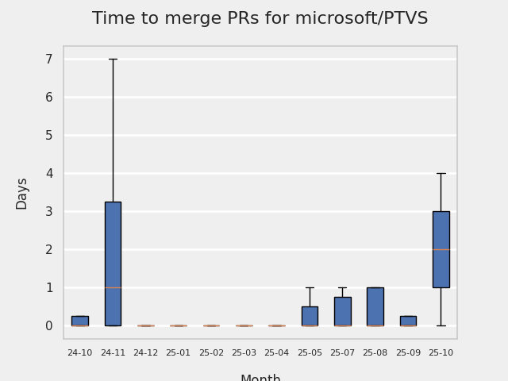
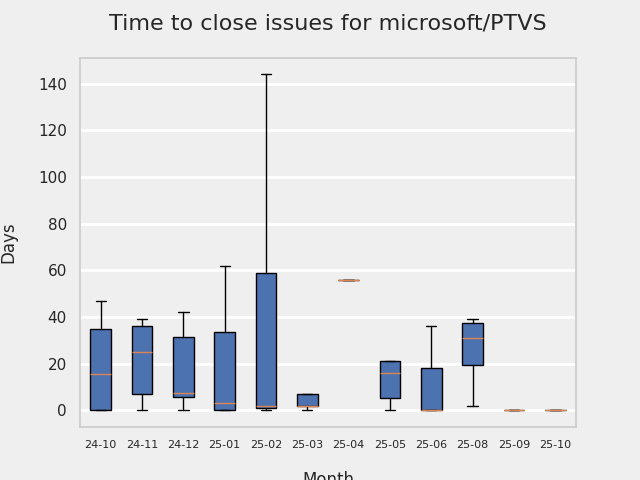

# GITHUB ISSUES REPORT FOR microsoft/PTVS

Generated on 2024-10-07 using: stale=30, all=True

* marks items that are new to report in past 1 day(s)

## FOR ISSUES THAT ARE MARKED AS BUGS:

### Issues in PTVS that need a response from team:

| Days Ago | Issue | Title |
| --- | --- | --- |
 |  OP:515  |[7598](https://github.com/microsoft/PTVS/issues/7598 "Auto commenting lines using LF or CRLF ") | Auto commenting lines using LF or CRLF  |
 |  OP:613  |[7367](https://github.com/microsoft/PTVS/issues/7367 "No output result after clicking 'Execute Project in Python Interactive'") | No output result after clicking 'Execute Project in Python Interactive' |
 |  OP:829  |[7064](https://github.com/microsoft/PTVS/issues/7064 "Some intellisense don't work well in interactive window after writing some REPL commands") | Some intellisense don't work well in interactive window after writing some REPL commands |

### Issues in PTVS that have comments from OP after last team response:

| Days Ago | Issue | Title |
| --- | --- | --- |
 |  TM:26, OP:25  |[7974](https://github.com/microsoft/PTVS/issues/7974 "No change with the type information when change the sys.exc_info with the latest typeshed. ") | No change with the type information when change the sys.exc_info with the latest typeshed.  |
 |  TM:26, OP:25  |[7958](https://github.com/microsoft/PTVS/issues/7958 "Checking &quot;Automatically add brackets to functions&quot; has no effect.") | Checking "Automatically add brackets to functions" has no effect. |
 |  TM:229, OP:80  |[7828](https://github.com/microsoft/PTVS/issues/7828 "IntelliSense for Search Paths doesn't work when import folder outside the workspace.") | IntelliSense for Search Paths doesn't work when import folder outside the workspace. |
 |  TM:410, OP:408  |[7631](https://github.com/microsoft/PTVS/issues/7631 "An unexpected error occured when first creating the conda env.") | An unexpected error occured when first creating the conda env. |
 |  TM:689, OP:689  |[7219](https://github.com/microsoft/PTVS/issues/7219 "No output with using ipython interactive window") | No output with using ipython interactive window |
 |  TM:591, OP:590  |[7206](https://github.com/microsoft/PTVS/issues/7206 "The active environment doesn't change with the Cookiecutter Explorer is open") | The active environment doesn't change with the Cookiecutter Explorer is open |

### Issues in PTVS that have comments from 3rd party after last team response:

| Days Ago | Issue | Title |
| --- | --- | --- |
 | \* P:0,  |[7868](https://github.com/microsoft/PTVS/issues/7868 "Interactive Window not working or displaying output ")  |Interactive Window not working or displaying output  |
 |  P:82,  |[7068](https://github.com/microsoft/PTVS/issues/7068 "reportMissingImports : Even if the module is successfully installed, a warning will still be displayed in the Error List window") | reportMissingImports : Even if the module is successfully installed, a warning will still be displayed in the Error List window |
 |  P:584,  |[6774](https://github.com/microsoft/PTVS/issues/6774 "The Python installed from Microsoft Store couldn't view installed packages when first use the environment.") | The Python installed from Microsoft Store couldn't view installed packages when first use the environment. |

### Issues in PTVS that have no external responses since team response in 30+ days:

| Days Ago | Issue | Title |
| --- | --- | --- |
 |  TM:54  |[7930](https://github.com/microsoft/PTVS/issues/7930 "Catastrophic failure (Exception from HRESULT: 0x8000FFFF (E_UNEXPECTED)) [FindActiveProjectCfg @ SolutionBuildManager.cs:2222]") | Catastrophic failure (Exception from HRESULT: 0x8000FFFF (E_UNEXPECTED)) [FindActiveProjectCfg @ SolutionBuildManager.cs:2222] |
 |  TM:118  |[7923](https://github.com/microsoft/PTVS/issues/7923 "Anaconda displays incorrectly in environment list.") | Anaconda displays incorrectly in environment list. |
 |  TM:257  |[7807](https://github.com/microsoft/PTVS/issues/7807 "It showed empty class name when type @.") | It showed empty class name when type @. |
 |  TM:339  |[7745](https://github.com/microsoft/PTVS/issues/7745 "There is no info bar appear to suggest install pytest when Test Explorer is open ") | There is no info bar appear to suggest install pytest when Test Explorer is open  |
 |  TM:52  |[6900](https://github.com/microsoft/PTVS/issues/6900 "Python 3.10 fails to hit breakpoints when &quot;Native Code Debugging&quot; is enabled.") | Python 3.10 fails to hit breakpoints when "Native Code Debugging" is enabled. |
 |  TM:591  |[6551](https://github.com/microsoft/PTVS/issues/6551 "Navigation bar is not working") | Navigation bar is not working |

---

## FOR ISSUES THAT ARE NOT MARKED AS BUGS:

### Issues in PTVS that need a response from team:

| Days Ago | Issue | Title |
| --- | --- | --- |
 |  OP:25  |[7995](https://github.com/microsoft/PTVS/issues/7995 "VS Crashes When Loading Cookie Template.") | VS Crashes When Loading Cookie Template. |
 |  OP:47  |[7984](https://github.com/microsoft/PTVS/issues/7984 "Cannot run all tests in a large number of tests.") | Cannot run all tests in a large number of tests. |
 |  OP:48  |[7983](https://github.com/microsoft/PTVS/issues/7983 "Open interactive window，loading all the time after entering enter in the Anaconda environment.") | Open interactive window，loading all the time after entering enter in the Anaconda environment. |
 |  OP:53  |[7978](https://github.com/microsoft/PTVS/issues/7978 "The &quot;remove unused imports&quot; and &quot;Extract method&quot; quick action icons appear only when you select a code.") | The "remove unused imports" and "Extract method" quick action icons appear only when you select a code. |
 |  OP:239  |[7823](https://github.com/microsoft/PTVS/issues/7823 "Unexpected error occured. About Conda env.") | Unexpected error occured. About Conda env. |
 |  OP:264  |[7805](https://github.com/microsoft/PTVS/issues/7805 "Refactor rename incorrect when the referenced method is defined in another project.") | Refactor rename incorrect when the referenced method is defined in another project. |
 |  OP:383  |[7725](https://github.com/microsoft/PTVS/issues/7725 "The VS crashed after choose the progress when remote debug.") | The VS crashed after choose the progress when remote debug. |
 |  OP:415  |[7701](https://github.com/microsoft/PTVS/issues/7701 "No IntelliSense when import a new created django app.") | No IntelliSense when import a new created django app. |
 |  OP:505  |[7616](https://github.com/microsoft/PTVS/issues/7616 "Lots of debug symbols are being loaded at every application start") | Lots of debug symbols are being loaded at every application start |
 |  OP:515  |[7600](https://github.com/microsoft/PTVS/issues/7600 "Modal pop-up persists when a breakpoint cannot resolve conditional expression ") | Modal pop-up persists when a breakpoint cannot resolve conditional expression  |
 |  OP:628  |[7330](https://github.com/microsoft/PTVS/issues/7330 "Unable to create DLL for C++ ") | Unable to create DLL for C++  |
 |  OP:660  |[7274](https://github.com/microsoft/PTVS/issues/7274 "Changing error messages - differences in reported errors between VS and pyright cli") | Changing error messages - differences in reported errors between VS and pyright cli |
 |  OP:992  |[6853](https://github.com/microsoft/PTVS/issues/6853 "Unable to install suggested module when using IPython interactive mode.") | Unable to install suggested module when using IPython interactive mode. |

### Issues in PTVS that have comments from OP after last team response:

| Days Ago | Issue | Title |
| --- | --- | --- |
 |  TM:104, OP:104  |[7829](https://github.com/microsoft/PTVS/issues/7829 "&quot;Python was not found; run without arguments to install from the Microsoft Store...&quot; appeared in Python project. ") | "Python was not found; run without arguments to install from the Microsoft Store..." appeared in Python project.  |
 |  TM:278, OP:277  |[7794](https://github.com/microsoft/PTVS/issues/7794 "Unable to debug python code in a C++ application that embeds the python interpreter") | Unable to debug python code in a C++ application that embeds the python interpreter |
 |  TM:312, OP:311  |[7760](https://github.com/microsoft/PTVS/issues/7760 "Failed to create &quot;tiangolo/full-stack-fastapi-postgresql&quot; template in Cookiecutter. ") | Failed to create "tiangolo/full-stack-fastapi-postgresql" template in Cookiecutter.  |
 |  TM:340, OP:340  |[7743](https://github.com/microsoft/PTVS/issues/7743 "environment load sequence broken") | environment load sequence broken |
 |  TM:276, OP:276  |[7724](https://github.com/microsoft/PTVS/issues/7724 "An error pops up after clicking 'Find' when attach to python remote.") | An error pops up after clicking 'Find' when attach to python remote. |
 |  TM:529, OP:521  |[7429](https://github.com/microsoft/PTVS/issues/7429 "Start without Debug and Start with Debug button not available in right click menu") | Start without Debug and Start with Debug button not available in right click menu |
 |  TM:817, OP:75  |[6974](https://github.com/microsoft/PTVS/issues/6974 "No IntelliSense when import folder under the workspace.") | No IntelliSense when import folder under the workspace. |
 |  TM:508, OP:167  |[6936](https://github.com/microsoft/PTVS/issues/6936 "Skip tests after clicking “Analyze Code Coverage”.") | Skip tests after clicking “Analyze Code Coverage”. |
 |  TM:1075, OP:615  |[6750](https://github.com/microsoft/PTVS/issues/6750 "An error pops up when run &quot;Django Check, Django Migrate, Django Create Superuser...&quot;. ") | An error pops up when run "Django Check, Django Migrate, Django Create Superuser...".  |
 |  TM:639, OP:384  |[6876](https://github.com/microsoft/PTVS/issues/6876 "Extract method only works on one line and rename doesn't work at all") | Extract method only works on one line and rename doesn't work at all |
 |  TM:1143, OP:843  |[6639](https://github.com/microsoft/PTVS/issues/6639 " IntelliSense does not work when changed SearchPath in PythonSettings.json file in open folder.") |  IntelliSense does not work when changed SearchPath in PythonSettings.json file in open folder. |

### Issues in PTVS that have comments from 3rd party after last team response:

| Days Ago | Issue | Title |
| --- | --- | --- |
 |  P:517,  |[7118](https://github.com/microsoft/PTVS/issues/7118 "IPython interactive mode always freezing") | IPython interactive mode always freezing |

### Issues in PTVS that have no external responses since team response in 30+ days:

| Days Ago | Issue | Title |
| --- | --- | --- |
 |  TM:396  |[7715](https://github.com/microsoft/PTVS/issues/7715 "After switching to the &quot;Packages&quot; window a second time, the packages are not displayed.") | After switching to the "Packages" window a second time, the packages are not displayed. |
 |  TM:251  |[7637](https://github.com/microsoft/PTVS/issues/7637 "IntelliSense hangs indefinitely on various occasions, only process restart helps") | IntelliSense hangs indefinitely on various occasions, only process restart helps |
 |  TM:528  |[7541](https://github.com/microsoft/PTVS/issues/7541 "The 'environment.yml' file can not be detected to create a conda env when reload project") | The 'environment.yml' file can not be detected to create a conda env when reload project |
 |  TM:612  |[125](https://github.com/microsoft/PTVS/issues/125 "Automatically attach to subprocesses when debugging") | Automatically attach to subprocesses when debugging |

## MOST FREQUENTLY CHANGED FILES (by # of PRs):

  7: azure-pipelines.yml

  6: package.json

  5: azure-pipelines-release.yml

  5: Python/Product/PythonTools/PythonTools/LanguageServerClient/PythonLanguageClient.cs

