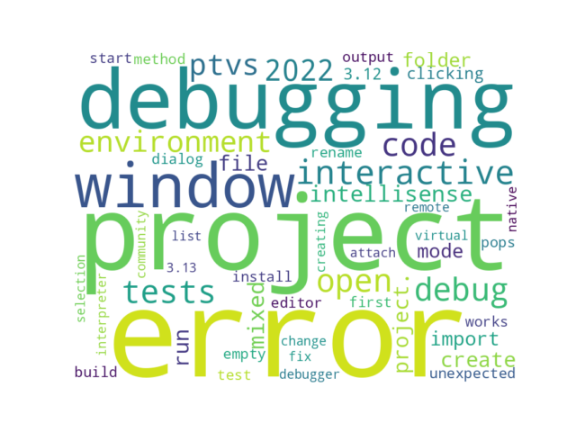

# GITHUB ISSUES REPORT FOR microsoft/PTVS


Generated on 2024-08-05 using: stale=30, all=True


* marks items that are new to report in past 1 day(s)


## FOR ISSUES THAT ARE MARKED AS BUGS:


### Issues in PTVS that need a response from team:

| Days Ago | Issue | Title |
| --- | --- | --- |
 |  OP:1021  |[6760](https://github.com/microsoft/PTVS/issues/6760 "Evaluates all the expressions in interactive windows ignore the Completion Mode setting.") | Evaluates all the expressions in interactive windows ignore the Completion Mode setting. |
 |  OP:767  |[7064](https://github.com/microsoft/PTVS/issues/7064 "Some intellisense don't work well in interactive window after writing some REPL commands") | Some intellisense don't work well in interactive window after writing some REPL commands |
 |  OP:551  |[7367](https://github.com/microsoft/PTVS/issues/7367 "No output result after clicking 'Execute Project in Python Interactive'") | No output result after clicking 'Execute Project in Python Interactive' |
 |  OP:452  |[7598](https://github.com/microsoft/PTVS/issues/7598 "Auto commenting lines using LF or CRLF ") | Auto commenting lines using LF or CRLF  |
 |  OP:357  |[7696](https://github.com/microsoft/PTVS/issues/7696 "Go To All can't find the method where is defined in another project") | Go To All can't find the method where is defined in another project |
 |  OP:117  |[7868](https://github.com/microsoft/PTVS/issues/7868 "Interactive Window not working or displaying output ") | Interactive Window not working or displaying output  |

### Issues in PTVS that have comments from OP after last team response:

| Days Ago | Issue | Title |
| --- | --- | --- |
 |  TM:1012, OP:553  |[6750](https://github.com/microsoft/PTVS/issues/6750 "An error pops up when run &quot;Django Check, Django Migrate, Django Create Superuser...&quot;. ") | An error pops up when run "Django Check, Django Migrate, Django Create Superuser...".  |
 |  TM:636, OP:636  |[6762](https://github.com/microsoft/PTVS/issues/6762 "Unchecked &quot;Parameter information&quot; still has signature help.") | Unchecked "Parameter information" still has signature help. |
 |  TM:549, OP:14  |[6900](https://github.com/microsoft/PTVS/issues/6900 "Python 3.10 fails to hit breakpoints when &quot;Native Code Debugging&quot; is enabled.") | Python 3.10 fails to hit breakpoints when "Native Code Debugging" is enabled. |
 |  TM:528, OP:528  |[7206](https://github.com/microsoft/PTVS/issues/7206 "The active environment doesn't change with the Cookiecutter Explorer is open") | The active environment doesn't change with the Cookiecutter Explorer is open |
 |  TM:626, OP:626  |[7219](https://github.com/microsoft/PTVS/issues/7219 "No output with using ipython interactive window") | No output with using ipython interactive window |
 |  TM:347, OP:346  |[7631](https://github.com/microsoft/PTVS/issues/7631 "An unexpected error occured when first creating the conda env.") | An unexpected error occured when first creating the conda env. |
 |  TM:166, OP:18  |[7828](https://github.com/microsoft/PTVS/issues/7828 "IntelliSense for Search Paths doesn't work when import folder outside the workspace.") | IntelliSense for Search Paths doesn't work when import folder outside the workspace. |

### Issues in PTVS that have comments from 3rd party after last team response:

| Days Ago | Issue | Title |
| --- | --- | --- |
 |  P:145,  |[6538](https://github.com/microsoft/PTVS/issues/6538 "No static analysis suggestions in Interactive window.") | No static analysis suggestions in Interactive window. |
 |  P:522,  |[6774](https://github.com/microsoft/PTVS/issues/6774 "The Python installed from Microsoft Store couldn't view installed packages when first use the environment.") | The Python installed from Microsoft Store couldn't view installed packages when first use the environment. |
 |  P:20,  |[7068](https://github.com/microsoft/PTVS/issues/7068 "reportMissingImports : Even if the module is successfully installed, a warning will still be displayed in the Error List window") | reportMissingImports : Even if the module is successfully installed, a warning will still be displayed in the Error List window |
 |  P:88,  |[7520](https://github.com/microsoft/PTVS/issues/7520 " Visual Studio 2022 keeps breaking on exception which seems to be handled in Python internally") |  Visual Studio 2022 keeps breaking on exception which seems to be handled in Python internally |

### Issues in PTVS that have no external responses since team response in 30+ days:

| Days Ago | Issue | Title |
| --- | --- | --- |
 |  TM:528  |[6551](https://github.com/microsoft/PTVS/issues/6551 "Navigation bar is not working") | Navigation bar is not working |
 |  TM:277  |[7745](https://github.com/microsoft/PTVS/issues/7745 "There is no info bar appear to suggest install pytest when Test Explorer is open ") | There is no info bar appear to suggest install pytest when Test Explorer is open  |
 |  TM:194  |[7807](https://github.com/microsoft/PTVS/issues/7807 "It showed empty class name when type @.") | It showed empty class name when type @. |
 |  TM:55  |[7923](https://github.com/microsoft/PTVS/issues/7923 "Anaconda displays incorrectly in environment list.") | Anaconda displays incorrectly in environment list. |

---

## FOR ISSUES THAT ARE NOT MARKED AS BUGS:


### Issues in PTVS that need a response from team:

| Days Ago | Issue | Title |
| --- | --- | --- |
 |  OP:930  |[6853](https://github.com/microsoft/PTVS/issues/6853 "Unable to install suggested module when using IPython interactive mode.") | Unable to install suggested module when using IPython interactive mode. |
 |  OP:598  |[7274](https://github.com/microsoft/PTVS/issues/7274 "Changing error messages - differences in reported errors between VS and pyright cli") | Changing error messages - differences in reported errors between VS and pyright cli |
 |  OP:565  |[7330](https://github.com/microsoft/PTVS/issues/7330 "Unable to create DLL for C++ ") | Unable to create DLL for C++  |
 |  OP:452  |[7600](https://github.com/microsoft/PTVS/issues/7600 "Modal pop-up persists when a breakpoint cannot resolve conditional expression ") | Modal pop-up persists when a breakpoint cannot resolve conditional expression  |
 |  OP:443  |[7616](https://github.com/microsoft/PTVS/issues/7616 "Lots of debug symbols are being loaded at every application start") | Lots of debug symbols are being loaded at every application start |
 |  OP:353  |[7701](https://github.com/microsoft/PTVS/issues/7701 "No IntelliSense when import a new created django app.") | No IntelliSense when import a new created django app. |
 |  OP:321  |[7725](https://github.com/microsoft/PTVS/issues/7725 "The VS crashed after choose the progress when remote debug.") | The VS crashed after choose the progress when remote debug. |
 |  OP:202  |[7805](https://github.com/microsoft/PTVS/issues/7805 "Refactor rename incorrect when the referenced method is defined in another project.") | Refactor rename incorrect when the referenced method is defined in another project. |
 |  OP:177  |[7823](https://github.com/microsoft/PTVS/issues/7823 "Unexpected error occured. About Conda env.") | Unexpected error occured. About Conda env. |
 |  OP:155  |[7843](https://github.com/microsoft/PTVS/issues/7843 "Bogus Environment Names in UI") | Bogus Environment Names in UI |
 |  OP:4  |[7962](https://github.com/microsoft/PTVS/issues/7962 "use of macro in pyproj Interpreter Include does not appear to work") | use of macro in pyproj Interpreter Include does not appear to work |
 |  OP:4  |[7966](https://github.com/microsoft/PTVS/issues/7966 "[Window Title] devenv.exe  [Main Instruction] An unexpected error occurred  [Content] Please press Ctrl+C to copy the contents of this dialog and report this error to our issue tracker.  [V] Show details  [Close]  [Expanded Information] ``` Build: 17.0.23262.1  System.ObjectDisposedException: Cannot access a disposed object.    at Microsoft.VisualStudioTools.Project.ProjectNode.GetMsBuildProperty(String propertyName, Boolean resetCache)    at Microsoft.VisualStudioTools.Project.ProjectNode.GetProjectProperty(String propertyName, Boolean resetCache)    at Microsoft.PythonTools.Project.CondaEnvCreateProjectInfoBar.<CheckAsync>d__4.MoveNext() --- End of stack trace from previous location where exception was thrown ---    at System.Runtime.ExceptionServices.ExceptionDispatchInfo.Throw()    at System.Runtime.CompilerServices.TaskAwaiter.HandleNonSuccessAndDebuggerNotification(Task task)    at Microsoft.PythonTools.Infrastructure.VSTaskExtensions.<HandleAllExceptions>d__5.MoveNext() ```") | [Window Title] devenv.exe  [Main Instruction] An unexpected error occurred  [Content] Please press Ctrl+C to copy the contents of this dialog and report this error to our issue tracker.  [V] Show details  [Close]  [Expanded Information] ``` Build: 17.0.23262.1  System.ObjectDisposedException: Cannot access a disposed object.    at Microsoft.VisualStudioTools.Project.ProjectNode.GetMsBuildProperty(String propertyName, Boolean resetCache)    at Microsoft.VisualStudioTools.Project.ProjectNode.GetProjectProperty(String propertyName, Boolean resetCache)    at Microsoft.PythonTools.Project.CondaEnvCreateProjectInfoBar.<CheckAsync>d__4.MoveNext() --- End of stack trace from previous location where exception was thrown ---    at System.Runtime.ExceptionServices.ExceptionDispatchInfo.Throw()    at System.Runtime.CompilerServices.TaskAwaiter.HandleNonSuccessAndDebuggerNotification(Task task)    at Microsoft.PythonTools.Infrastructure.VSTaskExtensions.<HandleAllExceptions>d__5.MoveNext() ``` |
 | \* OP:0  |[7970](https://github.com/microsoft/PTVS/issues/7970 "VS will crash and restart when load Cookie template. ")  |VS will crash and restart when load Cookie template.  |

### Issues in PTVS that have comments from OP after last team response:

| Days Ago | Issue | Title |
| --- | --- | --- |
 |  TM:1081, OP:780  |[6639](https://github.com/microsoft/PTVS/issues/6639 " IntelliSense does not work when changed SearchPath in PythonSettings.json file in open folder.") |  IntelliSense does not work when changed SearchPath in PythonSettings.json file in open folder. |
 |  TM:576, OP:322  |[6876](https://github.com/microsoft/PTVS/issues/6876 "Extract method only works on one line and rename doesn't work at all") | Extract method only works on one line and rename doesn't work at all |
 |  TM:446, OP:105  |[6936](https://github.com/microsoft/PTVS/issues/6936 "Skip tests after clicking “Analyze Code Coverage”.") | Skip tests after clicking “Analyze Code Coverage”. |
 |  TM:755, OP:13  |[6974](https://github.com/microsoft/PTVS/issues/6974 "No IntelliSense when import folder under the workspace.") | No IntelliSense when import folder under the workspace. |
 |  TM:466, OP:459  |[7429](https://github.com/microsoft/PTVS/issues/7429 "Start without Debug and Start with Debug button not available in right click menu") | Start without Debug and Start with Debug button not available in right click menu |
 |  TM:213, OP:213  |[7724](https://github.com/microsoft/PTVS/issues/7724 "An error pops up after clicking 'Find' when attach to python remote.") | An error pops up after clicking 'Find' when attach to python remote. |
 |  TM:278, OP:277  |[7743](https://github.com/microsoft/PTVS/issues/7743 "environment load sequence broken") | environment load sequence broken |
 |  TM:249, OP:248  |[7760](https://github.com/microsoft/PTVS/issues/7760 "Failed to create &quot;tiangolo/full-stack-fastapi-postgresql&quot; template in Cookiecutter. ") | Failed to create "tiangolo/full-stack-fastapi-postgresql" template in Cookiecutter.  |
 |  TM:215, OP:215  |[7794](https://github.com/microsoft/PTVS/issues/7794 "Unable to debug python code in a C++ application that embeds the python interpreter") | Unable to debug python code in a C++ application that embeds the python interpreter |
 |  TM:42, OP:41  |[7829](https://github.com/microsoft/PTVS/issues/7829 "&quot;Python was not found; run without arguments to install from the Microsoft Store...&quot; appeared in Python project. ") | "Python was not found; run without arguments to install from the Microsoft Store..." appeared in Python project.  |
 |  TM:73, OP:73  |[7877](https://github.com/microsoft/PTVS/issues/7877 "The Quick Action icon for 'remove unused imports' only appear if the code is selected.") | The Quick Action icon for 'remove unused imports' only appear if the code is selected. |
 |  TM:48, OP:47  |[7930](https://github.com/microsoft/PTVS/issues/7930 "Catastrophic failure (Exception from HRESULT: 0x8000FFFF (E_UNEXPECTED)) [FindActiveProjectCfg @ SolutionBuildManager.cs:2222]") | Catastrophic failure (Exception from HRESULT: 0x8000FFFF (E_UNEXPECTED)) [FindActiveProjectCfg @ SolutionBuildManager.cs:2222] |

### Issues in PTVS that have comments from 3rd party after last team response:

| Days Ago | Issue | Title |
| --- | --- | --- |
 |  P:455,  |[7118](https://github.com/microsoft/PTVS/issues/7118 "IPython interactive mode always freezing") | IPython interactive mode always freezing |

### Issues in PTVS that have no external responses since team response in 30+ days:

| Days Ago | Issue | Title |
| --- | --- | --- |
 |  TM:549  |[125](https://github.com/microsoft/PTVS/issues/125 "Automatically attach to subprocesses when debugging") | Automatically attach to subprocesses when debugging |
 |  TM:466  |[7541](https://github.com/microsoft/PTVS/issues/7541 "The 'environment.yml' file can not be detected to create a conda env when reload project") | The 'environment.yml' file can not be detected to create a conda env when reload project |
 |  TM:188  |[7637](https://github.com/microsoft/PTVS/issues/7637 "IntelliSense hangs indefinitely on various occasions, only process restart helps") | IntelliSense hangs indefinitely on various occasions, only process restart helps |
 |  TM:334  |[7715](https://github.com/microsoft/PTVS/issues/7715 "After switching to the &quot;Packages&quot; window a second time, the packages are not displayed.") | After switching to the "Packages" window a second time, the packages are not displayed. |





### Issues with term 'interactive'

| Days Ago | Issue | Title |
| --- | --- | --- |
 |  OP:1165  |[6538](/issues/6538 "No static analysis suggestions in Interactive window.") | No static analysis suggestions in Interactive window. |
 |  OP:1021  |[6760](/issues/6760 "Evaluates all the expressions in interactive windows ignore the Completion Mode setting.") | Evaluates all the expressions in interactive windows ignore the Completion Mode setting. |
 |  OP:930  |[6853](/issues/6853 "Unable to install suggested module when using IPython interactive mode.") | Unable to install suggested module when using IPython interactive mode. |
 |  OP:767  |[7064](/issues/7064 "Some intellisense don't work well in interactive window after writing some REPL commands") | Some intellisense don't work well in interactive window after writing some REPL commands |
 |  OP:726  |[7118](/issues/7118 "IPython interactive mode always freezing") | IPython interactive mode always freezing |
 |  OP:627  |[7219](/issues/7219 "No output with using ipython interactive window") | No output with using ipython interactive window |
 |  OP:411  |[7643](/issues/7643 "Interactive Debugging not working anymore like expected") | Interactive Debugging not working anymore like expected |
 |  OP:331  |[7721](/issues/7721 "Python interactive window should start in the project root directory, not in Python interpreter location") | Python interactive window should start in the project root directory, not in Python interpreter location |
 |  OP:117  |[7868](/issues/7868 "Interactive Window not working or displaying output ") | Interactive Window not working or displaying output  |
 |  OP:34  |[7940](/issues/7940 "Open interactive window，loading all the time after entering enter in the Anaconda environment.") | Open interactive window，loading all the time after entering enter in the Anaconda environment. |
 |  OP:3  |[7968](/issues/7968 "Interactive window hangs in Visual Studio Professional 2022 (64-bit) with Python") | Interactive window hangs in Visual Studio Professional 2022 (64-bit) with Python |


### Issues with term 'error'

| Days Ago | Issue | Title |
| --- | --- | --- |
 |  OP:1032  |[6750](/issues/6750 "An error pops up when run &quot;Django Check, Django Migrate, Django Create Superuser...&quot;. ") | An error pops up when run "Django Check, Django Migrate, Django Create Superuser...".  |
 |  OP:763  |[7068](/issues/7068 "reportMissingImports : Even if the module is successfully installed, a warning will still be displayed in the Error List window") | reportMissingImports : Even if the module is successfully installed, a warning will still be displayed in the Error List window |
 |  OP:598  |[7274](/issues/7274 "Changing error messages - differences in reported errors between VS and pyright cli") | Changing error messages - differences in reported errors between VS and pyright cli |
 |  OP:591  |[7288](/issues/7288 "Python debug: invalid condition in a breakpoint makes VS stuck in the error dialog") | Python debug: invalid condition in a breakpoint makes VS stuck in the error dialog |
 |  OP:529  |[7406](/issues/7406 "Python project reports a .NET Framwork error when .NET Core library is referenced") | Python project reports a .NET Framwork error when .NET Core library is referenced |
 |  OP:424  |[7631](/issues/7631 "An unexpected error occured when first creating the conda env.") | An unexpected error occured when first creating the conda env. |
 |  OP:321  |[7724](/issues/7724 "An error pops up after clicking 'Find' when attach to python remote.") | An error pops up after clicking 'Find' when attach to python remote. |
 |  OP:209  |[7803](/issues/7803 "Empty error dialog") | Empty error dialog |
 |  OP:177  |[7823](/issues/7823 "Unexpected error occured. About Conda env.") | Unexpected error occured. About Conda env. |
 |  OP:4  |[7965](/issues/7965 "python function:print report an error") | python function:print report an error |
 |  OP:4  |[7966](/issues/7966 "[Window Title] devenv.exe  [Main Instruction] An unexpected error occurred  [Content] Please press Ctrl+C to copy the contents of this dialog and report this error to our issue tracker.  [V] Show details  [Close]  [Expanded Information] ``` Build: 17.0.23262.1  System.ObjectDisposedException: Cannot access a disposed object.    at Microsoft.VisualStudioTools.Project.ProjectNode.GetMsBuildProperty(String propertyName, Boolean resetCache)    at Microsoft.VisualStudioTools.Project.ProjectNode.GetProjectProperty(String propertyName, Boolean resetCache)    at Microsoft.PythonTools.Project.CondaEnvCreateProjectInfoBar.<CheckAsync>d__4.MoveNext() --- End of stack trace from previous location where exception was thrown ---    at System.Runtime.ExceptionServices.ExceptionDispatchInfo.Throw()    at System.Runtime.CompilerServices.TaskAwaiter.HandleNonSuccessAndDebuggerNotification(Task task)    at Microsoft.PythonTools.Infrastructure.VSTaskExtensions.<HandleAllExceptions>d__5.MoveNext() ```") | [Window Title] devenv.exe  [Main Instruction] An unexpected error occurred  [Content] Please press Ctrl+C to copy the contents of this dialog and report this error to our issue tracker.  [V] Show details  [Close]  [Expanded Information] ``` Build: 17.0.23262.1  System.ObjectDisposedException: Cannot access a disposed object.    at Microsoft.VisualStudioTools.Project.ProjectNode.GetMsBuildProperty(String propertyName, Boolean resetCache)    at Microsoft.VisualStudioTools.Project.ProjectNode.GetProjectProperty(String propertyName, Boolean resetCache)    at Microsoft.PythonTools.Project.CondaEnvCreateProjectInfoBar.<CheckAsync>d__4.MoveNext() --- End of stack trace from previous location where exception was thrown ---    at System.Runtime.ExceptionServices.ExceptionDispatchInfo.Throw()    at System.Runtime.CompilerServices.TaskAwaiter.HandleNonSuccessAndDebuggerNotification(Task task)    at Microsoft.PythonTools.Infrastructure.VSTaskExtensions.<HandleAllExceptions>d__5.MoveNext() ``` |


### Issues with term 'window'

| Days Ago | Issue | Title |
| --- | --- | --- |
 |  OP:767  |[7064](/issues/7064 "Some intellisense don't work well in interactive window after writing some REPL commands") | Some intellisense don't work well in interactive window after writing some REPL commands |
 |  OP:763  |[7068](/issues/7068 "reportMissingImports : Even if the module is successfully installed, a warning will still be displayed in the Error List window") | reportMissingImports : Even if the module is successfully installed, a warning will still be displayed in the Error List window |
 |  OP:627  |[7219](/issues/7219 "No output with using ipython interactive window") | No output with using ipython interactive window |
 |  OP:464  |[7561](/issues/7561 "Configure the execution window to embed directly in the debug view instead of separate window ") | Configure the execution window to embed directly in the debug view instead of separate window  |
 |  OP:334  |[7715](/issues/7715 "After switching to the &quot;Packages&quot; window a second time, the packages are not displayed.") | After switching to the "Packages" window a second time, the packages are not displayed. |
 |  OP:331  |[7721](/issues/7721 "Python interactive window should start in the project root directory, not in Python interpreter location") | Python interactive window should start in the project root directory, not in Python interpreter location |
 |  OP:244  |[7773](/issues/7773 "After Save As with a different name, clicking on the original file in the project jumps to the window with the new name") | After Save As with a different name, clicking on the original file in the project jumps to the window with the new name |
 |  OP:117  |[7868](/issues/7868 "Interactive Window not working or displaying output ") | Interactive Window not working or displaying output  |
 |  OP:3  |[7968](/issues/7968 "Interactive window hangs in Visual Studio Professional 2022 (64-bit) with Python") | Interactive window hangs in Visual Studio Professional 2022 (64-bit) with Python |


### Issues with term 'project'

| Days Ago | Issue | Title |
| --- | --- | --- |
 |  OP:551  |[7367](/issues/7367 "No output result after clicking 'Execute Project in Python Interactive'") | No output result after clicking 'Execute Project in Python Interactive' |
 |  OP:529  |[7406](/issues/7406 "Python project reports a .NET Framwork error when .NET Core library is referenced") | Python project reports a .NET Framwork error when .NET Core library is referenced |
 |  OP:480  |[7514](/issues/7514 "Subprocess with visual studio debugger attached to process causes a problem in python project") | Subprocess with visual studio debugger attached to process causes a problem in python project |
 |  OP:466  |[7541](/issues/7541 "The 'environment.yml' file can not be detected to create a conda env when reload project") | The 'environment.yml' file can not be detected to create a conda env when reload project |
 |  OP:357  |[7696](/issues/7696 "Go To All can't find the method where is defined in another project") | Go To All can't find the method where is defined in another project |
 |  OP:331  |[7721](/issues/7721 "Python interactive window should start in the project root directory, not in Python interpreter location") | Python interactive window should start in the project root directory, not in Python interpreter location |
 |  OP:244  |[7773](/issues/7773 "After Save As with a different name, clicking on the original file in the project jumps to the window with the new name") | After Save As with a different name, clicking on the original file in the project jumps to the window with the new name |
 |  OP:88  |[7896](/issues/7896 "Problem creates &quot;Search Path&quot; inside Python Project") | Problem creates "Search Path" inside Python Project |


### Issues with term 'debug'

| Days Ago | Issue | Title |
| --- | --- | --- |
 |  OP:1115  |[6610](/issues/6610 "Remote debug attach does not support path mapping") | Remote debug attach does not support path mapping |
 |  OP:522  |[7429](/issues/7429 "Start without Debug and Start with Debug button not available in right click menu") | Start without Debug and Start with Debug button not available in right click menu |
 |  OP:464  |[7561](/issues/7561 "Configure the execution window to embed directly in the debug view instead of separate window ") | Configure the execution window to embed directly in the debug view instead of separate window  |
 |  OP:443  |[7616](/issues/7616 "Lots of debug symbols are being loaded at every application start") | Lots of debug symbols are being loaded at every application start |
 |  OP:230  |[7794](/issues/7794 "Unable to debug python code in a C++ application that embeds the python interpreter") | Unable to debug python code in a C++ application that embeds the python interpreter |
 |  OP:228  |[7797](/issues/7797 "Run Tests and Debug Tests does not work if click from the context menu and SE window. ") | Run Tests and Debug Tests does not work if click from the context menu and SE window.  |


### Issues with term 'intellisense'

| Days Ago | Issue | Title |
| --- | --- | --- |
 |  OP:1098  |[6639](/issues/6639 " IntelliSense does not work when changed SearchPath in PythonSettings.json file in open folder.") |  IntelliSense does not work when changed SearchPath in PythonSettings.json file in open folder. |
 |  OP:833  |[6974](/issues/6974 "No IntelliSense when import folder under the workspace.") | No IntelliSense when import folder under the workspace. |
 |  OP:767  |[7064](/issues/7064 "Some intellisense don't work well in interactive window after writing some REPL commands") | Some intellisense don't work well in interactive window after writing some REPL commands |
 |  OP:416  |[7637](/issues/7637 "IntelliSense hangs indefinitely on various occasions, only process restart helps") | IntelliSense hangs indefinitely on various occasions, only process restart helps |
 |  OP:353  |[7701](/issues/7701 "No IntelliSense when import a new created django app.") | No IntelliSense when import a new created django app. |
 |  OP:170  |[7828](/issues/7828 "IntelliSense for Search Paths doesn't work when import folder outside the workspace.") | IntelliSense for Search Paths doesn't work when import folder outside the workspace. |


### Issues with term 'install'

| Days Ago | Issue | Title |
| --- | --- | --- |
 |  OP:930  |[6853](/issues/6853 "Unable to install suggested module when using IPython interactive mode.") | Unable to install suggested module when using IPython interactive mode. |
 |  OP:277  |[7745](/issues/7745 "There is no info bar appear to suggest install pytest when Test Explorer is open ") | There is no info bar appear to suggest install pytest when Test Explorer is open  |
 |  OP:169  |[7829](/issues/7829 "&quot;Python was not found; run without arguments to install from the Microsoft Store...&quot; appeared in Python project. ") | "Python was not found; run without arguments to install from the Microsoft Store..." appeared in Python project.  |
 |  OP:19  |[7952](/issues/7952 "Cannot install 'black' formatter for Python in VS22") | Cannot install 'black' formatter for Python in VS22 |
 |  OP:19  |[7953](/issues/7953 "Install of 17.10.4 cannot install CPython39.exe.x64") | Install of 17.10.4 cannot install CPython39.exe.x64 |
 |  OP:4  |[7967](/issues/7967 "pip install requests this command is not working some warning msg is showing , but python is already installed") | pip install requests this command is not working some warning msg is showing , but python is already installed |


### Issues with term 'debugging'

| Days Ago | Issue | Title |
| --- | --- | --- |
 |  OP:3373  |[125](/issues/125 "Automatically attach to subprocesses when debugging") | Automatically attach to subprocesses when debugging |
 |  OP:990  |[6796](/issues/6796 "Test debugging doesn't work") | Test debugging doesn't work |
 |  OP:411  |[7643](/issues/7643 "Interactive Debugging not working anymore like expected") | Interactive Debugging not working anymore like expected |
 |  OP:270  |[7750](/issues/7750 "VS 2022 Native (GDB) debugging with Python pretty-printers: watch/popup does not show object's structure") | VS 2022 Native (GDB) debugging with Python pretty-printers: watch/popup does not show object's structure |
 |  OP:235  |[7791](/issues/7791 "Python 3.12 support for mixed mode debugging") | Python 3.12 support for mixed mode debugging |


### Issues with term 'file'

| Days Ago | Issue | Title |
| --- | --- | --- |
 |  OP:1098  |[6639](/issues/6639 " IntelliSense does not work when changed SearchPath in PythonSettings.json file in open folder.") |  IntelliSense does not work when changed SearchPath in PythonSettings.json file in open folder. |
 |  OP:989  |[6797](/issues/6797 "VS2022 no longer allows mapping file extensions to the Python editor") | VS2022 no longer allows mapping file extensions to the Python editor |
 |  OP:614  |[7236](/issues/7236 "I get &quot;Breakpoint in file that does not exist&quot; when setting a breakpoint in remote Linux Python debugger") | I get "Breakpoint in file that does not exist" when setting a breakpoint in remote Linux Python debugger |
 |  OP:466  |[7541](/issues/7541 "The 'environment.yml' file can not be detected to create a conda env when reload project") | The 'environment.yml' file can not be detected to create a conda env when reload project |
 |  OP:244  |[7773](/issues/7773 "After Save As with a different name, clicking on the original file in the project jumps to the window with the new name") | After Save As with a different name, clicking on the original file in the project jumps to the window with the new name |


### Issues with term 'method'

| Days Ago | Issue | Title |
| --- | --- | --- |
 |  OP:1083  |[6876](/issues/6876 "Extract method only works on one line and rename doesn't work at all") | Extract method only works on one line and rename doesn't work at all |
 |  OP:357  |[7696](/issues/7696 "Go To All can't find the method where is defined in another project") | Go To All can't find the method where is defined in another project |
 |  OP:202  |[7805](/issues/7805 "Refactor rename incorrect when the referenced method is defined in another project.") | Refactor rename incorrect when the referenced method is defined in another project. |
 |  OP:132  |[7859](/issues/7859 "Auto indent for completion of a method is incorrect") | Auto indent for completion of a method is incorrect |
 |  OP:109  |[7875](/issues/7875 "Extract Method on multiple lines inside of a function does nothing") | Extract Method on multiple lines inside of a function does nothing |


### Issues with term 'code'

| Days Ago | Issue | Title |
| --- | --- | --- |
 |  OP:886  |[6900](/issues/6900 "Python 3.10 fails to hit breakpoints when &quot;Native Code Debugging&quot; is enabled.") | Python 3.10 fails to hit breakpoints when "Native Code Debugging" is enabled. |
 |  OP:866  |[6936](/issues/6936 "Skip tests after clicking “Analyze Code Coverage”.") | Skip tests after clicking “Analyze Code Coverage”. |
 |  OP:614  |[7232](/issues/7232 "native/python debugger cannot find python source code") | native/python debugger cannot find python source code |
 |  OP:230  |[7794](/issues/7794 "Unable to debug python code in a C++ application that embeds the python interpreter") | Unable to debug python code in a C++ application that embeds the python interpreter |
 |  OP:103  |[7877](/issues/7877 "The Quick Action icon for 'remove unused imports' only appear if the code is selected.") | The Quick Action icon for 'remove unused imports' only appear if the code is selected. |


### Issues with term 'environment'

| Days Ago | Issue | Title |
| --- | --- | --- |
 |  OP:643  |[7206](/issues/7206 "The active environment doesn't change with the Cookiecutter Explorer is open") | The active environment doesn't change with the Cookiecutter Explorer is open |
 |  OP:279  |[7743](/issues/7743 "environment load sequence broken") | environment load sequence broken |
 |  OP:187  |[7813](/issues/7813 "Modifying Python Environment") | Modifying Python Environment |
 |  OP:155  |[7843](/issues/7843 "Bogus Environment Names in UI") | Bogus Environment Names in UI |
 |  OP:61  |[7923](/issues/7923 "Anaconda displays incorrectly in environment list.") | Anaconda displays incorrectly in environment list. |


### Issues with term '2022'

| Days Ago | Issue | Title |
| --- | --- | --- |
 |  OP:473  |[7520](/issues/7520 " Visual Studio 2022 keeps breaking on exception which seems to be handled in Python internally") |  Visual Studio 2022 keeps breaking on exception which seems to be handled in Python internally |
 |  OP:369  |[7689](/issues/7689 "invalid breakpoint condition in python causes endless errors in vs 2022") | invalid breakpoint condition in python causes endless errors in vs 2022 |
 |  OP:270  |[7750](/issues/7750 "VS 2022 Native (GDB) debugging with Python pretty-printers: watch/popup does not show object's structure") | VS 2022 Native (GDB) debugging with Python pretty-printers: watch/popup does not show object's structure |
 |  OP:67  |[7915](/issues/7915 "VSStudio Community 2022 version 17.10.0 not backward compatible with NVIDIA CUDA 11.8") | VSStudio Community 2022 version 17.10.0 not backward compatible with NVIDIA CUDA 11.8 |
 |  OP:3  |[7968](/issues/7968 "Interactive window hangs in Visual Studio Professional 2022 (64-bit) with Python") | Interactive window hangs in Visual Studio Professional 2022 (64-bit) with Python |


### Issues with term '3.12'

| Days Ago | Issue | Title |
| --- | --- | --- |
 |  OP:249  |[7769](/issues/7769 "PTVS Python 3.12 - initial investigation") | PTVS Python 3.12 - initial investigation |
 |  OP:244  |[7775](/issues/7775 "PTVS Python 3.12 support") | PTVS Python 3.12 support |
 |  OP:237  |[7786](/issues/7786 "Update to cpython 3.12 in VS installer") | Update to cpython 3.12 in VS installer |
 |  OP:237  |[7787](/issues/7787 "Python 3.12 support for profiler") | Python 3.12 support for profiler |
 |  OP:235  |[7791](/issues/7791 "Python 3.12 support for mixed mode debugging") | Python 3.12 support for mixed mode debugging |
