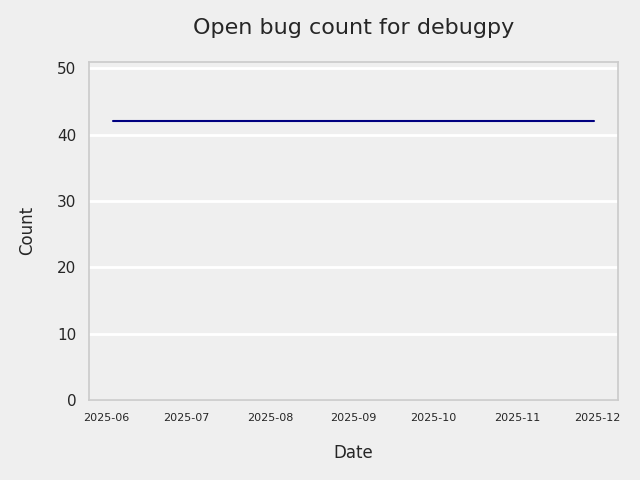
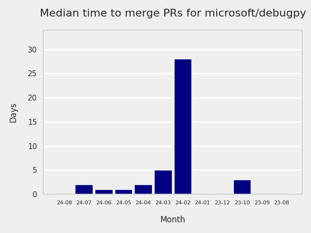
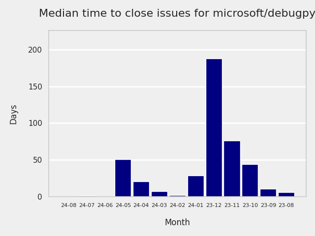
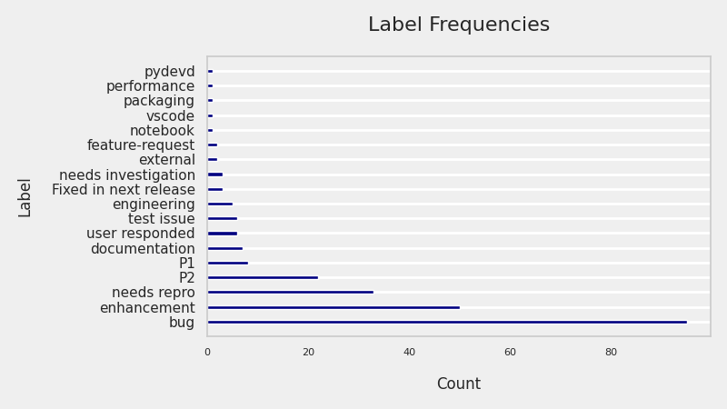
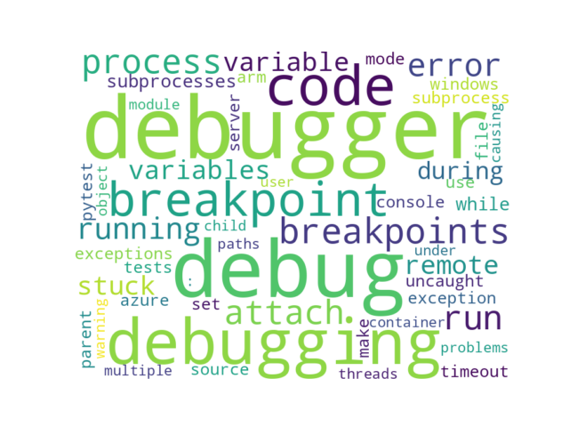

# GITHUB ISSUES REPORT FOR microsoft/debugpy

Generated on 2024-08-12 using: stale=30, all=True

* marks items that are new to report in past 1 day(s)

## FOR ISSUES THAT ARE MARKED AS BUGS:

### Issues in debugpy that need a response from team:

| Days Ago | Issue | Title |
| --- | --- | --- |
 |  OP:160  |[1531](https://github.com/microsoft/debugpy/issues/1531 "qt_loaders.py uses the removed imp module (Python 3.12)") | qt_loaders.py uses the removed imp module (Python 3.12) |
 |  OP:257  |[1474](https://github.com/microsoft/debugpy/issues/1474 "Can't see libraries in stack trace even with &quot;justMyCode&quot;: false") | Can't see libraries in stack trace even with "justMyCode": false |
 |  OP:291  |[1413](https://github.com/microsoft/debugpy/issues/1413 "Attach function doesn't work with ubuntu 22.04") | Attach function doesn't work with ubuntu 22.04 |
 |  OP:356  |[1365](https://github.com/microsoft/debugpy/issues/1365 "attach_to_pid() does not work with lazy imports (PEP 690)") | attach_to_pid() does not work with lazy imports (PEP 690) |
 |  OP:362  |[1355](https://github.com/microsoft/debugpy/issues/1355 "Pytest debugger isn't compatible with vscode+playwright") | Pytest debugger isn't compatible with vscode+playwright |
 |  OP:375  |[1342](https://github.com/microsoft/debugpy/issues/1342 "Can not debug multiprocess code with streamlit") | Can not debug multiprocess code with streamlit |
 |  OP:379  |[1340](https://github.com/microsoft/debugpy/issues/1340 "Generic class using ParamSpec raises TypeError in Python < 3.10, with User Uncaught Exceptions + justMyCode: false") | Generic class using ParamSpec raises TypeError in Python < 3.10, with User Uncaught Exceptions + justMyCode: false |
 |  OP:381  |[1336](https://github.com/microsoft/debugpy/issues/1336 "VSCode sometimes stuck on breakpoint when debugging an embedded interpreter") | VSCode sometimes stuck on breakpoint when debugging an embedded interpreter |
 |  OP:416  |[1323](https://github.com/microsoft/debugpy/issues/1323 "Commit 5601342 breaks test_attach_pid_client tests on Python 3.11") | Commit 5601342 breaks test_attach_pid_client tests on Python 3.11 |
 |  OP:418  |[1315](https://github.com/microsoft/debugpy/issues/1315 "Debugging Django in Docker container with VS Code doesn't engage debug inspector") | Debugging Django in Docker container with VS Code doesn't engage debug inspector |
 |  OP:467  |[1285](https://github.com/microsoft/debugpy/issues/1285 "Terminal cuts off long strings when debugging") | Terminal cuts off long strings when debugging |
 |  OP:503  |[1251](https://github.com/microsoft/debugpy/issues/1251 "Python 3.11 reports frozen modules warning despite passing during startup") | Python 3.11 reports frozen modules warning despite passing during startup |
 |  OP:509  |[1248](https://github.com/microsoft/debugpy/issues/1248 "User Uncaught Exceptions fails on imports") | User Uncaught Exceptions fails on imports |
 |  OP:520  |[1236](https://github.com/microsoft/debugpy/issues/1236 "Local and global variables are not available in list comprehensions in the debug console") | Local and global variables are not available in list comprehensions in the debug console |

### Issues in debugpy that have comments from OP after last team response:

| Days Ago | Issue | Title |
| --- | --- | --- |
 |  TM:69, OP:69  |[1593](https://github.com/microsoft/debugpy/issues/1593 "python debugger ignores breakpoints?") | python debugger ignores breakpoints? |
 |  TM:264, OP:264  |[1465](https://github.com/microsoft/debugpy/issues/1465 "Cannot attach Python debugger to debugpy within a future inside Docker container") | Cannot attach Python debugger to debugpy within a future inside Docker container |
 |  TM:251, OP:251  |[1410](https://github.com/microsoft/debugpy/issues/1410 "How to make debugpy respect custom eval frame functions?") | How to make debugpy respect custom eval frame functions? |
 |  TM:332, OP:329  |[1384](https://github.com/microsoft/debugpy/issues/1384 "Cannot run Debugger on macOS (pydev debugger: critical: unable to get real case for file. Details:)") | Cannot run Debugger on macOS (pydev debugger: critical: unable to get real case for file. Details:) |
 |  TM:334, OP:285  |[1338](https://github.com/microsoft/debugpy/issues/1338 "Debugpy Server Disconnects Unexpectedly when Inspecting Variable") | Debugpy Server Disconnects Unexpectedly when Inspecting Variable |
 |  TM:471, OP:383  |[1283](https://github.com/microsoft/debugpy/issues/1283 "Python Debugger stops in first few seconds without output") | Python Debugger stops in first few seconds without output |
 |  TM:291, OP:257  |[1271](https://github.com/microsoft/debugpy/issues/1271 "Timeout while using vscode debugger with any program which spawns a process") | Timeout while using vscode debugger with any program which spawns a process |
 |  TM:1035, OP:1035  |[750](https://github.com/microsoft/debugpy/issues/750 "Support PEP 582 (__pypackages__) for just-my-code and user-uncaught exceptions") | Support PEP 582 (__pypackages__) for just-my-code and user-uncaught exceptions |

### Issues in debugpy that have comments from 3rd party after last team response:

| Days Ago | Issue | Title |
| --- | --- | --- |
 |  P:111,  |[1521](https://github.com/microsoft/debugpy/issues/1521 "Running debugging shows errors, but the functionality is normal.") | Running debugging shows errors, but the functionality is normal. |
 |  P:95,  |[1476](https://github.com/microsoft/debugpy/issues/1476 "Python3.12 Unable to attach to PID (Jupyter python process)") | Python3.12 Unable to attach to PID (Jupyter python process) |
 |  P:426,  |[1301](https://github.com/microsoft/debugpy/issues/1301 "Path mappings not working with mixed windows-style/linux path slash") | Path mappings not working with mixed windows-style/linux path slash |
 |  P:89,  |[1296](https://github.com/microsoft/debugpy/issues/1296 "Debugpy unable to start Flask server") | Debugpy unable to start Flask server |
 |  P:234,  |[1284](https://github.com/microsoft/debugpy/issues/1284 "Debugging under python 3.11 will skip the breakpoint") | Debugging under python 3.11 will skip the breakpoint |
 |  P:648,  |[712](https://github.com/microsoft/debugpy/issues/712 "notification like &quot;Failed launch debugger for child process xxxx&quot;.") | notification like "Failed launch debugger for child process xxxx". |

### Issues in debugpy that have no external responses since team response in 30+ days:

| Days Ago | Issue | Title |
| --- | --- | --- |
 |  TM:199  |[1499](https://github.com/microsoft/debugpy/issues/1499 "Python debugger changes __file__") | Python debugger changes __file__ |
 |  TM:251  |[1464](https://github.com/microsoft/debugpy/issues/1464 "remote vscode attach process pid failed") | remote vscode attach process pid failed |
 |  TM:255  |[1463](https://github.com/microsoft/debugpy/issues/1463 "Timeout waiting for debugger connection to running pythonnet process") | Timeout waiting for debugger connection to running pythonnet process |
 |  TM:293  |[1406](https://github.com/microsoft/debugpy/issues/1406 "IORedirector doesn't behave like IOBase causing problems interacting with stdout and stderr") | IORedirector doesn't behave like IOBase causing problems interacting with stdout and stderr |
 |  TM:300  |[1397](https://github.com/microsoft/debugpy/issues/1397 "Can't use debugpy in macos/vscode. Immediately Finishes (CANNOT USE these API proposals 'portsAttributes')") | Can't use debugpy in macos/vscode. Immediately Finishes (CANNOT USE these API proposals 'portsAttributes') |
 |  TM:251  |[1396](https://github.com/microsoft/debugpy/issues/1396 "Cannot run Debugpy - ms-python.debugpy CANNOT USE these API proposals (Macos M1)") | Cannot run Debugpy - ms-python.debugpy CANNOT USE these API proposals (Macos M1) |
 |  TM:334  |[1382](https://github.com/microsoft/debugpy/issues/1382 "Python debugger frozen eternall with poetry env") | Python debugger frozen eternall with poetry env |
 |  TM:333  |[1288](https://github.com/microsoft/debugpy/issues/1288 "Can't debug if project resides in folder whose name contains special characters") | Can't debug if project resides in folder whose name contains special characters |
 |  TM:464  |[1272](https://github.com/microsoft/debugpy/issues/1272 "When using debugger in remote environment it hangs and never successfully breaks when reaching a breakpoint") | When using debugger in remote environment it hangs and never successfully breaks when reaching a breakpoint |
 |  TM:557  |[1193](https://github.com/microsoft/debugpy/issues/1193 "Debug crashes when running a Python2 subprocess") | Debug crashes when running a Python2 subprocess |
 |  TM:557  |[1041](https://github.com/microsoft/debugpy/issues/1041 "Breakpoints on secondary threads don't trigger when using PyQt5") | Breakpoints on secondary threads don't trigger when using PyQt5 |
 |  TM:1479  |[286](https://github.com/microsoft/debugpy/issues/286 "Attach to local process assumes i386 architecture? ") | Attach to local process assumes i386 architecture?  |
 |  TM:857  |[165](https://github.com/microsoft/debugpy/issues/165 "Entry points aren't being found while test debugging") | Entry points aren't being found while test debugging |
 |  TM:1560  |[171](https://github.com/microsoft/debugpy/issues/171 "Ctrl+C causes KeyboardInterrupt inside pydevd") | Ctrl+C causes KeyboardInterrupt inside pydevd |

---

## FOR ISSUES THAT ARE NOT MARKED AS BUGS:

### Issues in debugpy that need a response from team:

| Days Ago | Issue | Title |
| --- | --- | --- |
 |  OP:7  |[1645](https://github.com/microsoft/debugpy/issues/1645 "Doesn't cope with UTF-8 paths.") | Doesn't cope with UTF-8 paths. |
 |  OP:9  |[1644](https://github.com/microsoft/debugpy/issues/1644 "cannot debug python file which can run fine from terminal") | cannot debug python file which can run fine from terminal |
 |  OP:10  |[1643](https://github.com/microsoft/debugpy/issues/1643 " 'PathDistribution' object has no attribute 'name'") |  'PathDistribution' object has no attribute 'name' |
 |  OP:24  |[1629](https://github.com/microsoft/debugpy/issues/1629 "Updating Extension to DAP Client Reference") | Updating Extension to DAP Client Reference |
 |  OP:25  |[1627](https://github.com/microsoft/debugpy/issues/1627 "Can't enter core python libraries in debug mode") | Can't enter core python libraries in debug mode |
 |  OP:33  |[1623](https://github.com/microsoft/debugpy/issues/1623 "Failed test due to matplotlib deprecation of interactive_bk") | Failed test due to matplotlib deprecation of interactive_bk |
 |  OP:37  |[1620](https://github.com/microsoft/debugpy/issues/1620 "Updated pytest-timeout changes internal functions") | Updated pytest-timeout changes internal functions |
 |  OP:43  |[1615](https://github.com/microsoft/debugpy/issues/1615 "Got stuck when debugging a multi-process program in PyTorch") | Got stuck when debugging a multi-process program in PyTorch |
 |  OP:83  |[1587](https://github.com/microsoft/debugpy/issues/1587 "Error : TypeError: '>' not supported between instances of 'int' and 'NoneType'") | Error : TypeError: '>' not supported between instances of 'int' and 'NoneType' |
 |  OP:92  |[1583](https://github.com/microsoft/debugpy/issues/1583 "IPython Qt incorrect string formatting in raised error") | IPython Qt incorrect string formatting in raised error |
 |  OP:92  |[1582](https://github.com/microsoft/debugpy/issues/1582 "Run remote Debug success,But restart Debug errorInfo-show: connect ECONNREFUSED ip-address:5678") | Run remote Debug success,But restart Debug errorInfo-show: connect ECONNREFUSED ip-address:5678 |
 |  OP:93  |[1581](https://github.com/microsoft/debugpy/issues/1581 "Configure variables view presentation of `len()`") | Configure variables view presentation of `len()` |
 |  OP:96  |[1579](https://github.com/microsoft/debugpy/issues/1579 "Debugger times out if shell startup is &quot;slow&quot;") | Debugger times out if shell startup is "slow" |
 |  OP:105  |[1572](https://github.com/microsoft/debugpy/issues/1572 "The dead thread  won't disappear in call stack monitor") | The dead thread  won't disappear in call stack monitor |
 |  OP:125  |[1561](https://github.com/microsoft/debugpy/issues/1561 "&quot;import akshare as ak&quot; blocks the debugger after I upgrade to python 3.12.2") | "import akshare as ak" blocks the debugger after I upgrade to python 3.12.2 |
 |  OP:135  |[1553](https://github.com/microsoft/debugpy/issues/1553 "possible to effectively get something like &quot;jupyter.debugJustMyCode&quot;: 'sometimes true'?") | possible to effectively get something like "jupyter.debugJustMyCode": 'sometimes true'? |
 |  OP:145  |[1542](https://github.com/microsoft/debugpy/issues/1542 "Puzzling behavior of debugging with debugpy") | Puzzling behavior of debugging with debugpy |
 |  OP:145  |[1541](https://github.com/microsoft/debugpy/issues/1541 "Cannot set remote breakpoints in Visual Studio Community 2022 (Version 17.9.3)") | Cannot set remote breakpoints in Visual Studio Community 2022 (Version 17.9.3) |
 |  OP:152  |[1539](https://github.com/microsoft/debugpy/issues/1539 "Python Debug console reports multiple wxPyDeprecationWarning when using wxPython 4.2.1") | Python Debug console reports multiple wxPyDeprecationWarning when using wxPython 4.2.1 |
 |  OP:152  |[1538](https://github.com/microsoft/debugpy/issues/1538 "Breakpoint set in source code are not hit when attaching to a devcontainer process") | Breakpoint set in source code are not hit when attaching to a devcontainer process |
 |  OP:152  |[1536](https://github.com/microsoft/debugpy/issues/1536 "Subprocess debugging not working when --pid and --configure-subProcess are used") | Subprocess debugging not working when --pid and --configure-subProcess are used |
 |  OP:162  |[1530](https://github.com/microsoft/debugpy/issues/1530 "Easy Post Mortem Function") | Easy Post Mortem Function |
 |  OP:165  |[1527](https://github.com/microsoft/debugpy/issues/1527 "Debug should skip arguments assignment for step into action by default") | Debug should skip arguments assignment for step into action by default |
 |  OP:179  |[1522](https://github.com/microsoft/debugpy/issues/1522 "warning on code property") | warning on code property |
 |  OP:191  |[1514](https://github.com/microsoft/debugpy/issues/1514 "Breakpoints ignored if file extension is not `.py`") | Breakpoints ignored if file extension is not `.py` |
 |  OP:193  |[1511](https://github.com/microsoft/debugpy/issues/1511 "Can't load source files when .pyc files have wrong filepaths inside.") | Can't load source files when .pyc files have wrong filepaths inside. |
 |  OP:197  |[1503](https://github.com/microsoft/debugpy/issues/1503 "Support debugging of indirect child processes.") | Support debugging of indirect child processes. |
 |  OP:198  |[1501](https://github.com/microsoft/debugpy/issues/1501 "Allow multiple debug connections in VS code using the same port") | Allow multiple debug connections in VS code using the same port |
 |  OP:202  |[1497](https://github.com/microsoft/debugpy/issues/1497 "Debugger hits breakpoints, but doesn't retrieve variables or continue execution") | Debugger hits breakpoints, but doesn't retrieve variables or continue execution |
 |  OP:207  |[1495](https://github.com/microsoft/debugpy/issues/1495 "Hitting a breakpoint in symlinked file opens a new instance of the file") | Hitting a breakpoint in symlinked file opens a new instance of the file |
 |  OP:207  |[1494](https://github.com/microsoft/debugpy/issues/1494 "Debug windows stuck on loading local variable(large img tensor) when debug pytorch code.") | Debug windows stuck on loading local variable(large img tensor) when debug pytorch code. |
 |  OP:212  |[1493](https://github.com/microsoft/debugpy/issues/1493 "tries to debug a wrong file, behaves weird if file is moved") | tries to debug a wrong file, behaves weird if file is moved |
 |  OP:223  |[1491](https://github.com/microsoft/debugpy/issues/1491 "debug python with docker-compose cannot hit breakpoint") | debug python with docker-compose cannot hit breakpoint |
 |  OP:237  |[1488](https://github.com/microsoft/debugpy/issues/1488 "Add PyQt6 and PySide6 support for python debugger to avoid import errors and fix breakpoint issue") | Add PyQt6 and PySide6 support for python debugger to avoid import errors and fix breakpoint issue |
 |  OP:239  |[1486](https://github.com/microsoft/debugpy/issues/1486 "Bug while debugging list comprehension (02)") | Bug while debugging list comprehension (02) |
 |  OP:239  |[1485](https://github.com/microsoft/debugpy/issues/1485 "Bug while debugging list comprehension (01)") | Bug while debugging list comprehension (01) |
 |  OP:244  |[1480](https://github.com/microsoft/debugpy/issues/1480 "Undocumented gdb Version (> 11.1) Requirements for Python Attach Mode ") | Undocumented gdb Version (> 11.1) Requirements for Python Attach Mode  |
 |  OP:268  |[1462](https://github.com/microsoft/debugpy/issues/1462 "test_attach_pid_client fail on Linux") | test_attach_pid_client fail on Linux |
 |  OP:305  |[1479](https://github.com/microsoft/debugpy/issues/1479 "Can't expand Numpy array to view its elements") | Can't expand Numpy array to view its elements |
 |  OP:321  |[1400](https://github.com/microsoft/debugpy/issues/1400 "Debugging Panel Apps written as IPython Notebook in VSCode") | Debugging Panel Apps written as IPython Notebook in VSCode |
 |  OP:355  |[1367](https://github.com/microsoft/debugpy/issues/1367 "Make breakpoints' `adjust_line` configurable") | Make breakpoints' `adjust_line` configurable |
 |  OP:355  |[1366](https://github.com/microsoft/debugpy/issues/1366 "Support DAP's `hitBreakpointIds`") | Support DAP's `hitBreakpointIds` |
 |  OP:389  |[1333](https://github.com/microsoft/debugpy/issues/1333 "Release debugpy source as tar.gz instead of zip") | Release debugpy source as tar.gz instead of zip |
 |  OP:396  |[1329](https://github.com/microsoft/debugpy/issues/1329 "Support for step back") | Support for step back |
 |  OP:397  |[1328](https://github.com/microsoft/debugpy/issues/1328 "View thread state in debugger without breakpoints") | View thread state in debugger without breakpoints |
 |  OP:406  |[1326](https://github.com/microsoft/debugpy/issues/1326 "`log message` support the `=` of f string to display both the expression text and its value?") | `log message` support the `=` of f string to display both the expression text and its value? |
 |  OP:426  |[1310](https://github.com/microsoft/debugpy/issues/1310 "Variables pane stuck loading") | Variables pane stuck loading |
 |  OP:427  |[1311](https://github.com/microsoft/debugpy/issues/1311 "Support debugging console scripts from launch.json") | Support debugging console scripts from launch.json |
 |  OP:434  |[1308](https://github.com/microsoft/debugpy/issues/1308 "remote debug port stucks upon `nc -z` but `nc` works") | remote debug port stucks upon `nc -z` but `nc` works |
 |  OP:437  |[1306](https://github.com/microsoft/debugpy/issues/1306 "Option to not consider SystemExit as an uncaught exception") | Option to not consider SystemExit as an uncaught exception |
 |  OP:457  |[1291](https://github.com/microsoft/debugpy/issues/1291 "Add debugger data breakpoints") | Add debugger data breakpoints |
 |  OP:507  |[1250](https://github.com/microsoft/debugpy/issues/1250 "Debugging code with `pexpect.spawn` is taking 5s longer  ") | Debugging code with `pexpect.spawn` is taking 5s longer   |
 |  OP:514  |[1245](https://github.com/microsoft/debugpy/issues/1245 "Don't collapse nested lists/tuples into ... in debugger | make debugging more like PyCharm") | Don't collapse nested lists/tuples into ... in debugger | make debugging more like PyCharm |

### Issues in debugpy that have comments from OP after last team response:

| Days Ago | Issue | Title |
| --- | --- | --- |
 |  TM:43, OP:34  |[1604](https://github.com/microsoft/debugpy/issues/1604 "Fatal Python Error on debugpy.adapter shutdown") | Fatal Python Error on debugpy.adapter shutdown |
 |  TM:60, OP:59  |[1599](https://github.com/microsoft/debugpy/issues/1599 "Remotely debug Python code on Linux from Microsoft Visual Studio 2022:  cannot set breakpoint (Breakpoint in file that does not exist)") | Remotely debug Python code on Linux from Microsoft Visual Studio 2022:  cannot set breakpoint (Breakpoint in file that does not exist) |
 |  TM:117, OP:116  |[1565](https://github.com/microsoft/debugpy/issues/1565 "Skip nonrelevant `case`s in `match/case` during step by step debugging") | Skip nonrelevant `case`s in `match/case` during step by step debugging |
 |  TM:122, OP:122  |[1563](https://github.com/microsoft/debugpy/issues/1563 "FEAT: Support ipython's `_repr_*_()` protocol") | FEAT: Support ipython's `_repr_*_()` protocol |
 |  TM:152, OP:151  |[1537](https://github.com/microsoft/debugpy/issues/1537 "Using multiprocessing -> TypeError: Cannot read properties of null (reading 'testsuites')") | Using multiprocessing -> TypeError: Cannot read properties of null (reading 'testsuites') |
 |  TM:160, OP:149  |[1529](https://github.com/microsoft/debugpy/issues/1529 "api to retrieve debugpy endpoint and access token?") | api to retrieve debugpy endpoint and access token? |
 |  TM:166, OP:166  |[1525](https://github.com/microsoft/debugpy/issues/1525 "Display order of properties of a tensor object in debugging") | Display order of properties of a tensor object in debugging |
 |  TM:181, OP:180  |[1519](https://github.com/microsoft/debugpy/issues/1519 "`set_trace`-releated deadlock when running inside Ansible with explicit listen-and-debug breakpoint") | `set_trace`-releated deadlock when running inside Ansible with explicit listen-and-debug breakpoint |
 |  TM:194, OP:193  |[1505](https://github.com/microsoft/debugpy/issues/1505 "Python Debugger not showing NumPy array values after update - NOT resolved") | Python Debugger not showing NumPy array values after update - NOT resolved |
 |  TM:202, OP:86  |[1496](https://github.com/microsoft/debugpy/issues/1496 "Python 3.12 runs much slower than Python 3.11") | Python 3.12 runs much slower than Python 3.11 |
 |  TM:334, OP:330  |[1346](https://github.com/microsoft/debugpy/issues/1346 "Using rich.print() instead of print() in (evaluate in) debug console") | Using rich.print() instead of print() in (evaluate in) debug console |
 |  TM:334, OP:334  |[1344](https://github.com/microsoft/debugpy/issues/1344 "Auto-spawn IDE on breakpoint()") | Auto-spawn IDE on breakpoint() |
 |  TM:334, OP:333  |[1331](https://github.com/microsoft/debugpy/issues/1331 "`justMyCode` is too broad, allow some chosen libraries and hide the rest") | `justMyCode` is too broad, allow some chosen libraries and hide the rest |
 |  TM:475, OP:430  |[1277](https://github.com/microsoft/debugpy/issues/1277 "Breakpoint not working in Odoo with multiple workers (gevent)") | Breakpoint not working in Odoo with multiple workers (gevent) |
 |  TM:480, OP:144  |[1242](https://github.com/microsoft/debugpy/issues/1242 "1.6.6: pytest is failing") | 1.6.6: pytest is failing |
 |  TM:572, OP:571  |[1172](https://github.com/microsoft/debugpy/issues/1172 "atexit not respected in subprocess.Popen") | atexit not respected in subprocess.Popen |
 |  TM:579, OP:577  |[1169](https://github.com/microsoft/debugpy/issues/1169 "Missing examples of configurations") | Missing examples of configurations |
 |  TM:584, OP:579  |[1167](https://github.com/microsoft/debugpy/issues/1167 "Debugging support lazy variables") | Debugging support lazy variables |
 |  TM:633, OP:633  |[1130](https://github.com/microsoft/debugpy/issues/1130 "Allow server to configure its root") | Allow server to configure its root |
 |  TM:657, OP:657  |[1097](https://github.com/microsoft/debugpy/issues/1097 "debugpy.configure(python=) is not properly documented") | debugpy.configure(python=) is not properly documented |
 |  TM:667, OP:667  |[1085](https://github.com/microsoft/debugpy/issues/1085 "Return scope metadata on ScopesRequest") | Return scope metadata on ScopesRequest |
 |  TM:604, OP:601  |[1155](https://github.com/microsoft/debugpy/issues/1155 "Python debugger breaks on caught exception within a decorator and context manager") | Python debugger breaks on caught exception within a decorator and context manager |
 |  TM:926, OP:897  |[764](https://github.com/microsoft/debugpy/issues/764 "Problems with python in VSC, eg. not working logs and pathlib and importlib.util") | Problems with python in VSC, eg. not working logs and pathlib and importlib.util |

### Issues in debugpy that have comments from 3rd party after last team response:

| Days Ago | Issue | Title |
| --- | --- | --- |
 |  P:2,  |[1607](https://github.com/microsoft/debugpy/issues/1607 "Enable debugpy to work with domain sockets") | Enable debugpy to work with domain sockets |
 |  P:249,  |[1409](https://github.com/microsoft/debugpy/issues/1409 "Debug console shows too much detail and too little data information ") | Debug console shows too much detail and too little data information  |
 |  P:9,  |[1252](https://github.com/microsoft/debugpy/issues/1252 "[Feature request] Support connect to ipv6 address") | [Feature request] Support connect to ipv6 address |
 |  P:132,  |[1220](https://github.com/microsoft/debugpy/issues/1220 "Support attach-to-PID on macOS on ARM") | Support attach-to-PID on macOS on ARM |
 |  P:487,  |[1114](https://github.com/microsoft/debugpy/issues/1114 "Display Python asyncio Tasks in VS Code Debugger") | Display Python asyncio Tasks in VS Code Debugger |
 |  P:434,  |[460](https://github.com/microsoft/debugpy/issues/460 "Repeated debugpy.listen() calls should be an error") | Repeated debugpy.listen() calls should be an error |
 |  P:627,  |[317](https://github.com/microsoft/debugpy/issues/317 "Make variable order for dict keys configurable") | Make variable order for dict keys configurable |

### Issues in debugpy that have no external responses since team response in 30+ days:

| Days Ago | Issue | Title |
| --- | --- | --- |
 |  TM:41  |[1616](https://github.com/microsoft/debugpy/issues/1616 "Importing pypinyin takes too much time (around 10min)") | Importing pypinyin takes too much time (around 10min) |
 |  TM:47  |[1609](https://github.com/microsoft/debugpy/issues/1609 "Troubles when expanding self object during debug in constructor") | Troubles when expanding self object during debug in constructor |
 |  TM:72  |[1592](https://github.com/microsoft/debugpy/issues/1592 "Microsoft Python Debugger not working in a virtual environment created with venv module on windows") | Microsoft Python Debugger not working in a virtual environment created with venv module on windows |
 |  TM:41  |[1584](https://github.com/microsoft/debugpy/issues/1584 "Attach to PID of application embedding Python not working in VS Code on Windows") | Attach to PID of application embedding Python not working in VS Code on Windows |
 |  TM:114  |[1568](https://github.com/microsoft/debugpy/issues/1568 "Allow clients to debug code from command line, like pdb or epdb ") | Allow clients to debug code from command line, like pdb or epdb  |
 |  TM:153  |[1533](https://github.com/microsoft/debugpy/issues/1533 "Duplicate path error suddenly appears on debugging only") | Duplicate path error suddenly appears on debugging only |
 |  TM:236  |[1489](https://github.com/microsoft/debugpy/issues/1489 "Breakpoints not triggered in Flask app") | Breakpoints not triggered in Flask app |
 |  TM:339  |[1377](https://github.com/microsoft/debugpy/issues/1377 "Show Python Process names in debugger") | Show Python Process names in debugger |
 |  TM:334  |[1332](https://github.com/microsoft/debugpy/issues/1332 "Debug variable displays verbose info") | Debug variable displays verbose info |
 |  TM:418  |[1304](https://github.com/microsoft/debugpy/issues/1304 "Show a warning that we can't debug when &quot;--cov&quot; is in pytestArgs") | Show a warning that we can't debug when "--cov" is in pytestArgs |
 |  TM:432  |[1303](https://github.com/microsoft/debugpy/issues/1303 "When using python debugging class properties are showed after private and protected members.") | When using python debugging class properties are showed after private and protected members. |
 |  TM:571  |[1179](https://github.com/microsoft/debugpy/issues/1179 "Support DAP variable paging") | Support DAP variable paging |
 |  TM:622  |[1134](https://github.com/microsoft/debugpy/issues/1134 "async code debugging") | async code debugging |
 |  TM:221  |[1084](https://github.com/microsoft/debugpy/issues/1084 "Unnecessary truncation") | Unnecessary truncation |
 |  TM:418  |[856](https://github.com/microsoft/debugpy/issues/856 "update setup.py license field") | update setup.py license field |
 |  TM:884  |[814](https://github.com/microsoft/debugpy/issues/814 "Provide a way to notify users of where a RecursionError happens") | Provide a way to notify users of where a RecursionError happens |
 |  TM:535  |[807](https://github.com/microsoft/debugpy/issues/807 "Gracefully handle debugpy.listen() in subprocesses") | Gracefully handle debugpy.listen() in subprocesses |
 |  TM:863  |[772](https://github.com/microsoft/debugpy/issues/772 "CXXABI requirement") | CXXABI requirement |
 |  TM:1263  |[549](https://github.com/microsoft/debugpy/issues/549 "timeout or cancelling of debugpy.connect call") | timeout or cancelling of debugpy.connect call |
 |  TM:667  |[510](https://github.com/microsoft/debugpy/issues/510 "Stop at breakpoints during evaluate request (recursive debugging)") | Stop at breakpoints during evaluate request (recursive debugging) |

### Issues with term '[sys.monitoring]'

| Days Ago | Issue | Title |
| --- | --- | --- |
 |  OP:138  |[1548](/issues/1548 "[sys.monitoring] Local variable cleanup is delayed by debugger") | [sys.monitoring] Local variable cleanup is delayed by debugger |
 |  OP:194  |[1509](/issues/1509 "[sys.monitoring] Just my code") | [sys.monitoring] Just my code |
 |  OP:194  |[1508](/issues/1508 "[sys.monitoring] Async stepping") | [sys.monitoring] Async stepping |
 |  OP:194  |[1507](/issues/1507 "[sys.monitoring] API to hide threads and files from debugger") | [sys.monitoring] API to hide threads and files from debugger |
 |  OP:264  |[1472](/issues/1472 "[sys.monitoring] Report loaded modules") | [sys.monitoring] Report loaded modules |
 |  OP:264  |[1471](/issues/1471 "[sys.monitoring] Performance telemetry") | [sys.monitoring] Performance telemetry |
 |  OP:264  |[1470](/issues/1470 "[sys.monitoring] Stdout redirection") | [sys.monitoring] Stdout redirection |
 |  OP:264  |[1469](/issues/1469 "[sys.monitoring] Jinja template stack frames") | [sys.monitoring] Jinja template stack frames |
 |  OP:264  |[1468](/issues/1468 "[sys.monitoring] Django template stack frames") | [sys.monitoring] Django template stack frames |
 |  OP:264  |[1467](/issues/1467 "[sys.monitoring] Flask (Jinja) breakpoints") | [sys.monitoring] Flask (Jinja) breakpoints |
 |  OP:264  |[1466](/issues/1466 "[sys.monitoring] Django breakpoints") | [sys.monitoring] Django breakpoints |
 |  OP:269  |[1461](/issues/1461 "[sys.monitoring] Children - tensorflow collections") | [sys.monitoring] Children - tensorflow collections |
 |  OP:269  |[1460](/issues/1460 "[sys.monitoring] Children - pandas collections") | [sys.monitoring] Children - pandas collections |
 |  OP:269  |[1459](/issues/1459 "[sys.monitoring] Children - numpy collections") | [sys.monitoring] Children - numpy collections |
 |  OP:269  |[1458](/issues/1458 "[sys.monitoring] Children - mapping items") | [sys.monitoring] Children - mapping items |
 |  OP:269  |[1457](/issues/1457 "[sys.monitoring] Children - sequence & set items") | [sys.monitoring] Children - sequence & set items |
 |  OP:269  |[1456](/issues/1456 "[sys.monitoring] Children - object attributes") | [sys.monitoring] Children - object attributes |
 |  OP:269  |[1455](/issues/1455 "[sys.monitoring] SystemExit handling") | [sys.monitoring] SystemExit handling |
 |  OP:269  |[1454](/issues/1454 "[sys.monitoring] Break on user-uncaught exception") | [sys.monitoring] Break on user-uncaught exception |
 |  OP:269  |[1451](/issues/1451 "[sys.monitoring] safe repr - tensorflow") | [sys.monitoring] safe repr - tensorflow |
 |  OP:269  |[1450](/issues/1450 "[sys.monitoring] safe repr - pandas") | [sys.monitoring] safe repr - pandas |
 |  OP:269  |[1449](/issues/1449 "[sys.monitoring] safe repr - numpy") | [sys.monitoring] safe repr - numpy |
 |  OP:269  |[1448](/issues/1448 "[sys.monitoring] safe repr - collections") | [sys.monitoring] safe repr - collections |
 |  OP:269  |[1447](/issues/1447 "[sys.monitoring] safe repr - strings") | [sys.monitoring] safe repr - strings |
 |  OP:269  |[1446](/issues/1446 "[sys.monitoring] Returned values") | [sys.monitoring] Returned values |
 |  OP:269  |[1440](/issues/1440 "[sys.monitoring] Variable values") | [sys.monitoring] Variable values |
 |  OP:269  |[1439](/issues/1439 "[sys.monitoring] Variable children") | [sys.monitoring] Variable children |
 |  OP:269  |[1437](/issues/1437 "[sys.monitoring] Expression evaluation") | [sys.monitoring] Expression evaluation |
 |  OP:269  |[1436](/issues/1436 "[sys.monitoring] Exception breakpoints") | [sys.monitoring] Exception breakpoints |
 |  OP:270  |[1435](/issues/1435 "[sys.monitoring] breakpoint() hook") | [sys.monitoring] breakpoint() hook |
 |  OP:270  |[1434](/issues/1434 "[sys.monitoring] Snap breakpoints to valid locations") | [sys.monitoring] Snap breakpoints to valid locations |
 |  OP:270  |[1433](/issues/1433 "[sys.monitoring] Breakpoint verification") | [sys.monitoring] Breakpoint verification |
 |  OP:270  |[1429](/issues/1429 "[sys.monitoring] Breakpoints") | [sys.monitoring] Breakpoints |
 |  OP:270  |[1428](/issues/1428 "[sys.monitoring] Stop on entry") | [sys.monitoring] Stop on entry |
 |  OP:270  |[1424](/issues/1424 "[sys.monitoring] Stepping") | [sys.monitoring] Stepping |
 |  OP:270  |[1421](/issues/1421 "[sys.monitoring] Stack tracing") | [sys.monitoring] Stack tracing |
 |  OP:270  |[1420](/issues/1420 "[sys.monitoring] Tracing execution flow") | [sys.monitoring] Tracing execution flow |

### Issues with term 'debugger'

| Days Ago | Issue | Title |
| --- | --- | --- |
 |  OP:24  |[1630](/issues/1630 "Python debugger breakpoints are not working.") | Python debugger breakpoints are not working. |
 |  OP:72  |[1592](/issues/1592 "Microsoft Python Debugger not working in a virtual environment created with venv module on windows") | Microsoft Python Debugger not working in a virtual environment created with venv module on windows |
 |  OP:73  |[1593](/issues/1593 "python debugger ignores breakpoints?") | python debugger ignores breakpoints? |
 |  OP:96  |[1579](/issues/1579 "Debugger times out if shell startup is &quot;slow&quot;") | Debugger times out if shell startup is "slow" |
 |  OP:125  |[1561](/issues/1561 "&quot;import akshare as ak&quot; blocks the debugger after I upgrade to python 3.12.2") | "import akshare as ak" blocks the debugger after I upgrade to python 3.12.2 |
 |  OP:138  |[1548](/issues/1548 "[sys.monitoring] Local variable cleanup is delayed by debugger") | [sys.monitoring] Local variable cleanup is delayed by debugger |
 |  OP:194  |[1507](/issues/1507 "[sys.monitoring] API to hide threads and files from debugger") | [sys.monitoring] API to hide threads and files from debugger |
 |  OP:194  |[1505](/issues/1505 "Python Debugger not showing NumPy array values after update - NOT resolved") | Python Debugger not showing NumPy array values after update - NOT resolved |
 |  OP:200  |[1499](/issues/1499 "Python debugger changes __file__") | Python debugger changes __file__ |
 |  OP:202  |[1497](/issues/1497 "Debugger hits breakpoints, but doesn't retrieve variables or continue execution") | Debugger hits breakpoints, but doesn't retrieve variables or continue execution |
 |  OP:237  |[1488](/issues/1488 "Add PyQt6 and PySide6 support for python debugger to avoid import errors and fix breakpoint issue") | Add PyQt6 and PySide6 support for python debugger to avoid import errors and fix breakpoint issue |
 |  OP:265  |[1465](/issues/1465 "Cannot attach Python debugger to debugpy within a future inside Docker container") | Cannot attach Python debugger to debugpy within a future inside Docker container |
 |  OP:265  |[1463](/issues/1463 "Timeout waiting for debugger connection to running pythonnet process") | Timeout waiting for debugger connection to running pythonnet process |
 |  OP:334  |[1384](/issues/1384 "Cannot run Debugger on macOS (pydev debugger: critical: unable to get real case for file. Details:)") | Cannot run Debugger on macOS (pydev debugger: critical: unable to get real case for file. Details:) |
 |  OP:335  |[1382](/issues/1382 "Python debugger frozen eternall with poetry env") | Python debugger frozen eternall with poetry env |
 |  OP:340  |[1377](/issues/1377 "Show Python Process names in debugger") | Show Python Process names in debugger |
 |  OP:362  |[1355](/issues/1355 "Pytest debugger isn't compatible with vscode+playwright") | Pytest debugger isn't compatible with vscode+playwright |
 |  OP:397  |[1328](/issues/1328 "View thread state in debugger without breakpoints") | View thread state in debugger without breakpoints |
 |  OP:457  |[1291](/issues/1291 "Add debugger data breakpoints") | Add debugger data breakpoints |
 |  OP:473  |[1283](/issues/1283 "Python Debugger stops in first few seconds without output") | Python Debugger stops in first few seconds without output |
 |  OP:487  |[1272](/issues/1272 "When using debugger in remote environment it hangs and never successfully breaks when reaching a breakpoint") | When using debugger in remote environment it hangs and never successfully breaks when reaching a breakpoint |
 |  OP:487  |[1271](/issues/1271 "Timeout while using vscode debugger with any program which spawns a process") | Timeout while using vscode debugger with any program which spawns a process |
 |  OP:514  |[1245](/issues/1245 "Don't collapse nested lists/tuples into ... in debugger | make debugging more like PyCharm") | Don't collapse nested lists/tuples into ... in debugger | make debugging more like PyCharm |
 |  OP:646  |[1114](/issues/1114 "Display Python asyncio Tasks in VS Code Debugger") | Display Python asyncio Tasks in VS Code Debugger |
 |  OP:724  |[1155](/issues/1155 "Python debugger breaks on caught exception within a decorator and context manager") | Python debugger breaks on caught exception within a decorator and context manager |
 |  OP:1076  |[712](/issues/712 "notification like &quot;Failed launch debugger for child process xxxx&quot;.") | notification like "Failed launch debugger for child process xxxx". |
 |  OP:1799  |[176](/issues/176 "Sequence diagrams and architecture diagrams for the debugger") | Sequence diagrams and architecture diagrams for the debugger |

### Issues with term 'debug'

| Days Ago | Issue | Title |
| --- | --- | --- |
 |  OP:9  |[1644](/issues/1644 "cannot debug python file which can run fine from terminal") | cannot debug python file which can run fine from terminal |
 |  OP:20  |[1633](/issues/1633 "interactive plot window not showing under wayland in debug mode for matplotlib=3.9") | interactive plot window not showing under wayland in debug mode for matplotlib=3.9 |
 |  OP:25  |[1627](/issues/1627 "Can't enter core python libraries in debug mode") | Can't enter core python libraries in debug mode |
 |  OP:47  |[1609](/issues/1609 "Troubles when expanding self object during debug in constructor") | Troubles when expanding self object during debug in constructor |
 |  OP:60  |[1599](/issues/1599 "Remotely debug Python code on Linux from Microsoft Visual Studio 2022:  cannot set breakpoint (Breakpoint in file that does not exist)") | Remotely debug Python code on Linux from Microsoft Visual Studio 2022:  cannot set breakpoint (Breakpoint in file that does not exist) |
 |  OP:92  |[1582](/issues/1582 "Run remote Debug success,But restart Debug errorInfo-show: connect ECONNREFUSED ip-address:5678") | Run remote Debug success,But restart Debug errorInfo-show: connect ECONNREFUSED ip-address:5678 |
 |  OP:114  |[1568](/issues/1568 "Allow clients to debug code from command line, like pdb or epdb ") | Allow clients to debug code from command line, like pdb or epdb  |
 |  OP:152  |[1539](/issues/1539 "Python Debug console reports multiple wxPyDeprecationWarning when using wxPython 4.2.1") | Python Debug console reports multiple wxPyDeprecationWarning when using wxPython 4.2.1 |
 |  OP:165  |[1527](/issues/1527 "Debug should skip arguments assignment for step into action by default") | Debug should skip arguments assignment for step into action by default |
 |  OP:198  |[1501](/issues/1501 "Allow multiple debug connections in VS code using the same port") | Allow multiple debug connections in VS code using the same port |
 |  OP:207  |[1494](/issues/1494 "Debug windows stuck on loading local variable(large img tensor) when debug pytorch code.") | Debug windows stuck on loading local variable(large img tensor) when debug pytorch code. |
 |  OP:212  |[1493](/issues/1493 "tries to debug a wrong file, behaves weird if file is moved") | tries to debug a wrong file, behaves weird if file is moved |
 |  OP:223  |[1491](/issues/1491 "debug python with docker-compose cannot hit breakpoint") | debug python with docker-compose cannot hit breakpoint |
 |  OP:271  |[1419](/issues/1419 "[meta] debug server based on sys.monitoring for Python 3.12+") | [meta] debug server based on sys.monitoring for Python 3.12+ |
 |  OP:297  |[1409](/issues/1409 "Debug console shows too much detail and too little data information ") | Debug console shows too much detail and too little data information  |
 |  OP:372  |[1346](/issues/1346 "Using rich.print() instead of print() in (evaluate in) debug console") | Using rich.print() instead of print() in (evaluate in) debug console |
 |  OP:375  |[1342](/issues/1342 "Can not debug multiprocess code with streamlit") | Can not debug multiprocess code with streamlit |
 |  OP:390  |[1332](/issues/1332 "Debug variable displays verbose info") | Debug variable displays verbose info |
 |  OP:417  |[1320](/issues/1320 "Adopt lifecycleManagedByParent for debug sessions") | Adopt lifecycleManagedByParent for debug sessions |
 |  OP:418  |[1315](/issues/1315 "Debugging Django in Docker container with VS Code doesn't engage debug inspector") | Debugging Django in Docker container with VS Code doesn't engage debug inspector |
 |  OP:434  |[1308](/issues/1308 "remote debug port stucks upon `nc -z` but `nc` works") | remote debug port stucks upon `nc -z` but `nc` works |
 |  OP:438  |[1304](/issues/1304 "Show a warning that we can't debug when &quot;--cov&quot; is in pytestArgs") | Show a warning that we can't debug when "--cov" is in pytestArgs |
 |  OP:459  |[1288](/issues/1288 "Can't debug if project resides in folder whose name contains special characters") | Can't debug if project resides in folder whose name contains special characters |
 |  OP:520  |[1236](/issues/1236 "Local and global variables are not available in list comprehensions in the debug console") | Local and global variables are not available in list comprehensions in the debug console |
 |  OP:559  |[1193](/issues/1193 "Debug crashes when running a Python2 subprocess") | Debug crashes when running a Python2 subprocess |

### Issues with term 'debugging'

| Days Ago | Issue | Title |
| --- | --- | --- |
 |  OP:43  |[1615](/issues/1615 "Got stuck when debugging a multi-process program in PyTorch") | Got stuck when debugging a multi-process program in PyTorch |
 |  OP:83  |[1589](/issues/1589 "[DTS] Unable to attach to embedded python in mixed mode debugging") | [DTS] Unable to attach to embedded python in mixed mode debugging |
 |  OP:117  |[1565](/issues/1565 "Skip nonrelevant `case`s in `match/case` during step by step debugging") | Skip nonrelevant `case`s in `match/case` during step by step debugging |
 |  OP:145  |[1542](/issues/1542 "Puzzling behavior of debugging with debugpy") | Puzzling behavior of debugging with debugpy |
 |  OP:152  |[1536](/issues/1536 "Subprocess debugging not working when --pid and --configure-subProcess are used") | Subprocess debugging not working when --pid and --configure-subProcess are used |
 |  OP:158  |[1533](/issues/1533 "Duplicate path error suddenly appears on debugging only") | Duplicate path error suddenly appears on debugging only |
 |  OP:167  |[1525](/issues/1525 "Display order of properties of a tensor object in debugging") | Display order of properties of a tensor object in debugging |
 |  OP:179  |[1521](/issues/1521 "Running debugging shows errors, but the functionality is normal.") | Running debugging shows errors, but the functionality is normal. |
 |  OP:197  |[1503](/issues/1503 "Support debugging of indirect child processes.") | Support debugging of indirect child processes. |
 |  OP:239  |[1486](/issues/1486 "Bug while debugging list comprehension (02)") | Bug while debugging list comprehension (02) |
 |  OP:239  |[1485](/issues/1485 "Bug while debugging list comprehension (01)") | Bug while debugging list comprehension (01) |
 |  OP:321  |[1400](/issues/1400 "Debugging Panel Apps written as IPython Notebook in VSCode") | Debugging Panel Apps written as IPython Notebook in VSCode |
 |  OP:381  |[1336](/issues/1336 "VSCode sometimes stuck on breakpoint when debugging an embedded interpreter") | VSCode sometimes stuck on breakpoint when debugging an embedded interpreter |
 |  OP:418  |[1315](/issues/1315 "Debugging Django in Docker container with VS Code doesn't engage debug inspector") | Debugging Django in Docker container with VS Code doesn't engage debug inspector |
 |  OP:427  |[1311](/issues/1311 "Support debugging console scripts from launch.json") | Support debugging console scripts from launch.json |
 |  OP:441  |[1303](/issues/1303 "When using python debugging class properties are showed after private and protected members.") | When using python debugging class properties are showed after private and protected members. |
 |  OP:467  |[1285](/issues/1285 "Terminal cuts off long strings when debugging") | Terminal cuts off long strings when debugging |
 |  OP:467  |[1284](/issues/1284 "Debugging under python 3.11 will skip the breakpoint") | Debugging under python 3.11 will skip the breakpoint |
 |  OP:507  |[1250](/issues/1250 "Debugging code with `pexpect.spawn` is taking 5s longer  ") | Debugging code with `pexpect.spawn` is taking 5s longer   |
 |  OP:514  |[1245](/issues/1245 "Don't collapse nested lists/tuples into ... in debugger | make debugging more like PyCharm") | Don't collapse nested lists/tuples into ... in debugger | make debugging more like PyCharm |
 |  OP:590  |[1167](/issues/1167 "Debugging support lazy variables") | Debugging support lazy variables |
 |  OP:627  |[1134](/issues/1134 "async code debugging") | async code debugging |
 |  OP:1730  |[165](/issues/165 "Entry points aren't being found while test debugging") | Entry points aren't being found while test debugging |

### Issues with term 'breakpoints'

| Days Ago | Issue | Title |
| --- | --- | --- |
 |  OP:24  |[1630](/issues/1630 "Python debugger breakpoints are not working.") | Python debugger breakpoints are not working. |
 |  OP:145  |[1541](/issues/1541 "Cannot set remote breakpoints in Visual Studio Community 2022 (Version 17.9.3)") | Cannot set remote breakpoints in Visual Studio Community 2022 (Version 17.9.3) |
 |  OP:191  |[1514](/issues/1514 "Breakpoints ignored if file extension is not `.py`") | Breakpoints ignored if file extension is not `.py` |
 |  OP:237  |[1489](/issues/1489 "Breakpoints not triggered in Flask app") | Breakpoints not triggered in Flask app |
 |  OP:264  |[1467](/issues/1467 "[sys.monitoring] Flask (Jinja) breakpoints") | [sys.monitoring] Flask (Jinja) breakpoints |
 |  OP:264  |[1466](/issues/1466 "[sys.monitoring] Django breakpoints") | [sys.monitoring] Django breakpoints |
 |  OP:269  |[1436](/issues/1436 "[sys.monitoring] Exception breakpoints") | [sys.monitoring] Exception breakpoints |
 |  OP:270  |[1434](/issues/1434 "[sys.monitoring] Snap breakpoints to valid locations") | [sys.monitoring] Snap breakpoints to valid locations |
 |  OP:270  |[1429](/issues/1429 "[sys.monitoring] Breakpoints") | [sys.monitoring] Breakpoints |
 |  OP:397  |[1328](/issues/1328 "View thread state in debugger without breakpoints") | View thread state in debugger without breakpoints |
 |  OP:457  |[1291](/issues/1291 "Add debugger data breakpoints") | Add debugger data breakpoints |
 |  OP:709  |[1041](/issues/1041 "Breakpoints on secondary threads don't trigger when using PyQt5") | Breakpoints on secondary threads don't trigger when using PyQt5 |
 |  OP:1327  |[510](/issues/510 "Stop at breakpoints during evaluate request (recursive debugging)") | Stop at breakpoints during evaluate request (recursive debugging) |

### Issues with term 'code'

| Days Ago | Issue | Title |
| --- | --- | --- |
 |  OP:60  |[1599](/issues/1599 "Remotely debug Python code on Linux from Microsoft Visual Studio 2022:  cannot set breakpoint (Breakpoint in file that does not exist)") | Remotely debug Python code on Linux from Microsoft Visual Studio 2022:  cannot set breakpoint (Breakpoint in file that does not exist) |
 |  OP:89  |[1584](/issues/1584 "Attach to PID of application embedding Python not working in VS Code on Windows") | Attach to PID of application embedding Python not working in VS Code on Windows |
 |  OP:114  |[1568](/issues/1568 "Allow clients to debug code from command line, like pdb or epdb ") | Allow clients to debug code from command line, like pdb or epdb  |
 |  OP:152  |[1538](/issues/1538 "Breakpoint set in source code are not hit when attaching to a devcontainer process") | Breakpoint set in source code are not hit when attaching to a devcontainer process |
 |  OP:179  |[1522](/issues/1522 "warning on code property") | warning on code property |
 |  OP:194  |[1509](/issues/1509 "[sys.monitoring] Just my code") | [sys.monitoring] Just my code |
 |  OP:198  |[1501](/issues/1501 "Allow multiple debug connections in VS code using the same port") | Allow multiple debug connections in VS code using the same port |
 |  OP:312  |[1405](/issues/1405 "F10 to step through the code is slow") | F10 to step through the code is slow |
 |  OP:375  |[1342](/issues/1342 "Can not debug multiprocess code with streamlit") | Can not debug multiprocess code with streamlit |
 |  OP:418  |[1315](/issues/1315 "Debugging Django in Docker container with VS Code doesn't engage debug inspector") | Debugging Django in Docker container with VS Code doesn't engage debug inspector |
 |  OP:507  |[1250](/issues/1250 "Debugging code with `pexpect.spawn` is taking 5s longer  ") | Debugging code with `pexpect.spawn` is taking 5s longer   |
 |  OP:627  |[1134](/issues/1134 "async code debugging") | async code debugging |
 |  OP:646  |[1114](/issues/1114 "Display Python asyncio Tasks in VS Code Debugger") | Display Python asyncio Tasks in VS Code Debugger |

### Issues with term 'breakpoint'

| Days Ago | Issue | Title |
| --- | --- | --- |
 |  OP:60  |[1599](/issues/1599 "Remotely debug Python code on Linux from Microsoft Visual Studio 2022:  cannot set breakpoint (Breakpoint in file that does not exist)") | Remotely debug Python code on Linux from Microsoft Visual Studio 2022:  cannot set breakpoint (Breakpoint in file that does not exist) |
 |  OP:152  |[1538](/issues/1538 "Breakpoint set in source code are not hit when attaching to a devcontainer process") | Breakpoint set in source code are not hit when attaching to a devcontainer process |
 |  OP:181  |[1519](/issues/1519 "`set_trace`-releated deadlock when running inside Ansible with explicit listen-and-debug breakpoint") | `set_trace`-releated deadlock when running inside Ansible with explicit listen-and-debug breakpoint |
 |  OP:207  |[1495](/issues/1495 "Hitting a breakpoint in symlinked file opens a new instance of the file") | Hitting a breakpoint in symlinked file opens a new instance of the file |
 |  OP:223  |[1491](/issues/1491 "debug python with docker-compose cannot hit breakpoint") | debug python with docker-compose cannot hit breakpoint |
 |  OP:237  |[1488](/issues/1488 "Add PyQt6 and PySide6 support for python debugger to avoid import errors and fix breakpoint issue") | Add PyQt6 and PySide6 support for python debugger to avoid import errors and fix breakpoint issue |
 |  OP:270  |[1433](/issues/1433 "[sys.monitoring] Breakpoint verification") | [sys.monitoring] Breakpoint verification |
 |  OP:381  |[1336](/issues/1336 "VSCode sometimes stuck on breakpoint when debugging an embedded interpreter") | VSCode sometimes stuck on breakpoint when debugging an embedded interpreter |
 |  OP:467  |[1284](/issues/1284 "Debugging under python 3.11 will skip the breakpoint") | Debugging under python 3.11 will skip the breakpoint |
 |  OP:480  |[1277](/issues/1277 "Breakpoint not working in Odoo with multiple workers (gevent)") | Breakpoint not working in Odoo with multiple workers (gevent) |
 |  OP:487  |[1272](/issues/1272 "When using debugger in remote environment it hangs and never successfully breaks when reaching a breakpoint") | When using debugger in remote environment it hangs and never successfully breaks when reaching a breakpoint |
 |  OP:724  |[1101](/issues/1101 "Improve inline breakpoint experience to be similar to TypeScript's  ") | Improve inline breakpoint experience to be similar to TypeScript's   |

### Issues with term 'attach'

| Days Ago | Issue | Title |
| --- | --- | --- |
 |  OP:83  |[1589](/issues/1589 "[DTS] Unable to attach to embedded python in mixed mode debugging") | [DTS] Unable to attach to embedded python in mixed mode debugging |
 |  OP:89  |[1584](/issues/1584 "Attach to PID of application embedding Python not working in VS Code on Windows") | Attach to PID of application embedding Python not working in VS Code on Windows |
 |  OP:114  |[1570](/issues/1570 "Attach to process doesn't work for python 3.12") | Attach to process doesn't work for python 3.12 |
 |  OP:244  |[1480](/issues/1480 "Undocumented gdb Version (> 11.1) Requirements for Python Attach Mode ") | Undocumented gdb Version (> 11.1) Requirements for Python Attach Mode  |
 |  OP:252  |[1476](/issues/1476 "Python3.12 Unable to attach to PID (Jupyter python process)") | Python3.12 Unable to attach to PID (Jupyter python process) |
 |  OP:265  |[1465](/issues/1465 "Cannot attach Python debugger to debugpy within a future inside Docker container") | Cannot attach Python debugger to debugpy within a future inside Docker container |
 |  OP:265  |[1464](/issues/1464 "remote vscode attach process pid failed") | remote vscode attach process pid failed |
 |  OP:291  |[1413](/issues/1413 "Attach function doesn't work with ubuntu 22.04") | Attach function doesn't work with ubuntu 22.04 |
 |  OP:1522  |[286](/issues/286 "Attach to local process assumes i386 architecture? ") | Attach to local process assumes i386 architecture?  |

### Issues with term 'process'

| Days Ago | Issue | Title |
| --- | --- | --- |
 |  OP:114  |[1570](/issues/1570 "Attach to process doesn't work for python 3.12") | Attach to process doesn't work for python 3.12 |
 |  OP:152  |[1538](/issues/1538 "Breakpoint set in source code are not hit when attaching to a devcontainer process") | Breakpoint set in source code are not hit when attaching to a devcontainer process |
 |  OP:265  |[1464](/issues/1464 "remote vscode attach process pid failed") | remote vscode attach process pid failed |
 |  OP:265  |[1463](/issues/1463 "Timeout waiting for debugger connection to running pythonnet process") | Timeout waiting for debugger connection to running pythonnet process |
 |  OP:340  |[1377](/issues/1377 "Show Python Process names in debugger") | Show Python Process names in debugger |
 |  OP:487  |[1271](/issues/1271 "Timeout while using vscode debugger with any program which spawns a process") | Timeout while using vscode debugger with any program which spawns a process |
 |  OP:1076  |[712](/issues/712 "notification like &quot;Failed launch debugger for child process xxxx&quot;.") | notification like "Failed launch debugger for child process xxxx". |
 |  OP:1522  |[286](/issues/286 "Attach to local process assumes i386 architecture? ") | Attach to local process assumes i386 architecture?  |

### Issues with term 'variable'

| Days Ago | Issue | Title |
| --- | --- | --- |
 |  OP:138  |[1548](/issues/1548 "[sys.monitoring] Local variable cleanup is delayed by debugger") | [sys.monitoring] Local variable cleanup is delayed by debugger |
 |  OP:269  |[1440](/issues/1440 "[sys.monitoring] Variable values") | [sys.monitoring] Variable values |
 |  OP:269  |[1439](/issues/1439 "[sys.monitoring] Variable children") | [sys.monitoring] Variable children |
 |  OP:380  |[1338](/issues/1338 "Debugpy Server Disconnects Unexpectedly when Inspecting Variable") | Debugpy Server Disconnects Unexpectedly when Inspecting Variable |
 |  OP:390  |[1332](/issues/1332 "Debug variable displays verbose info") | Debug variable displays verbose info |
 |  OP:571  |[1179](/issues/1179 "Support DAP variable paging") | Support DAP variable paging |
 |  OP:1507  |[317](/issues/317 "Make variable order for dict keys configurable") | Make variable order for dict keys configurable |

### Issues with term 'children'

| Days Ago | Issue | Title |
| --- | --- | --- |
 |  OP:269  |[1461](/issues/1461 "[sys.monitoring] Children - tensorflow collections") | [sys.monitoring] Children - tensorflow collections |
 |  OP:269  |[1460](/issues/1460 "[sys.monitoring] Children - pandas collections") | [sys.monitoring] Children - pandas collections |
 |  OP:269  |[1459](/issues/1459 "[sys.monitoring] Children - numpy collections") | [sys.monitoring] Children - numpy collections |
 |  OP:269  |[1458](/issues/1458 "[sys.monitoring] Children - mapping items") | [sys.monitoring] Children - mapping items |
 |  OP:269  |[1457](/issues/1457 "[sys.monitoring] Children - sequence & set items") | [sys.monitoring] Children - sequence & set items |
 |  OP:269  |[1456](/issues/1456 "[sys.monitoring] Children - object attributes") | [sys.monitoring] Children - object attributes |
 |  OP:269  |[1439](/issues/1439 "[sys.monitoring] Variable children") | [sys.monitoring] Variable children |

### Issues with term 'file'

| Days Ago | Issue | Title |
| --- | --- | --- |
 |  OP:9  |[1644](/issues/1644 "cannot debug python file which can run fine from terminal") | cannot debug python file which can run fine from terminal |
 |  OP:60  |[1599](/issues/1599 "Remotely debug Python code on Linux from Microsoft Visual Studio 2022:  cannot set breakpoint (Breakpoint in file that does not exist)") | Remotely debug Python code on Linux from Microsoft Visual Studio 2022:  cannot set breakpoint (Breakpoint in file that does not exist) |
 |  OP:191  |[1514](/issues/1514 "Breakpoints ignored if file extension is not `.py`") | Breakpoints ignored if file extension is not `.py` |
 |  OP:207  |[1495](/issues/1495 "Hitting a breakpoint in symlinked file opens a new instance of the file") | Hitting a breakpoint in symlinked file opens a new instance of the file |
 |  OP:212  |[1493](/issues/1493 "tries to debug a wrong file, behaves weird if file is moved") | tries to debug a wrong file, behaves weird if file is moved |
 |  OP:325  |[1393](/issues/1393 "Misnamed wheel file name for Debugpy 1.8.0") | Misnamed wheel file name for Debugpy 1.8.0 |

### Issues with term 'run'

| Days Ago | Issue | Title |
| --- | --- | --- |
 |  OP:9  |[1644](/issues/1644 "cannot debug python file which can run fine from terminal") | cannot debug python file which can run fine from terminal |
 |  OP:92  |[1582](/issues/1582 "Run remote Debug success,But restart Debug errorInfo-show: connect ECONNREFUSED ip-address:5678") | Run remote Debug success,But restart Debug errorInfo-show: connect ECONNREFUSED ip-address:5678 |
 |  OP:324  |[1396](/issues/1396 "Cannot run Debugpy - ms-python.debugpy CANNOT USE these API proposals (Macos M1)") | Cannot run Debugpy - ms-python.debugpy CANNOT USE these API proposals (Macos M1) |
 |  OP:334  |[1384](/issues/1384 "Cannot run Debugger on macOS (pydev debugger: critical: unable to get real case for file. Details:)") | Cannot run Debugger on macOS (pydev debugger: critical: unable to get real case for file. Details:) |
 |  OP:1314  |[519](/issues/519 "Tests run on all platforms with non-latin character paths or pseudo loc") | Tests run on all platforms with non-latin character paths or pseudo loc |
 |  OP:1537  |[268](/issues/268 "Add documentation for clients that we expect python to be able to run directory") | Add documentation for clients that we expect python to be able to run directory |

### Issues with term 'stuck'

| Days Ago | Issue | Title |
| --- | --- | --- |
 |  OP:43  |[1615](/issues/1615 "Got stuck when debugging a multi-process program in PyTorch") | Got stuck when debugging a multi-process program in PyTorch |
 |  OP:207  |[1494](/issues/1494 "Debug windows stuck on loading local variable(large img tensor) when debug pytorch code.") | Debug windows stuck on loading local variable(large img tensor) when debug pytorch code. |
 |  OP:381  |[1336](/issues/1336 "VSCode sometimes stuck on breakpoint when debugging an embedded interpreter") | VSCode sometimes stuck on breakpoint when debugging an embedded interpreter |
 |  OP:426  |[1310](/issues/1310 "Variables pane stuck loading") | Variables pane stuck loading |
 |  OP:1642  |[43](/issues/43 "Subprocesses are stuck if they have no known parent") | Subprocesses are stuck if they have no known parent |

### Issues with term 'error'

| Days Ago | Issue | Title |
| --- | --- | --- |
 |  OP:52  |[1604](/issues/1604 "Fatal Python Error on debugpy.adapter shutdown") | Fatal Python Error on debugpy.adapter shutdown |
 |  OP:83  |[1587](/issues/1587 "Error : TypeError: '>' not supported between instances of 'int' and 'NoneType'") | Error : TypeError: '>' not supported between instances of 'int' and 'NoneType' |
 |  OP:92  |[1583](/issues/1583 "IPython Qt incorrect string formatting in raised error") | IPython Qt incorrect string formatting in raised error |
 |  OP:158  |[1533](/issues/1533 "Duplicate path error suddenly appears on debugging only") | Duplicate path error suddenly appears on debugging only |
 |  OP:1377  |[460](/issues/460 "Repeated debugpy.listen() calls should be an error") | Repeated debugpy.listen() calls should be an error |

### Issues with term 'remote'

| Days Ago | Issue | Title |
| --- | --- | --- |
 |  OP:92  |[1582](/issues/1582 "Run remote Debug success,But restart Debug errorInfo-show: connect ECONNREFUSED ip-address:5678") | Run remote Debug success,But restart Debug errorInfo-show: connect ECONNREFUSED ip-address:5678 |
 |  OP:145  |[1541](/issues/1541 "Cannot set remote breakpoints in Visual Studio Community 2022 (Version 17.9.3)") | Cannot set remote breakpoints in Visual Studio Community 2022 (Version 17.9.3) |
 |  OP:265  |[1464](/issues/1464 "remote vscode attach process pid failed") | remote vscode attach process pid failed |
 |  OP:434  |[1308](/issues/1308 "remote debug port stucks upon `nc -z` but `nc` works") | remote debug port stucks upon `nc -z` but `nc` works |
 |  OP:487  |[1272](/issues/1272 "When using debugger in remote environment it hangs and never successfully breaks when reaching a breakpoint") | When using debugger in remote environment it hangs and never successfully breaks when reaching a breakpoint |

### Issues with term 'variables'

| Days Ago | Issue | Title |
| --- | --- | --- |
 |  OP:93  |[1581](/issues/1581 "Configure variables view presentation of `len()`") | Configure variables view presentation of `len()` |
 |  OP:202  |[1497](/issues/1497 "Debugger hits breakpoints, but doesn't retrieve variables or continue execution") | Debugger hits breakpoints, but doesn't retrieve variables or continue execution |
 |  OP:426  |[1310](/issues/1310 "Variables pane stuck loading") | Variables pane stuck loading |
 |  OP:520  |[1236](/issues/1236 "Local and global variables are not available in list comprehensions in the debug console") | Local and global variables are not available in list comprehensions in the debug console |
 |  OP:590  |[1167](/issues/1167 "Debugging support lazy variables") | Debugging support lazy variables |

### Issues with term 'stack'

| Days Ago | Issue | Title |
| --- | --- | --- |
 |  OP:105  |[1572](/issues/1572 "The dead thread  won't disappear in call stack monitor") | The dead thread  won't disappear in call stack monitor |
 |  OP:257  |[1474](/issues/1474 "Can't see libraries in stack trace even with &quot;justMyCode&quot;: false") | Can't see libraries in stack trace even with "justMyCode": false |
 |  OP:264  |[1469](/issues/1469 "[sys.monitoring] Jinja template stack frames") | [sys.monitoring] Jinja template stack frames |
 |  OP:264  |[1468](/issues/1468 "[sys.monitoring] Django template stack frames") | [sys.monitoring] Django template stack frames |
 |  OP:270  |[1421](/issues/1421 "[sys.monitoring] Stack tracing") | [sys.monitoring] Stack tracing |

### Issues with term 'console'

| Days Ago | Issue | Title |
| --- | --- | --- |
 |  OP:152  |[1539](/issues/1539 "Python Debug console reports multiple wxPyDeprecationWarning when using wxPython 4.2.1") | Python Debug console reports multiple wxPyDeprecationWarning when using wxPython 4.2.1 |
 |  OP:297  |[1409](/issues/1409 "Debug console shows too much detail and too little data information ") | Debug console shows too much detail and too little data information  |
 |  OP:372  |[1346](/issues/1346 "Using rich.print() instead of print() in (evaluate in) debug console") | Using rich.print() instead of print() in (evaluate in) debug console |
 |  OP:427  |[1311](/issues/1311 "Support debugging console scripts from launch.json") | Support debugging console scripts from launch.json |
 |  OP:520  |[1236](/issues/1236 "Local and global variables are not available in list comprehensions in the debug console") | Local and global variables are not available in list comprehensions in the debug console |

### Issues with term 'running'

| Days Ago | Issue | Title |
| --- | --- | --- |
 |  OP:179  |[1521](/issues/1521 "Running debugging shows errors, but the functionality is normal.") | Running debugging shows errors, but the functionality is normal. |
 |  OP:181  |[1519](/issues/1519 "`set_trace`-releated deadlock when running inside Ansible with explicit listen-and-debug breakpoint") | `set_trace`-releated deadlock when running inside Ansible with explicit listen-and-debug breakpoint |
 |  OP:265  |[1463](/issues/1463 "Timeout waiting for debugger connection to running pythonnet process") | Timeout waiting for debugger connection to running pythonnet process |
 |  OP:559  |[1193](/issues/1193 "Debug crashes when running a Python2 subprocess") | Debug crashes when running a Python2 subprocess |
 |  OP:1480  |[342](/issues/342 "test_nodebug broken if not running under tox") | test_nodebug broken if not running under tox |

### Issues with term 'safe'

| Days Ago | Issue | Title |
| --- | --- | --- |
 |  OP:269  |[1451](/issues/1451 "[sys.monitoring] safe repr - tensorflow") | [sys.monitoring] safe repr - tensorflow |
 |  OP:269  |[1450](/issues/1450 "[sys.monitoring] safe repr - pandas") | [sys.monitoring] safe repr - pandas |
 |  OP:269  |[1449](/issues/1449 "[sys.monitoring] safe repr - numpy") | [sys.monitoring] safe repr - numpy |
 |  OP:269  |[1448](/issues/1448 "[sys.monitoring] safe repr - collections") | [sys.monitoring] safe repr - collections |
 |  OP:269  |[1447](/issues/1447 "[sys.monitoring] safe repr - strings") | [sys.monitoring] safe repr - strings |

### Issues with term 'repr'

| Days Ago | Issue | Title |
| --- | --- | --- |
 |  OP:269  |[1451](/issues/1451 "[sys.monitoring] safe repr - tensorflow") | [sys.monitoring] safe repr - tensorflow |
 |  OP:269  |[1450](/issues/1450 "[sys.monitoring] safe repr - pandas") | [sys.monitoring] safe repr - pandas |
 |  OP:269  |[1449](/issues/1449 "[sys.monitoring] safe repr - numpy") | [sys.monitoring] safe repr - numpy |
 |  OP:269  |[1448](/issues/1448 "[sys.monitoring] safe repr - collections") | [sys.monitoring] safe repr - collections |
 |  OP:269  |[1447](/issues/1447 "[sys.monitoring] safe repr - strings") | [sys.monitoring] safe repr - strings |
