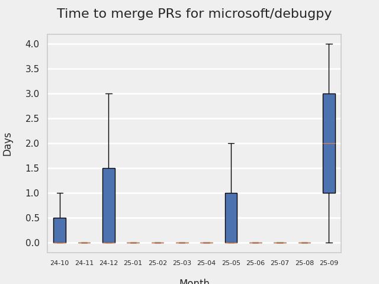
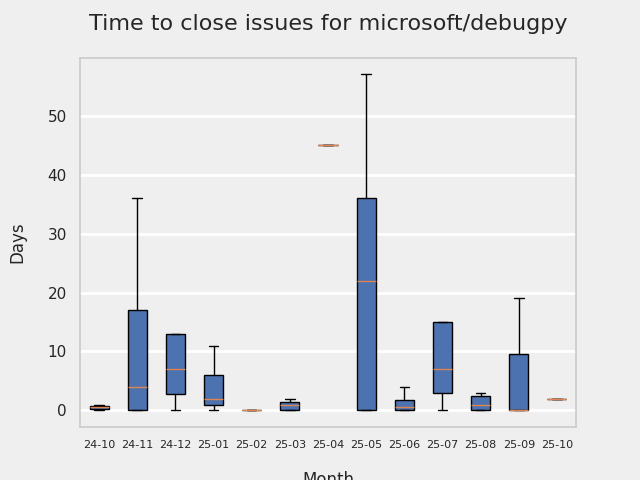
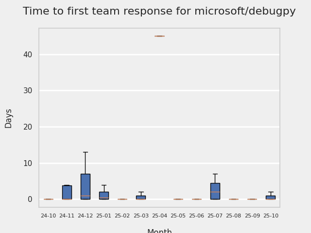

# GITHUB ISSUES REPORT FOR microsoft/debugpy

Generated on 2025-11-09 using: stale=30, all=True

* marks items that are new to report in past 1 day(s)

## FOR ISSUES THAT ARE MARKED AS BUGS:

### Issues in debugpy that need a response from team:

| Days Ago | Issue | Title |
| --- | --- | --- |
 |  OP:746  |[1413](https://github.com/microsoft/debugpy/issues/1413 "Attach function doesn't work with ubuntu 22.04") | Attach function doesn't work with ubuntu 22.04 |
 |  OP:811  |[1365](https://github.com/microsoft/debugpy/issues/1365 "attach_to_pid() does not work with lazy imports (PEP 690)") | attach_to_pid() does not work with lazy imports (PEP 690) |
 |  OP:817  |[1355](https://github.com/microsoft/debugpy/issues/1355 "Pytest debugger isn't compatible with vscode+playwright") | Pytest debugger isn't compatible with vscode+playwright |
 |  OP:829  |[1342](https://github.com/microsoft/debugpy/issues/1342 "Can not debug multiprocess code with streamlit") | Can not debug multiprocess code with streamlit |
 |  OP:834  |[1340](https://github.com/microsoft/debugpy/issues/1340 "Generic class using ParamSpec raises TypeError in Python < 3.10, with User Uncaught Exceptions + justMyCode: false") | Generic class using ParamSpec raises TypeError in Python < 3.10, with User Uncaught Exceptions + justMyCode: false |
 |  OP:836  |[1336](https://github.com/microsoft/debugpy/issues/1336 "VSCode sometimes stuck on breakpoint when debugging an embedded interpreter") | VSCode sometimes stuck on breakpoint when debugging an embedded interpreter |
 |  OP:871  |[1323](https://github.com/microsoft/debugpy/issues/1323 "Commit 5601342 breaks test_attach_pid_client tests on Python 3.11") | Commit 5601342 breaks test_attach_pid_client tests on Python 3.11 |
 |  OP:873  |[1315](https://github.com/microsoft/debugpy/issues/1315 "Debugging Django in Docker container with VS Code doesn't engage debug inspector") | Debugging Django in Docker container with VS Code doesn't engage debug inspector |
 |  OP:922  |[1285](https://github.com/microsoft/debugpy/issues/1285 "Terminal cuts off long strings when debugging") | Terminal cuts off long strings when debugging |
 |  OP:964  |[1248](https://github.com/microsoft/debugpy/issues/1248 "User Uncaught Exceptions fails on imports") | User Uncaught Exceptions fails on imports |
 |  OP:975  |[1236](https://github.com/microsoft/debugpy/issues/1236 "Local and global variables are not available in list comprehensions in the debug console") | Local and global variables are not available in list comprehensions in the debug console |

### Issues in debugpy that have comments from OP after last team response:

| Days Ago | Issue | Title |
| --- | --- | --- |
 |  TM:244, OP:244  |[1671](https://github.com/microsoft/debugpy/issues/1671 "Specific characters in path of parent directories of file causes debugger to crash.") | Specific characters in path of parent directories of file causes debugger to crash. |
 |  TM:524, OP:524  |[1593](https://github.com/microsoft/debugpy/issues/1593 "python debugger ignores breakpoints?") | python debugger ignores breakpoints? |
 |  TM:719, OP:719  |[1465](https://github.com/microsoft/debugpy/issues/1465 "Cannot attach Python debugger to debugpy within a future inside Docker container") | Cannot attach Python debugger to debugpy within a future inside Docker container |
 |  TM:706, OP:706  |[1410](https://github.com/microsoft/debugpy/issues/1410 "How to make debugpy respect custom eval frame functions?") | How to make debugpy respect custom eval frame functions? |
 |  TM:787, OP:784  |[1384](https://github.com/microsoft/debugpy/issues/1384 "Cannot run Debugger on macOS (pydev debugger: critical: unable to get real case for file. Details:)") | Cannot run Debugger on macOS (pydev debugger: critical: unable to get real case for file. Details:) |
 |  TM:926, OP:838  |[1283](https://github.com/microsoft/debugpy/issues/1283 "Python Debugger stops in first few seconds without output") | Python Debugger stops in first few seconds without output |
 |  TM:1490, OP:1490  |[750](https://github.com/microsoft/debugpy/issues/750 "Support PEP 582 (__pypackages__) for just-my-code and user-uncaught exceptions") | Support PEP 582 (__pypackages__) for just-my-code and user-uncaught exceptions |

### Issues in debugpy that have comments from 3rd party after last team response:

| Days Ago | Issue | Title |
| --- | --- | --- |
 |  P:565,  |[1521](https://github.com/microsoft/debugpy/issues/1521 "Running debugging shows errors, but the functionality is normal.") | Running debugging shows errors, but the functionality is normal. |
 |  P:257,  |[1464](https://github.com/microsoft/debugpy/issues/1464 "remote vscode attach process pid failed") | remote vscode attach process pid failed |
 |  P:155,  |[1284](https://github.com/microsoft/debugpy/issues/1284 "Debugging under python 3.11 will skip the breakpoint") | Debugging under python 3.11 will skip the breakpoint |
 |  P:242,  |[1271](https://github.com/microsoft/debugpy/issues/1271 "Timeout while using vscode debugger with Unicon") | Timeout while using vscode debugger with Unicon |
 |  P:1102,  |[712](https://github.com/microsoft/debugpy/issues/712 "notification like &quot;Failed launch debugger for child process xxxx&quot;.") | notification like "Failed launch debugger for child process xxxx". |
 |  P:14,  |[286](https://github.com/microsoft/debugpy/issues/286 "Attach to local process assumes i386 architecture? ") | Attach to local process assumes i386 architecture?  |

### Issues in debugpy that have no external responses since team response in 30+ days:

| Days Ago | Issue | Title |
| --- | --- | --- |
 |  TM:417  |[1678](https://github.com/microsoft/debugpy/issues/1678 "Parent process venv is not passed through to python subprocesses when using internalConsole") | Parent process venv is not passed through to python subprocesses when using internalConsole |
 |  TM:244  |[1499](https://github.com/microsoft/debugpy/issues/1499 "Python debugger changes __file__") | Python debugger changes __file__ |
 |  TM:710  |[1463](https://github.com/microsoft/debugpy/issues/1463 "Timeout waiting for debugger connection to running pythonnet process") | Timeout waiting for debugger connection to running pythonnet process |
 |  TM:748  |[1406](https://github.com/microsoft/debugpy/issues/1406 "IORedirector doesn't behave like IOBase causing problems interacting with stdout and stderr") | IORedirector doesn't behave like IOBase causing problems interacting with stdout and stderr |
 |  TM:755  |[1397](https://github.com/microsoft/debugpy/issues/1397 "Can't use debugpy in macos/vscode. Immediately Finishes (CANNOT USE these API proposals 'portsAttributes')") | Can't use debugpy in macos/vscode. Immediately Finishes (CANNOT USE these API proposals 'portsAttributes') |
 |  TM:706  |[1396](https://github.com/microsoft/debugpy/issues/1396 "Cannot run Debugpy - ms-python.debugpy CANNOT USE these API proposals (Macos M1)") | Cannot run Debugpy - ms-python.debugpy CANNOT USE these API proposals (Macos M1) |
 |  TM:789  |[1382](https://github.com/microsoft/debugpy/issues/1382 "Python debugger frozen eternall with poetry env") | Python debugger frozen eternall with poetry env |
 |  TM:412  |[1338](https://github.com/microsoft/debugpy/issues/1338 "Debugpy Server Disconnects Unexpectedly when Inspecting Variable") | Debugpy Server Disconnects Unexpectedly when Inspecting Variable |
 |  TM:788  |[1288](https://github.com/microsoft/debugpy/issues/1288 "Can't debug if project resides in folder whose name contains special characters") | Can't debug if project resides in folder whose name contains special characters |
 |  TM:919  |[1272](https://github.com/microsoft/debugpy/issues/1272 "When using debugger in remote environment it hangs and never successfully breaks when reaching a breakpoint") | When using debugger in remote environment it hangs and never successfully breaks when reaching a breakpoint |
 |  TM:139  |[1206](https://github.com/microsoft/debugpy/issues/1206 "Debugger with gevent doesn't hit breakpoints") | Debugger with gevent doesn't hit breakpoints |
 |  TM:1012  |[1193](https://github.com/microsoft/debugpy/issues/1193 "Debug crashes when running a Python2 subprocess") | Debug crashes when running a Python2 subprocess |
 |  TM:1012  |[1041](https://github.com/microsoft/debugpy/issues/1041 "Breakpoints on secondary threads don't trigger when using PyQt5") | Breakpoints on secondary threads don't trigger when using PyQt5 |
 |  TM:1312  |[165](https://github.com/microsoft/debugpy/issues/165 "Entry points aren't being found while test debugging") | Entry points aren't being found while test debugging |
 |  TM:2015  |[171](https://github.com/microsoft/debugpy/issues/171 "Ctrl+C causes KeyboardInterrupt inside pydevd") | Ctrl+C causes KeyboardInterrupt inside pydevd |

---

## FOR ISSUES THAT ARE NOT MARKED AS BUGS:

### Issues in debugpy that need a response from team:

| Days Ago | Issue | Title |
| --- | --- | --- |
 |  OP:38  |[1964](https://github.com/microsoft/debugpy/issues/1964 "Source lookup fails for paths with “.zip_\” segment") | Source lookup fails for paths with “.zip_\” segment |
 |  OP:89  |[1945](https://github.com/microsoft/debugpy/issues/1945 "Add binary .whl for Android and iOS") | Add binary .whl for Android and iOS |
 |  OP:136  |[1916](https://github.com/microsoft/debugpy/issues/1916 "debugpy ignores isolated mode (-I)") | debugpy ignores isolated mode (-I) |
 |  OP:168  |[1898](https://github.com/microsoft/debugpy/issues/1898 "Documentation Typo") | Documentation Typo |
 |  OP:179  |[1891](https://github.com/microsoft/debugpy/issues/1891 "Multiprocessing child processes stall during VSCode debugpy breakpoints") | Multiprocessing child processes stall during VSCode debugpy breakpoints |
 |  OP:214  |[1901](https://github.com/microsoft/debugpy/issues/1901 "wx.EventLoop() deprecation warning") | wx.EventLoop() deprecation warning |
 |  OP:220  |[1886](https://github.com/microsoft/debugpy/issues/1886 "Set `justMyCode` from the CLI") | Set `justMyCode` from the CLI |
 |  OP:222  |[1884](https://github.com/microsoft/debugpy/issues/1884 "Memory leak when debugging `asyncio.create_subprocess_shell` calls") | Memory leak when debugging `asyncio.create_subprocess_shell` calls |
 |  OP:286  |[1818](https://github.com/microsoft/debugpy/issues/1818 "Add configuration option to issue a SIGTERM (or other signal) when the debugger is being stopped") | Add configuration option to issue a SIGTERM (or other signal) when the debugger is being stopped |
 |  OP:330  |[1782](https://github.com/microsoft/debugpy/issues/1782 "Checks wether matplotlib's backend is interactive even though matplotlib is not required and not installed") | Checks wether matplotlib's backend is interactive even though matplotlib is not required and not installed |
 |  OP:393  |[1699](https://github.com/microsoft/debugpy/issues/1699 "PreLaunchTask correctly waits for background task to wait for client connection, then fails with vague popuop") | PreLaunchTask correctly waits for background task to wait for client connection, then fails with vague popuop |
 |  OP:439  |[1659](https://github.com/microsoft/debugpy/issues/1659 "`distutils` is deprecated and removed in Python 3.12") | `distutils` is deprecated and removed in Python 3.12 |
 |  OP:445  |[1656](https://github.com/microsoft/debugpy/issues/1656 "debugpy.listen() doesn't return endpoint if &quot;in_process_debug_adapter=True&quot; is passed") | debugpy.listen() doesn't return endpoint if "in_process_debug_adapter=True" is passed |
 |  OP:452  |[1652](https://github.com/microsoft/debugpy/issues/1652 "Matplotlib backend issue (TkAgg)") | Matplotlib backend issue (TkAgg) |
 |  OP:479  |[1629](https://github.com/microsoft/debugpy/issues/1629 "Updating Extension to DAP Client Reference") | Updating Extension to DAP Client Reference |
 |  OP:480  |[1627](https://github.com/microsoft/debugpy/issues/1627 "Can't enter core python libraries in debug mode") | Can't enter core python libraries in debug mode |
 |  OP:492  |[1620](https://github.com/microsoft/debugpy/issues/1620 "Updated pytest-timeout changes internal functions") | Updated pytest-timeout changes internal functions |
 |  OP:498  |[1615](https://github.com/microsoft/debugpy/issues/1615 "Got stuck when debugging a multi-process program in PyTorch") | Got stuck when debugging a multi-process program in PyTorch |
 |  OP:538  |[1587](https://github.com/microsoft/debugpy/issues/1587 "Error : TypeError: '>' not supported between instances of 'int' and 'NoneType'") | Error : TypeError: '>' not supported between instances of 'int' and 'NoneType' |
 |  OP:547  |[1583](https://github.com/microsoft/debugpy/issues/1583 "IPython Qt incorrect string formatting in raised error") | IPython Qt incorrect string formatting in raised error |
 |  OP:547  |[1582](https://github.com/microsoft/debugpy/issues/1582 "Run remote Debug success,But restart Debug errorInfo-show: connect ECONNREFUSED ip-address:5678") | Run remote Debug success,But restart Debug errorInfo-show: connect ECONNREFUSED ip-address:5678 |
 |  OP:548  |[1581](https://github.com/microsoft/debugpy/issues/1581 "Configure variables view presentation of `len()`") | Configure variables view presentation of `len()` |
 |  OP:560  |[1572](https://github.com/microsoft/debugpy/issues/1572 "The dead thread  won't disappear in call stack monitor") | The dead thread  won't disappear in call stack monitor |
 |  OP:590  |[1553](https://github.com/microsoft/debugpy/issues/1553 "possible to effectively get something like &quot;jupyter.debugJustMyCode&quot;: 'sometimes true'?") | possible to effectively get something like "jupyter.debugJustMyCode": 'sometimes true'? |
 |  OP:600  |[1541](https://github.com/microsoft/debugpy/issues/1541 "Cannot set remote breakpoints in Visual Studio Community 2022 (Version 17.9.3)") | Cannot set remote breakpoints in Visual Studio Community 2022 (Version 17.9.3) |
 |  OP:607  |[1539](https://github.com/microsoft/debugpy/issues/1539 "Python Debug console reports multiple wxPyDeprecationWarning when using wxPython 4.2.1") | Python Debug console reports multiple wxPyDeprecationWarning when using wxPython 4.2.1 |
 |  OP:607  |[1538](https://github.com/microsoft/debugpy/issues/1538 "Breakpoint set in source code are not hit when attaching to a devcontainer process") | Breakpoint set in source code are not hit when attaching to a devcontainer process |
 |  OP:607  |[1536](https://github.com/microsoft/debugpy/issues/1536 "Subprocess debugging not working when --pid and --configure-subProcess are used") | Subprocess debugging not working when --pid and --configure-subProcess are used |
 |  OP:616  |[1530](https://github.com/microsoft/debugpy/issues/1530 "Easy Post Mortem Function") | Easy Post Mortem Function |
 |  OP:620  |[1527](https://github.com/microsoft/debugpy/issues/1527 "Debug should skip arguments assignment for step into action by default") | Debug should skip arguments assignment for step into action by default |
 |  OP:634  |[1522](https://github.com/microsoft/debugpy/issues/1522 "warning on code property") | warning on code property |
 |  OP:648  |[1511](https://github.com/microsoft/debugpy/issues/1511 "Can't load source files when .pyc files have wrong filepaths inside.") | Can't load source files when .pyc files have wrong filepaths inside. |
 |  OP:651  |[1503](https://github.com/microsoft/debugpy/issues/1503 "Support debugging of indirect child processes.") | Support debugging of indirect child processes. |
 |  OP:653  |[1501](https://github.com/microsoft/debugpy/issues/1501 "Allow multiple debug connections in VS code using the same port") | Allow multiple debug connections in VS code using the same port |
 |  OP:657  |[1497](https://github.com/microsoft/debugpy/issues/1497 "Debugger hits breakpoints, but doesn't retrieve variables or continue execution") | Debugger hits breakpoints, but doesn't retrieve variables or continue execution |
 |  OP:662  |[1495](https://github.com/microsoft/debugpy/issues/1495 "Hitting a breakpoint in symlinked file opens a new instance of the file") | Hitting a breakpoint in symlinked file opens a new instance of the file |
 |  OP:662  |[1494](https://github.com/microsoft/debugpy/issues/1494 "Debug windows stuck on loading local variable(large img tensor) when debug pytorch code.") | Debug windows stuck on loading local variable(large img tensor) when debug pytorch code. |
 |  OP:678  |[1491](https://github.com/microsoft/debugpy/issues/1491 "debug python with docker-compose cannot hit breakpoint") | debug python with docker-compose cannot hit breakpoint |
 |  OP:691  |[1488](https://github.com/microsoft/debugpy/issues/1488 "Add PyQt6 and PySide6 support for python debugger to avoid import errors and fix breakpoint issue") | Add PyQt6 and PySide6 support for python debugger to avoid import errors and fix breakpoint issue |
 |  OP:694  |[1486](https://github.com/microsoft/debugpy/issues/1486 "Bug while debugging list comprehension (02)") | Bug while debugging list comprehension (02) |
 |  OP:723  |[1462](https://github.com/microsoft/debugpy/issues/1462 "test_attach_pid_client fail on Linux") | test_attach_pid_client fail on Linux |
 |  OP:759  |[1479](https://github.com/microsoft/debugpy/issues/1479 "Can't expand Numpy array to view its elements") | Can't expand Numpy array to view its elements |
 |  OP:776  |[1400](https://github.com/microsoft/debugpy/issues/1400 "Debugging Panel Apps written as IPython Notebook in VSCode") | Debugging Panel Apps written as IPython Notebook in VSCode |
 |  OP:810  |[1367](https://github.com/microsoft/debugpy/issues/1367 "Make breakpoints' `adjust_line` configurable") | Make breakpoints' `adjust_line` configurable |
 |  OP:810  |[1366](https://github.com/microsoft/debugpy/issues/1366 "Support DAP's `hitBreakpointIds`") | Support DAP's `hitBreakpointIds` |
 |  OP:844  |[1333](https://github.com/microsoft/debugpy/issues/1333 "Release debugpy source as tar.gz instead of zip") | Release debugpy source as tar.gz instead of zip |
 |  OP:852  |[1328](https://github.com/microsoft/debugpy/issues/1328 "View thread state in debugger without breakpoints") | View thread state in debugger without breakpoints |
 |  OP:861  |[1326](https://github.com/microsoft/debugpy/issues/1326 "`log message` support the `=` of f string to display both the expression text and its value?") | `log message` support the `=` of f string to display both the expression text and its value? |
 |  OP:881  |[1310](https://github.com/microsoft/debugpy/issues/1310 "Variables pane stuck loading") | Variables pane stuck loading |
 |  OP:881  |[1311](https://github.com/microsoft/debugpy/issues/1311 "Support debugging console scripts from launch.json") | Support debugging console scripts from launch.json |
 |  OP:889  |[1308](https://github.com/microsoft/debugpy/issues/1308 "remote debug port stucks upon `nc -z` but `nc` works") | remote debug port stucks upon `nc -z` but `nc` works |
 |  OP:892  |[1306](https://github.com/microsoft/debugpy/issues/1306 "Option to not consider SystemExit as an uncaught exception") | Option to not consider SystemExit as an uncaught exception |
 |  OP:962  |[1250](https://github.com/microsoft/debugpy/issues/1250 "Debugging code with `pexpect.spawn` is taking 5s longer  ") | Debugging code with `pexpect.spawn` is taking 5s longer   |
 |  OP:969  |[1245](https://github.com/microsoft/debugpy/issues/1245 "Don't collapse nested lists/tuples into ... in debugger | make debugging more like PyCharm") | Don't collapse nested lists/tuples into ... in debugger | make debugging more like PyCharm |

### Issues in debugpy that have comments from OP after last team response:

| Days Ago | Issue | Title |
| --- | --- | --- |
 |  TM:39, OP:38  |[1963](https://github.com/microsoft/debugpy/issues/1963 "Breakpoints don't work in threads created after `debugpy.listen()` is called") | Breakpoints don't work in threads created after `debugpy.listen()` is called |
 |  TM:68, OP:64  |[1952](https://github.com/microsoft/debugpy/issues/1952 "debugpy exits due to Xfrozen_modules") | debugpy exits due to Xfrozen_modules |
 |  TM:73, OP:58  |[1951](https://github.com/microsoft/debugpy/issues/1951 "AttributeError on Debug Run with PyTest") | AttributeError on Debug Run with PyTest |
 |  TM:89, OP:88  |[1929](https://github.com/microsoft/debugpy/issues/1929 "Script subprocesses cannot be debugged") | Script subprocesses cannot be debugged |
 |  TM:138, OP:137  |[1914](https://github.com/microsoft/debugpy/issues/1914 "Allow explicitly mark paths as library to exclude from 'justMyCode'") | Allow explicitly mark paths as library to exclude from 'justMyCode' |
 |  TM:144, OP:144  |[1912](https://github.com/microsoft/debugpy/issues/1912 "Debugging with shortly-lived subprocesses gives 'Server disconnected unexpectedly'") | Debugging with shortly-lived subprocesses gives 'Server disconnected unexpectedly' |
 |  TM:151, OP:149  |[1908](https://github.com/microsoft/debugpy/issues/1908 "VS Code Debugger Freezes When Using wrap_wsgi_app with debugpy") | VS Code Debugger Freezes When Using wrap_wsgi_app with debugpy |
 |  TM:163, OP:159  |[1905](https://github.com/microsoft/debugpy/issues/1905 "TypeError with joblib while checking &quot;__future__&quot; in code") | TypeError with joblib while checking "__future__" in code |
 |  TM:96, OP:95  |[1887](https://github.com/microsoft/debugpy/issues/1887 "Breakpoints in non-stdlib modules named `io.py` are always skipped") | Breakpoints in non-stdlib modules named `io.py` are always skipped |
 |  TM:356, OP:351  |[1739](https://github.com/microsoft/debugpy/issues/1739 "Timed out error while using debugpy in IntegratedTerminal") | Timed out error while using debugpy in IntegratedTerminal |
 |  TM:498, OP:488  |[1604](https://github.com/microsoft/debugpy/issues/1604 "Fatal Python Error on debugpy.adapter shutdown") | Fatal Python Error on debugpy.adapter shutdown |
 |  TM:515, OP:514  |[1599](https://github.com/microsoft/debugpy/issues/1599 "Remotely debug Python code on Linux from Microsoft Visual Studio 2022:  cannot set breakpoint (Breakpoint in file that does not exist)") | Remotely debug Python code on Linux from Microsoft Visual Studio 2022:  cannot set breakpoint (Breakpoint in file that does not exist) |
 |  TM:270, OP:236  |[1579](https://github.com/microsoft/debugpy/issues/1579 "Debugger times out if shell startup is &quot;slow&quot;") | Debugger times out if shell startup is "slow" |
 |  TM:577, OP:370  |[1563](https://github.com/microsoft/debugpy/issues/1563 "FEAT: Support ipython's `_repr_*_()` protocol") | FEAT: Support ipython's `_repr_*_()` protocol |
 |  TM:607, OP:606  |[1537](https://github.com/microsoft/debugpy/issues/1537 "Using multiprocessing -> TypeError: Cannot read properties of null (reading 'testsuites')") | Using multiprocessing -> TypeError: Cannot read properties of null (reading 'testsuites') |
 |  TM:615, OP:604  |[1529](https://github.com/microsoft/debugpy/issues/1529 "api to retrieve debugpy endpoint and access token?") | api to retrieve debugpy endpoint and access token? |
 |  TM:636, OP:635  |[1519](https://github.com/microsoft/debugpy/issues/1519 "`set_trace`-releated deadlock when running inside Ansible with explicit listen-and-debug breakpoint") | `set_trace`-releated deadlock when running inside Ansible with explicit listen-and-debug breakpoint |
 |  TM:789, OP:785  |[1346](https://github.com/microsoft/debugpy/issues/1346 "Using rich.print() instead of print() in (evaluate in) debug console") | Using rich.print() instead of print() in (evaluate in) debug console |
 |  TM:789, OP:789  |[1344](https://github.com/microsoft/debugpy/issues/1344 "Auto-spawn IDE on breakpoint()") | Auto-spawn IDE on breakpoint() |
 |  TM:789, OP:788  |[1331](https://github.com/microsoft/debugpy/issues/1331 "`justMyCode` is too broad, allow some chosen libraries and hide the rest") | `justMyCode` is too broad, allow some chosen libraries and hide the rest |
 |  TM:930, OP:270  |[1277](https://github.com/microsoft/debugpy/issues/1277 "Breakpoint not working in Odoo with multiple workers (gevent)") | Breakpoint not working in Odoo with multiple workers (gevent) |
 |  TM:1027, OP:1026  |[1172](https://github.com/microsoft/debugpy/issues/1172 "atexit not respected in subprocess.Popen") | atexit not respected in subprocess.Popen |
 |  TM:1034, OP:1032  |[1169](https://github.com/microsoft/debugpy/issues/1169 "Missing examples of configurations") | Missing examples of configurations |
 |  TM:1039, OP:1034  |[1167](https://github.com/microsoft/debugpy/issues/1167 "Debugging support lazy variables") | Debugging support lazy variables |
 |  TM:1088, OP:1088  |[1130](https://github.com/microsoft/debugpy/issues/1130 "Allow server to configure its root") | Allow server to configure its root |
 |  TM:1112, OP:1112  |[1097](https://github.com/microsoft/debugpy/issues/1097 "debugpy.configure(python=) is not properly documented") | debugpy.configure(python=) is not properly documented |
 |  TM:1122, OP:1122  |[1085](https://github.com/microsoft/debugpy/issues/1085 "Return scope metadata on ScopesRequest") | Return scope metadata on ScopesRequest |
 |  TM:1059, OP:1056  |[1155](https://github.com/microsoft/debugpy/issues/1155 "Python debugger breaks on caught exception within a decorator and context manager") | Python debugger breaks on caught exception within a decorator and context manager |
 |  TM:1381, OP:1352  |[764](https://github.com/microsoft/debugpy/issues/764 "Problems with python in VSC, eg. not working logs and pathlib and importlib.util") | Problems with python in VSC, eg. not working logs and pathlib and importlib.util |

### Issues in debugpy that have comments from 3rd party after last team response:

| Days Ago | Issue | Title |
| --- | --- | --- |
 |  P:230,  |[1866](https://github.com/microsoft/debugpy/issues/1866 "DEBUGPY_ADAPTER_ENDPOINTS being invalid should output an error") | DEBUGPY_ADAPTER_ENDPOINTS being invalid should output an error |
 |  P:184,  |[1819](https://github.com/microsoft/debugpy/issues/1819 "Any object with more than two levels is truncated") | Any object with more than two levels is truncated |
 |  P:2,  |[1788](https://github.com/microsoft/debugpy/issues/1788 "WxPython/GTK3 graphical glitches starting with debugpy 1.8.8") | WxPython/GTK3 graphical glitches starting with debugpy 1.8.8 |
 |  P:64,  |[1757](https://github.com/microsoft/debugpy/issues/1757 "_pydevd_sys_monitoring_cython._get_func_code_info KeyError") | _pydevd_sys_monitoring_cython._get_func_code_info KeyError |
 |  P:398,  |[1685](https://github.com/microsoft/debugpy/issues/1685 "Python Debugger Attached to Azure Functions App Hangs Indefinitely at Breakpoint") | Python Debugger Attached to Azure Functions App Hangs Indefinitely at Breakpoint |
 |  P:387,  |[1660](https://github.com/microsoft/debugpy/issues/1660 "Reported slowness due in variable expansion") | Reported slowness due in variable expansion |
 |  P:256,  |[1568](https://github.com/microsoft/debugpy/issues/1568 "Allow clients to debug code from command line, like pdb or epdb ") | Allow clients to debug code from command line, like pdb or epdb  |
 |  P:52,  |[1525](https://github.com/microsoft/debugpy/issues/1525 "Display order of properties of a tensor object in debugging") | Display order of properties of a tensor object in debugging |
 |  P:119,  |[1767](https://github.com/microsoft/debugpy/issues/1767 "Debugger Dies in Multiprocessing Env") | Debugger Dies in Multiprocessing Env |
 |  P:704,  |[1409](https://github.com/microsoft/debugpy/issues/1409 "Debug console shows too much detail and too little data information ") | Debug console shows too much detail and too little data information  |
 |  P:527,  |[1679](https://github.com/microsoft/debugpy/issues/1679 "OSError on reload when running Werkzeug server with vs code debugger") | OSError on reload when running Werkzeug server with vs code debugger |
 |  P:228,  |[1252](https://github.com/microsoft/debugpy/issues/1252 "[Feature request] Support connect to ipv6 address") | [Feature request] Support connect to ipv6 address |
 |  P:14,  |[1220](https://github.com/microsoft/debugpy/issues/1220 "Support attach-to-PID on macOS on ARM") | Support attach-to-PID on macOS on ARM |
 |  P:942,  |[1114](https://github.com/microsoft/debugpy/issues/1114 "Display Python asyncio Tasks in VS Code Debugger") | Display Python asyncio Tasks in VS Code Debugger |
 |  P:889,  |[460](https://github.com/microsoft/debugpy/issues/460 "Repeated debugpy.listen() calls should be an error") | Repeated debugpy.listen() calls should be an error |
 |  P:1081,  |[317](https://github.com/microsoft/debugpy/issues/317 "Make variable order for dict keys configurable") | Make variable order for dict keys configurable |

### Issues in debugpy that have no external responses since team response in 30+ days:

| Days Ago | Issue | Title |
| --- | --- | --- |
 |  TM:44  |[1959](https://github.com/microsoft/debugpy/issues/1959 "Add fundamental types to resolvers") | Add fundamental types to resolvers |
 |  TM:51  |[1958](https://github.com/microsoft/debugpy/issues/1958 "Document &quot;rules&quot;-option") | Document "rules"-option |
 |  TM:93  |[1937](https://github.com/microsoft/debugpy/issues/1937 "Python debugger creates &quot;Dummy-XX&quot; threads causing debugging to fail in callback/waypoint methods") | Python debugger creates "Dummy-XX" threads causing debugging to fail in callback/waypoint methods |
 |  TM:139  |[1913](https://github.com/microsoft/debugpy/issues/1913 "Pausing or adding new breakpoints halfway during running in VSCode makes the Python Exception lost") | Pausing or adding new breakpoints halfway during running in VSCode makes the Python Exception lost |
 |  TM:234  |[1873](https://github.com/microsoft/debugpy/issues/1873 "Pytest: stop on any failure in tests") | Pytest: stop on any failure in tests |
 |  TM:249  |[1857](https://github.com/microsoft/debugpy/issues/1857 "Allow modifying global variables from the variables panel") | Allow modifying global variables from the variables panel |
 |  TM:248  |[1854](https://github.com/microsoft/debugpy/issues/1854 "Issue with debugpy affecting objects refcount") | Issue with debugpy affecting objects refcount |
 |  TM:277  |[1820](https://github.com/microsoft/debugpy/issues/1820 "Not able to get debugpy attach (PID and host & port) working inside Zed code editor") | Not able to get debugpy attach (PID and host & port) working inside Zed code editor |
 |  TM:298  |[1809](https://github.com/microsoft/debugpy/issues/1809 "stuck  ，can't load variable") | stuck  ，can't load variable |
 |  TM:45  |[1807](https://github.com/microsoft/debugpy/issues/1807 "The debugging session fails silently immediately after clicking 'Start Debugging' (On Windows only)") | The debugging session fails silently immediately after clicking 'Start Debugging' (On Windows only) |
 |  TM:328  |[1783](https://github.com/microsoft/debugpy/issues/1783 "Remote attach debug server not dying upon killing the attached process") | Remote attach debug server not dying upon killing the attached process |
 |  TM:340  |[1754](https://github.com/microsoft/debugpy/issues/1754 "Visibility of user defined attributes in numpy ndarray subclasses") | Visibility of user defined attributes in numpy ndarray subclasses |
 |  TM:269  |[1749](https://github.com/microsoft/debugpy/issues/1749 "debugpy listen silently crashing") | debugpy listen silently crashing |
 |  TM:384  |[1710](https://github.com/microsoft/debugpy/issues/1710 "Regression : Timeout with azure identity") | Regression : Timeout with azure identity |
 |  TM:250  |[1853](https://github.com/microsoft/debugpy/issues/1853 "nushell doesn't work with debugpy (python debugger)") | nushell doesn't work with debugpy (python debugger) |
 |  TM:275  |[1777](https://github.com/microsoft/debugpy/issues/1777 "Please pass -Xfrozen_modules=off when debuging") | Please pass -Xfrozen_modules=off when debuging |
 |  TM:417  |[1672](https://github.com/microsoft/debugpy/issues/1672 "Support 'evaluateName' for dataframe columns") | Support 'evaluateName' for dataframe columns |
 |  TM:383  |[1669](https://github.com/microsoft/debugpy/issues/1669 "Debug fails in python jupyter notebook where cells have `execution_count: null`") | Debug fails in python jupyter notebook where cells have `execution_count: null` |
 |  TM:417  |[1675](https://github.com/microsoft/debugpy/issues/1675 "Incomplete call stack when raise from") | Incomplete call stack when raise from |
 |  TM:496  |[1616](https://github.com/microsoft/debugpy/issues/1616 "Importing pypinyin takes too much time (around 10min)") | Importing pypinyin takes too much time (around 10min) |
 |  TM:292  |[1607](https://github.com/microsoft/debugpy/issues/1607 "Enable debugpy to work with domain sockets") | Enable debugpy to work with domain sockets |
 |  TM:527  |[1592](https://github.com/microsoft/debugpy/issues/1592 "Microsoft Python Debugger not working in a virtual environment created with venv module on windows") | Microsoft Python Debugger not working in a virtual environment created with venv module on windows |
 |  TM:496  |[1584](https://github.com/microsoft/debugpy/issues/1584 "Attach to PID of application embedding Python not working in VS Code on Windows") | Attach to PID of application embedding Python not working in VS Code on Windows |
 |  TM:275  |[1561](https://github.com/microsoft/debugpy/issues/1561 "&quot;import akshare as ak&quot; blocks the debugger after I upgrade to python 3.12.2") | "import akshare as ak" blocks the debugger after I upgrade to python 3.12.2 |
 |  TM:334  |[1762](https://github.com/microsoft/debugpy/issues/1762 "Can't run particular pytest test in debug mode ") | Can't run particular pytest test in debug mode  |
 |  TM:608  |[1533](https://github.com/microsoft/debugpy/issues/1533 "Duplicate path error suddenly appears on debugging only") | Duplicate path error suddenly appears on debugging only |
 |  TM:137  |[1480](https://github.com/microsoft/debugpy/issues/1480 "Undocumented gdb Version (> 11.1) Requirements for Python Attach Mode ") | Undocumented gdb Version (> 11.1) Requirements for Python Attach Mode  |
 |  TM:264  |[1377](https://github.com/microsoft/debugpy/issues/1377 "Show Python Process names in debugger") | Show Python Process names in debugger |
 |  TM:789  |[1332](https://github.com/microsoft/debugpy/issues/1332 "Debug variable displays verbose info") | Debug variable displays verbose info |
 |  TM:873  |[1304](https://github.com/microsoft/debugpy/issues/1304 "Show a warning that we can't debug when &quot;--cov&quot; is in pytestArgs") | Show a warning that we can't debug when "--cov" is in pytestArgs |
 |  TM:887  |[1303](https://github.com/microsoft/debugpy/issues/1303 "When using python debugging class properties are showed after private and protected members.") | When using python debugging class properties are showed after private and protected members. |
 |  TM:307  |[1291](https://github.com/microsoft/debugpy/issues/1291 "Add debugger data breakpoints") | Add debugger data breakpoints |
 |  TM:307  |[1242](https://github.com/microsoft/debugpy/issues/1242 "1.6.6: pytest is failing") | 1.6.6: pytest is failing |
 |  TM:1025  |[1179](https://github.com/microsoft/debugpy/issues/1179 "Support DAP variable paging") | Support DAP variable paging |
 |  TM:1077  |[1134](https://github.com/microsoft/debugpy/issues/1134 "async code debugging") | async code debugging |
 |  TM:676  |[1084](https://github.com/microsoft/debugpy/issues/1084 "Unnecessary truncation") | Unnecessary truncation |
 |  TM:1339  |[814](https://github.com/microsoft/debugpy/issues/814 "Provide a way to notify users of where a RecursionError happens") | Provide a way to notify users of where a RecursionError happens |
 |  TM:990  |[807](https://github.com/microsoft/debugpy/issues/807 "Gracefully handle debugpy.listen() in subprocesses") | Gracefully handle debugpy.listen() in subprocesses |
 |  TM:1318  |[772](https://github.com/microsoft/debugpy/issues/772 "CXXABI requirement") | CXXABI requirement |
 |  TM:1718  |[549](https://github.com/microsoft/debugpy/issues/549 "timeout or cancelling of debugpy.connect call") | timeout or cancelling of debugpy.connect call |
 |  TM:249  |[510](https://github.com/microsoft/debugpy/issues/510 "Stop at breakpoints during evaluate request (recursive debugging)") | Stop at breakpoints during evaluate request (recursive debugging) |

## MOST FREQUENTLY CHANGED FILES (by # of PRs):

  6: src/debugpy/_vendored/pydevd/_pydevd_sys_monitoring/_pydevd_sys_monitoring.py

  6: src/debugpy/_vendored/pydevd/_pydevd_sys_monitoring/_pydevd_sys_monitoring_cython.c

  6: src/debugpy/_vendored/pydevd/_pydevd_sys_monitoring/_pydevd_sys_monitoring_cython.pyx

  5: CONTRIBUTING.md

  5: tests/debugpy/server/test_cli.py

