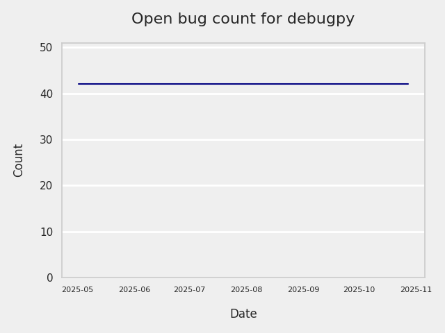

# GITHUB ISSUES REPORT FOR microsoft/debugpy

Generated on 2024-08-09 using: stale=30, all=True

* marks items that are new to report in past 1 day(s)

---

Query: 
query ($cursor: String, $chunk: Int) {
  search(query: "repo:microsoft/debugpy type:issue state:open created:>=2014-08-12", type:ISSUE, first: $chunk, after: $cursor) {
    issueCount
    pageInfo {
      endCursor
      hasNextPage
    }    
    edges {
      node {
        ... on Issue {
          number
          title
          createdAt
          closedAt        
          author {
            login
          }
          editor {
            login
          }
          timelineItems(
            first: 100
            itemTypes: [CLOSED_EVENT, LABELED_EVENT, UNLABELED_EVENT, ISSUE_COMMENT]
          ) {
            nodes {
              __typename
              ... on ClosedEvent {
                actor {
                  login
                }
                createdAt
              }
              ... on LabeledEvent {
                label {
                  name
                }
                actor {
                  login
                }
                createdAt
              }
              ... on UnlabeledEvent {
                label {
                  name
                }
                actor {
                  login
                }
                createdAt
              }
              ... on IssueComment {
                author {
                  login
                }
                createdAt
                lastEditedAt
              }
              ... on AssignedEvent {
                assignee {
                  ... on User {
                    login
                  }
                }
                createdAt              
              }
              ... on UnassignedEvent {
                assignee {
                  ... on User {
                    login
                  }
                }
                createdAt               
              }
            }
          }
        }
      }
    }
  }
}

Respons: {'search': {'issueCount': 0, 'pageInfo': {'endCursor': None, 'hasNextPage': False}, 'edges': []}}

Query: 
query ($cursor: String, $chunk: Int) {
  search(query: "repo:microsoft/debugpy is:pr created:>=2023-08-10 merged:<=2024-08-09", type:ISSUE, first: $chunk, after: $cursor) {
    issueCount
    pageInfo {
      endCursor
      hasNextPage
    }    
    edges {
      node {
        ... on PullRequest {
          createdAt
          mergedAt        
        }
      }
    }
  }
}

Respons: {'search': {'issueCount': 0, 'pageInfo': {'endCursor': None, 'hasNextPage': False}, 'edges': []}}

Query: 
query ($cursor: String, $chunk: Int) {
  search(query: "repo:microsoft/debugpy type:issue state:closed created:>=2023-08-10", type:ISSUE first: $chunk, after: $cursor) {
    issueCount
    pageInfo {
      endCursor
      hasNextPage
    }    
    edges {
      node {
        ... on Issue {
          number
          title
          createdAt
          closedAt        
          author {
            login
          }
          editor {
            login
          }
          timelineItems(
            first: 100
            itemTypes: [CLOSED_EVENT, LABELED_EVENT, UNLABELED_EVENT]
          ) {
            nodes {
              __typename
              ... on ClosedEvent {
                actor {
                  login
                }
                createdAt
              }
              ... on LabeledEvent {
                label {
                  name
                }
                actor {
                  login
                }
                createdAt
              }
              ... on UnlabeledEvent {
                label {
                  name
                }
                actor {
                  login
                }
                createdAt
              }
              ... on AssignedEvent {
                assignee {
                  ... on User {
                    login
                  }
                }
                createdAt              
              }
              ... on UnassignedEvent {
                assignee {
                  ... on User {
                    login
                  }
                }
                createdAt               
              }
            }
          }
        }
      }
    }
  }
}

Respons: {'search': {'issueCount': 0, 'pageInfo': {'endCursor': None, 'hasNextPage': False}, 'edges': []}}

