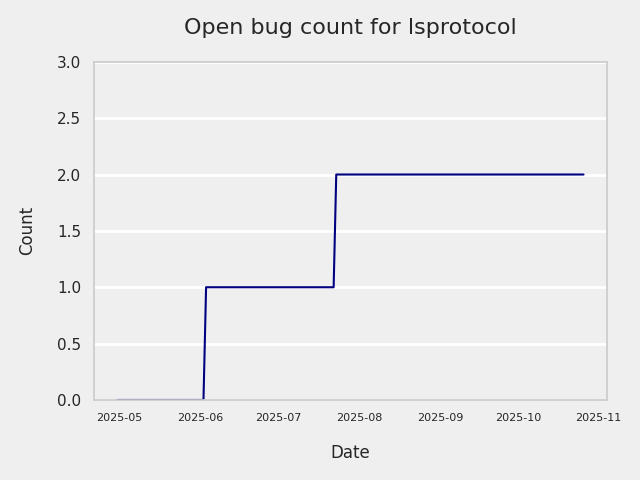
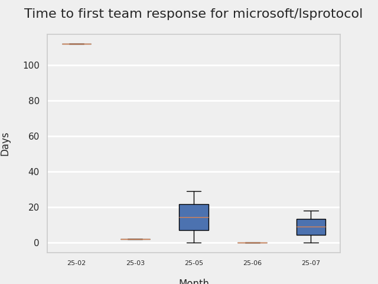
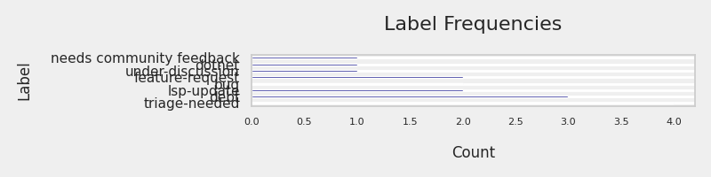
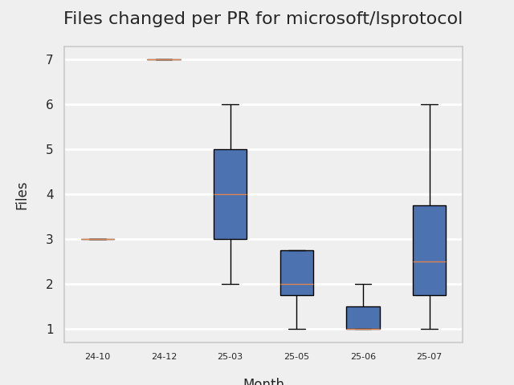
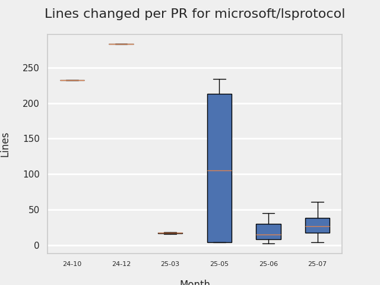

# GITHUB ISSUES REPORT FOR microsoft/lsprotocol

Generated on 2026-02-01 using: stale=30, all=True

* marks items that are new to report in past 7 day(s)

## FOR ISSUES THAT ARE MARKED AS BUGS:

### Issues in lsprotocol that have comments from 3rd party after last team response:

| Days Ago | Issue | Title |
| --- | --- | --- |
 |  P:67,  |[430](https://github.com/microsoft/lsprotocol/issues/430 "Python type converter bug") | Python type converter bug |

### Issues in lsprotocol that have no external responses since team response in 30+ days:

| Days Ago | Issue | Title |
| --- | --- | --- |
 |  TM:226  |[411](https://github.com/microsoft/lsprotocol/issues/411 "MessageActionItem should permit additional fields") | MessageActionItem should permit additional fields |

---

## FOR ISSUES THAT ARE NOT MARKED AS BUGS:

### Issues in lsprotocol that need a response from team:

| Days Ago | Issue | Title |
| --- | --- | --- |
 |  OP:51  |[446](https://github.com/microsoft/lsprotocol/issues/446 "Update LSP schema and model") | Update LSP schema and model |
 |  OP:90  |[445](https://github.com/microsoft/lsprotocol/issues/445 "Question around crates.io stable release") | Question around crates.io stable release |
 |  OP:97  |[444](https://github.com/microsoft/lsprotocol/issues/444 "rust: create name, or to_string() methods for LSPNotificationMethod, LSPRequestMethod") | rust: create name, or to_string() methods for LSPNotificationMethod, LSPRequestMethod |
 |  OP:156  |[442](https://github.com/microsoft/lsprotocol/issues/442 "rust: URI type implementation is non-compliant with LSP specification") | rust: URI type implementation is non-compliant with LSP specification |
 |  OP:159  |[441](https://github.com/microsoft/lsprotocol/issues/441 "Can the module load time of lsprotocol.types be reduced?") | Can the module load time of lsprotocol.types be reduced? |
 |  OP:213  |[429](https://github.com/microsoft/lsprotocol/issues/429 "Make `attrs` model hashable") | Make `attrs` model hashable |
 |  OP:222  |[428](https://github.com/microsoft/lsprotocol/issues/428 "LSPObject & LSPArray are private in lib.rs") | LSPObject & LSPArray are private in lib.rs |

### Issues in lsprotocol that have no external responses since team response in 30+ days:

| Days Ago | Issue | Title |
| --- | --- | --- |
 |  TM:934  |[241](https://github.com/microsoft/lsprotocol/issues/241 "Can this be made to run in a container?") | Can this be made to run in a container? |

## PULL REQUEST ACTIVITY

### Pull Requests still open that were opened more than 7 days ago:

| | PR | Created By | Created | Days Open | Closed/Merged | Closed/Merged By | Title |
| --- | --- | --- | --- | --- | --- | --- | --- |
| \* | [#360](https://github.com/microsoft/lsprotocol/pull/360) | T-256 | 2024-06-11 | 600 | - | - | move tests to their packages directory |
| \* | [#443](https://github.com/microsoft/lsprotocol/pull/443) | dovydenkovas | 2025-09-26 | 128 | - | - | Add support cattrs>=25.0.0. |

## MOST FREQUENTLY CHANGED FILES (by # of PRs):

