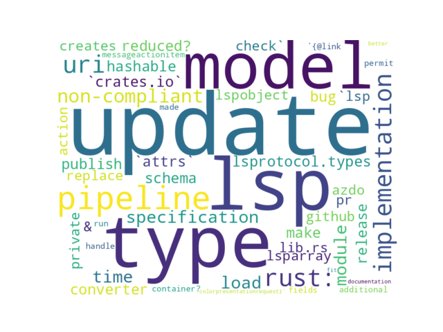

# GITHUB ISSUES REPORT FOR microsoft/lsprotocol

Generated on 2025-10-27 using: stale=30, all=True

* marks items that are new to report in past 1 day(s)

## FOR ISSUES THAT ARE MARKED AS BUGS:

### Issues in lsprotocol that have no external responses since team response in 30+ days:

| Days Ago | Issue | Title |
| --- | --- | --- |
 |  TM:96  |[430](https://github.com/microsoft/lsprotocol/issues/430 "Python type converter bug") | Python type converter bug |
 |  TM:128  |[411](https://github.com/microsoft/lsprotocol/issues/411 "MessageActionItem should permit additional fields") | MessageActionItem should permit additional fields |

---

## FOR ISSUES THAT ARE NOT MARKED AS BUGS:

### Issues in lsprotocol that need a response from team:

| Days Ago | Issue | Title |
| --- | --- | --- |
 |  OP:58  |[442](https://github.com/microsoft/lsprotocol/issues/442 "rust: URI type implementation is non-compliant with LSP specification") | rust: URI type implementation is non-compliant with LSP specification |
 |  OP:61  |[441](https://github.com/microsoft/lsprotocol/issues/441 "Can the module load time of lsprotocol.types be reduced?") | Can the module load time of lsprotocol.types be reduced? |
 |  OP:82  |[439](https://github.com/microsoft/lsprotocol/issues/439 "Update LSP schema and model") | Update LSP schema and model |
 |  OP:115  |[429](https://github.com/microsoft/lsprotocol/issues/429 "Make `attrs` model hashable") | Make `attrs` model hashable |
 |  OP:125  |[428](https://github.com/microsoft/lsprotocol/issues/428 "LSPObject & LSPArray are private in lib.rs") | LSPObject & LSPArray are private in lib.rs |

### Issues in lsprotocol that have no external responses since team response in 30+ days:

| Days Ago | Issue | Title |
| --- | --- | --- |
 |  TM:836  |[241](https://github.com/microsoft/lsprotocol/issues/241 "Can this be made to run in a container?") | Can this be made to run in a container? |

## MOST FREQUENTLY CHANGED FILES (by # of PRs):

