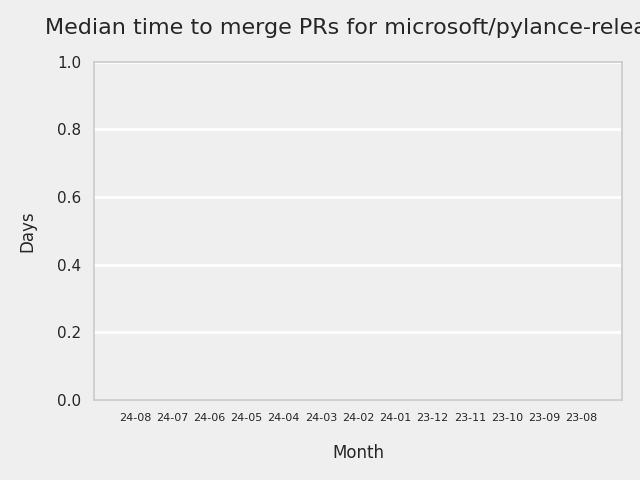
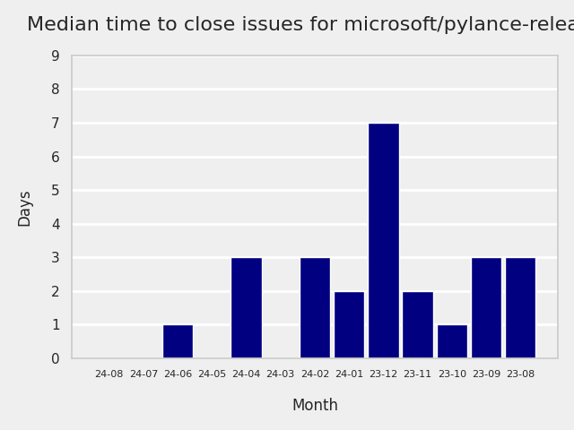

# GITHUB ISSUES REPORT FOR microsoft/pylance-release

Generated on 2024-08-12 using: stale=30, all=True

* marks items that are new to report in past 1 day(s)

## FOR ISSUES THAT ARE MARKED AS BUGS:

### Issues in pylance-release that need a response from team:

| Days Ago | Issue | Title |
| --- | --- | --- |
 |  OP:158  |[5595](https://github.com/microsoft/pylance-release/issues/5595 "Intellisense/completion does not work with two generic parameters until the second is supplied") | Intellisense/completion does not work with two generic parameters until the second is supplied |
 |  OP:174  |[5486](https://github.com/microsoft/pylance-release/issues/5486 "Intellisense not updating for workspace with multiple folders") | Intellisense not updating for workspace with multiple folders |

### Issues in pylance-release that have comments from OP after last team response:

| Days Ago | Issue | Title |
| --- | --- | --- |
 |  TM:10, OP:10  |[5812](https://github.com/microsoft/pylance-release/issues/5812 "Setting `python.analysis.nodeExecutable` in the user settings affects how pylance gets launched on VSCode remote") | Setting `python.analysis.nodeExecutable` in the user settings affects how pylance gets launched on VSCode remote |
 |  TM:153, OP:153  |[5616](https://github.com/microsoft/pylance-release/issues/5616 "No auto-completion provided when using overloaded `__new__` definitions") | No auto-completion provided when using overloaded `__new__` definitions |
 |  TM:157, OP:156  |[5600](https://github.com/microsoft/pylance-release/issues/5600 "Rename function must also handle first argument of Annotated if it is string") | Rename function must also handle first argument of Annotated if it is string |
 |  TM:165, OP:165  |[5508](https://github.com/microsoft/pylance-release/issues/5508 "Custom partial type package breaks other imports") | Custom partial type package breaks other imports |
 |  TM:177, OP:175  |[5472](https://github.com/microsoft/pylance-release/issues/5472 "Can't go to definition on `shutil.rmtree`") | Can't go to definition on `shutil.rmtree` |
 |  TM:245, OP:244  |[5235](https://github.com/microsoft/pylance-release/issues/5235 "Output error messages are garbled in Japanese-locale Windows") | Output error messages are garbled in Japanese-locale Windows |
 |  TM:251, OP:245  |[5203](https://github.com/microsoft/pylance-release/issues/5203 "Pytest fixtures and tests do not have autocompletion for types") | Pytest fixtures and tests do not have autocompletion for types |
 |  TM:496, OP:496  |[4185](https://github.com/microsoft/pylance-release/issues/4185 "Global objects not recognized if defined in a subsequent cell of a Jupyter notebook") | Global objects not recognized if defined in a subsequent cell of a Jupyter notebook |

### Issues in pylance-release that have comments from 3rd party after last team response:

| Days Ago | Issue | Title |
| --- | --- | --- |
 |  P:87,  |[5880](https://github.com/microsoft/pylance-release/issues/5880 "Pylance doesn't honor VSCode display language") | Pylance doesn't honor VSCode display language |
 |  P:115,  |[5652](https://github.com/microsoft/pylance-release/issues/5652 "Wrong auto-completion for `TypedDict` keys when assigning to a variable annotated as `Literal`") | Wrong auto-completion for `TypedDict` keys when assigning to a variable annotated as `Literal` |
 |  P:129,  |[5645](https://github.com/microsoft/pylance-release/issues/5645 "Workspace folder names are evaluated as regular expressions") | Workspace folder names are evaluated as regular expressions |
 |  P:4,  |[4391](https://github.com/microsoft/pylance-release/issues/4391 "Correct type hints for meta-function that takes a function as an argument (ParamSpec)") | Correct type hints for meta-function that takes a function as an argument (ParamSpec) |
 |  P:636,  |[3114](https://github.com/microsoft/pylance-release/issues/3114 "Assign to variable from commented-out magic command") | Assign to variable from commented-out magic command |

### Issues in pylance-release that have no external responses since team response in 30+ days:

| Days Ago | Issue | Title |
| --- | --- | --- |
 |  TM:31  |[6115](https://github.com/microsoft/pylance-release/issues/6115 "Notification of breaking api change with v1.92 release of VS Code") | Notification of breaking api change with v1.92 release of VS Code |
 |  TM:44  |[6066](https://github.com/microsoft/pylance-release/issues/6066 "Wrong argument provided during auto completion if inside a collection") | Wrong argument provided during auto completion if inside a collection |
 |  TM:52  |[5977](https://github.com/microsoft/pylance-release/issues/5977 "Annoying intellisense: showing me parameter popup during editing str parameter") | Annoying intellisense: showing me parameter popup during editing str parameter |
 |  TM:31  |[5965](https://github.com/microsoft/pylance-release/issues/5965 "Intellisense is popping up parameters when it is definitely NOT needed") | Intellisense is popping up parameters when it is definitely NOT needed |
 |  TM:87  |[5890](https://github.com/microsoft/pylance-release/issues/5890 "a subclass member variable is not recognized as the same variable in superclass unless it has an explicit type hint") | a subclass member variable is not recognized as the same variable in superclass unless it has an explicit type hint |
 |  TM:102  |[5840](https://github.com/microsoft/pylance-release/issues/5840 "Function Docstrings Obscured By Decorators That Return Protocols") | Function Docstrings Obscured By Decorators That Return Protocols |
 |  TM:96  |[5836](https://github.com/microsoft/pylance-release/issues/5836 "Improve docs to clarify that import heuristics don't work for local imports") | Improve docs to clarify that import heuristics don't work for local imports |
 |  TM:104  |[5808](https://github.com/microsoft/pylance-release/issues/5808 "parse error on magic statement on ipython mode.") | parse error on magic statement on ipython mode. |
 |  TM:136  |[5699](https://github.com/microsoft/pylance-release/issues/5699 "Auto format of strings doesn't work until you reload VS code") | Auto format of strings doesn't work until you reload VS code |
 |  TM:144  |[5663](https://github.com/microsoft/pylance-release/issues/5663 "Pylance reports problems in interactive window without a way to ignore them") | Pylance reports problems in interactive window without a way to ignore them |
 |  TM:136  |[5659](https://github.com/microsoft/pylance-release/issues/5659 "String interpolation (f strings) is breaking autocomplete") | String interpolation (f strings) is breaking autocomplete |
 |  TM:152  |[5625](https://github.com/microsoft/pylance-release/issues/5625 "Quick fix add import depends upon a file being open") | Quick fix add import depends upon a file being open |
 |  TM:160  |[5561](https://github.com/microsoft/pylance-release/issues/5561 "&quot;Extract method&quot; refactor produces incorrect code") | "Extract method" refactor produces incorrect code |
 |  TM:164  |[5458](https://github.com/microsoft/pylance-release/issues/5458 "Autocomplete for class parameters not working on 2023.12.1 and later versions") | Autocomplete for class parameters not working on 2023.12.1 and later versions |
 |  TM:182  |[5456](https://github.com/microsoft/pylance-release/issues/5456 "Incorrect function argument indentation") | Incorrect function argument indentation |
 |  TM:194  |[5421](https://github.com/microsoft/pylance-release/issues/5421 "Overriding `__getattribute__` messes up utility of &quot;Go to Definition&quot;") | Overriding `__getattribute__` messes up utility of "Go to Definition" |
 |  TM:192  |[5432](https://github.com/microsoft/pylance-release/issues/5432 "Pyright is using Incorrect Interpreter Path") | Pyright is using Incorrect Interpreter Path |
 |  TM:32  |[5299](https://github.com/microsoft/pylance-release/issues/5299 "Descriptor type shown in autocomplete popover is incorrect") | Descriptor type shown in autocomplete popover is incorrect |
 |  TM:31  |[5125](https://github.com/microsoft/pylance-release/issues/5125 "Refactoring is not possible if marked block starts with a comment") | Refactoring is not possible if marked block starts with a comment |
 |  TM:31  |[5091](https://github.com/microsoft/pylance-release/issues/5091 "block comments  not adapt with python.") | block comments  not adapt with python. |
 |  TM:157  |[5079](https://github.com/microsoft/pylance-release/issues/5079 "Signature helper for a overload without docstring is showing the docstring of a different overload (of the same function)") | Signature helper for a overload without docstring is showing the docstring of a different overload (of the same function) |
 |  TM:269  |[5006](https://github.com/microsoft/pylance-release/issues/5006 "TypedDict hover text does not show docstrings for inherited key type hints") | TypedDict hover text does not show docstrings for inherited key type hints |
 |  TM:334  |[4831](https://github.com/microsoft/pylance-release/issues/4831 "Types are not qualified on derived method completions") | Types are not qualified on derived method completions |
 |  TM:339  |[4812](https://github.com/microsoft/pylance-release/issues/4812 "Incorrectly marking ParamSpec variable with a clickable type inlay") | Incorrectly marking ParamSpec variable with a clickable type inlay |
 |  TM:339  |[4808](https://github.com/microsoft/pylance-release/issues/4808 "Pressing tab to autocomplete a named kwarg results in two `==` if replacing existing kwarg") | Pressing tab to autocomplete a named kwarg results in two `==` if replacing existing kwarg |
 |  TM:311  |[4914](https://github.com/microsoft/pylance-release/issues/4914 "[Bug] F2 Renames Shadowed Variables Globally") | [Bug] F2 Renames Shadowed Variables Globally |
 |  TM:132  |[4586](https://github.com/microsoft/pylance-release/issues/4586 "Refactoring detection is sensitive to comments") | Refactoring detection is sensitive to comments |
 |  TM:419  |[4489](https://github.com/microsoft/pylance-release/issues/4489 "Convert string to f-string when adding brackets around a text selection") | Convert string to f-string when adding brackets around a text selection |
 |  TM:426  |[4359](https://github.com/microsoft/pylance-release/issues/4359 "Pylance flags new submodules as missing imports with default settings") | Pylance flags new submodules as missing imports with default settings |
 |  TM:457  |[4354](https://github.com/microsoft/pylance-release/issues/4354 "New line leaves a trailing whitespace") | New line leaves a trailing whitespace |
 |  TM:285  |[4059](https://github.com/microsoft/pylance-release/issues/4059 "Pylance shows non-public exports in completion suggestions") | Pylance shows non-public exports in completion suggestions |
 |  TM:180  |[4065](https://github.com/microsoft/pylance-release/issues/4065 "Autoimport from module, not directly from file") | Autoimport from module, not directly from file |
 |  TM:510  |[4036](https://github.com/microsoft/pylance-release/issues/4036 "Code folding on `with` blocks breaks on multi-line `with` statement.") | Code folding on `with` blocks breaks on multi-line `with` statement. |
 |  TM:551  |[3921](https://github.com/microsoft/pylance-release/issues/3921 "Python Autocomplete breaks when there are common syntax errors") | Python Autocomplete breaks when there are common syntax errors |
 |  TM:487  |[3817](https://github.com/microsoft/pylance-release/issues/3817 "No Intellisense when the file is saved after Pylance initializes") | No Intellisense when the file is saved after Pylance initializes |
 |  TM:727  |[3153](https://github.com/microsoft/pylance-release/issues/3153 "Extract variable and method on arguments of decorator which precedes function definition doesn't create required definitions.") | Extract variable and method on arguments of decorator which precedes function definition doesn't create required definitions. |
 |  TM:488  |[2913](https://github.com/microsoft/pylance-release/issues/2913 "Semantic highlighing doesn't differentiate parameter passing by its name from usage inside the function") | Semantic highlighing doesn't differentiate parameter passing by its name from usage inside the function |
 |  TM:307  |[2226](https://github.com/microsoft/pylance-release/issues/2226 "vscode resolves paths with `..` in them even if the directory doesn't exist / has invalid name") | vscode resolves paths with `..` in them even if the directory doesn't exist / has invalid name |

---

## FOR ISSUES THAT ARE NOT MARKED AS BUGS:

### Issues in pylance-release that need a response from team:

| Days Ago | Issue | Title |
| --- | --- | --- |
 | \* OP:0  |[6258](https://github.com/microsoft/pylance-release/issues/6258 "Sub-module imports not resolved with module files the same name as sub-module folder.")  |Sub-module imports not resolved with module files the same name as sub-module folder. |
 |  OP:2  |[6252](https://github.com/microsoft/pylance-release/issues/6252 "Fixit imports from private file instead of re-export") | Fixit imports from private file instead of re-export |
 |  OP:15  |[6201](https://github.com/microsoft/pylance-release/issues/6201 "Allow toggling fstring using keyboard shortcut (vscode command)") | Allow toggling fstring using keyboard shortcut (vscode command) |
 |  OP:16  |[6199](https://github.com/microsoft/pylance-release/issues/6199 "Wrong &quot;Expected no arguments to <Flask SQL Alchemy> constructor&quot;") | Wrong "Expected no arguments to <Flask SQL Alchemy> constructor" |
 |  OP:91  |[5877](https://github.com/microsoft/pylance-release/issues/5877 "Syntax highlighting works differently in the last curly brackets in f-strings") | Syntax highlighting works differently in the last curly brackets in f-strings |
 |  OP:109  |[5801](https://github.com/microsoft/pylance-release/issues/5801 "How to remove unused imports from ALL files as a one-off task") | How to remove unused imports from ALL files as a one-off task |
 |  OP:111  |[5791](https://github.com/microsoft/pylance-release/issues/5791 "Syntax highlighting breaks down if you line break at curly bracket in f-strings") | Syntax highlighting breaks down if you line break at curly bracket in f-strings |
 |  OP:116  |[5773](https://github.com/microsoft/pylance-release/issues/5773 "Offer `self.` completions for methods and attributes") | Offer `self.` completions for methods and attributes |
 |  OP:126  |[5737](https://github.com/microsoft/pylance-release/issues/5737 "`__init__` params not displayed when hovering over type name") | `__init__` params not displayed when hovering over type name |
 |  OP:150  |[5642](https://github.com/microsoft/pylance-release/issues/5642 "Browsers reporting &quot;Virus detected&quot; and blocking download of Pylance Extension") | Browsers reporting "Virus detected" and blocking download of Pylance Extension |
 |  OP:153  |[5627](https://github.com/microsoft/pylance-release/issues/5627 "Function parameter not showing definition on hover for class") | Function parameter not showing definition on hover for class |
 |  OP:155  |[5611](https://github.com/microsoft/pylance-release/issues/5611 "Semantic Highlighting for Constants") | Semantic Highlighting for Constants |
 |  OP:156  |[5607](https://github.com/microsoft/pylance-release/issues/5607 "Documentation on dataclass constructor argument typed as optional with default value does not show the full type") | Documentation on dataclass constructor argument typed as optional with default value does not show the full type |
 |  OP:167  |[5521](https://github.com/microsoft/pylance-release/issues/5521 "# in raw string not highlighted as string") | # in raw string not highlighted as string |
 |  OP:186  |[5448](https://github.com/microsoft/pylance-release/issues/5448 "Pylance Fail to read package source") | Pylance Fail to read package source |
 |  OP:201  |[5392](https://github.com/microsoft/pylance-release/issues/5392 "`python.analysis.inlayHints.callArgumentNames`: Option to exclude argument names when the variable name matches") | `python.analysis.inlayHints.callArgumentNames`: Option to exclude argument names when the variable name matches |
 |  OP:225  |[5312](https://github.com/microsoft/pylance-release/issues/5312 "Show function return value documentation on hover over the `->` annotation") | Show function return value documentation on hover over the `->` annotation |
 |  OP:249  |[5219](https://github.com/microsoft/pylance-release/issues/5219 "'Move to file' refactoring should allow me to specify a new file name") | 'Move to file' refactoring should allow me to specify a new file name |
 |  OP:256  |[5185](https://github.com/microsoft/pylance-release/issues/5185 "Edge case in `Auto Format Strings` setting feature") | Edge case in `Auto Format Strings` setting feature |
 |  OP:263  |[5141](https://github.com/microsoft/pylance-release/issues/5141 "Prioritize completions for class types from union types in `match`/`case`") | Prioritize completions for class types from union types in `match`/`case` |
 |  OP:301  |[4965](https://github.com/microsoft/pylance-release/issues/4965 "Mention in Pyright docs how to override Pyright settings in Pylance") | Mention in Pyright docs how to override Pyright settings in Pylance |
 |  OP:317  |[5014](https://github.com/microsoft/pylance-release/issues/5014 "VSCode does't recognising installed packages with pipenv in virtualenv") | VSCode does't recognising installed packages with pipenv in virtualenv |

### Issues in pylance-release that have comments from OP after last team response:

| Days Ago | Issue | Title |
| --- | --- | --- |
 |  TM:2, OP:2  |[6251](https://github.com/microsoft/pylance-release/issues/6251 "pylance unable to recognize property render by another class") | pylance unable to recognize property render by another class |
 |  TM:4, OP:2  |[6247](https://github.com/microsoft/pylance-release/issues/6247 "Jupyter Notebooks imports not being resolved") | Jupyter Notebooks imports not being resolved |
 |  TM:12, OP:12  |[6209](https://github.com/microsoft/pylance-release/issues/6209 "Pylance fails to import just few classes") | Pylance fails to import just few classes |
 |  TM:38, OP:37  |[6091](https://github.com/microsoft/pylance-release/issues/6091 "enhancement to the auto-exclusion filter to pick up full Python runtime installations in addition to picking up virtual environments.") | enhancement to the auto-exclusion filter to pick up full Python runtime installations in addition to picking up virtual environments. |
 |  TM:47, OP:47  |[6047](https://github.com/microsoft/pylance-release/issues/6047 "Setting &quot;python.analysis.nodeExecutable&quot; requires a manual confirmation?") | Setting "python.analysis.nodeExecutable" requires a manual confirmation? |
 |  TM:41, OP:38  |[6036](https://github.com/microsoft/pylance-release/issues/6036 "There are still some deficiencies in automatic completion") | There are still some deficiencies in automatic completion |
 |  TM:27, OP:5  |[6034](https://github.com/microsoft/pylance-release/issues/6034 "Pylance 在过去 3 分钟内崩溃了 5 次。Pylance 不会重新启动。有关详细信息，请参阅输出。 in wsl windows project") | Pylance 在过去 3 分钟内崩溃了 5 次。Pylance 不会重新启动。有关详细信息，请参阅输出。 in wsl windows project |
 |  TM:68, OP:67  |[5970](https://github.com/microsoft/pylance-release/issues/5970 "The automatic behavior of `python.analysis.exclude` is ambiguous when I specify excluded paths.") | The automatic behavior of `python.analysis.exclude` is ambiguous when I specify excluded paths. |
 |  TM:89, OP:89  |[5864](https://github.com/microsoft/pylance-release/issues/5864 "Remote extension host terminates unexpectedly") | Remote extension host terminates unexpectedly |
 |  TM:96, OP:96  |[5820](https://github.com/microsoft/pylance-release/issues/5820 "Allow setting --max-old-space-size when using python.analysis.nodeExecutable") | Allow setting --max-old-space-size when using python.analysis.nodeExecutable |
 |  TM:108, OP:108  |[5799](https://github.com/microsoft/pylance-release/issues/5799 "How to set pylance memory  max limitation?") | How to set pylance memory  max limitation? |
 |  TM:131, OP:131  |[5669](https://github.com/microsoft/pylance-release/issues/5669 "A local variable is being treated as type 'Never' in an except handler") | A local variable is being treated as type 'Never' in an except handler |
 |  TM:150, OP:150  |[5614](https://github.com/microsoft/pylance-release/issues/5614 "Pylance using a lot of memory") | Pylance using a lot of memory |
 |  TM:153, OP:24  |[5564](https://github.com/microsoft/pylance-release/issues/5564 "Proposal: Use Nearest Configuration File") | Proposal: Use Nearest Configuration File |
 |  TM:165, OP:164  |[5542](https://github.com/microsoft/pylance-release/issues/5542 "Derived method completions use incorrect return type annotations when differing by `async` modifier.") | Derived method completions use incorrect return type annotations when differing by `async` modifier. |
 |  TM:188, OP:187  |[5414](https://github.com/microsoft/pylance-release/issues/5414 "grey out unused imports transitively") | grey out unused imports transitively |
 |  TM:158, OP:158  |[5377](https://github.com/microsoft/pylance-release/issues/5377 "Python and/or pylance is broken since last couple of updates ") | Python and/or pylance is broken since last couple of updates  |
 |  TM:162, OP:162  |[5284](https://github.com/microsoft/pylance-release/issues/5284 "Python smart navigation/auto-completion don't work anymore with 1.85.1") | Python smart navigation/auto-completion don't work anymore with 1.85.1 |
 |  TM:257, OP:173  |[5158](https://github.com/microsoft/pylance-release/issues/5158 "Add a feature to disable following symlinks when indexing repository") | Add a feature to disable following symlinks when indexing repository |
 |  TM:237, OP:237  |[5128](https://github.com/microsoft/pylance-release/issues/5128 "Slow code checking with a workspace on a slow network connection") | Slow code checking with a workspace on a slow network connection |
 |  TM:270, OP:270  |[5119](https://github.com/microsoft/pylance-release/issues/5119 "Bring along imports when copy and pasting code across files") | Bring along imports when copy and pasting code across files |
 |  TM:275, OP:275  |[4970](https://github.com/microsoft/pylance-release/issues/4970 "Feature: &quot;Add Explicit Type Annotation&quot; code-action") | Feature: "Add Explicit Type Annotation" code-action |
 |  TM:293, OP:292  |[4967](https://github.com/microsoft/pylance-release/issues/4967 "extension.bundle.js detects as Trojan") | extension.bundle.js detects as Trojan |
 |  TM:307, OP:306  |[4944](https://github.com/microsoft/pylance-release/issues/4944 "Add Semantic modifiers for keyword arguments in function or class call.") | Add Semantic modifiers for keyword arguments in function or class call. |
 |  TM:346, OP:344  |[4772](https://github.com/microsoft/pylance-release/issues/4772 "Type is not inferred properly in PyQt5 (Type is Unknown)") | Type is not inferred properly in PyQt5 (Type is Unknown) |
 |  TM:396, OP:396  |[4601](https://github.com/microsoft/pylance-release/issues/4601 "Go To Symbol doesn't work") | Go To Symbol doesn't work |
 |  TM:565, OP:565  |[3470](https://github.com/microsoft/pylance-release/issues/3470 "Long checking and analyzing operations when using JAX") | Long checking and analyzing operations when using JAX |

### Issues in pylance-release that have comments from 3rd party after last team response:

| Days Ago | Issue | Title |
| --- | --- | --- |
 | \* P:0,  |[6235](https://github.com/microsoft/pylance-release/issues/6235 "Pylance keeps crashing")  |Pylance keeps crashing |
 |  P:10,  |[6154](https://github.com/microsoft/pylance-release/issues/6154 "Pylance has crashed. Would you like to try using a Node.js executable to run the language server?") | Pylance has crashed. Would you like to try using a Node.js executable to run the language server? |
 |  P:3,  |[6029](https://github.com/microsoft/pylance-release/issues/6029 "Django stubs are out of date and cause erroneous type errors") | Django stubs are out of date and cause erroneous type errors |
 |  P:102,  |[5827](https://github.com/microsoft/pylance-release/issues/5827 "Bundled type hints for lxml are inconsistent with source, lxml-stubs") | Bundled type hints for lxml are inconsistent with source, lxml-stubs |
 |  P:10,  |[5762](https://github.com/microsoft/pylance-release/issues/5762 "Pylance Crashing Constantly: `Error: Unhandled method python/isTrustedWorkspace`") | Pylance Crashing Constantly: `Error: Unhandled method python/isTrustedWorkspace` |
 |  P:151,  |[5207](https://github.com/microsoft/pylance-release/issues/5207 "Allow specifying Pyright ") | Allow specifying Pyright  |
 |  P:61,  |[5138](https://github.com/microsoft/pylance-release/issues/5138 "Go-to-definition and find-all-references don't work on TypedDict properties") | Go-to-definition and find-all-references don't work on TypedDict properties |
 |  P:44,  |[4428](https://github.com/microsoft/pylance-release/issues/4428 "Autocomplete of Literal value only takes last overload into account") | Autocomplete of Literal value only takes last overload into account |
 |  P:65,  |[3100](https://github.com/microsoft/pylance-release/issues/3100 "Improve semantic highlighting of `TypeAlias`") | Improve semantic highlighting of `TypeAlias` |

### Issues in pylance-release that have no external responses since team response in 30+ days:

| Days Ago | Issue | Title |
| --- | --- | --- |
 |  TM:32  |[6114](https://github.com/microsoft/pylance-release/issues/6114 "python code are not rendered in correct colors in &quot;Visual Studio Dark&quot; and &quot;Default Dark Modern&quot; theme") | python code are not rendered in correct colors in "Visual Studio Dark" and "Default Dark Modern" theme |
 |  TM:44  |[6071](https://github.com/microsoft/pylance-release/issues/6071 "Quickfix add import proposes import that are not available for my python version (ignores sys.version_info)") | Quickfix add import proposes import that are not available for my python version (ignores sys.version_info) |
 |  TM:45  |[6045](https://github.com/microsoft/pylance-release/issues/6045 "Visible marking of ABC implementation possibility") | Visible marking of ABC implementation possibility |
 |  TM:56  |[6020](https://github.com/microsoft/pylance-release/issues/6020 "Duplicate common keys are shown when using union of `TypedDict`") | Duplicate common keys are shown when using union of `TypedDict` |
 |  TM:60  |[6006](https://github.com/microsoft/pylance-release/issues/6006 "Symlink would block pylance from working") | Symlink would block pylance from working |
 |  TM:60  |[6002](https://github.com/microsoft/pylance-release/issues/6002 "pylance performance issue generated by vscode") | pylance performance issue generated by vscode |
 |  TM:55  |[5991](https://github.com/microsoft/pylance-release/issues/5991 "Pylance crashed due to oom") | Pylance crashed due to oom |
 |  TM:75  |[5933](https://github.com/microsoft/pylance-release/issues/5933 "&quot;Go to symbol in workspace&quot; does not see the symbol") | "Go to symbol in workspace" does not see the symbol |
 |  TM:76  |[5922](https://github.com/microsoft/pylance-release/issues/5922 "&quot;Not a known attribute&quot; error") | "Not a known attribute" error |
 |  TM:79  |[5915](https://github.com/microsoft/pylance-release/issues/5915 "Better string completions") | Better string completions |
 |  TM:76  |[5894](https://github.com/microsoft/pylance-release/issues/5894 "`Import could not be resolved` with `[tool.setuptools.package-dir]`") | `Import could not be resolved` with `[tool.setuptools.package-dir]` |
 |  TM:79  |[5951](https://github.com/microsoft/pylance-release/issues/5951 "Renaming variable in a function renames it everywhere") | Renaming variable in a function renames it everywhere |
 |  TM:81  |[5892](https://github.com/microsoft/pylance-release/issues/5892 "Multiple libraries not recognized with errors is not a known attribute of module") | Multiple libraries not recognized with errors is not a known attribute of module |
 |  TM:72  |[5867](https://github.com/microsoft/pylance-release/issues/5867 "Pylance doesn't stop analyzing files") | Pylance doesn't stop analyzing files |
 |  TM:89  |[5861](https://github.com/microsoft/pylance-release/issues/5861 "v2024.5.1: Resolving the import of non-&quot;third party&quot; modules") | v2024.5.1: Resolving the import of non-"third party" modules |
 |  TM:103  |[5824](https://github.com/microsoft/pylance-release/issues/5824 "switch to a different tool for python syntax highlighting") | switch to a different tool for python syntax highlighting |
 |  TM:107  |[5770](https://github.com/microsoft/pylance-release/issues/5770 "Offer jedi users to switch to pylance (if they have pylance installed)") | Offer jedi users to switch to pylance (if they have pylance installed) |
 |  TM:115  |[5761](https://github.com/microsoft/pylance-release/issues/5761 "Support `python.analysis.nodeExecutable` in `.vscode/settings.json` and with `${workspaceFolder}` templating") | Support `python.analysis.nodeExecutable` in `.vscode/settings.json` and with `${workspaceFolder}` templating |
 |  TM:126  |[5733](https://github.com/microsoft/pylance-release/issues/5733 "Long string changes color if split it and add &quot;\&quot; to the end ") | Long string changes color if split it and add "\" to the end  |
 |  TM:130  |[5726](https://github.com/microsoft/pylance-release/issues/5726 "Pylance error for query_selector of Playwright") | Pylance error for query_selector of Playwright |
 |  TM:130  |[5718](https://github.com/microsoft/pylance-release/issues/5718 "pylance loses link to a object if it was returned by fixture") | pylance loses link to a object if it was returned by fixture |
 |  TM:130  |[5702](https://github.com/microsoft/pylance-release/issues/5702 "No type or autocomplete present in test function despite pytest fixture having type hint on mouseover") | No type or autocomplete present in test function despite pytest fixture having type hint on mouseover |
 |  TM:139  |[5689](https://github.com/microsoft/pylance-release/issues/5689 "Intellisense not working when using pylance (no suggestions Ctrl+Space)") | Intellisense not working when using pylance (no suggestions Ctrl+Space) |
 |  TM:131  |[5673](https://github.com/microsoft/pylance-release/issues/5673 "Quick fix does not respect analysis exclude path") | Quick fix does not respect analysis exclude path |
 |  TM:145  |[5658](https://github.com/microsoft/pylance-release/issues/5658 "Limit IntelliSense features on Copilot Chat code blocks ") | Limit IntelliSense features on Copilot Chat code blocks  |
 |  TM:149  |[5650](https://github.com/microsoft/pylance-release/issues/5650 "Importing from tests prefers deeper imports over package entry-point") | Importing from tests prefers deeper imports over package entry-point |
 |  TM:149  |[5648](https://github.com/microsoft/pylance-release/issues/5648 "Creation of `py.typed` is not detected") | Creation of `py.typed` is not detected |
 |  TM:154  |[5612](https://github.com/microsoft/pylance-release/issues/5612 "Semantic Token Type / Tooltip Info changes depending on order of Assignments") | Semantic Token Type / Tooltip Info changes depending on order of Assignments |
 |  TM:153  |[5618](https://github.com/microsoft/pylance-release/issues/5618 "Intellisense breaks with this extension in docker.") | Intellisense breaks with this extension in docker. |
 |  TM:159  |[5584](https://github.com/microsoft/pylance-release/issues/5584 "Parentheses and the atom they contain are both colored") | Parentheses and the atom they contain are both colored |
 |  TM:74  |[5475](https://github.com/microsoft/pylance-release/issues/5475 "Extremely slow renaming folders") | Extremely slow renaming folders |
 |  TM:187  |[5429](https://github.com/microsoft/pylance-release/issues/5429 "No docstrings when using pylance in vscode.dev") | No docstrings when using pylance in vscode.dev |
 |  TM:198  |[5410](https://github.com/microsoft/pylance-release/issues/5410 "Docstrings on pytest fixtures") | Docstrings on pytest fixtures |
 |  TM:201  |[5386](https://github.com/microsoft/pylance-release/issues/5386 "Rename key in TypedDict using &quot;rename symbol&quot; refactor should update all instances of that TypedDict") | Rename key in TypedDict using "rename symbol" refactor should update all instances of that TypedDict |
 |  TM:199  |[5385](https://github.com/microsoft/pylance-release/issues/5385 "option to disable double-click to insert for inlay hints") | option to disable double-click to insert for inlay hints |
 |  TM:217  |[5333](https://github.com/microsoft/pylance-release/issues/5333 "Autocomplete for Literal with formatted string type hint") | Autocomplete for Literal with formatted string type hint |
 |  TM:222  |[5310](https://github.com/microsoft/pylance-release/issues/5310 "Moving multiple files or renaming modules doesn't refactor imports") | Moving multiple files or renaming modules doesn't refactor imports |
 |  TM:157  |[5302](https://github.com/microsoft/pylance-release/issues/5302 "Repo indexing is confused") | Repo indexing is confused |
 |  TM:195  |[5231](https://github.com/microsoft/pylance-release/issues/5231 "&quot;Quick Fix&quot; doesn't suggest `__init__.py` imports") | "Quick Fix" doesn't suggest `__init__.py` imports |
 |  TM:251  |[5140](https://github.com/microsoft/pylance-release/issues/5140 "Previously-checked literals are offered in `match`/`case`") | Previously-checked literals are offered in `match`/`case` |
 |  TM:199  |[5072](https://github.com/microsoft/pylance-release/issues/5072 "Filters for autoimport suggestions") | Filters for autoimport suggestions |
 |  TM:177  |[5021](https://github.com/microsoft/pylance-release/issues/5021 "Syntax highlighting and code completion stops working in v2023.9.10 onwards") | Syntax highlighting and code completion stops working in v2023.9.10 onwards |
 |  TM:304  |[4926](https://github.com/microsoft/pylance-release/issues/4926 "[Web] No intellisense or colorization from modules in extra paths ") | [Web] No intellisense or colorization from modules in extra paths  |
 |  TM:306  |[4937](https://github.com/microsoft/pylance-release/issues/4937 "Syntax highlighting and formatting of tooltips in Python") | Syntax highlighting and formatting of tooltips in Python |
 |  TM:314  |[4912](https://github.com/microsoft/pylance-release/issues/4912 "Editor mark syntax error when trying to decorate a Python function with a decorator defined as an instance method inside the class") | Editor mark syntax error when trying to decorate a Python function with a decorator defined as an instance method inside the class |
 |  TM:319  |[4881](https://github.com/microsoft/pylance-release/issues/4881 "Pylance doesn't show docstring for pandas") | Pylance doesn't show docstring for pandas |
 |  TM:315  |[4746](https://github.com/microsoft/pylance-release/issues/4746 "Raw f-strings lose raw-string coloring") | Raw f-strings lose raw-string coloring |
 |  TM:178  |[4682](https://github.com/microsoft/pylance-release/issues/4682 "Auto-import is limited by packageIndexDepth") | Auto-import is limited by packageIndexDepth |
 |  TM:392  |[4613](https://github.com/microsoft/pylance-release/issues/4613 "False Positive for `covariant` when using `T | None`") | False Positive for `covariant` when using `T | None` |
 |  TM:48  |[4607](https://github.com/microsoft/pylance-release/issues/4607 "reportMissingImports when using multi-root workspace") | reportMissingImports when using multi-root workspace |
 |  TM:394  |[4609](https://github.com/microsoft/pylance-release/issues/4609 "Erratic problem reporting in VSCode") | Erratic problem reporting in VSCode |
 |  TM:397  |[4557](https://github.com/microsoft/pylance-release/issues/4557 "Possible to limit CPU/mem consumption of pylance node.exe?") | Possible to limit CPU/mem consumption of pylance node.exe? |
 |  TM:311  |[4920](https://github.com/microsoft/pylance-release/issues/4920 "More informative with IntelliSense ") | More informative with IntelliSense  |
 |  TM:446  |[4412](https://github.com/microsoft/pylance-release/issues/4412 "Add autocomplete for type parameters in 3.12") | Add autocomplete for type parameters in 3.12 |
 |  TM:473  |[4135](https://github.com/microsoft/pylance-release/issues/4135 "How to inform `reportGeneralTypeIssues` of TypeAliases?") | How to inform `reportGeneralTypeIssues` of TypeAliases? |
 |  TM:513  |[4098](https://github.com/microsoft/pylance-release/issues/4098 "semantic highlight and hints for a TypedDict's get function.") | semantic highlight and hints for a TypedDict's get function. |
 |  TM:473  |[4008](https://github.com/microsoft/pylance-release/issues/4008 "Support for Pydantic dynamic models") | Support for Pydantic dynamic models |
 |  TM:534  |[3991](https://github.com/microsoft/pylance-release/issues/3991 "Cannot access TypeVar from class property in function signature") | Cannot access TypeVar from class property in function signature |
 |  TM:561  |[3808](https://github.com/microsoft/pylance-release/issues/3808 "Problem with highlight code in diff comparison mode for python ") | Problem with highlight code in diff comparison mode for python  |
 |  TM:97  |[3704](https://github.com/microsoft/pylance-release/issues/3704 "Django. support django orm autocompletion") | Django. support django orm autocompletion |
 |  TM:201  |[3492](https://github.com/microsoft/pylance-release/issues/3492 "Cannot find 'decimal.Context' when typing 'decimal.ctxt'") | Cannot find 'decimal.Context' when typing 'decimal.ctxt' |
 |  TM:794  |[2486](https://github.com/microsoft/pylance-release/issues/2486 "Functions in os module only show type stubs information (both on hover and when doing &quot;go to definition&quot;)") | Functions in os module only show type stubs information (both on hover and when doing "go to definition") |

### Issues with term 'type'

| Days Ago | Issue | Title |
| --- | --- | --- |
 |  OP:55  |[6029](/issues/6029 "Django stubs are out of date and cause erroneous type errors") | Django stubs are out of date and cause erroneous type errors |
 |  OP:87  |[5890](/issues/5890 "a subclass member variable is not recognized as the same variable in superclass unless it has an explicit type hint") | a subclass member variable is not recognized as the same variable in superclass unless it has an explicit type hint |
 |  OP:96  |[5858](/issues/5858 "Show Type Hierarchy in notebook fails to find subtypes of type imported from .py file") | Show Type Hierarchy in notebook fails to find subtypes of type imported from .py file |
 |  OP:104  |[5827](/issues/5827 "Bundled type hints for lxml are inconsistent with source, lxml-stubs") | Bundled type hints for lxml are inconsistent with source, lxml-stubs |
 |  OP:107  |[5810](/issues/5810 "Semantic colorization for quoted type annotations is inconsistent") | Semantic colorization for quoted type annotations is inconsistent |
 |  OP:121  |[5758](/issues/5758 "Surface reportAttributeAccessIssue even when type checking mode set to off ") | Surface reportAttributeAccessIssue even when type checking mode set to off  |
 |  OP:126  |[5737](/issues/5737 "`__init__` params not displayed when hovering over type name") | `__init__` params not displayed when hovering over type name |
 |  OP:137  |[5702](/issues/5702 "No type or autocomplete present in test function despite pytest fixture having type hint on mouseover") | No type or autocomplete present in test function despite pytest fixture having type hint on mouseover |
 |  OP:144  |[5669](/issues/5669 "A local variable is being treated as type 'Never' in an except handler") | A local variable is being treated as type 'Never' in an except handler |
 |  OP:145  |[5661](/issues/5661 "Extract Method unexpectedly adds type parameter for local type") | Extract Method unexpectedly adds type parameter for local type |
 |  OP:153  |[5624](/issues/5624 "Code action to insert assert to narrow type") | Code action to insert assert to narrow type |
 |  OP:155  |[5612](/issues/5612 "Semantic Token Type / Tooltip Info changes depending on order of Assignments") | Semantic Token Type / Tooltip Info changes depending on order of Assignments |
 |  OP:156  |[5607](/issues/5607 "Documentation on dataclass constructor argument typed as optional with default value does not show the full type") | Documentation on dataclass constructor argument typed as optional with default value does not show the full type |
 |  OP:165  |[5542](/issues/5542 "Derived method completions use incorrect return type annotations when differing by `async` modifier.") | Derived method completions use incorrect return type annotations when differing by `async` modifier. |
 |  OP:165  |[5541](/issues/5541 "Syntax highlighting for PEP 695: Type Parameter Syntax") | Syntax highlighting for PEP 695: Type Parameter Syntax |
 |  OP:171  |[5508](/issues/5508 "Custom partial type package breaks other imports") | Custom partial type package breaks other imports |
 |  OP:199  |[5403](/issues/5403 "Show Type Hierarchy doesn't show subtypes") | Show Type Hierarchy doesn't show subtypes |
 |  OP:206  |[5367](/issues/5367 "Remove return type from __init__ override member completion") | Remove return type from __init__ override member completion |
 |  OP:217  |[5333](/issues/5333 "Autocomplete for Literal with formatted string type hint") | Autocomplete for Literal with formatted string type hint |
 |  OP:235  |[5299](/issues/5299 "Descriptor type shown in autocomplete popover is incorrect") | Descriptor type shown in autocomplete popover is incorrect |
 |  OP:242  |[5254](/issues/5254 "Offer quick fix suggestion to update type annotation ") | Offer quick fix suggestion to update type annotation  |
 |  OP:291  |[5006](/issues/5006 "TypedDict hover text does not show docstrings for inherited key type hints") | TypedDict hover text does not show docstrings for inherited key type hints |
 |  OP:300  |[4970](/issues/4970 "Feature: &quot;Add Explicit Type Annotation&quot; code-action") | Feature: "Add Explicit Type Annotation" code-action |
 |  OP:339  |[4812](/issues/4812 "Incorrectly marking ParamSpec variable with a clickable type inlay") | Incorrectly marking ParamSpec variable with a clickable type inlay |
 |  OP:348  |[4772](/issues/4772 "Type is not inferred properly in PyQt5 (Type is Unknown)") | Type is not inferred properly in PyQt5 (Type is Unknown) |
 |  OP:355  |[4749](/issues/4749 "Python keywords, type names, etc should not be localized") | Python keywords, type names, etc should not be localized |
 |  OP:446  |[4412](/issues/4412 "Add autocomplete for type parameters in 3.12") | Add autocomplete for type parameters in 3.12 |
 |  OP:451  |[4391](/issues/4391 "Correct type hints for meta-function that takes a function as an argument (ParamSpec)") | Correct type hints for meta-function that takes a function as an argument (ParamSpec) |
 |  OP:619  |[3702](/issues/3702 "Offer to install type stub packages for users") | Offer to install type stub packages for users |
 |  OP:879  |[2486](/issues/2486 "Functions in os module only show type stubs information (both on hover and when doing &quot;go to definition&quot;)") | Functions in os module only show type stubs information (both on hover and when doing "go to definition") |

### Issues with term 'code'

| Days Ago | Issue | Title |
| --- | --- | --- |
 |  OP:11  |[6215](/issues/6215 "Invalid python code like `x2+2-3` without red squiggle.") | Invalid python code like `x2+2-3` without red squiggle. |
 |  OP:15  |[6203](/issues/6203 "Pylance + VS Code - Inline Quick Suggestions swapping with each keypress") | Pylance + VS Code - Inline Quick Suggestions swapping with each keypress |
 |  OP:32  |[6115](/issues/6115 "Notification of breaking api change with v1.92 release of VS Code") | Notification of breaking api change with v1.92 release of VS Code |
 |  OP:33  |[6114](/issues/6114 "python code are not rendered in correct colors in &quot;Visual Studio Dark&quot; and &quot;Default Dark Modern&quot; theme") | python code are not rendered in correct colors in "Visual Studio Dark" and "Default Dark Modern" theme |
 |  OP:60  |[6008](/issues/6008 "Explore Python IntelliSense in Copilot chat code blocks") | Explore Python IntelliSense in Copilot chat code blocks |
 |  OP:88  |[5885](/issues/5885 "Copying and pasting code from function body messes up with indentation ") | Copying and pasting code from function body messes up with indentation  |
 |  OP:137  |[5699](/issues/5699 "Auto format of strings doesn't work until you reload VS code") | Auto format of strings doesn't work until you reload VS code |
 |  OP:145  |[5662](/issues/5662 "Code action named &quot;Extract method&quot; even when not in a class context") | Code action named "Extract method" even when not in a class context |
 |  OP:146  |[5658](/issues/5658 "Limit IntelliSense features on Copilot Chat code blocks ") | Limit IntelliSense features on Copilot Chat code blocks  |
 |  OP:153  |[5624](/issues/5624 "Code action to insert assert to narrow type") | Code action to insert assert to narrow type |
 |  OP:163  |[5561](/issues/5561 "&quot;Extract method&quot; refactor produces incorrect code") | "Extract method" refactor produces incorrect code |
 |  OP:164  |[5551](/issues/5551 "When &quot;Move symbol&quot; code actions are disabled, tell user why the symbol cannot be moved") | When "Move symbol" code actions are disabled, tell user why the symbol cannot be moved |
 |  OP:194  |[5425](/issues/5425 "&quot;Add import&quot; code action can add import after imported symbol usage") | "Add import" code action can add import after imported symbol usage |
 |  OP:206  |[5368](/issues/5368 "Add support for create function, class or parameter code actions depending on context") | Add support for create function, class or parameter code actions depending on context |
 |  OP:257  |[5162](/issues/5162 "Undo for code action `Rename shadowing file` doesn't work") | Undo for code action `Rename shadowing file` doesn't work |
 |  OP:257  |[5161](/issues/5161 "undo for code action `add extraPaths` doesn't work.") | undo for code action `add extraPaths` doesn't work. |
 |  OP:269  |[5128](/issues/5128 "Slow code checking with a workspace on a slow network connection") | Slow code checking with a workspace on a slow network connection |
 |  OP:271  |[5119](/issues/5119 "Bring along imports when copy and pasting code across files") | Bring along imports when copy and pasting code across files |
 |  OP:290  |[5021](/issues/5021 "Syntax highlighting and code completion stops working in v2023.9.10 onwards") | Syntax highlighting and code completion stops working in v2023.9.10 onwards |
 |  OP:291  |[5113](/issues/5113 "Code completion doesn't recognise a new venv") | Code completion doesn't recognise a new venv |
 |  OP:529  |[4036](/issues/4036 "Code folding on `with` blocks breaks on multi-line `with` statement.") | Code folding on `with` blocks breaks on multi-line `with` statement. |
 |  OP:600  |[3808](/issues/3808 "Problem with highlight code in diff comparison mode for python ") | Problem with highlight code in diff comparison mode for python  |

### Issues with term 'imports'

| Days Ago | Issue | Title |
| --- | --- | --- |
 |  OP:0  |[6258](/issues/6258 "Sub-module imports not resolved with module files the same name as sub-module folder.") | Sub-module imports not resolved with module files the same name as sub-module folder. |
 |  OP:2  |[6252](/issues/6252 "Fixit imports from private file instead of re-export") | Fixit imports from private file instead of re-export |
 |  OP:4  |[6247](/issues/6247 "Jupyter Notebooks imports not being resolved") | Jupyter Notebooks imports not being resolved |
 |  OP:69  |[5961](/issues/5961 "Completing an overload doesn't auto import the necessary imports") | Completing an overload doesn't auto import the necessary imports |
 |  OP:103  |[5836](/issues/5836 "Improve docs to clarify that import heuristics don't work for local imports") | Improve docs to clarify that import heuristics don't work for local imports |
 |  OP:108  |[5807](/issues/5807 "Symlinking a directory does not cause a reresolve of imports") | Symlinking a directory does not cause a reresolve of imports |
 |  OP:108  |[5805](/issues/5805 "Add imports don't show up on first quick fix") | Add imports don't show up on first quick fix |
 |  OP:109  |[5801](/issues/5801 "How to remove unused imports from ALL files as a one-off task") | How to remove unused imports from ALL files as a one-off task |
 |  OP:145  |[5660](/issues/5660 "Add imports favors 3rd party imports over current package") | Add imports favors 3rd party imports over current package |
 |  OP:149  |[5650](/issues/5650 "Importing from tests prefers deeper imports over package entry-point") | Importing from tests prefers deeper imports over package entry-point |
 |  OP:164  |[5550](/issues/5550 "Generated relative local imports are mixed with absolute local imports") | Generated relative local imports are mixed with absolute local imports |
 |  OP:166  |[5528](/issues/5528 "Search imports adds dupilcated symbols") | Search imports adds dupilcated symbols |
 |  OP:166  |[5527](/issues/5527 "Search imports command doesn't always show results") | Search imports command doesn't always show results |
 |  OP:171  |[5508](/issues/5508 "Custom partial type package breaks other imports") | Custom partial type package breaks other imports |
 |  OP:196  |[5414](/issues/5414 "grey out unused imports transitively") | grey out unused imports transitively |
 |  OP:226  |[5310](/issues/5310 "Moving multiple files or renaming modules doesn't refactor imports") | Moving multiple files or renaming modules doesn't refactor imports |
 |  OP:248  |[5231](/issues/5231 "&quot;Quick Fix&quot; doesn't suggest `__init__.py` imports") | "Quick Fix" doesn't suggest `__init__.py` imports |
 |  OP:256  |[5172](/issues/5172 "Imports not being found in notebook after changing the kernel") | Imports not being found in notebook after changing the kernel |
 |  OP:271  |[5119](/issues/5119 "Bring along imports when copy and pasting code across files") | Bring along imports when copy and pasting code across files |
 |  OP:456  |[4359](/issues/4359 "Pylance flags new submodules as missing imports with default settings") | Pylance flags new submodules as missing imports with default settings |

### Issues with term 'file'

| Days Ago | Issue | Title |
| --- | --- | --- |
 |  OP:2  |[6252](/issues/6252 "Fixit imports from private file instead of re-export") | Fixit imports from private file instead of re-export |
 |  OP:11  |[6213](/issues/6213 "Pylance causes heavy CPU usage by setting file watchers on entire PYTHONPATH") | Pylance causes heavy CPU usage by setting file watchers on entire PYTHONPATH |
 |  OP:21  |[6169](/issues/6169 "Chained file crash") | Chained file crash |
 |  OP:41  |[6078](/issues/6078 "when config file is added, pylance doesn't detect it automatically") | when config file is added, pylance doesn't detect it automatically |
 |  OP:67  |[5973](/issues/5973 "Move to symbol fails to move import reference if there's a &quot;from foo import bar&quot; in the destination file") | Move to symbol fails to move import reference if there's a "from foo import bar" in the destination file |
 |  OP:75  |[5932](/issues/5932 "provide standalone file mode") | provide standalone file mode |
 |  OP:96  |[5858](/issues/5858 "Show Type Hierarchy in notebook fails to find subtypes of type imported from .py file") | Show Type Hierarchy in notebook fails to find subtypes of type imported from .py file |
 |  OP:153  |[5625](/issues/5625 "Quick fix add import depends upon a file being open") | Quick fix add import depends upon a file being open |
 |  OP:163  |[5564](/issues/5564 "Proposal: Use Nearest Configuration File") | Proposal: Use Nearest Configuration File |
 |  OP:163  |[5562](/issues/5562 "Moving a .pyi file shoudn't move it's .py twin when under the typings folder") | Moving a .pyi file shoudn't move it's .py twin when under the typings folder |
 |  OP:164  |[5553](/issues/5553 "When function with `Optional` param is moved, `Optional` is not imported in target file") | When function with `Optional` param is moved, `Optional` is not imported in target file |
 |  OP:195  |[5418](/issues/5418 "File change events keep coming long after all the files are done installing") | File change events keep coming long after all the files are done installing |
 |  OP:199  |[5405](/issues/5405 "reportShadowedImports is not showing up in the file that is shadowing the import") | reportShadowedImports is not showing up in the file that is shadowing the import |
 |  OP:199  |[5402](/issues/5402 "Diagnostics from open files sometime not cleared up when file is closed.") | Diagnostics from open files sometime not cleared up when file is closed. |
 |  OP:249  |[5219](/issues/5219 "'Move to file' refactoring should allow me to specify a new file name") | 'Move to file' refactoring should allow me to specify a new file name |
 |  OP:254  |[5199](/issues/5199 "improve symlink file handling") | improve symlink file handling |
 |  OP:298  |[4975](/issues/4975 "Add a warning when writing a Python file inside virtual environments ") | Add a warning when writing a Python file inside virtual environments  |
 |  OP:521  |[4065](/issues/4065 "Autoimport from module, not directly from file") | Autoimport from module, not directly from file |
 |  OP:580  |[3817](/issues/3817 "No Intellisense when the file is saved after Pylance initializes") | No Intellisense when the file is saved after Pylance initializes |

### Issues with term 'function'

| Days Ago | Issue | Title |
| --- | --- | --- |
 |  OP:87  |[5951](/issues/5951 "Renaming variable in a function renames it everywhere") | Renaming variable in a function renames it everywhere |
 |  OP:88  |[5885](/issues/5885 "Copying and pasting code from function body messes up with indentation ") | Copying and pasting code from function body messes up with indentation  |
 |  OP:102  |[5840](/issues/5840 "Function Docstrings Obscured By Decorators That Return Protocols") | Function Docstrings Obscured By Decorators That Return Protocols |
 |  OP:137  |[5702](/issues/5702 "No type or autocomplete present in test function despite pytest fixture having type hint on mouseover") | No type or autocomplete present in test function despite pytest fixture having type hint on mouseover |
 |  OP:153  |[5627](/issues/5627 "Function parameter not showing definition on hover for class") | Function parameter not showing definition on hover for class |
 |  OP:157  |[5600](/issues/5600 "Rename function must also handle first argument of Annotated if it is string") | Rename function must also handle first argument of Annotated if it is string |
 |  OP:164  |[5553](/issues/5553 "When function with `Optional` param is moved, `Optional` is not imported in target file") | When function with `Optional` param is moved, `Optional` is not imported in target file |
 |  OP:185  |[5456](/issues/5456 "Incorrect function argument indentation") | Incorrect function argument indentation |
 |  OP:199  |[5404](/issues/5404 "Extract method/variable doesn't work in the middle of a function") | Extract method/variable doesn't work in the middle of a function |
 |  OP:225  |[5312](/issues/5312 "Show function return value documentation on hover over the `->` annotation") | Show function return value documentation on hover over the `->` annotation |
 |  OP:307  |[4944](/issues/4944 "Add Semantic modifiers for keyword arguments in function or class call.") | Add Semantic modifiers for keyword arguments in function or class call. |
 |  OP:319  |[4912](/issues/4912 "Editor mark syntax error when trying to decorate a Python function with a decorator defined as an instance method inside the class") | Editor mark syntax error when trying to decorate a Python function with a decorator defined as an instance method inside the class |
 |  OP:417  |[4525](/issues/4525 "`__` prefixed first argument of function gets `/` instead of `=` in inlay hint") | `__` prefixed first argument of function gets `/` instead of `=` in inlay hint |
 |  OP:451  |[4391](/issues/4391 "Correct type hints for meta-function that takes a function as an argument (ParamSpec)") | Correct type hints for meta-function that takes a function as an argument (ParamSpec) |
 |  OP:478  |[4274](/issues/4274 "Issue with AutoComplete of Function Signatures in Derived Classes") | Issue with AutoComplete of Function Signatures in Derived Classes |
 |  OP:536  |[3991](/issues/3991 "Cannot access TypeVar from class property in function signature") | Cannot access TypeVar from class property in function signature |
 |  OP:737  |[3153](/issues/3153 "Extract variable and method on arguments of decorator which precedes function definition doesn't create required definitions.") | Extract variable and method on arguments of decorator which precedes function definition doesn't create required definitions. |
 |  OP:762  |[3032](/issues/3032 "[Bug] Function parentheses autocomplete does not recognize existing parentheses ") | [Bug] Function parentheses autocomplete does not recognize existing parentheses  |
 |  OP:791  |[2913](/issues/2913 "Semantic highlighing doesn't differentiate parameter passing by its name from usage inside the function") | Semantic highlighing doesn't differentiate parameter passing by its name from usage inside the function |

### Issues with term 'import'

| Days Ago | Issue | Title |
| --- | --- | --- |
 |  OP:13  |[6209](/issues/6209 "Pylance fails to import just few classes") | Pylance fails to import just few classes |
 |  OP:45  |[6071](/issues/6071 "Quickfix add import proposes import that are not available for my python version (ignores sys.version_info)") | Quickfix add import proposes import that are not available for my python version (ignores sys.version_info) |
 |  OP:67  |[5973](/issues/5973 "Move to symbol fails to move import reference if there's a &quot;from foo import bar&quot; in the destination file") | Move to symbol fails to move import reference if there's a "from foo import bar" in the destination file |
 |  OP:69  |[5961](/issues/5961 "Completing an overload doesn't auto import the necessary imports") | Completing an overload doesn't auto import the necessary imports |
 |  OP:96  |[5861](/issues/5861 "v2024.5.1: Resolving the import of non-&quot;third party&quot; modules") | v2024.5.1: Resolving the import of non-"third party" modules |
 |  OP:103  |[5836](/issues/5836 "Improve docs to clarify that import heuristics don't work for local imports") | Improve docs to clarify that import heuristics don't work for local imports |
 |  OP:108  |[5803](/issues/5803 "Import resolve failures are hard to figure out") | Import resolve failures are hard to figure out |
 |  OP:153  |[5625](/issues/5625 "Quick fix add import depends upon a file being open") | Quick fix add import depends upon a file being open |
 |  OP:164  |[5554](/issues/5554 "Auto import grouping doesnt add blank line between groups in specific order") | Auto import grouping doesnt add blank line between groups in specific order |
 |  OP:192  |[5439](/issues/5439 "automatically remove auto inserted import statement if the trigger is removed/cancelled right away") | automatically remove auto inserted import statement if the trigger is removed/cancelled right away |
 |  OP:192  |[5437](/issues/5437 "provide an option for import style when import statement is automatically inserted.") | provide an option for import style when import statement is automatically inserted. |
 |  OP:194  |[5425](/issues/5425 "&quot;Add import&quot; code action can add import after imported symbol usage") | "Add import" code action can add import after imported symbol usage |
 |  OP:199  |[5405](/issues/5405 "reportShadowedImports is not showing up in the file that is shadowing the import") | reportShadowedImports is not showing up in the file that is shadowing the import |
 |  OP:254  |[5195](/issues/5195 "Add to extra paths quick action doesn't resolve import error") | Add to extra paths quick action doesn't resolve import error |
 |  OP:257  |[5159](/issues/5159 "Auto import doesn't work for local modules") | Auto import doesn't work for local modules |
 |  OP:305  |[4955](/issues/4955 "Feature request: Auto import should work for submodules") | Feature request: Auto import should work for submodules |
 |  OP:454  |[4368](/issues/4368 "Import resolution errors should show more information about the environment in use") | Import resolution errors should show more information about the environment in use |

### Issues with term 'files'

| Days Ago | Issue | Title |
| --- | --- | --- |
 |  OP:0  |[6258](/issues/6258 "Sub-module imports not resolved with module files the same name as sub-module folder.") | Sub-module imports not resolved with module files the same name as sub-module folder. |
 |  OP:7  |[6226](/issues/6226 "Pyc files should make the reportMissingModuleSource error not show up") | Pyc files should make the reportMissingModuleSource error not show up |
 |  OP:10  |[6219](/issues/6219 "Language server suggests auto-importing stdlib functions from local project files instead") | Language server suggests auto-importing stdlib functions from local project files instead |
 |  OP:12  |[6211](/issues/6211 "Need a setting to avoid analyzing all open files") | Need a setting to avoid analyzing all open files |
 |  OP:29  |[6134](/issues/6134 "language server analyse files with extremely high delay") | language server analyse files with extremely high delay |
 |  OP:66  |[5979](/issues/5979 "`reportShadowedImports` doesn't report diagnostics for files that are overriding a `stdlib` module") | `reportShadowedImports` doesn't report diagnostics for files that are overriding a `stdlib` module |
 |  OP:95  |[5867](/issues/5867 "Pylance doesn't stop analyzing files") | Pylance doesn't stop analyzing files |
 |  OP:109  |[5801](/issues/5801 "How to remove unused imports from ALL files as a one-off task") | How to remove unused imports from ALL files as a one-off task |
 |  OP:195  |[5418](/issues/5418 "File change events keep coming long after all the files are done installing") | File change events keep coming long after all the files are done installing |
 |  OP:199  |[5402](/issues/5402 "Diagnostics from open files sometime not cleared up when file is closed.") | Diagnostics from open files sometime not cleared up when file is closed. |
 |  OP:226  |[5310](/issues/5310 "Moving multiple files or renaming modules doesn't refactor imports") | Moving multiple files or renaming modules doesn't refactor imports |
 |  OP:256  |[5175](/issues/5175 "Find all references doesn't look in closed notebook files") | Find all references doesn't look in closed notebook files |
 |  OP:271  |[5119](/issues/5119 "Bring along imports when copy and pasting code across files") | Bring along imports when copy and pasting code across files |
 |  OP:618  |[3706](/issues/3706 "pyvenv.cfg in the root of workspace will force all files to be excluded") | pyvenv.cfg in the root of workspace will force all files to be excluded |

### Issues with term 'error'

| Days Ago | Issue | Title |
| --- | --- | --- |
 |  OP:1  |[6254](/issues/6254 "Error when using ClassVar annotation after upgrade from 2024.7.1 to 2024.8.1") | Error when using ClassVar annotation after upgrade from 2024.7.1 to 2024.8.1 |
 |  OP:7  |[6228](/issues/6228 "saving `autoImportCompletion` through UI (status bar), when `workspace` is not opened, error out.") | saving `autoImportCompletion` through UI (status bar), when `workspace` is not opened, error out. |
 |  OP:7  |[6226](/issues/6226 "Pyc files should make the reportMissingModuleSource error not show up") | Pyc files should make the reportMissingModuleSource error not show up |
 |  OP:41  |[6081](/issues/6081 "Practically any function/method from matplotlib will raise the &quot;reportUnknownMemberType&quot; error") | Practically any function/method from matplotlib will raise the "reportUnknownMemberType" error |
 |  OP:78  |[5922](/issues/5922 "&quot;Not a known attribute&quot; error") | "Not a known attribute" error |
 |  OP:108  |[5808](/issues/5808 "parse error on magic statement on ipython mode.") | parse error on magic statement on ipython mode. |
 |  OP:130  |[5726](/issues/5726 "Pylance error for query_selector of Playwright") | Pylance error for query_selector of Playwright |
 |  OP:247  |[5235](/issues/5235 "Output error messages are garbled in Japanese-locale Windows") | Output error messages are garbled in Japanese-locale Windows |
 |  OP:254  |[5195](/issues/5195 "Add to extra paths quick action doesn't resolve import error") | Add to extra paths quick action doesn't resolve import error |
 |  OP:319  |[4912](/issues/4912 "Editor mark syntax error when trying to decorate a Python function with a decorator defined as an instance method inside the class") | Editor mark syntax error when trying to decorate a Python function with a decorator defined as an instance method inside the class |
 |  OP:377  |[4674](/issues/4674 "Diagnostic 'code' is remapped regardless of the error") | Diagnostic 'code' is remapped regardless of the error |
 |  OP:511  |[4108](/issues/4108 "Stop displaying error messages about packages not being installed for Jupyter Notebooks ") | Stop displaying error messages about packages not being installed for Jupyter Notebooks  |
 |  OP:978  |[2146](/issues/2146 "&quot;Extract method&quot; produces syntax error with multiline except clause") | "Extract method" produces syntax error with multiline except clause |

### Issues with term 'workspace'

| Days Ago | Issue | Title |
| --- | --- | --- |
 |  OP:73  |[5946](/issues/5946 "&quot;Add...to extraPaths&quot; doesn't work in multiroot workspace") | "Add...to extraPaths" doesn't work in multiroot workspace |
 |  OP:107  |[5811](/issues/5811 "Virtual workspace has duplicates for show call hierarchy") | Virtual workspace has duplicates for show call hierarchy |
 |  OP:107  |[5809](/issues/5809 "In a virtual workspace find all references ends up with duplicates") | In a virtual workspace find all references ends up with duplicates |
 |  OP:111  |[5794](/issues/5794 "How to explicitly specify that Pylance only scans specific a few directories in a large multi-root workspace") | How to explicitly specify that Pylance only scans specific a few directories in a large multi-root workspace |
 |  OP:150  |[5645](/issues/5645 "Workspace folder names are evaluated as regular expressions") | Workspace folder names are evaluated as regular expressions |
 |  OP:164  |[5548](/issues/5548 "Cross workspace references don't work in virtual workspace scenaro") | Cross workspace references don't work in virtual workspace scenaro |
 |  OP:174  |[5486](/issues/5486 "Intellisense not updating for workspace with multiple folders") | Intellisense not updating for workspace with multiple folders |
 |  OP:256  |[5169](/issues/5169 "Virtual envs in the workspace are treated as user source") | Virtual envs in the workspace are treated as user source |
 |  OP:269  |[5128](/issues/5128 "Slow code checking with a workspace on a slow network connection") | Slow code checking with a workspace on a slow network connection |
 |  OP:347  |[4777](/issues/4777 "offer to add `**/.venv` to `exclude` if user has explicit `exclude` but `.venv` is not part of it and pylance think it is part of user workspace") | offer to add `**/.venv` to `exclude` if user has explicit `exclude` but `.venv` is not part of it and pylance think it is part of user workspace |
 |  OP:395  |[4607](/issues/4607 "reportMissingImports when using multi-root workspace") | reportMissingImports when using multi-root workspace |
 |  OP:618  |[3706](/issues/3706 "pyvenv.cfg in the root of workspace will force all files to be excluded") | pyvenv.cfg in the root of workspace will force all files to be excluded |

### Issues with term 'autocomplete'

| Days Ago | Issue | Title |
| --- | --- | --- |
 |  OP:137  |[5702](/issues/5702 "No type or autocomplete present in test function despite pytest fixture having type hint on mouseover") | No type or autocomplete present in test function despite pytest fixture having type hint on mouseover |
 |  OP:146  |[5659](/issues/5659 "String interpolation (f strings) is breaking autocomplete") | String interpolation (f strings) is breaking autocomplete |
 |  OP:183  |[5458](/issues/5458 "Autocomplete for class parameters not working on 2023.12.1 and later versions") | Autocomplete for class parameters not working on 2023.12.1 and later versions |
 |  OP:217  |[5333](/issues/5333 "Autocomplete for Literal with formatted string type hint") | Autocomplete for Literal with formatted string type hint |
 |  OP:235  |[5299](/issues/5299 "Descriptor type shown in autocomplete popover is incorrect") | Descriptor type shown in autocomplete popover is incorrect |
 |  OP:340  |[4808](/issues/4808 "Pressing tab to autocomplete a named kwarg results in two `==` if replacing existing kwarg") | Pressing tab to autocomplete a named kwarg results in two `==` if replacing existing kwarg |
 |  OP:441  |[4428](/issues/4428 "Autocomplete of Literal value only takes last overload into account") | Autocomplete of Literal value only takes last overload into account |
 |  OP:446  |[4412](/issues/4412 "Add autocomplete for type parameters in 3.12") | Add autocomplete for type parameters in 3.12 |
 |  OP:478  |[4274](/issues/4274 "Issue with AutoComplete of Function Signatures in Derived Classes") | Issue with AutoComplete of Function Signatures in Derived Classes |
 |  OP:551  |[3921](/issues/3921 "Python Autocomplete breaks when there are common syntax errors") | Python Autocomplete breaks when there are common syntax errors |
 |  OP:647  |[3573](/issues/3573 "The autocomplete popup should not appear on typing a left square bracket if no specific suggestions are available") | The autocomplete popup should not appear on typing a left square bracket if no specific suggestions are available |
 |  OP:762  |[3032](/issues/3032 "[Bug] Function parentheses autocomplete does not recognize existing parentheses ") | [Bug] Function parentheses autocomplete does not recognize existing parentheses  |

### Issues with term 'class'

| Days Ago | Issue | Title |
| --- | --- | --- |
 |  OP:2  |[6251](/issues/6251 "pylance unable to recognize property render by another class") | pylance unable to recognize property render by another class |
 |  OP:41  |[6086](/issues/6086 "Go to def doesnt go to user-defined class") | Go to def doesnt go to user-defined class |
 |  OP:145  |[5662](/issues/5662 "Code action named &quot;Extract method&quot; even when not in a class context") | Code action named "Extract method" even when not in a class context |
 |  OP:153  |[5627](/issues/5627 "Function parameter not showing definition on hover for class") | Function parameter not showing definition on hover for class |
 |  OP:183  |[5458](/issues/5458 "Autocomplete for class parameters not working on 2023.12.1 and later versions") | Autocomplete for class parameters not working on 2023.12.1 and later versions |
 |  OP:206  |[5368](/issues/5368 "Add support for create function, class or parameter code actions depending on context") | Add support for create function, class or parameter code actions depending on context |
 |  OP:263  |[5141](/issues/5141 "Prioritize completions for class types from union types in `match`/`case`") | Prioritize completions for class types from union types in `match`/`case` |
 |  OP:307  |[4944](/issues/4944 "Add Semantic modifiers for keyword arguments in function or class call.") | Add Semantic modifiers for keyword arguments in function or class call. |
 |  OP:319  |[4912](/issues/4912 "Editor mark syntax error when trying to decorate a Python function with a decorator defined as an instance method inside the class") | Editor mark syntax error when trying to decorate a Python function with a decorator defined as an instance method inside the class |
 |  OP:536  |[3991](/issues/3991 "Cannot access TypeVar from class property in function signature") | Cannot access TypeVar from class property in function signature |
 |  OP:905  |[4972](/issues/4972 "show class hierarchy or method override like pycharm") | show class hierarchy or method override like pycharm |

### Issues with term 'intellisense'

| Days Ago | Issue | Title |
| --- | --- | --- |
 |  OP:60  |[6008](/issues/6008 "Explore Python IntelliSense in Copilot chat code blocks") | Explore Python IntelliSense in Copilot chat code blocks |
 |  OP:69  |[5965](/issues/5965 "Intellisense is popping up parameters when it is definitely NOT needed") | Intellisense is popping up parameters when it is definitely NOT needed |
 |  OP:139  |[5689](/issues/5689 "Intellisense not working when using pylance (no suggestions Ctrl+Space)") | Intellisense not working when using pylance (no suggestions Ctrl+Space) |
 |  OP:146  |[5658](/issues/5658 "Limit IntelliSense features on Copilot Chat code blocks ") | Limit IntelliSense features on Copilot Chat code blocks  |
 |  OP:157  |[5618](/issues/5618 "Intellisense breaks with this extension in docker.") | Intellisense breaks with this extension in docker. |
 |  OP:174  |[5486](/issues/5486 "Intellisense not updating for workspace with multiple folders") | Intellisense not updating for workspace with multiple folders |
 |  OP:192  |[5434](/issues/5434 "Offer different pylance modes to enable light vs full IntelliSense experience    ") | Offer different pylance modes to enable light vs full IntelliSense experience     |
 |  OP:311  |[4926](/issues/4926 "[Web] No intellisense or colorization from modules in extra paths ") | [Web] No intellisense or colorization from modules in extra paths  |
 |  OP:311  |[4925](/issues/4925 "No Intellisense in python interactive window until running the first cell") | No Intellisense in python interactive window until running the first cell |
 |  OP:419  |[4920](/issues/4920 "More informative with IntelliSense ") | More informative with IntelliSense  |
 |  OP:580  |[3817](/issues/3817 "No Intellisense when the file is saved after Pylance initializes") | No Intellisense when the file is saved after Pylance initializes |

### Issues with term 'syntax'

| Days Ago | Issue | Title |
| --- | --- | --- |
 |  OP:18  |[6191](/issues/6191 "Python Syntax Highlighting Issue") | Python Syntax Highlighting Issue |
 |  OP:91  |[5877](/issues/5877 "Syntax highlighting works differently in the last curly brackets in f-strings") | Syntax highlighting works differently in the last curly brackets in f-strings |
 |  OP:108  |[5824](/issues/5824 "switch to a different tool for python syntax highlighting") | switch to a different tool for python syntax highlighting |
 |  OP:111  |[5791](/issues/5791 "Syntax highlighting breaks down if you line break at curly bracket in f-strings") | Syntax highlighting breaks down if you line break at curly bracket in f-strings |
 |  OP:165  |[5541](/issues/5541 "Syntax highlighting for PEP 695: Type Parameter Syntax") | Syntax highlighting for PEP 695: Type Parameter Syntax |
 |  OP:290  |[5021](/issues/5021 "Syntax highlighting and code completion stops working in v2023.9.10 onwards") | Syntax highlighting and code completion stops working in v2023.9.10 onwards |
 |  OP:317  |[4937](/issues/4937 "Syntax highlighting and formatting of tooltips in Python") | Syntax highlighting and formatting of tooltips in Python |
 |  OP:319  |[4912](/issues/4912 "Editor mark syntax error when trying to decorate a Python function with a decorator defined as an instance method inside the class") | Editor mark syntax error when trying to decorate a Python function with a decorator defined as an instance method inside the class |
 |  OP:551  |[3921](/issues/3921 "Python Autocomplete breaks when there are common syntax errors") | Python Autocomplete breaks when there are common syntax errors |
 |  OP:978  |[2146](/issues/2146 "&quot;Extract method&quot; produces syntax error with multiline except clause") | "Extract method" produces syntax error with multiline except clause |

### Issues with term 'highlighting'

| Days Ago | Issue | Title |
| --- | --- | --- |
 |  OP:18  |[6191](/issues/6191 "Python Syntax Highlighting Issue") | Python Syntax Highlighting Issue |
 |  OP:91  |[5877](/issues/5877 "Syntax highlighting works differently in the last curly brackets in f-strings") | Syntax highlighting works differently in the last curly brackets in f-strings |
 |  OP:108  |[5824](/issues/5824 "switch to a different tool for python syntax highlighting") | switch to a different tool for python syntax highlighting |
 |  OP:111  |[5791](/issues/5791 "Syntax highlighting breaks down if you line break at curly bracket in f-strings") | Syntax highlighting breaks down if you line break at curly bracket in f-strings |
 |  OP:136  |[5706](/issues/5706 "Document highlighting doesn't work in notebooks") | Document highlighting doesn't work in notebooks |
 |  OP:155  |[5611](/issues/5611 "Semantic Highlighting for Constants") | Semantic Highlighting for Constants |
 |  OP:165  |[5541](/issues/5541 "Syntax highlighting for PEP 695: Type Parameter Syntax") | Syntax highlighting for PEP 695: Type Parameter Syntax |
 |  OP:290  |[5021](/issues/5021 "Syntax highlighting and code completion stops working in v2023.9.10 onwards") | Syntax highlighting and code completion stops working in v2023.9.10 onwards |
 |  OP:317  |[4937](/issues/4937 "Syntax highlighting and formatting of tooltips in Python") | Syntax highlighting and formatting of tooltips in Python |
 |  OP:750  |[3100](/issues/3100 "Improve semantic highlighting of `TypeAlias`") | Improve semantic highlighting of `TypeAlias` |

### Issues with term 'inlay'

| Days Ago | Issue | Title |
| --- | --- | --- |
 |  OP:39  |[6096](/issues/6096 "Trying to insert a 'NoReturn' inlay hint prefixes it with 'sys'") | Trying to insert a 'NoReturn' inlay hint prefixes it with 'sys' |
 |  OP:41  |[6083](/issues/6083 "Inlay hints get stuck on the wrong line") | Inlay hints get stuck on the wrong line |
 |  OP:132  |[5714](/issues/5714 "Inlay hints for aliased types show non-aliased symbol name") | Inlay hints for aliased types show non-aliased symbol name |
 |  OP:202  |[5385](/issues/5385 "option to disable double-click to insert for inlay hints") | option to disable double-click to insert for inlay hints |
 |  OP:242  |[5255](/issues/5255 "Pylance inlay hints do not honor python version") | Pylance inlay hints do not honor python version |
 |  OP:242  |[5253](/issues/5253 "allow inserting inlay hints with Any inside a callable") | allow inserting inlay hints with Any inside a callable |
 |  OP:251  |[5210](/issues/5210 "Feature request: Support 'go to def' and interacting with inlay hint components") | Feature request: Support 'go to def' and interacting with inlay hint components |
 |  OP:290  |[5012](/issues/5012 "fix all inlay hint command") | fix all inlay hint command |
 |  OP:339  |[4812](/issues/4812 "Incorrectly marking ParamSpec variable with a clickable type inlay") | Incorrectly marking ParamSpec variable with a clickable type inlay |
 |  OP:417  |[4525](/issues/4525 "`__` prefixed first argument of function gets `/` instead of `=` in inlay hint") | `__` prefixed first argument of function gets `/` instead of `=` in inlay hint |

### Issues with term 'auto'

| Days Ago | Issue | Title |
| --- | --- | --- |
 |  OP:47  |[6066](/issues/6066 "Wrong argument provided during auto completion if inside a collection") | Wrong argument provided during auto completion if inside a collection |
 |  OP:69  |[5961](/issues/5961 "Completing an overload doesn't auto import the necessary imports") | Completing an overload doesn't auto import the necessary imports |
 |  OP:136  |[5703](/issues/5703 "Auto format strings doesn't work for `r` strings") | Auto format strings doesn't work for `r` strings |
 |  OP:137  |[5699](/issues/5699 "Auto format of strings doesn't work until you reload VS code") | Auto format of strings doesn't work until you reload VS code |
 |  OP:164  |[5554](/issues/5554 "Auto import grouping doesnt add blank line between groups in specific order") | Auto import grouping doesnt add blank line between groups in specific order |
 |  OP:192  |[5439](/issues/5439 "automatically remove auto inserted import statement if the trigger is removed/cancelled right away") | automatically remove auto inserted import statement if the trigger is removed/cancelled right away |
 |  OP:195  |[5415](/issues/5415 "Indentation format is enforcing auto pep 8 even when the previous line is at a different indent") | Indentation format is enforcing auto pep 8 even when the previous line is at a different indent |
 |  OP:257  |[5159](/issues/5159 "Auto import doesn't work for local modules") | Auto import doesn't work for local modules |
 |  OP:305  |[4955](/issues/4955 "Feature request: Auto import should work for submodules") | Feature request: Auto import should work for submodules |
 |  OP:492  |[4215](/issues/4215 "pylance is adding () when auto paran is enabled for decorator") | pylance is adding () when auto paran is enabled for decorator |

### Issues with term 'completion'

| Days Ago | Issue | Title |
| --- | --- | --- |
 |  OP:47  |[6066](/issues/6066 "Wrong argument provided during auto completion if inside a collection") | Wrong argument provided during auto completion if inside a collection |
 |  OP:53  |[6036](/issues/6036 "There are still some deficiencies in automatic completion") | There are still some deficiencies in automatic completion |
 |  OP:206  |[5367](/issues/5367 "Remove return type from __init__ override member completion") | Remove return type from __init__ override member completion |
 |  OP:256  |[5179](/issues/5179 "pytest parameter completion doesn't include fixtures unless at least one char is typed.") | pytest parameter completion doesn't include fixtures unless at least one char is typed. |
 |  OP:258  |[5151](/issues/5151 "typed dict completion should show all keys as one of arguments for typed dict constructor.") | typed dict completion should show all keys as one of arguments for typed dict constructor. |
 |  OP:290  |[5021](/issues/5021 "Syntax highlighting and code completion stops working in v2023.9.10 onwards") | Syntax highlighting and code completion stops working in v2023.9.10 onwards |
 |  OP:291  |[5113](/issues/5113 "Code completion doesn't recognise a new venv") | Code completion doesn't recognise a new venv |
 |  OP:312  |[4919](/issues/4919 "Completion items are sent back with a lot of duplicates") | Completion items are sent back with a lot of duplicates |
 |  OP:520  |[4059](/issues/4059 "Pylance shows non-public exports in completion suggestions") | Pylance shows non-public exports in completion suggestions |
 |  OP:530  |[4026](/issues/4026 "Explicit completion invocation without any pretext doesn't show pytest fixture") | Explicit completion invocation without any pretext doesn't show pytest fixture |

### Issues with term 'variable'

| Days Ago | Issue | Title |
| --- | --- | --- |
 |  OP:73  |[5942](/issues/5942 "Go to definition when already on a definition of a variable jumps to the first use") | Go to definition when already on a definition of a variable jumps to the first use |
 |  OP:87  |[5951](/issues/5951 "Renaming variable in a function renames it everywhere") | Renaming variable in a function renames it everywhere |
 |  OP:87  |[5890](/issues/5890 "a subclass member variable is not recognized as the same variable in superclass unless it has an explicit type hint") | a subclass member variable is not recognized as the same variable in superclass unless it has an explicit type hint |
 |  OP:144  |[5669](/issues/5669 "A local variable is being treated as type 'Never' in an except handler") | A local variable is being treated as type 'Never' in an except handler |
 |  OP:149  |[5652](/issues/5652 "Wrong auto-completion for `TypedDict` keys when assigning to a variable annotated as `Literal`") | Wrong auto-completion for `TypedDict` keys when assigning to a variable annotated as `Literal` |
 |  OP:201  |[5392](/issues/5392 "`python.analysis.inlayHints.callArgumentNames`: Option to exclude argument names when the variable name matches") | `python.analysis.inlayHints.callArgumentNames`: Option to exclude argument names when the variable name matches |
 |  OP:339  |[4812](/issues/4812 "Incorrectly marking ParamSpec variable with a clickable type inlay") | Incorrectly marking ParamSpec variable with a clickable type inlay |
 |  OP:339  |[4809](/issues/4809 "Hover over variable obtained via `__getattr__` should not say it is a `function`") | Hover over variable obtained via `__getattr__` should not say it is a `function` |
 |  OP:737  |[3153](/issues/3153 "Extract variable and method on arguments of decorator which precedes function definition doesn't create required definitions.") | Extract variable and method on arguments of decorator which precedes function definition doesn't create required definitions. |
 |  OP:840  |[3114](/issues/3114 "Assign to variable from commented-out magic command") | Assign to variable from commented-out magic command |

### Issues with term 'references'

| Days Ago | Issue | Title |
| --- | --- | --- |
 |  OP:27  |[6146](/issues/6146 "User should be alerted somehow if `${workspaceFolder:foo}` references unknown folder name") | User should be alerted somehow if `${workspaceFolder:foo}` references unknown folder name |
 |  OP:52  |[6042](/issues/6042 "Docstring references could have links that goto def on the reference") | Docstring references could have links that goto def on the reference |
 |  OP:55  |[6026](/issues/6026 "Find All References on list comprehension var in notebook cell includes results from outer name scope") | Find All References on list comprehension var in notebook cell includes results from outer name scope |
 |  OP:73  |[5941](/issues/5941 "Find all references finds references in 3rd party libraries") | Find all references finds references in 3rd party libraries |
 |  OP:107  |[5809](/issues/5809 "In a virtual workspace find all references ends up with duplicates") | In a virtual workspace find all references ends up with duplicates |
 |  OP:164  |[5548](/issues/5548 "Cross workspace references don't work in virtual workspace scenaro") | Cross workspace references don't work in virtual workspace scenaro |
 |  OP:166  |[5524](/issues/5524 "Find all references doesn't highlight all the references in notebook") | Find all references doesn't highlight all the references in notebook |
 |  OP:256  |[5175](/issues/5175 "Find all references doesn't look in closed notebook files") | Find all references doesn't look in closed notebook files |
 |  OP:275  |[5104](/issues/5104 "Add paths next to references when &quot;Show Call Hierarchy&quot; is run") | Add paths next to references when "Show Call Hierarchy" is run |

### Issues with term 'hints'

| Days Ago | Issue | Title |
| --- | --- | --- |
 |  OP:41  |[6083](/issues/6083 "Inlay hints get stuck on the wrong line") | Inlay hints get stuck on the wrong line |
 |  OP:104  |[5827](/issues/5827 "Bundled type hints for lxml are inconsistent with source, lxml-stubs") | Bundled type hints for lxml are inconsistent with source, lxml-stubs |
 |  OP:132  |[5714](/issues/5714 "Inlay hints for aliased types show non-aliased symbol name") | Inlay hints for aliased types show non-aliased symbol name |
 |  OP:202  |[5385](/issues/5385 "option to disable double-click to insert for inlay hints") | option to disable double-click to insert for inlay hints |
 |  OP:242  |[5255](/issues/5255 "Pylance inlay hints do not honor python version") | Pylance inlay hints do not honor python version |
 |  OP:242  |[5253](/issues/5253 "allow inserting inlay hints with Any inside a callable") | allow inserting inlay hints with Any inside a callable |
 |  OP:291  |[5006](/issues/5006 "TypedDict hover text does not show docstrings for inherited key type hints") | TypedDict hover text does not show docstrings for inherited key type hints |
 |  OP:451  |[4391](/issues/4391 "Correct type hints for meta-function that takes a function as an argument (ParamSpec)") | Correct type hints for meta-function that takes a function as an argument (ParamSpec) |
 |  OP:514  |[4098](/issues/4098 "semantic highlight and hints for a TypedDict's get function.") | semantic highlight and hints for a TypedDict's get function. |

### Issues with term 'notebook'

| Days Ago | Issue | Title |
| --- | --- | --- |
 |  OP:55  |[6026](/issues/6026 "Find All References on list comprehension var in notebook cell includes results from outer name scope") | Find All References on list comprehension var in notebook cell includes results from outer name scope |
 |  OP:73  |[5943](/issues/5943 "Renames are not being applied to notebook cells") | Renames are not being applied to notebook cells |
 |  OP:96  |[5858](/issues/5858 "Show Type Hierarchy in notebook fails to find subtypes of type imported from .py file") | Show Type Hierarchy in notebook fails to find subtypes of type imported from .py file |
 |  OP:144  |[5667](/issues/5667 "Analysis of a notebook can be slow") | Analysis of a notebook can be slow |
 |  OP:166  |[5524](/issues/5524 "Find all references doesn't highlight all the references in notebook") | Find all references doesn't highlight all the references in notebook |
 |  OP:256  |[5175](/issues/5175 "Find all references doesn't look in closed notebook files") | Find all references doesn't look in closed notebook files |
 |  OP:256  |[5172](/issues/5172 "Imports not being found in notebook after changing the kernel") | Imports not being found in notebook after changing the kernel |
 |  OP:289  |[5034](/issues/5034 "Jupyter notebook raises error: &quot;NO notebook document&quot; in VSCode (WSL v2)") | Jupyter notebook raises error: "NO notebook document" in VSCode (WSL v2) |
 |  OP:497  |[4185](/issues/4185 "Global objects not recognized if defined in a subsequent cell of a Jupyter notebook") | Global objects not recognized if defined in a subsequent cell of a Jupyter notebook |

### Issues with term 'symbol'

| Days Ago | Issue | Title |
| --- | --- | --- |
 |  OP:67  |[5973](/issues/5973 "Move to symbol fails to move import reference if there's a &quot;from foo import bar&quot; in the destination file") | Move to symbol fails to move import reference if there's a "from foo import bar" in the destination file |
 |  OP:75  |[5933](/issues/5933 "&quot;Go to symbol in workspace&quot; does not see the symbol") | "Go to symbol in workspace" does not see the symbol |
 |  OP:132  |[5714](/issues/5714 "Inlay hints for aliased types show non-aliased symbol name") | Inlay hints for aliased types show non-aliased symbol name |
 |  OP:151  |[5638](/issues/5638 "&quot;Cannot find a symbol to move&quot; when moving symbol from/to filename with leading digit") | "Cannot find a symbol to move" when moving symbol from/to filename with leading digit |
 |  OP:164  |[5555](/issues/5555 "Can popups showing why &quot;Move symbol to ...&quot; failed be shown fully expanded?") | Can popups showing why "Move symbol to ..." failed be shown fully expanded? |
 |  OP:164  |[5552](/issues/5552 "Moving generic symbol doesn't move/import associated TypeVars") | Moving generic symbol doesn't move/import associated TypeVars |
 |  OP:164  |[5551](/issues/5551 "When &quot;Move symbol&quot; code actions are disabled, tell user why the symbol cannot be moved") | When "Move symbol" code actions are disabled, tell user why the symbol cannot be moved |
 |  OP:194  |[5425](/issues/5425 "&quot;Add import&quot; code action can add import after imported symbol usage") | "Add import" code action can add import after imported symbol usage |
 |  OP:396  |[4601](/issues/4601 "Go To Symbol doesn't work") | Go To Symbol doesn't work |

### Issues with term 'hover'

| Days Ago | Issue | Title |
| --- | --- | --- |
 |  OP:153  |[5627](/issues/5627 "Function parameter not showing definition on hover for class") | Function parameter not showing definition on hover for class |
 |  OP:157  |[5598](/issues/5598 "Investigate hover perf issue") | Investigate hover perf issue |
 |  OP:225  |[5312](/issues/5312 "Show function return value documentation on hover over the `->` annotation") | Show function return value documentation on hover over the `->` annotation |
 |  OP:258  |[5150](/issues/5150 "typed dict key hover shows incorrect header") | typed dict key hover shows incorrect header |
 |  OP:291  |[5006](/issues/5006 "TypedDict hover text does not show docstrings for inherited key type hints") | TypedDict hover text does not show docstrings for inherited key type hints |
 |  OP:318  |[4900](/issues/4900 "Unimported pytest fixtures are recognized by hover") | Unimported pytest fixtures are recognized by hover |
 |  OP:339  |[4809](/issues/4809 "Hover over variable obtained via `__getattr__` should not say it is a `function`") | Hover over variable obtained via `__getattr__` should not say it is a `function` |
 |  OP:432  |[4457](/issues/4457 "Hover for operators could show for builtins") | Hover for operators could show for builtins |
 |  OP:879  |[2486](/issues/2486 "Functions in os module only show type stubs information (both on hover and when doing &quot;go to definition&quot;)") | Functions in os module only show type stubs information (both on hover and when doing "go to definition") |

### Issues with term 'method'

| Days Ago | Issue | Title |
| --- | --- | --- |
 |  OP:31  |[6144](/issues/6144 "Refactor: Extract Method missing when selection starts with a comment") | Refactor: Extract Method missing when selection starts with a comment |
 |  OP:119  |[5762](/issues/5762 "Pylance Crashing Constantly: `Error: Unhandled method python/isTrustedWorkspace`") | Pylance Crashing Constantly: `Error: Unhandled method python/isTrustedWorkspace` |
 |  OP:145  |[5661](/issues/5661 "Extract Method unexpectedly adds type parameter for local type") | Extract Method unexpectedly adds type parameter for local type |
 |  OP:165  |[5542](/issues/5542 "Derived method completions use incorrect return type annotations when differing by `async` modifier.") | Derived method completions use incorrect return type annotations when differing by `async` modifier. |
 |  OP:319  |[4912](/issues/4912 "Editor mark syntax error when trying to decorate a Python function with a decorator defined as an instance method inside the class") | Editor mark syntax error when trying to decorate a Python function with a decorator defined as an instance method inside the class |
 |  OP:334  |[4831](/issues/4831 "Types are not qualified on derived method completions") | Types are not qualified on derived method completions |
 |  OP:737  |[3153](/issues/3153 "Extract variable and method on arguments of decorator which precedes function definition doesn't create required definitions.") | Extract variable and method on arguments of decorator which precedes function definition doesn't create required definitions. |
 |  OP:905  |[4972](/issues/4972 "show class hierarchy or method override like pycharm") | show class hierarchy or method override like pycharm |

### Issues with term 'find'

| Days Ago | Issue | Title |
| --- | --- | --- |
 |  OP:55  |[6026](/issues/6026 "Find All References on list comprehension var in notebook cell includes results from outer name scope") | Find All References on list comprehension var in notebook cell includes results from outer name scope |
 |  OP:73  |[5941](/issues/5941 "Find all references finds references in 3rd party libraries") | Find all references finds references in 3rd party libraries |
 |  OP:96  |[5858](/issues/5858 "Show Type Hierarchy in notebook fails to find subtypes of type imported from .py file") | Show Type Hierarchy in notebook fails to find subtypes of type imported from .py file |
 |  OP:107  |[5809](/issues/5809 "In a virtual workspace find all references ends up with duplicates") | In a virtual workspace find all references ends up with duplicates |
 |  OP:151  |[5638](/issues/5638 "&quot;Cannot find a symbol to move&quot; when moving symbol from/to filename with leading digit") | "Cannot find a symbol to move" when moving symbol from/to filename with leading digit |
 |  OP:166  |[5524](/issues/5524 "Find all references doesn't highlight all the references in notebook") | Find all references doesn't highlight all the references in notebook |
 |  OP:256  |[5175](/issues/5175 "Find all references doesn't look in closed notebook files") | Find all references doesn't look in closed notebook files |
 |  OP:664  |[3492](/issues/3492 "Cannot find 'decimal.Context' when typing 'decimal.ctxt'") | Cannot find 'decimal.Context' when typing 'decimal.ctxt' |

### Issues with term 'string'

| Days Ago | Issue | Title |
| --- | --- | --- |
 |  OP:60  |[6004](/issues/6004 "Doc string for sqlalchemy.column is misformatted") | Doc string for sqlalchemy.column is misformatted |
 |  OP:79  |[5915](/issues/5915 "Better string completions") | Better string completions |
 |  OP:127  |[5733](/issues/5733 "Long string changes color if split it and add &quot;\&quot; to the end ") | Long string changes color if split it and add "\" to the end  |
 |  OP:146  |[5659](/issues/5659 "String interpolation (f strings) is breaking autocomplete") | String interpolation (f strings) is breaking autocomplete |
 |  OP:157  |[5600](/issues/5600 "Rename function must also handle first argument of Annotated if it is string") | Rename function must also handle first argument of Annotated if it is string |
 |  OP:167  |[5521](/issues/5521 "# in raw string not highlighted as string") | # in raw string not highlighted as string |
 |  OP:217  |[5333](/issues/5333 "Autocomplete for Literal with formatted string type hint") | Autocomplete for Literal with formatted string type hint |
 |  OP:427  |[4489](/issues/4489 "Convert string to f-string when adding brackets around a text selection") | Convert string to f-string when adding brackets around a text selection |

### Issues with term 'parameter'

| Days Ago | Issue | Title |
| --- | --- | --- |
 |  OP:67  |[5977](/issues/5977 "Annoying intellisense: showing me parameter popup during editing str parameter") | Annoying intellisense: showing me parameter popup during editing str parameter |
 |  OP:145  |[5661](/issues/5661 "Extract Method unexpectedly adds type parameter for local type") | Extract Method unexpectedly adds type parameter for local type |
 |  OP:153  |[5627](/issues/5627 "Function parameter not showing definition on hover for class") | Function parameter not showing definition on hover for class |
 |  OP:165  |[5541](/issues/5541 "Syntax highlighting for PEP 695: Type Parameter Syntax") | Syntax highlighting for PEP 695: Type Parameter Syntax |
 |  OP:206  |[5368](/issues/5368 "Add support for create function, class or parameter code actions depending on context") | Add support for create function, class or parameter code actions depending on context |
 |  OP:256  |[5179](/issues/5179 "pytest parameter completion doesn't include fixtures unless at least one char is typed.") | pytest parameter completion doesn't include fixtures unless at least one char is typed. |
 |  OP:705  |[3296](/issues/3296 "Display default parameter values instead of ellipses") | Display default parameter values instead of ellipses |
 |  OP:791  |[2913](/issues/2913 "Semantic highlighing doesn't differentiate parameter passing by its name from usage inside the function") | Semantic highlighing doesn't differentiate parameter passing by its name from usage inside the function |

### Issues with term 'semantic'

| Days Ago | Issue | Title |
| --- | --- | --- |
 |  OP:102  |[5841](/issues/5841 "Add semantic token modifiers to callable variables.") | Add semantic token modifiers to callable variables. |
 |  OP:107  |[5810](/issues/5810 "Semantic colorization for quoted type annotations is inconsistent") | Semantic colorization for quoted type annotations is inconsistent |
 |  OP:155  |[5612](/issues/5612 "Semantic Token Type / Tooltip Info changes depending on order of Assignments") | Semantic Token Type / Tooltip Info changes depending on order of Assignments |
 |  OP:155  |[5611](/issues/5611 "Semantic Highlighting for Constants") | Semantic Highlighting for Constants |
 |  OP:307  |[4944](/issues/4944 "Add Semantic modifiers for keyword arguments in function or class call.") | Add Semantic modifiers for keyword arguments in function or class call. |
 |  OP:514  |[4098](/issues/4098 "semantic highlight and hints for a TypedDict's get function.") | semantic highlight and hints for a TypedDict's get function. |
 |  OP:750  |[3100](/issues/3100 "Improve semantic highlighting of `TypeAlias`") | Improve semantic highlighting of `TypeAlias` |
 |  OP:791  |[2913](/issues/2913 "Semantic highlighing doesn't differentiate parameter passing by its name from usage inside the function") | Semantic highlighing doesn't differentiate parameter passing by its name from usage inside the function |

### Issues with term 'setting'

| Days Ago | Issue | Title |
| --- | --- | --- |
 |  OP:11  |[6213](/issues/6213 "Pylance causes heavy CPU usage by setting file watchers on entire PYTHONPATH") | Pylance causes heavy CPU usage by setting file watchers on entire PYTHONPATH |
 |  OP:12  |[6211](/issues/6211 "Need a setting to avoid analyzing all open files") | Need a setting to avoid analyzing all open files |
 |  OP:51  |[6047](/issues/6047 "Setting &quot;python.analysis.nodeExecutable&quot; requires a manual confirmation?") | Setting "python.analysis.nodeExecutable" requires a manual confirmation? |
 |  OP:106  |[5820](/issues/5820 "Allow setting --max-old-space-size when using python.analysis.nodeExecutable") | Allow setting --max-old-space-size when using python.analysis.nodeExecutable |
 |  OP:107  |[5812](/issues/5812 "Setting `python.analysis.nodeExecutable` in the user settings affects how pylance gets launched on VSCode remote") | Setting `python.analysis.nodeExecutable` in the user settings affects how pylance gets launched on VSCode remote |
 |  OP:200  |[5394](/issues/5394 "Virtual workspaces seem to have limited setting set (like the browser version)") | Virtual workspaces seem to have limited setting set (like the browser version) |
 |  OP:256  |[5185](/issues/5185 "Edge case in `Auto Format Strings` setting feature") | Edge case in `Auto Format Strings` setting feature |

### Issues with term 'quick'

| Days Ago | Issue | Title |
| --- | --- | --- |
 |  OP:15  |[6203](/issues/6203 "Pylance + VS Code - Inline Quick Suggestions swapping with each keypress") | Pylance + VS Code - Inline Quick Suggestions swapping with each keypress |
 |  OP:108  |[5805](/issues/5805 "Add imports don't show up on first quick fix") | Add imports don't show up on first quick fix |
 |  OP:144  |[5673](/issues/5673 "Quick fix does not respect analysis exclude path") | Quick fix does not respect analysis exclude path |
 |  OP:153  |[5625](/issues/5625 "Quick fix add import depends upon a file being open") | Quick fix add import depends upon a file being open |
 |  OP:242  |[5254](/issues/5254 "Offer quick fix suggestion to update type annotation ") | Offer quick fix suggestion to update type annotation  |
 |  OP:254  |[5195](/issues/5195 "Add to extra paths quick action doesn't resolve import error") | Add to extra paths quick action doesn't resolve import error |
 |  OP:488  |[4228](/issues/4228 "Slow hover/completions could put up a quick action to switch to 'super' trace mode") | Slow hover/completions could put up a quick action to switch to 'super' trace mode |

### Issues with term 'hint'

| Days Ago | Issue | Title |
| --- | --- | --- |
 |  OP:39  |[6096](/issues/6096 "Trying to insert a 'NoReturn' inlay hint prefixes it with 'sys'") | Trying to insert a 'NoReturn' inlay hint prefixes it with 'sys' |
 |  OP:87  |[5890](/issues/5890 "a subclass member variable is not recognized as the same variable in superclass unless it has an explicit type hint") | a subclass member variable is not recognized as the same variable in superclass unless it has an explicit type hint |
 |  OP:137  |[5702](/issues/5702 "No type or autocomplete present in test function despite pytest fixture having type hint on mouseover") | No type or autocomplete present in test function despite pytest fixture having type hint on mouseover |
 |  OP:217  |[5333](/issues/5333 "Autocomplete for Literal with formatted string type hint") | Autocomplete for Literal with formatted string type hint |
 |  OP:251  |[5210](/issues/5210 "Feature request: Support 'go to def' and interacting with inlay hint components") | Feature request: Support 'go to def' and interacting with inlay hint components |
 |  OP:290  |[5012](/issues/5012 "fix all inlay hint command") | fix all inlay hint command |
 |  OP:417  |[4525](/issues/4525 "`__` prefixed first argument of function gets `/` instead of `=` in inlay hint") | `__` prefixed first argument of function gets `/` instead of `=` in inlay hint |

### Issues with term 'virtual'

| Days Ago | Issue | Title |
| --- | --- | --- |
 |  OP:40  |[6091](/issues/6091 "enhancement to the auto-exclusion filter to pick up full Python runtime installations in addition to picking up virtual environments.") | enhancement to the auto-exclusion filter to pick up full Python runtime installations in addition to picking up virtual environments. |
 |  OP:107  |[5811](/issues/5811 "Virtual workspace has duplicates for show call hierarchy") | Virtual workspace has duplicates for show call hierarchy |
 |  OP:107  |[5809](/issues/5809 "In a virtual workspace find all references ends up with duplicates") | In a virtual workspace find all references ends up with duplicates |
 |  OP:164  |[5548](/issues/5548 "Cross workspace references don't work in virtual workspace scenaro") | Cross workspace references don't work in virtual workspace scenaro |
 |  OP:200  |[5394](/issues/5394 "Virtual workspaces seem to have limited setting set (like the browser version)") | Virtual workspaces seem to have limited setting set (like the browser version) |
 |  OP:256  |[5169](/issues/5169 "Virtual envs in the workspace are treated as user source") | Virtual envs in the workspace are treated as user source |
 |  OP:298  |[4975](/issues/4975 "Add a warning when writing a Python file inside virtual environments ") | Add a warning when writing a Python file inside virtual environments  |

### Issues with term 'argument'

| Days Ago | Issue | Title |
| --- | --- | --- |
 |  OP:47  |[6066](/issues/6066 "Wrong argument provided during auto completion if inside a collection") | Wrong argument provided during auto completion if inside a collection |
 |  OP:156  |[5607](/issues/5607 "Documentation on dataclass constructor argument typed as optional with default value does not show the full type") | Documentation on dataclass constructor argument typed as optional with default value does not show the full type |
 |  OP:157  |[5600](/issues/5600 "Rename function must also handle first argument of Annotated if it is string") | Rename function must also handle first argument of Annotated if it is string |
 |  OP:185  |[5456](/issues/5456 "Incorrect function argument indentation") | Incorrect function argument indentation |
 |  OP:201  |[5392](/issues/5392 "`python.analysis.inlayHints.callArgumentNames`: Option to exclude argument names when the variable name matches") | `python.analysis.inlayHints.callArgumentNames`: Option to exclude argument names when the variable name matches |
 |  OP:417  |[4525](/issues/4525 "`__` prefixed first argument of function gets `/` instead of `=` in inlay hint") | `__` prefixed first argument of function gets `/` instead of `=` in inlay hint |
 |  OP:451  |[4391](/issues/4391 "Correct type hints for meta-function that takes a function as an argument (ParamSpec)") | Correct type hints for meta-function that takes a function as an argument (ParamSpec) |

### Issues with term 'package'

| Days Ago | Issue | Title |
| --- | --- | --- |
 |  OP:51  |[6050](/issues/6050 "&quot;Import could not be resolved&quot; after installing the package") | "Import could not be resolved" after installing the package |
 |  OP:72  |[5953](/issues/5953 "Default package index depth for django should be higher") | Default package index depth for django should be higher |
 |  OP:145  |[5660](/issues/5660 "Add imports favors 3rd party imports over current package") | Add imports favors 3rd party imports over current package |
 |  OP:149  |[5650](/issues/5650 "Importing from tests prefers deeper imports over package entry-point") | Importing from tests prefers deeper imports over package entry-point |
 |  OP:171  |[5508](/issues/5508 "Custom partial type package breaks other imports") | Custom partial type package breaks other imports |
 |  OP:186  |[5448](/issues/5448 "Pylance Fail to read package source") | Pylance Fail to read package source |
 |  OP:214  |[5345](/issues/5345 "Sort Quickfix suggestions on assignment types should prefer types from the package you are calling") | Sort Quickfix suggestions on assignment types should prefer types from the package you are calling |

### Issues with term 'completions'

| Days Ago | Issue | Title |
| --- | --- | --- |
 |  OP:79  |[5915](/issues/5915 "Better string completions") | Better string completions |
 |  OP:116  |[5773](/issues/5773 "Offer `self.` completions for methods and attributes") | Offer `self.` completions for methods and attributes |
 |  OP:165  |[5542](/issues/5542 "Derived method completions use incorrect return type annotations when differing by `async` modifier.") | Derived method completions use incorrect return type annotations when differing by `async` modifier. |
 |  OP:165  |[5537](/issues/5537 "Completions from extra paths are not updated when extra path items are changed") | Completions from extra paths are not updated when extra path items are changed |
 |  OP:263  |[5141](/issues/5141 "Prioritize completions for class types from union types in `match`/`case`") | Prioritize completions for class types from union types in `match`/`case` |
 |  OP:334  |[4831](/issues/4831 "Types are not qualified on derived method completions") | Types are not qualified on derived method completions |
 |  OP:388  |[4635](/issues/4635 "Support a python runtime in the browser (at least for completions and such)") | Support a python runtime in the browser (at least for completions and such) |

### Issues with term 'action'

| Days Ago | Issue | Title |
| --- | --- | --- |
 |  OP:145  |[5662](/issues/5662 "Code action named &quot;Extract method&quot; even when not in a class context") | Code action named "Extract method" even when not in a class context |
 |  OP:153  |[5624](/issues/5624 "Code action to insert assert to narrow type") | Code action to insert assert to narrow type |
 |  OP:194  |[5425](/issues/5425 "&quot;Add import&quot; code action can add import after imported symbol usage") | "Add import" code action can add import after imported symbol usage |
 |  OP:254  |[5195](/issues/5195 "Add to extra paths quick action doesn't resolve import error") | Add to extra paths quick action doesn't resolve import error |
 |  OP:257  |[5162](/issues/5162 "Undo for code action `Rename shadowing file` doesn't work") | Undo for code action `Rename shadowing file` doesn't work |
 |  OP:257  |[5161](/issues/5161 "undo for code action `add extraPaths` doesn't work.") | undo for code action `add extraPaths` doesn't work. |
 |  OP:488  |[4228](/issues/4228 "Slow hover/completions could put up a quick action to switch to 'super' trace mode") | Slow hover/completions could put up a quick action to switch to 'super' trace mode |

### Issues with term 'pyright'

| Days Ago | Issue | Title |
| --- | --- | --- |
 |  OP:5  |[6237](/issues/6237 "Latest release is not flagging errors flagged by the same Pyright version in the CLI") | Latest release is not flagging errors flagged by the same Pyright version in the CLI |
 |  OP:215  |[5432](/issues/5432 "Pyright is using Incorrect Interpreter Path") | Pyright is using Incorrect Interpreter Path |
 |  OP:252  |[5207](/issues/5207 "Allow specifying Pyright ") | Allow specifying Pyright  |
 |  OP:257  |[5164](/issues/5164 "pyright command except generate stub is not connected to pylance") | pyright command except generate stub is not connected to pylance |
 |  OP:301  |[4965](/issues/4965 "Mention in Pyright docs how to override Pyright settings in Pylance") | Mention in Pyright docs how to override Pyright settings in Pylance |
 |  OP:514  |[4094](/issues/4094 "Pyright users should be able to get all Pylance bundled stubs from a single place") | Pyright users should be able to get all Pylance bundled stubs from a single place |

### Issues with term 'local'

| Days Ago | Issue | Title |
| --- | --- | --- |
 |  OP:10  |[6219](/issues/6219 "Language server suggests auto-importing stdlib functions from local project files instead") | Language server suggests auto-importing stdlib functions from local project files instead |
 |  OP:103  |[5836](/issues/5836 "Improve docs to clarify that import heuristics don't work for local imports") | Improve docs to clarify that import heuristics don't work for local imports |
 |  OP:144  |[5669](/issues/5669 "A local variable is being treated as type 'Never' in an except handler") | A local variable is being treated as type 'Never' in an except handler |
 |  OP:145  |[5661](/issues/5661 "Extract Method unexpectedly adds type parameter for local type") | Extract Method unexpectedly adds type parameter for local type |
 |  OP:164  |[5550](/issues/5550 "Generated relative local imports are mixed with absolute local imports") | Generated relative local imports are mixed with absolute local imports |
 |  OP:257  |[5159](/issues/5159 "Auto import doesn't work for local modules") | Auto import doesn't work for local modules |

### Issues with term 'suggestions'

| Days Ago | Issue | Title |
| --- | --- | --- |
 |  OP:15  |[6203](/issues/6203 "Pylance + VS Code - Inline Quick Suggestions swapping with each keypress") | Pylance + VS Code - Inline Quick Suggestions swapping with each keypress |
 |  OP:139  |[5689](/issues/5689 "Intellisense not working when using pylance (no suggestions Ctrl+Space)") | Intellisense not working when using pylance (no suggestions Ctrl+Space) |
 |  OP:214  |[5345](/issues/5345 "Sort Quickfix suggestions on assignment types should prefer types from the package you are calling") | Sort Quickfix suggestions on assignment types should prefer types from the package you are calling |
 |  OP:284  |[5072](/issues/5072 "Filters for autoimport suggestions") | Filters for autoimport suggestions |
 |  OP:520  |[4059](/issues/4059 "Pylance shows non-public exports in completion suggestions") | Pylance shows non-public exports in completion suggestions |
 |  OP:647  |[3573](/issues/3573 "The autocomplete popup should not appear on typing a left square bracket if no specific suggestions are available") | The autocomplete popup should not appear on typing a left square bracket if no specific suggestions are available |

### Issues with term 'docstring'

| Days Ago | Issue | Title |
| --- | --- | --- |
 |  OP:40  |[6088](/issues/6088 "No docstring shown for `np.zeros` in numpy 2.0") | No docstring shown for `np.zeros` in numpy 2.0 |
 |  OP:52  |[6042](/issues/6042 "Docstring references could have links that goto def on the reference") | Docstring references could have links that goto def on the reference |
 |  OP:73  |[5944](/issues/5944 "Docstring templating") | Docstring templating |
 |  OP:103  |[5831](/issues/5831 "No docstring shown for `dict.update`") | No docstring shown for `dict.update` |
 |  OP:282  |[5079](/issues/5079 "Signature helper for a overload without docstring is showing the docstring of a different overload (of the same function)") | Signature helper for a overload without docstring is showing the docstring of a different overload (of the same function) |
 |  OP:321  |[4881](/issues/4881 "Pylance doesn't show docstring for pandas") | Pylance doesn't show docstring for pandas |

### Issues with term 'pytest'

| Days Ago | Issue | Title |
| --- | --- | --- |
 |  OP:137  |[5702](/issues/5702 "No type or autocomplete present in test function despite pytest fixture having type hint on mouseover") | No type or autocomplete present in test function despite pytest fixture having type hint on mouseover |
 |  OP:199  |[5410](/issues/5410 "Docstrings on pytest fixtures") | Docstrings on pytest fixtures |
 |  OP:253  |[5203](/issues/5203 "Pytest fixtures and tests do not have autocompletion for types") | Pytest fixtures and tests do not have autocompletion for types |
 |  OP:256  |[5179](/issues/5179 "pytest parameter completion doesn't include fixtures unless at least one char is typed.") | pytest parameter completion doesn't include fixtures unless at least one char is typed. |
 |  OP:318  |[4900](/issues/4900 "Unimported pytest fixtures are recognized by hover") | Unimported pytest fixtures are recognized by hover |
 |  OP:530  |[4026](/issues/4026 "Explicit completion invocation without any pretext doesn't show pytest fixture") | Explicit completion invocation without any pretext doesn't show pytest fixture |

### Issues with term 'paths'

| Days Ago | Issue | Title |
| --- | --- | --- |
 |  OP:165  |[5537](/issues/5537 "Completions from extra paths are not updated when extra path items are changed") | Completions from extra paths are not updated when extra path items are changed |
 |  OP:207  |[5364](/issues/5364 "Globs in extra paths") | Globs in extra paths |
 |  OP:254  |[5195](/issues/5195 "Add to extra paths quick action doesn't resolve import error") | Add to extra paths quick action doesn't resolve import error |
 |  OP:275  |[5104](/issues/5104 "Add paths next to references when &quot;Show Call Hierarchy&quot; is run") | Add paths next to references when "Show Call Hierarchy" is run |
 |  OP:311  |[4926](/issues/4926 "[Web] No intellisense or colorization from modules in extra paths ") | [Web] No intellisense or colorization from modules in extra paths  |
 |  OP:952  |[2226](/issues/2226 "vscode resolves paths with `..` in them even if the directory doesn't exist / has invalid name") | vscode resolves paths with `..` in them even if the directory doesn't exist / has invalid name |

### Issues with term 'command'

| Days Ago | Issue | Title |
| --- | --- | --- |
 |  OP:166  |[5527](/issues/5527 "Search imports command doesn't always show results") | Search imports command doesn't always show results |
 |  OP:166  |[5526](/issues/5526 "Provide command to generate partial stubs in typings folder") | Provide command to generate partial stubs in typings folder |
 |  OP:257  |[5164](/issues/5164 "pyright command except generate stub is not connected to pylance") | pyright command except generate stub is not connected to pylance |
 |  OP:290  |[5012](/issues/5012 "fix all inlay hint command") | fix all inlay hint command |
 |  OP:376  |[4677](/issues/4677 "Add a &quot;fold all docstrings&quot; command") | Add a "fold all docstrings" command |
 |  OP:840  |[3114](/issues/3114 "Assign to variable from commented-out magic command") | Assign to variable from commented-out magic command |

### Issues with term 'module'

| Days Ago | Issue | Title |
| --- | --- | --- |
 |  OP:0  |[6258](/issues/6258 "Sub-module imports not resolved with module files the same name as sub-module folder.") | Sub-module imports not resolved with module files the same name as sub-module folder. |
 |  OP:66  |[5979](/issues/5979 "`reportShadowedImports` doesn't report diagnostics for files that are overriding a `stdlib` module") | `reportShadowedImports` doesn't report diagnostics for files that are overriding a `stdlib` module |
 |  OP:87  |[5892](/issues/5892 "Multiple libraries not recognized with errors is not a known attribute of module") | Multiple libraries not recognized with errors is not a known attribute of module |
 |  OP:166  |[5530](/issues/5530 "Support `missing module import` diagnostic in `change spelling`") | Support `missing module import` diagnostic in `change spelling` |
 |  OP:879  |[2486](/issues/2486 "Functions in os module only show type stubs information (both on hover and when doing &quot;go to definition&quot;)") | Functions in os module only show type stubs information (both on hover and when doing "go to definition") |

### Issues with term 'errors'

| Days Ago | Issue | Title |
| --- | --- | --- |
 |  OP:5  |[6237](/issues/6237 "Latest release is not flagging errors flagged by the same Pyright version in the CLI") | Latest release is not flagging errors flagged by the same Pyright version in the CLI |
 |  OP:55  |[6029](/issues/6029 "Django stubs are out of date and cause erroneous type errors") | Django stubs are out of date and cause erroneous type errors |
 |  OP:87  |[5892](/issues/5892 "Multiple libraries not recognized with errors is not a known attribute of module") | Multiple libraries not recognized with errors is not a known attribute of module |
 |  OP:454  |[4368](/issues/4368 "Import resolution errors should show more information about the environment in use") | Import resolution errors should show more information about the environment in use |
 |  OP:551  |[3921](/issues/3921 "Python Autocomplete breaks when there are common syntax errors") | Python Autocomplete breaks when there are common syntax errors |

### Issues with term 'language'

| Days Ago | Issue | Title |
| --- | --- | --- |
 |  OP:10  |[6219](/issues/6219 "Language server suggests auto-importing stdlib functions from local project files instead") | Language server suggests auto-importing stdlib functions from local project files instead |
 |  OP:26  |[6154](/issues/6154 "Pylance has crashed. Would you like to try using a Node.js executable to run the language server?") | Pylance has crashed. Would you like to try using a Node.js executable to run the language server? |
 |  OP:29  |[6134](/issues/6134 "language server analyse files with extremely high delay") | language server analyse files with extremely high delay |
 |  OP:89  |[5880](/issues/5880 "Pylance doesn't honor VSCode display language") | Pylance doesn't honor VSCode display language |
 |  OP:300  |[4969](/issues/4969 "Support language features for other languages when using cell magics") | Support language features for other languages when using cell magics |

### Issues with term 'user'

| Days Ago | Issue | Title |
| --- | --- | --- |
 |  OP:27  |[6146](/issues/6146 "User should be alerted somehow if `${workspaceFolder:foo}` references unknown folder name") | User should be alerted somehow if `${workspaceFolder:foo}` references unknown folder name |
 |  OP:107  |[5812](/issues/5812 "Setting `python.analysis.nodeExecutable` in the user settings affects how pylance gets launched on VSCode remote") | Setting `python.analysis.nodeExecutable` in the user settings affects how pylance gets launched on VSCode remote |
 |  OP:164  |[5551](/issues/5551 "When &quot;Move symbol&quot; code actions are disabled, tell user why the symbol cannot be moved") | When "Move symbol" code actions are disabled, tell user why the symbol cannot be moved |
 |  OP:256  |[5169](/issues/5169 "Virtual envs in the workspace are treated as user source") | Virtual envs in the workspace are treated as user source |
 |  OP:347  |[4777](/issues/4777 "offer to add `**/.venv` to `exclude` if user has explicit `exclude` but `.venv` is not part of it and pylance think it is part of user workspace") | offer to add `**/.venv` to `exclude` if user has explicit `exclude` but `.venv` is not part of it and pylance think it is part of user workspace |

### Issues with term 'line'

| Days Ago | Issue | Title |
| --- | --- | --- |
 |  OP:41  |[6083](/issues/6083 "Inlay hints get stuck on the wrong line") | Inlay hints get stuck on the wrong line |
 |  OP:111  |[5791](/issues/5791 "Syntax highlighting breaks down if you line break at curly bracket in f-strings") | Syntax highlighting breaks down if you line break at curly bracket in f-strings |
 |  OP:164  |[5554](/issues/5554 "Auto import grouping doesnt add blank line between groups in specific order") | Auto import grouping doesnt add blank line between groups in specific order |
 |  OP:195  |[5415](/issues/5415 "Indentation format is enforcing auto pep 8 even when the previous line is at a different indent") | Indentation format is enforcing auto pep 8 even when the previous line is at a different indent |
 |  OP:458  |[4354](/issues/4354 "New line leaves a trailing whitespace") | New line leaves a trailing whitespace |

### Issues with term 'stubs'

| Days Ago | Issue | Title |
| --- | --- | --- |
 |  OP:55  |[6029](/issues/6029 "Django stubs are out of date and cause erroneous type errors") | Django stubs are out of date and cause erroneous type errors |
 |  OP:166  |[5526](/issues/5526 "Provide command to generate partial stubs in typings folder") | Provide command to generate partial stubs in typings folder |
 |  OP:289  |[5031](/issues/5031 "Installed stubs don't take precedence over bundled stubs") | Installed stubs don't take precedence over bundled stubs |
 |  OP:514  |[4094](/issues/4094 "Pyright users should be able to get all Pylance bundled stubs from a single place") | Pyright users should be able to get all Pylance bundled stubs from a single place |
 |  OP:879  |[2486](/issues/2486 "Functions in os module only show type stubs information (both on hover and when doing &quot;go to definition&quot;)") | Functions in os module only show type stubs information (both on hover and when doing "go to definition") |

### Issues with term 'first'

| Days Ago | Issue | Title |
| --- | --- | --- |
 |  OP:73  |[5942](/issues/5942 "Go to definition when already on a definition of a variable jumps to the first use") | Go to definition when already on a definition of a variable jumps to the first use |
 |  OP:108  |[5805](/issues/5805 "Add imports don't show up on first quick fix") | Add imports don't show up on first quick fix |
 |  OP:157  |[5600](/issues/5600 "Rename function must also handle first argument of Annotated if it is string") | Rename function must also handle first argument of Annotated if it is string |
 |  OP:311  |[4925](/issues/4925 "No Intellisense in python interactive window until running the first cell") | No Intellisense in python interactive window until running the first cell |
 |  OP:417  |[4525](/issues/4525 "`__` prefixed first argument of function gets `/` instead of `=` in inlay hint") | `__` prefixed first argument of function gets `/` instead of `=` in inlay hint |

### Issues with term 'provide'

| Days Ago | Issue | Title |
| --- | --- | --- |
 |  OP:75  |[5932](/issues/5932 "provide standalone file mode") | provide standalone file mode |
 |  OP:166  |[5526](/issues/5526 "Provide command to generate partial stubs in typings folder") | Provide command to generate partial stubs in typings folder |
 |  OP:192  |[5437](/issues/5437 "provide an option for import style when import statement is automatically inserted.") | provide an option for import style when import statement is automatically inserted. |
 |  OP:586  |[3798](/issues/3798 "Provide improved support for pandas") | Provide improved support for pandas |
 |  OP:619  |[3701](/issues/3701 "Provide improved support for django") | Provide improved support for django |

### Issues with term 'fix'

| Days Ago | Issue | Title |
| --- | --- | --- |
 |  OP:108  |[5805](/issues/5805 "Add imports don't show up on first quick fix") | Add imports don't show up on first quick fix |
 |  OP:144  |[5673](/issues/5673 "Quick fix does not respect analysis exclude path") | Quick fix does not respect analysis exclude path |
 |  OP:153  |[5625](/issues/5625 "Quick fix add import depends upon a file being open") | Quick fix add import depends upon a file being open |
 |  OP:242  |[5254](/issues/5254 "Offer quick fix suggestion to update type annotation ") | Offer quick fix suggestion to update type annotation  |
 |  OP:290  |[5012](/issues/5012 "fix all inlay hint command") | fix all inlay hint command |

### Issues with term 'breaks'

| Days Ago | Issue | Title |
| --- | --- | --- |
 |  OP:111  |[5791](/issues/5791 "Syntax highlighting breaks down if you line break at curly bracket in f-strings") | Syntax highlighting breaks down if you line break at curly bracket in f-strings |
 |  OP:157  |[5618](/issues/5618 "Intellisense breaks with this extension in docker.") | Intellisense breaks with this extension in docker. |
 |  OP:171  |[5508](/issues/5508 "Custom partial type package breaks other imports") | Custom partial type package breaks other imports |
 |  OP:529  |[4036](/issues/4036 "Code folding on `with` blocks breaks on multi-line `with` statement.") | Code folding on `with` blocks breaks on multi-line `with` statement. |
 |  OP:551  |[3921](/issues/3921 "Python Autocomplete breaks when there are common syntax errors") | Python Autocomplete breaks when there are common syntax errors |

### Issues with term 'types'

| Days Ago | Issue | Title |
| --- | --- | --- |
 |  OP:132  |[5714](/issues/5714 "Inlay hints for aliased types show non-aliased symbol name") | Inlay hints for aliased types show non-aliased symbol name |
 |  OP:214  |[5345](/issues/5345 "Sort Quickfix suggestions on assignment types should prefer types from the package you are calling") | Sort Quickfix suggestions on assignment types should prefer types from the package you are calling |
 |  OP:253  |[5203](/issues/5203 "Pytest fixtures and tests do not have autocompletion for types") | Pytest fixtures and tests do not have autocompletion for types |
 |  OP:263  |[5141](/issues/5141 "Prioritize completions for class types from union types in `match`/`case`") | Prioritize completions for class types from union types in `match`/`case` |
 |  OP:334  |[4831](/issues/4831 "Types are not qualified on derived method completions") | Types are not qualified on derived method completions |

### Issues with term 'slow'

| Days Ago | Issue | Title |
| --- | --- | --- |
 |  OP:144  |[5667](/issues/5667 "Analysis of a notebook can be slow") | Analysis of a notebook can be slow |
 |  OP:179  |[5475](/issues/5475 "Extremely slow renaming folders") | Extremely slow renaming folders |
 |  OP:202  |[5381](/issues/5381 "Enabling sync server makes web version super slow") | Enabling sync server makes web version super slow |
 |  OP:269  |[5128](/issues/5128 "Slow code checking with a workspace on a slow network connection") | Slow code checking with a workspace on a slow network connection |
 |  OP:488  |[4228](/issues/4228 "Slow hover/completions could put up a quick action to switch to 'super' trace mode") | Slow hover/completions could put up a quick action to switch to 'super' trace mode |
