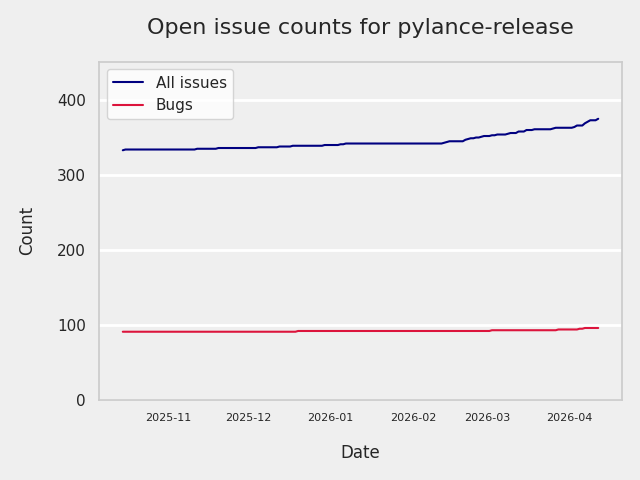
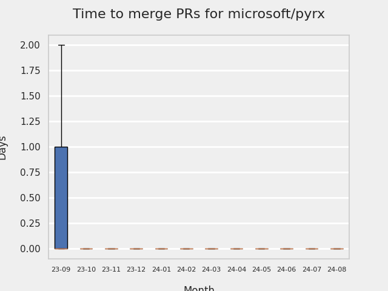
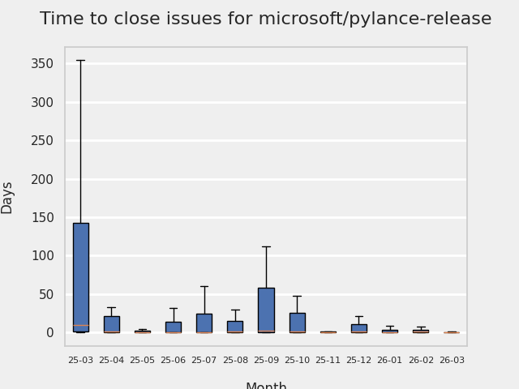
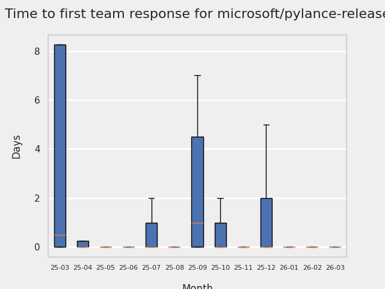
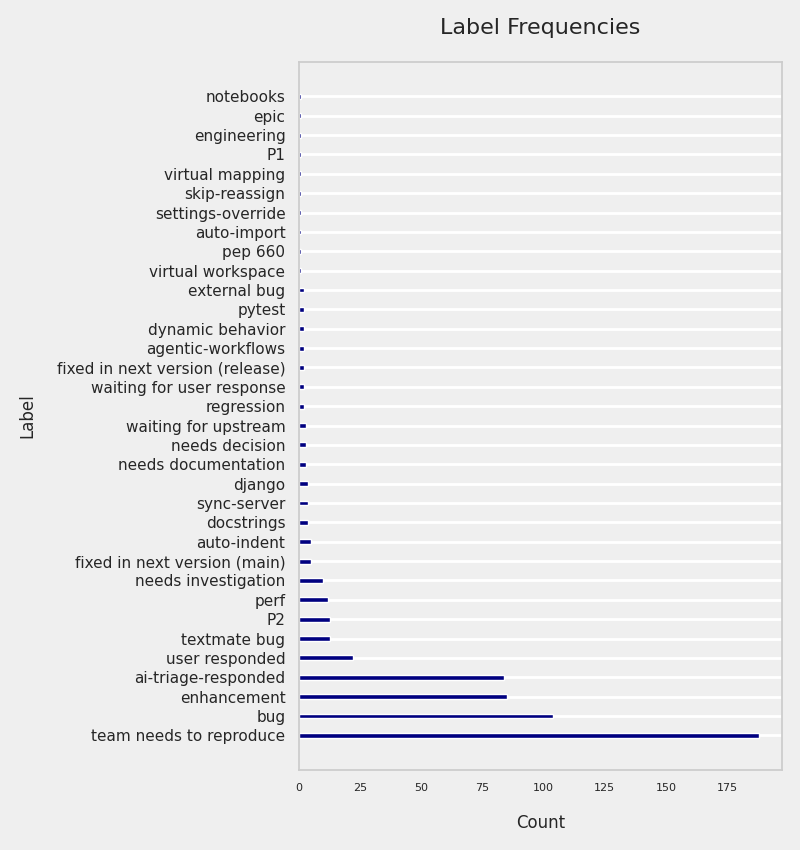
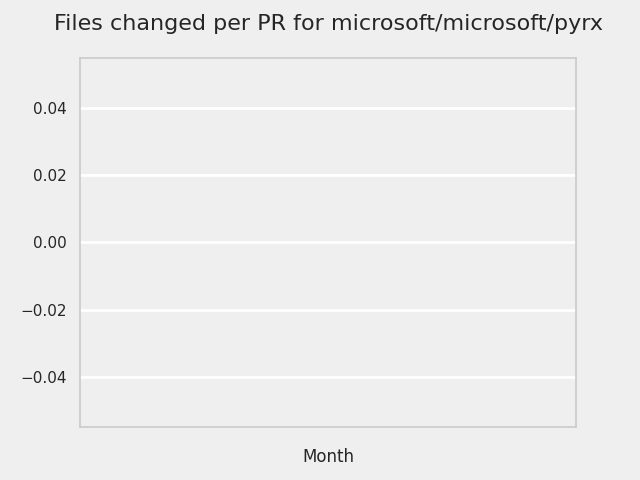
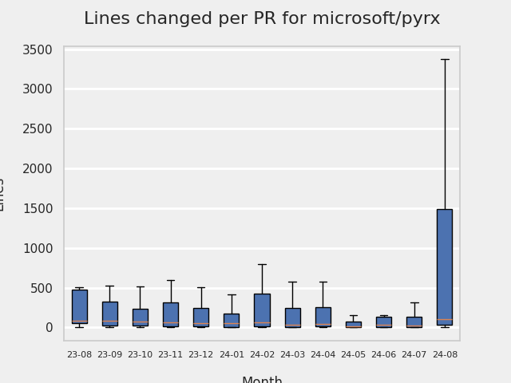
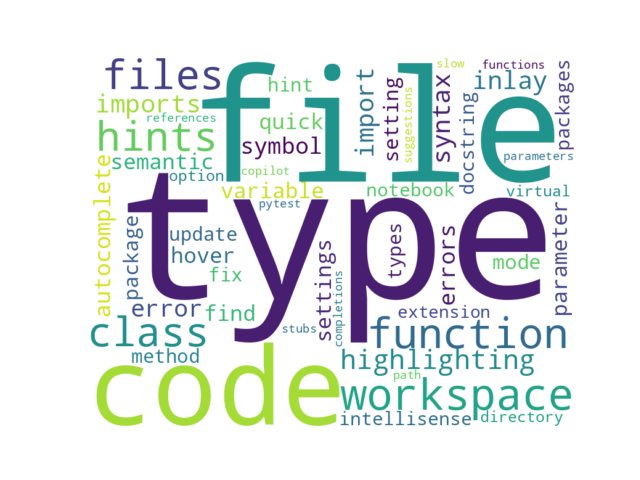

# GITHUB ISSUES REPORT FOR microsoft/pylance-release

Generated on 2026-03-01 using: stale=30, all=True

* marks items that are new to report in past 7 day(s)

## FOR ISSUES THAT ARE MARKED AS BUGS:

### Issues in pylance-release that need a response from team:

| Days Ago | Issue | Title |
| --- | --- | --- |
 |  OP:284  |[7249](https://github.com/microsoft/pylance-release/issues/7249 "Inlay hints for functions that return `itemgetter` and `attrgetter` objects are invalid") | Inlay hints for functions that return `itemgetter` and `attrgetter` objects are invalid |
 |  OP:307  |[7165](https://github.com/microsoft/pylance-release/issues/7165 "Inserting inlay return types is missing originating module for generic types") | Inserting inlay return types is missing originating module for generic types |
 |  OP:307  |[7164](https://github.com/microsoft/pylance-release/issues/7164 "Inserting inlay return types resolves type aliases") | Inserting inlay return types resolves type aliases |
 |  OP:452  |[6731](https://github.com/microsoft/pylance-release/issues/6731 "Renaming class property doesn't update structural pattern matching uses of the renamed property") | Renaming class property doesn't update structural pattern matching uses of the renamed property |

### Issues in pylance-release that have comments from OP after last team response:

| Days Ago | Issue | Title |
| --- | --- | --- |
 |  TM:55, OP:50  |[7813](https://github.com/microsoft/pylance-release/issues/7813 "Hash symbol highlighted as comment in triple-quoted raw strings") | Hash symbol highlighted as comment in triple-quoted raw strings |
 |  TM:293, OP:292  |[7202](https://github.com/microsoft/pylance-release/issues/7202 "【vscode.dev】In Python project, the types defined in a local Python file being referenced cannot be recognized.") | 【vscode.dev】In Python project, the types defined in a local Python file being referenced cannot be recognized. |
 |  TM:327, OP:244  |[7110](https://github.com/microsoft/pylance-release/issues/7110 "Deleting a cell/scrolling causes error in language server (pylance)") | Deleting a cell/scrolling causes error in language server (pylance) |
 |  TM:563, OP:563  |[6269](https://github.com/microsoft/pylance-release/issues/6269 "Pyright emits meaningless `reportMissingModuleSource` warnings for submodules of native extension") | Pyright emits meaningless `reportMissingModuleSource` warnings for submodules of native extension |
 |  TM:577, OP:577  |[5812](https://github.com/microsoft/pylance-release/issues/5812 "Setting `python.analysis.nodeExecutable` in the user settings affects how pylance gets launched on VSCode remote") | Setting `python.analysis.nodeExecutable` in the user settings affects how pylance gets launched on VSCode remote |
 |  TM:732, OP:731  |[5508](https://github.com/microsoft/pylance-release/issues/5508 "Custom partial type package breaks other imports") | Custom partial type package breaks other imports |
 |  TM:744, OP:741  |[5472](https://github.com/microsoft/pylance-release/issues/5472 "Can't go to definition on `shutil.rmtree`") | Can't go to definition on `shutil.rmtree` |
 |  TM:818, OP:812  |[5203](https://github.com/microsoft/pylance-release/issues/5203 "Pytest fixtures and tests do not have autocompletion for types") | Pytest fixtures and tests do not have autocompletion for types |
 |  TM:1063, OP:1063  |[4185](https://github.com/microsoft/pylance-release/issues/4185 "Global objects not recognized if defined in a subsequent cell of a Jupyter notebook") | Global objects not recognized if defined in a subsequent cell of a Jupyter notebook |

### Issues in pylance-release that have comments from 3rd party after last team response:

| Days Ago | Issue | Title |
| --- | --- | --- |
 |  P:153,  |[7600](https://github.com/microsoft/pylance-release/issues/7600 "Docstrings of overloaded functions are not preserved in the hover provider through a decorator function in some cases") | Docstrings of overloaded functions are not preserved in the hover provider through a decorator function in some cases |
 |  P:213,  |[7061](https://github.com/microsoft/pylance-release/issues/7061 "Hover oddities") | Hover oddities |
 |  P:135,  |[5880](https://github.com/microsoft/pylance-release/issues/5880 "Pylance doesn't honor VSCode display language") | Pylance doesn't honor VSCode display language |
 |  P:110,  |[4391](https://github.com/microsoft/pylance-release/issues/4391 "Correct type hints for meta-function that takes a function as an argument (ParamSpec)") | Correct type hints for meta-function that takes a function as an argument (ParamSpec) |
 |  P:226,  |[3114](https://github.com/microsoft/pylance-release/issues/3114 "Assign to variable from commented-out magic command") | Assign to variable from commented-out magic command |

### Issues in pylance-release that have no external responses since team response in 30+ days:

| Days Ago | Issue | Title |
| --- | --- | --- |
 |  TM:202  |[7495](https://github.com/microsoft/pylance-release/issues/7495 "Pylance using the wrong interpreter in parallel folders of a multi-root workspace when in LIGHT mode") | Pylance using the wrong interpreter in parallel folders of a multi-root workspace when in LIGHT mode |
 |  TM:276  |[7271](https://github.com/microsoft/pylance-release/issues/7271 "Error parsing pth file") | Error parsing pth file |
 |  TM:335  |[7084](https://github.com/microsoft/pylance-release/issues/7084 "Enable supportRestructuredText leads to visible non-breaking space in docstrings") | Enable supportRestructuredText leads to visible non-breaking space in docstrings |
 |  TM:349  |[7047](https://github.com/microsoft/pylance-release/issues/7047 "Wrong signature hint with unpacked parameterized typed dict as variadic keyword parameter") | Wrong signature hint with unpacked parameterized typed dict as variadic keyword parameter |
 |  TM:439  |[6751](https://github.com/microsoft/pylance-release/issues/6751 "Multi-root workspace with hidden directories uses wrong python interpreter") | Multi-root workspace with hidden directories uses wrong python interpreter |
 |  TM:451  |[6732](https://github.com/microsoft/pylance-release/issues/6732 "kwargs typings are broken") | kwargs typings are broken |
 |  TM:473  |[6638](https://github.com/microsoft/pylance-release/issues/6638 "Inconsistent highlighting") | Inconsistent highlighting |
 |  TM:419  |[6612](https://github.com/microsoft/pylance-release/issues/6612 "IntelliSense not working for documents with custom URI schemes") | IntelliSense not working for documents with custom URI schemes |
 |  TM:502  |[6559](https://github.com/microsoft/pylance-release/issues/6559 "[language-server]: only one suggestion for TypedDict union literal values") | [language-server]: only one suggestion for TypedDict union literal values |
 |  TM:515  |[6493](https://github.com/microsoft/pylance-release/issues/6493 "Should not rename outer variables while renaming local variables if they're same") | Should not rename outer variables while renaming local variables if they're same |
 |  TM:514  |[6458](https://github.com/microsoft/pylance-release/issues/6458 "pytest fixtures dimmed as unused import despite being used") | pytest fixtures dimmed as unused import despite being used |
 |  TM:523  |[6419](https://github.com/microsoft/pylance-release/issues/6419 "Code prompt docstring displays incorrectly") | Code prompt docstring displays incorrectly |
 |  TM:524  |[6399](https://github.com/microsoft/pylance-release/issues/6399 "Go to Definition of submodule works on import but not where used `No definition found for &quot;...&quot;`") | Go to Definition of submodule works on import but not where used `No definition found for "..."` |
 |  TM:514  |[6398](https://github.com/microsoft/pylance-release/issues/6398 "Wildcard imports trip up module discovery? `not a known attribute of module`") | Wildcard imports trip up module discovery? `not a known attribute of module` |
 |  TM:531  |[6392](https://github.com/microsoft/pylance-release/issues/6392 "Missing docstring for descriptor alias") | Missing docstring for descriptor alias |
 |  TM:551  |[6309](https://github.com/microsoft/pylance-release/issues/6309 "Not show numpy classes docs.") | Not show numpy classes docs. |
 |  TM:552  |[6295](https://github.com/microsoft/pylance-release/issues/6295 "detected unhandled Python exception in '...extensions/ms-python.vscode-pylance-2024.3.2/dist/bundled/files/get_pytest_options.py'") | detected unhandled Python exception in '...extensions/ms-python.vscode-pylance-2024.3.2/dist/bundled/files/get_pytest_options.py' |
 |  TM:555  |[6292](https://github.com/microsoft/pylance-release/issues/6292 "&quot;Go to Definition&quot; not working for test functions inside classes") | "Go to Definition" not working for test functions inside classes |
 |  TM:556  |[6287](https://github.com/microsoft/pylance-release/issues/6287 "Inherit docstring from super class when missing in subclass") | Inherit docstring from super class when missing in subclass |
 |  TM:611  |[6066](https://github.com/microsoft/pylance-release/issues/6066 "Wrong argument provided during auto completion if inside a collection") | Wrong argument provided during auto completion if inside a collection |
 |  TM:619  |[5977](https://github.com/microsoft/pylance-release/issues/5977 "Annoying intellisense: showing me parameter popup during editing str parameter") | Annoying intellisense: showing me parameter popup during editing str parameter |
 |  TM:598  |[5965](https://github.com/microsoft/pylance-release/issues/5965 "Intellisense is popping up parameters when it is definitely NOT needed") | Intellisense is popping up parameters when it is definitely NOT needed |
 |  TM:653  |[5890](https://github.com/microsoft/pylance-release/issues/5890 "a subclass member variable is not recognized as the same variable in superclass unless it has an explicit type hint") | a subclass member variable is not recognized as the same variable in superclass unless it has an explicit type hint |
 |  TM:663  |[5836](https://github.com/microsoft/pylance-release/issues/5836 "Improve docs to clarify that import heuristics don't work for local imports") | Improve docs to clarify that import heuristics don't work for local imports |
 |  TM:671  |[5808](https://github.com/microsoft/pylance-release/issues/5808 "parse error on magic statement on ipython mode.") | parse error on magic statement on ipython mode. |
 |  TM:703  |[5699](https://github.com/microsoft/pylance-release/issues/5699 "Auto format of strings doesn't work until you reload VS code") | Auto format of strings doesn't work until you reload VS code |
 |  TM:486  |[6617](https://github.com/microsoft/pylance-release/issues/6617 "Pylance reports problems in interactive window without a way to ignore them") | Pylance reports problems in interactive window without a way to ignore them |
 |  TM:718  |[5625](https://github.com/microsoft/pylance-release/issues/5625 "Quick fix add import depends upon a file being open") | Quick fix add import depends upon a file being open |
 |  TM:727  |[5561](https://github.com/microsoft/pylance-release/issues/5561 "&quot;Extract method&quot; refactor produces incorrect code") | "Extract method" refactor produces incorrect code |
 |  TM:731  |[5458](https://github.com/microsoft/pylance-release/issues/5458 "Autocomplete for class parameters not working on 2023.12.1 and later versions") | Autocomplete for class parameters not working on 2023.12.1 and later versions |
 |  TM:748  |[5456](https://github.com/microsoft/pylance-release/issues/5456 "Incorrect function argument indentation") | Incorrect function argument indentation |
 |  TM:758  |[5432](https://github.com/microsoft/pylance-release/issues/5432 "Pyright is using Incorrect Interpreter Path") | Pyright is using Incorrect Interpreter Path |
 |  TM:411  |[5310](https://github.com/microsoft/pylance-release/issues/5310 "Moving multiple files or renaming modules doesn't refactor imports") | Moving multiple files or renaming modules doesn't refactor imports |
 |  TM:586  |[5255](https://github.com/microsoft/pylance-release/issues/5255 "Pylance inlay hints do not honor python version") | Pylance inlay hints do not honor python version |
 |  TM:598  |[5125](https://github.com/microsoft/pylance-release/issues/5125 "Refactoring is not possible if marked block starts with a comment") | Refactoring is not possible if marked block starts with a comment |
 |  TM:598  |[5091](https://github.com/microsoft/pylance-release/issues/5091 "block comments  not adapt with python.") | block comments  not adapt with python. |
 |  TM:724  |[5079](https://github.com/microsoft/pylance-release/issues/5079 "Signature helper for a overload without docstring is showing the docstring of a different overload (of the same function)") | Signature helper for a overload without docstring is showing the docstring of a different overload (of the same function) |
 |  TM:905  |[4812](https://github.com/microsoft/pylance-release/issues/4812 "Incorrectly marking ParamSpec variable with a clickable type inlay") | Incorrectly marking ParamSpec variable with a clickable type inlay |
 |  TM:906  |[4808](https://github.com/microsoft/pylance-release/issues/4808 "Pressing tab to autocomplete a named kwarg results in two `==` if replacing existing kwarg") | Pressing tab to autocomplete a named kwarg results in two `==` if replacing existing kwarg |
 |  TM:878  |[4914](https://github.com/microsoft/pylance-release/issues/4914 "[Bug] F2 Renames Shadowed Variables Globally") | [Bug] F2 Renames Shadowed Variables Globally |
 |  TM:699  |[4586](https://github.com/microsoft/pylance-release/issues/4586 "Refactoring detection is sensitive to comments") | Refactoring detection is sensitive to comments |
 |  TM:992  |[4359](https://github.com/microsoft/pylance-release/issues/4359 "Pylance flags new submodules as missing imports with default settings") | Pylance flags new submodules as missing imports with default settings |
 |  TM:1024  |[4354](https://github.com/microsoft/pylance-release/issues/4354 "New line leaves a trailing whitespace") | New line leaves a trailing whitespace |
 |  TM:1077  |[4036](https://github.com/microsoft/pylance-release/issues/4036 "Code folding on `with` blocks breaks on multi-line `with` statement.") | Code folding on `with` blocks breaks on multi-line `with` statement. |
 |  TM:1054  |[3817](https://github.com/microsoft/pylance-release/issues/3817 "No Intellisense when the file is saved after Pylance initializes") | No Intellisense when the file is saved after Pylance initializes |
 |  TM:873  |[2226](https://github.com/microsoft/pylance-release/issues/2226 "vscode resolves paths with `..` in them even if the directory doesn't exist / has invalid name") | vscode resolves paths with `..` in them even if the directory doesn't exist / has invalid name |
 |  TM:307  |[2146](https://github.com/microsoft/pylance-release/issues/2146 "&quot;Extract method&quot; produces syntax error with multiline except clause") | "Extract method" produces syntax error with multiline except clause |

---

## FOR ISSUES THAT ARE NOT MARKED AS BUGS:

### Issues in pylance-release that need a response from team:

| Days Ago | Issue | Title |
| --- | --- | --- |
 | \* OP:3  |[7907](https://github.com/microsoft/pylance-release/issues/7907 "Pylance crashes when pyproject.toml contains pytest python_classes with bracket glob patterns")  |Pylance crashes when pyproject.toml contains pytest python_classes with bracket glob patterns |
 | \* OP:3  |[7905](https://github.com/microsoft/pylance-release/issues/7905 "Inlay hints should not be displayed for optional positional-only parameters")  |Inlay hints should not be displayed for optional positional-only parameters |
 |  OP:8  |[7895](https://github.com/microsoft/pylance-release/issues/7895 "self. completions (from #5773) should not override local parameter completions / add setting to disable") | self. completions (from #5773) should not override local parameter completions / add setting to disable |
 |  OP:15  |[7879](https://github.com/microsoft/pylance-release/issues/7879 "[agentics] Failed runs") | [agentics] Failed runs |
 |  OP:16  |[7876](https://github.com/microsoft/pylance-release/issues/7876 "[agentics] Issue Assignment Rotation failed") | [agentics] Issue Assignment Rotation failed |
 |  OP:56  |[7823](https://github.com/microsoft/pylance-release/issues/7823 "Show inline reference counts for Python like in C#&quot;") | Show inline reference counts for Python like in C#" |
 |  OP:110  |[7788](https://github.com/microsoft/pylance-release/issues/7788 "Github Copilot is referencing old documentation") | Github Copilot is referencing old documentation |
 |  OP:137  |[7645](https://github.com/microsoft/pylance-release/issues/7645 "GitHub Codespaces keeps popping up message about forwarded port from Pylance") | GitHub Codespaces keeps popping up message about forwarded port from Pylance |
 |  OP:143  |[7629](https://github.com/microsoft/pylance-release/issues/7629 "Changing Python file directory does not update import path of the file based on the settings") | Changing Python file directory does not update import path of the file based on the settings |
 |  OP:154  |[7594](https://github.com/microsoft/pylance-release/issues/7594 "Feature Request - readable input for `pylanceRunCodeSnippet`") | Feature Request - readable input for `pylanceRunCodeSnippet` |
 |  OP:187  |[7518](https://github.com/microsoft/pylance-release/issues/7518 "Fail to render container types containing types with trailing `_` (underscore) in Sphinx-formatted docstrings") | Fail to render container types containing types with trailing `_` (underscore) in Sphinx-formatted docstrings |
 |  OP:194  |[7506](https://github.com/microsoft/pylance-release/issues/7506 "Open soure pylance extension") | Open soure pylance extension |
 |  OP:201  |[7497](https://github.com/microsoft/pylance-release/issues/7497 "Spurious unresolved imports in dependencies (not user code) in multi-root workspace") | Spurious unresolved imports in dependencies (not user code) in multi-root workspace |
 |  OP:215  |[7468](https://github.com/microsoft/pylance-release/issues/7468 "Indexing fails when PYTHONPATH contains wheels.") | Indexing fails when PYTHONPATH contains wheels. |
 |  OP:220  |[7455](https://github.com/microsoft/pylance-release/issues/7455 "goto statement") | goto statement |
 |  OP:221  |[7449](https://github.com/microsoft/pylance-release/issues/7449 "Pylance misidentifies a method as an attribute, throws an error") | Pylance misidentifies a method as an attribute, throws an error |
 |  OP:234  |[7412](https://github.com/microsoft/pylance-release/issues/7412 "Find All References doesn't ignore files in __editable__.modulename.xxx directories") | Find All References doesn't ignore files in __editable__.modulename.xxx directories |
 |  OP:239  |[7390](https://github.com/microsoft/pylance-release/issues/7390 "Type hints of member variables of a class which explicitly implements protocols") | Type hints of member variables of a class which explicitly implements protocols |
 |  OP:245  |[7376](https://github.com/microsoft/pylance-release/issues/7376 "Have an option to show all the properties of a object first rather defaulting to alphebetical order.") | Have an option to show all the properties of a object first rather defaulting to alphebetical order. |
 |  OP:311  |[7155](https://github.com/microsoft/pylance-release/issues/7155 "vscode extension: file index error only on startup") | vscode extension: file index error only on startup |
 |  OP:312  |[7149](https://github.com/microsoft/pylance-release/issues/7149 "Renaming function/class parameters should recognize calls done through functools partial") | Renaming function/class parameters should recognize calls done through functools partial |
 |  OP:315  |[7145](https://github.com/microsoft/pylance-release/issues/7145 "Keys in inline typed dictionaries are shown as variables") | Keys in inline typed dictionaries are shown as variables |
 |  OP:327  |[7109](https://github.com/microsoft/pylance-release/issues/7109 "Pylance does not set current working directory to workspace root when discovering sys.path") | Pylance does not set current working directory to workspace root when discovering sys.path |
 |  OP:346  |[7056](https://github.com/microsoft/pylance-release/issues/7056 "Pylance performance issue report") | Pylance performance issue report |
 |  OP:356  |[7033](https://github.com/microsoft/pylance-release/issues/7033 "performance issue reported by vscode") | performance issue reported by vscode |
 |  OP:367  |[6994](https://github.com/microsoft/pylance-release/issues/6994 "Add manual &quot;analyze&quot; button") | Add manual "analyze" button |
 |  OP:368  |[6988](https://github.com/microsoft/pylance-release/issues/6988 "Typesheds shadow local modules when imported as `from packageA import moduleB`") | Typesheds shadow local modules when imported as `from packageA import moduleB` |
 |  OP:401  |[6886](https://github.com/microsoft/pylance-release/issues/6886 "Add semantic token modifier to imported modules") | Add semantic token modifier to imported modules |
 |  OP:402  |[6883](https://github.com/microsoft/pylance-release/issues/6883 "Update documentation to reflect that editably-installed packages compiled by python-meson cannot be typechecked by pylance.") | Update documentation to reflect that editably-installed packages compiled by python-meson cannot be typechecked by pylance. |
 |  OP:407  |[6864](https://github.com/microsoft/pylance-release/issues/6864 "autocomplete can't list all the possiblities if type only a part of a word") | autocomplete can't list all the possiblities if type only a part of a word |
 |  OP:428  |[6801](https://github.com/microsoft/pylance-release/issues/6801 "String literal type for variable causes incorrect hints for TypedDict keys") | String literal type for variable causes incorrect hints for TypedDict keys |
 |  OP:439  |[6780](https://github.com/microsoft/pylance-release/issues/6780 "sklearn stubs override sklearn") | sklearn stubs override sklearn |
 |  OP:449  |[6748](https://github.com/microsoft/pylance-release/issues/6748 "Inlay hints show ParamSpec as Callable") | Inlay hints show ParamSpec as Callable |
 |  OP:465  |[6692](https://github.com/microsoft/pylance-release/issues/6692 "Unwanted type checking in excluded path") | Unwanted type checking in excluded path |
 |  OP:473  |[6660](https://github.com/microsoft/pylance-release/issues/6660 "Reference Counting") | Reference Counting |
 |  OP:478  |[6654](https://github.com/microsoft/pylance-release/issues/6654 "Extracting a method  creates methods that take functions as arguments") | Extracting a method  creates methods that take functions as arguments |
 |  OP:481  |[6639](https://github.com/microsoft/pylance-release/issues/6639 "Improved Type Annotation Display for Class and Type Alias") | Improved Type Annotation Display for Class and Type Alias |
 |  OP:485  |[6625](https://github.com/microsoft/pylance-release/issues/6625 "TypedDict PEP-584 update operator has no auto-completion") | TypedDict PEP-584 update operator has no auto-completion |
 |  OP:491  |[6605](https://github.com/microsoft/pylance-release/issues/6605 "Method docs line break render incorrect") | Method docs line break render incorrect |
 |  OP:520  |[6466](https://github.com/microsoft/pylance-release/issues/6466 "Bundle with Github Copilot for non microsoft editors") | Bundle with Github Copilot for non microsoft editors |
 |  OP:658  |[5877](https://github.com/microsoft/pylance-release/issues/5877 "Syntax highlighting works differently in the last curly brackets in f-strings") | Syntax highlighting works differently in the last curly brackets in f-strings |
 |  OP:692  |[5737](https://github.com/microsoft/pylance-release/issues/5737 "`__init__` params not displayed when hovering over type name") | `__init__` params not displayed when hovering over type name |
 |  OP:717  |[5642](https://github.com/microsoft/pylance-release/issues/5642 "Browsers reporting &quot;Virus detected&quot; and blocking download of Pylance Extension") | Browsers reporting "Virus detected" and blocking download of Pylance Extension |
 |  OP:719  |[5627](https://github.com/microsoft/pylance-release/issues/5627 "Function parameter not showing definition on hover for class") | Function parameter not showing definition on hover for class |
 |  OP:722  |[5611](https://github.com/microsoft/pylance-release/issues/5611 "Semantic Highlighting for Constants") | Semantic Highlighting for Constants |
 |  OP:723  |[5607](https://github.com/microsoft/pylance-release/issues/5607 "Documentation on dataclass constructor argument typed as optional with default value does not show the full type") | Documentation on dataclass constructor argument typed as optional with default value does not show the full type |
 |  OP:734  |[5521](https://github.com/microsoft/pylance-release/issues/5521 "# in raw string not highlighted as string") | # in raw string not highlighted as string |
 |  OP:752  |[5448](https://github.com/microsoft/pylance-release/issues/5448 "Pylance Fail to read package source") | Pylance Fail to read package source |
 |  OP:767  |[5392](https://github.com/microsoft/pylance-release/issues/5392 "`python.analysis.inlayHints.callArgumentNames`: Option to exclude argument names when the variable name matches") | `python.analysis.inlayHints.callArgumentNames`: Option to exclude argument names when the variable name matches |
 |  OP:791  |[5312](https://github.com/microsoft/pylance-release/issues/5312 "Show function return value documentation on hover over the `->` annotation") | Show function return value documentation on hover over the `->` annotation |
 |  OP:816  |[5219](https://github.com/microsoft/pylance-release/issues/5219 "'Move to file' refactoring should allow me to specify a new file name") | 'Move to file' refactoring should allow me to specify a new file name |
 |  OP:822  |[5185](https://github.com/microsoft/pylance-release/issues/5185 "Edge case in `Auto Format Strings` setting feature") | Edge case in `Auto Format Strings` setting feature |
 |  OP:830  |[5141](https://github.com/microsoft/pylance-release/issues/5141 "Prioritize completions for class types from union types in `match`/`case`") | Prioritize completions for class types from union types in `match`/`case` |
 |  OP:867  |[4965](https://github.com/microsoft/pylance-release/issues/4965 "Mention in Pyright docs how to override Pyright settings in Pylance") | Mention in Pyright docs how to override Pyright settings in Pylance |
 |  OP:883  |[5014](https://github.com/microsoft/pylance-release/issues/5014 "VSCode does't recognising installed packages with pipenv in virtualenv") | VSCode does't recognising installed packages with pipenv in virtualenv |

### Issues in pylance-release that have comments from OP after last team response:

| Days Ago | Issue | Title |
| --- | --- | --- |
 |  TM:11, OP:11  |[7884](https://github.com/microsoft/pylance-release/issues/7884 "[macOS] False &quot;Match statements require Python 3.10 or newer&quot;") | [macOS] False "Match statements require Python 3.10 or newer" |
 | \* TM:4, OP:3  |[7880](https://github.com/microsoft/pylance-release/issues/7880 "Pylance missing imports with DevContainers")  |Pylance missing imports with DevContainers |
 |  TM:12, OP:10  |[7866](https://github.com/microsoft/pylance-release/issues/7866 "Pylance is crashing every ~10 minutes - handleover error") | Pylance is crashing every ~10 minutes - handleover error |
 |  TM:19, OP:19  |[7863](https://github.com/microsoft/pylance-release/issues/7863 "Syntax highlighting doesn't work with escape characters") | Syntax highlighting doesn't work with escape characters |
 |  TM:167, OP:167  |[7558](https://github.com/microsoft/pylance-release/issues/7558 "Pylance: Semantic highlighting missing for Live Share guests (completions/hover work via host LS ?)") | Pylance: Semantic highlighting missing for Live Share guests (completions/hover work via host LS ?) |
 |  TM:195, OP:194  |[7502](https://github.com/microsoft/pylance-release/issues/7502 "Is decorator Syntax highlighting meant to be applied inconsistently depending on variable type?") | Is decorator Syntax highlighting meant to be applied inconsistently depending on variable type? |
 |  TM:54, OP:53  |[7479](https://github.com/microsoft/pylance-release/issues/7479 "Unknown import symbol for Rust extension") | Unknown import symbol for Rust extension |
 |  TM:253, OP:253  |[7343](https://github.com/microsoft/pylance-release/issues/7343 "Dismiss certain notifications.") | Dismiss certain notifications. |
 |  TM:254, OP:254  |[7339](https://github.com/microsoft/pylance-release/issues/7339 "Use pyright from virtual environment") | Use pyright from virtual environment |
 |  TM:258, OP:258  |[7326](https://github.com/microsoft/pylance-release/issues/7326 "Syntax highlighting messed up") | Syntax highlighting messed up |
 |  TM:263, OP:263  |[7301](https://github.com/microsoft/pylance-release/issues/7301 "Not importing extraPath from pyrightconfig.json or pyproject.toml. All the releases in 2025 - pyright issue since the behavior is common") | Not importing extraPath from pyrightconfig.json or pyproject.toml. All the releases in 2025 - pyright issue since the behavior is common |
 |  TM:278, OP:276  |[7265](https://github.com/microsoft/pylance-release/issues/7265 "Disable built-in stubs") | Disable built-in stubs |
 |  TM:237, OP:234  |[7242](https://github.com/microsoft/pylance-release/issues/7242 "UV generated project has no completions") | UV generated project has no completions |
 |  TM:291, OP:291  |[7216](https://github.com/microsoft/pylance-release/issues/7216 "Generate Method Stub from Usage in Python (Like C# in VS Code)") | Generate Method Stub from Usage in Python (Like C# in VS Code) |
 |  TM:293, OP:292  |[7204](https://github.com/microsoft/pylance-release/issues/7204 "pylance sometimes looks into excluded folders like &quot;~/.pyenv&quot;") | pylance sometimes looks into excluded folders like "~/.pyenv" |
 |  TM:300, OP:300  |[7178](https://github.com/microsoft/pylance-release/issues/7178 "Path for `python.analysis.stubPath` in `.vscode/settings.json` is resolved relative to workspace root instead of settings file") | Path for `python.analysis.stubPath` in `.vscode/settings.json` is resolved relative to workspace root instead of settings file |
 |  TM:335, OP:334  |[7088](https://github.com/microsoft/pylance-release/issues/7088 "All variables are grayed as if unused") | All variables are grayed as if unused |
 |  TM:339, OP:335  |[7073](https://github.com/microsoft/pylance-release/issues/7073 "Erors happened during csv files being processed into Parquet files") | Erors happened during csv files being processed into Parquet files |
 |  TM:412, OP:229  |[6809](https://github.com/microsoft/pylance-release/issues/6809 "Pylance function return type inlay hints do not work on closures") | Pylance function return type inlay hints do not work on closures |
 |  TM:446, OP:445  |[6755](https://github.com/microsoft/pylance-release/issues/6755 "Jupyter Notebook syntax highlighting breaks for multiroot workspace when root is added") | Jupyter Notebook syntax highlighting breaks for multiroot workspace when root is added |
 |  TM:468, OP:464  |[6669](https://github.com/microsoft/pylance-release/issues/6669 "Installed pip package is not resolved by Pylance") | Installed pip package is not resolved by Pylance |
 |  TM:473, OP:472  |[6652](https://github.com/microsoft/pylance-release/issues/6652 "Using wsl to open the code file (on Windows system), loses parameter hints") | Using wsl to open the code file (on Windows system), loses parameter hints |
 |  TM:509, OP:509  |[6535](https://github.com/microsoft/pylance-release/issues/6535 "Quick fix &quot;Add import&quot; not working when file or path (directory) is excluded in pyrightconfig.json") | Quick fix "Add import" not working when file or path (directory) is excluded in pyrightconfig.json |
 |  TM:513, OP:512  |[6464](https://github.com/microsoft/pylance-release/issues/6464 "Pylance inheritance and hints") | Pylance inheritance and hints |
 |  TM:514, OP:514  |[6453](https://github.com/microsoft/pylance-release/issues/6453 "Don't show errors in stdlib files") | Don't show errors in stdlib files |
 |  TM:497, OP:496  |[6409](https://github.com/microsoft/pylance-release/issues/6409 "78 permanent errors in `builtins.pyi`") | 78 permanent errors in `builtins.pyi` |
 |  TM:528, OP:522  |[6394](https://github.com/microsoft/pylance-release/issues/6394 "Pylance client: couldn't create connection to server.") | Pylance client: couldn't create connection to server. |
 |  TM:562, OP:561  |[6267](https://github.com/microsoft/pylance-release/issues/6267 "Syntax highlighting does not support negative literals") | Syntax highlighting does not support negative literals |
 |  TM:579, OP:578  |[6209](https://github.com/microsoft/pylance-release/issues/6209 "Pylance fails to import just few classes") | Pylance fails to import just few classes |
 |  TM:605, OP:603  |[6091](https://github.com/microsoft/pylance-release/issues/6091 "enhancement to the auto-exclusion filter to pick up full Python runtime installations in addition to picking up virtual environments.") | enhancement to the auto-exclusion filter to pick up full Python runtime installations in addition to picking up virtual environments. |
 |  TM:614, OP:614  |[6047](https://github.com/microsoft/pylance-release/issues/6047 "Setting &quot;python.analysis.nodeExecutable&quot; requires a manual confirmation?") | Setting "python.analysis.nodeExecutable" requires a manual confirmation? |
 |  TM:608, OP:604  |[6036](https://github.com/microsoft/pylance-release/issues/6036 "There are still some deficiencies in automatic completion") | There are still some deficiencies in automatic completion |
 |  TM:634, OP:633  |[5970](https://github.com/microsoft/pylance-release/issues/5970 "The automatic behavior of `python.analysis.exclude` is ambiguous when I specify excluded paths.") | The automatic behavior of `python.analysis.exclude` is ambiguous when I specify excluded paths. |
 |  TM:656, OP:317  |[5864](https://github.com/microsoft/pylance-release/issues/5864 "Remote extension host terminates unexpectedly") | Remote extension host terminates unexpectedly |
 |  TM:675, OP:674  |[5799](https://github.com/microsoft/pylance-release/issues/5799 "How to set pylance memory  max limitation?") | How to set pylance memory  max limitation? |
 |  TM:696, OP:549  |[5726](https://github.com/microsoft/pylance-release/issues/5726 "Pylance error for query_selector of Playwright") | Pylance error for query_selector of Playwright |
 |  TM:698, OP:698  |[5669](https://github.com/microsoft/pylance-release/issues/5669 "A local variable is being treated as type 'Never' in an except handler") | A local variable is being treated as type 'Never' in an except handler |
 |  TM:731, OP:731  |[5542](https://github.com/microsoft/pylance-release/issues/5542 "Derived method completions use incorrect return type annotations when differing by `async` modifier.") | Derived method completions use incorrect return type annotations when differing by `async` modifier. |
 |  TM:725, OP:724  |[5377](https://github.com/microsoft/pylance-release/issues/5377 "Python and/or pylance is broken since last couple of updates ") | Python and/or pylance is broken since last couple of updates  |
 |  TM:728, OP:728  |[5284](https://github.com/microsoft/pylance-release/issues/5284 "Python smart navigation/auto-completion don't work anymore with 1.85.1") | Python smart navigation/auto-completion don't work anymore with 1.85.1 |
 |  TM:823, OP:740  |[5158](https://github.com/microsoft/pylance-release/issues/5158 "Add a feature to disable following symlinks when indexing repository") | Add a feature to disable following symlinks when indexing repository |
 |  TM:804, OP:803  |[5128](https://github.com/microsoft/pylance-release/issues/5128 "Slow code checking with a workspace on a slow network connection") | Slow code checking with a workspace on a slow network connection |
 |  TM:837, OP:837  |[5119](https://github.com/microsoft/pylance-release/issues/5119 "Bring along imports when copy and pasting code across files") | Bring along imports when copy and pasting code across files |
 |  TM:842, OP:842  |[4970](https://github.com/microsoft/pylance-release/issues/4970 "Feature: &quot;Add Explicit Type Annotation&quot; code-action") | Feature: "Add Explicit Type Annotation" code-action |
 |  TM:873, OP:873  |[4944](https://github.com/microsoft/pylance-release/issues/4944 "Add Semantic modifiers for keyword arguments in function or class call.") | Add Semantic modifiers for keyword arguments in function or class call. |

### Issues in pylance-release that have comments from 3rd party after last team response:

| Days Ago | Issue | Title |
| --- | --- | --- |
 |  P:251,  |[7304](https://github.com/microsoft/pylance-release/issues/7304 "Pylance Very slow and crashing on WSL2") | Pylance Very slow and crashing on WSL2 |
 |  P:219,  |[7222](https://github.com/microsoft/pylance-release/issues/7222 "Incorrect &quot;No parameter named&quot; Warning") | Incorrect "No parameter named" Warning |
 |  P:135,  |[7151](https://github.com/microsoft/pylance-release/issues/7151 "How to configure with multiple packages and uv") | How to configure with multiple packages and uv |
 |  P:23,  |[6658](https://github.com/microsoft/pylance-release/issues/6658 "pylance slow performance") | pylance slow performance |
 |  P:367,  |[6709](https://github.com/microsoft/pylance-release/issues/6709 "when attached to running container ms-python extension takes too long to install, then debugger server is not ready ") | when attached to running container ms-python extension takes too long to install, then debugger server is not ready  |
 |  P:482,  |[6330](https://github.com/microsoft/pylance-release/issues/6330 "Pylance hints not working in Jupyter Notebook in Remote Tunnel") | Pylance hints not working in Jupyter Notebook in Remote Tunnel |
 |  P:149,  |[6213](https://github.com/microsoft/pylance-release/issues/6213 "Pylance causes heavy CPU usage by setting file watchers on entire PYTHONPATH") | Pylance causes heavy CPU usage by setting file watchers on entire PYTHONPATH |
 |  P:351,  |[6211](https://github.com/microsoft/pylance-release/issues/6211 "Need a setting to avoid analyzing all open files") | Need a setting to avoid analyzing all open files |
 |  P:176,  |[5733](https://github.com/microsoft/pylance-release/issues/5733 "Long string changes color if split it and add &quot;\&quot; to the end ") | Long string changes color if split it and add "\" to the end  |
 |  P:549,  |[5702](https://github.com/microsoft/pylance-release/issues/5702 "No type or autocomplete present in test function despite pytest fixture having type hint on mouseover") | No type or autocomplete present in test function despite pytest fixture having type hint on mouseover |
 |  P:79,  |[4682](https://github.com/microsoft/pylance-release/issues/4682 "Auto-import is limited by packageIndexDepth") | Auto-import is limited by packageIndexDepth |
 |  P:208,  |[4428](https://github.com/microsoft/pylance-release/issues/4428 "Autocomplete of Literal value only takes last overload into account") | Autocomplete of Literal value only takes last overload into account |
 |  P:98,  |[4972](https://github.com/microsoft/pylance-release/issues/4972 "show class hierarchy or method override like pycharm") | show class hierarchy or method override like pycharm |

### Issues in pylance-release that have no external responses since team response in 30+ days:

| Days Ago | Issue | Title |
| --- | --- | --- |
 |  TM:55  |[7814](https://github.com/microsoft/pylance-release/issues/7814 "Request textDocument/completion failed") | Request textDocument/completion failed |
 | \* TM:33  |[7615](https://github.com/microsoft/pylance-release/issues/7615 "Pylance is extremly slow with 'transformers' package")  |Pylance is extremly slow with 'transformers' package |
 |  TM:153  |[7595](https://github.com/microsoft/pylance-release/issues/7595 "Feature Request - live output for `pylanceRunCodeSnippet`") | Feature Request - live output for `pylanceRunCodeSnippet` |
 |  TM:96  |[7554](https://github.com/microsoft/pylance-release/issues/7554 "if kwargs are annotated then subsequent function calls identify the parameters as variables not parameters ") | if kwargs are annotated then subsequent function calls identify the parameters as variables not parameters  |
 |  TM:184  |[7521](https://github.com/microsoft/pylance-release/issues/7521 "Pylance resolve imports fails when selecting intepreter via file browser") | Pylance resolve imports fails when selecting intepreter via file browser |
 |  TM:45  |[7443](https://github.com/microsoft/pylance-release/issues/7443 "Pylance using the wrong interpreter") | Pylance using the wrong interpreter |
 |  TM:221  |[7440](https://github.com/microsoft/pylance-release/issues/7440 "Errors for standard library and external package files persist after the files are closed") | Errors for standard library and external package files persist after the files are closed |
 |  TM:226  |[7428](https://github.com/microsoft/pylance-release/issues/7428 "reportCallIssue : False error message.") | reportCallIssue : False error message. |
 |  TM:46  |[7414](https://github.com/microsoft/pylance-release/issues/7414 "*** files and 0 cells to analyze") | *** files and 0 cells to analyze |
 |  TM:221  |[7357](https://github.com/microsoft/pylance-release/issues/7357 "IntelliSense Not Working for expect(locator).to_be_... in VS Code with Pylance") | IntelliSense Not Working for expect(locator).to_be_... in VS Code with Pylance |
 |  TM:254  |[7342](https://github.com/microsoft/pylance-release/issues/7342 "reportmissingModuleSource") | reportmissingModuleSource |
 |  TM:269  |[7303](https://github.com/microsoft/pylance-release/issues/7303 "How best to handle class hierarchies") | How best to handle class hierarchies |
 |  TM:272  |[7289](https://github.com/microsoft/pylance-release/issues/7289 "regarding pylance") | regarding pylance |
 |  TM:285  |[7237](https://github.com/microsoft/pylance-release/issues/7237 "LSP autocomplete inside of match arms gives invalid values.") | LSP autocomplete inside of match arms gives invalid values. |
 |  TM:292  |[7208](https://github.com/microsoft/pylance-release/issues/7208 "[critical] Copilot Chat Agent mode scans entire disk instead of project folder") | [critical] Copilot Chat Agent mode scans entire disk instead of project folder |
 |  TM:311  |[7148](https://github.com/microsoft/pylance-release/issues/7148 "Suppress diagnostic for terminal scheme") | Suppress diagnostic for terminal scheme |
 |  TM:330  |[7103](https://github.com/microsoft/pylance-release/issues/7103 "Option to ignore ImportError Pylance(reportMissingImports)") | Option to ignore ImportError Pylance(reportMissingImports) |
 |  TM:338  |[7081](https://github.com/microsoft/pylance-release/issues/7081 "Add Go to definition for operators and __call__ calls") | Add Go to definition for operators and __call__ calls |
 |  TM:341  |[7064](https://github.com/microsoft/pylance-release/issues/7064 "High CPU and network usage when working on a network share. 10 seconds delay when pressing F12") | High CPU and network usage when working on a network share. 10 seconds delay when pressing F12 |
 |  TM:256  |[7018](https://github.com/microsoft/pylance-release/issues/7018 "Improve sorting of quick fixes") | Improve sorting of quick fixes |
 |  TM:300  |[6972](https://github.com/microsoft/pylance-release/issues/6972 "Pylance (>=2024.10) does not highlight syntax after using 'Go to Definition' from Jupyter Notebook") | Pylance (>=2024.10) does not highlight syntax after using 'Go to Definition' from Jupyter Notebook |
 |  TM:376  |[6960](https://github.com/microsoft/pylance-release/issues/6960 "[feature request] Add Quick-Fix for misspelled APIs, e.g., `Module 're' has no 'findAll' member; maybe 'findall'? Pylint E1101:no-member`") | [feature request] Add Quick-Fix for misspelled APIs, e.g., `Module 're' has no 'findAll' member; maybe 'findall'? Pylint E1101:no-member` |
 |  TM:388  |[6925](https://github.com/microsoft/pylance-release/issues/6925 "python.analysis.extrapaths setting breaks when more than 1 folder in workspace") | python.analysis.extrapaths setting breaks when more than 1 folder in workspace |
 |  TM:390  |[6918](https://github.com/microsoft/pylance-release/issues/6918 "huggingface transformers symbols are not suggested for auto-import") | huggingface transformers symbols are not suggested for auto-import |
 |  TM:390  |[6917](https://github.com/microsoft/pylance-release/issues/6917 "Been having this performance issue for a while. Is there a solution?") | Been having this performance issue for a while. Is there a solution? |
 |  TM:271  |[6747](https://github.com/microsoft/pylance-release/issues/6747 "Takes a minute to red-underline a syntax error") | Takes a minute to red-underline a syntax error |
 |  TM:395  |[6716](https://github.com/microsoft/pylance-release/issues/6716 "Autocomplete suggestions don't work inside Pytest test functions when the suggestion logic returns more than 1 result.") | Autocomplete suggestions don't work inside Pytest test functions when the suggestion logic returns more than 1 result. |
 |  TM:459  |[6715](https://github.com/microsoft/pylance-release/issues/6715 "Implement TypeDict's type hinting to dict subclass") | Implement TypeDict's type hinting to dict subclass |
 |  TM:325  |[6628](https://github.com/microsoft/pylance-release/issues/6628 "Pylance error message appears in Chinese despite English language settings") | Pylance error message appears in Chinese despite English language settings |
 |  TM:488  |[6611](https://github.com/microsoft/pylance-release/issues/6611 "Feature Requests: Support for cross-reference syntax in `mkdocstring`") | Feature Requests: Support for cross-reference syntax in `mkdocstring` |
 |  TM:507  |[6545](https://github.com/microsoft/pylance-release/issues/6545 "pyrightconfig.json assumes base directory when no entries are included, disregarding python.analysis.include") | pyrightconfig.json assumes base directory when no entries are included, disregarding python.analysis.include |
 |  TM:349  |[6539](https://github.com/microsoft/pylance-release/issues/6539 "As of the latest version of Pylance, types are no longer included when autocompleting inherited methods.") | As of the latest version of Pylance, types are no longer included when autocompleting inherited methods. |
 |  TM:510  |[6529](https://github.com/microsoft/pylance-release/issues/6529 "Suggestions not match current selected interpreter") | Suggestions not match current selected interpreter |
 |  TM:514  |[6316](https://github.com/microsoft/pylance-release/issues/6316 "Correctly resolve `collections(.abc)` class/method Definition to source file instead of typing.py or typeshed-fallback") | Correctly resolve `collections(.abc)` class/method Definition to source file instead of typing.py or typeshed-fallback |
 |  TM:551  |[6300](https://github.com/microsoft/pylance-release/issues/6300 "Very slow to find imports for Quick Fix") | Very slow to find imports for Quick Fix |
 |  TM:544  |[6270](https://github.com/microsoft/pylance-release/issues/6270 "Pylance informs me that enumerating my directory is taking a long time multiple times per minute") | Pylance informs me that enumerating my directory is taking a long time multiple times per minute |
 |  TM:580  |[6203](https://github.com/microsoft/pylance-release/issues/6203 "Pylance + VS Code - Inline Quick Suggestions swapping with each keypress") | Pylance + VS Code - Inline Quick Suggestions swapping with each keypress |
 |  TM:586  |[6123](https://github.com/microsoft/pylance-release/issues/6123 "No suggestion for container of `Literal` with fallback") | No suggestion for container of `Literal` with fallback |
 |  TM:594  |[6144](https://github.com/microsoft/pylance-release/issues/6144 "Refactor: Extract Method missing when selection starts with a comment") | Refactor: Extract Method missing when selection starts with a comment |
 |  TM:188  |[6114](https://github.com/microsoft/pylance-release/issues/6114 "python code are not rendered in correct colors in &quot;Visual Studio Dark&quot; and &quot;Default Dark Modern&quot; theme") | python code are not rendered in correct colors in "Visual Studio Dark" and "Default Dark Modern" theme |
 |  TM:355  |[6029](https://github.com/microsoft/pylance-release/issues/6029 "Django stubs are out of date and cause erroneous type errors") | Django stubs are out of date and cause erroneous type errors |
 |  TM:622  |[6020](https://github.com/microsoft/pylance-release/issues/6020 "Duplicate common keys are shown when using union of `TypedDict`") | Duplicate common keys are shown when using union of `TypedDict` |
 |  TM:587  |[6008](https://github.com/microsoft/pylance-release/issues/6008 "Explore Python IntelliSense in Copilot chat code blocks") | Explore Python IntelliSense in Copilot chat code blocks |
 |  TM:627  |[6006](https://github.com/microsoft/pylance-release/issues/6006 "Symlink would block pylance from working") | Symlink would block pylance from working |
 |  TM:642  |[5933](https://github.com/microsoft/pylance-release/issues/5933 "&quot;Go to symbol in workspace&quot; does not see the symbol") | "Go to symbol in workspace" does not see the symbol |
 |  TM:646  |[5915](https://github.com/microsoft/pylance-release/issues/5915 "Better string completions") | Better string completions |
 |  TM:646  |[5951](https://github.com/microsoft/pylance-release/issues/5951 "Renaming variable in a function renames it everywhere") | Renaming variable in a function renames it everywhere |
 |  TM:318  |[5892](https://github.com/microsoft/pylance-release/issues/5892 "Multiple libraries not recognized with errors is not a known attribute of module") | Multiple libraries not recognized with errors is not a known attribute of module |
 |  TM:242  |[5824](https://github.com/microsoft/pylance-release/issues/5824 "switch to a different tool for python syntax highlighting") | switch to a different tool for python syntax highlighting |
 |  TM:419  |[5791](https://github.com/microsoft/pylance-release/issues/5791 "Syntax highlighting breaks down if you line break at curly bracket in f-strings") | Syntax highlighting breaks down if you line break at curly bracket in f-strings |
 |  TM:338  |[5770](https://github.com/microsoft/pylance-release/issues/5770 "Offer jedi users to switch to pylance (if they have pylance installed)") | Offer jedi users to switch to pylance (if they have pylance installed) |
 |  TM:549  |[5718](https://github.com/microsoft/pylance-release/issues/5718 "pylance loses link to a object if it was returned by fixture") | pylance loses link to a object if it was returned by fixture |
 |  TM:705  |[5689](https://github.com/microsoft/pylance-release/issues/5689 "Intellisense not working when using pylance (no suggestions Ctrl+Space)") | Intellisense not working when using pylance (no suggestions Ctrl+Space) |
 |  TM:698  |[5673](https://github.com/microsoft/pylance-release/issues/5673 "Quick fix does not respect analysis exclude path") | Quick fix does not respect analysis exclude path |
 |  TM:711  |[5658](https://github.com/microsoft/pylance-release/issues/5658 "Limit IntelliSense features on Copilot Chat code blocks ") | Limit IntelliSense features on Copilot Chat code blocks  |
 |  TM:146  |[5614](https://github.com/microsoft/pylance-release/issues/5614 "Pylance using a lot of memory") | Pylance using a lot of memory |
 |  TM:726  |[5584](https://github.com/microsoft/pylance-release/issues/5584 "Parentheses and the atom they contain are both colored") | Parentheses and the atom they contain are both colored |
 |  TM:641  |[5475](https://github.com/microsoft/pylance-release/issues/5475 "Extremely slow renaming folders") | Extremely slow renaming folders |
 |  TM:754  |[5429](https://github.com/microsoft/pylance-release/issues/5429 "No docstrings when using pylance in vscode.dev") | No docstrings when using pylance in vscode.dev |
 |  TM:765  |[5410](https://github.com/microsoft/pylance-release/issues/5410 "Docstrings on pytest fixtures") | Docstrings on pytest fixtures |
 |  TM:768  |[5386](https://github.com/microsoft/pylance-release/issues/5386 "Rename key in TypedDict using &quot;rename symbol&quot; refactor should update all instances of that TypedDict") | Rename key in TypedDict using "rename symbol" refactor should update all instances of that TypedDict |
 |  TM:766  |[5385](https://github.com/microsoft/pylance-release/issues/5385 "option to disable double-click to insert for inlay hints") | option to disable double-click to insert for inlay hints |
 |  TM:783  |[5333](https://github.com/microsoft/pylance-release/issues/5333 "Autocomplete for Literal with formatted string type hint") | Autocomplete for Literal with formatted string type hint |
 |  TM:724  |[5302](https://github.com/microsoft/pylance-release/issues/5302 "Repo indexing is confused") | Repo indexing is confused |
 |  TM:766  |[5072](https://github.com/microsoft/pylance-release/issues/5072 "Filters for autoimport suggestions") | Filters for autoimport suggestions |
 |  TM:744  |[5021](https://github.com/microsoft/pylance-release/issues/5021 "Syntax highlighting and code completion stops working in v2023.9.10 onwards") | Syntax highlighting and code completion stops working in v2023.9.10 onwards |
 |  TM:586  |[5113](https://github.com/microsoft/pylance-release/issues/5113 "Code completion doesn't recognise a new venv") | Code completion doesn't recognise a new venv |
 |  TM:871  |[4926](https://github.com/microsoft/pylance-release/issues/4926 "[Web] No intellisense or colorization from modules in extra paths ") | [Web] No intellisense or colorization from modules in extra paths  |
 |  TM:873  |[4937](https://github.com/microsoft/pylance-release/issues/4937 "Syntax highlighting and formatting of tooltips in Python") | Syntax highlighting and formatting of tooltips in Python |
 |  TM:880  |[4912](https://github.com/microsoft/pylance-release/issues/4912 "Editor mark syntax error when trying to decorate a Python function with a decorator defined as an instance method inside the class") | Editor mark syntax error when trying to decorate a Python function with a decorator defined as an instance method inside the class |
 |  TM:881  |[4746](https://github.com/microsoft/pylance-release/issues/4746 "Raw f-strings lose raw-string coloring") | Raw f-strings lose raw-string coloring |
 |  TM:961  |[4609](https://github.com/microsoft/pylance-release/issues/4609 "Erratic problem reporting in VSCode") | Erratic problem reporting in VSCode |
 |  TM:878  |[4920](https://github.com/microsoft/pylance-release/issues/4920 "More informative with IntelliSense ") | More informative with IntelliSense  |
 |  TM:1040  |[4008](https://github.com/microsoft/pylance-release/issues/4008 "Support for Pydantic dynamic models") | Support for Pydantic dynamic models |
 |  TM:1128  |[3808](https://github.com/microsoft/pylance-release/issues/3808 "Problem with highlight code in diff comparison mode for python ") | Problem with highlight code in diff comparison mode for python  |
 |  TM:664  |[3704](https://github.com/microsoft/pylance-release/issues/3704 "Django. support django orm autocompletion") | Django. support django orm autocompletion |
 |  TM:479  |[3492](https://github.com/microsoft/pylance-release/issues/3492 "Cannot find 'decimal.Context' when typing 'decimal.ctxt'") | Cannot find 'decimal.Context' when typing 'decimal.ctxt' |
 |  TM:445  |[6760](https://github.com/microsoft/pylance-release/issues/6760 "Support for PyScript & Brython.") | Support for PyScript & Brython. |
 |  TM:1361  |[2486](https://github.com/microsoft/pylance-release/issues/2486 "Functions in os module only show type stubs information (both on hover and when doing &quot;go to definition&quot;)") | Functions in os module only show type stubs information (both on hover and when doing "go to definition") |

## PULL REQUEST ACTIVITY

### Pull Requests opened in the past 7 day(s):

| | PR | Created By | Created | Days Open | Closed/Merged | Closed/Merged By | Title |
| --- | --- | --- | --- | --- | --- | --- | --- |
| \* | [#7922](https://github.com/microsoft/pyrx/pull/7922) | dependabot | 2026-02-27 | 1 | - | - | Bump koa from 3.1.1 to 3.1.2 |
| \* | [#7921](https://github.com/microsoft/pyrx/pull/7921) | heejaechang | 2026-02-27 | 2 | - | - | Add controlVSCode MCP tool for VS Code command execution |
| \* | [#7920](https://github.com/microsoft/pyrx/pull/7920) | rchiodo | 2026-02-27 | 2 | - | - | Add Django ORM autocompletion via Rust-based stub generator |
| \* | [#7915](https://github.com/microsoft/pyrx/pull/7915) | bschnurr | 2026-02-27 | 2 | - | - | shorten Cargo/Rustup paths for Windows Rust indexer builds |
| \* | [#7914](https://github.com/microsoft/pyrx/pull/7914) | bschnurr | 2026-02-27 | 2 | - | - | update release agent to wait for publish |
| \* | [#7909](https://github.com/microsoft/pyrx/pull/7909) | bschnurr | 2026-02-26 | 3 | - | - | PylanceRelease.agent.md updates |
| \* | [#7906](https://github.com/microsoft/pyrx/pull/7906) | dependabot | 2026-02-26 | 3 | - | - | Bump minimatch in /packages/vscode-pylance |
| \* | [#7891](https://github.com/microsoft/pyrx/pull/7891) | copilot-swe-agent | 2026-02-25 | 4 | - | - | Add `includeVenvInWorkspaceSymbols` setting to expose installed packages in workspace symbol search |
| \* | [#7882](https://github.com/microsoft/pyrx/pull/7882) | dependabot | 2026-02-24 | 5 | - | - | Bump minimatch and @microsoft/api-extractor in /tests/pylance-browser |

### Pull Requests still open that were opened more than 7 days ago:

| | PR | Created By | Created | Days Open | Closed/Merged | Closed/Merged By | Title |
| --- | --- | --- | --- | --- | --- | --- | --- |
| \* | [#6530](https://github.com/microsoft/pyrx/pull/6530) | heejaechang | 2025-04-09 | 326 | - | - | [DO NOT CHECK IN] Removed license check |
| \* | [#6653](https://github.com/microsoft/pyrx/pull/6653) | copilot-swe-agent | 2025-05-01 | 304 | - | - | Add regression tests for parameter completion in function calls |
| \* | [#6700](https://github.com/microsoft/pyrx/pull/6700) | heejaechang | 2025-05-08 | 297 | - | - | added more processing such as tagging, cleansing and etc |
| \* | [#7092](https://github.com/microsoft/pyrx/pull/7092) | bschnurr | 2025-09-11 | 171 | - | - | [WIP] Lazy import / star‑import deferral system to reduce initial binding and symbol fan‑out cost in large Python projects |
| \* | [#7154](https://github.com/microsoft/pyrx/pull/7154) | bschnurr | 2025-10-09 | 143 | - | - | disable recommendations in codespaces |
| \* | [#7247](https://github.com/microsoft/pyrx/pull/7247) | copilot-swe-agent | 2025-11-03 | 118 | - | - | Migrate Azure DevOps pipelines, GitHub Actions workflows, and all package.json files from npm to pnpm |
| \* | [#7353](https://github.com/microsoft/pyrx/pull/7353) | copilot-swe-agent | 2025-11-25 | 96 | - | - | Add async-related linting rules to root .eslintrc.json |
| \* | [#7550](https://github.com/microsoft/pyrx/pull/7550) | copilot-swe-agent | 2026-01-06 | 54 | - | - | Add notification for Cursor-disabled language server |
| \* | [#7635](https://github.com/microsoft/pyrx/pull/7635) | copilot-swe-agent | 2026-01-19 | 41 | - | - | [WIP] Fix npm ci to propagate through postinstall hooks |
| \* | [#7638](https://github.com/microsoft/pyrx/pull/7638) | bschnurr | 2026-01-19 | 40 | - | - | [WIP] Change validation |
| \* | [#7668](https://github.com/microsoft/pyrx/pull/7668) | copilot-swe-agent | 2026-01-23 | 37 | - | - | Add namedtuple to NamedTuple conversion code action via diagnosticRefactorRules |
| \* | [#7682](https://github.com/microsoft/pyrx/pull/7682) | copilot-swe-agent | 2026-01-27 | 33 | - | - | Fix transformers package hover performance with lazy TYPE_CHECKING import resolution (10-15x speedup) |
| \* | [#7710](https://github.com/microsoft/pyrx/pull/7710) | dependabot | 2026-01-29 | 31 | - | - | Bump eslint, @typescript-eslint/eslint-plugin and @typescript-eslint/parser |
| \* | [#7712](https://github.com/microsoft/pyrx/pull/7712) | dependabot | 2026-01-29 | 31 | - | - | Bump diff in /packages/pylance-browser |
| \* | [#7720](https://github.com/microsoft/pyrx/pull/7720) | copilot-swe-agent | 2026-01-30 | 30 | - | - | Add TypedDict key rename support for string literal index access |
| \* | [#7725](https://github.com/microsoft/pyrx/pull/7725) | dependabot | 2026-01-30 | 30 | - | - | Bump eslint, @typescript-eslint/eslint-plugin and @typescript-eslint/parser in /packages/pyright |
| \* | [#7736](https://github.com/microsoft/pyrx/pull/7736) | copilot-swe-agent | 2026-02-02 | 27 | - | - | Test automation plan: categorize and automate 36 pylance-release manual tests |
| \* | [#7741](https://github.com/microsoft/pyrx/pull/7741) | dependabot | 2026-02-03 | 26 | - | - | Bump bytes from 1.11.0 to 1.11.1 in /packages/pylance-indexer-rust |
| \* | [#7743](https://github.com/microsoft/pyrx/pull/7743) | dependabot | 2026-02-03 | 26 | - | - | Bump @isaacs/brace-expansion from 5.0.0 to 5.0.1 in /packages/vscode-pylance |
| \* | [#7745](https://github.com/microsoft/pyrx/pull/7745) | dependabot | 2026-02-03 | 26 | - | - | Bump @isaacs/brace-expansion from 5.0.0 to 5.0.1 in /tests/pylance-browser |
| \* | [#7746](https://github.com/microsoft/pyrx/pull/7746) | dependabot | 2026-02-03 | 26 | - | - | Bump @isaacs/brace-expansion from 5.0.0 to 5.0.1 in /packages/pylance-internal |
| \* | [#7747](https://github.com/microsoft/pyrx/pull/7747) | dependabot | 2026-02-03 | 26 | - | - | Bump @isaacs/brace-expansion from 5.0.0 to 5.0.1 in /packages/pylance-copilot |
| \* | [#7748](https://github.com/microsoft/pyrx/pull/7748) | dependabot | 2026-02-03 | 26 | - | - | Bump @isaacs/brace-expansion from 5.0.0 to 5.0.1 |
| \* | [#7763](https://github.com/microsoft/pyrx/pull/7763) | dependabot | 2026-02-04 | 25 | - | - | Bump @modelcontextprotocol/sdk from 1.25.2 to 1.26.0 in /packages/pylance-dev |
| \* | [#7764](https://github.com/microsoft/pyrx/pull/7764) | dependabot | 2026-02-04 | 25 | - | - | Bump @modelcontextprotocol/sdk from 1.25.2 to 1.26.0 in /packages/pylance-copilot |
| \* | [#7767](https://github.com/microsoft/pyrx/pull/7767) | bschnurr | 2026-02-04 | 25 | - | - | Partial Stub doc/skill |
| \* | [#7769](https://github.com/microsoft/pyrx/pull/7769) | dependabot | 2026-02-04 | 25 | - | - | Bump @isaacs/brace-expansion from 5.0.0 to 5.0.1 in /packages/pyright |
| \* | [#7780](https://github.com/microsoft/pyrx/pull/7780) | dependabot | 2026-02-05 | 24 | - | - | Bump @isaacs/brace-expansion from 5.0.0 to 5.0.1 in /packages/pylance-browser |
| \* | [#7793](https://github.com/microsoft/pyrx/pull/7793) | dependabot | 2026-02-09 | 20 | - | - | Bump axios from 1.12.2 to 1.13.5 in /packages/pyright |
| \* | [#7808](https://github.com/microsoft/pyrx/pull/7808) | dependabot | 2026-02-10 | 19 | - | - | Bump axios from 1.12.2 to 1.13.5 |
| \* | [#7820](https://github.com/microsoft/pyrx/pull/7820) | copilot-swe-agent | 2026-02-12 | 17 | - | - | Support import refactoring for multi-file moves and folder moves |
| \* | [#7821](https://github.com/microsoft/pyrx/pull/7821) | dependabot | 2026-02-12 | 17 | - | - | Bump qs from 6.14.1 to 6.14.2 in /packages/pyright/packages/vscode-pyright |
| \* | [#7830](https://github.com/microsoft/pyrx/pull/7830) | dependabot | 2026-02-13 | 16 | - | - | Bump markdown-it from 14.1.0 to 14.1.1 |
|   | [#7833](https://github.com/microsoft/pyrx/pull/7833) | bschnurr | 2026-02-14 | 14 | - | - | Agent execution loop enhancements |
|   | [#7842](https://github.com/microsoft/pyrx/pull/7842) | copilot-swe-agent | 2026-02-17 | 12 | - | - | Handle new source-file creation events for import resolution without requiring reload |
|   | [#7846](https://github.com/microsoft/pyrx/pull/7846) | StellaHuang95 | 2026-02-17 | 12 | - | - | Add system token to pull msbench-cli from private feed |
|   | [#7860](https://github.com/microsoft/pyrx/pull/7860) | dependabot | 2026-02-19 | 10 | - | - | Bump hono from 4.11.7 to 4.12.0 in /packages/pylance-copilot |
|   | [#7865](https://github.com/microsoft/pyrx/pull/7865) | dependabot | 2026-02-20 | 9 | - | - | Bump ajv from 8.17.1 to 8.18.0 in /packages/pyright/packages/pyright |
|   | [#7866](https://github.com/microsoft/pyrx/pull/7866) | dependabot | 2026-02-20 | 9 | - | - | Bump bn.js and node-polyfill-webpack-plugin in /packages/pylance-server |
|   | [#7867](https://github.com/microsoft/pyrx/pull/7867) | dependabot | 2026-02-20 | 9 | - | - | Bump ajv from 8.17.1 to 8.18.0 in /packages/pyright/packages/vscode-pyright |

## RECENTLY CLOSED ISSUES

### Issues closed in the past 7 day(s):

| Days Ago | Issue | Title |
| --- | --- | --- |
 | \* TM:358  |[7015](https://github.com/microsoft/pylance-release/issues/7015 "Suffix role markers in reStructuredText docstrings")  |Suffix role markers in reStructuredText docstrings |
 | \* TM:268  |[7296](https://github.com/microsoft/pylance-release/issues/7296 "Insertion of `Callable` doesn't import symbol though symbol is missing")  |Insertion of `Callable` doesn't import symbol though symbol is missing |
 | \* TM:162  |[7568](https://github.com/microsoft/pylance-release/issues/7568 "Possible error in rendering google-style docstring with nested list in argument description")  |Possible error in rendering google-style docstring with nested list in argument description |
 | \* TM:141  |[7620](https://github.com/microsoft/pylance-release/issues/7620 "inlay hints for return type changes on mouse hover")  |inlay hints for return type changes on mouse hover |
 | \* TM:35  |[7840](https://github.com/microsoft/pylance-release/issues/7840 "inherit all decorators when override a member.")  |inherit all decorators when override a member. |
 | \* TM:15  |[7869](https://github.com/microsoft/pylance-release/issues/7869 "MCP `pylanceRunCodeSnippet` timeout units are undocumented (milliseconds); `timeout=0` causes immediate cancellation")  |MCP `pylanceRunCodeSnippet` timeout units are undocumented (milliseconds); `timeout=0` causes immediate cancellation |
 | \* TM:7  |[7886](https://github.com/microsoft/pylance-release/issues/7886 "MCP server: consider using OS ephemeral ports to avoid collisions with dev servers")  |MCP server: consider using OS ephemeral ports to avoid collisions with dev servers |
 | \* TM:6  |[7889](https://github.com/microsoft/pylance-release/issues/7889 "self.member does not show membervar modifier")  |self.member does not show membervar modifier |
 | \* TM:5  |[7896](https://github.com/microsoft/pylance-release/issues/7896 "&quot;Expand selection&quot; can't select string without quotes in multiword f/r/b-strings")  |"Expand selection" can't select string without quotes in multiword f/r/b-strings |
 | \* TM:3  |[7899](https://github.com/microsoft/pylance-release/issues/7899 "Ignoring notebook errors is hard to figure out what to do")  |Ignoring notebook errors is hard to figure out what to do |
 | \* TM:1  |[7902](https://github.com/microsoft/pylance-release/issues/7902 "Pylance does not link to classes in param type, only shows formatted text")  |Pylance does not link to classes in param type, only shows formatted text |
 | \* TM:0  |[7906](https://github.com/microsoft/pylance-release/issues/7906 "Autocompletion tooltip shows wrong value for underscored floats")  |Autocompletion tooltip shows wrong value for underscored floats |
 | \* TM:0  |[7908](https://github.com/microsoft/pylance-release/issues/7908 "Semantic token types of TypeAlias of Union, Callable, Literal, ParamSpec, TypeVar, Never, and Any are variable when it should be class")  |Semantic token types of TypeAlias of Union, Callable, Literal, ParamSpec, TypeVar, Never, and Any are variable when it should be class |
 | \* TM:1  |[7898](https://github.com/microsoft/pylance-release/issues/7898 "self.attribute semantic token type changed from property to variable between 2025.10.4 and 2026.1.1")  |self.attribute semantic token type changed from property to variable between 2025.10.4 and 2026.1.1 |
 | \* TM:2  |[7893](https://github.com/microsoft/pylance-release/issues/7893 "As a quick fix for &quot;unnecessary `# pyright: ignore`&quot;, offer removing the ignore instead of adding another")  |As a quick fix for "unnecessary `# pyright: ignore`", offer removing the ignore instead of adding another |
 | \* TM:2  |[7892](https://github.com/microsoft/pylance-release/issues/7892 "https://github.com/microsoft/pylance-release/issues/new/choose")  |https://github.com/microsoft/pylance-release/issues/new/choose |

