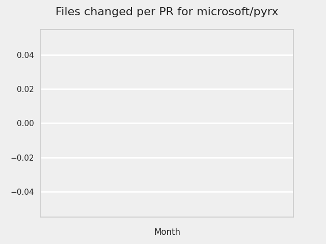

# GITHUB ISSUES REPORT FOR microsoft/pylance-release

Generated on 2024-08-13 using: stale=30, all=True

* marks items that are new to report in past 1 day(s)

## FOR ISSUES THAT ARE MARKED AS BUGS:

### Issues in pylance-release that need a response from team:

| Days Ago | Issue | Title |
| --- | --- | --- |
 |  OP:159  |[5595](https://github.com/microsoft/pylance-release/issues/5595 "Intellisense/completion does not work with two generic parameters until the second is supplied") | Intellisense/completion does not work with two generic parameters until the second is supplied |
 |  OP:175  |[5486](https://github.com/microsoft/pylance-release/issues/5486 "Intellisense not updating for workspace with multiple folders") | Intellisense not updating for workspace with multiple folders |

### Issues in pylance-release that have comments from OP after last team response:

| Days Ago | Issue | Title |
| --- | --- | --- |
 |  TM:12, OP:12  |[5812](https://github.com/microsoft/pylance-release/issues/5812 "Setting `python.analysis.nodeExecutable` in the user settings affects how pylance gets launched on VSCode remote") | Setting `python.analysis.nodeExecutable` in the user settings affects how pylance gets launched on VSCode remote |
 |  TM:155, OP:155  |[5616](https://github.com/microsoft/pylance-release/issues/5616 "No auto-completion provided when using overloaded `__new__` definitions") | No auto-completion provided when using overloaded `__new__` definitions |
 |  TM:159, OP:157  |[5600](https://github.com/microsoft/pylance-release/issues/5600 "Rename function must also handle first argument of Annotated if it is string") | Rename function must also handle first argument of Annotated if it is string |
 |  TM:167, OP:166  |[5508](https://github.com/microsoft/pylance-release/issues/5508 "Custom partial type package breaks other imports") | Custom partial type package breaks other imports |
 |  TM:178, OP:176  |[5472](https://github.com/microsoft/pylance-release/issues/5472 "Can't go to definition on `shutil.rmtree`") | Can't go to definition on `shutil.rmtree` |
 |  TM:246, OP:245  |[5235](https://github.com/microsoft/pylance-release/issues/5235 "Output error messages are garbled in Japanese-locale Windows") | Output error messages are garbled in Japanese-locale Windows |
 |  TM:253, OP:247  |[5203](https://github.com/microsoft/pylance-release/issues/5203 "Pytest fixtures and tests do not have autocompletion for types") | Pytest fixtures and tests do not have autocompletion for types |
 |  TM:498, OP:498  |[4185](https://github.com/microsoft/pylance-release/issues/4185 "Global objects not recognized if defined in a subsequent cell of a Jupyter notebook") | Global objects not recognized if defined in a subsequent cell of a Jupyter notebook |

### Issues in pylance-release that have comments from 3rd party after last team response:

| Days Ago | Issue | Title |
| --- | --- | --- |
 |  P:88,  |[5880](https://github.com/microsoft/pylance-release/issues/5880 "Pylance doesn't honor VSCode display language") | Pylance doesn't honor VSCode display language |
 |  P:117,  |[5652](https://github.com/microsoft/pylance-release/issues/5652 "Wrong auto-completion for `TypedDict` keys when assigning to a variable annotated as `Literal`") | Wrong auto-completion for `TypedDict` keys when assigning to a variable annotated as `Literal` |
 |  P:130,  |[5645](https://github.com/microsoft/pylance-release/issues/5645 "Workspace folder names are evaluated as regular expressions") | Workspace folder names are evaluated as regular expressions |
 |  P:6,  |[4391](https://github.com/microsoft/pylance-release/issues/4391 "Correct type hints for meta-function that takes a function as an argument (ParamSpec)") | Correct type hints for meta-function that takes a function as an argument (ParamSpec) |
 |  P:637,  |[3114](https://github.com/microsoft/pylance-release/issues/3114 "Assign to variable from commented-out magic command") | Assign to variable from commented-out magic command |

### Issues in pylance-release that have no external responses since team response in 30+ days:

| Days Ago | Issue | Title |
| --- | --- | --- |
 |  TM:46  |[6066](https://github.com/microsoft/pylance-release/issues/6066 "Wrong argument provided during auto completion if inside a collection") | Wrong argument provided during auto completion if inside a collection |
 |  TM:54  |[5977](https://github.com/microsoft/pylance-release/issues/5977 "Annoying intellisense: showing me parameter popup during editing str parameter") | Annoying intellisense: showing me parameter popup during editing str parameter |
 |  TM:33  |[5965](https://github.com/microsoft/pylance-release/issues/5965 "Intellisense is popping up parameters when it is definitely NOT needed") | Intellisense is popping up parameters when it is definitely NOT needed |
 |  TM:88  |[5890](https://github.com/microsoft/pylance-release/issues/5890 "a subclass member variable is not recognized as the same variable in superclass unless it has an explicit type hint") | a subclass member variable is not recognized as the same variable in superclass unless it has an explicit type hint |
 |  TM:103  |[5840](https://github.com/microsoft/pylance-release/issues/5840 "Function Docstrings Obscured By Decorators That Return Protocols") | Function Docstrings Obscured By Decorators That Return Protocols |
 |  TM:98  |[5836](https://github.com/microsoft/pylance-release/issues/5836 "Improve docs to clarify that import heuristics don't work for local imports") | Improve docs to clarify that import heuristics don't work for local imports |
 |  TM:106  |[5808](https://github.com/microsoft/pylance-release/issues/5808 "parse error on magic statement on ipython mode.") | parse error on magic statement on ipython mode. |
 |  TM:138  |[5699](https://github.com/microsoft/pylance-release/issues/5699 "Auto format of strings doesn't work until you reload VS code") | Auto format of strings doesn't work until you reload VS code |
 |  TM:146  |[5663](https://github.com/microsoft/pylance-release/issues/5663 "Pylance reports problems in interactive window without a way to ignore them") | Pylance reports problems in interactive window without a way to ignore them |
 |  TM:138  |[5659](https://github.com/microsoft/pylance-release/issues/5659 "String interpolation (f strings) is breaking autocomplete") | String interpolation (f strings) is breaking autocomplete |
 |  TM:153  |[5625](https://github.com/microsoft/pylance-release/issues/5625 "Quick fix add import depends upon a file being open") | Quick fix add import depends upon a file being open |
 |  TM:162  |[5561](https://github.com/microsoft/pylance-release/issues/5561 "&quot;Extract method&quot; refactor produces incorrect code") | "Extract method" refactor produces incorrect code |
 |  TM:166  |[5458](https://github.com/microsoft/pylance-release/issues/5458 "Autocomplete for class parameters not working on 2023.12.1 and later versions") | Autocomplete for class parameters not working on 2023.12.1 and later versions |
 |  TM:183  |[5456](https://github.com/microsoft/pylance-release/issues/5456 "Incorrect function argument indentation") | Incorrect function argument indentation |
 |  TM:196  |[5421](https://github.com/microsoft/pylance-release/issues/5421 "Overriding `__getattribute__` messes up utility of &quot;Go to Definition&quot;") | Overriding `__getattribute__` messes up utility of "Go to Definition" |
 |  TM:193  |[5432](https://github.com/microsoft/pylance-release/issues/5432 "Pyright is using Incorrect Interpreter Path") | Pyright is using Incorrect Interpreter Path |
 |  TM:33  |[5299](https://github.com/microsoft/pylance-release/issues/5299 "Descriptor type shown in autocomplete popover is incorrect") | Descriptor type shown in autocomplete popover is incorrect |
 |  TM:33  |[5125](https://github.com/microsoft/pylance-release/issues/5125 "Refactoring is not possible if marked block starts with a comment") | Refactoring is not possible if marked block starts with a comment |
 |  TM:33  |[5091](https://github.com/microsoft/pylance-release/issues/5091 "block comments  not adapt with python.") | block comments  not adapt with python. |
 |  TM:159  |[5079](https://github.com/microsoft/pylance-release/issues/5079 "Signature helper for a overload without docstring is showing the docstring of a different overload (of the same function)") | Signature helper for a overload without docstring is showing the docstring of a different overload (of the same function) |
 |  TM:271  |[5006](https://github.com/microsoft/pylance-release/issues/5006 "TypedDict hover text does not show docstrings for inherited key type hints") | TypedDict hover text does not show docstrings for inherited key type hints |
 |  TM:336  |[4831](https://github.com/microsoft/pylance-release/issues/4831 "Types are not qualified on derived method completions") | Types are not qualified on derived method completions |
 |  TM:340  |[4812](https://github.com/microsoft/pylance-release/issues/4812 "Incorrectly marking ParamSpec variable with a clickable type inlay") | Incorrectly marking ParamSpec variable with a clickable type inlay |
 |  TM:341  |[4808](https://github.com/microsoft/pylance-release/issues/4808 "Pressing tab to autocomplete a named kwarg results in two `==` if replacing existing kwarg") | Pressing tab to autocomplete a named kwarg results in two `==` if replacing existing kwarg |
 |  TM:313  |[4914](https://github.com/microsoft/pylance-release/issues/4914 "[Bug] F2 Renames Shadowed Variables Globally") | [Bug] F2 Renames Shadowed Variables Globally |
 |  TM:134  |[4586](https://github.com/microsoft/pylance-release/issues/4586 "Refactoring detection is sensitive to comments") | Refactoring detection is sensitive to comments |
 |  TM:421  |[4489](https://github.com/microsoft/pylance-release/issues/4489 "Convert string to f-string when adding brackets around a text selection") | Convert string to f-string when adding brackets around a text selection |
 |  TM:427  |[4359](https://github.com/microsoft/pylance-release/issues/4359 "Pylance flags new submodules as missing imports with default settings") | Pylance flags new submodules as missing imports with default settings |
 |  TM:459  |[4354](https://github.com/microsoft/pylance-release/issues/4354 "New line leaves a trailing whitespace") | New line leaves a trailing whitespace |
 |  TM:287  |[4059](https://github.com/microsoft/pylance-release/issues/4059 "Pylance shows non-public exports in completion suggestions") | Pylance shows non-public exports in completion suggestions |
 |  TM:182  |[4065](https://github.com/microsoft/pylance-release/issues/4065 "Autoimport from module, not directly from file") | Autoimport from module, not directly from file |
 |  TM:512  |[4036](https://github.com/microsoft/pylance-release/issues/4036 "Code folding on `with` blocks breaks on multi-line `with` statement.") | Code folding on `with` blocks breaks on multi-line `with` statement. |
 |  TM:553  |[3921](https://github.com/microsoft/pylance-release/issues/3921 "Python Autocomplete breaks when there are common syntax errors") | Python Autocomplete breaks when there are common syntax errors |
 |  TM:488  |[3817](https://github.com/microsoft/pylance-release/issues/3817 "No Intellisense when the file is saved after Pylance initializes") | No Intellisense when the file is saved after Pylance initializes |
 |  TM:728  |[3153](https://github.com/microsoft/pylance-release/issues/3153 "Extract variable and method on arguments of decorator which precedes function definition doesn't create required definitions.") | Extract variable and method on arguments of decorator which precedes function definition doesn't create required definitions. |
 |  TM:490  |[2913](https://github.com/microsoft/pylance-release/issues/2913 "Semantic highlighing doesn't differentiate parameter passing by its name from usage inside the function") | Semantic highlighing doesn't differentiate parameter passing by its name from usage inside the function |
 |  TM:308  |[2226](https://github.com/microsoft/pylance-release/issues/2226 "vscode resolves paths with `..` in them even if the directory doesn't exist / has invalid name") | vscode resolves paths with `..` in them even if the directory doesn't exist / has invalid name |

---

## FOR ISSUES THAT ARE NOT MARKED AS BUGS:

### Issues in pylance-release that need a response from team:

| Days Ago | Issue | Title |
| --- | --- | --- |
 | \* OP:1  |[6258](https://github.com/microsoft/pylance-release/issues/6258 "Sub-module imports not resolved with module files the same name as sub-module folder.")  |Sub-module imports not resolved with module files the same name as sub-module folder. |
 |  OP:17  |[6201](https://github.com/microsoft/pylance-release/issues/6201 "Allow toggling fstring using keyboard shortcut (vscode command)") | Allow toggling fstring using keyboard shortcut (vscode command) |
 |  OP:17  |[6199](https://github.com/microsoft/pylance-release/issues/6199 "Wrong &quot;Expected no arguments to <Flask SQL Alchemy> constructor&quot;") | Wrong "Expected no arguments to <Flask SQL Alchemy> constructor" |
 |  OP:93  |[5877](https://github.com/microsoft/pylance-release/issues/5877 "Syntax highlighting works differently in the last curly brackets in f-strings") | Syntax highlighting works differently in the last curly brackets in f-strings |
 |  OP:110  |[5801](https://github.com/microsoft/pylance-release/issues/5801 "How to remove unused imports from ALL files as a one-off task") | How to remove unused imports from ALL files as a one-off task |
 |  OP:112  |[5791](https://github.com/microsoft/pylance-release/issues/5791 "Syntax highlighting breaks down if you line break at curly bracket in f-strings") | Syntax highlighting breaks down if you line break at curly bracket in f-strings |
 |  OP:117  |[5773](https://github.com/microsoft/pylance-release/issues/5773 "Offer `self.` completions for methods and attributes") | Offer `self.` completions for methods and attributes |
 |  OP:127  |[5737](https://github.com/microsoft/pylance-release/issues/5737 "`__init__` params not displayed when hovering over type name") | `__init__` params not displayed when hovering over type name |
 |  OP:152  |[5642](https://github.com/microsoft/pylance-release/issues/5642 "Browsers reporting &quot;Virus detected&quot; and blocking download of Pylance Extension") | Browsers reporting "Virus detected" and blocking download of Pylance Extension |
 |  OP:154  |[5627](https://github.com/microsoft/pylance-release/issues/5627 "Function parameter not showing definition on hover for class") | Function parameter not showing definition on hover for class |
 |  OP:157  |[5611](https://github.com/microsoft/pylance-release/issues/5611 "Semantic Highlighting for Constants") | Semantic Highlighting for Constants |
 |  OP:158  |[5607](https://github.com/microsoft/pylance-release/issues/5607 "Documentation on dataclass constructor argument typed as optional with default value does not show the full type") | Documentation on dataclass constructor argument typed as optional with default value does not show the full type |
 |  OP:168  |[5521](https://github.com/microsoft/pylance-release/issues/5521 "# in raw string not highlighted as string") | # in raw string not highlighted as string |
 |  OP:187  |[5448](https://github.com/microsoft/pylance-release/issues/5448 "Pylance Fail to read package source") | Pylance Fail to read package source |
 |  OP:202  |[5392](https://github.com/microsoft/pylance-release/issues/5392 "`python.analysis.inlayHints.callArgumentNames`: Option to exclude argument names when the variable name matches") | `python.analysis.inlayHints.callArgumentNames`: Option to exclude argument names when the variable name matches |
 |  OP:226  |[5312](https://github.com/microsoft/pylance-release/issues/5312 "Show function return value documentation on hover over the `->` annotation") | Show function return value documentation on hover over the `->` annotation |
 |  OP:251  |[5219](https://github.com/microsoft/pylance-release/issues/5219 "'Move to file' refactoring should allow me to specify a new file name") | 'Move to file' refactoring should allow me to specify a new file name |
 |  OP:257  |[5185](https://github.com/microsoft/pylance-release/issues/5185 "Edge case in `Auto Format Strings` setting feature") | Edge case in `Auto Format Strings` setting feature |
 |  OP:265  |[5141](https://github.com/microsoft/pylance-release/issues/5141 "Prioritize completions for class types from union types in `match`/`case`") | Prioritize completions for class types from union types in `match`/`case` |
 |  OP:302  |[4965](https://github.com/microsoft/pylance-release/issues/4965 "Mention in Pyright docs how to override Pyright settings in Pylance") | Mention in Pyright docs how to override Pyright settings in Pylance |
 |  OP:318  |[5014](https://github.com/microsoft/pylance-release/issues/5014 "VSCode does't recognising installed packages with pipenv in virtualenv") | VSCode does't recognising installed packages with pipenv in virtualenv |

### Issues in pylance-release that have comments from OP after last team response:

| Days Ago | Issue | Title |
| --- | --- | --- |
 |  TM:3, OP:3  |[6251](https://github.com/microsoft/pylance-release/issues/6251 "pylance unable to recognize property render by another class") | pylance unable to recognize property render by another class |
 |  TM:5, OP:4  |[6247](https://github.com/microsoft/pylance-release/issues/6247 "Jupyter Notebooks imports not being resolved") | Jupyter Notebooks imports not being resolved |
 |  TM:14, OP:13  |[6209](https://github.com/microsoft/pylance-release/issues/6209 "Pylance fails to import just few classes") | Pylance fails to import just few classes |
 |  TM:39, OP:38  |[6091](https://github.com/microsoft/pylance-release/issues/6091 "enhancement to the auto-exclusion filter to pick up full Python runtime installations in addition to picking up virtual environments.") | enhancement to the auto-exclusion filter to pick up full Python runtime installations in addition to picking up virtual environments. |
 |  TM:49, OP:49  |[6047](https://github.com/microsoft/pylance-release/issues/6047 "Setting &quot;python.analysis.nodeExecutable&quot; requires a manual confirmation?") | Setting "python.analysis.nodeExecutable" requires a manual confirmation? |
 |  TM:43, OP:39  |[6036](https://github.com/microsoft/pylance-release/issues/6036 "There are still some deficiencies in automatic completion") | There are still some deficiencies in automatic completion |
 |  TM:29, OP:6  |[6034](https://github.com/microsoft/pylance-release/issues/6034 "Pylance 在过去 3 分钟内崩溃了 5 次。Pylance 不会重新启动。有关详细信息，请参阅输出。 in wsl windows project") | Pylance 在过去 3 分钟内崩溃了 5 次。Pylance 不会重新启动。有关详细信息，请参阅输出。 in wsl windows project |
 |  TM:69, OP:68  |[5970](https://github.com/microsoft/pylance-release/issues/5970 "The automatic behavior of `python.analysis.exclude` is ambiguous when I specify excluded paths.") | The automatic behavior of `python.analysis.exclude` is ambiguous when I specify excluded paths. |
 |  TM:91, OP:90  |[5864](https://github.com/microsoft/pylance-release/issues/5864 "Remote extension host terminates unexpectedly") | Remote extension host terminates unexpectedly |
 |  TM:98, OP:97  |[5820](https://github.com/microsoft/pylance-release/issues/5820 "Allow setting --max-old-space-size when using python.analysis.nodeExecutable") | Allow setting --max-old-space-size when using python.analysis.nodeExecutable |
 |  TM:109, OP:109  |[5799](https://github.com/microsoft/pylance-release/issues/5799 "How to set pylance memory  max limitation?") | How to set pylance memory  max limitation? |
 |  TM:133, OP:133  |[5669](https://github.com/microsoft/pylance-release/issues/5669 "A local variable is being treated as type 'Never' in an except handler") | A local variable is being treated as type 'Never' in an except handler |
 |  TM:152, OP:152  |[5614](https://github.com/microsoft/pylance-release/issues/5614 "Pylance using a lot of memory") | Pylance using a lot of memory |
 |  TM:155, OP:26  |[5564](https://github.com/microsoft/pylance-release/issues/5564 "Proposal: Use Nearest Configuration File") | Proposal: Use Nearest Configuration File |
 |  TM:166, OP:166  |[5542](https://github.com/microsoft/pylance-release/issues/5542 "Derived method completions use incorrect return type annotations when differing by `async` modifier.") | Derived method completions use incorrect return type annotations when differing by `async` modifier. |
 |  TM:189, OP:189  |[5414](https://github.com/microsoft/pylance-release/issues/5414 "grey out unused imports transitively") | grey out unused imports transitively |
 |  TM:159, OP:159  |[5377](https://github.com/microsoft/pylance-release/issues/5377 "Python and/or pylance is broken since last couple of updates ") | Python and/or pylance is broken since last couple of updates  |
 |  TM:163, OP:163  |[5284](https://github.com/microsoft/pylance-release/issues/5284 "Python smart navigation/auto-completion don't work anymore with 1.85.1") | Python smart navigation/auto-completion don't work anymore with 1.85.1 |
 |  TM:258, OP:175  |[5158](https://github.com/microsoft/pylance-release/issues/5158 "Add a feature to disable following symlinks when indexing repository") | Add a feature to disable following symlinks when indexing repository |
 |  TM:238, OP:238  |[5128](https://github.com/microsoft/pylance-release/issues/5128 "Slow code checking with a workspace on a slow network connection") | Slow code checking with a workspace on a slow network connection |
 |  TM:272, OP:272  |[5119](https://github.com/microsoft/pylance-release/issues/5119 "Bring along imports when copy and pasting code across files") | Bring along imports when copy and pasting code across files |
 |  TM:277, OP:277  |[4970](https://github.com/microsoft/pylance-release/issues/4970 "Feature: &quot;Add Explicit Type Annotation&quot; code-action") | Feature: "Add Explicit Type Annotation" code-action |
 |  TM:294, OP:293  |[4967](https://github.com/microsoft/pylance-release/issues/4967 "extension.bundle.js detects as Trojan") | extension.bundle.js detects as Trojan |
 |  TM:308, OP:308  |[4944](https://github.com/microsoft/pylance-release/issues/4944 "Add Semantic modifiers for keyword arguments in function or class call.") | Add Semantic modifiers for keyword arguments in function or class call. |
 |  TM:347, OP:345  |[4772](https://github.com/microsoft/pylance-release/issues/4772 "Type is not inferred properly in PyQt5 (Type is Unknown)") | Type is not inferred properly in PyQt5 (Type is Unknown) |
 |  TM:398, OP:398  |[4601](https://github.com/microsoft/pylance-release/issues/4601 "Go To Symbol doesn't work") | Go To Symbol doesn't work |
 |  TM:567, OP:566  |[3470](https://github.com/microsoft/pylance-release/issues/3470 "Long checking and analyzing operations when using JAX") | Long checking and analyzing operations when using JAX |

### Issues in pylance-release that have comments from 3rd party after last team response:

| Days Ago | Issue | Title |
| --- | --- | --- |
 |  P:11,  |[6154](https://github.com/microsoft/pylance-release/issues/6154 "Pylance has crashed. Would you like to try using a Node.js executable to run the language server?") | Pylance has crashed. Would you like to try using a Node.js executable to run the language server? |
 |  P:5,  |[6029](https://github.com/microsoft/pylance-release/issues/6029 "Django stubs are out of date and cause erroneous type errors") | Django stubs are out of date and cause erroneous type errors |
 |  P:103,  |[5827](https://github.com/microsoft/pylance-release/issues/5827 "Bundled type hints for lxml are inconsistent with source, lxml-stubs") | Bundled type hints for lxml are inconsistent with source, lxml-stubs |
 |  P:12,  |[5762](https://github.com/microsoft/pylance-release/issues/5762 "Pylance Crashing Constantly: `Error: Unhandled method python/isTrustedWorkspace`") | Pylance Crashing Constantly: `Error: Unhandled method python/isTrustedWorkspace` |
 |  P:152,  |[5207](https://github.com/microsoft/pylance-release/issues/5207 "Allow specifying Pyright ") | Allow specifying Pyright  |
 |  P:62,  |[5138](https://github.com/microsoft/pylance-release/issues/5138 "Go-to-definition and find-all-references don't work on TypedDict properties") | Go-to-definition and find-all-references don't work on TypedDict properties |
 |  P:45,  |[4428](https://github.com/microsoft/pylance-release/issues/4428 "Autocomplete of Literal value only takes last overload into account") | Autocomplete of Literal value only takes last overload into account |
 |  P:67,  |[3100](https://github.com/microsoft/pylance-release/issues/3100 "Improve semantic highlighting of `TypeAlias`") | Improve semantic highlighting of `TypeAlias` |

### Issues in pylance-release that have no external responses since team response in 30+ days:

| Days Ago | Issue | Title |
| --- | --- | --- |
 |  TM:34  |[6114](https://github.com/microsoft/pylance-release/issues/6114 "python code are not rendered in correct colors in &quot;Visual Studio Dark&quot; and &quot;Default Dark Modern&quot; theme") | python code are not rendered in correct colors in "Visual Studio Dark" and "Default Dark Modern" theme |
 |  TM:46  |[6071](https://github.com/microsoft/pylance-release/issues/6071 "Quickfix add import proposes import that are not available for my python version (ignores sys.version_info)") | Quickfix add import proposes import that are not available for my python version (ignores sys.version_info) |
 |  TM:47  |[6045](https://github.com/microsoft/pylance-release/issues/6045 "Visible marking of ABC implementation possibility") | Visible marking of ABC implementation possibility |
 |  TM:57  |[6020](https://github.com/microsoft/pylance-release/issues/6020 "Duplicate common keys are shown when using union of `TypedDict`") | Duplicate common keys are shown when using union of `TypedDict` |
 |  TM:61  |[6006](https://github.com/microsoft/pylance-release/issues/6006 "Symlink would block pylance from working") | Symlink would block pylance from working |
 |  TM:62  |[6002](https://github.com/microsoft/pylance-release/issues/6002 "pylance performance issue generated by vscode") | pylance performance issue generated by vscode |
 |  TM:57  |[5991](https://github.com/microsoft/pylance-release/issues/5991 "Pylance crashed due to oom") | Pylance crashed due to oom |
 |  TM:77  |[5933](https://github.com/microsoft/pylance-release/issues/5933 "&quot;Go to symbol in workspace&quot; does not see the symbol") | "Go to symbol in workspace" does not see the symbol |
 |  TM:78  |[5922](https://github.com/microsoft/pylance-release/issues/5922 "&quot;Not a known attribute&quot; error") | "Not a known attribute" error |
 |  TM:81  |[5915](https://github.com/microsoft/pylance-release/issues/5915 "Better string completions") | Better string completions |
 |  TM:78  |[5894](https://github.com/microsoft/pylance-release/issues/5894 "`Import could not be resolved` with `[tool.setuptools.package-dir]`") | `Import could not be resolved` with `[tool.setuptools.package-dir]` |
 |  TM:81  |[5951](https://github.com/microsoft/pylance-release/issues/5951 "Renaming variable in a function renames it everywhere") | Renaming variable in a function renames it everywhere |
 |  TM:83  |[5892](https://github.com/microsoft/pylance-release/issues/5892 "Multiple libraries not recognized with errors is not a known attribute of module") | Multiple libraries not recognized with errors is not a known attribute of module |
 |  TM:74  |[5867](https://github.com/microsoft/pylance-release/issues/5867 "Pylance doesn't stop analyzing files") | Pylance doesn't stop analyzing files |
 |  TM:90  |[5861](https://github.com/microsoft/pylance-release/issues/5861 "v2024.5.1: Resolving the import of non-&quot;third party&quot; modules") | v2024.5.1: Resolving the import of non-"third party" modules |
 |  TM:105  |[5824](https://github.com/microsoft/pylance-release/issues/5824 "switch to a different tool for python syntax highlighting") | switch to a different tool for python syntax highlighting |
 |  TM:108  |[5770](https://github.com/microsoft/pylance-release/issues/5770 "Offer jedi users to switch to pylance (if they have pylance installed)") | Offer jedi users to switch to pylance (if they have pylance installed) |
 |  TM:117  |[5761](https://github.com/microsoft/pylance-release/issues/5761 "Support `python.analysis.nodeExecutable` in `.vscode/settings.json` and with `${workspaceFolder}` templating") | Support `python.analysis.nodeExecutable` in `.vscode/settings.json` and with `${workspaceFolder}` templating |
 |  TM:127  |[5733](https://github.com/microsoft/pylance-release/issues/5733 "Long string changes color if split it and add &quot;\&quot; to the end ") | Long string changes color if split it and add "\" to the end  |
 |  TM:131  |[5726](https://github.com/microsoft/pylance-release/issues/5726 "Pylance error for query_selector of Playwright") | Pylance error for query_selector of Playwright |
 |  TM:132  |[5718](https://github.com/microsoft/pylance-release/issues/5718 "pylance loses link to a object if it was returned by fixture") | pylance loses link to a object if it was returned by fixture |
 |  TM:132  |[5702](https://github.com/microsoft/pylance-release/issues/5702 "No type or autocomplete present in test function despite pytest fixture having type hint on mouseover") | No type or autocomplete present in test function despite pytest fixture having type hint on mouseover |
 |  TM:140  |[5689](https://github.com/microsoft/pylance-release/issues/5689 "Intellisense not working when using pylance (no suggestions Ctrl+Space)") | Intellisense not working when using pylance (no suggestions Ctrl+Space) |
 |  TM:133  |[5673](https://github.com/microsoft/pylance-release/issues/5673 "Quick fix does not respect analysis exclude path") | Quick fix does not respect analysis exclude path |
 |  TM:146  |[5658](https://github.com/microsoft/pylance-release/issues/5658 "Limit IntelliSense features on Copilot Chat code blocks ") | Limit IntelliSense features on Copilot Chat code blocks  |
 |  TM:151  |[5650](https://github.com/microsoft/pylance-release/issues/5650 "Importing from tests prefers deeper imports over package entry-point") | Importing from tests prefers deeper imports over package entry-point |
 |  TM:151  |[5648](https://github.com/microsoft/pylance-release/issues/5648 "Creation of `py.typed` is not detected") | Creation of `py.typed` is not detected |
 |  TM:155  |[5612](https://github.com/microsoft/pylance-release/issues/5612 "Semantic Token Type / Tooltip Info changes depending on order of Assignments") | Semantic Token Type / Tooltip Info changes depending on order of Assignments |
 |  TM:155  |[5618](https://github.com/microsoft/pylance-release/issues/5618 "Intellisense breaks with this extension in docker.") | Intellisense breaks with this extension in docker. |
 |  TM:161  |[5584](https://github.com/microsoft/pylance-release/issues/5584 "Parentheses and the atom they contain are both colored") | Parentheses and the atom they contain are both colored |
 |  TM:76  |[5475](https://github.com/microsoft/pylance-release/issues/5475 "Extremely slow renaming folders") | Extremely slow renaming folders |
 |  TM:188  |[5429](https://github.com/microsoft/pylance-release/issues/5429 "No docstrings when using pylance in vscode.dev") | No docstrings when using pylance in vscode.dev |
 |  TM:200  |[5410](https://github.com/microsoft/pylance-release/issues/5410 "Docstrings on pytest fixtures") | Docstrings on pytest fixtures |
 |  TM:203  |[5386](https://github.com/microsoft/pylance-release/issues/5386 "Rename key in TypedDict using &quot;rename symbol&quot; refactor should update all instances of that TypedDict") | Rename key in TypedDict using "rename symbol" refactor should update all instances of that TypedDict |
 |  TM:201  |[5385](https://github.com/microsoft/pylance-release/issues/5385 "option to disable double-click to insert for inlay hints") | option to disable double-click to insert for inlay hints |
 |  TM:218  |[5333](https://github.com/microsoft/pylance-release/issues/5333 "Autocomplete for Literal with formatted string type hint") | Autocomplete for Literal with formatted string type hint |
 |  TM:223  |[5310](https://github.com/microsoft/pylance-release/issues/5310 "Moving multiple files or renaming modules doesn't refactor imports") | Moving multiple files or renaming modules doesn't refactor imports |
 |  TM:159  |[5302](https://github.com/microsoft/pylance-release/issues/5302 "Repo indexing is confused") | Repo indexing is confused |
 |  TM:196  |[5231](https://github.com/microsoft/pylance-release/issues/5231 "&quot;Quick Fix&quot; doesn't suggest `__init__.py` imports") | "Quick Fix" doesn't suggest `__init__.py` imports |
 |  TM:253  |[5140](https://github.com/microsoft/pylance-release/issues/5140 "Previously-checked literals are offered in `match`/`case`") | Previously-checked literals are offered in `match`/`case` |
 |  TM:200  |[5072](https://github.com/microsoft/pylance-release/issues/5072 "Filters for autoimport suggestions") | Filters for autoimport suggestions |
 |  TM:179  |[5021](https://github.com/microsoft/pylance-release/issues/5021 "Syntax highlighting and code completion stops working in v2023.9.10 onwards") | Syntax highlighting and code completion stops working in v2023.9.10 onwards |
 |  TM:305  |[4926](https://github.com/microsoft/pylance-release/issues/4926 "[Web] No intellisense or colorization from modules in extra paths ") | [Web] No intellisense or colorization from modules in extra paths  |
 |  TM:308  |[4937](https://github.com/microsoft/pylance-release/issues/4937 "Syntax highlighting and formatting of tooltips in Python") | Syntax highlighting and formatting of tooltips in Python |
 |  TM:315  |[4912](https://github.com/microsoft/pylance-release/issues/4912 "Editor mark syntax error when trying to decorate a Python function with a decorator defined as an instance method inside the class") | Editor mark syntax error when trying to decorate a Python function with a decorator defined as an instance method inside the class |
 |  TM:320  |[4881](https://github.com/microsoft/pylance-release/issues/4881 "Pylance doesn't show docstring for pandas") | Pylance doesn't show docstring for pandas |
 |  TM:316  |[4746](https://github.com/microsoft/pylance-release/issues/4746 "Raw f-strings lose raw-string coloring") | Raw f-strings lose raw-string coloring |
 |  TM:179  |[4682](https://github.com/microsoft/pylance-release/issues/4682 "Auto-import is limited by packageIndexDepth") | Auto-import is limited by packageIndexDepth |
 |  TM:393  |[4613](https://github.com/microsoft/pylance-release/issues/4613 "False Positive for `covariant` when using `T | None`") | False Positive for `covariant` when using `T | None` |
 |  TM:50  |[4607](https://github.com/microsoft/pylance-release/issues/4607 "reportMissingImports when using multi-root workspace") | reportMissingImports when using multi-root workspace |
 |  TM:396  |[4609](https://github.com/microsoft/pylance-release/issues/4609 "Erratic problem reporting in VSCode") | Erratic problem reporting in VSCode |
 |  TM:399  |[4557](https://github.com/microsoft/pylance-release/issues/4557 "Possible to limit CPU/mem consumption of pylance node.exe?") | Possible to limit CPU/mem consumption of pylance node.exe? |
 |  TM:313  |[4920](https://github.com/microsoft/pylance-release/issues/4920 "More informative with IntelliSense ") | More informative with IntelliSense  |
 |  TM:447  |[4412](https://github.com/microsoft/pylance-release/issues/4412 "Add autocomplete for type parameters in 3.12") | Add autocomplete for type parameters in 3.12 |
 |  TM:475  |[4135](https://github.com/microsoft/pylance-release/issues/4135 "How to inform `reportGeneralTypeIssues` of TypeAliases?") | How to inform `reportGeneralTypeIssues` of TypeAliases? |
 |  TM:515  |[4098](https://github.com/microsoft/pylance-release/issues/4098 "semantic highlight and hints for a TypedDict's get function.") | semantic highlight and hints for a TypedDict's get function. |
 |  TM:475  |[4008](https://github.com/microsoft/pylance-release/issues/4008 "Support for Pydantic dynamic models") | Support for Pydantic dynamic models |
 |  TM:536  |[3991](https://github.com/microsoft/pylance-release/issues/3991 "Cannot access TypeVar from class property in function signature") | Cannot access TypeVar from class property in function signature |
 |  TM:563  |[3808](https://github.com/microsoft/pylance-release/issues/3808 "Problem with highlight code in diff comparison mode for python ") | Problem with highlight code in diff comparison mode for python  |
 |  TM:99  |[3704](https://github.com/microsoft/pylance-release/issues/3704 "Django. support django orm autocompletion") | Django. support django orm autocompletion |
 |  TM:203  |[3492](https://github.com/microsoft/pylance-release/issues/3492 "Cannot find 'decimal.Context' when typing 'decimal.ctxt'") | Cannot find 'decimal.Context' when typing 'decimal.ctxt' |
 |  TM:796  |[2486](https://github.com/microsoft/pylance-release/issues/2486 "Functions in os module only show type stubs information (both on hover and when doing &quot;go to definition&quot;)") | Functions in os module only show type stubs information (both on hover and when doing "go to definition") |

## MOST FREQUENTLY CHANGED FILES (by # of PRs):

108: packages/vscode-pylance/CHANGELOG.md
 94: packages/pylance-internal/src/server/asyncServer.ts
 89: packages/pyright/packages/pyright-internal/src/localization/package.nls.fr.json
 89: packages/pyright/packages/pyright-internal/src/localization/package.nls.it.json
 89: packages/pylance-internal/src/server/syncServer.ts
 88: packages/pyright/packages/pyright-internal/src/localization/package.nls.ko.json
 87: packages/pyright/packages/pyright-internal/src/localization/package.nls.es.json
 87: packages/pyright/packages/pyright-internal/src/localization/package.nls.ja.json
 87: packages/pyright/packages/pyright-internal/src/localization/package.nls.ru.json
 86: packages/pyright/packages/pyright-internal/src/localization/package.nls.de.json
 85: packages/pyright/packages/pyright-internal/src/localization/package.nls.pl.json
 85: packages/pyright/packages/pyright-internal/src/localization/package.nls.pt-br.json
 85: packages/pyright/packages/pyright-internal/src/localization/package.nls.zh-cn.json
 84: packages/pyright/packages/pyright-internal/src/localization/package.nls.cs.json
 83: packages/pyright/packages/pyright-internal/src/localization/package.nls.tr.json
 79: packages/pyright/packages/pyright-internal/src/localization/package.nls.zh-tw.json
 75: build/azuredevops/azure-pipelines-release.yml
 56: packages/pylance-internal/src/server/common.ts
 55: packages/pyright/packages/pyright-internal/src/localization/package.nls.qps-ploc.json
 55: packages/pyright/.gitrepo
 54: NOTICE.txt
 47: packages/pyright/packages/pyright-internal/src/analyzer/checker.ts
 47: packages/vscode-pylance/package.json
 47: packages/pyright/packages/pyright-internal/src/analyzer/typeEvaluator.ts
 46: packages/pyright/packages/pyright-internal/package-lock.json
 46: packages/pyright/packages/pyright-internal/package.json
 43: packages/pyright/packages/pyright-internal/src/localization/package.nls.en-us.json
 41: packages/vscode-pylance/package.nls.fr.json
 41: packages/vscode-pylance/package.nls.ko.json
 41: packages/vscode-pylance/package.nls.tr.json
 40: packages/vscode-pylance/package.nls.cs.json
 40: packages/vscode-pylance/package.nls.es.json
 40: packages/vscode-pylance/package.nls.it.json
 39: packages/vscode-pylance/package.nls.ja.json
 39: packages/vscode-pylance/package.nls.pl.json
 39: packages/vscode-pylance/package.nls.pt-br.json
 39: packages/vscode-pylance/package.nls.ru.json
 39: packages/pyright/lerna.json
 39: packages/vscode-pylance/package.nls.de.json
 38: packages/vscode-pylance/package.nls.zh-cn.json
 38: packages/vscode-pylance/package.nls.zh-tw.json
 38: packages/pyright/packages/pyright-internal/src/localization/localize.ts
 37: packages/pyright/packages/pyright-internal/src/analyzer/typeUtils.ts
 36: packages/pyright/packages/pyright-internal/src/analyzer/service.ts
 35: packages/pyright/packages/pyright-internal/src/analyzer/typeGuards.ts
 34: packages/pylance-internal/src/tests/languageServerTestUtils.ts
 32: build/automation/no-code-pylance-release.py
 31: packages/vscode-pylance/package.nls.json
 31: packages/pylance-internal/src/tests/languageService.basic.test.ts
 31: packages/pylance-internal/src/backgroundAnalysis.ts
 31: packages/pyright/packages/pyright-internal/src/analyzer/types.ts
 30: packages/pyright/packages/pyright-internal/src/languageServerBase.ts
 29: packages/vscode-pylance/package.nls.qps-ploc.json
 29: packages/pylance-internal/bundled/indices/stdlib.json
 29: build/build.yml
 28: packages/pyright/packages/pyright-internal/src/analyzer/program.ts
 28: packages/vscode-pylance/src/extension.ts
 27: packages/pyright/packages/pyright-internal/src/analyzer/typeEvaluatorTypes.ts
 26: packages/pyright/packages/pyright-internal/src/analyzer/patternMatching.ts
 26: packages/pyright/packages/pyright-internal/src/languageService/completionProvider.ts
 25: packages/pyright/packages/pyright-internal/src/analyzer/constraintSolver.ts
 25: packages/pyright/packages/pyright-internal/src/analyzer/constructors.ts
 24: packages/pylance-internal/bundled/stubs/pandas/core/frame.pyi
 24: packages/pylance-internal/src/languageService/completionProvider.ts
 24: packages/pyright/packages/pyright-internal/src/analyzer/codeFlowEngine.ts
 24: packages/pylance-internal/src/tests/languageService.notebook.test.ts
 24: packages/pylance-internal/src/tests/pylanceTestState.ts
 24: packages/pylance-internal/src/tests/testServers/common.ts
 23: packages/pyright/packages/pyright-internal/src/analyzer/importResolver.ts
 22: packages/pylance-internal/src/localization/package.nls.ja.json
 22: packages/pyright/docs/configuration.md
 22: packages/pylance-internal/src/browser/browserAsync.ts
 22: packages/pylance-internal/bundled/stubs/pandas/core/series.pyi
 21: packages/pylance-internal/src/localization/package.nls.cs.json
 21: packages/pylance-internal/src/localization/package.nls.de.json
 21: packages/pylance-internal/src/localization/package.nls.es.json
 21: packages/pylance-internal/src/localization/package.nls.fr.json
 21: packages/pylance-internal/src/localization/package.nls.it.json
 21: packages/pylance-internal/src/localization/package.nls.ko.json
 21: packages/pylance-internal/src/localization/package.nls.pl.json
 21: packages/pylance-internal/src/localization/package.nls.pt-br.json
 21: packages/pylance-internal/src/localization/package.nls.ru.json
 21: packages/pylance-internal/src/localization/package.nls.tr.json
 21: packages/pylance-internal/src/localization/package.nls.zh-cn.json
 21: packages/pylance-internal/src/localization/package.nls.zh-tw.json
 21: packages/pylance-internal/bundled/stubs/pandas/_version.pyi
 21: packages/pyright/packages/pyright-internal/src/analyzer/protocols.ts
 21: packages/vscode-pylance/src/sharedExtension.ts
 20: packages/pyright/packages/pyright-internal/src/analyzer/parseTreeUtils.ts
 20: packages/pyright/packages/pyright-internal/src/common/realFileSystem.ts
 20: packages/pylance-internal/src/common/PylanceServiceKeys.ts
 20: packages/pylance-internal/src/languageService/codeActionProvider.ts
 20: packages/pyright/packages/pyright-internal/src/analyzer/sourceFile.ts
 20: packages/pylance-internal/src/services/indexer.ts
 19: packages/pylance-internal/src/browser/browserSync.ts
 19: packages/pylance-internal/src/customLSP.ts
 18: package.json
 17: packages/pyright/packages/pyright-internal/src/analyzer/binder.ts
 17: packages/pyright/packages/pyright-internal/src/analyzer/dataClasses.ts
 17: packages/pylance-internal/src/localization/package.nls.en-us.json
 17: packages/pyright/packages/pyright-internal/src/common/configOptions.ts
 16: packages/pylance-internal/src/languageService/inlayHintsProvider.ts
 16: packages/pylance-internal/src/services/importAdder.ts
 16: packages/pyright/packages/pyright-internal/src/analyzer/decorators.ts
 16: packages/pyright/packages/pyright-internal/src/analyzer/operations.ts
 16: packages/pyright/packages/pyright-internal/src/analyzer/properties.ts
 16: packages/pylance-internal/src/node/nodeAsync.ts
 16: packages/pylance-internal/src/node/nodeSync.ts
 16: packages/pyright/packages/vscode-pyright/package-lock.json
 16: packages/pyright/packages/vscode-pyright/package.json
 16: packages/pylance-internal/src/languageService/refactoringProvider.ts
 16: .github/workflows/validation.yml
 16: packages/pylance-internal/src/commands/commandController.ts
 16: .github/workflows/build.yml
 15: packages/pylance-internal/src/pytest/fixtureFinder.ts
 15: packages/pyright/packages/pyright-internal/src/analyzer/enums.ts
 15: packages/pylance-internal/src/server/languageServices/pylanceLanguageService.ts
 15: packages/vscode-pylance/package-lock.json
 15: packages/pyright/packages/pyright-internal/src/tests/typeEvaluator3.test.ts
 15: packages/pylance-internal/src/browser/browserFileSystem.ts
 15: packages/pylance-internal/src/tests/codeActionProvider.test.ts
 15: packages/pyright/packages/pyright-internal/src/tests/typeEvaluator2.test.ts
 15: packages/pyright/packages/pyright-internal/src/analyzer/typedDicts.ts
 15: .github/workflows/pull_pyright.yml
 14: packages/pylance-internal/src/localization/package.nls.qps-ploc.json
 14: packages/vscode-pylance/src/browserExtension.ts
 14: packages/pylance-internal/package-lock.json
 14: packages/pylance-internal/package.json
 14: packages/pylance-internal/src/pylanceBackgroundAnalysisProgram.ts
 14: packages/pyright/packages/pyright-internal/src/tests/typeEvaluator1.test.ts
 14: .github/workflows/tag_release.yml
 13: packages/pylance-internal/src/localization/localize.ts
 13: packages/pylance-internal/src/languageService/TypeHierarchyProvider.ts
 13: packages/pyright/packages/pyright-internal/src/analyzer/constructorTransform.ts
 13: packages/pylance-server/src/limitedPylanceServer.ts
 13: packages/pylance-internal/src/tests/languageService.sync.test.ts
 13: packages/pylance-internal/src/languageService/aggregatedCompletionProvider.ts
 13: build/templates/build-vsix.yml
 13: build/utils/docify-pandas.cfg
 13: packages/pylance-internal/src/common/uriMapper.ts
 12: packages/pyright/packages/pyright-internal/src/workspaceFactory.ts
 12: packages/pylance-internal/src/languageService/aggregatedHoverPovider.ts
 12: .vscode/launch.json
 12: packages/pylance-internal/src/pylanceImportResolver.ts
 12: package-lock.json
 12: packages/pyright/packages/pyright-internal/src/tests/uri.test.ts
 12: packages/pyright/packages/pyright-internal/src/tests/harness/fourslash/testState.ts
 12: packages/pyright/packages/pyright-internal/src/tests/typeEvaluator4.test.ts
 12: packages/pyright/packages/pyright-internal/src/common/uri/uri.ts
 12: packages/pyright/packages/pyright-internal/src/server.ts
 12: build/automation/teams_report_release_started.py
 11: packages/pylance-internal/src/server/asyncLspLanguageServerBase.ts
 11: packages/pylance-server/src/tests/pylanceServer.test.ts
 11: packages/pyright/packages/pyright-internal/src/languageService/referencesProvider.ts
 11: packages/pyright/packages/pyright-internal/src/parser/parser.ts
 11: packages/pylance-internal/src/node/nodeCommon.ts
 11: packages/pylance-internal/src/common/telemetry.ts
 11: packages/pylance-internal/bundled/stubs/pandas/core/generic.pyi
 11: packages/pyright/package-lock.json
 11: packages/pyright/packages/pyright-internal/src/tests/pathUtils.test.ts
 11: packages/pyright/packages/pyright-internal/typeshed-fallback/commit.txt
 11: packages/pylance-internal/src/commands/dumpFileDebugInfoCommand.ts
 10: packages/pylance-internal/src/tests/pytestExtension.test.ts
 10: packages/pyright/docs/type-concepts-advanced.md
 10: packages/pyright/packages/pyright-internal/src/analyzer/namedTuples.ts
 10: packages/pylance-internal/src/server/languageServices/languageServiceBase.ts
 10: tests/pylance-browser/package.json
 10: packages/pylance-internal/src/server/syncLspLanguageServer.ts
 10: packages/pylance-internal/bundled/stubs/pandas/_typing.pyi
 10: packages/pylance-internal/src/commands/commands.ts
 10: packages/pyright/packages/pyright-internal/src/backgroundThreadBase.ts
 10: packages/pylance-internal/src/tests/completions.test.ts
 10: packages/pylance-internal/bundled/stubs/pandas/core/indexes/base.pyi
  9: packages/pylance-internal/src/common/getAttrMemberUtils.ts
  9: packages/pylance-internal/src/tests/docStringService.test.ts
  9: packages/pylance-browser/package.json
  9: tests/pylance-browser/package-lock.json
  9: packages/pylance-internal/src/tests/telemetry.test.ts
  9: packages/vscode-pylance/src/common/localize.ts
  9: packages/pylance-internal/src/browser/browserCommon.ts
  9: packages/pylance-internal/src/languageService/pythonFormatOnTypeProvider.ts
  9: packages/pyright/packages/pyright-internal/src/backgroundAnalysisBase.ts
  9: packages/pyright/packages/pyright-internal/src/tests/checker.test.ts
  9: packages/pyright/packages/pyright/package-lock.json
  9: packages/pyright/packages/pyright/package.json
  9: packages/pyright/packages/pyright-internal/src/analyzer/typePrinter.ts
  9: packages/pyright/packages/pyright-internal/src/analyzer/typeVarContext.ts
  9: packages/pyright/packages/pyright-internal/src/tests/config.test.ts
  9: packages/pylance-internal/bundled/stubs/pandas/core/groupby/generic.pyi
  9: packages/pyright/packages/pyright-internal/src/common/uri/fileUri.ts
  9: dashboard/_toc.yml
  9: packages/vscode-pylance/src/common/middlewareBase.ts
  9: packages/pyright/packages/pyright-internal/src/common/pathUtils.ts
  8: packages/pyright/packages/pyright-internal/src/common/fullAccessHost.ts
  8: packages/pylance-internal/src/common/magicMethodUtils.ts
  8: packages/pylance-browser/etc/pylance-browser.api.md
  8: packages/pylance-browser/src/client.ts
  8: packages/pylance-internal/src/server/asyncLspLanguageServer.ts
  8: packages/pylance-browser/package-lock.json
  8: packages/pyright/packages/pyright-internal/src/languageService/hoverProvider.ts
  8: packages/pylance-internal/src/common/indentationUtils.ts
  8: packages/pylance-internal/src/languageService/moveSymbolProvider.ts
  8: packages/pylance-internal/src/languageService/stringDefinitionProvider.ts
  8: packages/pylance-internal/src/pytest/pyTestDocumentTransformer.ts
  8: packages/pylance-internal/src/pylanceWorkspace.ts
  8: packages/pylance-internal/src/tests/browserFileSystem.test.ts
  8: packages/pylance-internal/bundled/stubs/pandas/core/indexes/multi.pyi
  8: dashboard/errors/extension_stack_traces_insiders.ipynb
  8: dashboard/errors/extension_stack_traces_stable.ipynb
  8: packages/pylance-internal/src/services/codeActions/addTypeIgnore.ts
  8: packages/pylance-internal/bundled/stubs/pandas/core/algorithms.pyi
  8: packages/pylance-internal/src/tests/importAdder.test.ts
  8: packages/pyright/packages/pyright-internal/src/common/uri/webUri.ts
  8: packages/pyright/packages/pyright-internal/src/common/extensibility.ts
  7: build/azuredevops/loc_pylance.yml
  7: packages/pylance-internal/src/server/languageServices/languageService.ts
  7: packages/pylance-internal/src/languageService/getAttrMemberDefinitionProvider.ts
  7: packages/pylance-internal/src/pytest/pyTestHoverProvider.ts
  7: packages/pylance-internal/src/services/typeStringGenerator.ts
  7: packages/pyright/packages/pyright-internal/src/analyzer/packageTypeVerifier.ts
  7: packages/pyright/packages/pyright-internal/src/analyzer/parameterUtils.ts
  7: packages/pylance-internal/src/common/docstring/utils.ts
  7: packages/pylance-internal/src/common/pylanceDocStringService.ts
  7: packages/pylance-server/package-lock.json
  7: packages/pylance-server/package.json
  7: packages/pyright/packages/pyright-internal/src/languageService/analyzerServiceExecutor.ts
  7: packages/pylance-internal/src/commands/convertImportFormatCommand.ts
  7: packages/pylance-internal/src/common/importUtils.ts
  7: packages/pylance-internal/src/pytest/commands/addAllFixtureTypeAnnotationsCommand.ts
  7: packages/pylance-internal/src/pytest/pyTestCompletionProvider.ts
  7: packages/pyright/packages/pyright-internal/src/common/serviceProviderExtensions.ts
  7: packages/pyright/packages/pyright-internal/src/common/envVarUtils.ts
  7: packages/pylance-internal/src/services/autoImporter.ts
  7: packages/pyright/packages/pyright-internal/src/commands/dumpFileDebugInfoCommand.ts
  7: packages/pyright/packages/pyright-internal/src/pyright.ts
  7: packages/pylance-browser/webpack.config.js
  7: dashboard/performance_charts.py
  7: dashboard/desktop/performance_insiders.ipynb
  7: dashboard/desktop/refactoring_insight.ipynb
  7: dashboard/errors/stack_traces_insiders.ipynb
  7: dashboard/errors/stack_traces_stable.ipynb
  7: packages/pylance-internal/bundled/stubs/pandas/io/excel/_base.pyi
  7: packages/pyright/packages/pyright-internal/src/languageService/callHierarchyProvider.ts
  7: packages/pylance-internal/src/tests/pythonFormatOnTypeProvider.test.ts
  7: packages/pylance-internal/bundled/stubs/pandas/io/pickle.pyi
  7: packages/pyright/package.json
  7: packages/pylance-internal/src/tests/importAdderTestUtils.ts
  7: .github/workflows/pyright_reclone.yml
  7: .github/workflows/round_robin.yml
  7: packages/pyright/packages/pyright-internal/src/common/uri/baseUri.ts
  6: packages/pylance-internal/src/common/pylanceFullAccessHost.ts
  6: packages/pylance-internal/src/server/languageServices/asynchronousFeatures.ts
  6: packages/pylance-internal/src/server/languageServices/synchronousFeatures.ts
  6: packages/pylance-internal/src/languageService/semanticTokenProvider.ts
  6: packages/pylance-internal/src/pytest/commands/createEditsUtils.ts
  6: packages/pylance-internal/src/pytest/fixtureUtils.ts
  6: dashboard/ptvs/ptvs_features.ipynb
  6: tests/pylance-browser/src/client/index.ts
  6: packages/pylance-internal/src/common/docstring/fixer.ts
  6: packages/pyright/packages/pyright-internal/src/tests/samples/matchSequence1.py
  6: packages/pylance-internal/src/common/pylanceFileSystem.ts
  6: packages/pylance-internal/src/commands/moveSymbolCommand.ts
  6: packages/pylance-internal/src/common/addImportsRanker.ts
  6: packages/pylance-internal/bundled/stubs/pandas/core/reshape/concat.pyi
  6: packages/pyright/packages/pyright-internal/src/tests/lsp/languageServerTestUtils.ts
  6: packages/pylance-internal/src/tests/profiling.test.ts
  6: packages/pyright/packages/pyright-internal/src/tests/languageServer.test.ts
  6: dashboard/requirements.txt
  6: packages/pyright/packages/pyright-internal/src/tests/lsp/languageServer.ts
  6: packages/vscode-pylance/src/common/clientManager.ts
  6: packages/pyright/packages/pyright-internal/src/tests/samples/final3.py
  6: packages/pylance-internal/bundled/stubs/pandas/core/indexes/interval.pyi
  6: packages/pylance-internal/src/tests/searchImports.test.ts
  6: packages/pyright/packages/pyright-internal/src/parser/tokenizer.ts
  6: packages/pyright/packages/pyright-internal/src/tests/samples/enum1.py
  6: packages/pyright/.github/workflows/build.yml
  6: dashboard/desktop/performance_stable.ipynb
  6: dashboard/refactoring_charts.py
  6: dashboard/usage/usage_utils.py
  6: packages/pyright/packages/pyright-internal/typeshed-fallback/stdlib/builtins.pyi
  6: packages/pylance-internal/bundled/stubs/pandas/core/reshape/merge.pyi
  6: packages/pyright/docs/features.md
  6: packages/pylance-internal/bundled/stubs/pandas/_libs/tslibs/timestamps.pyi
  6: build/setVersion.js
  6: packages/pylance-internal/src/commands/removeUnusedImportCommand.ts
  6: packages/pylance-internal/src/tests/typeStringGenerator.test.ts
  6: .github/workflows/release.yml
  6: packages/pyright/packages/pyright-internal/src/common/uri/emptyUri.ts
  6: packages/pyright/packages/pyright-internal/src/tests/samples/tuple1.py
  6: .github/workflows/teams-channel-report.yml
  5: packages/pylance-internal/src/languageService/stringDefinitionHoverProvider.ts
  5: packages/pyright/packages/pyright-internal/src/analyzer/declarationUtils.ts
  5: packages/pyright/packages/pyright-internal/src/analyzer/functionTransform.ts
  5: dashboard/ptvs/ptvs_retention.ipynb
  5: dashboard/ptvs_features_charts.py
  5: packages/pylance-internal/src/common/docstring/markdownFormatter.ts
  5: packages/pylance-internal/src/server/languageServices/pylanceSynchronousFeatures.ts
  5: packages/pylance-internal/src/tests/testServers/asyncServer.ts
  5: packages/pylance-internal/src/tests/testServers/syncServer.ts
  5: packages/pyright/packages/pyright-internal/src/tests/completions.test.ts
  5: packages/pyright/packages/pyright-internal/src/common/commandLineOptions.ts
  5: packages/pyright/packages/pyright-internal/src/common/languageServerInterface.ts
  5: packages/pyright/packages/pyright-internal/src/parser/parseNodes.ts
  5: packages/pyright/packages/pyright-internal/src/common/diagnosticRules.ts
  5: packages/pyright/packages/vscode-pyright/schemas/pyrightconfig.schema.json
  5: packages/pyright/packages/pyright-internal/src/tests/importResolver.test.ts
  5: packages/pylance-internal/src/tests/notebook.test.ts
  5: packages/pylance-internal/jest.config.js
  5: packages/pylance-internal/src/common/parseResultsUtils.ts
  5: packages/pylance-internal/src/services/declarationFinder.ts
  5: packages/pylance-internal/src/tests/pytest.test.ts
  5: packages/pylance-internal/src/tests/indexer.test.ts
  5: .github/workflows/start_stabilization.yml
  5: packages/pylance-internal/bundled/stubs/pandas/core/resample.pyi
  5: packages/pylance-internal/src/commands/loggingCommand.ts
  5: packages/pylance-internal/src/commands/profilingCommand.ts
  5: packages/pyright/.github/workflows/validation.yml
  5: packages/pylance-internal/bundled/stubs/django-stubs/db/models/fields/__init__.pyi
  5: packages/pyright/packages/pyright-internal/src/languageService/autoImporter.ts
  5: packages/pylance-internal/src/common/documentTransformer.ts
  5: packages/pyright/packages/pyright-internal/src/common/cancellationUtils.ts
  5: packages/pylance-internal/bundled/stubs/pandas/core/indexes/datetimes.pyi
  5: packages/pylance-internal/bundled/stubs/pandas/core/indexes/timedeltas.pyi
  5: packages/pyright/packages/pyright-internal/src/analyzer/deprecatedSymbols.ts
  5: dashboard/excel/excel_features.ipynb
  5: .github/workflows/dashboard.yml
  5: dashboard/web/performance_stable.ipynb
  5: packages/pyright/packages/pyright-internal/src/tests/samples/matchClass1.py
  5: packages/pyright/packages/pyright-internal/src/analyzer/typeDocStringUtils.ts
  5: packages/pylance-internal/src/commands/createTypeStub.ts
  5: build/automation/issue_utils.py
  5: build/utils/docify/docify_config.py
  5: packages/pylance-internal/src/tests/addTypeIgnore.test.ts
  5: packages/pylance-internal/bundled/stubs/pandas/_libs/tslibs/timedeltas.pyi
  5: packages/pyright/packages/pyright-internal/src/languageService/tooltipUtils.ts
  5: packages/pylance-internal/src/common/remoteFileSystem.ts
  5: packages/pylance-internal/src/lspSync/dispatcher/dispatchServer.ts
  5: packages/pylance-internal/src/commands/getAutoImportsCommand.ts
  5: packages/pylance-internal/src/pytest/commands/addFixtureTypeAnnotationCommand.ts
  5: .github/workflows/make_pandas_stubs.yml
  5: packages/pyright/packages/pyright-internal/src/pyrightFileSystem.ts
  5: build/automation/sync_release_folder.py
  5: packages/pylance-internal/bundled/stubs/pandas/io/html.pyi
  5: packages/pylance-browser/src/tests/client/index.ts
  5: packages/vscode-pylance/build/launchWebTests.js
  5: packages/vscode-pylance/src/api.ts
  5: packages/pyright/packages/vscode-pyright/src/extension.ts
  5: packages/pyright/packages/pyright-internal/typeshed-fallback/stdlib/_ctypes.pyi

