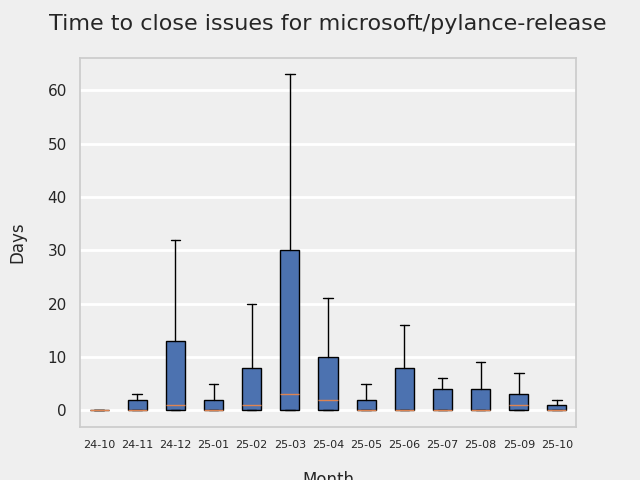
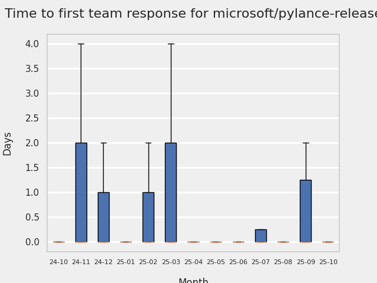

# GITHUB ISSUES REPORT FOR microsoft/pylance-release

Generated on 2025-11-02 using: stale=30, all=True

* marks items that are new to report in past 1 day(s)

## FOR ISSUES THAT ARE MARKED AS BUGS:

### Issues in pylance-release that need a response from team:

| Days Ago | Issue | Title |
| --- | --- | --- |
 |  OP:25  |[7620](https://github.com/microsoft/pylance-release/issues/7620 "inlay hints for return type changes on mouse hover") | inlay hints for return type changes on mouse hover |
 |  OP:63  |[7528](https://github.com/microsoft/pylance-release/issues/7528 "Pylance completion proposes to implement Protocol, but only methods are being added and not attributes") | Pylance completion proposes to implement Protocol, but only methods are being added and not attributes |
 |  OP:151  |[7296](https://github.com/microsoft/pylance-release/issues/7296 "Insertion of `Callable` doesn't import symbol though symbol is missing") | Insertion of `Callable` doesn't import symbol though symbol is missing |
 |  OP:165  |[7249](https://github.com/microsoft/pylance-release/issues/7249 "Inlay hints for functions that return `itemgetter` and `attrgetter` objects are invalid") | Inlay hints for functions that return `itemgetter` and `attrgetter` objects are invalid |
 |  OP:188  |[7165](https://github.com/microsoft/pylance-release/issues/7165 "Inserting inlay return types is missing originating module for generic types") | Inserting inlay return types is missing originating module for generic types |
 |  OP:188  |[7164](https://github.com/microsoft/pylance-release/issues/7164 "Inserting inlay return types resolves type aliases") | Inserting inlay return types resolves type aliases |
 |  OP:333  |[6731](https://github.com/microsoft/pylance-release/issues/6731 "Renaming class property doesn't update structural pattern matching uses of the renamed property") | Renaming class property doesn't update structural pattern matching uses of the renamed property |

### Issues in pylance-release that have comments from OP after last team response:

| Days Ago | Issue | Title |
| --- | --- | --- |
 |  TM:174, OP:173  |[7202](https://github.com/microsoft/pylance-release/issues/7202 "【vscode.dev】In Python project, the types defined in a local Python file being referenced cannot be recognized.") | 【vscode.dev】In Python project, the types defined in a local Python file being referenced cannot be recognized. |
 |  TM:208, OP:125  |[7110](https://github.com/microsoft/pylance-release/issues/7110 "Deleting a cell/scrolling causes error in language server (pylance)") | Deleting a cell/scrolling causes error in language server (pylance) |
 |  TM:444, OP:444  |[6269](https://github.com/microsoft/pylance-release/issues/6269 "Pyright emits meaningless `reportMissingModuleSource` warnings for submodules of native extension") | Pyright emits meaningless `reportMissingModuleSource` warnings for submodules of native extension |
 |  TM:458, OP:458  |[5812](https://github.com/microsoft/pylance-release/issues/5812 "Setting `python.analysis.nodeExecutable` in the user settings affects how pylance gets launched on VSCode remote") | Setting `python.analysis.nodeExecutable` in the user settings affects how pylance gets launched on VSCode remote |
 |  TM:605, OP:603  |[5600](https://github.com/microsoft/pylance-release/issues/5600 "Rename function must also handle first argument of Annotated if it is string") | Rename function must also handle first argument of Annotated if it is string |
 |  TM:613, OP:612  |[5508](https://github.com/microsoft/pylance-release/issues/5508 "Custom partial type package breaks other imports") | Custom partial type package breaks other imports |
 |  TM:625, OP:622  |[5472](https://github.com/microsoft/pylance-release/issues/5472 "Can't go to definition on `shutil.rmtree`") | Can't go to definition on `shutil.rmtree` |
 |  TM:699, OP:693  |[5203](https://github.com/microsoft/pylance-release/issues/5203 "Pytest fixtures and tests do not have autocompletion for types") | Pytest fixtures and tests do not have autocompletion for types |
 |  TM:944, OP:944  |[4185](https://github.com/microsoft/pylance-release/issues/4185 "Global objects not recognized if defined in a subsequent cell of a Jupyter notebook") | Global objects not recognized if defined in a subsequent cell of a Jupyter notebook |

### Issues in pylance-release that have comments from 3rd party after last team response:

| Days Ago | Issue | Title |
| --- | --- | --- |
 |  P:34,  |[7600](https://github.com/microsoft/pylance-release/issues/7600 "Docstrings of overloaded functions are not preserved in the hover provider through a decorator function in some cases") | Docstrings of overloaded functions are not preserved in the hover provider through a decorator function in some cases |
 |  P:94,  |[7061](https://github.com/microsoft/pylance-release/issues/7061 "Hover oddities") | Hover oddities |
 |  P:75,  |[6720](https://github.com/microsoft/pylance-release/issues/6720 "Incorrect Rendering of the Return Section of Google Style Docstrings with Type Annotations Inside") | Incorrect Rendering of the Return Section of Google Style Docstrings with Type Annotations Inside |
 |  P:16,  |[5880](https://github.com/microsoft/pylance-release/issues/5880 "Pylance doesn't honor VSCode display language") | Pylance doesn't honor VSCode display language |
 |  P:12,  |[5794](https://github.com/microsoft/pylance-release/issues/5794 "How to explicitly specify that Pylance only scans specific a few directories in a large multi-root workspace") | How to explicitly specify that Pylance only scans specific a few directories in a large multi-root workspace |
 |  P:563,  |[5652](https://github.com/microsoft/pylance-release/issues/5652 "Wrong auto-completion for `TypedDict` keys when assigning to a variable annotated as `Literal`") | Wrong auto-completion for `TypedDict` keys when assigning to a variable annotated as `Literal` |
 |  P:307,  |[5299](https://github.com/microsoft/pylance-release/issues/5299 "Descriptor type shown in autocomplete popover is incorrect") | Descriptor type shown in autocomplete popover is incorrect |
 |  P:452,  |[4391](https://github.com/microsoft/pylance-release/issues/4391 "Correct type hints for meta-function that takes a function as an argument (ParamSpec)") | Correct type hints for meta-function that takes a function as an argument (ParamSpec) |
 |  P:107,  |[3114](https://github.com/microsoft/pylance-release/issues/3114 "Assign to variable from commented-out magic command") | Assign to variable from commented-out magic command |

### Issues in pylance-release that have no external responses since team response in 30+ days:

| Days Ago | Issue | Title |
| --- | --- | --- |
 |  TM:44  |[7571](https://github.com/microsoft/pylance-release/issues/7571 "Keyword-only separator (*) incorrectly rendered as positional-only separator (/) in function hover tooltip") | Keyword-only separator (*) incorrectly rendered as positional-only separator (/) in function hover tooltip |
 |  TM:45  |[7568](https://github.com/microsoft/pylance-release/issues/7568 "Possible error in rendering google-style docstring with nested list in argument description") | Possible error in rendering google-style docstring with nested list in argument description |
 |  TM:63  |[7534](https://github.com/microsoft/pylance-release/issues/7534 "pylance/pyright is not ignoring the .venv in a morepo") | pylance/pyright is not ignoring the .venv in a morepo |
 |  TM:83  |[7495](https://github.com/microsoft/pylance-release/issues/7495 "Pylance using the wrong interpreter in parallel folders of a multi-root workspace when in LIGHT mode") | Pylance using the wrong interpreter in parallel folders of a multi-root workspace when in LIGHT mode |
 |  TM:100  |[7450](https://github.com/microsoft/pylance-release/issues/7450 "Pylance crash at making .env directory") | Pylance crash at making .env directory |
 |  TM:123  |[7384](https://github.com/microsoft/pylance-release/issues/7384 "Autocomplete inserts incorrect `Tuple[str]` instead of `Tuple[str, str]` in method override") | Autocomplete inserts incorrect `Tuple[str]` instead of `Tuple[str, str]` in method override |
 |  TM:157  |[7271](https://github.com/microsoft/pylance-release/issues/7271 "Error parsing pth file") | Error parsing pth file |
 |  TM:216  |[7084](https://github.com/microsoft/pylance-release/issues/7084 "Enable supportRestructuredText leads to visible non-breaking space in docstrings") | Enable supportRestructuredText leads to visible non-breaking space in docstrings |
 |  TM:230  |[7047](https://github.com/microsoft/pylance-release/issues/7047 "Wrong signature hint with unpacked parameterized typed dict as variadic keyword parameter") | Wrong signature hint with unpacked parameterized typed dict as variadic keyword parameter |
 |  TM:41  |[7051](https://github.com/microsoft/pylance-release/issues/7051 "Moving Folders And Multiple Files - Python Imports Not Refactoring") | Moving Folders And Multiple Files - Python Imports Not Refactoring |
 |  TM:320  |[6751](https://github.com/microsoft/pylance-release/issues/6751 "Multi-root workspace with hidden directories uses wrong python interpreter") | Multi-root workspace with hidden directories uses wrong python interpreter |
 |  TM:332  |[6732](https://github.com/microsoft/pylance-release/issues/6732 "kwargs typings are broken") | kwargs typings are broken |
 |  TM:354  |[6638](https://github.com/microsoft/pylance-release/issues/6638 "Inconsistent highlighting") | Inconsistent highlighting |
 |  TM:300  |[6612](https://github.com/microsoft/pylance-release/issues/6612 "IntelliSense not working for documents with custom URI schemes") | IntelliSense not working for documents with custom URI schemes |
 |  TM:373  |[6602](https://github.com/microsoft/pylance-release/issues/6602 "typing.Annotated is not suggested for auto-import in Quick Fix menu") | typing.Annotated is not suggested for auto-import in Quick Fix menu |
 |  TM:383  |[6559](https://github.com/microsoft/pylance-release/issues/6559 "[language-server]: only one suggestion for TypedDict union literal values") | [language-server]: only one suggestion for TypedDict union literal values |
 |  TM:384  |[6544](https://github.com/microsoft/pylance-release/issues/6544 "Pylance is generating invalid type annotations (with misattributed module names) for typing.Any in completions and inlays.") | Pylance is generating invalid type annotations (with misattributed module names) for typing.Any in completions and inlays. |
 |  TM:396  |[6493](https://github.com/microsoft/pylance-release/issues/6493 "Should not rename outer variables while renaming local variables if they're same") | Should not rename outer variables while renaming local variables if they're same |
 |  TM:395  |[6458](https://github.com/microsoft/pylance-release/issues/6458 "pytest fixtures dimmed as unused import despite being used") | pytest fixtures dimmed as unused import despite being used |
 |  TM:401  |[6450](https://github.com/microsoft/pylance-release/issues/6450 "Pylance autocompletes decorator of the function instead of function itself in inheritance") | Pylance autocompletes decorator of the function instead of function itself in inheritance |
 |  TM:404  |[6440](https://github.com/microsoft/pylance-release/issues/6440 "&quot;Move symbol to...&quot; refactor does not honor Import Format setting.") | "Move symbol to..." refactor does not honor Import Format setting. |
 |  TM:404  |[6419](https://github.com/microsoft/pylance-release/issues/6419 "Code prompt docstring displays incorrectly") | Code prompt docstring displays incorrectly |
 |  TM:405  |[6399](https://github.com/microsoft/pylance-release/issues/6399 "Go to Definition of submodule works on import but not where used `No definition found for &quot;...&quot;`") | Go to Definition of submodule works on import but not where used `No definition found for "..."` |
 |  TM:395  |[6398](https://github.com/microsoft/pylance-release/issues/6398 "Wildcard imports trip up module discovery? `not a known attribute of module`") | Wildcard imports trip up module discovery? `not a known attribute of module` |
 |  TM:412  |[6392](https://github.com/microsoft/pylance-release/issues/6392 "Missing docstring for descriptor alias") | Missing docstring for descriptor alias |
 |  TM:432  |[6309](https://github.com/microsoft/pylance-release/issues/6309 "Not show numpy classes docs.") | Not show numpy classes docs. |
 |  TM:433  |[6295](https://github.com/microsoft/pylance-release/issues/6295 "detected unhandled Python exception in '...extensions/ms-python.vscode-pylance-2024.3.2/dist/bundled/files/get_pytest_options.py'") | detected unhandled Python exception in '...extensions/ms-python.vscode-pylance-2024.3.2/dist/bundled/files/get_pytest_options.py' |
 |  TM:436  |[6292](https://github.com/microsoft/pylance-release/issues/6292 "&quot;Go to Definition&quot; not working for test functions inside classes") | "Go to Definition" not working for test functions inside classes |
 |  TM:437  |[6287](https://github.com/microsoft/pylance-release/issues/6287 "Inherit docstring from super class when missing in subclass") | Inherit docstring from super class when missing in subclass |
 |  TM:492  |[6066](https://github.com/microsoft/pylance-release/issues/6066 "Wrong argument provided during auto completion if inside a collection") | Wrong argument provided during auto completion if inside a collection |
 |  TM:500  |[5977](https://github.com/microsoft/pylance-release/issues/5977 "Annoying intellisense: showing me parameter popup during editing str parameter") | Annoying intellisense: showing me parameter popup during editing str parameter |
 |  TM:479  |[5965](https://github.com/microsoft/pylance-release/issues/5965 "Intellisense is popping up parameters when it is definitely NOT needed") | Intellisense is popping up parameters when it is definitely NOT needed |
 |  TM:534  |[5890](https://github.com/microsoft/pylance-release/issues/5890 "a subclass member variable is not recognized as the same variable in superclass unless it has an explicit type hint") | a subclass member variable is not recognized as the same variable in superclass unless it has an explicit type hint |
 |  TM:549  |[5840](https://github.com/microsoft/pylance-release/issues/5840 "Function Docstrings Obscured By Decorators That Return Protocols") | Function Docstrings Obscured By Decorators That Return Protocols |
 |  TM:544  |[5836](https://github.com/microsoft/pylance-release/issues/5836 "Improve docs to clarify that import heuristics don't work for local imports") | Improve docs to clarify that import heuristics don't work for local imports |
 |  TM:552  |[5808](https://github.com/microsoft/pylance-release/issues/5808 "parse error on magic statement on ipython mode.") | parse error on magic statement on ipython mode. |
 |  TM:409  |[5731](https://github.com/microsoft/pylance-release/issues/5731 " Auto import doesn't suggest re-exports in stdlib") |  Auto import doesn't suggest re-exports in stdlib |
 |  TM:584  |[5699](https://github.com/microsoft/pylance-release/issues/5699 "Auto format of strings doesn't work until you reload VS code") | Auto format of strings doesn't work until you reload VS code |
 |  TM:367  |[6617](https://github.com/microsoft/pylance-release/issues/6617 "Pylance reports problems in interactive window without a way to ignore them") | Pylance reports problems in interactive window without a way to ignore them |
 |  TM:584  |[5659](https://github.com/microsoft/pylance-release/issues/5659 "String interpolation (f strings) is breaking autocomplete") | String interpolation (f strings) is breaking autocomplete |
 |  TM:599  |[5625](https://github.com/microsoft/pylance-release/issues/5625 "Quick fix add import depends upon a file being open") | Quick fix add import depends upon a file being open |
 |  TM:608  |[5561](https://github.com/microsoft/pylance-release/issues/5561 "&quot;Extract method&quot; refactor produces incorrect code") | "Extract method" refactor produces incorrect code |
 |  TM:612  |[5458](https://github.com/microsoft/pylance-release/issues/5458 "Autocomplete for class parameters not working on 2023.12.1 and later versions") | Autocomplete for class parameters not working on 2023.12.1 and later versions |
 |  TM:629  |[5456](https://github.com/microsoft/pylance-release/issues/5456 "Incorrect function argument indentation") | Incorrect function argument indentation |
 |  TM:642  |[5421](https://github.com/microsoft/pylance-release/issues/5421 "Overriding `__getattribute__` messes up utility of &quot;Go to Definition&quot;") | Overriding `__getattribute__` messes up utility of "Go to Definition" |
 |  TM:640  |[5432](https://github.com/microsoft/pylance-release/issues/5432 "Pyright is using Incorrect Interpreter Path") | Pyright is using Incorrect Interpreter Path |
 |  TM:292  |[5310](https://github.com/microsoft/pylance-release/issues/5310 "Moving multiple files or renaming modules doesn't refactor imports") | Moving multiple files or renaming modules doesn't refactor imports |
 |  TM:467  |[5255](https://github.com/microsoft/pylance-release/issues/5255 "Pylance inlay hints do not honor python version") | Pylance inlay hints do not honor python version |
 |  TM:479  |[5125](https://github.com/microsoft/pylance-release/issues/5125 "Refactoring is not possible if marked block starts with a comment") | Refactoring is not possible if marked block starts with a comment |
 |  TM:479  |[5091](https://github.com/microsoft/pylance-release/issues/5091 "block comments  not adapt with python.") | block comments  not adapt with python. |
 |  TM:605  |[5079](https://github.com/microsoft/pylance-release/issues/5079 "Signature helper for a overload without docstring is showing the docstring of a different overload (of the same function)") | Signature helper for a overload without docstring is showing the docstring of a different overload (of the same function) |
 |  TM:782  |[4831](https://github.com/microsoft/pylance-release/issues/4831 "Types are not qualified on derived method completions") | Types are not qualified on derived method completions |
 |  TM:787  |[4812](https://github.com/microsoft/pylance-release/issues/4812 "Incorrectly marking ParamSpec variable with a clickable type inlay") | Incorrectly marking ParamSpec variable with a clickable type inlay |
 |  TM:787  |[4808](https://github.com/microsoft/pylance-release/issues/4808 "Pressing tab to autocomplete a named kwarg results in two `==` if replacing existing kwarg") | Pressing tab to autocomplete a named kwarg results in two `==` if replacing existing kwarg |
 |  TM:759  |[4914](https://github.com/microsoft/pylance-release/issues/4914 "[Bug] F2 Renames Shadowed Variables Globally") | [Bug] F2 Renames Shadowed Variables Globally |
 |  TM:580  |[4586](https://github.com/microsoft/pylance-release/issues/4586 "Refactoring detection is sensitive to comments") | Refactoring detection is sensitive to comments |
 |  TM:873  |[4359](https://github.com/microsoft/pylance-release/issues/4359 "Pylance flags new submodules as missing imports with default settings") | Pylance flags new submodules as missing imports with default settings |
 |  TM:905  |[4354](https://github.com/microsoft/pylance-release/issues/4354 "New line leaves a trailing whitespace") | New line leaves a trailing whitespace |
 |  TM:474  |[4304](https://github.com/microsoft/pylance-release/issues/4304 "False positive reportShadowedImports with PEP562 package-level getattr") | False positive reportShadowedImports with PEP562 package-level getattr |
 |  TM:733  |[4059](https://github.com/microsoft/pylance-release/issues/4059 "Pylance shows non-public exports in completion suggestions") | Pylance shows non-public exports in completion suggestions |
 |  TM:958  |[4036](https://github.com/microsoft/pylance-release/issues/4036 "Code folding on `with` blocks breaks on multi-line `with` statement.") | Code folding on `with` blocks breaks on multi-line `with` statement. |
 |  TM:999  |[3921](https://github.com/microsoft/pylance-release/issues/3921 "Python Autocomplete breaks when there are common syntax errors") | Python Autocomplete breaks when there are common syntax errors |
 |  TM:935  |[3817](https://github.com/microsoft/pylance-release/issues/3817 "No Intellisense when the file is saved after Pylance initializes") | No Intellisense when the file is saved after Pylance initializes |
 |  TM:936  |[2913](https://github.com/microsoft/pylance-release/issues/2913 "Semantic highlighing doesn't differentiate parameter passing by its name from usage inside the function") | Semantic highlighing doesn't differentiate parameter passing by its name from usage inside the function |
 |  TM:754  |[2226](https://github.com/microsoft/pylance-release/issues/2226 "vscode resolves paths with `..` in them even if the directory doesn't exist / has invalid name") | vscode resolves paths with `..` in them even if the directory doesn't exist / has invalid name |
 |  TM:188  |[2146](https://github.com/microsoft/pylance-release/issues/2146 "&quot;Extract method&quot; produces syntax error with multiline except clause") | "Extract method" produces syntax error with multiline except clause |

---

## FOR ISSUES THAT ARE NOT MARKED AS BUGS:

### Issues in pylance-release that need a response from team:

| Days Ago | Issue | Title |
| --- | --- | --- |
 | \* OP:0  |[7687](https://github.com/microsoft/pylance-release/issues/7687 "Issue")  |Issue |
 |  OP:5  |[7685](https://github.com/microsoft/pylance-release/issues/7685 "pip flask not installing") | pip flask not installing |
 |  OP:11  |[7661](https://github.com/microsoft/pylance-release/issues/7661 "False Positive marking of a Pydantic class as Dataclass") | False Positive marking of a Pydantic class as Dataclass |
 |  OP:12  |[7660](https://github.com/microsoft/pylance-release/issues/7660 "Bug with dunder methods") | Bug with dunder methods |
 |  OP:16  |[7650](https://github.com/microsoft/pylance-release/issues/7650 "Editable packages installed with uv are not resolved") | Editable packages installed with uv are not resolved |
 |  OP:17  |[7649](https://github.com/microsoft/pylance-release/issues/7649 "Inlay hints for call argument names not displayed when method has Union type annotation on self parameter") | Inlay hints for call argument names not displayed when method has Union type annotation on self parameter |
 |  OP:17  |[7648](https://github.com/microsoft/pylance-release/issues/7648 "include doesn't work properly in mutli-root workspaces") | include doesn't work properly in mutli-root workspaces |
 |  OP:18  |[7645](https://github.com/microsoft/pylance-release/issues/7645 "GitHub Codespaces keeps popping up message about forwarded port from Pylance") | GitHub Codespaces keeps popping up message about forwarded port from Pylance |
 |  OP:19  |[7639](https://github.com/microsoft/pylance-release/issues/7639 "Duplicate references shown when selecting &quot;Go to References&quot;") | Duplicate references shown when selecting "Go to References" |
 |  OP:24  |[7629](https://github.com/microsoft/pylance-release/issues/7629 "Changing Python file directory does not update import path of the file based on the settings") | Changing Python file directory does not update import path of the file based on the settings |
 |  OP:33  |[7602](https://github.com/microsoft/pylance-release/issues/7602 "Support for **kwargs: Unpack[TypedDictWithDocs] showing their docs") | Support for **kwargs: Unpack[TypedDictWithDocs] showing their docs |
 |  OP:35  |[7594](https://github.com/microsoft/pylance-release/issues/7594 "Feature Request - readable input for `pylanceRunCodeSnippet`") | Feature Request - readable input for `pylanceRunCodeSnippet` |
 |  OP:35  |[7593](https://github.com/microsoft/pylance-release/issues/7593 "Pylance doesn't color classes' generic types for 3.12 syntax") | Pylance doesn't color classes' generic types for 3.12 syntax |
 |  OP:38  |[7586](https://github.com/microsoft/pylance-release/issues/7586 "Go to Symbol in Workspace: Shows multiple copies of same symbol. Most symbol copies link to read-only editor.") | Go to Symbol in Workspace: Shows multiple copies of same symbol. Most symbol copies link to read-only editor. |
 |  OP:40  |[7581](https://github.com/microsoft/pylance-release/issues/7581 "The output language of AI Hover Summaries matches the display language of VSCode") | The output language of AI Hover Summaries matches the display language of VSCode |
 |  OP:40  |[7611](https://github.com/microsoft/pylance-release/issues/7611 "Extract variable/method ignores multi-selection") | Extract variable/method ignores multi-selection |
 |  OP:44  |[7572](https://github.com/microsoft/pylance-release/issues/7572 "Wrongly auto-completes `tru` to `np.true_divide` instead of python's `True`") | Wrongly auto-completes `tru` to `np.true_divide` instead of python's `True` |
 |  OP:47  |[7561](https://github.com/microsoft/pylance-release/issues/7561 "&quot;Move symbol to...&quot; duplicates the last line of the function") | "Move symbol to..." duplicates the last line of the function |
 |  OP:51  |[7554](https://github.com/microsoft/pylance-release/issues/7554 "if kwargs are annotated then subsequent function calls identify the parameters as variables not parameters ") | if kwargs are annotated then subsequent function calls identify the parameters as variables not parameters  |
 |  OP:64  |[7527](https://github.com/microsoft/pylance-release/issues/7527 "code completion and linting is not working for pyswisseph") | code completion and linting is not working for pyswisseph |
 |  OP:68  |[7518](https://github.com/microsoft/pylance-release/issues/7518 "Fail to render container types containing types with trailing `_` (underscore) in Sphinx-formatted docstrings") | Fail to render container types containing types with trailing `_` (underscore) in Sphinx-formatted docstrings |
 |  OP:75  |[7506](https://github.com/microsoft/pylance-release/issues/7506 "Open soure pylance extension") | Open soure pylance extension |
 |  OP:82  |[7497](https://github.com/microsoft/pylance-release/issues/7497 "Spurious unresolved imports in dependencies (not user code) in multi-root workspace") | Spurious unresolved imports in dependencies (not user code) in multi-root workspace |
 |  OP:90  |[7479](https://github.com/microsoft/pylance-release/issues/7479 "Unknown import symbol for Rust extension") | Unknown import symbol for Rust extension |
 |  OP:96  |[7468](https://github.com/microsoft/pylance-release/issues/7468 "Indexing fails when PYTHONPATH contains wheels.") | Indexing fails when PYTHONPATH contains wheels. |
 |  OP:101  |[7455](https://github.com/microsoft/pylance-release/issues/7455 "goto statement") | goto statement |
 |  OP:102  |[7449](https://github.com/microsoft/pylance-release/issues/7449 "Pylance misidentifies a method as an attribute, throws an error") | Pylance misidentifies a method as an attribute, throws an error |
 |  OP:115  |[7412](https://github.com/microsoft/pylance-release/issues/7412 "Find All References doesn't ignore files in __editable__.modulename.xxx directories") | Find All References doesn't ignore files in __editable__.modulename.xxx directories |
 |  OP:115  |[7408](https://github.com/microsoft/pylance-release/issues/7408 "Pylance fails to suggest dunder methods like __getitem__") | Pylance fails to suggest dunder methods like __getitem__ |
 |  OP:116  |[7401](https://github.com/microsoft/pylance-release/issues/7401 "Custom sorting of import auto-completes to allow `_private` sub-modules and members to be sorted at the end of the list") | Custom sorting of import auto-completes to allow `_private` sub-modules and members to be sorted at the end of the list |
 |  OP:120  |[7390](https://github.com/microsoft/pylance-release/issues/7390 "Type hints of member variables of a class which explicitly implements protocols") | Type hints of member variables of a class which explicitly implements protocols |
 |  OP:126  |[7376](https://github.com/microsoft/pylance-release/issues/7376 "Have an option to show all the properties of a object first rather defaulting to alphebetical order.") | Have an option to show all the properties of a object first rather defaulting to alphebetical order. |
 |  OP:190  |[7163](https://github.com/microsoft/pylance-release/issues/7163 "Feature Request - full list of available code actions") | Feature Request - full list of available code actions |
 |  OP:192  |[7155](https://github.com/microsoft/pylance-release/issues/7155 "vscode extension: file index error only on startup") | vscode extension: file index error only on startup |
 |  OP:193  |[7149](https://github.com/microsoft/pylance-release/issues/7149 "Renaming function/class parameters should recognize calls done through functools partial") | Renaming function/class parameters should recognize calls done through functools partial |
 |  OP:196  |[7145](https://github.com/microsoft/pylance-release/issues/7145 "Keys in inline typed dictionaries are shown as variables") | Keys in inline typed dictionaries are shown as variables |
 |  OP:199  |[7140](https://github.com/microsoft/pylance-release/issues/7140 "Pylance &quot;add import&quot; sometimes suggests imports from local files that import the object, instead of just the object's definition") | Pylance "add import" sometimes suggests imports from local files that import the object, instead of just the object's definition |
 |  OP:208  |[7109](https://github.com/microsoft/pylance-release/issues/7109 "Pylance does not set current working directory to workspace root when discovering sys.path") | Pylance does not set current working directory to workspace root when discovering sys.path |
 |  OP:221  |[7072](https://github.com/microsoft/pylance-release/issues/7072 "Please support autocompletion on String Enums without accessing value attribute") | Please support autocompletion on String Enums without accessing value attribute |
 |  OP:227  |[7056](https://github.com/microsoft/pylance-release/issues/7056 "Pylance performance issue report") | Pylance performance issue report |
 |  OP:231  |[7049](https://github.com/microsoft/pylance-release/issues/7049 "Autocompletion doesn't always work.") | Autocompletion doesn't always work. |
 |  OP:231  |[7043](https://github.com/microsoft/pylance-release/issues/7043 "Pylance analyzing whole workspace despite having &quot;python.analysis.diagnosticMode&quot;: &quot;openFilesOnly&quot;") | Pylance analyzing whole workspace despite having "python.analysis.diagnosticMode": "openFilesOnly" |
 |  OP:237  |[7033](https://github.com/microsoft/pylance-release/issues/7033 "performance issue reported by vscode") | performance issue reported by vscode |
 |  OP:248  |[6994](https://github.com/microsoft/pylance-release/issues/6994 "Add manual &quot;analyze&quot; button") | Add manual "analyze" button |
 |  OP:249  |[6988](https://github.com/microsoft/pylance-release/issues/6988 "Typesheds shadow local modules when imported as `from packageA import moduleB`") | Typesheds shadow local modules when imported as `from packageA import moduleB` |
 |  OP:255  |[6965](https://github.com/microsoft/pylance-release/issues/6965 "Completion unavailable for properties") | Completion unavailable for properties |
 |  OP:262  |[6958](https://github.com/microsoft/pylance-release/issues/6958 "Color Python Properties") | Color Python Properties |
 |  OP:268  |[6932](https://github.com/microsoft/pylance-release/issues/6932 "Double-click to insert variable-length tuple inserts a 1-length tuple if `typing.Tuple` is imported") | Double-click to insert variable-length tuple inserts a 1-length tuple if `typing.Tuple` is imported |
 |  OP:282  |[6888](https://github.com/microsoft/pylance-release/issues/6888 "Symlinks are not taken into account with &quot;find references&quot;") | Symlinks are not taken into account with "find references" |
 |  OP:282  |[6886](https://github.com/microsoft/pylance-release/issues/6886 "Add semantic token modifier to imported modules") | Add semantic token modifier to imported modules |
 |  OP:283  |[6883](https://github.com/microsoft/pylance-release/issues/6883 "Update documentation to reflect that editably-installed packages compiled by python-meson cannot be typechecked by pylance.") | Update documentation to reflect that editably-installed packages compiled by python-meson cannot be typechecked by pylance. |
 |  OP:286  |[6870](https://github.com/microsoft/pylance-release/issues/6870 "Show Preview of Constant Values on Hover") | Show Preview of Constant Values on Hover |
 |  OP:288  |[6864](https://github.com/microsoft/pylance-release/issues/6864 "autocomplete can't list all the possiblities if type only a part of a word") | autocomplete can't list all the possiblities if type only a part of a word |
 |  OP:310  |[6801](https://github.com/microsoft/pylance-release/issues/6801 "String literal type for variable causes incorrect hints for TypedDict keys") | String literal type for variable causes incorrect hints for TypedDict keys |
 |  OP:320  |[6780](https://github.com/microsoft/pylance-release/issues/6780 "sklearn stubs override sklearn") | sklearn stubs override sklearn |
 |  OP:330  |[6748](https://github.com/microsoft/pylance-release/issues/6748 "Inlay hints show ParamSpec as Callable") | Inlay hints show ParamSpec as Callable |
 |  OP:331  |[6744](https://github.com/microsoft/pylance-release/issues/6744 "python.analysis.exclude is not working.") | python.analysis.exclude is not working. |
 |  OP:346  |[6692](https://github.com/microsoft/pylance-release/issues/6692 "Unwanted type checking in excluded path") | Unwanted type checking in excluded path |
 |  OP:354  |[6660](https://github.com/microsoft/pylance-release/issues/6660 "Reference Counting") | Reference Counting |
 |  OP:359  |[6654](https://github.com/microsoft/pylance-release/issues/6654 "Extracting a method  creates methods that take functions as arguments") | Extracting a method  creates methods that take functions as arguments |
 |  OP:362  |[6639](https://github.com/microsoft/pylance-release/issues/6639 "Improved Type Annotation Display for Class and Type Alias") | Improved Type Annotation Display for Class and Type Alias |
 |  OP:364  |[6627](https://github.com/microsoft/pylance-release/issues/6627 "Unable to show docstrings and source using aliased import and stub file") | Unable to show docstrings and source using aliased import and stub file |
 |  OP:366  |[6625](https://github.com/microsoft/pylance-release/issues/6625 "TypedDict PEP-584 update operator has no auto-completion") | TypedDict PEP-584 update operator has no auto-completion |
 |  OP:372  |[6605](https://github.com/microsoft/pylance-release/issues/6605 "Method docs line break render incorrect") | Method docs line break render incorrect |
 |  OP:389  |[6762](https://github.com/microsoft/pylance-release/issues/6762 "Help when hovering over functions not working if function has a decorator") | Help when hovering over functions not working if function has a decorator |
 |  OP:401  |[6466](https://github.com/microsoft/pylance-release/issues/6466 "Bundle with Github Copilot for non microsoft editors") | Bundle with Github Copilot for non microsoft editors |
 |  OP:539  |[5877](https://github.com/microsoft/pylance-release/issues/5877 "Syntax highlighting works differently in the last curly brackets in f-strings") | Syntax highlighting works differently in the last curly brackets in f-strings |
 |  OP:564  |[5773](https://github.com/microsoft/pylance-release/issues/5773 "Offer `self.` completions for methods and attributes") | Offer `self.` completions for methods and attributes |
 |  OP:574  |[5737](https://github.com/microsoft/pylance-release/issues/5737 "`__init__` params not displayed when hovering over type name") | `__init__` params not displayed when hovering over type name |
 |  OP:598  |[5642](https://github.com/microsoft/pylance-release/issues/5642 "Browsers reporting &quot;Virus detected&quot; and blocking download of Pylance Extension") | Browsers reporting "Virus detected" and blocking download of Pylance Extension |
 |  OP:600  |[5627](https://github.com/microsoft/pylance-release/issues/5627 "Function parameter not showing definition on hover for class") | Function parameter not showing definition on hover for class |
 |  OP:603  |[5611](https://github.com/microsoft/pylance-release/issues/5611 "Semantic Highlighting for Constants") | Semantic Highlighting for Constants |
 |  OP:604  |[5607](https://github.com/microsoft/pylance-release/issues/5607 "Documentation on dataclass constructor argument typed as optional with default value does not show the full type") | Documentation on dataclass constructor argument typed as optional with default value does not show the full type |
 |  OP:615  |[5521](https://github.com/microsoft/pylance-release/issues/5521 "# in raw string not highlighted as string") | # in raw string not highlighted as string |
 |  OP:633  |[5448](https://github.com/microsoft/pylance-release/issues/5448 "Pylance Fail to read package source") | Pylance Fail to read package source |
 |  OP:648  |[5392](https://github.com/microsoft/pylance-release/issues/5392 "`python.analysis.inlayHints.callArgumentNames`: Option to exclude argument names when the variable name matches") | `python.analysis.inlayHints.callArgumentNames`: Option to exclude argument names when the variable name matches |
 |  OP:672  |[5312](https://github.com/microsoft/pylance-release/issues/5312 "Show function return value documentation on hover over the `->` annotation") | Show function return value documentation on hover over the `->` annotation |
 |  OP:697  |[5219](https://github.com/microsoft/pylance-release/issues/5219 "'Move to file' refactoring should allow me to specify a new file name") | 'Move to file' refactoring should allow me to specify a new file name |
 |  OP:703  |[5185](https://github.com/microsoft/pylance-release/issues/5185 "Edge case in `Auto Format Strings` setting feature") | Edge case in `Auto Format Strings` setting feature |
 |  OP:711  |[5141](https://github.com/microsoft/pylance-release/issues/5141 "Prioritize completions for class types from union types in `match`/`case`") | Prioritize completions for class types from union types in `match`/`case` |
 |  OP:748  |[4965](https://github.com/microsoft/pylance-release/issues/4965 "Mention in Pyright docs how to override Pyright settings in Pylance") | Mention in Pyright docs how to override Pyright settings in Pylance |
 |  OP:764  |[5014](https://github.com/microsoft/pylance-release/issues/5014 "VSCode does't recognising installed packages with pipenv in virtualenv") | VSCode does't recognising installed packages with pipenv in virtualenv |

### Issues in pylance-release that have comments from OP after last team response:

| Days Ago | Issue | Title |
| --- | --- | --- |
 |  TM:10, OP:10  |[7666](https://github.com/microsoft/pylance-release/issues/7666 "Make Pylance efficient for monorepos (multi-root workspaces)") | Make Pylance efficient for monorepos (multi-root workspaces) |
 |  TM:12, OP:11  |[7655](https://github.com/microsoft/pylance-release/issues/7655 "Triplicate MCP tools, Triplicate MCP tools, Triplicate MCP tools") | Triplicate MCP tools, Triplicate MCP tools, Triplicate MCP tools |
 |  TM:12, OP:12  |[7651](https://github.com/microsoft/pylance-release/issues/7651 "Pylance crashes in multi-root workspace") | Pylance crashes in multi-root workspace |
 |  TM:26, OP:25  |[7615](https://github.com/microsoft/pylance-release/issues/7615 "Pylance is extremly slow with 'transformers' package") | Pylance is extremly slow with 'transformers' package |
 |  TM:38, OP:33  |[7576](https://github.com/microsoft/pylance-release/issues/7576 "on VSCode Remote unwanted Pylance MCP gives `Dynamic Client Registration not supported` error") | on VSCode Remote unwanted Pylance MCP gives `Dynamic Client Registration not supported` error |
 |  TM:48, OP:48  |[7558](https://github.com/microsoft/pylance-release/issues/7558 "Pylance: Semantic highlighting missing for Live Share guests (completions/hover work via host LS ?)") | Pylance: Semantic highlighting missing for Live Share guests (completions/hover work via host LS ?) |
 |  TM:76, OP:75  |[7502](https://github.com/microsoft/pylance-release/issues/7502 "Is decorator Syntax highlighting meant to be applied inconsistently depending on variable type?") | Is decorator Syntax highlighting meant to be applied inconsistently depending on variable type? |
 |  TM:135, OP:135  |[7343](https://github.com/microsoft/pylance-release/issues/7343 "Dismiss certain notifications.") | Dismiss certain notifications. |
 |  TM:135, OP:135  |[7339](https://github.com/microsoft/pylance-release/issues/7339 "Use pyright from virtual environment") | Use pyright from virtual environment |
 |  TM:139, OP:139  |[7326](https://github.com/microsoft/pylance-release/issues/7326 "Syntax highlighting messed up") | Syntax highlighting messed up |
 |  TM:117, OP:116  |[7308](https://github.com/microsoft/pylance-release/issues/7308 "Quick Fix doesn't suggest import from collections.abc ") | Quick Fix doesn't suggest import from collections.abc  |
 |  TM:144, OP:144  |[7301](https://github.com/microsoft/pylance-release/issues/7301 "Not importing extraPath from pyrightconfig.json or pyproject.toml. All the releases in 2025 - pyright issue since the behavior is common") | Not importing extraPath from pyrightconfig.json or pyproject.toml. All the releases in 2025 - pyright issue since the behavior is common |
 |  TM:159, OP:157  |[7265](https://github.com/microsoft/pylance-release/issues/7265 "Disable built-in stubs") | Disable built-in stubs |
 |  TM:118, OP:115  |[7242](https://github.com/microsoft/pylance-release/issues/7242 "UV generated project has no completions") | UV generated project has no completions |
 |  TM:172, OP:172  |[7216](https://github.com/microsoft/pylance-release/issues/7216 "Generate Method Stub from Usage in Python (Like C# in VS Code)") | Generate Method Stub from Usage in Python (Like C# in VS Code) |
 |  TM:174, OP:173  |[7204](https://github.com/microsoft/pylance-release/issues/7204 "pylance sometimes looks into excluded folders like &quot;~/.pyenv&quot;") | pylance sometimes looks into excluded folders like "~/.pyenv" |
 |  TM:181, OP:181  |[7178](https://github.com/microsoft/pylance-release/issues/7178 "Path for `python.analysis.stubPath` in `.vscode/settings.json` is resolved relative to workspace root instead of settings file") | Path for `python.analysis.stubPath` in `.vscode/settings.json` is resolved relative to workspace root instead of settings file |
 |  TM:216, OP:215  |[7088](https://github.com/microsoft/pylance-release/issues/7088 "All variables are grayed as if unused") | All variables are grayed as if unused |
 |  TM:219, OP:219  |[7078](https://github.com/microsoft/pylance-release/issues/7078 "How to change my tmp folder?") | How to change my tmp folder? |
 |  TM:220, OP:216  |[7073](https://github.com/microsoft/pylance-release/issues/7073 "Erors happened during csv files being processed into Parquet files") | Erors happened during csv files being processed into Parquet files |
 |  TM:220, OP:217  |[7068](https://github.com/microsoft/pylance-release/issues/7068 "Provide a new feature that let users to filter out certain types from our system so it doesn't show up in any UI") | Provide a new feature that let users to filter out certain types from our system so it doesn't show up in any UI |
 |  TM:293, OP:110  |[6809](https://github.com/microsoft/pylance-release/issues/6809 "Pylance function return type inlay hints do not work on closures") | Pylance function return type inlay hints do not work on closures |
 |  TM:327, OP:326  |[6755](https://github.com/microsoft/pylance-release/issues/6755 "Jupyter Notebook syntax highlighting breaks for multiroot workspace when root is added") | Jupyter Notebook syntax highlighting breaks for multiroot workspace when root is added |
 |  TM:349, OP:345  |[6669](https://github.com/microsoft/pylance-release/issues/6669 "Installed pip package is not resolved by Pylance") | Installed pip package is not resolved by Pylance |
 |  TM:354, OP:354  |[6652](https://github.com/microsoft/pylance-release/issues/6652 "Using wsl to open the code file (on Windows system), loses parameter hints") | Using wsl to open the code file (on Windows system), loses parameter hints |
 |  TM:390, OP:390  |[6535](https://github.com/microsoft/pylance-release/issues/6535 "Quick fix &quot;Add import&quot; not working when file or path (directory) is excluded in pyrightconfig.json") | Quick fix "Add import" not working when file or path (directory) is excluded in pyrightconfig.json |
 |  TM:394, OP:393  |[6464](https://github.com/microsoft/pylance-release/issues/6464 "Pylance inheritance and hints") | Pylance inheritance and hints |
 |  TM:395, OP:395  |[6453](https://github.com/microsoft/pylance-release/issues/6453 "Don't show errors in stdlib files") | Don't show errors in stdlib files |
 |  TM:378, OP:378  |[6409](https://github.com/microsoft/pylance-release/issues/6409 "78 permanent errors in `builtins.pyi`") | 78 permanent errors in `builtins.pyi` |
 |  TM:409, OP:403  |[6394](https://github.com/microsoft/pylance-release/issues/6394 "Pylance client: couldn't create connection to server.") | Pylance client: couldn't create connection to server. |
 |  TM:443, OP:443  |[6267](https://github.com/microsoft/pylance-release/issues/6267 "Syntax highlighting does not support negative literals") | Syntax highlighting does not support negative literals |
 |  TM:460, OP:459  |[6209](https://github.com/microsoft/pylance-release/issues/6209 "Pylance fails to import just few classes") | Pylance fails to import just few classes |
 |  TM:486, OP:485  |[6091](https://github.com/microsoft/pylance-release/issues/6091 "enhancement to the auto-exclusion filter to pick up full Python runtime installations in addition to picking up virtual environments.") | enhancement to the auto-exclusion filter to pick up full Python runtime installations in addition to picking up virtual environments. |
 |  TM:495, OP:495  |[6047](https://github.com/microsoft/pylance-release/issues/6047 "Setting &quot;python.analysis.nodeExecutable&quot; requires a manual confirmation?") | Setting "python.analysis.nodeExecutable" requires a manual confirmation? |
 |  TM:489, OP:486  |[6036](https://github.com/microsoft/pylance-release/issues/6036 "There are still some deficiencies in automatic completion") | There are still some deficiencies in automatic completion |
 |  TM:515, OP:514  |[5970](https://github.com/microsoft/pylance-release/issues/5970 "The automatic behavior of `python.analysis.exclude` is ambiguous when I specify excluded paths.") | The automatic behavior of `python.analysis.exclude` is ambiguous when I specify excluded paths. |
 |  TM:537, OP:198  |[5864](https://github.com/microsoft/pylance-release/issues/5864 "Remote extension host terminates unexpectedly") | Remote extension host terminates unexpectedly |
 |  TM:556, OP:556  |[5799](https://github.com/microsoft/pylance-release/issues/5799 "How to set pylance memory  max limitation?") | How to set pylance memory  max limitation? |
 |  TM:578, OP:431  |[5726](https://github.com/microsoft/pylance-release/issues/5726 "Pylance error for query_selector of Playwright") | Pylance error for query_selector of Playwright |
 |  TM:579, OP:579  |[5669](https://github.com/microsoft/pylance-release/issues/5669 "A local variable is being treated as type 'Never' in an except handler") | A local variable is being treated as type 'Never' in an except handler |
 |  TM:601, OP:472  |[5564](https://github.com/microsoft/pylance-release/issues/5564 "Proposal: Use Nearest Configuration File") | Proposal: Use Nearest Configuration File |
 |  TM:612, OP:612  |[5542](https://github.com/microsoft/pylance-release/issues/5542 "Derived method completions use incorrect return type annotations when differing by `async` modifier.") | Derived method completions use incorrect return type annotations when differing by `async` modifier. |
 |  TM:635, OP:635  |[5414](https://github.com/microsoft/pylance-release/issues/5414 "grey out unused imports transitively") | grey out unused imports transitively |
 |  TM:606, OP:605  |[5377](https://github.com/microsoft/pylance-release/issues/5377 "Python and/or pylance is broken since last couple of updates ") | Python and/or pylance is broken since last couple of updates  |
 |  TM:609, OP:609  |[5284](https://github.com/microsoft/pylance-release/issues/5284 "Python smart navigation/auto-completion don't work anymore with 1.85.1") | Python smart navigation/auto-completion don't work anymore with 1.85.1 |
 |  TM:704, OP:621  |[5158](https://github.com/microsoft/pylance-release/issues/5158 "Add a feature to disable following symlinks when indexing repository") | Add a feature to disable following symlinks when indexing repository |
 |  TM:685, OP:684  |[5128](https://github.com/microsoft/pylance-release/issues/5128 "Slow code checking with a workspace on a slow network connection") | Slow code checking with a workspace on a slow network connection |
 |  TM:718, OP:718  |[5119](https://github.com/microsoft/pylance-release/issues/5119 "Bring along imports when copy and pasting code across files") | Bring along imports when copy and pasting code across files |
 |  TM:723, OP:723  |[4970](https://github.com/microsoft/pylance-release/issues/4970 "Feature: &quot;Add Explicit Type Annotation&quot; code-action") | Feature: "Add Explicit Type Annotation" code-action |
 |  TM:754, OP:754  |[4944](https://github.com/microsoft/pylance-release/issues/4944 "Add Semantic modifiers for keyword arguments in function or class call.") | Add Semantic modifiers for keyword arguments in function or class call. |

### Issues in pylance-release that have comments from 3rd party after last team response:

| Days Ago | Issue | Title |
| --- | --- | --- |
 |  P:103,  |[7414](https://github.com/microsoft/pylance-release/issues/7414 "*** files and 0 cells to analyze") | *** files and 0 cells to analyze |
 |  P:132,  |[7304](https://github.com/microsoft/pylance-release/issues/7304 "Pylance Very slow and crashing on WSL2") | Pylance Very slow and crashing on WSL2 |
 |  P:100,  |[7222](https://github.com/microsoft/pylance-release/issues/7222 "Incorrect &quot;No parameter named&quot; Warning") | Incorrect "No parameter named" Warning |
 |  P:16,  |[7151](https://github.com/microsoft/pylance-release/issues/7151 "How to configure with multiple packages and uv") | How to configure with multiple packages and uv |
 |  P:187,  |[7134](https://github.com/microsoft/pylance-release/issues/7134 "High CPU on starting pylance from get_pytest_options.py") | High CPU on starting pylance from get_pytest_options.py |
 |  P:40,  |[6658](https://github.com/microsoft/pylance-release/issues/6658 "pylance slow performance") | pylance slow performance |
 |  P:248,  |[6709](https://github.com/microsoft/pylance-release/issues/6709 "when attached to running container ms-python extension takes too long to install, then debugger server is not ready ") | when attached to running container ms-python extension takes too long to install, then debugger server is not ready  |
 |  P:363,  |[6330](https://github.com/microsoft/pylance-release/issues/6330 "Pylance hints not working in Jupyter Notebook in Remote Tunnel") | Pylance hints not working in Jupyter Notebook in Remote Tunnel |
 |  P:30,  |[6213](https://github.com/microsoft/pylance-release/issues/6213 "Pylance causes heavy CPU usage by setting file watchers on entire PYTHONPATH") | Pylance causes heavy CPU usage by setting file watchers on entire PYTHONPATH |
 |  P:232,  |[6211](https://github.com/microsoft/pylance-release/issues/6211 "Need a setting to avoid analyzing all open files") | Need a setting to avoid analyzing all open files |
 |  P:57,  |[5733](https://github.com/microsoft/pylance-release/issues/5733 "Long string changes color if split it and add &quot;\&quot; to the end ") | Long string changes color if split it and add "\" to the end  |
 |  P:431,  |[5702](https://github.com/microsoft/pylance-release/issues/5702 "No type or autocomplete present in test function despite pytest fixture having type hint on mouseover") | No type or autocomplete present in test function despite pytest fixture having type hint on mouseover |
 |  P:509,  |[5138](https://github.com/microsoft/pylance-release/issues/5138 "Go-to-definition and find-all-references don't work on TypedDict properties") | Go-to-definition and find-all-references don't work on TypedDict properties |
 |  P:89,  |[4428](https://github.com/microsoft/pylance-release/issues/4428 "Autocomplete of Literal value only takes last overload into account") | Autocomplete of Literal value only takes last overload into account |
 |  P:56,  |[4972](https://github.com/microsoft/pylance-release/issues/4972 "show class hierarchy or method override like pycharm") | show class hierarchy or method override like pycharm |

### Issues in pylance-release that have no external responses since team response in 30+ days:

| Days Ago | Issue | Title |
| --- | --- | --- |
 |  TM:34  |[7595](https://github.com/microsoft/pylance-release/issues/7595 "Feature Request - live output for `pylanceRunCodeSnippet`") | Feature Request - live output for `pylanceRunCodeSnippet` |
 |  TM:41  |[7573](https://github.com/microsoft/pylance-release/issues/7573 "Extension Signature Verification Failed: Pylance") | Extension Signature Verification Failed: Pylance |
 |  TM:48  |[7552](https://github.com/microsoft/pylance-release/issues/7552 "AttributeError: 'FuncDef' object has no attribute 'is_trivial_self'") | AttributeError: 'FuncDef' object has no attribute 'is_trivial_self' |
 |  TM:65  |[7521](https://github.com/microsoft/pylance-release/issues/7521 "Pylance resolve imports fails when selecting intepreter via file browser") | Pylance resolve imports fails when selecting intepreter via file browser |
 |  TM:89  |[7480](https://github.com/microsoft/pylance-release/issues/7480 "extension 'ms-python.vscode-pylance' wants API proposal 'mcpConfigurationProvider' but that proposal DOES NOT EXIST") | extension 'ms-python.vscode-pylance' wants API proposal 'mcpConfigurationProvider' but that proposal DOES NOT EXIST |
 |  TM:101  |[7452](https://github.com/microsoft/pylance-release/issues/7452 "Autocompletion with NoneType instead of None when NoneType is imported, feature of bug?") | Autocompletion with NoneType instead of None when NoneType is imported, feature of bug? |
 |  TM:102  |[7447](https://github.com/microsoft/pylance-release/issues/7447 "Pylance does not detect __init__ calls on cls argument in class methods") | Pylance does not detect __init__ calls on cls argument in class methods |
 |  TM:47  |[7443](https://github.com/microsoft/pylance-release/issues/7443 "Pylance using the wrong interpreter") | Pylance using the wrong interpreter |
 |  TM:102  |[7440](https://github.com/microsoft/pylance-release/issues/7440 "Errors for standard library and external package files persist after the files are closed") | Errors for standard library and external package files persist after the files are closed |
 |  TM:107  |[7428](https://github.com/microsoft/pylance-release/issues/7428 "reportCallIssue : False error message.") | reportCallIssue : False error message. |
 |  TM:102  |[7357](https://github.com/microsoft/pylance-release/issues/7357 "IntelliSense Not Working for expect(locator).to_be_... in VS Code with Pylance") | IntelliSense Not Working for expect(locator).to_be_... in VS Code with Pylance |
 |  TM:135  |[7342](https://github.com/microsoft/pylance-release/issues/7342 "reportmissingModuleSource") | reportmissingModuleSource |
 |  TM:150  |[7303](https://github.com/microsoft/pylance-release/issues/7303 "How best to handle class hierarchies") | How best to handle class hierarchies |
 |  TM:153  |[7289](https://github.com/microsoft/pylance-release/issues/7289 "regarding pylance") | regarding pylance |
 |  TM:166  |[7237](https://github.com/microsoft/pylance-release/issues/7237 "LSP autocomplete inside of match arms gives invalid values.") | LSP autocomplete inside of match arms gives invalid values. |
 |  TM:173  |[7208](https://github.com/microsoft/pylance-release/issues/7208 "[critical] Copilot Chat Agent mode scans entire disk instead of project folder") | [critical] Copilot Chat Agent mode scans entire disk instead of project folder |
 |  TM:192  |[7148](https://github.com/microsoft/pylance-release/issues/7148 "Suppress diagnostic for terminal scheme") | Suppress diagnostic for terminal scheme |
 |  TM:211  |[7103](https://github.com/microsoft/pylance-release/issues/7103 "Option to ignore ImportError Pylance(reportMissingImports)") | Option to ignore ImportError Pylance(reportMissingImports) |
 |  TM:219  |[7081](https://github.com/microsoft/pylance-release/issues/7081 "Add Go to definition for operators and __call__ calls") | Add Go to definition for operators and __call__ calls |
 |  TM:222  |[7064](https://github.com/microsoft/pylance-release/issues/7064 "High CPU and network usage when working on a network share. 10 seconds delay when pressing F12") | High CPU and network usage when working on a network share. 10 seconds delay when pressing F12 |
 |  TM:55  |[7025](https://github.com/microsoft/pylance-release/issues/7025 "Slowdown when enabling reportShadowedImports checks") | Slowdown when enabling reportShadowedImports checks |
 |  TM:137  |[7018](https://github.com/microsoft/pylance-release/issues/7018 "Improve sorting of quick fixes") | Improve sorting of quick fixes |
 |  TM:242  |[7015](https://github.com/microsoft/pylance-release/issues/7015 "Suffix role markers in reStructuredText docstrings") | Suffix role markers in reStructuredText docstrings |
 |  TM:163  |[6990](https://github.com/microsoft/pylance-release/issues/6990 "Symbols defined in private modules and re-exported in public modules are auto-imported from private modules") | Symbols defined in private modules and re-exported in public modules are auto-imported from private modules |
 |  TM:181  |[6972](https://github.com/microsoft/pylance-release/issues/6972 "Pylance (>=2024.10) does not highlight syntax after using 'Go to Definition' from Jupyter Notebook") | Pylance (>=2024.10) does not highlight syntax after using 'Go to Definition' from Jupyter Notebook |
 |  TM:257  |[6960](https://github.com/microsoft/pylance-release/issues/6960 "[feature request] Add Quick-Fix for misspelled APIs, e.g., `Module 're' has no 'findAll' member; maybe 'findall'? Pylint E1101:no-member`") | [feature request] Add Quick-Fix for misspelled APIs, e.g., `Module 're' has no 'findAll' member; maybe 'findall'? Pylint E1101:no-member` |
 |  TM:269  |[6925](https://github.com/microsoft/pylance-release/issues/6925 "python.analysis.extrapaths setting breaks when more than 1 folder in workspace") | python.analysis.extrapaths setting breaks when more than 1 folder in workspace |
 |  TM:271  |[6918](https://github.com/microsoft/pylance-release/issues/6918 "huggingface transformers symbols are not suggested for auto-import") | huggingface transformers symbols are not suggested for auto-import |
 |  TM:271  |[6917](https://github.com/microsoft/pylance-release/issues/6917 "Been having this performance issue for a while. Is there a solution?") | Been having this performance issue for a while. Is there a solution? |
 |  TM:321  |[6777](https://github.com/microsoft/pylance-release/issues/6777 "Docstring tooltips over parameters not displaying for packages which use Python stubs") | Docstring tooltips over parameters not displaying for packages which use Python stubs |
 |  TM:152  |[6747](https://github.com/microsoft/pylance-release/issues/6747 "Takes a minute to red-underline a syntax error") | Takes a minute to red-underline a syntax error |
 |  TM:276  |[6716](https://github.com/microsoft/pylance-release/issues/6716 "Autocomplete suggestions don't work inside Pytest test functions when the suggestion logic returns more than 1 result.") | Autocomplete suggestions don't work inside Pytest test functions when the suggestion logic returns more than 1 result. |
 |  TM:340  |[6715](https://github.com/microsoft/pylance-release/issues/6715 "Implement TypeDict's type hinting to dict subclass") | Implement TypeDict's type hinting to dict subclass |
 |  TM:206  |[6628](https://github.com/microsoft/pylance-release/issues/6628 "Pylance error message appears in Chinese despite English language settings") | Pylance error message appears in Chinese despite English language settings |
 |  TM:369  |[6611](https://github.com/microsoft/pylance-release/issues/6611 "Feature Requests: Support for cross-reference syntax in `mkdocstring`") | Feature Requests: Support for cross-reference syntax in `mkdocstring` |
 |  TM:388  |[6545](https://github.com/microsoft/pylance-release/issues/6545 "pyrightconfig.json assumes base directory when no entries are included, disregarding python.analysis.include") | pyrightconfig.json assumes base directory when no entries are included, disregarding python.analysis.include |
 |  TM:230  |[6539](https://github.com/microsoft/pylance-release/issues/6539 "As of the latest version of Pylance, types are no longer included when autocompleting inherited methods.") | As of the latest version of Pylance, types are no longer included when autocompleting inherited methods. |
 |  TM:391  |[6529](https://github.com/microsoft/pylance-release/issues/6529 "Suggestions not match current selected interpreter") | Suggestions not match current selected interpreter |
 |  TM:395  |[6316](https://github.com/microsoft/pylance-release/issues/6316 "Correctly resolve `collections(.abc)` class/method Definition to source file instead of typing.py or typeshed-fallback") | Correctly resolve `collections(.abc)` class/method Definition to source file instead of typing.py or typeshed-fallback |
 |  TM:432  |[6300](https://github.com/microsoft/pylance-release/issues/6300 "Very slow to find imports for Quick Fix") | Very slow to find imports for Quick Fix |
 |  TM:425  |[6270](https://github.com/microsoft/pylance-release/issues/6270 "Pylance informs me that enumerating my directory is taking a long time multiple times per minute") | Pylance informs me that enumerating my directory is taking a long time multiple times per minute |
 |  TM:461  |[6203](https://github.com/microsoft/pylance-release/issues/6203 "Pylance + VS Code - Inline Quick Suggestions swapping with each keypress") | Pylance + VS Code - Inline Quick Suggestions swapping with each keypress |
 |  TM:467  |[6123](https://github.com/microsoft/pylance-release/issues/6123 "No suggestion for container of `Literal` with fallback") | No suggestion for container of `Literal` with fallback |
 |  TM:475  |[6144](https://github.com/microsoft/pylance-release/issues/6144 "Refactor: Extract Method missing when selection starts with a comment") | Refactor: Extract Method missing when selection starts with a comment |
 |  TM:69  |[6114](https://github.com/microsoft/pylance-release/issues/6114 "python code are not rendered in correct colors in &quot;Visual Studio Dark&quot; and &quot;Default Dark Modern&quot; theme") | python code are not rendered in correct colors in "Visual Studio Dark" and "Default Dark Modern" theme |
 |  TM:236  |[6029](https://github.com/microsoft/pylance-release/issues/6029 "Django stubs are out of date and cause erroneous type errors") | Django stubs are out of date and cause erroneous type errors |
 |  TM:503  |[6020](https://github.com/microsoft/pylance-release/issues/6020 "Duplicate common keys are shown when using union of `TypedDict`") | Duplicate common keys are shown when using union of `TypedDict` |
 |  TM:468  |[6008](https://github.com/microsoft/pylance-release/issues/6008 "Explore Python IntelliSense in Copilot chat code blocks") | Explore Python IntelliSense in Copilot chat code blocks |
 |  TM:508  |[6006](https://github.com/microsoft/pylance-release/issues/6006 "Symlink would block pylance from working") | Symlink would block pylance from working |
 |  TM:523  |[5933](https://github.com/microsoft/pylance-release/issues/5933 "&quot;Go to symbol in workspace&quot; does not see the symbol") | "Go to symbol in workspace" does not see the symbol |
 |  TM:527  |[5915](https://github.com/microsoft/pylance-release/issues/5915 "Better string completions") | Better string completions |
 |  TM:527  |[5951](https://github.com/microsoft/pylance-release/issues/5951 "Renaming variable in a function renames it everywhere") | Renaming variable in a function renames it everywhere |
 |  TM:199  |[5892](https://github.com/microsoft/pylance-release/issues/5892 "Multiple libraries not recognized with errors is not a known attribute of module") | Multiple libraries not recognized with errors is not a known attribute of module |
 |  TM:123  |[5824](https://github.com/microsoft/pylance-release/issues/5824 "switch to a different tool for python syntax highlighting") | switch to a different tool for python syntax highlighting |
 |  TM:219  |[5801](https://github.com/microsoft/pylance-release/issues/5801 "How to remove unused imports from ALL files as a one-off task") | How to remove unused imports from ALL files as a one-off task |
 |  TM:300  |[5791](https://github.com/microsoft/pylance-release/issues/5791 "Syntax highlighting breaks down if you line break at curly bracket in f-strings") | Syntax highlighting breaks down if you line break at curly bracket in f-strings |
 |  TM:219  |[5770](https://github.com/microsoft/pylance-release/issues/5770 "Offer jedi users to switch to pylance (if they have pylance installed)") | Offer jedi users to switch to pylance (if they have pylance installed) |
 |  TM:430  |[5718](https://github.com/microsoft/pylance-release/issues/5718 "pylance loses link to a object if it was returned by fixture") | pylance loses link to a object if it was returned by fixture |
 |  TM:586  |[5689](https://github.com/microsoft/pylance-release/issues/5689 "Intellisense not working when using pylance (no suggestions Ctrl+Space)") | Intellisense not working when using pylance (no suggestions Ctrl+Space) |
 |  TM:579  |[5673](https://github.com/microsoft/pylance-release/issues/5673 "Quick fix does not respect analysis exclude path") | Quick fix does not respect analysis exclude path |
 |  TM:593  |[5658](https://github.com/microsoft/pylance-release/issues/5658 "Limit IntelliSense features on Copilot Chat code blocks ") | Limit IntelliSense features on Copilot Chat code blocks  |
 |  TM:597  |[5648](https://github.com/microsoft/pylance-release/issues/5648 "Creation of `py.typed` is not detected") | Creation of `py.typed` is not detected |
 |  TM:607  |[5584](https://github.com/microsoft/pylance-release/issues/5584 "Parentheses and the atom they contain are both colored") | Parentheses and the atom they contain are both colored |
 |  TM:522  |[5475](https://github.com/microsoft/pylance-release/issues/5475 "Extremely slow renaming folders") | Extremely slow renaming folders |
 |  TM:635  |[5429](https://github.com/microsoft/pylance-release/issues/5429 "No docstrings when using pylance in vscode.dev") | No docstrings when using pylance in vscode.dev |
 |  TM:646  |[5410](https://github.com/microsoft/pylance-release/issues/5410 "Docstrings on pytest fixtures") | Docstrings on pytest fixtures |
 |  TM:649  |[5386](https://github.com/microsoft/pylance-release/issues/5386 "Rename key in TypedDict using &quot;rename symbol&quot; refactor should update all instances of that TypedDict") | Rename key in TypedDict using "rename symbol" refactor should update all instances of that TypedDict |
 |  TM:647  |[5385](https://github.com/microsoft/pylance-release/issues/5385 "option to disable double-click to insert for inlay hints") | option to disable double-click to insert for inlay hints |
 |  TM:665  |[5333](https://github.com/microsoft/pylance-release/issues/5333 "Autocomplete for Literal with formatted string type hint") | Autocomplete for Literal with formatted string type hint |
 |  TM:605  |[5302](https://github.com/microsoft/pylance-release/issues/5302 "Repo indexing is confused") | Repo indexing is confused |
 |  TM:699  |[5140](https://github.com/microsoft/pylance-release/issues/5140 "Previously-checked literals are offered in `match`/`case`") | Previously-checked literals are offered in `match`/`case` |
 |  TM:647  |[5072](https://github.com/microsoft/pylance-release/issues/5072 "Filters for autoimport suggestions") | Filters for autoimport suggestions |
 |  TM:625  |[5021](https://github.com/microsoft/pylance-release/issues/5021 "Syntax highlighting and code completion stops working in v2023.9.10 onwards") | Syntax highlighting and code completion stops working in v2023.9.10 onwards |
 |  TM:467  |[5113](https://github.com/microsoft/pylance-release/issues/5113 "Code completion doesn't recognise a new venv") | Code completion doesn't recognise a new venv |
 |  TM:752  |[4926](https://github.com/microsoft/pylance-release/issues/4926 "[Web] No intellisense or colorization from modules in extra paths ") | [Web] No intellisense or colorization from modules in extra paths  |
 |  TM:754  |[4937](https://github.com/microsoft/pylance-release/issues/4937 "Syntax highlighting and formatting of tooltips in Python") | Syntax highlighting and formatting of tooltips in Python |
 |  TM:761  |[4912](https://github.com/microsoft/pylance-release/issues/4912 "Editor mark syntax error when trying to decorate a Python function with a decorator defined as an instance method inside the class") | Editor mark syntax error when trying to decorate a Python function with a decorator defined as an instance method inside the class |
 |  TM:767  |[4881](https://github.com/microsoft/pylance-release/issues/4881 "Pylance doesn't show docstring for pandas") | Pylance doesn't show docstring for pandas |
 |  TM:762  |[4746](https://github.com/microsoft/pylance-release/issues/4746 "Raw f-strings lose raw-string coloring") | Raw f-strings lose raw-string coloring |
 |  TM:299  |[4682](https://github.com/microsoft/pylance-release/issues/4682 "Auto-import is limited by packageIndexDepth") | Auto-import is limited by packageIndexDepth |
 |  TM:842  |[4609](https://github.com/microsoft/pylance-release/issues/4609 "Erratic problem reporting in VSCode") | Erratic problem reporting in VSCode |
 |  TM:845  |[4557](https://github.com/microsoft/pylance-release/issues/4557 "Possible to limit CPU/mem consumption of pylance node.exe?") | Possible to limit CPU/mem consumption of pylance node.exe? |
 |  TM:759  |[4920](https://github.com/microsoft/pylance-release/issues/4920 "More informative with IntelliSense ") | More informative with IntelliSense  |
 |  TM:921  |[4008](https://github.com/microsoft/pylance-release/issues/4008 "Support for Pydantic dynamic models") | Support for Pydantic dynamic models |
 |  TM:1009  |[3808](https://github.com/microsoft/pylance-release/issues/3808 "Problem with highlight code in diff comparison mode for python ") | Problem with highlight code in diff comparison mode for python  |
 |  TM:545  |[3704](https://github.com/microsoft/pylance-release/issues/3704 "Django. support django orm autocompletion") | Django. support django orm autocompletion |
 |  TM:360  |[3492](https://github.com/microsoft/pylance-release/issues/3492 "Cannot find 'decimal.Context' when typing 'decimal.ctxt'") | Cannot find 'decimal.Context' when typing 'decimal.ctxt' |
 |  TM:326  |[6760](https://github.com/microsoft/pylance-release/issues/6760 "Support for PyScript & Brython.") | Support for PyScript & Brython. |
 |  TM:1242  |[2486](https://github.com/microsoft/pylance-release/issues/2486 "Functions in os module only show type stubs information (both on hover and when doing &quot;go to definition&quot;)") | Functions in os module only show type stubs information (both on hover and when doing "go to definition") |

## RECENTLY CLOSED ISSUES

### Issues closed in the past 1 day(s):

| Days Ago | Issue | Title |
| --- | --- | --- |
 | \* TM:0  |[7688](https://github.com/microsoft/pylance-release/issues/7688 "Extension causes high cpu load")  |Extension causes high cpu load |

