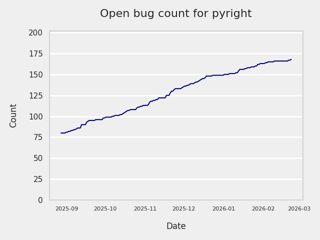
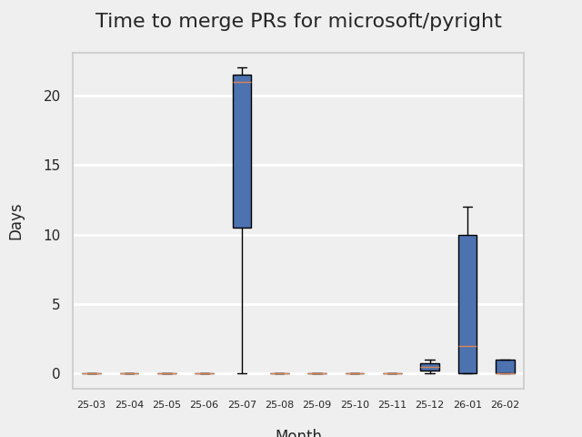
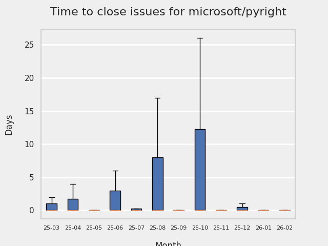
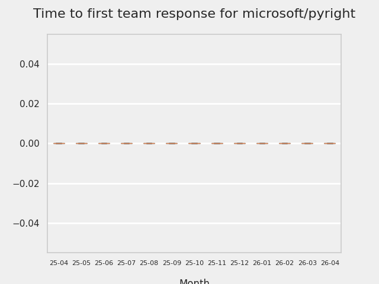
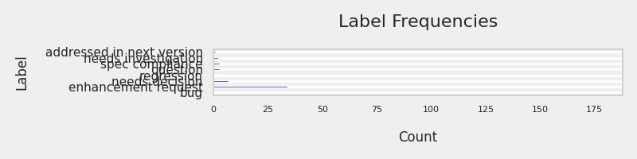
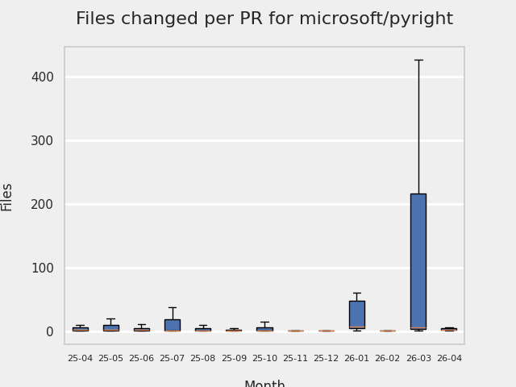
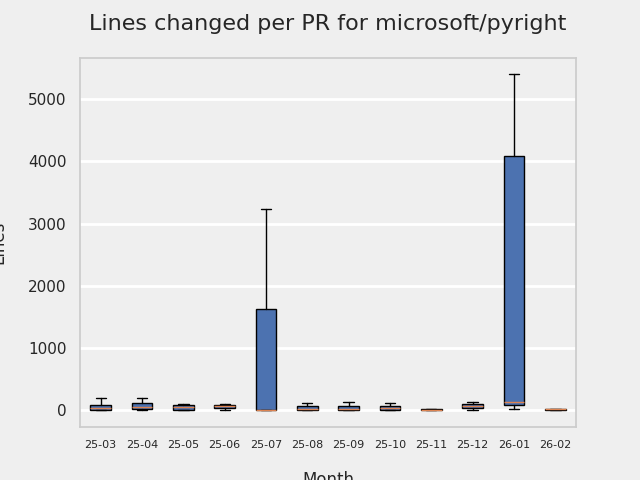
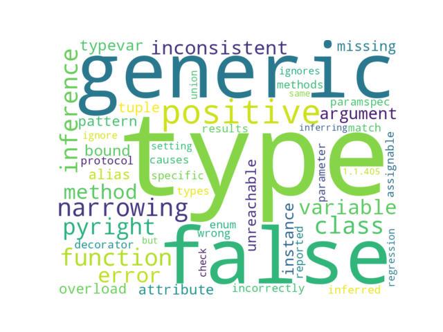

# GITHUB ISSUES REPORT FOR microsoft/pyright

Generated on 2026-02-04 using: stale=30, all=True

* marks items that are new to report in past 7 day(s)

## FOR ISSUES THAT ARE MARKED AS BUGS:

### Issues in pyright that need a response from team:

| Days Ago | Issue | Title |
| --- | --- | --- |
 | \* OP:0  |[11270](https://github.com/microsoft/pyright/issues/11270 "Enum.value inferred as tuple[Literal[..]]")  |Enum.value inferred as tuple[Literal[..]] |
 | \* OP:3  |[11261](https://github.com/microsoft/pyright/issues/11261 "Setting `()` to `Union`, which means no type arguments doesn't get error")  |Setting `()` to `Union`, which means no type arguments doesn't get error |
 | \* OP:7  |[11255](https://github.com/microsoft/pyright/issues/11255 "reportAbstractUsage check ignores __new__ return type")  |reportAbstractUsage check ignores __new__ return type |
 | \* OP:7  |[11253](https://github.com/microsoft/pyright/issues/11253 "Running pyright with --threads will exit with success when it OOMs")  |Running pyright with --threads will exit with success when it OOMs |
 | \* OP:7  |[11252](https://github.com/microsoft/pyright/issues/11252 "OOM on numpy in dict with an update")  |OOM on numpy in dict with an update |
 |  OP:8  |[11249](https://github.com/microsoft/pyright/issues/11249 "Pyright incorrectly marks a match case as unreachable (regression in 1.1.408)") | Pyright incorrectly marks a match case as unreachable (regression in 1.1.408) |
 |  OP:10  |[11247](https://github.com/microsoft/pyright/issues/11247 "Surprising type analysis failure") | Surprising type analysis failure |
 |  OP:13  |[11243](https://github.com/microsoft/pyright/issues/11243 "sequence pattern on NamedTuple infers `tuple` type") | sequence pattern on NamedTuple infers `tuple` type |
 |  OP:18  |[11236](https://github.com/microsoft/pyright/issues/11236 "pyright ignores from __future__ import annotations when it comes to method definitions") | pyright ignores from __future__ import annotations when it comes to method definitions |
 |  OP:22  |[11228](https://github.com/microsoft/pyright/issues/11228 "Slow code analysis") | Slow code analysis |
 |  OP:22  |[11227](https://github.com/microsoft/pyright/issues/11227 "Generic nested classes cannot reference each other") | Generic nested classes cannot reference each other |
 |  OP:23  |[11226](https://github.com/microsoft/pyright/issues/11226 "Default value for dataclass field with bound TypeVar type") | Default value for dataclass field with bound TypeVar type |
 |  OP:25  |[11220](https://github.com/microsoft/pyright/issues/11220 "Instances of classes that define `__iter__ = None` and `__getitem__` should not be iterable.") | Instances of classes that define `__iter__ = None` and `__getitem__` should not be iterable. |
 |  OP:31  |[11200](https://github.com/microsoft/pyright/issues/11200 "`reportUninitializedInstanceVariable` false negatives/positives for the `__weakref__` slot") | `reportUninitializedInstanceVariable` false negatives/positives for the `__weakref__` slot |
 |  OP:34  |[11196](https://github.com/microsoft/pyright/issues/11196 "`--verifytypes` sometimes reports imported symbol as partially unknown, despite `--ignoreexternal`") | `--verifytypes` sometimes reports imported symbol as partially unknown, despite `--ignoreexternal` |
 |  OP:43  |[11187](https://github.com/microsoft/pyright/issues/11187 "Problem inferring nested generic classes with defaults") | Problem inferring nested generic classes with defaults |
 |  OP:45  |[11181](https://github.com/microsoft/pyright/issues/11181 "Everything is slow") | Everything is slow |
 |  OP:49  |[11179](https://github.com/microsoft/pyright/issues/11179 "Problem inferring type variables with a default in `Protocol`") | Problem inferring type variables with a default in `Protocol` |
 |  OP:49  |[11178](https://github.com/microsoft/pyright/issues/11178 "Incorrect inference of `Never` after empty loop, properties and use of `Generic`") | Incorrect inference of `Never` after empty loop, properties and use of `Generic` |
 |  OP:51  |[11173](https://github.com/microsoft/pyright/issues/11173 "Wrong signature of decorated method seen inside the decorated method") | Wrong signature of decorated method seen inside the decorated method |
 |  OP:53  |[11171](https://github.com/microsoft/pyright/issues/11171 "Static protocols' (`type[IFoo[T]]]`) type parameters (`T`) are unknown") | Static protocols' (`type[IFoo[T]]]`) type parameters (`T`) are unknown |
 |  OP:55  |[11167](https://github.com/microsoft/pyright/issues/11167 "Type forms not allowed in any order in TypedDict functional syntax") | Type forms not allowed in any order in TypedDict functional syntax |
 |  OP:56  |[11162](https://github.com/microsoft/pyright/issues/11162 "Adding a decorator to a dataclass breaks the signature") | Adding a decorator to a dataclass breaks the signature |
 |  OP:57  |[11158](https://github.com/microsoft/pyright/issues/11158 "Missing SyntaxError check for `async for` in lambda inside an async function") | Missing SyntaxError check for `async for` in lambda inside an async function |
 |  OP:61  |[11155](https://github.com/microsoft/pyright/issues/11155 "Incorrect diagnostic message for `isinstance(None, object)`") | Incorrect diagnostic message for `isinstance(None, object)` |
 |  OP:61  |[11154](https://github.com/microsoft/pyright/issues/11154 "Missing warning when using ClassVar without subscript") | Missing warning when using ClassVar without subscript |
 |  OP:66  |[11146](https://github.com/microsoft/pyright/issues/11146 "1.1.365 regression: tuples created from iterating over a tuple of literals looses literal type information") | 1.1.365 regression: tuples created from iterating over a tuple of literals looses literal type information |
 |  OP:66  |[11145](https://github.com/microsoft/pyright/issues/11145 "False positive `InconsistentOverload` with generic class of tuple argument") | False positive `InconsistentOverload` with generic class of tuple argument |
 |  OP:67  |[11144](https://github.com/microsoft/pyright/issues/11144 "Taking a slice of a class inherited from a tuple sometimes ignores the custom typing of the __getitem__ method") | Taking a slice of a class inherited from a tuple sometimes ignores the custom typing of the __getitem__ method |
 |  OP:73  |[11134](https://github.com/microsoft/pyright/issues/11134 "`TypedDict` not considered as matching `dict()` pattern in match") | `TypedDict` not considered as matching `dict()` pattern in match |
 |  OP:73  |[11133](https://github.com/microsoft/pyright/issues/11133 "Wrong (missing?) type inference on `{}` in match/case") | Wrong (missing?) type inference on `{}` in match/case |
 |  OP:73  |[11131](https://github.com/microsoft/pyright/issues/11131 "@runtime_checkable should require a direct inheritance from Protocol") | @runtime_checkable should require a direct inheritance from Protocol |
 |  OP:76  |[11128](https://github.com/microsoft/pyright/issues/11128 "No Liskov violation reported in a situation where a non-generic method overrides a generic method") | No Liskov violation reported in a situation where a non-generic method overrides a generic method |
 |  OP:76  |[11127](https://github.com/microsoft/pyright/issues/11127 "`tuple[int, int, *tuple[Any, ...]]` should be assignable to `tuple[int, ...]`") | `tuple[int, int, *tuple[Any, ...]]` should be assignable to `tuple[int, ...]` |
 |  OP:76  |[11126](https://github.com/microsoft/pyright/issues/11126 "False positive when extending both Enum and another class") | False positive when extending both Enum and another class |
 |  OP:77  |[11124](https://github.com/microsoft/pyright/issues/11124 "Pyright Will Use non Stubs Package Import if `py.typed` is Present") | Pyright Will Use non Stubs Package Import if `py.typed` is Present |
 |  OP:77  |[11123](https://github.com/microsoft/pyright/issues/11123 "`yield from` combines single-type iterators") | `yield from` combines single-type iterators |
 |  OP:79  |[11117](https://github.com/microsoft/pyright/issues/11117 "dataclass instance attribute type wrong for field with descriptor type and no default") | dataclass instance attribute type wrong for field with descriptor type and no default |
 |  OP:79  |[11116](https://github.com/microsoft/pyright/issues/11116 "&quot;key&quot; in typed_dict checks for non-closed TypedDict doesn't allow typed_dict[&quot;key&quot;] afterwards") | "key" in typed_dict checks for non-closed TypedDict doesn't allow typed_dict["key"] afterwards |
 |  OP:79  |[11115](https://github.com/microsoft/pyright/issues/11115 "Pyright 1.1.405 regression with sentinels") | Pyright 1.1.405 regression with sentinels |
 |  OP:85  |[11104](https://github.com/microsoft/pyright/issues/11104 "Re-Adding Workspaces to the Language Server should retrigger Diagnostic generation") | Re-Adding Workspaces to the Language Server should retrigger Diagnostic generation |
 |  OP:85  |[11103](https://github.com/microsoft/pyright/issues/11103 "Language Server hangs due to uninitialized workspaces") | Language Server hangs due to uninitialized workspaces |
 |  OP:90  |[11099](https://github.com/microsoft/pyright/issues/11099 "Sequence pattern sometimes matches strings") | Sequence pattern sometimes matches strings |
 |  OP:91  |[11095](https://github.com/microsoft/pyright/issues/11095 "Strange inference behavior when using replace on dataclasses in asynchronous functions") | Strange inference behavior when using replace on dataclasses in asynchronous functions |
 |  OP:93  |[11088](https://github.com/microsoft/pyright/issues/11088 "Valid match cases are reported as unreachable") | Valid match cases are reported as unreachable |
 |  OP:99  |[11067](https://github.com/microsoft/pyright/issues/11067 "exponential slowdown when using `yield from` with type alias") | exponential slowdown when using `yield from` with type alias |
 |  OP:107  |[11048](https://github.com/microsoft/pyright/issues/11048 "A bunch of overlapping protocols in `@overload`s causes Pyright's runtime to explode.") | A bunch of overlapping protocols in `@overload`s causes Pyright's runtime to explode. |
 |  OP:110  |[11042](https://github.com/microsoft/pyright/issues/11042 "False errors when using issubclass on argument of type type[T] where T is generic") | False errors when using issubclass on argument of type type[T] where T is generic |
 |  OP:110  |[11039](https://github.com/microsoft/pyright/issues/11039 "Incorrect type narrowing with subclassed descriptors") | Incorrect type narrowing with subclassed descriptors |
 |  OP:112  |[11035](https://github.com/microsoft/pyright/issues/11035 "Function return type depends on previous calls") | Function return type depends on previous calls |
 |  OP:113  |[11029](https://github.com/microsoft/pyright/issues/11029 "Subsequent `partial` functions in a list are not type-checked") | Subsequent `partial` functions in a list are not type-checked |
 |  OP:127  |[10976](https://github.com/microsoft/pyright/issues/10976 "Method-bound type-parameter can &quot;leak&quot; through a `Protocol`") | Method-bound type-parameter can "leak" through a `Protocol` |
 |  OP:140  |[10941](https://github.com/microsoft/pyright/issues/10941 "Type Annotation are not allowed for enum members when using nonmember") | Type Annotation are not allowed for enum members when using nonmember |
 |  OP:145  |[10927](https://github.com/microsoft/pyright/issues/10927 "False positive when callback protocol uses a function-scoped type variable") | False positive when callback protocol uses a function-scoped type variable |
 |  OP:145  |[10926](https://github.com/microsoft/pyright/issues/10926 "Unexpected assignability rules of generic TypedDicts") | Unexpected assignability rules of generic TypedDicts |
 |  OP:148  |[10911](https://github.com/microsoft/pyright/issues/10911 "Argument type to an `IntEnum` should be compatible with `int`") | Argument type to an `IntEnum` should be compatible with `int` |
 |  OP:149  |[10905](https://github.com/microsoft/pyright/issues/10905 "1.1.405 : Type of &quot;xxx&quot; could not be determined because it refers to itself") | 1.1.405 : Type of "xxx" could not be determined because it refers to itself |
 |  OP:152  |[10899](https://github.com/microsoft/pyright/issues/10899 "`divmod` still not working right") | `divmod` still not working right |
 |  OP:163  |[10845](https://github.com/microsoft/pyright/issues/10845 "Methods of a variadic generic class become uncallable when specified with TypeVarTuple and a suffix") | Methods of a variadic generic class become uncallable when specified with TypeVarTuple and a suffix |
 |  OP:167  |[10833](https://github.com/microsoft/pyright/issues/10833 "False positives with non-terminating generators") | False positives with non-terminating generators |
 |  OP:168  |[10826](https://github.com/microsoft/pyright/issues/10826 "Pyright incorrectly refers to `NewType` as an instance of `FunctionType` in diagnostic messages, does not allow attributes to be accessed") | Pyright incorrectly refers to `NewType` as an instance of `FunctionType` in diagnostic messages, does not allow attributes to be accessed |
 |  OP:169  |[10823](https://github.com/microsoft/pyright/issues/10823 "&quot;type[UnionType]&quot; is not assignable to &quot;type&quot;") | "type[UnionType]" is not assignable to "type" |
 |  OP:170  |[10817](https://github.com/microsoft/pyright/issues/10817 "JavaScript heap out of memory with AbstractEventLoop and call_soon_threadsafe") | JavaScript heap out of memory with AbstractEventLoop and call_soon_threadsafe |
 |  OP:171  |[10813](https://github.com/microsoft/pyright/issues/10813 "False positive when calling overloaded `*args` with union of tuples") | False positive when calling overloaded `*args` with union of tuples |
 |  OP:172  |[10808](https://github.com/microsoft/pyright/issues/10808 "Incorrect scope lookup in class bodies in 3.14") | Incorrect scope lookup in class bodies in 3.14 |
 |  OP:173  |[10800](https://github.com/microsoft/pyright/issues/10800 "Error: Function declaration &quot;x&quot; is obscured by a declaration of the same name when it should not.") | Error: Function declaration "x" is obscured by a declaration of the same name when it should not. |
 |  OP:173  |[10799](https://github.com/microsoft/pyright/issues/10799 "ParamSpec allowed to be used before import") | ParamSpec allowed to be used before import |
 |  OP:175  |[10793](https://github.com/microsoft/pyright/issues/10793 "TypeForm error when used in function with specific structure") | TypeForm error when used in function with specific structure |
 |  OP:189  |[10759](https://github.com/microsoft/pyright/issues/10759 "bug: Incorrect overload overlaps in sync, or missing overlap in async") | bug: Incorrect overload overlaps in sync, or missing overlap in async |
 |  OP:191  |[10754](https://github.com/microsoft/pyright/issues/10754 "Implicit override not flagged for decorated methods") | Implicit override not flagged for decorated methods |
 |  OP:196  |[10744](https://github.com/microsoft/pyright/issues/10744 "Sentinel instances only work as constants") | Sentinel instances only work as constants |
 |  OP:197  |[10733](https://github.com/microsoft/pyright/issues/10733 "False positive &quot;reportArgumentType&quot; if ParamSpec is inferred as generic argument") | False positive "reportArgumentType" if ParamSpec is inferred as generic argument |
 |  OP:201  |[10725](https://github.com/microsoft/pyright/issues/10725 "bug: bidirectional inference when using typeguard") | bug: bidirectional inference when using typeguard |
 |  OP:202  |[10719](https://github.com/microsoft/pyright/issues/10719 "Inconsistent choice of `Union` variant when multiple choices are valid") | Inconsistent choice of `Union` variant when multiple choices are valid |
 |  OP:203  |[10714](https://github.com/microsoft/pyright/issues/10714 "Different narrowing with `isinstance` vs match-case against Callback-Protocol") | Different narrowing with `isinstance` vs match-case against Callback-Protocol |
 |  OP:203  |[10713](https://github.com/microsoft/pyright/issues/10713 "`list[str]` is assignable to `list[int | Any]`, but shouldn't be") | `list[str]` is assignable to `list[int | Any]`, but shouldn't be |
 |  OP:210  |[10689](https://github.com/microsoft/pyright/issues/10689 "sequence or mapping pattern on generic variables makes case unreachable") | sequence or mapping pattern on generic variables makes case unreachable |
 |  OP:214  |[10678](https://github.com/microsoft/pyright/issues/10678 "Incorrect reachability analysis involving NewType") | Incorrect reachability analysis involving NewType |
 |  OP:217  |[10668](https://github.com/microsoft/pyright/issues/10668 "New-types seem to have an under-specified callable signature of `(...) -> Any` on 1.1.402") | New-types seem to have an under-specified callable signature of `(...) -> Any` on 1.1.402 |
 |  OP:219  |[10660](https://github.com/microsoft/pyright/issues/10660 "Propagating ParamSpec through wrappers differ by class & function") | Propagating ParamSpec through wrappers differ by class & function |
 |  OP:219  |[10657](https://github.com/microsoft/pyright/issues/10657 "false positive on map with a conditional expression") | false positive on map with a conditional expression |
 |  OP:224  |[10646](https://github.com/microsoft/pyright/issues/10646 "false positive incompatible-override error when expanding `bool` args over different overloads") | false positive incompatible-override error when expanding `bool` args over different overloads |
 |  OP:227  |[10637](https://github.com/microsoft/pyright/issues/10637 "Unpacking a tuple containing an unpacked TypeVarTuple results in an illegal list type inference") | Unpacking a tuple containing an unpacked TypeVarTuple results in an illegal list type inference |
 |  OP:227  |[10636](https://github.com/microsoft/pyright/issues/10636 "Generic method argument with Self type causes incomplete signature") | Generic method argument with Self type causes incomplete signature |
 |  OP:229  |[10631](https://github.com/microsoft/pyright/issues/10631 "Passing a generic type via a parameter of type `type[T]` can leak an unsolved type variable") | Passing a generic type via a parameter of type `type[T]` can leak an unsolved type variable |
 |  OP:229  |[10626](https://github.com/microsoft/pyright/issues/10626 "dataclass_transform as decorator for class decorator blocks type checking") | dataclass_transform as decorator for class decorator blocks type checking |
 |  OP:229  |[10625](https://github.com/microsoft/pyright/issues/10625 "`Any | Never` evaluates to `Never` instead of `Any`") | `Any | Never` evaluates to `Never` instead of `Any` |
 |  OP:230  |[10624](https://github.com/microsoft/pyright/issues/10624 "Pyright hangs forever on a namedtuple with classmethod constructor") | Pyright hangs forever on a namedtuple with classmethod constructor |
 |  OP:231  |[10622](https://github.com/microsoft/pyright/issues/10622 "Incorrect narrowing applied for `x is type(<final type instance>)` construct") | Incorrect narrowing applied for `x is type(<final type instance>)` construct |
 |  OP:232  |[10618](https://github.com/microsoft/pyright/issues/10618 "Truthy type-narrowing of None bound or constraint TypeVar not happening") | Truthy type-narrowing of None bound or constraint TypeVar not happening |
 |  OP:235  |[10607](https://github.com/microsoft/pyright/issues/10607 "Order dependent inference results with some protocols against numpy") | Order dependent inference results with some protocols against numpy |
 |  OP:236  |[10603](https://github.com/microsoft/pyright/issues/10603 "Failing to narrow Any to None") | Failing to narrow Any to None |
 |  OP:239  |[10592](https://github.com/microsoft/pyright/issues/10592 "`--createstub` can drop directories if a source file is named the same as its parent directory.") | `--createstub` can drop directories if a source file is named the same as its parent directory. |
 |  OP:241  |[10560](https://github.com/microsoft/pyright/issues/10560 "`list(filter(None, map(func, ...)))` is typed as `list[Unknown]` if `func`'s return type doesn't include `None`") | `list(filter(None, map(func, ...)))` is typed as `list[Unknown]` if `func`'s return type doesn't include `None` |
 |  OP:253  |[10509](https://github.com/microsoft/pyright/issues/10509 "TypeIs Does Not Properly Narrow Generics") | TypeIs Does Not Properly Narrow Generics |
 |  OP:258  |[10491](https://github.com/microsoft/pyright/issues/10491 "&quot;could not be determined because it refers to itself&quot; error occurs depending on variable name and string literal value") | "could not be determined because it refers to itself" error occurs depending on variable name and string literal value |
 |  OP:261  |[10469](https://github.com/microsoft/pyright/issues/10469 "Slow Typechecking 50-element homogeneous tuple") | Slow Typechecking 50-element homogeneous tuple |
 |  OP:262  |[10466](https://github.com/microsoft/pyright/issues/10466 "Type &quot;Shape[int]&quot; is not assignable to declared type &quot;Shape[int]&quot;") | Type "Shape[int]" is not assignable to declared type "Shape[int]" |
 |  OP:263  |[10457](https://github.com/microsoft/pyright/issues/10457 "&quot;possibly unbound&quot; error when redefining builtin in try-except") | "possibly unbound" error when redefining builtin in try-except |
 |  OP:273  |[10420](https://github.com/microsoft/pyright/issues/10420 "Regression: crtp type bounds lost") | Regression: crtp type bounds lost |
 |  OP:287  |[10364](https://github.com/microsoft/pyright/issues/10364 "Pyright hangs when a generic type alias definition refers to itself via typevar bound") | Pyright hangs when a generic type alias definition refers to itself via typevar bound |
 |  OP:302  |[10271](https://github.com/microsoft/pyright/issues/10271 "Type inference bug with self-application of a generic function containing `ParamSpec`") | Type inference bug with self-application of a generic function containing `ParamSpec` |
 |  OP:310  |[10231](https://github.com/microsoft/pyright/issues/10231 "Pyright fails to fully infer the type of a curried function when applied to a generic function") | Pyright fails to fully infer the type of a curried function when applied to a generic function |
 |  OP:315  |[10174](https://github.com/microsoft/pyright/issues/10174 "&quot;Type is partially unknown&quot; under very specific circumstances") | "Type is partially unknown" under very specific circumstances |

### Issues in pyright that have comments from OP after last team response:

| Days Ago | Issue | Title |
| --- | --- | --- |
 | \* TM:8, OP:7  |[11176](https://github.com/microsoft/pyright/issues/11176 "Useless lines affect type checking")  |Useless lines affect type checking |
 |  TM:54, OP:54  |[11169](https://github.com/microsoft/pyright/issues/11169 "Enum type not assignable to complete union of its literal members") | Enum type not assignable to complete union of its literal members |
 |  TM:94, OP:23  |[11076](https://github.com/microsoft/pyright/issues/11076 "Process never finishes in `1.1.405`, `1.1.406`, `1.1.407`, `1.1.408`") | Process never finishes in `1.1.405`, `1.1.406`, `1.1.407`, `1.1.408` |
 |  TM:102, OP:102  |[11063](https://github.com/microsoft/pyright/issues/11063 "False positive: `TypeVar`s in functional-style`TypedDicts` are allowed but unsupported") | False positive: `TypeVar`s in functional-style`TypedDicts` are allowed but unsupported |
 |  TM:112, OP:112  |[11031](https://github.com/microsoft/pyright/issues/11031 "Completion giving incorrect options when editing multiline function invocation") | Completion giving incorrect options when editing multiline function invocation |
 |  TM:122, OP:122  |[10993](https://github.com/microsoft/pyright/issues/10993 "Type arithmetic inconsistency") | Type arithmetic inconsistency |
 |  TM:129, OP:129  |[10973](https://github.com/microsoft/pyright/issues/10973 "Numerous FPs when `Literal['abc']` and var named `abc` coexist (but only if `enableExperimentalFeatures=true`)") | Numerous FPs when `Literal['abc']` and var named `abc` coexist (but only if `enableExperimentalFeatures=true`) |
 |  TM:141, OP:141  |[10934](https://github.com/microsoft/pyright/issues/10934 "Wrong type interference for inheritance with statements") | Wrong type interference for inheritance with statements |
 |  TM:146, OP:146  |[10923](https://github.com/microsoft/pyright/issues/10923 "Strange regression in lamda parameter type inference in 1.1.405") | Strange regression in lamda parameter type inference in 1.1.405 |
 |  TM:203, OP:100  |[10702](https://github.com/microsoft/pyright/issues/10702 "Function having return type as type variable with `Callable` bound does not allow `Callable[..., Any]` to be returned") | Function having return type as type variable with `Callable` bound does not allow `Callable[..., Any]` to be returned |
 |  TM:215, OP:212  |[10676](https://github.com/microsoft/pyright/issues/10676 "The undefined variable goes unnoticed") | The undefined variable goes unnoticed |
 |  TM:222, OP:222  |[10656](https://github.com/microsoft/pyright/issues/10656 "Generic ParamSpec on class produces `reportCallIssue` error after conditional check `len(args) == x` or `len(args) != x`") | Generic ParamSpec on class produces `reportCallIssue` error after conditional check `len(args) == x` or `len(args) != x` |
 |  TM:224, OP:224  |[10649](https://github.com/microsoft/pyright/issues/10649 "`reportInvalidTypeVarUse` superfluous when using default values?") | `reportInvalidTypeVarUse` superfluous when using default values? |
 |  TM:239, OP:239  |[10580](https://github.com/microsoft/pyright/issues/10580 "`reportUnknownVariableType` sometimes not reported") | `reportUnknownVariableType` sometimes not reported |
 |  TM:309, OP:309  |[10237](https://github.com/microsoft/pyright/issues/10237 "False negative for callable assignability") | False negative for callable assignability |
 |  TM:314, OP:280  |[10187](https://github.com/microsoft/pyright/issues/10187 "Pyright hangs when a unification variable occurs inside itself") | Pyright hangs when a unification variable occurs inside itself |

### Issues in pyright that have comments from 3rd party after last team response:

| Days Ago | Issue | Title |
| --- | --- | --- |
 |  P:22,  |[11225](https://github.com/microsoft/pyright/issues/11225 "Whether strict mode or not, setting an empty tuple to the generic type alias type argument of `ParamSpec` base gets no error") | Whether strict mode or not, setting an empty tuple to the generic type alias type argument of `ParamSpec` base gets no error |
 |  P:121,  |[10936](https://github.com/microsoft/pyright/issues/10936 "False Unreachable Code Detection on Startup - Gets Fixed by LSP Restart") | False Unreachable Code Detection on Startup - Gets Fixed by LSP Restart |
 | \* P:2,  |[10881](https://github.com/microsoft/pyright/issues/10881 "Consuming large amount of heap memory")  |Consuming large amount of heap memory |
 |  P:177,  |[10778](https://github.com/microsoft/pyright/issues/10778 "Referring to a different instantiation whilst defining a generic class") | Referring to a different instantiation whilst defining a generic class |
 |  P:206,  |[10703](https://github.com/microsoft/pyright/issues/10703 "Incorrectly inferring generic function parameter type") | Incorrectly inferring generic function parameter type |
 |  P:209,  |[10690](https://github.com/microsoft/pyright/issues/10690 "pyright 1.1.403 started reporting &quot;is not a known attribute of module&quot;") | pyright 1.1.403 started reporting "is not a known attribute of module" |
 |  P:151,  |[10671](https://github.com/microsoft/pyright/issues/10671 "workspaceEdit missing changeAnnotations") | workspaceEdit missing changeAnnotations |
 |  P:282,  |[10329](https://github.com/microsoft/pyright/issues/10329 "False positive unreachable with unrelated types in match-case statement") | False positive unreachable with unrelated types in match-case statement |

### Issues in pyright that have no external responses since team response in 30+ days:

| Days Ago | Issue | Title |
| --- | --- | --- |
 |  TM:63  |[11150](https://github.com/microsoft/pyright/issues/11150 "TypedDict w/ extra items accepts `str` key but not `LiteralString`") | TypedDict w/ extra items accepts `str` key but not `LiteralString` |
 |  TM:88  |[11100](https://github.com/microsoft/pyright/issues/11100 "Enum member alias is wrongly considered a canonical member of the enum") | Enum member alias is wrongly considered a canonical member of the enum |
 |  TM:92  |[11089](https://github.com/microsoft/pyright/issues/11089 "reportOptionalMemberAccess after raise ValueError") | reportOptionalMemberAccess after raise ValueError |
 |  TM:102  |[11061](https://github.com/microsoft/pyright/issues/11061 "`--createstub` creates incorrect stub for async generator functions") | `--createstub` creates incorrect stub for async generator functions |
 |  TM:103  |[11058](https://github.com/microsoft/pyright/issues/11058 "Classes with `__slots__` require that their subclasses have the same amount of slots") | Classes with `__slots__` require that their subclasses have the same amount of slots |
 |  TM:117  |[11023](https://github.com/microsoft/pyright/issues/11023 "Erroneous &quot;undefined variable&quot; after specific method call") | Erroneous "undefined variable" after specific method call |
 |  TM:119  |[11008](https://github.com/microsoft/pyright/issues/11008 "Slowdown when enabling enableExperimentalFeatures on string-heavy files") | Slowdown when enabling enableExperimentalFeatures on string-heavy files |
 |  TM:128  |[10974](https://github.com/microsoft/pyright/issues/10974 "Unpacking a NamedTuple leads to unusual results") | Unpacking a NamedTuple leads to unusual results |
 |  TM:134  |[10951](https://github.com/microsoft/pyright/issues/10951 "Inconsistent narrowing into nested function when using TypeIs guard stored in a local variable") | Inconsistent narrowing into nested function when using TypeIs guard stored in a local variable |
 |  TM:141  |[10932](https://github.com/microsoft/pyright/issues/10932 "Constrained TypeVar narrowing does not work with Callable") | Constrained TypeVar narrowing does not work with Callable |
 |  TM:141  |[10931](https://github.com/microsoft/pyright/issues/10931 "Adding a for loop breaks narrowing of a constrained TypeVar") | Adding a for loop breaks narrowing of a constrained TypeVar |
 |  TM:146  |[10924](https://github.com/microsoft/pyright/issues/10924 "Inconsistent overload resolution on `Generic` methods") | Inconsistent overload resolution on `Generic` methods |
 |  TM:153  |[10889](https://github.com/microsoft/pyright/issues/10889 "Request textDocument/completion failed on custom code") | Request textDocument/completion failed on custom code |
 |  TM:180  |[10776](https://github.com/microsoft/pyright/issues/10776 "incorrectly `reportUnknownParameterType` with double type alias") | incorrectly `reportUnknownParameterType` with double type alias |
 |  TM:198  |[10728](https://github.com/microsoft/pyright/issues/10728 "Type resolution fails for class attributes with Callable[[], None] annotation") | Type resolution fails for class attributes with Callable[[], None] annotation |
 |  TM:210  |[10688](https://github.com/microsoft/pyright/issues/10688 "Unexpected `Unknown` type arguments when using class factory which has access to bound and defaults") | Unexpected `Unknown` type arguments when using class factory which has access to bound and defaults |
 |  TM:217  |[10667](https://github.com/microsoft/pyright/issues/10667 "When a data-class with `order=True` is being subclassed, the comparator methods get re-synthesized, and therefore have argument types narrowed") | When a data-class with `order=True` is being subclassed, the comparator methods get re-synthesized, and therefore have argument types narrowed |
 |  TM:224  |[10645](https://github.com/microsoft/pyright/issues/10645 "implicit override not reported for overloaded methods without implementation") | implicit override not reported for overloaded methods without implementation |
 |  TM:224  |[10643](https://github.com/microsoft/pyright/issues/10643 "False positive incompatible override with *args + keyword-only param") | False positive incompatible override with *args + keyword-only param |
 |  TM:228  |[10632](https://github.com/microsoft/pyright/issues/10632 "Shadowing names in cases of a match with non-trivial scrutinee") | Shadowing names in cases of a match with non-trivial scrutinee |
 |  TM:236  |[10605](https://github.com/microsoft/pyright/issues/10605 "`isinstance` detects module as a type") | `isinstance` detects module as a type |
 |  TM:247  |[10528](https://github.com/microsoft/pyright/issues/10528 "reassigning instance attribute causes it to become unbound") | reassigning instance attribute causes it to become unbound |
 |  TM:231  |[10516](https://github.com/microsoft/pyright/issues/10516 "TypeForm + TypeVar type inference") | TypeForm + TypeVar type inference |
 |  TM:295  |[10311](https://github.com/microsoft/pyright/issues/10311 "False positive of `reportUnnecessaryComparison` for loop variables") | False positive of `reportUnnecessaryComparison` for loop variables |
 |  TM:302  |[10270](https://github.com/microsoft/pyright/issues/10270 "Incorrect type inference after type narrowing using isinstance with protocols") | Incorrect type inference after type narrowing using isinstance with protocols |
 |  TM:309  |[10235](https://github.com/microsoft/pyright/issues/10235 "False positive unreachable when pattern matching `int` with `http.HTTPStatus`") | False positive unreachable when pattern matching `int` with `http.HTTPStatus` |

---

## FOR ISSUES THAT ARE NOT MARKED AS BUGS:

### Issues in pyright that need a response from team:

| Days Ago | Issue | Title |
| --- | --- | --- |
 | \* OP:0  |[11271](https://github.com/microsoft/pyright/issues/11271 "Bug when assign function with annotation to class attribute")  |Bug when assign function with annotation to class attribute |
 | \* OP:5  |[11257](https://github.com/microsoft/pyright/issues/11257 "Add `namespaceOverridePaths` configOption for fragmented package support")  |Add `namespaceOverridePaths` configOption for fragmented package support |
 |  OP:8  |[11251](https://github.com/microsoft/pyright/issues/11251 "Warn on wrong Concatenate usage") | Warn on wrong Concatenate usage |
 |  OP:11  |[11245](https://github.com/microsoft/pyright/issues/11245 "Support usage of slack variables (lower bound emulation)") | Support usage of slack variables (lower bound emulation) |
 |  OP:45  |[11182](https://github.com/microsoft/pyright/issues/11182 "Ignore unknown key `&quot;$schema&quot;` in schema validation") | Ignore unknown key `"$schema"` in schema validation |
 |  OP:117  |[11021](https://github.com/microsoft/pyright/issues/11021 "allow non-descriptor subtypes") | allow non-descriptor subtypes |
 |  OP:126  |[10981](https://github.com/microsoft/pyright/issues/10981 "Detect non-empty loops") | Detect non-empty loops |
 |  OP:127  |[10977](https://github.com/microsoft/pyright/issues/10977 "Improvement to type controls: apply across statement rather than line") | Improvement to type controls: apply across statement rather than line |
 |  OP:146  |[10921](https://github.com/microsoft/pyright/issues/10921 "Ignore a missing module globally for reportMissingModuleSource") | Ignore a missing module globally for reportMissingModuleSource |
 |  OP:155  |[10880](https://github.com/microsoft/pyright/issues/10880 "Better UX for suppressing reportAttributeAccessIssue and similar static analysis warnings") | Better UX for suppressing reportAttributeAccessIssue and similar static analysis warnings |
 |  OP:161  |[10853](https://github.com/microsoft/pyright/issues/10853 "Improve match subject narrowing") | Improve match subject narrowing |
 |  OP:161  |[10852](https://github.com/microsoft/pyright/issues/10852 "Use match case guard to narrow else cases") | Use match case guard to narrow else cases |
 |  OP:182  |[10770](https://github.com/microsoft/pyright/issues/10770 "Expand `reportUninitializedInstanceVariable` to protocol variable implementation detection") | Expand `reportUninitializedInstanceVariable` to protocol variable implementation detection |
 |  OP:191  |[10753](https://github.com/microsoft/pyright/issues/10753 "`reveal_type` should descend into anonymous types (such as inline `TypeDict`s), not show placeholder") | `reveal_type` should descend into anonymous types (such as inline `TypeDict`s), not show placeholder |
 |  OP:191  |[10752](https://github.com/microsoft/pyright/issues/10752 "Add support for Android and iOS") | Add support for Android and iOS |
 |  OP:240  |[10566](https://github.com/microsoft/pyright/issues/10566 "Allow Ignoring Specific Libraries for Strict Type Checking in Pyright") | Allow Ignoring Specific Libraries for Strict Type Checking in Pyright |

### Issues in pyright that have comments from OP after last team response:

| Days Ago | Issue | Title |
| --- | --- | --- |
 |  TM:64, OP:62  |[11149](https://github.com/microsoft/pyright/issues/11149 "Re-exported submodule results in &quot;Import could not be resolved from source&quot;") | Re-exported submodule results in "Import could not be resolved from source" |
 |  TM:110, OP:37  |[11041](https://github.com/microsoft/pyright/issues/11041 "Avoid triggering reportUnreachable on exception raising?") | Avoid triggering reportUnreachable on exception raising? |
 |  TM:148, OP:148  |[10916](https://github.com/microsoft/pyright/issues/10916 "No narrowing after `isinstance(obj, tuple)`  if  `tuple` contains a term.") | No narrowing after `isinstance(obj, tuple)`  if  `tuple` contains a term. |

### Issues in pyright that have comments from 3rd party after last team response:

| Days Ago | Issue | Title |
| --- | --- | --- |
 |  P:70,  |[11130](https://github.com/microsoft/pyright/issues/11130 "`override` decorator doesn't report problems when paired with `cached_property` decorator") | `override` decorator doesn't report problems when paired with `cached_property` decorator |
 |  P:118,  |[11007](https://github.com/microsoft/pyright/issues/11007 "type[] can be used in a contravariant manner, which is unsound") | type[] can be used in a contravariant manner, which is unsound |

### Issues in pyright that have no external responses since team response in 30+ days:

| Days Ago | Issue | Title |
| --- | --- | --- |
 |  TM:112  |[11036](https://github.com/microsoft/pyright/issues/11036 "Keyword-only first argument in instance method not reported") | Keyword-only first argument in instance method not reported |
 |  TM:126  |[10986](https://github.com/microsoft/pyright/issues/10986 "Magic calls to deprecated __getitem__ not flagged as deprecated") | Magic calls to deprecated __getitem__ not flagged as deprecated |
 |  TM:163  |[10795](https://github.com/microsoft/pyright/issues/10795 "Extend exclude config option") | Extend exclude config option |

## PULL REQUEST ACTIVITY

### Pull Requests opened in the past 7 day(s):

| | PR | Created By | Created | Days Open | Closed/Merged | Closed/Merged By | Title |
| --- | --- | --- | --- | --- | --- | --- | --- |
| \* | [#11269](https://github.com/microsoft/pyright/pull/11269) | dependabot | 2026-02-03 | 1 | - | - | Bump @isaacs/brace-expansion from 5.0.0 to 5.0.1 in /packages/vscode-pyright |
| \* | [#11267](https://github.com/microsoft/pyright/pull/11267) | Zaczero | 2026-02-02 | 1 | 2026-02-03 | rchiodo | Avoid cloneStr for small strings and intern tokenizer identifiers |
| \* | [#11267](https://github.com/microsoft/pyright/pull/11267) | Zaczero | 2026-02-02 | 1 | 2026-02-03 | rchiodo | Avoid cloneStr for small strings and intern tokenizer identifiers |
| \* | [#11266](https://github.com/microsoft/pyright/pull/11266) | Zaczero | 2026-02-02 | 0 | 2026-02-02 | - | Avoid double fileContents hashing and fix lastFileContentHash=0 bug |
| \* | [#11265](https://github.com/microsoft/pyright/pull/11265) | Zaczero | 2026-02-02 | 2 | - | - | Optimize TextRangeCollection.getItemContaining |
| \* | [#11264](https://github.com/microsoft/pyright/pull/11264) | Zaczero | 2026-02-02 | 0 | 2026-02-02 | - | Microoptimize time measurements |
| \* | [#11263](https://github.com/microsoft/pyright/pull/11263) | Zaczero | 2026-02-02 | 0 | 2026-02-02 | rchiodo | Optimize findClosestMatch complexity |
| \* | [#11263](https://github.com/microsoft/pyright/pull/11263) | Zaczero | 2026-02-02 | 0 | 2026-02-02 | rchiodo | Optimize findClosestMatch complexity |
| \* | [#11262](https://github.com/microsoft/pyright/pull/11262) | Zaczero | 2026-02-02 | 0 | 2026-02-02 | - | Microoptimize memoization without args |
| \* | [#11260](https://github.com/microsoft/pyright/pull/11260) | jdave-zip | 2026-01-31 | 0 | 2026-01-31 | - | Add pyrighht caching |
| \* | [#11256](https://github.com/microsoft/pyright/pull/11256) | q4rk | 2026-01-30 | 5 | - | - | Implement `namespaceOverridePaths` for Fragmented Package Support |

### Pull Requests merged in the past 7 day(s):

| | PR | Created By | Created | Days Open | Closed/Merged | Closed/Merged By | Title |
| --- | --- | --- | --- | --- | --- | --- | --- |
| \* | [#11267](https://github.com/microsoft/pyright/pull/11267) | Zaczero | 2026-02-02 | 1 | 2026-02-03 | rchiodo | Avoid cloneStr for small strings and intern tokenizer identifiers |
| \* | [#11267](https://github.com/microsoft/pyright/pull/11267) | Zaczero | 2026-02-02 | 1 | 2026-02-03 | rchiodo | Avoid cloneStr for small strings and intern tokenizer identifiers |
| \* | [#11263](https://github.com/microsoft/pyright/pull/11263) | Zaczero | 2026-02-02 | 0 | 2026-02-02 | rchiodo | Optimize findClosestMatch complexity |
| \* | [#11263](https://github.com/microsoft/pyright/pull/11263) | Zaczero | 2026-02-02 | 0 | 2026-02-02 | rchiodo | Optimize findClosestMatch complexity |
| \* | [#11237](https://github.com/microsoft/pyright/pull/11237) | pt-anthropic | 2026-01-17 | 12 | 2026-01-30 | rchiodo | Fix reportPrivateImportUsage errors disappearing |
| \* | [#11237](https://github.com/microsoft/pyright/pull/11237) | pt-anthropic | 2026-01-17 | 12 | 2026-01-30 | rchiodo | Fix reportPrivateImportUsage errors disappearing |

### Pull Requests closed (not merged) in the past 7 day(s):

| | PR | Created By | Created | Days Open | Closed/Merged | Closed/Merged By | Title |
| --- | --- | --- | --- | --- | --- | --- | --- |
| \* | [#11266](https://github.com/microsoft/pyright/pull/11266) | Zaczero | 2026-02-02 | 0 | 2026-02-02 | - | Avoid double fileContents hashing and fix lastFileContentHash=0 bug |
| \* | [#11264](https://github.com/microsoft/pyright/pull/11264) | Zaczero | 2026-02-02 | 0 | 2026-02-02 | - | Microoptimize time measurements |
| \* | [#11262](https://github.com/microsoft/pyright/pull/11262) | Zaczero | 2026-02-02 | 0 | 2026-02-02 | - | Microoptimize memoization without args |
| \* | [#11260](https://github.com/microsoft/pyright/pull/11260) | jdave-zip | 2026-01-31 | 0 | 2026-01-31 | - | Add pyrighht caching |

### Pull Requests still open that were opened more than 7 days ago:

| | PR | Created By | Created | Days Open | Closed/Merged | Closed/Merged By | Title |
| --- | --- | --- | --- | --- | --- | --- | --- |
| \* | [#10875](https://github.com/microsoft/pyright/pull/10875) | erictraut | 2025-08-31 | 156 | - | - | Fixed bug that resulted in incorrect simplification of `Any | Never`.… |
| \* | [#11221](https://github.com/microsoft/pyright/pull/11221) | timrid | 2026-01-10 | 25 | - | - | Add iOS and Android as `pythonPlatform` |
|   | [#11242](https://github.com/microsoft/pyright/pull/11242) | dependabot | 2026-01-21 | 14 | - | - | Bump lodash from 4.17.21 to 4.17.23 |

## RECENTLY CLOSED ISSUES

### Issues closed in the past 7 day(s):

| Days Ago | Issue | Title |
| --- | --- | --- |
 | \* TM:0  |[11259](https://github.com/microsoft/pyright/issues/11259 "pyright doesn't get error with `dict(*{'A': 10})` while PVM gets error")  |pyright doesn't get error with `dict(*{'A': 10})` while PVM gets error |
 | \* TM:0  |[11258](https://github.com/microsoft/pyright/issues/11258 "`reportIncompatibleVariableOverride` for additive overrides")  |`reportIncompatibleVariableOverride` for additive overrides |
 | \* TM:56  |[11151](https://github.com/microsoft/pyright/issues/11151 "`reversed()` is not allowed on `dict_items` / `dict_values` / `dict_keys`")  |`reversed()` is not allowed on `dict_items` / `dict_values` / `dict_keys` |

## MOST FREQUENTLY CHANGED FILES (by # of PRs):

 94: packages/pyright-internal/src/analyzer/typeEvaluator.ts

 23: packages/pyright-internal/src/analyzer/checker.ts

 19: packages/pyright-internal/src/localization/package.nls.en-us.json

 17: packages/pyright-internal/src/localization/package.nls.de.json

 17: packages/pyright-internal/src/localization/localize.ts

 17: packages/pyright-internal/src/analyzer/sourceFile.ts

 16: packages/pyright-internal/src/analyzer/program.ts

 16: packages/pyright-internal/src/localization/package.nls.cs.json

 16: packages/pyright-internal/src/localization/package.nls.es.json

 16: packages/pyright-internal/src/localization/package.nls.fr.json

 16: packages/pyright-internal/src/localization/package.nls.it.json

 16: packages/pyright-internal/src/localization/package.nls.ja.json

 16: packages/pyright-internal/src/localization/package.nls.ko.json

 16: packages/pyright-internal/src/localization/package.nls.pl.json

 16: packages/pyright-internal/src/localization/package.nls.pt-br.json

 16: packages/pyright-internal/src/localization/package.nls.ru.json

 16: packages/pyright-internal/src/localization/package.nls.tr.json

 16: packages/pyright-internal/src/localization/package.nls.zh-cn.json

 16: packages/pyright-internal/src/localization/package.nls.zh-tw.json

 15: packages/pyright-internal/src/analyzer/service.ts

 14: packages/pyright-internal/src/languageServerBase.ts

 14: packages/pyright-internal/src/parser/parser.ts

 13: packages/pyright-internal/src/analyzer/binder.ts

 13: packages/pyright-internal/src/localization/package.nls.qps-ploc.json

 12: packages/pyright-internal/src/analyzer/typeEvaluatorTypes.ts

 11: packages/vscode-pyright/package-lock.json

 11: packages/pyright-internal/src/tests/typeEvaluator5.test.ts

 11: packages/pyright-internal/src/tests/typeEvaluator1.test.ts

 11: build/azuredevops/azure-pipelines-release.yml

 10: packages/pyright-internal/src/parser/tokenizer.ts

 10: packages/pyright-internal/src/analyzer/types.ts

 10: packages/pyright-internal/src/tests/typeEvaluator6.test.ts

 10: packages/pyright-internal/src/analyzer/importResolver.ts

 10: packages/pyright-internal/src/analyzer/typeGuards.ts

  9: packages/pyright-internal/src/common/serviceProviderExtensions.ts

  9: packages/pyright-internal/src/analyzer/typeUtils.ts

  8: packages/pyright-internal/src/analyzer/parseTreeUtils.ts

  8: packages/vscode-pyright/package.json

  8: packages/pyright-internal/src/languageService/completionProvider.ts

  8: packages/pyright-internal/src/analyzer/operations.ts

  8: packages/pyright-internal/src/tests/typeEvaluator4.test.ts

  7: packages/pyright-internal/src/tests/checker.test.ts

  7: packages/pyright-internal/src/tests/typeEvaluator2.test.ts

  7: packages/pyright-internal/src/tests/typeEvaluator7.test.ts

  6: package-lock.json

  6: packages/pyright-internal/src/tests/typeEvaluator8.test.ts

  6: packages/pyright-internal/src/server.ts

  6: packages/pyright-internal/src/tests/samples/operator8.py

  5: packages/pyright-internal/src/tests/lsp/languageServerTestUtils.ts

  5: packages/pyright-internal/package-lock.json

  5: packages/pyright-internal/src/backgroundAnalysisBase.ts

  5: packages/pyright-internal/src/common/fullAccessHost.ts

  5: packages/pyright-internal/src/analyzer/typedDicts.ts

  5: packages/pyright-internal/src/languageService/referencesProvider.ts

