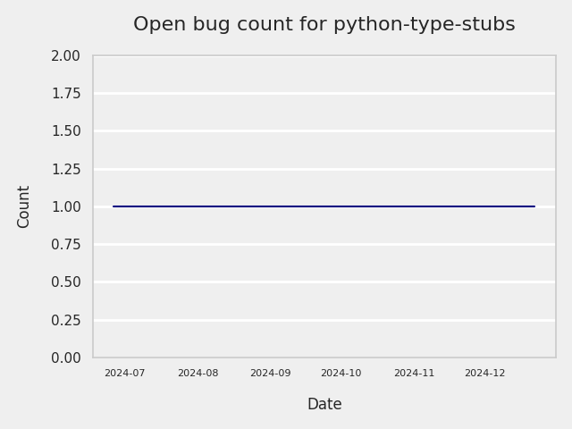
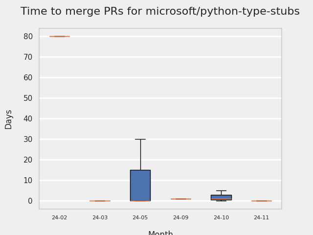
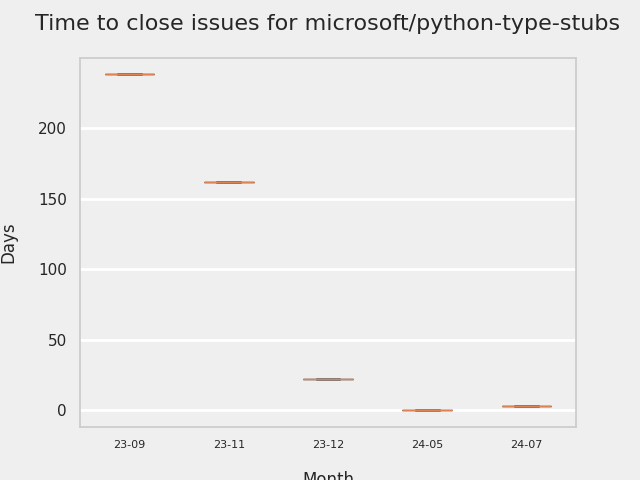
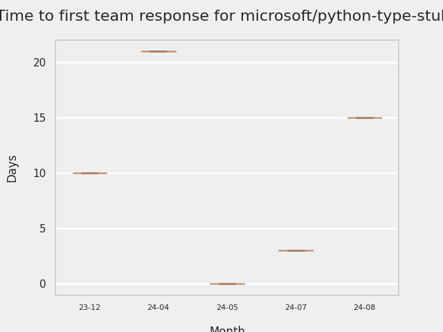
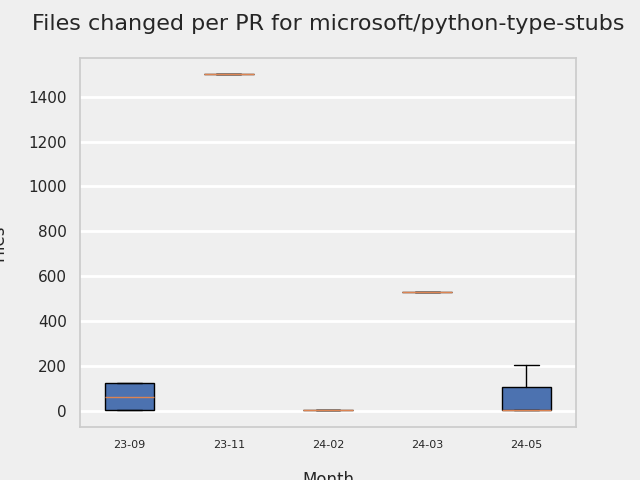
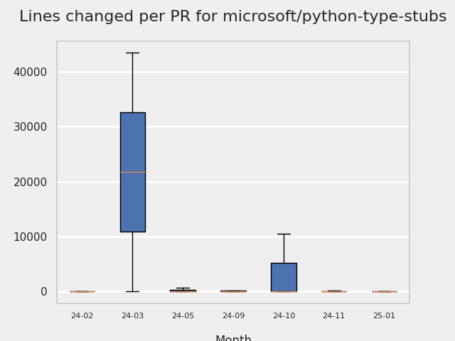
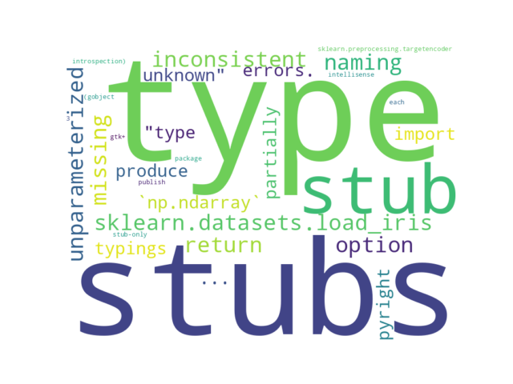

# GITHUB ISSUES REPORT FOR microsoft/python-type-stubs

Generated on 2024-10-21 using: stale=30, all=True

* marks items that are new to report in past 1 day(s)

## FOR ISSUES THAT ARE MARKED AS BUGS:

### Issues in python-type-stubs that have no external responses since team response in 30+ days:

| Days Ago | Issue | Title |
| --- | --- | --- |
 |  TM:166  |[309](https://github.com/microsoft/python-type-stubs/issues/309 "Unparameterized `np.ndarray` typings produce &quot;Type of ... is partially unknown&quot; Pyright type errors.") | Unparameterized `np.ndarray` typings produce "Type of ... is partially unknown" Pyright type errors. |

---

## FOR ISSUES THAT ARE NOT MARKED AS BUGS:

### Issues in python-type-stubs that need a response from team:

| Days Ago | Issue | Title |
| --- | --- | --- |
 | \* OP:0  |[318](https://github.com/microsoft/python-type-stubs/issues/318 "`sklearn.metrics.mean_squared_error` and `mean_squared_log_error` are not deprecated")  |`sklearn.metrics.mean_squared_error` and `mean_squared_log_error` are not deprecated |
 |  OP:255  |[304](https://github.com/microsoft/python-type-stubs/issues/304 "Cannot import sklearn.preprocessing.TargetEncoder") | Cannot import sklearn.preprocessing.TargetEncoder |

### Issues in python-type-stubs that have comments from 3rd party after last team response:

| Days Ago | Issue | Title |
| --- | --- | --- |
 |  P:524,  |[264](https://github.com/microsoft/python-type-stubs/issues/264 "Add how to install and use section to README") | Add how to install and use section to README |
 |  P:774,  |[211](https://github.com/microsoft/python-type-stubs/issues/211 "Publish each stubs as stub-only package") | Publish each stubs as stub-only package |
 |  P:441,  |[204](https://github.com/microsoft/python-type-stubs/issues/204 "Intellisense does work with GTK+ 3 (GObject Introspection)") | Intellisense does work with GTK+ 3 (GObject Introspection) |

### Issues in python-type-stubs that have no external responses since team response in 30+ days:

| Days Ago | Issue | Title |
| --- | --- | --- |
 |  TM:54  |[315](https://github.com/microsoft/python-type-stubs/issues/315 "Inconsistent naming of stubs") | Inconsistent naming of stubs |

