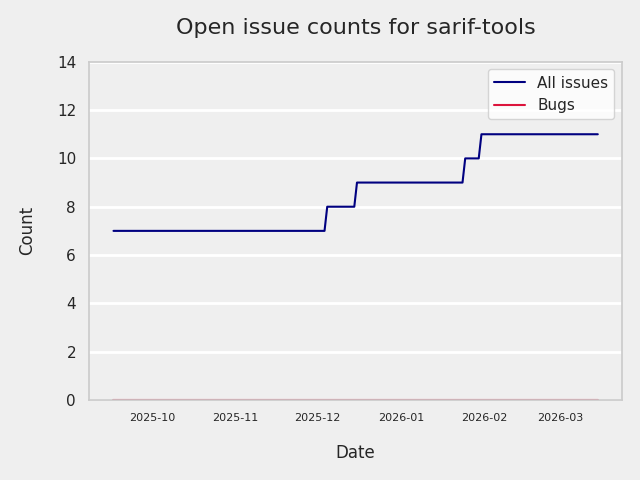
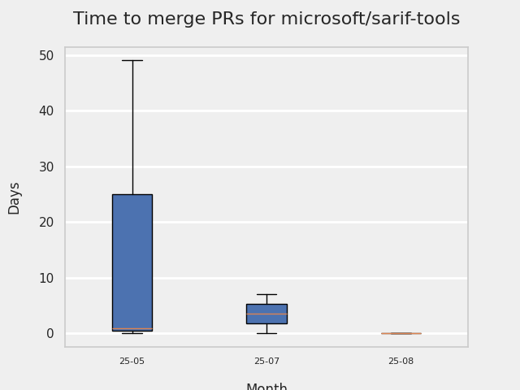
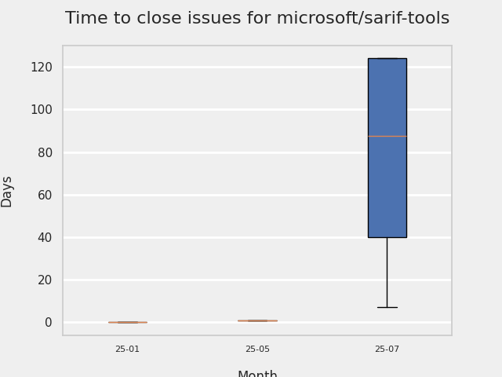
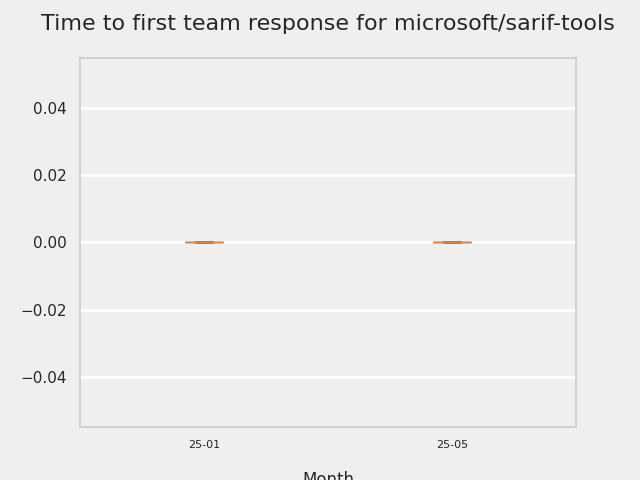
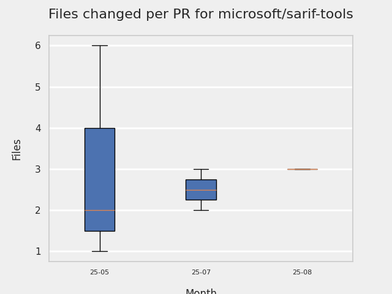
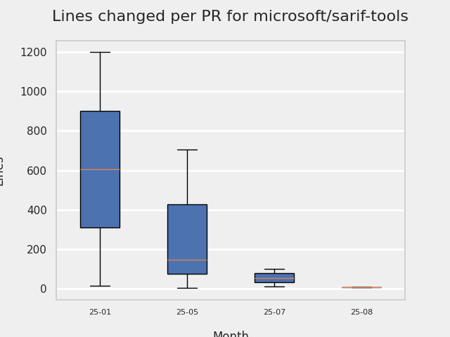
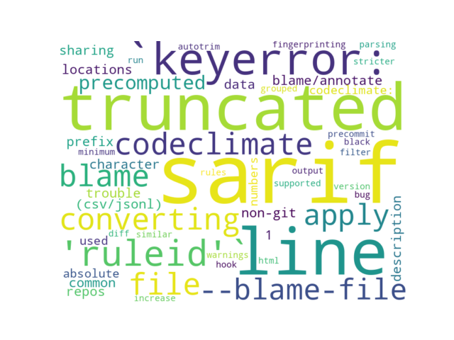

# GITHUB ISSUES REPORT FOR microsoft/sarif-tools

Generated on 2026-03-15 using: stale=30, all=True

* marks items that are new to report in past 7 day(s)

---

## FOR ISSUES THAT ARE NOT MARKED AS BUGS:

### Issues in sarif-tools that need a response from team:

| Days Ago | Issue | Title |
| --- | --- | --- |
 |  OP:44  |[112](https://github.com/microsoft/sarif-tools/issues/112 "`KeyError: 'ruleId'` when converting SARIF file to CodeClimate") | `KeyError: 'ruleId'` when converting SARIF file to CodeClimate |
 |  OP:50  |[111](https://github.com/microsoft/sarif-tools/issues/111 "Add sarif blame --blame-file to apply precomputed blame/annotate data (CSV/JSONL) for non-git repos") | Add sarif blame --blame-file to apply precomputed blame/annotate data (CSV/JSONL) for non-git repos |
 |  OP:90  |[110](https://github.com/microsoft/sarif-tools/issues/110 "Trouble With Locations Sharing A Common Prefix") | Trouble With Locations Sharing A Common Prefix |
 |  OP:101  |[109](https://github.com/microsoft/sarif-tools/issues/109 "Description truncated to only 1 character") | Description truncated to only 1 character |
 |  OP:196  |[104](https://github.com/microsoft/sarif-tools/issues/104 "codeclimate: Absolute line numbers SHOULD NOT be used for fingerprinting") | codeclimate: Absolute line numbers SHOULD NOT be used for fingerprinting |
 |  OP:312  |[87](https://github.com/microsoft/sarif-tools/issues/87 "Stricter filter rules parsing") | Stricter filter rules parsing |
 |  OP:373  |[86](https://github.com/microsoft/sarif-tools/issues/86 "When similar warnings are grouped they shouldn't be truncated in the output") | When similar warnings are grouped they shouldn't be truncated in the output |
 |  OP:388  |[85](https://github.com/microsoft/sarif-tools/issues/85 "HTML autotrim bug") | HTML autotrim bug |
 |  OP:412  |[84](https://github.com/microsoft/sarif-tools/issues/84 "Diff with line change not recognized") | Diff with line change not recognized |

## PULL REQUEST ACTIVITY

### Pull Requests still open that were opened more than 7 days ago:

| | PR | Created By | Created | Days Open | Closed/Merged | Closed/Merged By | Title |
| --- | --- | --- | --- | --- | --- | --- | --- |
| \* | [#92](https://github.com/microsoft/sarif-tools/pull/92) | copilot-swe-agent | 2025-05-28 | 291 | - | - | Fix truncated warning descriptions in emacs output format |
| \* | [#93](https://github.com/microsoft/sarif-tools/pull/93) | copilot-swe-agent | 2025-05-28 | 291 | - | - | Fix HTML autotrim bug - respect directory boundaries when computing common prefix |
| \* | [#95](https://github.com/microsoft/sarif-tools/pull/95) | copilot-swe-agent | 2025-05-28 | 291 | - | - | Add pre-commit hook to run black |

## MOST FREQUENTLY CHANGED FILES (by # of PRs):

