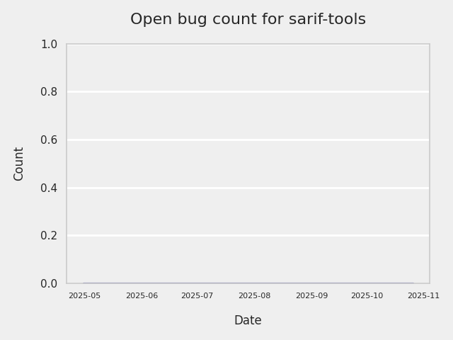
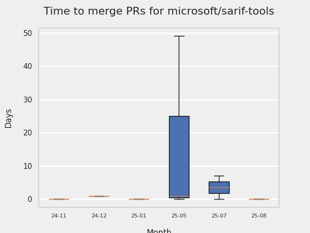
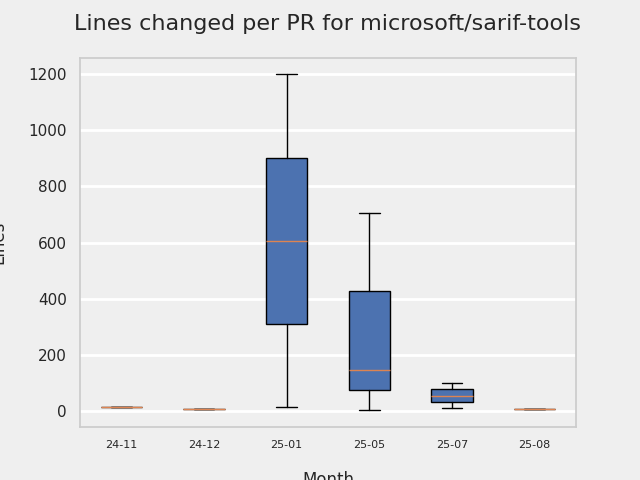

# GITHUB ISSUES REPORT FOR microsoft/sarif-tools

Generated on 2025-11-16 using: stale=30, all=True

* marks items that are new to report in past 1 day(s)

---

## FOR ISSUES THAT ARE NOT MARKED AS BUGS:

### Issues in sarif-tools that need a response from team:

| Days Ago | Issue | Title |
| --- | --- | --- |
 |  OP:77  |[104](https://github.com/microsoft/sarif-tools/issues/104 "codeclimate: Absolute line numbers SHOULD NOT be used for fingerprinting") | codeclimate: Absolute line numbers SHOULD NOT be used for fingerprinting |
 |  OP:109  |[102](https://github.com/microsoft/sarif-tools/issues/102 "Feature request: provide a way to produce a sarif file whose content does not include issues from a baseline") | Feature request: provide a way to produce a sarif file whose content does not include issues from a baseline |
 |  OP:110  |[101](https://github.com/microsoft/sarif-tools/issues/101 "Feature request: make heavier non-core dependencies optional-dependencies") | Feature request: make heavier non-core dependencies optional-dependencies |
 |  OP:193  |[87](https://github.com/microsoft/sarif-tools/issues/87 "Stricter filter rules parsing") | Stricter filter rules parsing |
 |  OP:254  |[86](https://github.com/microsoft/sarif-tools/issues/86 "When similar warnings are grouped they shouldn't be truncated in the output") | When similar warnings are grouped they shouldn't be truncated in the output |
 |  OP:269  |[85](https://github.com/microsoft/sarif-tools/issues/85 "HTML autotrim bug") | HTML autotrim bug |
 |  OP:293  |[84](https://github.com/microsoft/sarif-tools/issues/84 "Diff with line change not recognized") | Diff with line change not recognized |

### Issues in sarif-tools that have comments from OP after last team response:

| Days Ago | Issue | Title |
| --- | --- | --- |
 |  TM:383, OP:383  |[75](https://github.com/microsoft/sarif-tools/issues/75 "`diff` functionality") | `diff` functionality |

### Issues in sarif-tools that have no external responses since team response in 30+ days:

| Days Ago | Issue | Title |
| --- | --- | --- |
 |  TM:323  |[79](https://github.com/microsoft/sarif-tools/issues/79 "RFE: generate a patch from replacement objects") | RFE: generate a patch from replacement objects |

## MOST FREQUENTLY CHANGED FILES (by # of PRs):

