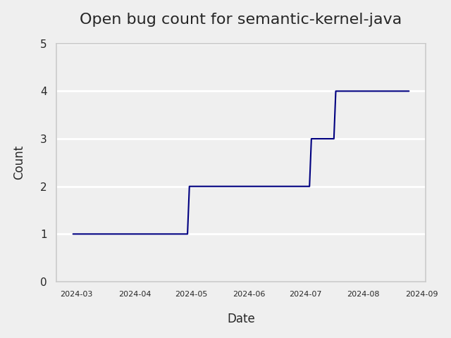
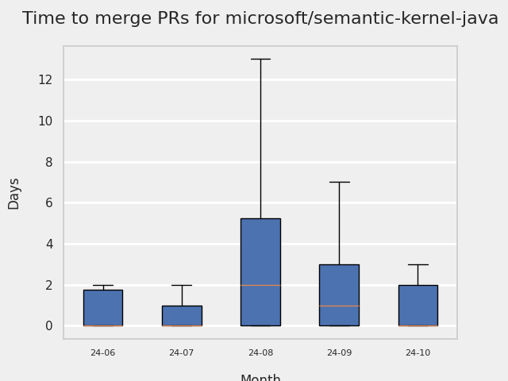
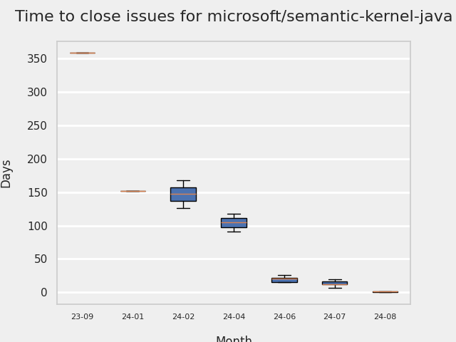
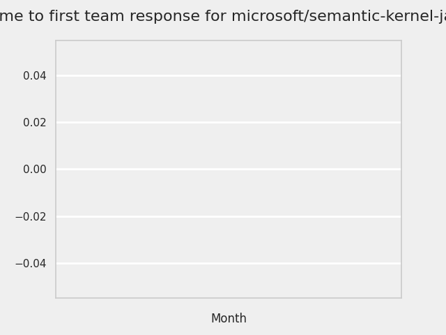
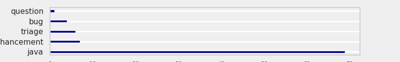
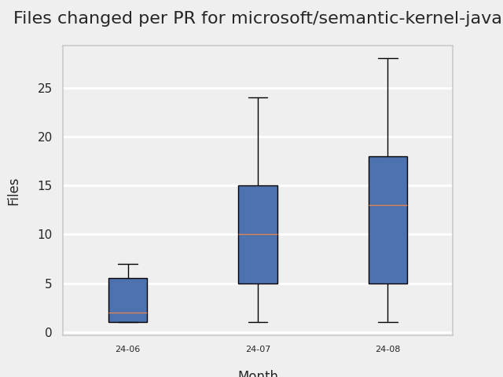
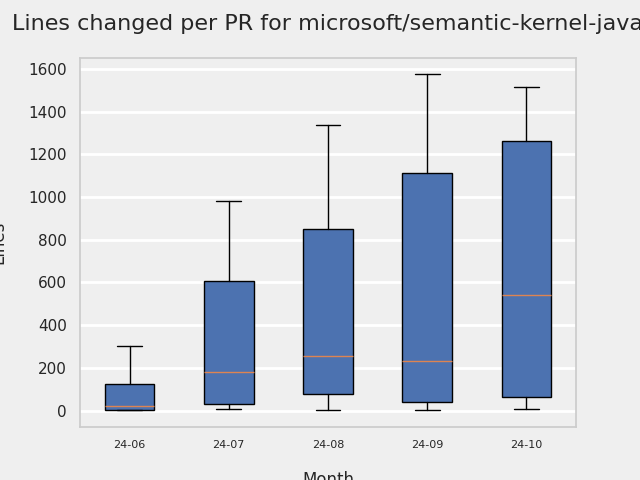

# GITHUB ISSUES REPORT FOR microsoft/semantic-kernel-java

Generated on 2024-08-19 using: stale=30, all=True

* marks items that are new to report in past 1 day(s)

## FOR ISSUES THAT ARE MARKED AS BUGS:

### Issues in semantic-kernel-java that need a response from team:

| Days Ago | Issue | Title |
| --- | --- | --- |
 |  OP:334  |[146](https://github.com/microsoft/semantic-kernel-java/issues/146 "Java: Does not work in GraalVM native compilation") | Java: Does not work in GraalVM native compilation |

### Issues in semantic-kernel-java that have no external responses since team response in 30+ days:

| Days Ago | Issue | Title |
| --- | --- | --- |
 |  TM:65  |[145](https://github.com/microsoft/semantic-kernel-java/issues/145 "Java.lang.ClassCastException on PromptExecutionSettings.builder().withResponseFormat(ResponseFormat.JSON_OBJECT).build(); ") | Java.lang.ClassCastException on PromptExecutionSettings.builder().withResponseFormat(ResponseFormat.JSON_OBJECT).build();  |

---

## FOR ISSUES THAT ARE NOT MARKED AS BUGS:

### Issues in semantic-kernel-java that need a response from team:

| Days Ago | Issue | Title |
| --- | --- | --- |
 |  OP:43  |[124](https://github.com/microsoft/semantic-kernel-java/issues/124 "Java: New Feature: Add getting started docs for Gradle and Kotlin") | Java: New Feature: Add getting started docs for Gradle and Kotlin |
 |  OP:97  |[142](https://github.com/microsoft/semantic-kernel-java/issues/142 "Java: When calling getContent or getItems, get null if the other property was set.") | Java: When calling getContent or getItems, get null if the other property was set. |
 |  OP:97  |[143](https://github.com/microsoft/semantic-kernel-java/issues/143 "Java: Not possible to retrieve function calls and function results") | Java: Not possible to retrieve function calls and function results |
 |  OP:98  |[144](https://github.com/microsoft/semantic-kernel-java/issues/144 "Java: ChatMessageContent should provide setters for all properties") | Java: ChatMessageContent should provide setters for all properties |
 |  OP:331  |[128](https://github.com/microsoft/semantic-kernel-java/issues/128 "Java: API - What about importing skills/plugins from the root directory in the classpath?") | Java: API - What about importing skills/plugins from the root directory in the classpath? |
 |  OP:340  |[131](https://github.com/microsoft/semantic-kernel-java/issues/131 "Java: API - What about manipulating an array of float in Embedding ?") | Java: API - What about manipulating an array of float in Embedding ? |
 |  OP:349  |[133](https://github.com/microsoft/semantic-kernel-java/issues/133 "Java Connector for  Vector DBs") | Java Connector for  Vector DBs |

### Issues in semantic-kernel-java that have comments from OP after last team response:

| Days Ago | Issue | Title |
| --- | --- | --- |
 |  TM:332, OP:19  |[129](https://github.com/microsoft/semantic-kernel-java/issues/129 "Java: Support for the PaLM API in Java") | Java: Support for the PaLM API in Java |

### Issues in semantic-kernel-java that have comments from 3rd party after last team response:

| Days Ago | Issue | Title |
| --- | --- | --- |
 |  P:124,  |[132](https://github.com/microsoft/semantic-kernel-java/issues/132 "Java - Handle null values in prompts") | Java - Handle null values in prompts |
 |  P:143,  |[134](https://github.com/microsoft/semantic-kernel-java/issues/134 "Java: kernel can evaluate if a custom/locked plan is applicable to ask if not generate a new plan") | Java: kernel can evaluate if a custom/locked plan is applicable to ask if not generate a new plan |

### Issues in semantic-kernel-java that have no external responses since team response in 30+ days:

| Days Ago | Issue | Title |
| --- | --- | --- |
 |  TM:65  |[127](https://github.com/microsoft/semantic-kernel-java/issues/127 "Java: Can LLM help me build an object by calling the Kernel Function with CUSTOM CLASS?") | Java: Can LLM help me build an object by calling the Kernel Function with CUSTOM CLASS? |
 |  TM:321  |[130](https://github.com/microsoft/semantic-kernel-java/issues/130 "Java: API - What about being able to generate one Embedding from one data type (instead of list)?") | Java: API - What about being able to generate one Embedding from one data type (instead of list)? |

## MOST FREQUENTLY CHANGED FILES (by # of PRs):

  9: aiservices/openai/src/main/java/com/microsoft/semantickernel/aiservices/openai/chatcompletion/OpenAIChatCompletion.java

  9: api-test/integration-tests/pom.xml

  7: samples/semantickernel-concepts/semantickernel-syntax-examples/pom.xml

  6: pom.xml

  6: semantickernel-experimental/src/main/java/com/microsoft/semantickernel/data/recorddefinition/VectorStoreRecordDefinition.java

  6: semantickernel-bom/pom.xml

  6: .github/workflows/java-publish-package.yml

  5: CHANGELOG.md

  5: semantickernel-api/src/main/java/com/microsoft/semantickernel/services/chatcompletion/ChatHistory.java

  5: semantickernel-api/pom.xml

  5: aiservices/openai/pom.xml

  5: api-test/integration-tests/src/test/java/com/microsoft/semantickernel/tests/connectors/memory/redis/RedisVectorStoreRecordCollectionTest.java

