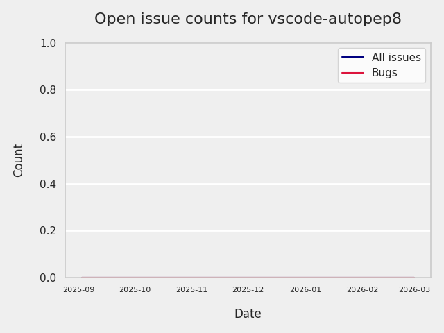
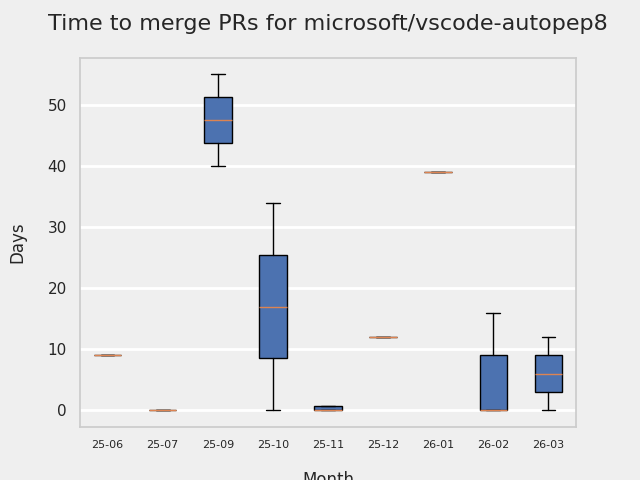
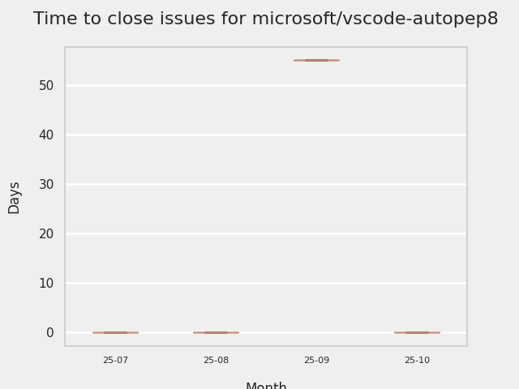
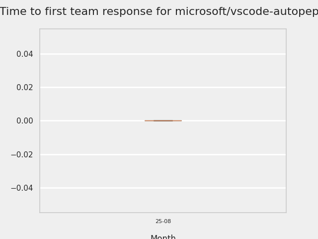
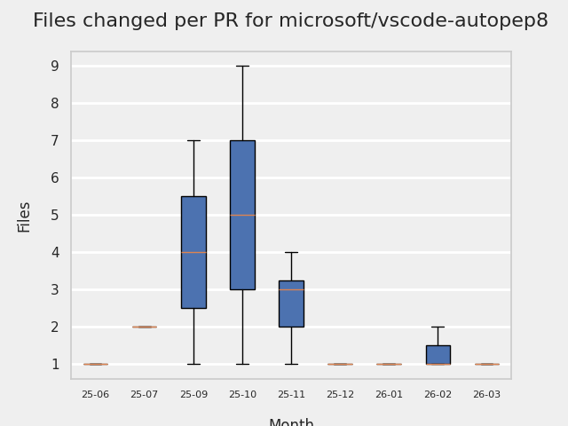
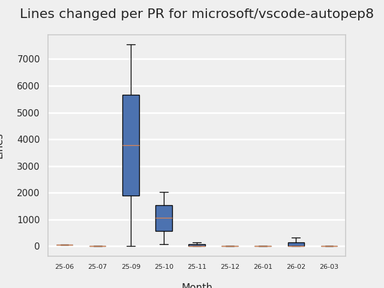

# GITHUB ISSUES REPORT FOR microsoft/vscode-autopep8

Generated on 2026-03-29 using: stale=30, all=True

* marks items that are new to report in past 7 day(s)

---

## PULL REQUEST ACTIVITY

### Pull Requests opened in the past 7 day(s):

| | PR | Created By | Created | Days Open | Closed/Merged | Closed/Merged By | Title |
| --- | --- | --- | --- | --- | --- | --- | --- |
| \* | [#353](https://github.com/microsoft/vscode-autopep8/pull/353) | dependabot | 2026-03-29 | 0 | - | - | Bump serialize-javascript and terser-webpack-plugin |
| \* | [#352](https://github.com/microsoft/vscode-autopep8/pull/352) | dependabot | 2026-03-25 | 3 | - | - | Bump picomatch from 2.3.1 to 2.3.2 |
| \* | [#351](https://github.com/microsoft/vscode-autopep8/pull/351) | dependabot | 2026-03-23 | 6 | - | - | Bump undici from 7.15.0 to 7.24.5 |

### Pull Requests merged in the past 7 day(s):

| | PR | Created By | Created | Days Open | Closed/Merged | Closed/Merged By | Title |
| --- | --- | --- | --- | --- | --- | --- | --- |
| \* | [#347](https://github.com/microsoft/vscode-autopep8/pull/347) | bschnurr | 2026-03-10 | 12 | 2026-03-23 | bschnurr | Bump version to 2026.3.0-dev |
| \* | [#347](https://github.com/microsoft/vscode-autopep8/pull/347) | bschnurr | 2026-03-10 | 12 | 2026-03-23 | bschnurr | Bump version to 2026.3.0-dev |

### Pull Requests closed (not merged) in the past 7 day(s):

| | PR | Created By | Created | Days Open | Closed/Merged | Closed/Merged By | Title |
| --- | --- | --- | --- | --- | --- | --- | --- |
| \* | [#348](https://github.com/microsoft/vscode-autopep8/pull/348) | dependabot | 2026-03-13 | 9 | 2026-03-23 | - | Bump undici from 7.15.0 to 7.24.1 |

### Pull Requests still open that were opened more than 7 days ago:

| | PR | Created By | Created | Days Open | Closed/Merged | Closed/Merged By | Title |
| --- | --- | --- | --- | --- | --- | --- | --- |
|   | [#349](https://github.com/microsoft/vscode-autopep8/pull/349) | dependabot | 2026-03-18 | 11 | - | - | Bump ujson from 5.10.0 to 5.12.0 in /src/test/python_tests |
|   | [#350](https://github.com/microsoft/vscode-autopep8/pull/350) | dependabot | 2026-03-21 | 8 | - | - | Bump flatted from 3.3.3 to 3.4.2 |

## MOST FREQUENTLY CHANGED FILES (by # of PRs):

 12: package-lock.json

 10: build/azure-devdiv-pipeline.pre-release.yml

  7: package.json

  7: build/azure-devdiv-pipeline.stable.yml

