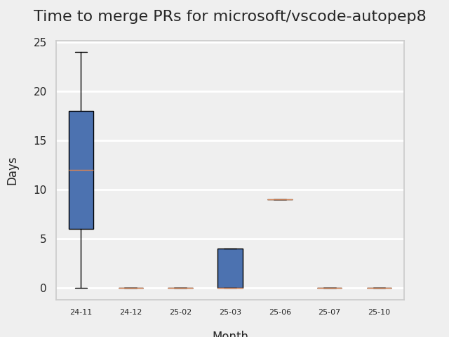
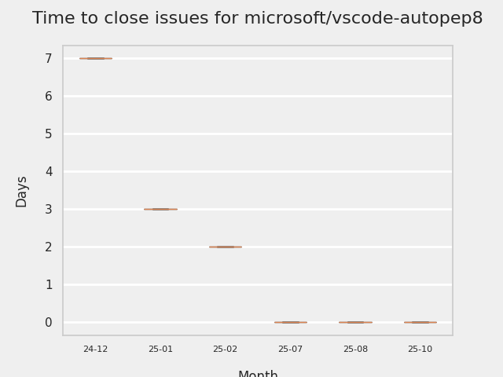

# GITHUB ISSUES REPORT FOR microsoft/vscode-autopep8

Generated on 2026-02-23 using: stale=30, all=True

* marks items that are new to report in past 7 day(s)

---

## PULL REQUEST ACTIVITY

### Pull Requests opened in the past 7 day(s):

| | PR | Created By | Created | Days Open | Closed/Merged | Closed/Merged By | Title |
| --- | --- | --- | --- | --- | --- | --- | --- |
| \* | [#343](https://github.com/microsoft/vscode-autopep8/pull/343) | bschnurr | 2026-02-23 | 0 | - | - | Add PR creation skill for Copilot |
| \* | [#342](https://github.com/microsoft/vscode-autopep8/pull/342) | bschnurr | 2026-02-23 | 0 | - | - | Disable CI trigger in stable pipeline |
| \* | [#341](https://github.com/microsoft/vscode-autopep8/pull/341) | bschnurr | 2026-02-23 | 0 | 2026-02-23 | bschnurr | add nuget for build pipeline |
| \* | [#341](https://github.com/microsoft/vscode-autopep8/pull/341) | bschnurr | 2026-02-23 | 0 | 2026-02-23 | bschnurr | add nuget for build pipeline |
| \* | [#340](https://github.com/microsoft/vscode-autopep8/pull/340) | bschnurr | 2026-02-18 | 0 | 2026-02-19 | bschnurr | updatte build template autopep8 |
| \* | [#340](https://github.com/microsoft/vscode-autopep8/pull/340) | bschnurr | 2026-02-18 | 0 | 2026-02-19 | bschnurr | updatte build template autopep8 |

### Pull Requests merged in the past 7 day(s):

| | PR | Created By | Created | Days Open | Closed/Merged | Closed/Merged By | Title |
| --- | --- | --- | --- | --- | --- | --- | --- |
| \* | [#341](https://github.com/microsoft/vscode-autopep8/pull/341) | bschnurr | 2026-02-23 | 0 | 2026-02-23 | bschnurr | add nuget for build pipeline |
| \* | [#341](https://github.com/microsoft/vscode-autopep8/pull/341) | bschnurr | 2026-02-23 | 0 | 2026-02-23 | bschnurr | add nuget for build pipeline |
| \* | [#340](https://github.com/microsoft/vscode-autopep8/pull/340) | bschnurr | 2026-02-18 | 0 | 2026-02-19 | bschnurr | updatte build template autopep8 |
| \* | [#340](https://github.com/microsoft/vscode-autopep8/pull/340) | bschnurr | 2026-02-18 | 0 | 2026-02-19 | bschnurr | updatte build template autopep8 |

### Pull Requests still open that were opened more than 7 days ago:

| | PR | Created By | Created | Days Open | Closed/Merged | Closed/Merged By | Title |
| --- | --- | --- | --- | --- | --- | --- | --- |
| \* | [#314](https://github.com/microsoft/vscode-autopep8/pull/314) | dependabot | 2025-08-06 | 201 | - | - | Bump tmp from 0.2.1 to 0.2.4 |
| \* | [#327](https://github.com/microsoft/vscode-autopep8/pull/327) | dependabot | 2025-11-17 | 98 | - | - | Bump js-yaml from 3.14.1 to 3.14.2 |
| \* | [#337](https://github.com/microsoft/vscode-autopep8/pull/337) | dependabot | 2026-01-21 | 32 | - | - | Bump lodash from 4.17.21 to 4.17.23 |
| \* | [#338](https://github.com/microsoft/vscode-autopep8/pull/338) | dependabot | 2026-02-07 | 16 | - | - | Bump webpack from 5.101.3 to 5.105.0 |
|   | [#339](https://github.com/microsoft/vscode-autopep8/pull/339) | dependabot | 2026-02-14 | 9 | - | - | Bump qs from 6.14.0 to 6.14.2 |

## MOST FREQUENTLY CHANGED FILES (by # of PRs):

 10: package-lock.json

  9: build/azure-devdiv-pipeline.pre-release.yml

  7: package.json

  6: build/azure-devdiv-pipeline.stable.yml

