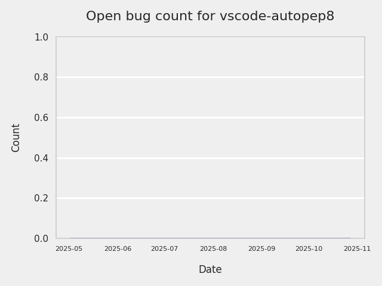
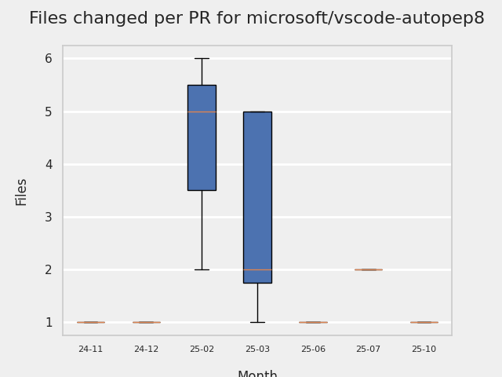

# GITHUB ISSUES REPORT FOR microsoft/vscode-autopep8

Generated on 2025-12-07 using: stale=30, all=True

* marks items that are new to report in past 7 day(s)

---

## PULL REQUEST ACTIVITY

### Pull Requests opened in the past 7 day(s):

| | PR | Created By | Created | Days Open | Closed/Merged | Closed/Merged By | Title |
| --- | --- | --- | --- | --- | --- | --- | --- |
| \* | [#335](https://github.com/microsoft/vscode-autopep8/pull/335) | dependabot | 2025-12-04 | 3 | - | - | Bump jws from 3.2.2 to 3.2.3 |

### Pull Requests still open that were opened more than 7 days ago:

| | PR | Created By | Created | Days Open | Closed/Merged | Closed/Merged By | Title |
| --- | --- | --- | --- | --- | --- | --- | --- |
| \* | [#314](https://github.com/microsoft/vscode-autopep8/pull/314) | dependabot | 2025-08-06 | 123 | - | - | Bump tmp from 0.2.1 to 0.2.4 |
| \* | [#327](https://github.com/microsoft/vscode-autopep8/pull/327) | dependabot | 2025-11-17 | 20 | - | - | Bump js-yaml from 3.14.1 to 3.14.2 |

## MOST FREQUENTLY CHANGED FILES (by # of PRs):

 11: package-lock.json

  9: package.json

  8: build/azure-devdiv-pipeline.pre-release.yml

  5: build/azure-devdiv-pipeline.stable.yml

