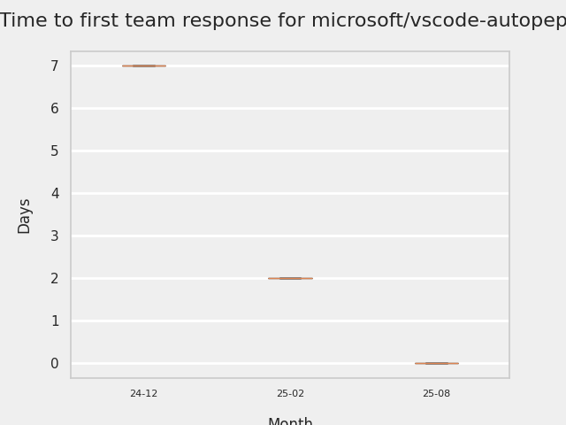

# GITHUB ISSUES REPORT FOR microsoft/vscode-autopep8

Generated on 2025-10-28 using: stale=30, all=True

* marks items that are new to report in past 1 day(s)

---

## FOR ISSUES THAT ARE NOT MARKED AS BUGS:

### Issues in vscode-autopep8 that need a response from team:

| Days Ago | Issue | Title |
| --- | --- | --- |
 |  OP:53  |[316](https://github.com/microsoft/vscode-autopep8/issues/316 "Bump node 22.x") | Bump node 22.x |

## MOST FREQUENTLY CHANGED FILES (by # of PRs):

  6: package-lock.json

