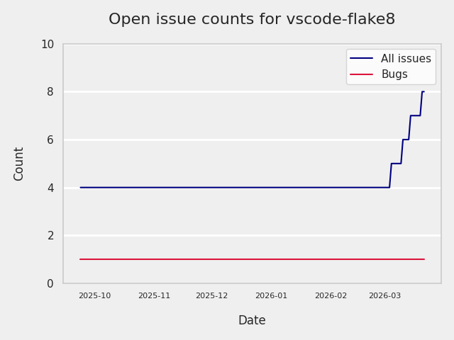
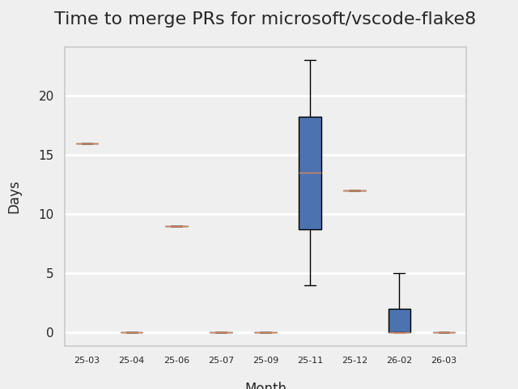
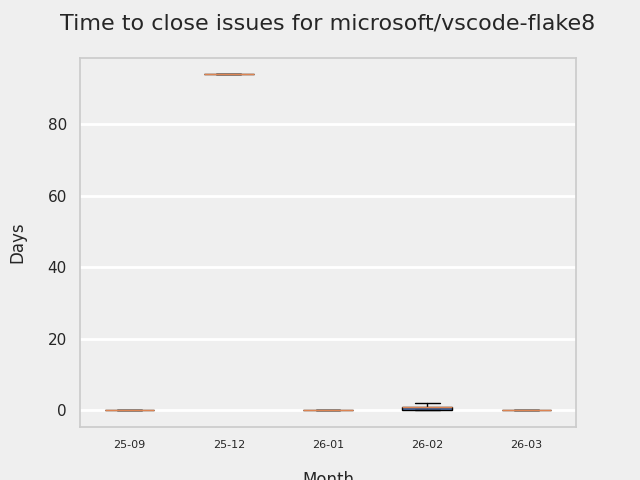
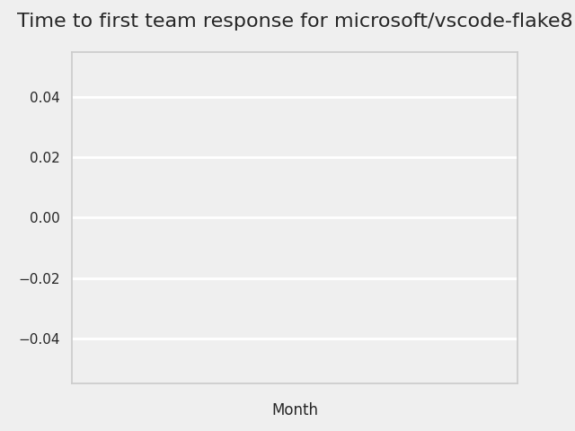
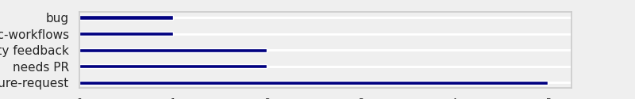
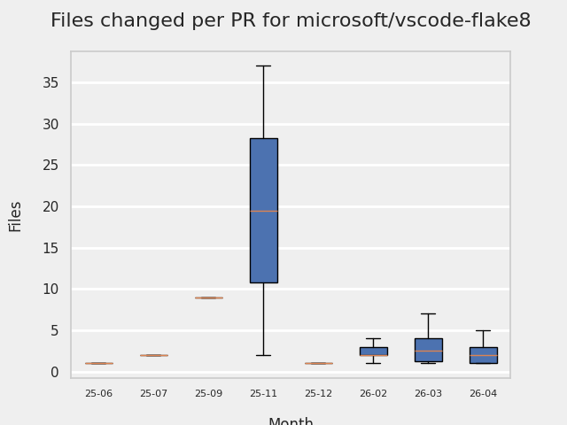
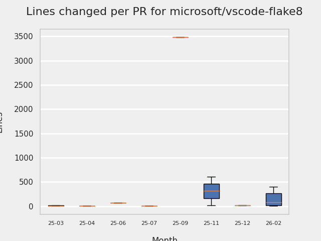
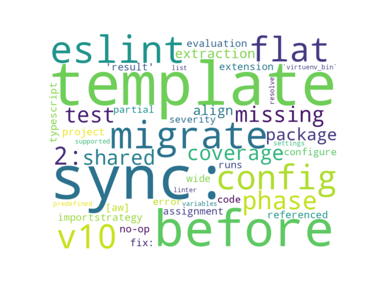

# GITHUB ISSUES REPORT FOR microsoft/vscode-flake8

Generated on 2026-03-29 using: stale=30, all=True

* marks items that are new to report in past 7 day(s)

## FOR ISSUES THAT ARE MARKED AS BUGS:

### Issues in vscode-flake8 that have comments from OP after last team response:

| Days Ago | Issue | Title |
| --- | --- | --- |
 |  TM:885, OP:885  |[242](https://github.com/microsoft/vscode-flake8/issues/242 "Linting silently fails when required plugin is missing") | Linting silently fails when required plugin is missing |

---

## FOR ISSUES THAT ARE NOT MARKED AS BUGS:

### Issues in vscode-flake8 that need a response from team:

| Days Ago | Issue | Title |
| --- | --- | --- |
 |  OP:15  |[441](https://github.com/microsoft/vscode-flake8/issues/441 "Template Sync: align importStrategy in typescript to python") | Template Sync: align importStrategy in typescript to python |
 |  OP:19  |[438](https://github.com/microsoft/vscode-flake8/issues/438 "Template Sync: fix: 'result' referenced before assignment") | Template Sync: fix: 'result' referenced before assignment |
 |  OP:25  |[429](https://github.com/microsoft/vscode-flake8/issues/429 "[aw] No-Op Runs") | [aw] No-Op Runs |
 |  OP:880  |[244](https://github.com/microsoft/vscode-flake8/issues/244 "Project wide evaluation in this extension") | Project wide evaluation in this extension |

### Issues in vscode-flake8 that have comments from 3rd party after last team response:

| Days Ago | Issue | Title |
| --- | --- | --- |
 |  P:1138,  |[7](https://github.com/microsoft/vscode-flake8/issues/7 "Cannot configure severity for partial error code") | Cannot configure severity for partial error code |

### Issues in vscode-flake8 that have no external responses since team response in 30+ days:

| Days Ago | Issue | Title |
| --- | --- | --- |
 |  TM:1200  |[92](https://github.com/microsoft/vscode-flake8/issues/92 "Add `VIRTUENV_BIN` to the list of supported predefined variables to resolve linter settings") | Add `VIRTUENV_BIN` to the list of supported predefined variables to resolve linter settings |

## PULL REQUEST ACTIVITY

### Pull Requests opened in the past 7 day(s):

| | PR | Created By | Created | Days Open | Closed/Merged | Closed/Merged By | Title |
| --- | --- | --- | --- | --- | --- | --- | --- |
| \* | [#454](https://github.com/microsoft/vscode-flake8/pull/454) | dependabot | 2026-03-25 | 3 | - | - | Bump picomatch from 2.3.1 to 2.3.2 |
| \* | [#452](https://github.com/microsoft/vscode-flake8/pull/452) | dependabot | 2026-03-25 | 4 | - | - | Bump pygls from 2.0.1 to 2.1.1 in the pip-minor-patch group |
| \* | [#451](https://github.com/microsoft/vscode-flake8/pull/451) | edvilme | 2026-03-23 | 2 | 2026-03-26 | edvilme | Template sync: skip dependency update PRs |
| \* | [#451](https://github.com/microsoft/vscode-flake8/pull/451) | edvilme | 2026-03-23 | 2 | 2026-03-26 | edvilme | Template sync: skip dependency update PRs |

### Pull Requests merged in the past 7 day(s):

| | PR | Created By | Created | Days Open | Closed/Merged | Closed/Merged By | Title |
| --- | --- | --- | --- | --- | --- | --- | --- |
| \* | [#451](https://github.com/microsoft/vscode-flake8/pull/451) | edvilme | 2026-03-23 | 2 | 2026-03-26 | edvilme | Template sync: skip dependency update PRs |
| \* | [#451](https://github.com/microsoft/vscode-flake8/pull/451) | edvilme | 2026-03-23 | 2 | 2026-03-26 | edvilme | Template sync: skip dependency update PRs |
| \* | [#435](https://github.com/microsoft/vscode-flake8/pull/435) | bschnurr | 2026-03-10 | 12 | 2026-03-23 | bschnurr | Bump version to 2026.3.0-dev |
| \* | [#435](https://github.com/microsoft/vscode-flake8/pull/435) | bschnurr | 2026-03-10 | 12 | 2026-03-23 | bschnurr | Bump version to 2026.3.0-dev |

### Pull Requests still open that were opened more than 7 days ago:

| | PR | Created By | Created | Days Open | Closed/Merged | Closed/Merged By | Title |
| --- | --- | --- | --- | --- | --- | --- | --- |
|   | [#444](https://github.com/microsoft/vscode-flake8/pull/444) | dependabot | 2026-03-18 | 11 | - | - | Bump ujson from 5.11.0 to 5.12.0 in /src/test/python_tests |
|   | [#445](https://github.com/microsoft/vscode-flake8/pull/445) | dependabot | 2026-03-18 | 11 | - | - | Bump sinon from 21.0.2 to 21.0.3 in the npm-minor-patch group |
|   | [#446](https://github.com/microsoft/vscode-flake8/pull/446) | dependabot | 2026-03-18 | 11 | - | - | Bump webpack-cli from 6.0.1 to 7.0.2 |
|   | [#447](https://github.com/microsoft/vscode-flake8/pull/447) | dependabot | 2026-03-18 | 11 | - | - | Bump the github-actions-minor-patch group across 1 directory with 2 updates |
|   | [#448](https://github.com/microsoft/vscode-flake8/pull/448) | dependabot | 2026-03-19 | 10 | - | - | Bump flatted from 3.3.1 to 3.4.2 |

## RECENTLY CLOSED ISSUES

### Issues closed in the past 7 day(s):

| Days Ago | Issue | Title |
| --- | --- | --- |
 | \* TM:0  |[453](https://github.com/microsoft/vscode-flake8/issues/453 "Template Sync: pip(deps): bump pygls from 2.1.0 to 2.1.1")  |Template Sync: pip(deps): bump pygls from 2.1.0 to 2.1.1 |
 | \* TM:5  |[450](https://github.com/microsoft/vscode-flake8/issues/450 "Template Sync: pip(deps): bump pygls from 2.0.1 to 2.1.0")  |Template Sync: pip(deps): bump pygls from 2.0.1 to 2.1.0 |

## MOST FREQUENTLY CHANGED FILES (by # of PRs):

 19: package-lock.json

 18: package.json

  8: .github/workflows/check-python-versions.lock.yml

  7: .github/workflows/issue-triage.lock.yml

  6: .github/workflows/extension-template-sync.lock.yml

  5: .github/workflows/extension-template-sync.md

  5: bundled/tool/lsp_server.py

  5: src/common/python.ts

  5: bundled/tool/lsp_utils.py

  5: .github/workflows/pr-check.yml

  5: .github/workflows/push-check.yml

