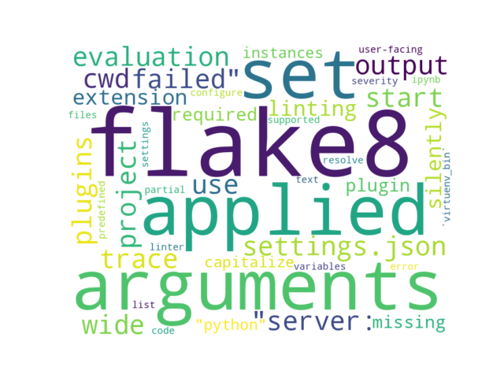

# GITHUB ISSUES REPORT FOR microsoft/vscode-flake8

Generated on 2026-02-08 using: stale=30, all=True

* marks items that are new to report in past 7 day(s)

## FOR ISSUES THAT ARE MARKED AS BUGS:

### Issues in vscode-flake8 that need a response from team:

| Days Ago | Issue | Title |
| --- | --- | --- |
 |  OP:68  |[357](https://github.com/microsoft/vscode-flake8/issues/357 "Skipping standard library file notification") | Skipping standard library file notification |
 |  OP:465  |[331](https://github.com/microsoft/vscode-flake8/issues/331 "Add CWD to &quot;Server: Start failed&quot; trace output") | Add CWD to "Server: Start failed" trace output |

### Issues in vscode-flake8 that have comments from OP after last team response:

| Days Ago | Issue | Title |
| --- | --- | --- |
 |  TM:620, OP:608  |[318](https://github.com/microsoft/vscode-flake8/issues/318 "Allow the use of Flake8 plugins") | Allow the use of Flake8 plugins |
 |  TM:836, OP:836  |[242](https://github.com/microsoft/vscode-flake8/issues/242 "Linting silently fails when required plugin is missing") | Linting silently fails when required plugin is missing |

### Issues in vscode-flake8 that have comments from 3rd party after last team response:

| Days Ago | Issue | Title |
| --- | --- | --- |
 |  P:118,  |[340](https://github.com/microsoft/vscode-flake8/issues/340 "Flake8 does not applied arguments set in settings.json") | Flake8 does not applied arguments set in settings.json |

---

## FOR ISSUES THAT ARE NOT MARKED AS BUGS:

### Issues in vscode-flake8 that need a response from team:

| Days Ago | Issue | Title |
| --- | --- | --- |
 |  OP:831  |[244](https://github.com/microsoft/vscode-flake8/issues/244 "Project wide evaluation in this extension") | Project wide evaluation in this extension |

### Issues in vscode-flake8 that have comments from 3rd party after last team response:

| Days Ago | Issue | Title |
| --- | --- | --- |
 |  P:1089,  |[7](https://github.com/microsoft/vscode-flake8/issues/7 "Cannot configure severity for partial error code") | Cannot configure severity for partial error code |

### Issues in vscode-flake8 that have no external responses since team response in 30+ days:

| Days Ago | Issue | Title |
| --- | --- | --- |
 |  TM:1151  |[92](https://github.com/microsoft/vscode-flake8/issues/92 "Add `VIRTUENV_BIN` to the list of supported predefined variables to resolve linter settings") | Add `VIRTUENV_BIN` to the list of supported predefined variables to resolve linter settings |

## PULL REQUEST ACTIVITY

### Pull Requests opened in the past 7 day(s):

| | PR | Created By | Created | Days Open | Closed/Merged | Closed/Merged By | Title |
| --- | --- | --- | --- | --- | --- | --- | --- |
| \* | [#364](https://github.com/microsoft/vscode-flake8/pull/364) | dependabot | 2026-02-07 | 1 | - | - | Bump webpack from 5.101.3 to 5.105.0 |
| \* | [#363](https://github.com/microsoft/vscode-flake8/pull/363) | copilot-swe-agent | 2026-02-06 | 0 | 2026-02-06 | - | [WIP] Run all tests for flake8 project |
| \* | [#362](https://github.com/microsoft/vscode-flake8/pull/362) | edvilme | 2026-02-06 | 1 | - | - | Symlinks should not be resolved when getting workspace settings |
| \* | [#361](https://github.com/microsoft/vscode-flake8/pull/361) | copilot-swe-agent | 2026-02-05 | 1 | 2026-02-07 | - | Resolve symlinks in workspace path comparison to fix settings lookup |

### Pull Requests closed (not merged) in the past 7 day(s):

| | PR | Created By | Created | Days Open | Closed/Merged | Closed/Merged By | Title |
| --- | --- | --- | --- | --- | --- | --- | --- |
| \* | [#361](https://github.com/microsoft/vscode-flake8/pull/361) | copilot-swe-agent | 2026-02-05 | 1 | 2026-02-07 | - | Resolve symlinks in workspace path comparison to fix settings lookup |
| \* | [#363](https://github.com/microsoft/vscode-flake8/pull/363) | copilot-swe-agent | 2026-02-06 | 0 | 2026-02-06 | - | [WIP] Run all tests for flake8 project |

### Pull Requests still open that were opened more than 7 days ago:

| | PR | Created By | Created | Days Open | Closed/Merged | Closed/Merged By | Title |
| --- | --- | --- | --- | --- | --- | --- | --- |
| \* | [#346](https://github.com/microsoft/vscode-flake8/pull/346) | dependabot | 2025-08-06 | 186 | - | - | Bump tmp from 0.2.1 to 0.2.4 |
| \* | [#349](https://github.com/microsoft/vscode-flake8/pull/349) | dependabot | 2025-09-26 | 135 | - | - | Bump tar-fs from 2.1.3 to 2.1.4 |
| \* | [#352](https://github.com/microsoft/vscode-flake8/pull/352) | dependabot | 2025-11-15 | 85 | - | - | Bump js-yaml from 4.1.0 to 4.1.1 |
| \* | [#359](https://github.com/microsoft/vscode-flake8/pull/359) | dependabot | 2026-01-01 | 38 | - | - | Bump qs from 6.14.0 to 6.14.1 |

## MOST FREQUENTLY CHANGED FILES (by # of PRs):

  7: package-lock.json

  5: package.json

