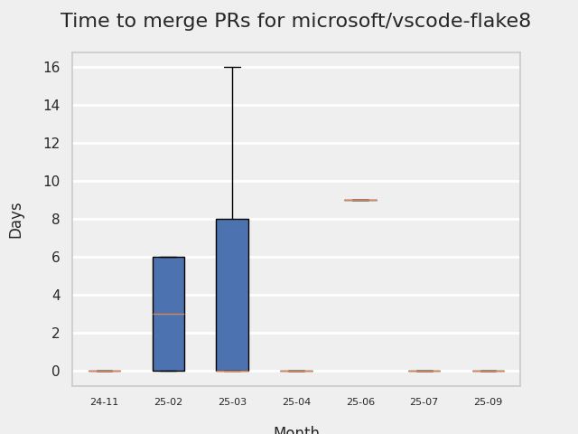
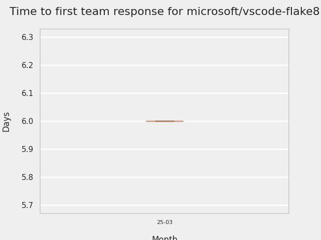

# GITHUB ISSUES REPORT FOR microsoft/vscode-flake8

Generated on 2025-12-21 using: stale=30, all=True

* marks items that are new to report in past 7 day(s)

## FOR ISSUES THAT ARE MARKED AS BUGS:

### Issues in vscode-flake8 that need a response from team:

| Days Ago | Issue | Title |
| --- | --- | --- |
 |  OP:19  |[357](https://github.com/microsoft/vscode-flake8/issues/357 "Skipping standard library file notification") | Skipping standard library file notification |
 |  OP:416  |[331](https://github.com/microsoft/vscode-flake8/issues/331 "Add CWD to &quot;Server: Start failed&quot; trace output") | Add CWD to "Server: Start failed" trace output |

### Issues in vscode-flake8 that have comments from OP after last team response:

| Days Ago | Issue | Title |
| --- | --- | --- |
 |  TM:571, OP:559  |[318](https://github.com/microsoft/vscode-flake8/issues/318 "Allow the use of Flake8 plugins") | Allow the use of Flake8 plugins |
 |  TM:787, OP:787  |[242](https://github.com/microsoft/vscode-flake8/issues/242 "Linting silently fails when required plugin is missing") | Linting silently fails when required plugin is missing |

### Issues in vscode-flake8 that have comments from 3rd party after last team response:

| Days Ago | Issue | Title |
| --- | --- | --- |
 |  P:69,  |[340](https://github.com/microsoft/vscode-flake8/issues/340 "Flake8 does not applied arguments set in settings.json") | Flake8 does not applied arguments set in settings.json |

---

## FOR ISSUES THAT ARE NOT MARKED AS BUGS:

### Issues in vscode-flake8 that need a response from team:

| Days Ago | Issue | Title |
| --- | --- | --- |
 |  OP:782  |[244](https://github.com/microsoft/vscode-flake8/issues/244 "Project wide evaluation in this extension") | Project wide evaluation in this extension |

### Issues in vscode-flake8 that have comments from 3rd party after last team response:

| Days Ago | Issue | Title |
| --- | --- | --- |
 |  P:1040,  |[7](https://github.com/microsoft/vscode-flake8/issues/7 "Cannot configure severity for partial error code") | Cannot configure severity for partial error code |

### Issues in vscode-flake8 that have no external responses since team response in 30+ days:

| Days Ago | Issue | Title |
| --- | --- | --- |
 |  TM:1102  |[92](https://github.com/microsoft/vscode-flake8/issues/92 "Add `VIRTUENV_BIN` to the list of supported predefined variables to resolve linter settings") | Add `VIRTUENV_BIN` to the list of supported predefined variables to resolve linter settings |

## PULL REQUEST ACTIVITY

### Pull Requests merged in the past 7 day(s):

| | PR | Created By | Created | Days Open | Closed/Merged | Closed/Merged By | Title |
| --- | --- | --- | --- | --- | --- | --- | --- |
| \* | [#358](https://github.com/microsoft/vscode-flake8/pull/358) | dependabot | 2025-12-04 | 12 | 2025-12-17 | eleanorjboyd | Bump jws from 3.2.2 to 3.2.3 |
| \* | [#358](https://github.com/microsoft/vscode-flake8/pull/358) | dependabot | 2025-12-04 | 12 | 2025-12-17 | eleanorjboyd | Bump jws from 3.2.2 to 3.2.3 |

### Pull Requests still open that were opened more than 7 days ago:

| | PR | Created By | Created | Days Open | Closed/Merged | Closed/Merged By | Title |
| --- | --- | --- | --- | --- | --- | --- | --- |
| \* | [#346](https://github.com/microsoft/vscode-flake8/pull/346) | dependabot | 2025-08-06 | 137 | - | - | Bump tmp from 0.2.1 to 0.2.4 |
| \* | [#349](https://github.com/microsoft/vscode-flake8/pull/349) | dependabot | 2025-09-26 | 86 | - | - | Bump tar-fs from 2.1.3 to 2.1.4 |
| \* | [#352](https://github.com/microsoft/vscode-flake8/pull/352) | dependabot | 2025-11-15 | 36 | - | - | Bump js-yaml from 4.1.0 to 4.1.1 |

## MOST FREQUENTLY CHANGED FILES (by # of PRs):

  9: package-lock.json

  7: package.json

