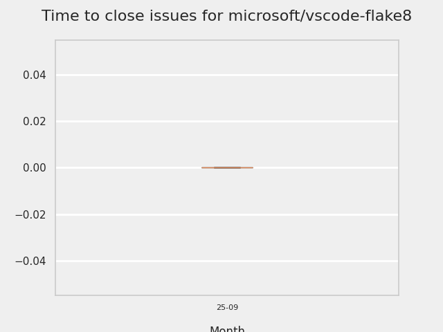

# GITHUB ISSUES REPORT FOR microsoft/vscode-flake8

Generated on 2026-02-23 using: stale=30, all=True

* marks items that are new to report in past 7 day(s)

## FOR ISSUES THAT ARE MARKED AS BUGS:

### Issues in vscode-flake8 that need a response from team:

| Days Ago | Issue | Title |
| --- | --- | --- |
 |  OP:83  |[357](https://github.com/microsoft/vscode-flake8/issues/357 "Skipping standard library file notification") | Skipping standard library file notification |
 |  OP:480  |[331](https://github.com/microsoft/vscode-flake8/issues/331 "Add CWD to &quot;Server: Start failed&quot; trace output") | Add CWD to "Server: Start failed" trace output |

### Issues in vscode-flake8 that have comments from OP after last team response:

| Days Ago | Issue | Title |
| --- | --- | --- |
 |  TM:635, OP:623  |[318](https://github.com/microsoft/vscode-flake8/issues/318 "Allow the use of Flake8 plugins") | Allow the use of Flake8 plugins |
 |  TM:851, OP:851  |[242](https://github.com/microsoft/vscode-flake8/issues/242 "Linting silently fails when required plugin is missing") | Linting silently fails when required plugin is missing |

---

## FOR ISSUES THAT ARE NOT MARKED AS BUGS:

### Issues in vscode-flake8 that need a response from team:

| Days Ago | Issue | Title |
| --- | --- | --- |
 |  OP:846  |[244](https://github.com/microsoft/vscode-flake8/issues/244 "Project wide evaluation in this extension") | Project wide evaluation in this extension |

### Issues in vscode-flake8 that have comments from 3rd party after last team response:

| Days Ago | Issue | Title |
| --- | --- | --- |
 |  P:1104,  |[7](https://github.com/microsoft/vscode-flake8/issues/7 "Cannot configure severity for partial error code") | Cannot configure severity for partial error code |

### Issues in vscode-flake8 that have no external responses since team response in 30+ days:

| Days Ago | Issue | Title |
| --- | --- | --- |
 |  TM:1166  |[92](https://github.com/microsoft/vscode-flake8/issues/92 "Add `VIRTUENV_BIN` to the list of supported predefined variables to resolve linter settings") | Add `VIRTUENV_BIN` to the list of supported predefined variables to resolve linter settings |

## PULL REQUEST ACTIVITY

### Pull Requests opened in the past 7 day(s):

| | PR | Created By | Created | Days Open | Closed/Merged | Closed/Merged By | Title |
| --- | --- | --- | --- | --- | --- | --- | --- |
| \* | [#392](https://github.com/microsoft/vscode-flake8/pull/392) | bschnurr | 2026-02-23 | 0 | - | - | Add PR creation skill for Copilot |
| \* | [#391](https://github.com/microsoft/vscode-flake8/pull/391) | edvilme | 2026-02-23 | 0 | 2026-02-23 | edvilme | Agentic Workflow: Check issues on Python Tools Extension Template |
| \* | [#391](https://github.com/microsoft/vscode-flake8/pull/391) | edvilme | 2026-02-23 | 0 | 2026-02-23 | edvilme | Agentic Workflow: Check issues on Python Tools Extension Template |
| \* | [#390](https://github.com/microsoft/vscode-flake8/pull/390) | bschnurr | 2026-02-23 | 0 | 2026-02-23 | bschnurr | Disable CI trigger in stable pipeline |
| \* | [#390](https://github.com/microsoft/vscode-flake8/pull/390) | bschnurr | 2026-02-23 | 0 | 2026-02-23 | bschnurr | Disable CI trigger in stable pipeline |
| \* | [#389](https://github.com/microsoft/vscode-flake8/pull/389) | bschnurr | 2026-02-23 | 0 | 2026-02-23 | bschnurr | add nuget for pipeline |
| \* | [#389](https://github.com/microsoft/vscode-flake8/pull/389) | bschnurr | 2026-02-23 | 0 | 2026-02-23 | bschnurr | add nuget for pipeline |
| \* | [#388](https://github.com/microsoft/vscode-flake8/pull/388) | edvilme | 2026-02-19 | 4 | 2026-02-23 | edvilme | Agentic Workflow: Update Python versions using JSON endpoint |
| \* | [#388](https://github.com/microsoft/vscode-flake8/pull/388) | edvilme | 2026-02-19 | 4 | 2026-02-23 | edvilme | Agentic Workflow: Update Python versions using JSON endpoint |
| \* | [#387](https://github.com/microsoft/vscode-flake8/pull/387) | bschnurr | 2026-02-18 | 0 | 2026-02-19 | bschnurr | update build template flake8 |
| \* | [#387](https://github.com/microsoft/vscode-flake8/pull/387) | bschnurr | 2026-02-18 | 0 | 2026-02-19 | bschnurr | update build template flake8 |
| \* | [#386](https://github.com/microsoft/vscode-flake8/pull/386) | dependabot | 2026-02-18 | 5 | - | - | Bump glob from 13.0.3 to 13.0.5 in the npm-minor-patch group |
| \* | [#385](https://github.com/microsoft/vscode-flake8/pull/385) | copilot-swe-agent | 2026-02-17 | 5 | - | - | Fix stdlib detection incorrectly flagging site-packages files |
| \* | [#384](https://github.com/microsoft/vscode-flake8/pull/384) | edvilme | 2026-02-17 | 0 | 2026-02-17 | edvilme | Agent update python |
| \* | [#384](https://github.com/microsoft/vscode-flake8/pull/384) | edvilme | 2026-02-17 | 0 | 2026-02-17 | edvilme | Agent update python |
| \* | [#383](https://github.com/microsoft/vscode-flake8/pull/383) | edvilme | 2026-02-17 | 0 | 2026-02-17 | edvilme | Restart server on config file change |
| \* | [#383](https://github.com/microsoft/vscode-flake8/pull/383) | edvilme | 2026-02-17 | 0 | 2026-02-17 | edvilme | Restart server on config file change |

### Pull Requests merged in the past 7 day(s):

| | PR | Created By | Created | Days Open | Closed/Merged | Closed/Merged By | Title |
| --- | --- | --- | --- | --- | --- | --- | --- |
| \* | [#390](https://github.com/microsoft/vscode-flake8/pull/390) | bschnurr | 2026-02-23 | 0 | 2026-02-23 | bschnurr | Disable CI trigger in stable pipeline |
| \* | [#390](https://github.com/microsoft/vscode-flake8/pull/390) | bschnurr | 2026-02-23 | 0 | 2026-02-23 | bschnurr | Disable CI trigger in stable pipeline |
| \* | [#388](https://github.com/microsoft/vscode-flake8/pull/388) | edvilme | 2026-02-19 | 4 | 2026-02-23 | edvilme | Agentic Workflow: Update Python versions using JSON endpoint |
| \* | [#388](https://github.com/microsoft/vscode-flake8/pull/388) | edvilme | 2026-02-19 | 4 | 2026-02-23 | edvilme | Agentic Workflow: Update Python versions using JSON endpoint |
| \* | [#391](https://github.com/microsoft/vscode-flake8/pull/391) | edvilme | 2026-02-23 | 0 | 2026-02-23 | edvilme | Agentic Workflow: Check issues on Python Tools Extension Template |
| \* | [#391](https://github.com/microsoft/vscode-flake8/pull/391) | edvilme | 2026-02-23 | 0 | 2026-02-23 | edvilme | Agentic Workflow: Check issues on Python Tools Extension Template |
| \* | [#389](https://github.com/microsoft/vscode-flake8/pull/389) | bschnurr | 2026-02-23 | 0 | 2026-02-23 | bschnurr | add nuget for pipeline |
| \* | [#389](https://github.com/microsoft/vscode-flake8/pull/389) | bschnurr | 2026-02-23 | 0 | 2026-02-23 | bschnurr | add nuget for pipeline |
| \* | [#387](https://github.com/microsoft/vscode-flake8/pull/387) | bschnurr | 2026-02-18 | 0 | 2026-02-19 | bschnurr | update build template flake8 |
| \* | [#387](https://github.com/microsoft/vscode-flake8/pull/387) | bschnurr | 2026-02-18 | 0 | 2026-02-19 | bschnurr | update build template flake8 |
| \* | [#384](https://github.com/microsoft/vscode-flake8/pull/384) | edvilme | 2026-02-17 | 0 | 2026-02-17 | edvilme | Agent update python |
| \* | [#384](https://github.com/microsoft/vscode-flake8/pull/384) | edvilme | 2026-02-17 | 0 | 2026-02-17 | edvilme | Agent update python |
| \* | [#382](https://github.com/microsoft/vscode-flake8/pull/382) | edvilme | 2026-02-13 | 3 | 2026-02-17 | edvilme | Create new agent |
| \* | [#382](https://github.com/microsoft/vscode-flake8/pull/382) | edvilme | 2026-02-13 | 3 | 2026-02-17 | edvilme | Create new agent |
| \* | [#383](https://github.com/microsoft/vscode-flake8/pull/383) | edvilme | 2026-02-17 | 0 | 2026-02-17 | edvilme | Restart server on config file change |
| \* | [#383](https://github.com/microsoft/vscode-flake8/pull/383) | edvilme | 2026-02-17 | 0 | 2026-02-17 | edvilme | Restart server on config file change |

## MOST FREQUENTLY CHANGED FILES (by # of PRs):

 14: package-lock.json

 11: package.json

