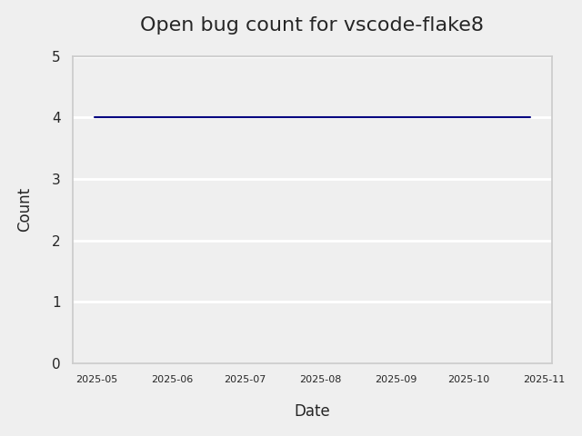
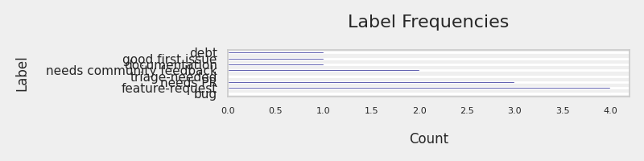
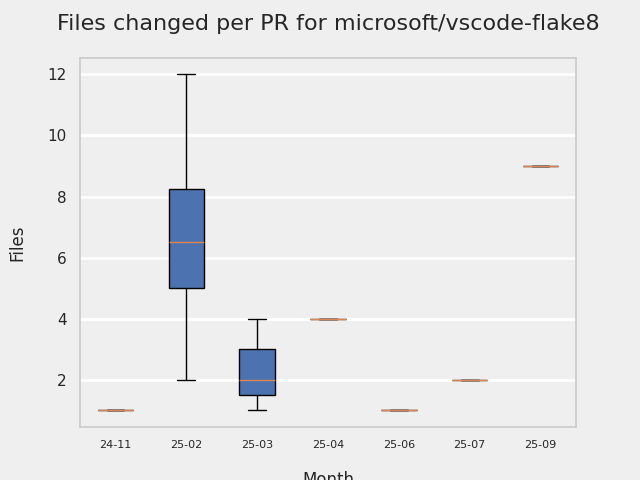
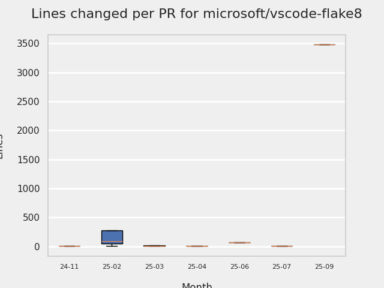

# GITHUB ISSUES REPORT FOR microsoft/vscode-flake8

Generated on 2025-11-02 using: stale=30, all=True

* marks items that are new to report in past 1 day(s)

## FOR ISSUES THAT ARE MARKED AS BUGS:

### Issues in vscode-flake8 that need a response from team:

| Days Ago | Issue | Title |
| --- | --- | --- |
 |  OP:367  |[331](https://github.com/microsoft/vscode-flake8/issues/331 "Add CWD to &quot;Server: Start failed&quot; trace output") | Add CWD to "Server: Start failed" trace output |

### Issues in vscode-flake8 that have comments from OP after last team response:

| Days Ago | Issue | Title |
| --- | --- | --- |
 |  TM:522, OP:510  |[318](https://github.com/microsoft/vscode-flake8/issues/318 "Allow the use of Flake8 plugins") | Allow the use of Flake8 plugins |
 |  TM:738, OP:738  |[242](https://github.com/microsoft/vscode-flake8/issues/242 "Linting silently fails when required plugin is missing") | Linting silently fails when required plugin is missing |

### Issues in vscode-flake8 that have comments from 3rd party after last team response:

| Days Ago | Issue | Title |
| --- | --- | --- |
 |  P:20,  |[340](https://github.com/microsoft/vscode-flake8/issues/340 "Flake8 does not applied arguments set in settings.json") | Flake8 does not applied arguments set in settings.json |

---

## FOR ISSUES THAT ARE NOT MARKED AS BUGS:

### Issues in vscode-flake8 that need a response from team:

| Days Ago | Issue | Title |
| --- | --- | --- |
 |  OP:733  |[244](https://github.com/microsoft/vscode-flake8/issues/244 "Project wide evaluation in this extension") | Project wide evaluation in this extension |

### Issues in vscode-flake8 that have comments from 3rd party after last team response:

| Days Ago | Issue | Title |
| --- | --- | --- |
 |  P:991,  |[7](https://github.com/microsoft/vscode-flake8/issues/7 "Cannot configure severity for partial error code") | Cannot configure severity for partial error code |

### Issues in vscode-flake8 that have no external responses since team response in 30+ days:

| Days Ago | Issue | Title |
| --- | --- | --- |
 |  TM:1053  |[92](https://github.com/microsoft/vscode-flake8/issues/92 "Add `VIRTUENV_BIN` to the list of supported predefined variables to resolve linter settings") | Add `VIRTUENV_BIN` to the list of supported predefined variables to resolve linter settings |

## MOST FREQUENTLY CHANGED FILES (by # of PRs):

  7: package-lock.json

  5: .github/actions/build-vsix/action.yml

  5: package.json

