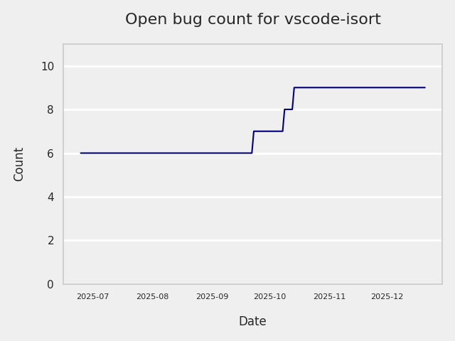
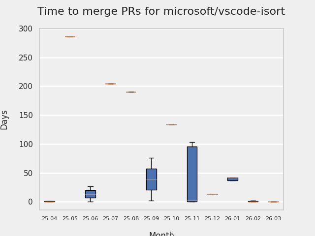
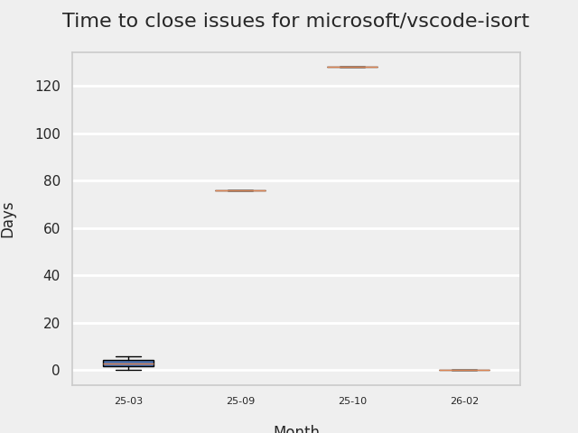
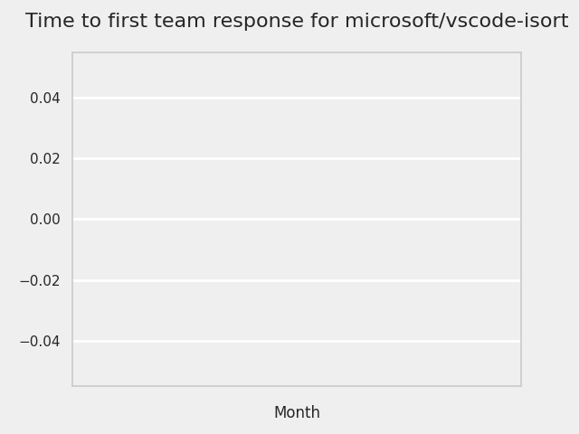
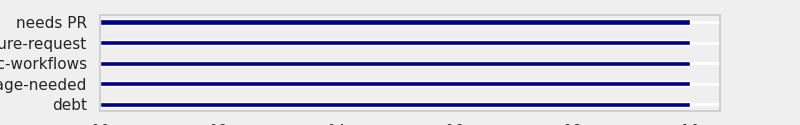
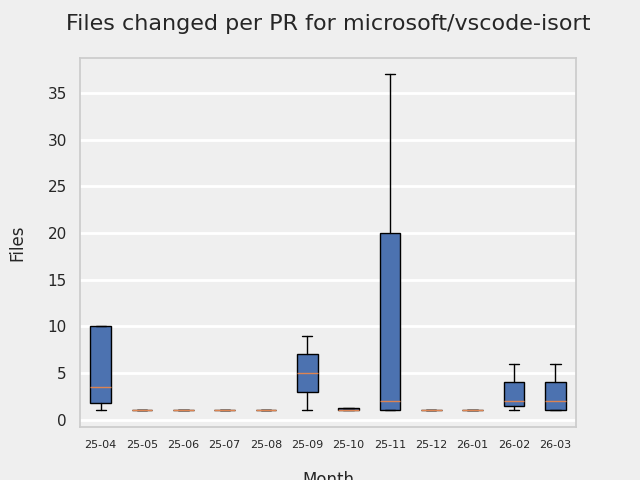
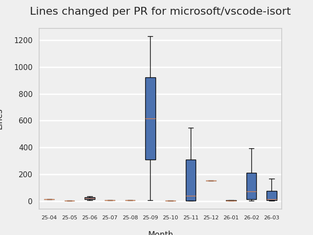

# GITHUB ISSUES REPORT FOR microsoft/vscode-isort

Generated on 2025-11-09 using: stale=30, all=True

* marks items that are new to report in past 1 day(s)

## FOR ISSUES THAT ARE MARKED AS BUGS:

### Issues in vscode-isort that need a response from team:

| Days Ago | Issue | Title |
| --- | --- | --- |
 |  OP:28  |[479](https://github.com/microsoft/vscode-isort/issues/479 "Python 3.14 sort is broken due to import") | Python 3.14 sort is broken due to import |
 |  OP:33  |[476](https://github.com/microsoft/vscode-isort/issues/476 "isort server segfaults on WSL") | isort server segfaults on WSL |
 |  OP:48  |[463](https://github.com/microsoft/vscode-isort/issues/463 "Multiple isort handlers getting registered") | Multiple isort handlers getting registered |
 |  OP:853  |[303](https://github.com/microsoft/vscode-isort/issues/303 "No `Organize Imports` or `Python Refactor: Sort Imports` options available in Jupyter Notebooks") | No `Organize Imports` or `Python Refactor: Sort Imports` options available in Jupyter Notebooks |

### Issues in vscode-isort that have comments from OP after last team response:

| Days Ago | Issue | Title |
| --- | --- | --- |
 |  TM:642, OP:641  |[384](https://github.com/microsoft/vscode-isort/issues/384 "Isort cannot handle line magic in jupyter notebook") | Isort cannot handle line magic in jupyter notebook |
 |  TM:1069, OP:1063  |[185](https://github.com/microsoft/vscode-isort/issues/185 "Keyboard focus is moved to end of file upon save in diff view") | Keyboard focus is moved to end of file upon save in diff view |

### Issues in vscode-isort that have comments from 3rd party after last team response:

| Days Ago | Issue | Title |
| --- | --- | --- |
 |  P:835,  |[243](https://github.com/microsoft/vscode-isort/issues/243 "&quot;no organize imports action available&quot; error on uncompleted code") | "no organize imports action available" error on uncompleted code |

### Issues in vscode-isort that have no external responses since team response in 30+ days:

| Days Ago | Issue | Title |
| --- | --- | --- |
 |  TM:677  |[362](https://github.com/microsoft/vscode-isort/issues/362 "Saving empty .py file in multi root workspace crashes isort.") | Saving empty .py file in multi root workspace crashes isort. |
 |  TM:698  |[160](https://github.com/microsoft/vscode-isort/issues/160 "Enabling the extension makes save very slow") | Enabling the extension makes save very slow |

---

## FOR ISSUES THAT ARE NOT MARKED AS BUGS:

### Issues in vscode-isort that need a response from team:

| Days Ago | Issue | Title |
| --- | --- | --- |
 |  OP:65  |[461](https://github.com/microsoft/vscode-isort/issues/461 "Bump Node to 22.x") | Bump Node to 22.x |
 |  OP:207  |[433](https://github.com/microsoft/vscode-isort/issues/433 "Feature Request: Split 1st Party Imports") | Feature Request: Split 1st Party Imports |
 |  OP:283  |[422](https://github.com/microsoft/vscode-isort/issues/422 "isort Server Unable to Start: ModuleNotFoundError: No module named 'typeguard._exceptions'") | isort Server Unable to Start: ModuleNotFoundError: No module named 'typeguard._exceptions' |

### Issues in vscode-isort that have comments from OP after last team response:

| Days Ago | Issue | Title |
| --- | --- | --- |
 |  TM:583, OP:488  |[409](https://github.com/microsoft/vscode-isort/issues/409 "Isort server crashed") | Isort server crashed |

### Issues in vscode-isort that have comments from 3rd party after last team response:

| Days Ago | Issue | Title |
| --- | --- | --- |
 |  P:463,  |[141](https://github.com/microsoft/vscode-isort/issues/141 "`python.linting.cwd`-equivalent setting for new extensions") | `python.linting.cwd`-equivalent setting for new extensions |
 |  P:1089,  |[71](https://github.com/microsoft/vscode-isort/issues/71 "Detect isort config files and restart server on change.") | Detect isort config files and restart server on change. |

### Issues in vscode-isort that have no external responses since team response in 30+ days:

| Days Ago | Issue | Title |
| --- | --- | --- |
 |  TM:566  |[410](https://github.com/microsoft/vscode-isort/issues/410 "[WinError 64] The specified network name is no longer available") | [WinError 64] The specified network name is no longer available |
 |  TM:729  |[347](https://github.com/microsoft/vscode-isort/issues/347 "Preview Tag on the offical store") | Preview Tag on the offical store |
 |  TM:619  |[343](https://github.com/microsoft/vscode-isort/issues/343 "Add the &quot;Sort Imports&quot; back to the context menu options as &quot;Organize Imports&quot;") | Add the "Sort Imports" back to the context menu options as "Organize Imports" |

## MOST FREQUENTLY CHANGED FILES (by # of PRs):

  9: package-lock.json

  6: package.json

