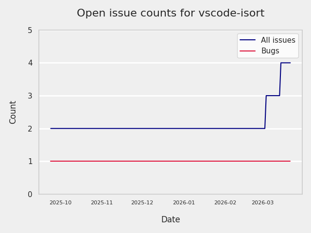
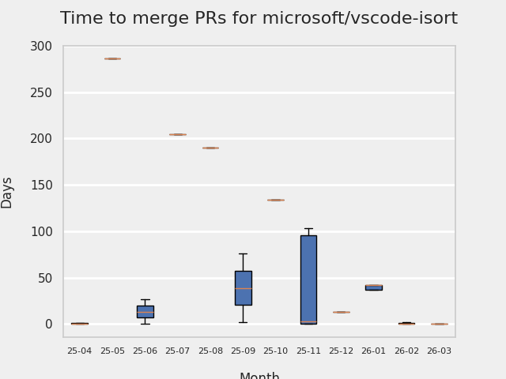
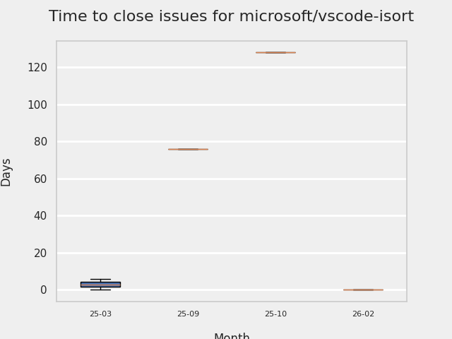
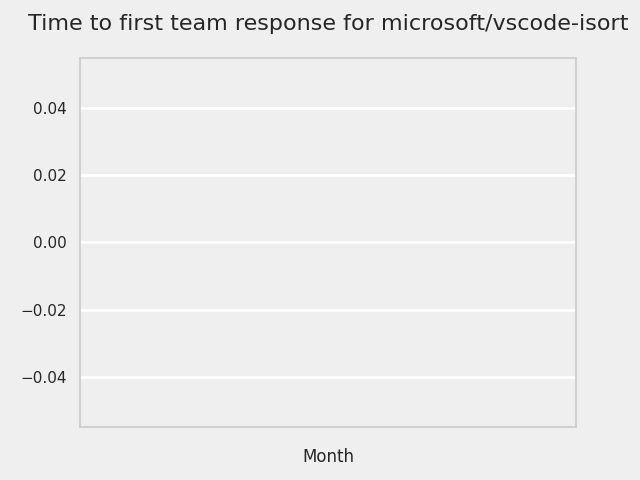
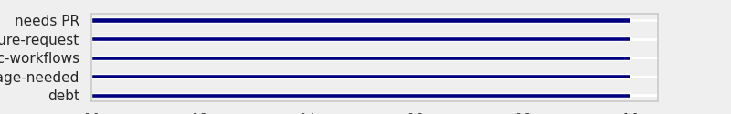
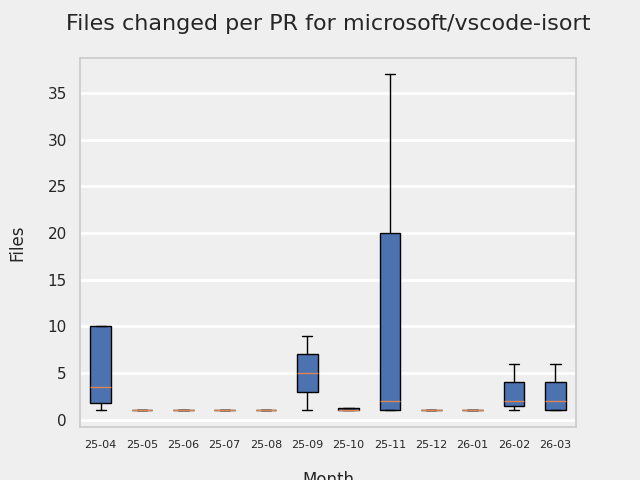
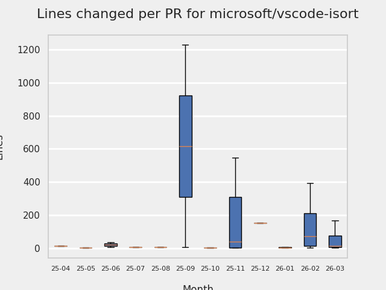
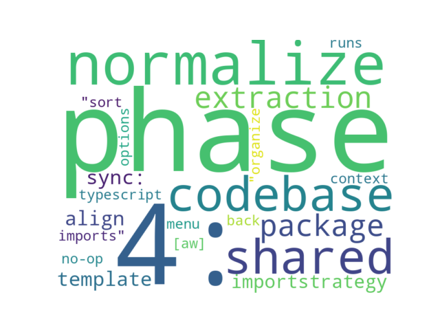

# GITHUB ISSUES REPORT FOR microsoft/vscode-isort

Generated on 2026-03-22 using: stale=30, all=True

* marks items that are new to report in past 7 day(s)

## FOR ISSUES THAT ARE MARKED AS BUGS:

### Issues in vscode-isort that have comments from 3rd party after last team response:

| Days Ago | Issue | Title |
| --- | --- | --- |
 |  P:19,  |[160](https://github.com/microsoft/vscode-isort/issues/160 "Enabling the extension makes save very slow") | Enabling the extension makes save very slow |

---

## FOR ISSUES THAT ARE NOT MARKED AS BUGS:

### Issues in vscode-isort that need a response from team:

| Days Ago | Issue | Title |
| --- | --- | --- |
 |  OP:8  |[591](https://github.com/microsoft/vscode-isort/issues/591 "Template Sync: align importStrategy in typescript to python") | Template Sync: align importStrategy in typescript to python |
 |  OP:19  |[566](https://github.com/microsoft/vscode-isort/issues/566 "[aw] No-Op Runs") | [aw] No-Op Runs |

### Issues in vscode-isort that have no external responses since team response in 30+ days:

| Days Ago | Issue | Title |
| --- | --- | --- |
 |  TM:752  |[343](https://github.com/microsoft/vscode-isort/issues/343 "Add the &quot;Sort Imports&quot; back to the context menu options as &quot;Organize Imports&quot;") | Add the "Sort Imports" back to the context menu options as "Organize Imports" |

## PULL REQUEST ACTIVITY

### Pull Requests opened in the past 7 day(s):

| | PR | Created By | Created | Days Open | Closed/Merged | Closed/Merged By | Title |
| --- | --- | --- | --- | --- | --- | --- | --- |
| \* | [#605](https://github.com/microsoft/vscode-isort/pull/605) | dependabot | 2026-03-20 | 2 | - | - | Bump flatted from 3.3.3 to 3.4.2 |
| \* | [#604](https://github.com/microsoft/vscode-isort/pull/604) | edvilme | 2026-03-20 | 0 | 2026-03-20 | edvilme | Automatic triggers for validation |
| \* | [#604](https://github.com/microsoft/vscode-isort/pull/604) | edvilme | 2026-03-20 | 0 | 2026-03-20 | edvilme | Automatic triggers for validation |
| \* | [#603](https://github.com/microsoft/vscode-isort/pull/603) | edvilme | 2026-03-20 | 0 | 2026-03-20 | - | Automatic triggers for validation |
| \* | [#602](https://github.com/microsoft/vscode-isort/pull/602) | dependabot | 2026-03-20 | 0 | 2026-03-20 | - | Bump pygls from 2.0.1 to 2.1.0 in the pip-minor-patch group |
| \* | [#601](https://github.com/microsoft/vscode-isort/pull/601) | copilot-swe-agent | 2026-03-20 | 0 | 2026-03-20 | edvilme | Bump pygls from 2.0.1 to 2.1.0 |
| \* | [#601](https://github.com/microsoft/vscode-isort/pull/601) | copilot-swe-agent | 2026-03-20 | 0 | 2026-03-20 | edvilme | Bump pygls from 2.0.1 to 2.1.0 |
| \* | [#600](https://github.com/microsoft/vscode-isort/pull/600) | edvilme | 2026-03-20 | 0 | 2026-03-20 | edvilme | Fix template sync: limit to 48h PRs, prevent duplicate issues |
| \* | [#600](https://github.com/microsoft/vscode-isort/pull/600) | edvilme | 2026-03-20 | 0 | 2026-03-20 | edvilme | Fix template sync: limit to 48h PRs, prevent duplicate issues |
| \* | [#598](https://github.com/microsoft/vscode-isort/pull/598) | dependabot | 2026-03-18 | 4 | - | - | Bump the npm-minor-patch group across 1 directory with 13 updates |
| \* | [#597](https://github.com/microsoft/vscode-isort/pull/597) | copilot-swe-agent | 2026-03-18 | 0 | 2026-03-18 | edvilme | chore: remove unused and redundant devDependencies |
| \* | [#597](https://github.com/microsoft/vscode-isort/pull/597) | copilot-swe-agent | 2026-03-18 | 0 | 2026-03-18 | edvilme | chore: remove unused and redundant devDependencies |
| \* | [#596](https://github.com/microsoft/vscode-isort/pull/596) | dependabot | 2026-03-18 | 4 | - | - | Bump ujson from 5.10.0 to 5.12.0 in /src/test/python_tests |
| \* | [#595](https://github.com/microsoft/vscode-isort/pull/595) | dependabot | 2026-03-17 | 1 | 2026-03-18 | - | Bump the npm-minor-patch group across 1 directory with 16 updates |
| \* | [#594](https://github.com/microsoft/vscode-isort/pull/594) | bschnurr | 2026-03-16 | 0 | 2026-03-16 | bschnurr | Update validation pipeline for main and release branches |
| \* | [#594](https://github.com/microsoft/vscode-isort/pull/594) | bschnurr | 2026-03-16 | 0 | 2026-03-16 | bschnurr | Update validation pipeline for main and release branches |
| \* | [#593](https://github.com/microsoft/vscode-isort/pull/593) | bschnurr | 2026-03-16 | 1 | 2026-03-17 | bschnurr | update python environments |
| \* | [#593](https://github.com/microsoft/vscode-isort/pull/593) | bschnurr | 2026-03-16 | 1 | 2026-03-17 | bschnurr | update python environments |

### Pull Requests merged in the past 7 day(s):

| | PR | Created By | Created | Days Open | Closed/Merged | Closed/Merged By | Title |
| --- | --- | --- | --- | --- | --- | --- | --- |
| \* | [#601](https://github.com/microsoft/vscode-isort/pull/601) | copilot-swe-agent | 2026-03-20 | 0 | 2026-03-20 | edvilme | Bump pygls from 2.0.1 to 2.1.0 |
| \* | [#601](https://github.com/microsoft/vscode-isort/pull/601) | copilot-swe-agent | 2026-03-20 | 0 | 2026-03-20 | edvilme | Bump pygls from 2.0.1 to 2.1.0 |
| \* | [#600](https://github.com/microsoft/vscode-isort/pull/600) | edvilme | 2026-03-20 | 0 | 2026-03-20 | edvilme | Fix template sync: limit to 48h PRs, prevent duplicate issues |
| \* | [#600](https://github.com/microsoft/vscode-isort/pull/600) | edvilme | 2026-03-20 | 0 | 2026-03-20 | edvilme | Fix template sync: limit to 48h PRs, prevent duplicate issues |
| \* | [#604](https://github.com/microsoft/vscode-isort/pull/604) | edvilme | 2026-03-20 | 0 | 2026-03-20 | edvilme | Automatic triggers for validation |
| \* | [#604](https://github.com/microsoft/vscode-isort/pull/604) | edvilme | 2026-03-20 | 0 | 2026-03-20 | edvilme | Automatic triggers for validation |
| \* | [#597](https://github.com/microsoft/vscode-isort/pull/597) | copilot-swe-agent | 2026-03-18 | 0 | 2026-03-18 | edvilme | chore: remove unused and redundant devDependencies |
| \* | [#597](https://github.com/microsoft/vscode-isort/pull/597) | copilot-swe-agent | 2026-03-18 | 0 | 2026-03-18 | edvilme | chore: remove unused and redundant devDependencies |
| \* | [#593](https://github.com/microsoft/vscode-isort/pull/593) | bschnurr | 2026-03-16 | 1 | 2026-03-17 | bschnurr | update python environments |
| \* | [#593](https://github.com/microsoft/vscode-isort/pull/593) | bschnurr | 2026-03-16 | 1 | 2026-03-17 | bschnurr | update python environments |
| \* | [#594](https://github.com/microsoft/vscode-isort/pull/594) | bschnurr | 2026-03-16 | 0 | 2026-03-16 | bschnurr | Update validation pipeline for main and release branches |
| \* | [#594](https://github.com/microsoft/vscode-isort/pull/594) | bschnurr | 2026-03-16 | 0 | 2026-03-16 | bschnurr | Update validation pipeline for main and release branches |
| \* | [#588](https://github.com/microsoft/vscode-isort/pull/588) | edvilme | 2026-03-13 | 3 | 2026-03-16 | bschnurr | Update validation triggers |
| \* | [#588](https://github.com/microsoft/vscode-isort/pull/588) | edvilme | 2026-03-13 | 3 | 2026-03-16 | bschnurr | Update validation triggers |

### Pull Requests closed (not merged) in the past 7 day(s):

| | PR | Created By | Created | Days Open | Closed/Merged | Closed/Merged By | Title |
| --- | --- | --- | --- | --- | --- | --- | --- |
| \* | [#602](https://github.com/microsoft/vscode-isort/pull/602) | dependabot | 2026-03-20 | 0 | 2026-03-20 | - | Bump pygls from 2.0.1 to 2.1.0 in the pip-minor-patch group |
| \* | [#603](https://github.com/microsoft/vscode-isort/pull/603) | edvilme | 2026-03-20 | 0 | 2026-03-20 | - | Automatic triggers for validation |
| \* | [#595](https://github.com/microsoft/vscode-isort/pull/595) | dependabot | 2026-03-17 | 1 | 2026-03-18 | - | Bump the npm-minor-patch group across 1 directory with 16 updates |
| \* | [#582](https://github.com/microsoft/vscode-isort/pull/582) | dependabot | 2026-03-10 | 6 | 2026-03-17 | - | Bump the npm-minor-patch group across 1 directory with 14 updates |

### Pull Requests still open that were opened more than 7 days ago:

| | PR | Created By | Created | Days Open | Closed/Merged | Closed/Merged By | Title |
| --- | --- | --- | --- | --- | --- | --- | --- |
| \* | [#518](https://github.com/microsoft/vscode-isort/pull/518) | dependabot | 2026-02-13 | 37 | - | - | Bump pytest from 8.3.5 to 9.0.2 in /src/test/python_tests |
| \* | [#552](https://github.com/microsoft/vscode-isort/pull/552) | dependabot | 2026-02-27 | 23 | - | - | Bump eslint from 9.35.0 to 10.0.2 |
| \* | [#567](https://github.com/microsoft/vscode-isort/pull/567) | dependabot | 2026-03-04 | 18 | - | - | Bump @tootallnate/once and @vscode/test-electron |
|   | [#581](https://github.com/microsoft/vscode-isort/pull/581) | bschnurr | 2026-03-10 | 12 | - | - | Bump version to 2026.3.0-dev |
|   | [#584](https://github.com/microsoft/vscode-isort/pull/584) | copilot-swe-agent | 2026-03-10 | 11 | - | - | Fix bundled LSP paths always inserted at front of sys.path regardless of importStrategy |
|   | [#589](https://github.com/microsoft/vscode-isort/pull/589) | dependabot | 2026-03-13 | 9 | - | - | Bump the github-actions-minor-patch group with 2 updates |

## RECENTLY CLOSED ISSUES

### Issues closed in the past 7 day(s):

| Days Ago | Issue | Title |
| --- | --- | --- |
 | \* TM:5  |[592](https://github.com/microsoft/vscode-isort/issues/592 "Template Sync: Fix duplicate server handlers on concurrent restarts")  |Template Sync: Fix duplicate server handlers on concurrent restarts |
 | \* TM:1  |[599](https://github.com/microsoft/vscode-isort/issues/599 "Template Sync: pip(deps): bump pygls from 2.0.1 to 2.1.0")  |Template Sync: pip(deps): bump pygls from 2.0.1 to 2.1.0 |

## MOST FREQUENTLY CHANGED FILES (by # of PRs):

 30: package-lock.json

 19: package.json

 10: .github/workflows/check-python-versions.lock.yml

  8: .github/workflows/pr-check.yml

  7: build/azure-pipeline.validation.yml

  7: requirements.txt

  7: .github/workflows/issue-triage.lock.yml

  7: build/azure-devdiv-pipeline.pre-release.yml

  7: bundled/tool/lsp_server.py

  7: .github/actions/build-vsix/action.yml

  6: .github/workflows/extension-template-sync.lock.yml

  6: .github/workflows/push-check.yml

  6: build/azure-devdiv-pipeline.stable.yml

  5: .npmrc

  5: .github/actions/lint/action.yml

