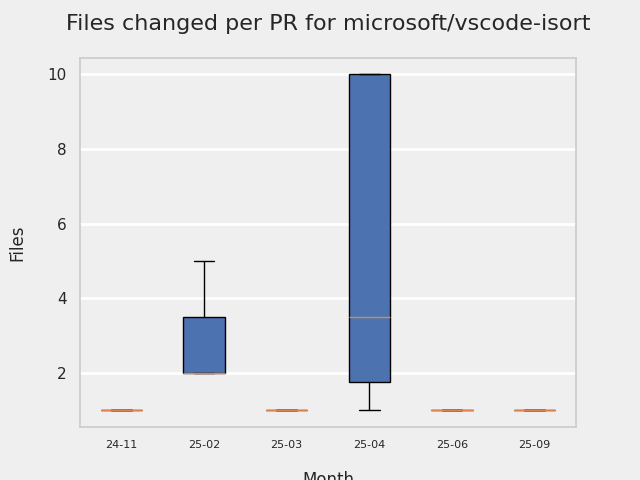

# GITHUB ISSUES REPORT FOR microsoft/vscode-isort

Generated on 2026-02-23 using: stale=30, all=True

* marks items that are new to report in past 7 day(s)

## FOR ISSUES THAT ARE MARKED AS BUGS:

### Issues in vscode-isort that need a response from team:

| Days Ago | Issue | Title |
| --- | --- | --- |
 |  OP:139  |[476](https://github.com/microsoft/vscode-isort/issues/476 "isort server segfaults on WSL") | isort server segfaults on WSL |
 |  OP:154  |[463](https://github.com/microsoft/vscode-isort/issues/463 "Multiple isort handlers getting registered") | Multiple isort handlers getting registered |
 |  OP:959  |[303](https://github.com/microsoft/vscode-isort/issues/303 "No `Organize Imports` or `Python Refactor: Sort Imports` options available in Jupyter Notebooks") | No `Organize Imports` or `Python Refactor: Sort Imports` options available in Jupyter Notebooks |

### Issues in vscode-isort that have comments from 3rd party after last team response:

| Days Ago | Issue | Title |
| --- | --- | --- |
 |  P:941,  |[243](https://github.com/microsoft/vscode-isort/issues/243 "&quot;no organize imports action available&quot; error on uncompleted code") | "no organize imports action available" error on uncompleted code |

### Issues in vscode-isort that have no external responses since team response in 30+ days:

| Days Ago | Issue | Title |
| --- | --- | --- |
 |  TM:804  |[160](https://github.com/microsoft/vscode-isort/issues/160 "Enabling the extension makes save very slow") | Enabling the extension makes save very slow |

---

## FOR ISSUES THAT ARE NOT MARKED AS BUGS:

### Issues in vscode-isort that need a response from team:

| Days Ago | Issue | Title |
| --- | --- | --- |
 |  OP:313  |[433](https://github.com/microsoft/vscode-isort/issues/433 "Feature Request: Split 1st Party Imports") | Feature Request: Split 1st Party Imports |

### Issues in vscode-isort that have comments from OP after last team response:

| Days Ago | Issue | Title |
| --- | --- | --- |
 |  TM:689, OP:594  |[409](https://github.com/microsoft/vscode-isort/issues/409 "Isort server crashed") | Isort server crashed |

### Issues in vscode-isort that have comments from 3rd party after last team response:

| Days Ago | Issue | Title |
| --- | --- | --- |
 |  P:569,  |[141](https://github.com/microsoft/vscode-isort/issues/141 "`python.linting.cwd`-equivalent setting for new extensions") | `python.linting.cwd`-equivalent setting for new extensions |

### Issues in vscode-isort that have no external responses since team response in 30+ days:

| Days Ago | Issue | Title |
| --- | --- | --- |
 |  TM:672  |[410](https://github.com/microsoft/vscode-isort/issues/410 "[WinError 64] The specified network name is no longer available") | [WinError 64] The specified network name is no longer available |
 |  TM:725  |[343](https://github.com/microsoft/vscode-isort/issues/343 "Add the &quot;Sort Imports&quot; back to the context menu options as &quot;Organize Imports&quot;") | Add the "Sort Imports" back to the context menu options as "Organize Imports" |

## PULL REQUEST ACTIVITY

### Pull Requests opened in the past 7 day(s):

| | PR | Created By | Created | Days Open | Closed/Merged | Closed/Merged By | Title |
| --- | --- | --- | --- | --- | --- | --- | --- |
| \* | [#535](https://github.com/microsoft/vscode-isort/pull/535) | bschnurr | 2026-02-23 | 0 | - | - | Add PR creation skill for Copilot |
| \* | [#534](https://github.com/microsoft/vscode-isort/pull/534) | bschnurr | 2026-02-23 | 0 | 2026-02-23 | bschnurr | Disable CI trigger in stable pipeline |
| \* | [#534](https://github.com/microsoft/vscode-isort/pull/534) | bschnurr | 2026-02-23 | 0 | 2026-02-23 | bschnurr | Disable CI trigger in stable pipeline |
| \* | [#533](https://github.com/microsoft/vscode-isort/pull/533) | bschnurr | 2026-02-23 | 0 | 2026-02-23 | bschnurr | add files for signing. switch back to main branch of templates |
| \* | [#533](https://github.com/microsoft/vscode-isort/pull/533) | bschnurr | 2026-02-23 | 0 | 2026-02-23 | bschnurr | add files for signing. switch back to main branch of templates |
| \* | [#532](https://github.com/microsoft/vscode-isort/pull/532) | bschnurr | 2026-02-20 | 0 | 2026-02-20 | bschnurr | try to use dev branch from pylance-eng |
| \* | [#532](https://github.com/microsoft/vscode-isort/pull/532) | bschnurr | 2026-02-20 | 0 | 2026-02-20 | bschnurr | try to use dev branch from pylance-eng |
| \* | [#531](https://github.com/microsoft/vscode-isort/pull/531) | edvilme | 2026-02-20 | 2 | 2026-02-23 | edvilme | Agentic Workflows: Check issues on Python Tools Extension Template |
| \* | [#531](https://github.com/microsoft/vscode-isort/pull/531) | edvilme | 2026-02-20 | 2 | 2026-02-23 | edvilme | Agentic Workflows: Check issues on Python Tools Extension Template |
| \* | [#530](https://github.com/microsoft/vscode-isort/pull/530) | dependabot | 2026-02-20 | 3 | - | - | Bump actions/download-artifact from 6.0.0 to 7.0.0 |
| \* | [#529](https://github.com/microsoft/vscode-isort/pull/529) | dependabot | 2026-02-20 | 3 | - | - | Bump github/gh-aw from 0.43.22 to 0.47.3 in the github-actions-minor-patch group |
| \* | [#528](https://github.com/microsoft/vscode-isort/pull/528) | dependabot | 2026-02-20 | 3 | - | - | Bump isort from 7.0.0 to 8.0.0 |
| \* | [#527](https://github.com/microsoft/vscode-isort/pull/527) | edvilme | 2026-02-19 | 0 | 2026-02-19 | edvilme | Agentic Workflow: Update Python versions using JSON endpoint |
| \* | [#527](https://github.com/microsoft/vscode-isort/pull/527) | edvilme | 2026-02-19 | 0 | 2026-02-19 | edvilme | Agentic Workflow: Update Python versions using JSON endpoint |
| \* | [#526](https://github.com/microsoft/vscode-isort/pull/526) | bschnurr | 2026-02-18 | 0 | 2026-02-18 | bschnurr | update stable pipeline to gen github release |
| \* | [#526](https://github.com/microsoft/vscode-isort/pull/526) | bschnurr | 2026-02-18 | 0 | 2026-02-18 | bschnurr | update stable pipeline to gen github release |
| \* | [#525](https://github.com/microsoft/vscode-isort/pull/525) | copilot-swe-agent | 2026-02-18 | 0 | 2026-02-18 | edvilme | Fix cursor jump in diff view when saving unchanged Python files |
| \* | [#525](https://github.com/microsoft/vscode-isort/pull/525) | copilot-swe-agent | 2026-02-18 | 0 | 2026-02-18 | edvilme | Fix cursor jump in diff view when saving unchanged Python files |
| \* | [#524](https://github.com/microsoft/vscode-isort/pull/524) | bschnurr | 2026-02-17 | 0 | 2026-02-18 | bschnurr | set sdl pool |
| \* | [#524](https://github.com/microsoft/vscode-isort/pull/524) | bschnurr | 2026-02-17 | 0 | 2026-02-18 | bschnurr | set sdl pool |
| \* | [#523](https://github.com/microsoft/vscode-isort/pull/523) | edvilme | 2026-02-17 | 0 | 2026-02-18 | edvilme | Ignore Magic Lines |
| \* | [#523](https://github.com/microsoft/vscode-isort/pull/523) | edvilme | 2026-02-17 | 0 | 2026-02-18 | edvilme | Ignore Magic Lines |
| \* | [#522](https://github.com/microsoft/vscode-isort/pull/522) | edvilme | 2026-02-17 | 0 | 2026-02-17 | edvilme | Check for `None` on `_run_tool_on_document` |
| \* | [#522](https://github.com/microsoft/vscode-isort/pull/522) | edvilme | 2026-02-17 | 0 | 2026-02-17 | edvilme | Check for `None` on `_run_tool_on_document` |
| \* | [#521](https://github.com/microsoft/vscode-isort/pull/521) | copilot-swe-agent | 2026-02-17 | 0 | 2026-02-17 | edvilme | Update isort to 7.0.0 for Python 3.14 compatibility |
| \* | [#521](https://github.com/microsoft/vscode-isort/pull/521) | copilot-swe-agent | 2026-02-17 | 0 | 2026-02-17 | edvilme | Update isort to 7.0.0 for Python 3.14 compatibility |
| \* | [#520](https://github.com/microsoft/vscode-isort/pull/520) | edvilme | 2026-02-17 | 0 | 2026-02-17 | edvilme | Agentic Workflow: Update Python requirements anually |
| \* | [#520](https://github.com/microsoft/vscode-isort/pull/520) | edvilme | 2026-02-17 | 0 | 2026-02-17 | edvilme | Agentic Workflow: Update Python requirements anually |

### Pull Requests merged in the past 7 day(s):

| | PR | Created By | Created | Days Open | Closed/Merged | Closed/Merged By | Title |
| --- | --- | --- | --- | --- | --- | --- | --- |
| \* | [#534](https://github.com/microsoft/vscode-isort/pull/534) | bschnurr | 2026-02-23 | 0 | 2026-02-23 | bschnurr | Disable CI trigger in stable pipeline |
| \* | [#534](https://github.com/microsoft/vscode-isort/pull/534) | bschnurr | 2026-02-23 | 0 | 2026-02-23 | bschnurr | Disable CI trigger in stable pipeline |
| \* | [#531](https://github.com/microsoft/vscode-isort/pull/531) | edvilme | 2026-02-20 | 2 | 2026-02-23 | edvilme | Agentic Workflows: Check issues on Python Tools Extension Template |
| \* | [#531](https://github.com/microsoft/vscode-isort/pull/531) | edvilme | 2026-02-20 | 2 | 2026-02-23 | edvilme | Agentic Workflows: Check issues on Python Tools Extension Template |
| \* | [#533](https://github.com/microsoft/vscode-isort/pull/533) | bschnurr | 2026-02-23 | 0 | 2026-02-23 | bschnurr | add files for signing. switch back to main branch of templates |
| \* | [#533](https://github.com/microsoft/vscode-isort/pull/533) | bschnurr | 2026-02-23 | 0 | 2026-02-23 | bschnurr | add files for signing. switch back to main branch of templates |
| \* | [#532](https://github.com/microsoft/vscode-isort/pull/532) | bschnurr | 2026-02-20 | 0 | 2026-02-20 | bschnurr | try to use dev branch from pylance-eng |
| \* | [#532](https://github.com/microsoft/vscode-isort/pull/532) | bschnurr | 2026-02-20 | 0 | 2026-02-20 | bschnurr | try to use dev branch from pylance-eng |
| \* | [#527](https://github.com/microsoft/vscode-isort/pull/527) | edvilme | 2026-02-19 | 0 | 2026-02-19 | edvilme | Agentic Workflow: Update Python versions using JSON endpoint |
| \* | [#527](https://github.com/microsoft/vscode-isort/pull/527) | edvilme | 2026-02-19 | 0 | 2026-02-19 | edvilme | Agentic Workflow: Update Python versions using JSON endpoint |
| \* | [#526](https://github.com/microsoft/vscode-isort/pull/526) | bschnurr | 2026-02-18 | 0 | 2026-02-18 | bschnurr | update stable pipeline to gen github release |
| \* | [#526](https://github.com/microsoft/vscode-isort/pull/526) | bschnurr | 2026-02-18 | 0 | 2026-02-18 | bschnurr | update stable pipeline to gen github release |
| \* | [#525](https://github.com/microsoft/vscode-isort/pull/525) | copilot-swe-agent | 2026-02-18 | 0 | 2026-02-18 | edvilme | Fix cursor jump in diff view when saving unchanged Python files |
| \* | [#525](https://github.com/microsoft/vscode-isort/pull/525) | copilot-swe-agent | 2026-02-18 | 0 | 2026-02-18 | edvilme | Fix cursor jump in diff view when saving unchanged Python files |
| \* | [#523](https://github.com/microsoft/vscode-isort/pull/523) | edvilme | 2026-02-17 | 0 | 2026-02-18 | edvilme | Ignore Magic Lines |
| \* | [#523](https://github.com/microsoft/vscode-isort/pull/523) | edvilme | 2026-02-17 | 0 | 2026-02-18 | edvilme | Ignore Magic Lines |
| \* | [#524](https://github.com/microsoft/vscode-isort/pull/524) | bschnurr | 2026-02-17 | 0 | 2026-02-18 | bschnurr | set sdl pool |
| \* | [#524](https://github.com/microsoft/vscode-isort/pull/524) | bschnurr | 2026-02-17 | 0 | 2026-02-18 | bschnurr | set sdl pool |
| \* | [#522](https://github.com/microsoft/vscode-isort/pull/522) | edvilme | 2026-02-17 | 0 | 2026-02-17 | edvilme | Check for `None` on `_run_tool_on_document` |
| \* | [#522](https://github.com/microsoft/vscode-isort/pull/522) | edvilme | 2026-02-17 | 0 | 2026-02-17 | edvilme | Check for `None` on `_run_tool_on_document` |
| \* | [#521](https://github.com/microsoft/vscode-isort/pull/521) | copilot-swe-agent | 2026-02-17 | 0 | 2026-02-17 | edvilme | Update isort to 7.0.0 for Python 3.14 compatibility |
| \* | [#521](https://github.com/microsoft/vscode-isort/pull/521) | copilot-swe-agent | 2026-02-17 | 0 | 2026-02-17 | edvilme | Update isort to 7.0.0 for Python 3.14 compatibility |
| \* | [#520](https://github.com/microsoft/vscode-isort/pull/520) | edvilme | 2026-02-17 | 0 | 2026-02-17 | edvilme | Agentic Workflow: Update Python requirements anually |
| \* | [#520](https://github.com/microsoft/vscode-isort/pull/520) | edvilme | 2026-02-17 | 0 | 2026-02-17 | edvilme | Agentic Workflow: Update Python requirements anually |

### Pull Requests still open that were opened more than 7 days ago:

| | PR | Created By | Created | Days Open | Closed/Merged | Closed/Merged By | Title |
| --- | --- | --- | --- | --- | --- | --- | --- |
|   | [#517](https://github.com/microsoft/vscode-isort/pull/517) | dependabot | 2026-02-12 | 11 | - | - | Bump the npm-minor-patch group across 1 directory with 17 updates |
|   | [#518](https://github.com/microsoft/vscode-isort/pull/518) | dependabot | 2026-02-13 | 10 | - | - | Bump pytest from 8.3.5 to 9.0.2 in /src/test/python_tests |

## RECENTLY CLOSED ISSUES

### Issues closed in the past 7 day(s):

| Days Ago | Issue | Title |
| --- | --- | --- |
 | \* TM:128  |[479](https://github.com/microsoft/vscode-isort/issues/479 "Python 3.14 sort is broken due to import")  |Python 3.14 sort is broken due to import |

## MOST FREQUENTLY CHANGED FILES (by # of PRs):

 18: package-lock.json

 10: package.json

  7: .github/actions/build-vsix/action.yml

  7: .github/workflows/pr-check.yml

  6: build/azure-devdiv-pipeline.stable.yml

  6: build/azure-devdiv-pipeline.pre-release.yml

  5: bundled/tool/lsp_server.py

  5: requirements.txt

  5: .github/actions/lint/action.yml

  5: .github/workflows/push-check.yml

