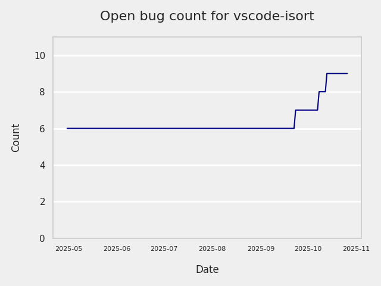
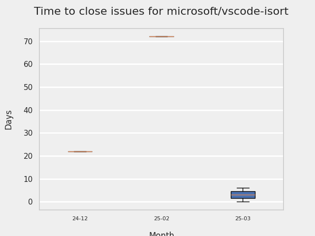
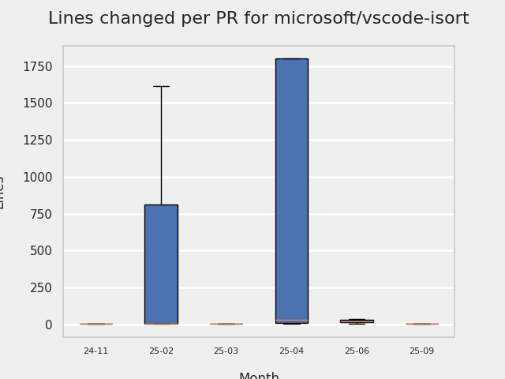

# GITHUB ISSUES REPORT FOR microsoft/vscode-isort

Generated on 2026-02-08 using: stale=30, all=True

* marks items that are new to report in past 7 day(s)

## FOR ISSUES THAT ARE MARKED AS BUGS:

### Issues in vscode-isort that need a response from team:

| Days Ago | Issue | Title |
| --- | --- | --- |
 |  OP:119  |[479](https://github.com/microsoft/vscode-isort/issues/479 "Python 3.14 sort is broken due to import") | Python 3.14 sort is broken due to import |
 |  OP:124  |[476](https://github.com/microsoft/vscode-isort/issues/476 "isort server segfaults on WSL") | isort server segfaults on WSL |
 |  OP:139  |[463](https://github.com/microsoft/vscode-isort/issues/463 "Multiple isort handlers getting registered") | Multiple isort handlers getting registered |
 |  OP:944  |[303](https://github.com/microsoft/vscode-isort/issues/303 "No `Organize Imports` or `Python Refactor: Sort Imports` options available in Jupyter Notebooks") | No `Organize Imports` or `Python Refactor: Sort Imports` options available in Jupyter Notebooks |

### Issues in vscode-isort that have comments from OP after last team response:

| Days Ago | Issue | Title |
| --- | --- | --- |
 |  TM:733, OP:732  |[384](https://github.com/microsoft/vscode-isort/issues/384 "Isort cannot handle line magic in jupyter notebook") | Isort cannot handle line magic in jupyter notebook |
 |  TM:1160, OP:1154  |[185](https://github.com/microsoft/vscode-isort/issues/185 "Keyboard focus is moved to end of file upon save in diff view") | Keyboard focus is moved to end of file upon save in diff view |

### Issues in vscode-isort that have comments from 3rd party after last team response:

| Days Ago | Issue | Title |
| --- | --- | --- |
 |  P:926,  |[243](https://github.com/microsoft/vscode-isort/issues/243 "&quot;no organize imports action available&quot; error on uncompleted code") | "no organize imports action available" error on uncompleted code |

### Issues in vscode-isort that have no external responses since team response in 30+ days:

| Days Ago | Issue | Title |
| --- | --- | --- |
 |  TM:768  |[362](https://github.com/microsoft/vscode-isort/issues/362 "Saving empty .py file in multi root workspace crashes isort.") | Saving empty .py file in multi root workspace crashes isort. |
 |  TM:789  |[160](https://github.com/microsoft/vscode-isort/issues/160 "Enabling the extension makes save very slow") | Enabling the extension makes save very slow |

---

## FOR ISSUES THAT ARE NOT MARKED AS BUGS:

### Issues in vscode-isort that need a response from team:

| Days Ago | Issue | Title |
| --- | --- | --- |
 |  OP:298  |[433](https://github.com/microsoft/vscode-isort/issues/433 "Feature Request: Split 1st Party Imports") | Feature Request: Split 1st Party Imports |
 |  OP:374  |[422](https://github.com/microsoft/vscode-isort/issues/422 "isort Server Unable to Start: ModuleNotFoundError: No module named 'typeguard._exceptions'") | isort Server Unable to Start: ModuleNotFoundError: No module named 'typeguard._exceptions' |

### Issues in vscode-isort that have comments from OP after last team response:

| Days Ago | Issue | Title |
| --- | --- | --- |
 |  TM:674, OP:579  |[409](https://github.com/microsoft/vscode-isort/issues/409 "Isort server crashed") | Isort server crashed |

### Issues in vscode-isort that have comments from 3rd party after last team response:

| Days Ago | Issue | Title |
| --- | --- | --- |
 |  P:554,  |[141](https://github.com/microsoft/vscode-isort/issues/141 "`python.linting.cwd`-equivalent setting for new extensions") | `python.linting.cwd`-equivalent setting for new extensions |

### Issues in vscode-isort that have no external responses since team response in 30+ days:

| Days Ago | Issue | Title |
| --- | --- | --- |
 |  TM:657  |[410](https://github.com/microsoft/vscode-isort/issues/410 "[WinError 64] The specified network name is no longer available") | [WinError 64] The specified network name is no longer available |
 |  TM:710  |[343](https://github.com/microsoft/vscode-isort/issues/343 "Add the &quot;Sort Imports&quot; back to the context menu options as &quot;Organize Imports&quot;") | Add the "Sort Imports" back to the context menu options as "Organize Imports" |

## PULL REQUEST ACTIVITY

### Pull Requests opened in the past 7 day(s):

| | PR | Created By | Created | Days Open | Closed/Merged | Closed/Merged By | Title |
| --- | --- | --- | --- | --- | --- | --- | --- |
| \* | [#502](https://github.com/microsoft/vscode-isort/pull/502) | dependabot | 2026-02-07 | 1 | - | - | Bump webpack from 5.101.3 to 5.105.0 |
| \* | [#501](https://github.com/microsoft/vscode-isort/pull/501) | bschnurr | 2026-02-06 | 0 | 2026-02-06 | bschnurr | Use pipeline templates |
| \* | [#501](https://github.com/microsoft/vscode-isort/pull/501) | bschnurr | 2026-02-06 | 0 | 2026-02-06 | bschnurr | Use pipeline templates |
| \* | [#500](https://github.com/microsoft/vscode-isort/pull/500) | edvilme | 2026-02-05 | 0 | 2026-02-06 | edvilme | Watch config files and restart server |
| \* | [#500](https://github.com/microsoft/vscode-isort/pull/500) | edvilme | 2026-02-05 | 0 | 2026-02-06 | edvilme | Watch config files and restart server |

### Pull Requests merged in the past 7 day(s):

| | PR | Created By | Created | Days Open | Closed/Merged | Closed/Merged By | Title |
| --- | --- | --- | --- | --- | --- | --- | --- |
| \* | [#500](https://github.com/microsoft/vscode-isort/pull/500) | edvilme | 2026-02-05 | 0 | 2026-02-06 | edvilme | Watch config files and restart server |
| \* | [#500](https://github.com/microsoft/vscode-isort/pull/500) | edvilme | 2026-02-05 | 0 | 2026-02-06 | edvilme | Watch config files and restart server |
| \* | [#501](https://github.com/microsoft/vscode-isort/pull/501) | bschnurr | 2026-02-06 | 0 | 2026-02-06 | bschnurr | Use pipeline templates |
| \* | [#501](https://github.com/microsoft/vscode-isort/pull/501) | bschnurr | 2026-02-06 | 0 | 2026-02-06 | bschnurr | Use pipeline templates |

### Pull Requests still open that were opened more than 7 days ago:

| | PR | Created By | Created | Days Open | Closed/Merged | Closed/Merged By | Title |
| --- | --- | --- | --- | --- | --- | --- | --- |
| \* | [#440](https://github.com/microsoft/vscode-isort/pull/440) | dependabot | 2025-05-01 | 283 | - | - | Bump GabrielBB/xvfb-action from 1.6 to 1.7 |
| \* | [#448](https://github.com/microsoft/vscode-isort/pull/448) | dependabot | 2025-06-18 | 235 | - | - | Bump pytest from 8.3.5 to 8.4.1 in /src/test/python_tests |
| \* | [#450](https://github.com/microsoft/vscode-isort/pull/450) | dependabot | 2025-07-01 | 222 | - | - | Bump chai and @types/chai |
| \* | [#452](https://github.com/microsoft/vscode-isort/pull/452) | dependabot | 2025-07-01 | 222 | - | - | Bump sinon from 17.0.1 to 21.0.0 |
| \* | [#453](https://github.com/microsoft/vscode-isort/pull/453) | dependabot | 2025-07-22 | 201 | - | - | Bump form-data from 4.0.2 to 4.0.4 |
| \* | [#456](https://github.com/microsoft/vscode-isort/pull/456) | dependabot | 2025-08-06 | 186 | - | - | Bump tmp from 0.2.3 to 0.2.4 |
| \* | [#459](https://github.com/microsoft/vscode-isort/pull/459) | dependabot | 2025-09-02 | 159 | - | - | Bump actions/checkout from 3 to 5 |
| \* | [#465](https://github.com/microsoft/vscode-isort/pull/465) | dependabot | 2025-10-01 | 130 | - | - | Bump actions/github-script from 7 to 8 |
| \* | [#466](https://github.com/microsoft/vscode-isort/pull/466) | dependabot | 2025-10-01 | 130 | - | - | Bump actions/setup-python from 5 to 6 |
| \* | [#467](https://github.com/microsoft/vscode-isort/pull/467) | dependabot | 2025-10-01 | 130 | - | - | Bump actions/setup-python from 5 to 6 in /.github/actions/lint |
| \* | [#468](https://github.com/microsoft/vscode-isort/pull/468) | dependabot | 2025-10-01 | 130 | - | - | Bump actions/setup-node from 4 to 5 |
| \* | [#469](https://github.com/microsoft/vscode-isort/pull/469) | dependabot | 2025-10-01 | 130 | - | - | Bump @typescript-eslint/parser from 7.18.0 to 8.45.0 |
| \* | [#472](https://github.com/microsoft/vscode-isort/pull/472) | dependabot | 2025-10-01 | 130 | - | - | Bump actions/setup-python from 5 to 6 in /.github/actions/build-vsix |
| \* | [#473](https://github.com/microsoft/vscode-isort/pull/473) | dependabot | 2025-10-01 | 130 | - | - | Bump mocha from 10.8.2 to 11.7.3 |
| \* | [#474](https://github.com/microsoft/vscode-isort/pull/474) | dependabot | 2025-10-01 | 130 | - | - | Bump webpack from 5.99.0 to 5.102.0 |
| \* | [#475](https://github.com/microsoft/vscode-isort/pull/475) | dependabot | 2025-10-01 | 130 | - | - | pip(deps): bump isort from 6.0.1 to 6.1.0 |
| \* | [#481](https://github.com/microsoft/vscode-isort/pull/481) | dependabot | 2025-11-01 | 99 | - | - | Bump actions/setup-node from 4 to 6 in /.github/actions/lint |
| \* | [#482](https://github.com/microsoft/vscode-isort/pull/482) | dependabot | 2025-11-01 | 99 | - | - | Bump actions/setup-node from 3 to 6 in /.github/actions/build-vsix |
| \* | [#484](https://github.com/microsoft/vscode-isort/pull/484) | dependabot | 2025-11-15 | 85 | - | - | Bump js-yaml from 4.1.0 to 4.1.1 |
| \* | [#492](https://github.com/microsoft/vscode-isort/pull/492) | dependabot | 2026-01-01 | 38 | - | - | Bump actions/cache from 4 to 5 in /.github/actions/lint |
| \* | [#493](https://github.com/microsoft/vscode-isort/pull/493) | dependabot | 2026-01-01 | 38 | - | - | Bump actions/upload-artifact from 4 to 6 in /.github/actions/build-vsix |
| \* | [#494](https://github.com/microsoft/vscode-isort/pull/494) | dependabot | 2026-01-01 | 38 | - | - | Bump actions/cache from 4 to 5 in /.github/actions/build-vsix |
| \* | [#495](https://github.com/microsoft/vscode-isort/pull/495) | dependabot | 2026-01-01 | 38 | - | - | Bump qs from 6.14.0 to 6.14.1 |
| \* | [#496](https://github.com/microsoft/vscode-isort/pull/496) | dependabot | 2026-01-21 | 17 | - | - | Bump lodash from 4.17.21 to 4.17.23 |
| \* | [#497](https://github.com/microsoft/vscode-isort/pull/497) | dependabot | 2026-01-22 | 17 | - | - | pip(deps): bump packaging from 25.0 to 26.0 |
|   | [#498](https://github.com/microsoft/vscode-isort/pull/498) | copilot-swe-agent | 2026-01-27 | 12 | - | - | Update to pygls 2.0 |
|   | [#499](https://github.com/microsoft/vscode-isort/pull/499) | dependabot | 2026-01-27 | 12 | - | - | pip(deps): bump pygls from 1.3.1 to 2.0.1 |

## MOST FREQUENTLY CHANGED FILES (by # of PRs):

  9: package-lock.json

  7: package.json

