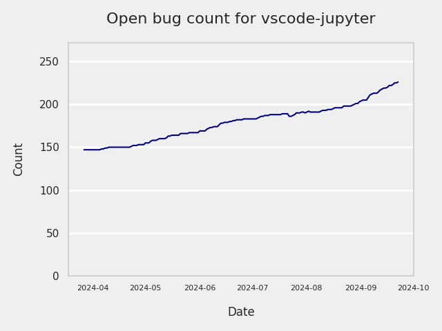
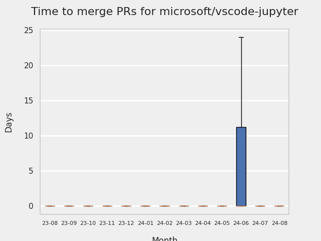
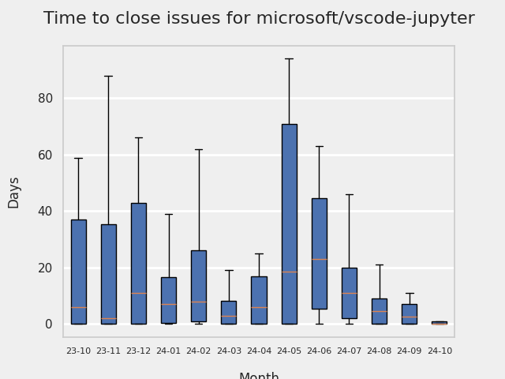
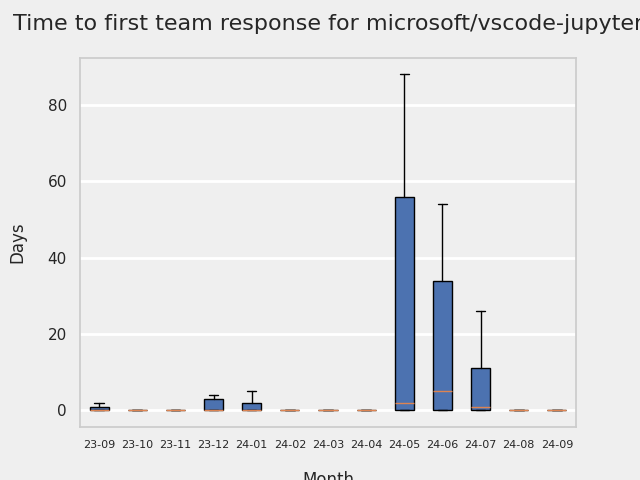
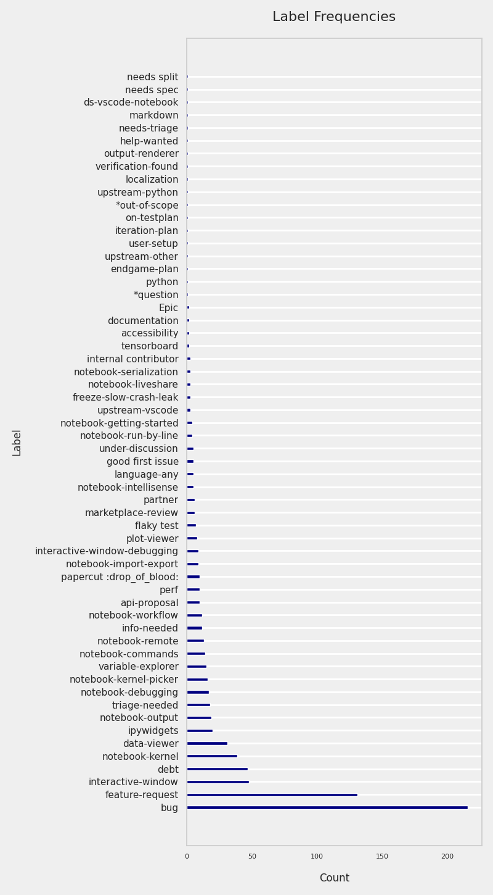
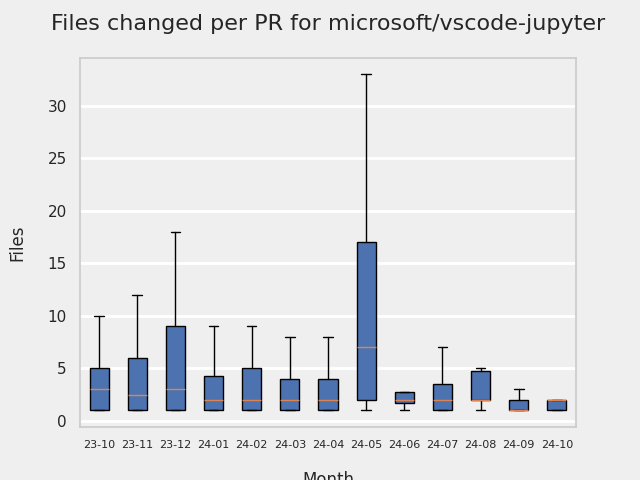
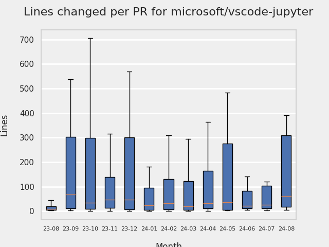
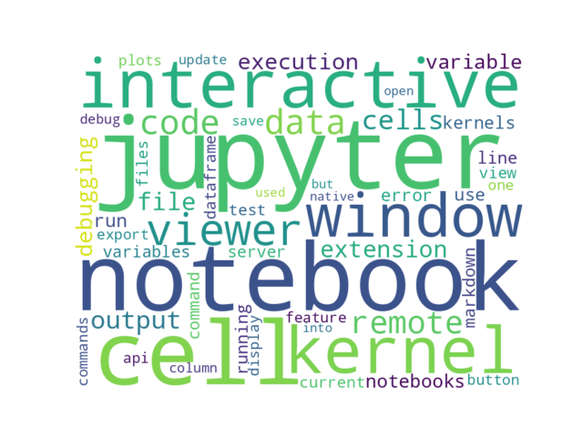

# GITHUB ISSUES REPORT FOR microsoft/vscode-jupyter

Generated on 2024-10-14 using: stale=30, all=True

* marks items that are new to report in past 1 day(s)

## FOR ISSUES THAT ARE MARKED AS BUGS:

### Issues in vscode-jupyter that need a response from team:

| Days Ago | Issue | Title |
| --- | --- | --- |
 | \* OP:0  |[16122](https://github.com/microsoft/vscode-jupyter/issues/16122 "Cycling between code and raw cell modes is broken")  |Cycling between code and raw cell modes is broken |
 |  OP:2  |[16121](https://github.com/microsoft/vscode-jupyter/issues/16121 "Can't save file") | Can't save file |
 |  OP:3  |[16118](https://github.com/microsoft/vscode-jupyter/issues/16118 "Restart icon is not themeable") | Restart icon is not themeable |
 |  OP:5  |[16112](https://github.com/microsoft/vscode-jupyter/issues/16112 "Choosing a kernel for the first time does not cause a kernel change event") | Choosing a kernel for the first time does not cause a kernel change event |
 |  OP:27  |[16053](https://github.com/microsoft/vscode-jupyter/issues/16053 "vh height div displaying by Ipython expand infinitely") | vh height div displaying by Ipython expand infinitely |
 |  OP:30  |[16043](https://github.com/microsoft/vscode-jupyter/issues/16043 "Markdown tables are not rendering as expected") | Markdown tables are not rendering as expected |
 |  OP:32  |[16031](https://github.com/microsoft/vscode-jupyter/issues/16031 "add group and execute group is not working") | add group and execute group is not working |
 |  OP:36  |[16014](https://github.com/microsoft/vscode-jupyter/issues/16014 "Breakpoint in external py deactivates when debugging a Jupyter cell") | Breakpoint in external py deactivates when debugging a Jupyter cell |
 |  OP:37  |[16009](https://github.com/microsoft/vscode-jupyter/issues/16009 "Cell execution hangs if sys.stderr reassigned with wrapper") | Cell execution hangs if sys.stderr reassigned with wrapper |
 |  OP:38  |[16004](https://github.com/microsoft/vscode-jupyter/issues/16004 "Code cell execution hangs") | Code cell execution hangs |
 |  OP:38  |[16003](https://github.com/microsoft/vscode-jupyter/issues/16003 "notebook becomes unresponsive, the kernel dies, and unable to save") | notebook becomes unresponsive, the kernel dies, and unable to save |
 |  OP:44  |[15975](https://github.com/microsoft/vscode-jupyter/issues/15975 "Debugging a cell does not work after running line by line") | Debugging a cell does not work after running line by line |
 |  OP:53  |[15948](https://github.com/microsoft/vscode-jupyter/issues/15948 "copy cell button in interactive window not working") | copy cell button in interactive window not working |
 |  OP:53  |[15947](https://github.com/microsoft/vscode-jupyter/issues/15947 "Still failing to launch notebook with &quot;running cells ... requires the kernelspec package&quot;") | Still failing to launch notebook with "running cells ... requires the kernelspec package" |
 |  OP:58  |[15939](https://github.com/microsoft/vscode-jupyter/issues/15939 "The pop-up docs is not escaped correctly") | The pop-up docs is not escaped correctly |
 |  OP:64  |[16109](https://github.com/microsoft/vscode-jupyter/issues/16109 "Red &quot;Error&quot; under-squiggle persists after restart even when error is rectified") | Red "Error" under-squiggle persists after restart even when error is rectified |
 |  OP:73  |[15909](https://github.com/microsoft/vscode-jupyter/issues/15909 "The error line number is the line number of the cell, not the line number of the python file ") | The error line number is the line number of the cell, not the line number of the python file  |
 |  OP:76  |[15891](https://github.com/microsoft/vscode-jupyter/issues/15891 "VSCode Jupyter with remote server: Cannot view the full contents of the truncated cell output in a text editor") | VSCode Jupyter with remote server: Cannot view the full contents of the truncated cell output in a text editor |
 |  OP:95  |[15840](https://github.com/microsoft/vscode-jupyter/issues/15840 "Running cell in Interactive Window gets stuck on &quot;Pending&quot;") | Running cell in Interactive Window gets stuck on "Pending" |
 |  OP:98  |[15830](https://github.com/microsoft/vscode-jupyter/issues/15830 "Repeated notification: Restart Visual Studio Code to apply the latest updates") | Repeated notification: Restart Visual Studio Code to apply the latest updates |
 |  OP:100  |[15827](https://github.com/microsoft/vscode-jupyter/issues/15827 "No notebook document for `file://*.ipynb` (wsl2)") | No notebook document for `file://*.ipynb` (wsl2) |
 |  OP:102  |[15819](https://github.com/microsoft/vscode-jupyter/issues/15819 "Markdown cell fails to embed image from Drive") | Markdown cell fails to embed image from Drive |
 |  OP:110  |[15796](https://github.com/microsoft/vscode-jupyter/issues/15796 "&quot;Ctrl Shift Home&quot; key combination selects all outputs instead of the output of the current cell") | "Ctrl Shift Home" key combination selects all outputs instead of the output of the current cell |
 |  OP:116  |[15784](https://github.com/microsoft/vscode-jupyter/issues/15784 "press ZZ to undo a cell deletion but get `cannot read properties of undefined (reading 'ownerDocument')` error") | press ZZ to undo a cell deletion but get `cannot read properties of undefined (reading 'ownerDocument')` error |
 |  OP:123  |[15763](https://github.com/microsoft/vscode-jupyter/issues/15763 "Can't debug jupyter notebook after error if also debugging a regular python script") | Can't debug jupyter notebook after error if also debugging a regular python script |
 |  OP:123  |[15759](https://github.com/microsoft/vscode-jupyter/issues/15759 "notebook output cells no longer properly word wrap with &quot;notebook.output.wordWrap&quot;: true") | notebook output cells no longer properly word wrap with "notebook.output.wordWrap": true |
 |  OP:124  |[15756](https://github.com/microsoft/vscode-jupyter/issues/15756 "Outline does not track current position when &quot;follow cursor&quot; is on") | Outline does not track current position when "follow cursor" is on |
 |  OP:131  |[15742](https://github.com/microsoft/vscode-jupyter/issues/15742 "&quot;Go To&quot; button is not appearing when running a cell") | "Go To" button is not appearing when running a cell |
 |  OP:131  |[15740](https://github.com/microsoft/vscode-jupyter/issues/15740 "Python kernel installation should report error through its notification") | Python kernel installation should report error through its notification |
 |  OP:135  |[15736](https://github.com/microsoft/vscode-jupyter/issues/15736 "keybindings to &quot;find&quot; next/previous occurences not working ?") | keybindings to "find" next/previous occurences not working ? |
 |  OP:153  |[15687](https://github.com/microsoft/vscode-jupyter/issues/15687 "Custom Keyboard Shortcuts don't work") | Custom Keyboard Shortcuts don't work |
 |  OP:154  |[15685](https://github.com/microsoft/vscode-jupyter/issues/15685 "Jupyter stopped working") | Jupyter stopped working |
 |  OP:158  |[15675](https://github.com/microsoft/vscode-jupyter/issues/15675 "Python Interactive: empty line(s) followed by markdown cell + code doesn't execute code in first cell") | Python Interactive: empty line(s) followed by markdown cell + code doesn't execute code in first cell |
 |  OP:162  |[15663](https://github.com/microsoft/vscode-jupyter/issues/15663 "Run current cell and below not working") | Run current cell and below not working |
 |  OP:166  |[15635](https://github.com/microsoft/vscode-jupyter/issues/15635 "First cell delimiter is ignored when using &quot;Run All Cells&quot; or &quot;Run Current File in Interactive Window&quot; from script") | First cell delimiter is ignored when using "Run All Cells" or "Run Current File in Interactive Window" from script |
 |  OP:174  |[15586](https://github.com/microsoft/vscode-jupyter/issues/15586 "Variable viewer does not activate the contributing extension") | Variable viewer does not activate the contributing extension |
 |  OP:191  |[15500](https://github.com/microsoft/vscode-jupyter/issues/15500 "Run with precedent cells does not work with WSL2 & remote execution.") | Run with precedent cells does not work with WSL2 & remote execution. |
 |  OP:202  |[15423](https://github.com/microsoft/vscode-jupyter/issues/15423 "Confused by Install python button") | Confused by Install python button |
 |  OP:210  |[15376](https://github.com/microsoft/vscode-jupyter/issues/15376 "[BUG] PyLance analysis of interactive window can't be prevented") | [BUG] PyLance analysis of interactive window can't be prevented |
 |  OP:213  |[15362](https://github.com/microsoft/vscode-jupyter/issues/15362 "data viewer freezes when viewing dataframe with enum content") | data viewer freezes when viewing dataframe with enum content |
 |  OP:225  |[15281](https://github.com/microsoft/vscode-jupyter/issues/15281 "Random line breaks added on Ctrl+S to last edited cells destroying formatting") | Random line breaks added on Ctrl+S to last edited cells destroying formatting |
 |  OP:228  |[15259](https://github.com/microsoft/vscode-jupyter/issues/15259 "Jupyter Notebook Freezes / Does not connect to renderer") | Jupyter Notebook Freezes / Does not connect to renderer |
 |  OP:233  |[15224](https://github.com/microsoft/vscode-jupyter/issues/15224 "Auto detection mistakenly assumes a markdown cell as a Perl code") | Auto detection mistakenly assumes a markdown cell as a Perl code |
 |  OP:236  |[15206](https://github.com/microsoft/vscode-jupyter/issues/15206 "`Dialog` from the ipyvuetify project are not displayed in a VSCode Jupyter notebook") | `Dialog` from the ipyvuetify project are not displayed in a VSCode Jupyter notebook |
 |  OP:242  |[15187](https://github.com/microsoft/vscode-jupyter/issues/15187 "Variable explorer outdated after kernel restart") | Variable explorer outdated after kernel restart |
 |  OP:250  |[15143](https://github.com/microsoft/vscode-jupyter/issues/15143 "Cannot start new kernel with the message &quot;Waiting for Jupyter Session to be idle&quot;") | Cannot start new kernel with the message "Waiting for Jupyter Session to be idle" |
 |  OP:255  |[15107](https://github.com/microsoft/vscode-jupyter/issues/15107 "Native editor scroll bar too small to use [II]") | Native editor scroll bar too small to use [II] |
 |  OP:261  |[15077](https://github.com/microsoft/vscode-jupyter/issues/15077 "DataViewer: Unable to view when the values include certain data types") | DataViewer: Unable to view when the values include certain data types |
 |  OP:263  |[15067](https://github.com/microsoft/vscode-jupyter/issues/15067 "Cut (Ctrl + X) deletes lines but pastes nothing") | Cut (Ctrl + X) deletes lines but pastes nothing |
 |  OP:287  |[14966](https://github.com/microsoft/vscode-jupyter/issues/14966 "Size of list of dataframes shows size of first dataframe instead of size of list  in jupyter variables") | Size of list of dataframes shows size of first dataframe instead of size of list  in jupyter variables |
 |  OP:287  |[14962](https://github.com/microsoft/vscode-jupyter/issues/14962 "Export Python file as Jupyter notebook incorrect extension") | Export Python file as Jupyter notebook incorrect extension |
 |  OP:297  |[14952](https://github.com/microsoft/vscode-jupyter/issues/14952 "The torch.tensor with special type cannot be viewed properly in the Dataviewer.") | The torch.tensor with special type cannot be viewed properly in the Dataviewer. |
 |  OP:297  |[14948](https://github.com/microsoft/vscode-jupyter/issues/14948 "Extra space on MathJax formula using sympy.") | Extra space on MathJax formula using sympy. |
 |  OP:397  |[14312](https://github.com/microsoft/vscode-jupyter/issues/14312 "Issue displaying matplotlib plots with transparent backgrounds") | Issue displaying matplotlib plots with transparent backgrounds |
 |  OP:407  |[14246](https://github.com/microsoft/vscode-jupyter/issues/14246 "Suggested extensions aren't installed when connecting over SSH") | Suggested extensions aren't installed when connecting over SSH |
 |  OP:446  |[13978](https://github.com/microsoft/vscode-jupyter/issues/13978 "&quot;detect kernel&quot; present while building codespace") | "detect kernel" present while building codespace |
 |  OP:452  |[13955](https://github.com/microsoft/vscode-jupyter/issues/13955 "Vim recenter cursor vertically (zz) doesn't work") | Vim recenter cursor vertically (zz) doesn't work |
 |  OP:454  |[13917](https://github.com/microsoft/vscode-jupyter/issues/13917 "Variable visualization issue with Juyter notebook") | Variable visualization issue with Juyter notebook |
 |  OP:467  |[13843](https://github.com/microsoft/vscode-jupyter/issues/13843 "Cell display overlap on output. ") | Cell display overlap on output.  |
 |  OP:499  |[13640](https://github.com/microsoft/vscode-jupyter/issues/13640 "When using debugger in Codespaces notebook with Live Share, kernel dies for other user") | When using debugger in Codespaces notebook with Live Share, kernel dies for other user |
 |  OP:501  |[13619](https://github.com/microsoft/vscode-jupyter/issues/13619 "Viewing a Pandas DataFrame with uuids in a column  fails with SyntaxError: Unexpected end of JSON input") | Viewing a Pandas DataFrame with uuids in a column  fails with SyntaxError: Unexpected end of JSON input |
 |  OP:514  |[13528](https://github.com/microsoft/vscode-jupyter/issues/13528 "Jupyter Extension for VS Code does not show tables created by fastai learners") | Jupyter Extension for VS Code does not show tables created by fastai learners |
 |  OP:528  |[13453](https://github.com/microsoft/vscode-jupyter/issues/13453 "No right-click menu for interactive window cell outputs") | No right-click menu for interactive window cell outputs |
 |  OP:536  |[13410](https://github.com/microsoft/vscode-jupyter/issues/13410 "IPython.display.IFrame(&quot;./file.html&quot;) doesn't work") | IPython.display.IFrame("./file.html") doesn't work |
 |  OP:541  |[13377](https://github.com/microsoft/vscode-jupyter/issues/13377 "Data Viewer does not sort categorical columns with NaN values") | Data Viewer does not sort categorical columns with NaN values |
 |  OP:542  |[13363](https://github.com/microsoft/vscode-jupyter/issues/13363 "Data viewer cannot handle pathlib.WindowsPath objectes in a pandas DataFrame") | Data viewer cannot handle pathlib.WindowsPath objectes in a pandas DataFrame |
 |  OP:543  |[13353](https://github.com/microsoft/vscode-jupyter/issues/13353 "Jupyter notebook closes instead of running") | Jupyter notebook closes instead of running |
 |  OP:579  |[13074](https://github.com/microsoft/vscode-jupyter/issues/13074 "Immediate window debugger off by a line") | Immediate window debugger off by a line |
 |  OP:585  |[13029](https://github.com/microsoft/vscode-jupyter/issues/13029 "Jupyter Notebook randomly prompts save file") | Jupyter Notebook randomly prompts save file |
 |  OP:587  |[13001](https://github.com/microsoft/vscode-jupyter/issues/13001 "Codespaces Jupyter Template not working") | Codespaces Jupyter Template not working |
 |  OP:602  |[12872](https://github.com/microsoft/vscode-jupyter/issues/12872 "Overlapping cells when clearing long notebook after scrolling") | Overlapping cells when clearing long notebook after scrolling |
 |  OP:618  |[12725](https://github.com/microsoft/vscode-jupyter/issues/12725 "HTML export doesn't show plots") | HTML export doesn't show plots |
 |  OP:633  |[12583](https://github.com/microsoft/vscode-jupyter/issues/12583 "Data Viewer doesn't show unique values when dataframe has duplicate column names") | Data Viewer doesn't show unique values when dataframe has duplicate column names |
 |  OP:719  |[11777](https://github.com/microsoft/vscode-jupyter/issues/11777 "Fix justMyCode=false for Interactive Window debugging with ipykernel debugging") | Fix justMyCode=false for Interactive Window debugging with ipykernel debugging |
 |  OP:760  |[11373](https://github.com/microsoft/vscode-jupyter/issues/11373 "Data Viewer displays small floating-point numbers as 0") | Data Viewer displays small floating-point numbers as 0 |
 |  OP:797  |[11069](https://github.com/microsoft/vscode-jupyter/issues/11069 "GeoJSON can not be rendered") | GeoJSON can not be rendered |
 |  OP:851  |[11138](https://github.com/microsoft/vscode-jupyter/issues/11138 "Show the Interactive Window if code was added/executed from a python file") | Show the Interactive Window if code was added/executed from a python file |
 |  OP:990  |[9558](https://github.com/microsoft/vscode-jupyter/issues/9558 "Accepting completion with alt insert mode stops editing notebook cell") | Accepting completion with alt insert mode stops editing notebook cell |
 |  OP:1104  |[7819](https://github.com/microsoft/vscode-jupyter/issues/7819 "Controls in the plot viewer window are confusing") | Controls in the plot viewer window are confusing |
 |  OP:1122  |[7584](https://github.com/microsoft/vscode-jupyter/issues/7584 "Breaking RBL by clicking quickly") | Breaking RBL by clicking quickly |

### Issues in vscode-jupyter that have comments from OP after last team response:

| Days Ago | Issue | Title |
| --- | --- | --- |
 | \* TM:0, OP:0  |[16119](https://github.com/microsoft/vscode-jupyter/issues/16119 "requires the ipykernel package")  |requires the ipykernel package |
 |  TM:3, OP:3  |[16115](https://github.com/microsoft/vscode-jupyter/issues/16115 "Jupyter Kernel is not able to start or be found") | Jupyter Kernel is not able to start or be found |
 |  TM:11, OP:11  |[16093](https://github.com/microsoft/vscode-jupyter/issues/16093 "Jupyter debug problem with vscode") | Jupyter debug problem with vscode |
 |  TM:23, OP:23  |[16064](https://github.com/microsoft/vscode-jupyter/issues/16064 "Interactive window is using the wrong env for activation for remote development") | Interactive window is using the wrong env for activation for remote development |
 |  TM:26, OP:25  |[16051](https://github.com/microsoft/vscode-jupyter/issues/16051 "Eventhough interpereter is selected from Anaconda virtual environment, Jupyter notebook is stuck in detecting kernel loop") | Eventhough interpereter is selected from Anaconda virtual environment, Jupyter notebook is stuck in detecting kernel loop |
 |  TM:32, OP:31  |[16028](https://github.com/microsoft/vscode-jupyter/issues/16028 "Jupyter Notebook stoles keyboard commands when WebView is focused") | Jupyter Notebook stoles keyboard commands when WebView is focused |
 |  TM:37, OP:29  |[16006](https://github.com/microsoft/vscode-jupyter/issues/16006 "Huge blank space after the cell output") | Huge blank space after the cell output |
 |  TM:32, OP:21  |[16019](https://github.com/microsoft/vscode-jupyter/issues/16019 "Jupyter cannot find any kernel, or even the Python extension.") | Jupyter cannot find any kernel, or even the Python extension. |
 |  TM:38, OP:38  |[15996](https://github.com/microsoft/vscode-jupyter/issues/15996 "Output from functions running out of the standard execution path are captured and displayed in VS Code but not in Jupyter Notebook") | Output from functions running out of the standard execution path are captured and displayed in VS Code but not in Jupyter Notebook |
 |  TM:59, OP:58  |[15938](https://github.com/microsoft/vscode-jupyter/issues/15938 "Cannot select current python interpreter as kernel") | Cannot select current python interpreter as kernel |
 |  TM:62, OP:62  |[15934](https://github.com/microsoft/vscode-jupyter/issues/15934 "Breakpoint in Notebook Cell doesn't stop when VSCode is running on Windows and Kernel running on Linux") | Breakpoint in Notebook Cell doesn't stop when VSCode is running on Windows and Kernel running on Linux |
 |  TM:65, OP:65  |[15931](https://github.com/microsoft/vscode-jupyter/issues/15931 "Display some error message about the fact that some remote kernels are no longer usable to avoid long spinnings of kernels in kernel picker") | Display some error message about the fact that some remote kernels are no longer usable to avoid long spinnings of kernels in kernel picker |
 |  TM:35, OP:35  |[15929](https://github.com/microsoft/vscode-jupyter/issues/15929 ".env $PYTHONPATH not set in WSL2") | .env $PYTHONPATH not set in WSL2 |
 |  TM:73, OP:73  |[15906](https://github.com/microsoft/vscode-jupyter/issues/15906 "Jupyter notebook cell menu incorrect for new cells") | Jupyter notebook cell menu incorrect for new cells |
 |  TM:76, OP:76  |[15886](https://github.com/microsoft/vscode-jupyter/issues/15886 "Discrepancy in handling `set_next_input` payload.") | Discrepancy in handling `set_next_input` payload. |
 |  TM:111, OP:104  |[15787](https://github.com/microsoft/vscode-jupyter/issues/15787 "Can't Paste into ipywidgets.Text Element on Mac") | Can't Paste into ipywidgets.Text Element on Mac |
 |  TM:124, OP:26  |[15749](https://github.com/microsoft/vscode-jupyter/issues/15749 "CTRL+A randomly breaks in Jupyter notebooks") | CTRL+A randomly breaks in Jupyter notebooks |
 |  TM:130, OP:130  |[15747](https://github.com/microsoft/vscode-jupyter/issues/15747 "scrolling is buggy") | scrolling is buggy |
 |  TM:62, OP:34  |[15692](https://github.com/microsoft/vscode-jupyter/issues/15692 "Trouble displaying output using R leaflet library") | Trouble displaying output using R leaflet library |
 |  TM:84, OP:83  |[15690](https://github.com/microsoft/vscode-jupyter/issues/15690 "Running `Developer: Reload Window` with multiple notebooks open running remote kernels can result in them connecting to the same running kernel") | Running `Developer: Reload Window` with multiple notebooks open running remote kernels can result in them connecting to the same running kernel |
 |  TM:158, OP:157  |[15666](https://github.com/microsoft/vscode-jupyter/issues/15666 "Issue adding cells to group 1 in Jupyter Notebook after VSCode update") | Issue adding cells to group 1 in Jupyter Notebook after VSCode update |
 |  TM:75, OP:72  |[15595](https://github.com/microsoft/vscode-jupyter/issues/15595 "input and print logical error") | input and print logical error |
 |  TM:212, OP:211  |[15337](https://github.com/microsoft/vscode-jupyter/issues/15337 "Jupyter notebook matplotlib chart fails to save: save dialog hidden, nothing saved") | Jupyter notebook matplotlib chart fails to save: save dialog hidden, nothing saved |
 |  TM:221, OP:209  |[15305](https://github.com/microsoft/vscode-jupyter/issues/15305 "Cannot preview data in VScode") | Cannot preview data in VScode |
 |  TM:221, OP:221  |[15297](https://github.com/microsoft/vscode-jupyter/issues/15297 "Execution of cells blocked due to variable viewer") | Execution of cells blocked due to variable viewer |
 |  TM:244, OP:244  |[15179](https://github.com/microsoft/vscode-jupyter/issues/15179 "unable to &quot;view value in data viewer&quot; while debugging when hdf5 are involved") | unable to "view value in data viewer" while debugging when hdf5 are involved |
 |  TM:248, OP:222  |[15134](https://github.com/microsoft/vscode-jupyter/issues/15134 "vscode opens temp file for Jupyter cell debugging") | vscode opens temp file for Jupyter cell debugging |
 |  TM:280, OP:280  |[14959](https://github.com/microsoft/vscode-jupyter/issues/14959 "Subprocess keeps running after cell interruption (subshell)") | Subprocess keeps running after cell interruption (subshell) |
 |  TM:327, OP:326  |[14753](https://github.com/microsoft/vscode-jupyter/issues/14753 "Shift+Enter doesn't route to Jupyter") | Shift+Enter doesn't route to Jupyter |
 |  TM:341, OP:341  |[14661](https://github.com/microsoft/vscode-jupyter/issues/14661 "Interactive Python line numbers don't match those of the code") | Interactive Python line numbers don't match those of the code |
 |  TM:437, OP:437  |[14048](https://github.com/microsoft/vscode-jupyter/issues/14048 "Crashes with Period column or index") | Crashes with Period column or index |
 |  TM:304, OP:304  |[13473](https://github.com/microsoft/vscode-jupyter/issues/13473 "Debugging Notebook Cells broken") | Debugging Notebook Cells broken |
 |  TM:534, OP:532  |[13432](https://github.com/microsoft/vscode-jupyter/issues/13432 "output stream conflicts when warning directly from the `logging` packages logger") | output stream conflicts when warning directly from the `logging` packages logger |
 |  TM:558, OP:539  |[13224](https://github.com/microsoft/vscode-jupyter/issues/13224 "Jump to absolute path rather than relative path while debugging.") | Jump to absolute path rather than relative path while debugging. |
 |  TM:223, OP:223  |[15290](https://github.com/microsoft/vscode-jupyter/issues/15290 "Python debugger dataviewer is broken if multiprocessing is used at some point earlier in the script") | Python debugger dataviewer is broken if multiprocessing is used at some point earlier in the script |
 |  TM:310, OP:310  |[12409](https://github.com/microsoft/vscode-jupyter/issues/12409 "Nothing is rendered when %display latex is used") | Nothing is rendered when %display latex is used |
 |  TM:844, OP:844  |[10533](https://github.com/microsoft/vscode-jupyter/issues/10533 "Data Viewer does not display Series data if index and column names are equal") | Data Viewer does not display Series data if index and column names are equal |
 |  TM:676, OP:675  |[9763](https://github.com/microsoft/vscode-jupyter/issues/9763 "Cannot execute Run current cell for ~1s after I stop typing") | Cannot execute Run current cell for ~1s after I stop typing |
 |  TM:944, OP:944  |[9349](https://github.com/microsoft/vscode-jupyter/issues/9349 "Expand Image gets stuck when showing a wide but short image.") | Expand Image gets stuck when showing a wide but short image. |
 |  TM:1091, OP:1091  |[7950](https://github.com/microsoft/vscode-jupyter/issues/7950 "Expanding column length in Data Viewer") | Expanding column length in Data Viewer |
 |  TM:1139, OP:1139  |[1600](https://github.com/microsoft/vscode-jupyter/issues/1600 "Remember file extension when exporting plots from interactive") | Remember file extension when exporting plots from interactive |
 |  TM:1649, OP:1649  |[1144](https://github.com/microsoft/vscode-jupyter/issues/1144 "Python data viewer does not support grouped columns (custom indices), Multi-index , PeriodIndex") | Python data viewer does not support grouped columns (custom indices), Multi-index , PeriodIndex |
 |  TM:1823, OP:1823  |[1146](https://github.com/microsoft/vscode-jupyter/issues/1146 "Can't expand right-handed column in Data Viewer") | Can't expand right-handed column in Data Viewer |

### Issues in vscode-jupyter that have comments from 3rd party after last team response:

| Days Ago | Issue | Title |
| --- | --- | --- |
 |  P:23,  |[15993](https://github.com/microsoft/vscode-jupyter/issues/15993 "Printing race condition?") | Printing race condition? |
 |  P:2,  |[15716](https://github.com/microsoft/vscode-jupyter/issues/15716 "Kernel disposed because Notebook was closed or Cell was Deleted, when in fact notebook wasn't closed and cell wasn't deleted") | Kernel disposed because Notebook was closed or Cell was Deleted, when in fact notebook wasn't closed and cell wasn't deleted |
 |  P:82,  |[15639](https://github.com/microsoft/vscode-jupyter/issues/15639 "Failed to start the Kernel.  Bad file descriptor (C:\Users\runneradmin\AppData\Local\Temp\tmpx5q4_1bm\build\_deps\bundled_libzmq-src\src\epoll.cpp:73).  View Jupyter log for further details.") | Failed to start the Kernel.  Bad file descriptor (C:\Users\runneradmin\AppData\Local\Temp\tmpx5q4_1bm\build\_deps\bundled_libzmq-src\src\epoll.cpp:73).  View Jupyter log for further details. |
 |  P:27,  |[15406](https://github.com/microsoft/vscode-jupyter/issues/15406 "Perspective widget does not load in VS Code") | Perspective widget does not load in VS Code |
 |  P:187,  |[15384](https://github.com/microsoft/vscode-jupyter/issues/15384 "Print statement in matplotlib event not shown") | Print statement in matplotlib event not shown |
 |  P:103,  |[15099](https://github.com/microsoft/vscode-jupyter/issues/15099 "nested interact() doesn't work") | nested interact() doesn't work |
 |  P:296,  |[14925](https://github.com/microsoft/vscode-jupyter/issues/14925 "Unable to connect to the remote server (Azure Ml compute instance)") | Unable to connect to the remote server (Azure Ml compute instance) |
 |  P:73,  |[14206](https://github.com/microsoft/vscode-jupyter/issues/14206 "Tensorboard is installed, prompted to install repeatedly") | Tensorboard is installed, prompted to install repeatedly |
 |  P:274,  |[13570](https://github.com/microsoft/vscode-jupyter/issues/13570 "Slow execution in remote ssh") | Slow execution in remote ssh |
 |  P:465,  |[13454](https://github.com/microsoft/vscode-jupyter/issues/13454 "Cannot restore cell output options after making it scrollable") | Cannot restore cell output options after making it scrollable |
 |  P:99,  |[13139](https://github.com/microsoft/vscode-jupyter/issues/13139 "&quot;Debug cell&quot; not working in Jupyter notebooks when typings module is installed") | "Debug cell" not working in Jupyter notebooks when typings module is installed |
 |  P:10,  |[12737](https://github.com/microsoft/vscode-jupyter/issues/12737 "LiveShare Jupyter Notebook output synch problem ") | LiveShare Jupyter Notebook output synch problem  |
 |  P:229,  |[11677](https://github.com/microsoft/vscode-jupyter/issues/11677 "Dataviewer not showing variables when columns are multi-indexed") | Dataviewer not showing variables when columns are multi-indexed |
 |  P:590,  |[11657](https://github.com/microsoft/vscode-jupyter/issues/11657 "Interactive window and VIM mode") | Interactive window and VIM mode |
 |  P:531,  |[12520](https://github.com/microsoft/vscode-jupyter/issues/12520 "Jupyter extension breaks code folding in ordinary python files") | Jupyter extension breaks code folding in ordinary python files |
 |  P:675,  |[9239](https://github.com/microsoft/vscode-jupyter/issues/9239 "&quot;No active notebook document to debug&quot; when try to debug a notebook that doesn't have focus") | "No active notebook document to debug" when try to debug a notebook that doesn't have focus |
 |  P:92,  |[8707](https://github.com/microsoft/vscode-jupyter/issues/8707 "Cannot pan zoomed image in plots viewer") | Cannot pan zoomed image in plots viewer |
 |  P:40,  |[8131](https://github.com/microsoft/vscode-jupyter/issues/8131 "LaTeX not rendering in Plotly figures") | LaTeX not rendering in Plotly figures |
 |  P:1110,  |[6898](https://github.com/microsoft/vscode-jupyter/issues/6898 "Run line by line in an untitled file prompts to save file") | Run line by line in an untitled file prompts to save file |

### Issues in vscode-jupyter that have no external responses since team response in 30+ days:

| Days Ago | Issue | Title |
| --- | --- | --- |
 |  TM:36  |[16005](https://github.com/microsoft/vscode-jupyter/issues/16005 " When I connect to the remote server using VSCode, in the ipynb files, I am unable to select a kernel as it does not show up.") |  When I connect to the remote server using VSCode, in the ipynb files, I am unable to select a kernel as it does not show up. |
 |  TM:45  |[15968](https://github.com/microsoft/vscode-jupyter/issues/15968 "PDF Export of Raw Cell - LaTeX Interprets Text") | PDF Export of Raw Cell - LaTeX Interprets Text |
 |  TM:60  |[15877](https://github.com/microsoft/vscode-jupyter/issues/15877 "Data Wrangler extension - dataframe viewer not opening within VSCode") | Data Wrangler extension - dataframe viewer not opening within VSCode |
 |  TM:70  |[15871](https://github.com/microsoft/vscode-jupyter/issues/15871 "Notebook too large to backup") | Notebook too large to backup |
 |  TM:72  |[15855](https://github.com/microsoft/vscode-jupyter/issues/15855 "No difference in UI between NotebookCellOutputItem.error vs. NotebookCellOutputItem.text ") | No difference in UI between NotebookCellOutputItem.error vs. NotebookCellOutputItem.text  |
 |  TM:36  |[15757](https://github.com/microsoft/vscode-jupyter/issues/15757 "nglview not working with vscode-jupyter") | nglview not working with vscode-jupyter |
 |  TM:79  |[15735](https://github.com/microsoft/vscode-jupyter/issues/15735 "If XDG_DATA_HOME is configured without JUPYTER_DATA_DIR, the app doesn't appear to find kernels") | If XDG_DATA_HOME is configured without JUPYTER_DATA_DIR, the app doesn't appear to find kernels |
 |  TM:38  |[15701](https://github.com/microsoft/vscode-jupyter/issues/15701 "textbase tqdm bar does not display correctly") | textbase tqdm bar does not display correctly |
 |  TM:143  |[15700](https://github.com/microsoft/vscode-jupyter/issues/15700 "[Freeze/Slow] Unable to save/format notebook") | [Freeze/Slow] Unable to save/format notebook |
 |  TM:84  |[15659](https://github.com/microsoft/vscode-jupyter/issues/15659 "Kubeflow Authentication breaks with JupyterLab 4") | Kubeflow Authentication breaks with JupyterLab 4 |
 |  TM:199  |[15405](https://github.com/microsoft/vscode-jupyter/issues/15405 "Scrolling in notebooks sucks user back to particular output") | Scrolling in notebooks sucks user back to particular output |
 |  TM:247  |[15014](https://github.com/microsoft/vscode-jupyter/issues/15014 "Export to PDF fails if markdown cells have relative image paths") | Export to PDF fails if markdown cells have relative image paths |
 |  TM:304  |[14713](https://github.com/microsoft/vscode-jupyter/issues/14713 "cant visualize data of a valid DF") | cant visualize data of a valid DF |
 |  TM:317  |[14680](https://github.com/microsoft/vscode-jupyter/issues/14680 "Interactive window autocomplete doesn't work until at least one cell is executed") | Interactive window autocomplete doesn't work until at least one cell is executed |
 |  TM:345  |[14664](https://github.com/microsoft/vscode-jupyter/issues/14664 "Cannot debug with autotime, pykernel setup required for this feature") | Cannot debug with autotime, pykernel setup required for this feature |
 |  TM:370  |[14253](https://github.com/microsoft/vscode-jupyter/issues/14253 "Path completion in interactive windows does not return current working directory") | Path completion in interactive windows does not return current working directory |
 |  TM:310  |[14243](https://github.com/microsoft/vscode-jupyter/issues/14243 "`aggdraw.Draw` causes kernel to die, not in web interface, only in VS Code") | `aggdraw.Draw` causes kernel to die, not in web interface, only in VS Code |
 |  TM:317  |[14000](https://github.com/microsoft/vscode-jupyter/issues/14000 "${fileDirname} fails when workspace is under '/'") | ${fileDirname} fails when workspace is under '/' |
 |  TM:430  |[13993](https://github.com/microsoft/vscode-jupyter/issues/13993 "multiprocessing.spawn attempts to source `__file__` in interactive scripts, diverging from jupyter behavior") | multiprocessing.spawn attempts to source `__file__` in interactive scripts, diverging from jupyter behavior |
 |  TM:472  |[13782](https://github.com/microsoft/vscode-jupyter/issues/13782 "Clear All in Python Interactive Stops Intellisense") | Clear All in Python Interactive Stops Intellisense |
 |  TM:541  |[13039](https://github.com/microsoft/vscode-jupyter/issues/13039 "Calls to `input()` should flush stdout when executing cells") | Calls to `input()` should flush stdout when executing cells |
 |  TM:34  |[12863](https://github.com/microsoft/vscode-jupyter/issues/12863 "Cell randomly losing focus, view jumping") | Cell randomly losing focus, view jumping |
 |  TM:304  |[12829](https://github.com/microsoft/vscode-jupyter/issues/12829 "Data Viewer can't filter multi-index") | Data Viewer can't filter multi-index |
 |  TM:306  |[12764](https://github.com/microsoft/vscode-jupyter/issues/12764 "Cannot open and run a Jupyter Notebook inside a workspace") | Cannot open and run a Jupyter Notebook inside a workspace |
 |  TM:566  |[12647](https://github.com/microsoft/vscode-jupyter/issues/12647 "I created 2 docker container jupyter kernels and only one showed up on reload") | I created 2 docker container jupyter kernels and only one showed up on reload |
 |  TM:304  |[12538](https://github.com/microsoft/vscode-jupyter/issues/12538 "Data viewer rounding large integers to incorrect values") | Data viewer rounding large integers to incorrect values |
 |  TM:674  |[12375](https://github.com/microsoft/vscode-jupyter/issues/12375 "Presence of &quot;NDArray&quot; from the numpy.typing module prevents variables from loading in variables view") | Presence of "NDArray" from the numpy.typing module prevents variables from loading in variables view |
 |  TM:711  |[11846](https://github.com/microsoft/vscode-jupyter/issues/11846 "mouse scroll stops when cursor in polars output") | mouse scroll stops when cursor in polars output |
 |  TM:716  |[11833](https://github.com/microsoft/vscode-jupyter/issues/11833 "Data Viewer filter shows no rows when the filter is used on the index of a DataFrame") | Data Viewer filter shows no rows when the filter is used on the index of a DataFrame |
 |  TM:382  |[11731](https://github.com/microsoft/vscode-jupyter/issues/11731 "Notebook Renderer: textbox events are intercepted") | Notebook Renderer: textbox events are intercepted |
 |  TM:312  |[11636](https://github.com/microsoft/vscode-jupyter/issues/11636 "vs code freeze when rendering papermill notebook output") | vs code freeze when rendering papermill notebook output |
 |  TM:758  |[11369](https://github.com/microsoft/vscode-jupyter/issues/11369 "Interactive window cuts off when showing images") | Interactive window cuts off when showing images |
 |  TM:810  |[10933](https://github.com/microsoft/vscode-jupyter/issues/10933 "Variable View stucks on 'Loading variables' when using 'autotime'") | Variable View stucks on 'Loading variables' when using 'autotime' |
 |  TM:900  |[9865](https://github.com/microsoft/vscode-jupyter/issues/9865 "Active/Live Remote Kernel instance is not selected after it is started") | Active/Live Remote Kernel instance is not selected after it is started |
 |  TM:373  |[9636](https://github.com/microsoft/vscode-jupyter/issues/9636 "Backslash replaces slash in paths to code files when debugging a cell interactively") | Backslash replaces slash in paths to code files when debugging a cell interactively |
 |  TM:790  |[9620](https://github.com/microsoft/vscode-jupyter/issues/9620 "Line breaks for multi-line comments in Markdown cells are broken (interactive Python)") | Line breaks for multi-line comments in Markdown cells are broken (interactive Python) |
 |  TM:84  |[9264](https://github.com/microsoft/vscode-jupyter/issues/9264 "Data viewer is not recognizing objects of `pandas.DataFrame` subclass") | Data viewer is not recognizing objects of `pandas.DataFrame` subclass |
 |  TM:992  |[8794](https://github.com/microsoft/vscode-jupyter/issues/8794 "The Data Viewer can't sort the data correctly") | The Data Viewer can't sort the data correctly |
 |  TM:1102  |[7833](https://github.com/microsoft/vscode-jupyter/issues/7833 "Plot buttons stand out in dark themes") | Plot buttons stand out in dark themes |
 |  TM:1133  |[7426](https://github.com/microsoft/vscode-jupyter/issues/7426 "Rounded floats are not shown correctly in the data viewer") | Rounded floats are not shown correctly in the data viewer |
 |  TM:607  |[4288](https://github.com/microsoft/vscode-jupyter/issues/4288 "Data Viewer of Interactive Viewer will not open numpy complex ndarrays") | Data Viewer of Interactive Viewer will not open numpy complex ndarrays |

---

## FOR ISSUES THAT ARE NOT MARKED AS BUGS:

### Issues in vscode-jupyter that need a response from team:

| Days Ago | Issue | Title |
| --- | --- | --- |
 |  OP:18  |[16071](https://github.com/microsoft/vscode-jupyter/issues/16071 "Feature Request: Render SymPy Variables with LaTeX in Variables View") | Feature Request: Render SymPy Variables with LaTeX in Variables View |
 |  OP:28  |[16050](https://github.com/microsoft/vscode-jupyter/issues/16050 "Executing or debugging a cell does not work") | Executing or debugging a cell does not work |
 |  OP:30  |[16045](https://github.com/microsoft/vscode-jupyter/issues/16045 "Feature Request) Real time variable viewer") | Feature Request) Real time variable viewer |
 |  OP:31  |[16036](https://github.com/microsoft/vscode-jupyter/issues/16036 "Feature Request: Edit Notebook metadata to provide additional information for parsers") | Feature Request: Edit Notebook metadata to provide additional information for parsers |
 |  OP:48  |[15959](https://github.com/microsoft/vscode-jupyter/issues/15959 "Debugging: Show function return values in Run and Debug panel, Variables section") | Debugging: Show function return values in Run and Debug panel, Variables section |
 |  OP:61  |[16039](https://github.com/microsoft/vscode-jupyter/issues/16039 "DLL not loading in Jupyter Extension VS Code") | DLL not loading in Jupyter Extension VS Code |
 |  OP:74  |[15904](https://github.com/microsoft/vscode-jupyter/issues/15904 "Feature Request: More easily handle changing the working directory") | Feature Request: More easily handle changing the working directory |
 |  OP:81  |[15869](https://github.com/microsoft/vscode-jupyter/issues/15869 "Allow specification of DebugPy Configuration") | Allow specification of DebugPy Configuration |
 |  OP:82  |[15866](https://github.com/microsoft/vscode-jupyter/issues/15866 "Share Linter and IntelliSense information across multiple Notebooks") | Share Linter and IntelliSense information across multiple Notebooks |
 |  OP:88  |[15853](https://github.com/microsoft/vscode-jupyter/issues/15853 "Adding support for compatible data types in data viewer") | Adding support for compatible data types in data viewer |
 |  OP:93  |[15844](https://github.com/microsoft/vscode-jupyter/issues/15844 "Support loading environment from .envrc with direnv") | Support loading environment from .envrc with direnv |
 |  OP:94  |[15849](https://github.com/microsoft/vscode-jupyter/issues/15849 "Allow moving REPL window to bottom panel") | Allow moving REPL window to bottom panel |
 |  OP:111  |[15794](https://github.com/microsoft/vscode-jupyter/issues/15794 "Better docs on Issue 14671") | Better docs on Issue 14671 |
 |  OP:111  |[15793](https://github.com/microsoft/vscode-jupyter/issues/15793 "interactive window focus on output window upon executing a cell") | interactive window focus on output window upon executing a cell |
 |  OP:118  |[15774](https://github.com/microsoft/vscode-jupyter/issues/15774 "Filtering of variables in &quot;Jupyter&quot; window is needed") | Filtering of variables in "Jupyter" window is needed |
 |  OP:123  |[15764](https://github.com/microsoft/vscode-jupyter/issues/15764 "allow jupyter .ipynb files to be renamed without restarting kernel") | allow jupyter .ipynb files to be renamed without restarting kernel |
 |  OP:126  |[15766](https://github.com/microsoft/vscode-jupyter/issues/15766 "Support for quick change to raw cell") | Support for quick change to raw cell |
 |  OP:127  |[15751](https://github.com/microsoft/vscode-jupyter/issues/15751 "variables assigned to via the %%bigquery magic wrongly show red underline") | variables assigned to via the %%bigquery magic wrongly show red underline |
 |  OP:131  |[15744](https://github.com/microsoft/vscode-jupyter/issues/15744 "Tools.AI Jupyter Crash") | Tools.AI Jupyter Crash |
 |  OP:141  |[15717](https://github.com/microsoft/vscode-jupyter/issues/15717 "View Databricks Notebooks as Jupyter Notebooks/Custom Notebook file format.") | View Databricks Notebooks as Jupyter Notebooks/Custom Notebook file format. |
 |  OP:142  |[15713](https://github.com/microsoft/vscode-jupyter/issues/15713 "Workspace-level `jupyter.runStartupCommands`") | Workspace-level `jupyter.runStartupCommands` |
 |  OP:143  |[15709](https://github.com/microsoft/vscode-jupyter/issues/15709 "Shortcut to display function/method docstring") | Shortcut to display function/method docstring |
 |  OP:143  |[15705](https://github.com/microsoft/vscode-jupyter/issues/15705 "debug dataframe Data Viewer ") | debug dataframe Data Viewer  |
 |  OP:160  |[15669](https://github.com/microsoft/vscode-jupyter/issues/15669 "[FR]convert markdown to nb ") | [FR]convert markdown to nb  |
 |  OP:163  |[16110](https://github.com/microsoft/vscode-jupyter/issues/16110 "Cell toolbars are not correct on newly opened notebook") | Cell toolbars are not correct on newly opened notebook |
 |  OP:166  |[15631](https://github.com/microsoft/vscode-jupyter/issues/15631 "Detach interactive window from file and rename") | Detach interactive window from file and rename |
 |  OP:168  |[15621](https://github.com/microsoft/vscode-jupyter/issues/15621 "Access remote jupyter terminal") | Access remote jupyter terminal |
 |  OP:173  |[15592](https://github.com/microsoft/vscode-jupyter/issues/15592 "Let me opt out of your surveys permanently ") | Let me opt out of your surveys permanently  |
 |  OP:179  |[15560](https://github.com/microsoft/vscode-jupyter/issues/15560 "Pylance reportUndefinedVariable when using Jupyter startup script") | Pylance reportUndefinedVariable when using Jupyter startup script |
 |  OP:184  |[15543](https://github.com/microsoft/vscode-jupyter/issues/15543 "Server-side execution") | Server-side execution |
 |  OP:185  |[15541](https://github.com/microsoft/vscode-jupyter/issues/15541 "jupyter notebook can't use options near &quot;run&quot; button") | jupyter notebook can't use options near "run" button |
 |  OP:186  |[15534](https://github.com/microsoft/vscode-jupyter/issues/15534 "Make Code Executed with `Run Selection/Line in Interactive Window` Accessible with Up Arrow") | Make Code Executed with `Run Selection/Line in Interactive Window` Accessible with Up Arrow |
 |  OP:188  |[15514](https://github.com/microsoft/vscode-jupyter/issues/15514 "Enhance Developer Experience with Clickable Paths for %run Magic Command in Jupyter Notebooks") | Enhance Developer Experience with Clickable Paths for %run Magic Command in Jupyter Notebooks |
 |  OP:192  |[15489](https://github.com/microsoft/vscode-jupyter/issues/15489 "Colour notebook cell background by tag") | Colour notebook cell background by tag |
 |  OP:198  |[15448](https://github.com/microsoft/vscode-jupyter/issues/15448 "No &quot;Open Value in Data Viewer&quot; in VS Code Variable View") | No "Open Value in Data Viewer" in VS Code Variable View |
 |  OP:216  |[15988](https://github.com/microsoft/vscode-jupyter/issues/15988 "Be able to specify `Smart Send` to use IPython") | Be able to specify `Smart Send` to use IPython |
 |  OP:221  |[15309](https://github.com/microsoft/vscode-jupyter/issues/15309 "The extension should notify the user to install Python and the Python extension when attempting to export a notebook if they are not installed") | The extension should notify the user to install Python and the Python extension when attempting to export a notebook if they are not installed |
 |  OP:227  |[15292](https://github.com/microsoft/vscode-jupyter/issues/15292 "Cannot launch Jupyter file (*.ipynb) since the release of 1.87.0 VSCode version") | Cannot launch Jupyter file (*.ipynb) since the release of 1.87.0 VSCode version |
 |  OP:228  |[15266](https://github.com/microsoft/vscode-jupyter/issues/15266 "&quot;Clear All Output&quot; is greyed out and doesn't clear execution count unless output is available") | "Clear All Output" is greyed out and doesn't clear execution count unless output is available |
 |  OP:233  |[15228](https://github.com/microsoft/vscode-jupyter/issues/15228 "API to link a DebugSession object to a notebook") | API to link a DebugSession object to a notebook |
 |  OP:248  |[15162](https://github.com/microsoft/vscode-jupyter/issues/15162 "Implement disconnect Kernal feature") | Implement disconnect Kernal feature |
 |  OP:255  |[15106](https://github.com/microsoft/vscode-jupyter/issues/15106 "Report width of the Jupyter window for libraries like `rich` to use") | Report width of the Jupyter window for libraries like `rich` to use |
 |  OP:257  |[15092](https://github.com/microsoft/vscode-jupyter/issues/15092 "Add a &quot;Delete cell&quot; option in the notebook cells' right-button menu") | Add a "Delete cell" option in the notebook cells' right-button menu |
 |  OP:258  |[15088](https://github.com/microsoft/vscode-jupyter/issues/15088 "Remote jupyter server reporting missing imports") | Remote jupyter server reporting missing imports |
 |  OP:265  |[15127](https://github.com/microsoft/vscode-jupyter/issues/15127 "Enable command mode number keys") | Enable command mode number keys |
 |  OP:265  |[15057](https://github.com/microsoft/vscode-jupyter/issues/15057 "This type of editor cannot be opened in other windows yet") | This type of editor cannot be opened in other windows yet |
 |  OP:273  |[15013](https://github.com/microsoft/vscode-jupyter/issues/15013 "Denser notebook display") | Denser notebook display |
 |  OP:282  |[14990](https://github.com/microsoft/vscode-jupyter/issues/14990 "Collapse traceback and show only error message") | Collapse traceback and show only error message |
 |  OP:343  |[14674](https://github.com/microsoft/vscode-jupyter/issues/14674 "Support module import/usage analysis in **Run Dependent Cells**") | Support module import/usage analysis in **Run Dependent Cells** |
 |  OP:391  |[14337](https://github.com/microsoft/vscode-jupyter/issues/14337 "Add Notebook template support") | Add Notebook template support |
 |  OP:397  |[14316](https://github.com/microsoft/vscode-jupyter/issues/14316 "Explore supporting **Run Dependent Cells**") | Explore supporting **Run Dependent Cells** |
 |  OP:411  |[14212](https://github.com/microsoft/vscode-jupyter/issues/14212 "Built in CPU/Memory/Cuda/GPU memory monitor") | Built in CPU/Memory/Cuda/GPU memory monitor |
 |  OP:461  |[13890](https://github.com/microsoft/vscode-jupyter/issues/13890 "Launch TensorBoard on a specific port ") | Launch TensorBoard on a specific port  |
 |  OP:462  |[13886](https://github.com/microsoft/vscode-jupyter/issues/13886 "&quot;Modeless&quot; controls for notebook manipulation") | "Modeless" controls for notebook manipulation |
 |  OP:552  |[13292](https://github.com/microsoft/vscode-jupyter/issues/13292 "Scroll-bar in zen-mode") | Scroll-bar in zen-mode |
 |  OP:570  |[13157](https://github.com/microsoft/vscode-jupyter/issues/13157 "doesn't work with the latest releases") | doesn't work with the latest releases |
 |  OP:570  |[13156](https://github.com/microsoft/vscode-jupyter/issues/13156 "random extra stuff gets saved into notebook document") | random extra stuff gets saved into notebook document |
 |  OP:572  |[13136](https://github.com/microsoft/vscode-jupyter/issues/13136 "Walkthrough overflowing with long buttons and text") | Walkthrough overflowing with long buttons and text |
 |  OP:577  |[13113](https://github.com/microsoft/vscode-jupyter/issues/13113 "Data Viewer in VS Code should have automatic colored cells, automatic column width, number format option, floating window option, expression evaluation") | Data Viewer in VS Code should have automatic colored cells, automatic column width, number format option, floating window option, expression evaluation |
 |  OP:584  |[13038](https://github.com/microsoft/vscode-jupyter/issues/13038 "Auto-save Python Jupyter notebook and restore from temporary autosave") | Auto-save Python Jupyter notebook and restore from temporary autosave |
 |  OP:608  |[12826](https://github.com/microsoft/vscode-jupyter/issues/12826 "Add `pathMappings` to remote Jupyter server debugging") | Add `pathMappings` to remote Jupyter server debugging |
 |  OP:612  |[12793](https://github.com/microsoft/vscode-jupyter/issues/12793 "SVG adjust width, fit to display width") | SVG adjust width, fit to display width |
 |  OP:627  |[12649](https://github.com/microsoft/vscode-jupyter/issues/12649 "Add Markdown formatting for help commands in Jupyter extension") | Add Markdown formatting for help commands in Jupyter extension |
 |  OP:627  |[12643](https://github.com/microsoft/vscode-jupyter/issues/12643 "Use `setPydevdSourceMap`") | Use `setPydevdSourceMap` |
 |  OP:699  |[12012](https://github.com/microsoft/vscode-jupyter/issues/12012 "Clear output button disabled even if cell execution counts are not empty") | Clear output button disabled even if cell execution counts are not empty |
 |  OP:733  |[11611](https://github.com/microsoft/vscode-jupyter/issues/11611 "outline focus (highlight) should reflect position of current selected cell") | outline focus (highlight) should reflect position of current selected cell |
 |  OP:794  |[11108](https://github.com/microsoft/vscode-jupyter/issues/11108 "Debugger architecture review") | Debugger architecture review |
 |  OP:992  |[8804](https://github.com/microsoft/vscode-jupyter/issues/8804 "&quot;Run by line&quot; tutorial is hard to navigate") | "Run by line" tutorial is hard to navigate |
 |  OP:1273  |[5560](https://github.com/microsoft/vscode-jupyter/issues/5560 "Can the &quot;data viewer&quot; in VS Code filter data with multiple conditions?") | Can the "data viewer" in VS Code filter data with multiple conditions? |

### Issues in vscode-jupyter that have comments from OP after last team response:

| Days Ago | Issue | Title |
| --- | --- | --- |
 |  TM:69, OP:63  |[15688](https://github.com/microsoft/vscode-jupyter/issues/15688 "Pylance 在过去 3 分钟内崩溃了 5 次。Pylance 不会重新启动。有关详细信息，请参阅输出") | Pylance 在过去 3 分钟内崩溃了 5 次。Pylance 不会重新启动。有关详细信息，请参阅输出 |
 |  TM:83, OP:77  |[15734](https://github.com/microsoft/vscode-jupyter/issues/15734 "consomme beaucoup de ressources ") | consomme beaucoup de ressources  |
 |  TM:220, OP:209  |[15323](https://github.com/microsoft/vscode-jupyter/issues/15323 "Enable `shift` + `J`/`K` for selecting a range of cells ") | Enable `shift` + `J`/`K` for selecting a range of cells  |
 |  TM:220, OP:209  |[15322](https://github.com/microsoft/vscode-jupyter/issues/15322 "Allow copy of charts from the output cell area") | Allow copy of charts from the output cell area |
 |  TM:221, OP:216  |[15316](https://github.com/microsoft/vscode-jupyter/issues/15316 "Parameter hints for dynamically created classes and methods") | Parameter hints for dynamically created classes and methods |
 |  TM:221, OP:221  |[15203](https://github.com/microsoft/vscode-jupyter/issues/15203 "Run Selection/Line in Python Terminal doesn't take into account code changes in the import files") | Run Selection/Line in Python Terminal doesn't take into account code changes in the import files |
 |  TM:266, OP:265  |[15039](https://github.com/microsoft/vscode-jupyter/issues/15039 "Notification for Cell Execution") | Notification for Cell Execution |
 |  TM:321, OP:318  |[14789](https://github.com/microsoft/vscode-jupyter/issues/14789 "Having the interactive window on a different screen when running VS code interactively with python") | Having the interactive window on a different screen when running VS code interactively with python |
 |  TM:340, OP:339  |[14686](https://github.com/microsoft/vscode-jupyter/issues/14686 "'# MAGIC' comment for files coming from Databricks isn't included in Settings > Jupyter > Magic Commands As Comments") | '# MAGIC' comment for files coming from Databricks isn't included in Settings > Jupyter > Magic Commands As Comments |
 |  TM:370, OP:370  |[14874](https://github.com/microsoft/vscode-jupyter/issues/14874 "Terminal support on remote Remote Jupyter Servers (JupyterHub server)") | Terminal support on remote Remote Jupyter Servers (JupyterHub server) |
 |  TM:369, OP:369  |[14464](https://github.com/microsoft/vscode-jupyter/issues/14464 "Set jupyter.excludeUserSitePackages true by default") | Set jupyter.excludeUserSitePackages true by default |
 |  TM:357, OP:356  |[14315](https://github.com/microsoft/vscode-jupyter/issues/14315 "Explore variable viewer support for mimetype/datatypes") | Explore variable viewer support for mimetype/datatypes |
 |  TM:500, OP:500  |[13617](https://github.com/microsoft/vscode-jupyter/issues/13617 "Pressing up-arrow copies last command, but doesn't move caret to end of line") | Pressing up-arrow copies last command, but doesn't move caret to end of line |
 |  TM:702, OP:698  |[11937](https://github.com/microsoft/vscode-jupyter/issues/11937 "Broken link formatting in the Czech localisation") | Broken link formatting in the Czech localisation |
 |  TM:710, OP:710  |[11896](https://github.com/microsoft/vscode-jupyter/issues/11896 "Unclear kernel selection process in vscode.dev") | Unclear kernel selection process in vscode.dev |
 |  TM:887, OP:887  |[9971](https://github.com/microsoft/vscode-jupyter/issues/9971 "Add keybindings for next and previous cell are that are supported in notebooks &quot;insert&quot; mode") | Add keybindings for next and previous cell are that are supported in notebooks "insert" mode |
 |  TM:888, OP:886  |[9930](https://github.com/microsoft/vscode-jupyter/issues/9930 "[interactive-window] &quot;Create Interactive Window&quot; command does not open in the current work directory") | [interactive-window] "Create Interactive Window" command does not open in the current work directory |
 |  TM:1041, OP:1041  |[8471](https://github.com/microsoft/vscode-jupyter/issues/8471 "Create git commits by cell") | Create git commits by cell |
 |  TM:1123, OP:1113  |[7532](https://github.com/microsoft/vscode-jupyter/issues/7532 "Show source for changed or deleted cells") | Show source for changed or deleted cells |
 |  TM:965, OP:802  |[7427](https://github.com/microsoft/vscode-jupyter/issues/7427 "Programatically launch the data viewer for specified dataframe ") | Programatically launch the data viewer for specified dataframe  |
 |  TM:1308, OP:1308  |[5168](https://github.com/microsoft/vscode-jupyter/issues/5168 "Goto cell command") | Goto cell command |
 |  TM:783, OP:638  |[1308](https://github.com/microsoft/vscode-jupyter/issues/1308 "Freeze and protect cell / skip execution") | Freeze and protect cell / skip execution |
 |  TM:770, OP:172  |[1240](https://github.com/microsoft/vscode-jupyter/issues/1240 "Support for editing Plain text files (like Python, MyST and R Markdown-based) as notebooks") | Support for editing Plain text files (like Python, MyST and R Markdown-based) as notebooks |

### Issues in vscode-jupyter that have comments from 3rd party after last team response:

| Days Ago | Issue | Title |
| --- | --- | --- |
 |  P:57,  |[15486](https://github.com/microsoft/vscode-jupyter/issues/15486 "Deprecation notice for the Data Viewer in Jupyter") | Deprecation notice for the Data Viewer in Jupyter |
 |  P:25,  |[14791](https://github.com/microsoft/vscode-jupyter/issues/14791 "Allow custom jupyter widget sources") | Allow custom jupyter widget sources |
 |  P:102,  |[13597](https://github.com/microsoft/vscode-jupyter/issues/13597 "Feature proposal: plot pane") | Feature proposal: plot pane |
 |  P:174,  |[13421](https://github.com/microsoft/vscode-jupyter/issues/13421 "Jupyter magic %%time prevents format cell (black)") | Jupyter magic %%time prevents format cell (black) |
 |  P:699,  |[12008](https://github.com/microsoft/vscode-jupyter/issues/12008 "Long DI planning") | Long DI planning |
 |  P:129,  |[11961](https://github.com/microsoft/vscode-jupyter/issues/11961 "JSON rendering always expanded | `extended` metadata from IPython / Jupyter is ignored  ") | JSON rendering always expanded | `extended` metadata from IPython / Jupyter is ignored   |
 |  P:26,  |[9886](https://github.com/microsoft/vscode-jupyter/issues/9886 "Subprocess debugging not supported") | Subprocess debugging not supported |
 |  P:675,  |[9914](https://github.com/microsoft/vscode-jupyter/issues/9914 "Python interactive window delete last cell output shortcut/button") | Python interactive window delete last cell output shortcut/button |
 |  P:824,  |[9629](https://github.com/microsoft/vscode-jupyter/issues/9629 "Migrate off of the vscode.proposed.notebookDeprecated API") | Migrate off of the vscode.proposed.notebookDeprecated API |
 |  P:46,  |[8771](https://github.com/microsoft/vscode-jupyter/issues/8771 "Notebook File Root setting does not work with Remote Kernels") | Notebook File Root setting does not work with Remote Kernels |
 |  P:471,  |[7830](https://github.com/microsoft/vscode-jupyter/issues/7830 "Add command to toggle interactive window cell comments") | Add command to toggle interactive window cell comments |
 |  P:100,  |[7161](https://github.com/microsoft/vscode-jupyter/issues/7161 "Add support for theming of IPyWidgets") | Add support for theming of IPyWidgets |
 |  P:766,  |[6638](https://github.com/microsoft/vscode-jupyter/issues/6638 "Decorate VS Code Interactive Window with additional meta data (e.g. proces ID)") | Decorate VS Code Interactive Window with additional meta data (e.g. proces ID) |
 |  P:154,  |[4716](https://github.com/microsoft/vscode-jupyter/issues/4716 "Interactive Window Command History Search / Autocomplete") | Interactive Window Command History Search / Autocomplete |
 |  P:136,  |[4404](https://github.com/microsoft/vscode-jupyter/issues/4404 "Save notebook widget state") | Save notebook widget state |
 |  P:125,  |[1376](https://github.com/microsoft/vscode-jupyter/issues/1376 "Export as markdown option for .ipynb files (Jupyter notebooks)") | Export as markdown option for .ipynb files (Jupyter notebooks) |
 |  P:352,  |[1601](https://github.com/microsoft/vscode-jupyter/issues/1601 "Syncing local python project files with remote Jupyter server") | Syncing local python project files with remote Jupyter server |
 |  P:27,  |[1148](https://github.com/microsoft/vscode-jupyter/issues/1148 "Spyder-Like variable explorer") | Spyder-Like variable explorer |
 |  P:25,  |[1120](https://github.com/microsoft/vscode-jupyter/issues/1120 "Add support for sidecar or tear-off style widgets (Support for separate windows for output rather than inline)") | Add support for sidecar or tear-off style widgets (Support for separate windows for output rather than inline) |
 |  P:17,  |[1278](https://github.com/microsoft/vscode-jupyter/issues/1278 "Enable Python Interactive for use as a debugging console") | Enable Python Interactive for use as a debugging console |

### Issues in vscode-jupyter that have no external responses since team response in 30+ days:

| Days Ago | Issue | Title |
| --- | --- | --- |
 |  TM:76  |[15893](https://github.com/microsoft/vscode-jupyter/issues/15893 "Jupyter Notebook Kernel crash during asyncio execution - error message displays in previous cell ouput") | Jupyter Notebook Kernel crash during asyncio execution - error message displays in previous cell ouput |
 |  TM:72  |[15822](https://github.com/microsoft/vscode-jupyter/issues/15822 "Shift+Enter on multi-line statements sends whole statement in python terminal, but not in interactive window") | Shift+Enter on multi-line statements sends whole statement in python terminal, but not in interactive window |
 |  TM:110  |[15799](https://github.com/microsoft/vscode-jupyter/issues/15799 "Code blocks always sending minimized makes it difficult to check what sent.") | Code blocks always sending minimized makes it difficult to check what sent. |
 |  TM:84  |[15770](https://github.com/microsoft/vscode-jupyter/issues/15770 "Display execution time in the cell status bar") | Display execution time in the cell status bar |
 |  TM:158  |[15678](https://github.com/microsoft/vscode-jupyter/issues/15678 "Yellow dot in outline in jupyter notebook") | Yellow dot in outline in jupyter notebook |
 |  TM:212  |[15374](https://github.com/microsoft/vscode-jupyter/issues/15374 "Improve variable summarization") | Improve variable summarization |
 |  TM:235  |[15196](https://github.com/microsoft/vscode-jupyter/issues/15196 "Provide way to edit the original Python code (file) associated with an Interactive Window cell") | Provide way to edit the original Python code (file) associated with an Interactive Window cell |
 |  TM:219  |[15188](https://github.com/microsoft/vscode-jupyter/issues/15188 "Programatically Select a Kernel from a Remote Kernel Provider") | Programatically Select a Kernel from a Remote Kernel Provider |
 |  TM:255  |[15104](https://github.com/microsoft/vscode-jupyter/issues/15104 "recommended environment highlight confusing for select environment dropdown") | recommended environment highlight confusing for select environment dropdown |
 |  TM:195  |[14949](https://github.com/microsoft/vscode-jupyter/issues/14949 "store remote jupyter server list per host") | store remote jupyter server list per host |
 |  TM:307  |[14891](https://github.com/microsoft/vscode-jupyter/issues/14891 "Support for geopandas GeoDataFrames in DataViewer") | Support for geopandas GeoDataFrames in DataViewer |
 |  TM:311  |[14872](https://github.com/microsoft/vscode-jupyter/issues/14872 "Issue/PR Grooming - review, categorization, assignment") | Issue/PR Grooming - review, categorization, assignment |
 |  TM:678  |[11288](https://github.com/microsoft/vscode-jupyter/issues/11288 "Support configuring default ipynb format or change to a new minimum version") | Support configuring default ipynb format or change to a new minimum version |
 |  TM:804  |[10984](https://github.com/microsoft/vscode-jupyter/issues/10984 "cannot customize main notebook toolbar") | cannot customize main notebook toolbar |
 |  TM:1096  |[7918](https://github.com/microsoft/vscode-jupyter/issues/7918 "Grouping/sorting of notebook command ") | Grouping/sorting of notebook command  |
 |  TM:1244  |[5912](https://github.com/microsoft/vscode-jupyter/issues/5912 "Better instruction or detection of missing `xelatex`") | Better instruction or detection of missing `xelatex` |
 |  TM:1278  |[5519](https://github.com/microsoft/vscode-jupyter/issues/5519 "Add command to run file using %run magic") | Add command to run file using %run magic |
 |  TM:328  |[1378](https://github.com/microsoft/vscode-jupyter/issues/1378 "Allow for Kernel Management (view and shutdown running kernels both local and remote)") | Allow for Kernel Management (view and shutdown running kernels both local and remote) |

