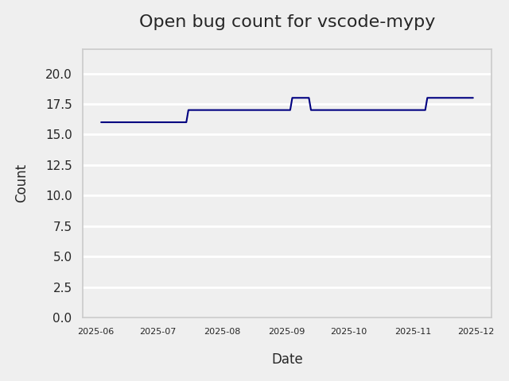
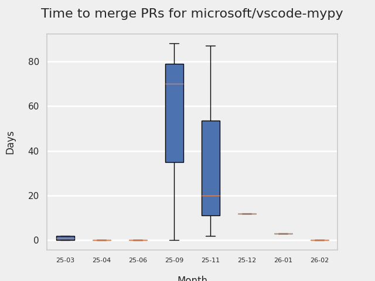
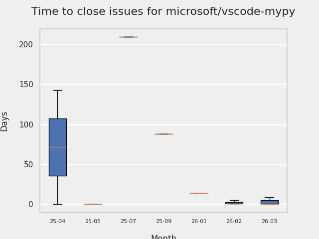
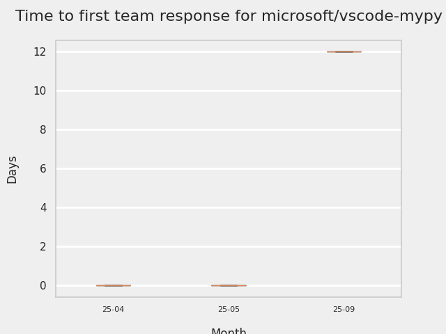
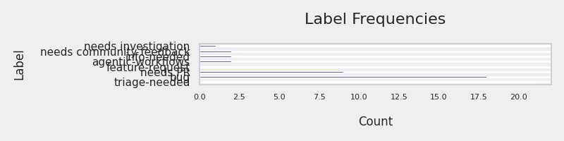
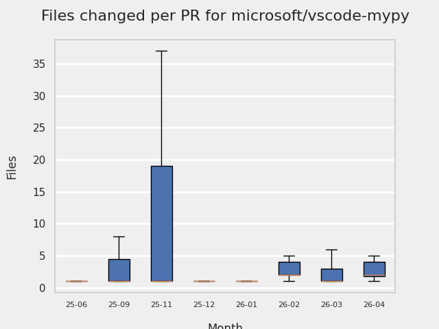
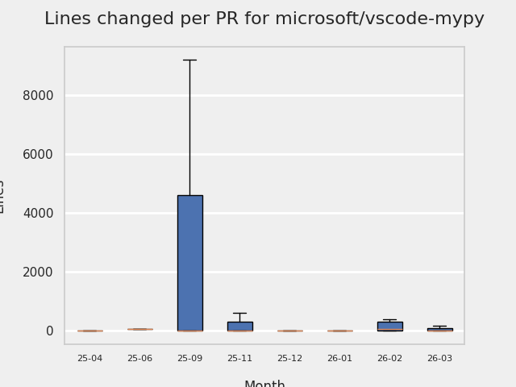
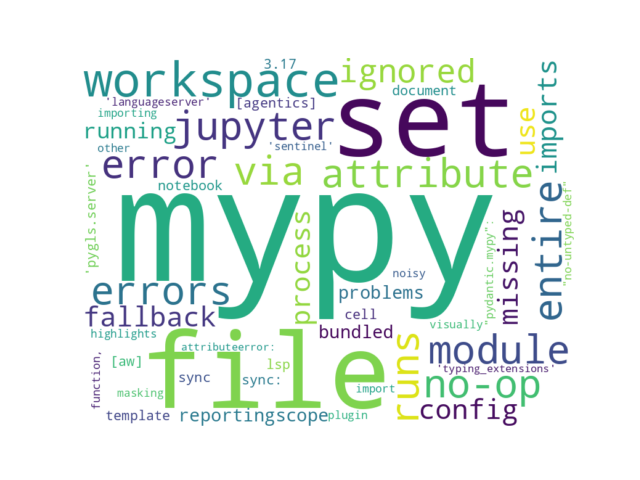

# GITHUB ISSUES REPORT FOR microsoft/vscode-mypy

Generated on 2025-11-16 using: stale=30, all=True

* marks items that are new to report in past 1 day(s)

## FOR ISSUES THAT ARE MARKED AS BUGS:

### Issues in vscode-mypy that need a response from team:

| Days Ago | Issue | Title |
| --- | --- | --- |
 |  OP:9  |[380](https://github.com/microsoft/vscode-mypy/issues/380 "Error importing plugin &quot;pydantic.mypy&quot;: cannot import name 'Sentinel' from 'typing_extensions'") | Error importing plugin "pydantic.mypy": cannot import name 'Sentinel' from 'typing_extensions' |
 |  OP:124  |[370](https://github.com/microsoft/vscode-mypy/issues/370 "Errors not displayed in text editor for `[type-var]` errors") | Errors not displayed in text editor for `[type-var]` errors |
 |  OP:220  |[362](https://github.com/microsoft/vscode-mypy/issues/362 "`ignorePatterns` appears to be ignored when `reportingScope=workspace`") | `ignorePatterns` appears to be ignored when `reportingScope=workspace` |
 |  OP:312  |[338](https://github.com/microsoft/vscode-mypy/issues/338 "`ignorePatterns` glob is no longer relative to the project root") | `ignorePatterns` glob is no longer relative to the project root |
 |  OP:570  |[300](https://github.com/microsoft/vscode-mypy/issues/300 "`mypy-type-checker.cwd` conflicting documentation") | `mypy-type-checker.cwd` conflicting documentation |

### Issues in vscode-mypy that have comments from OP after last team response:

| Days Ago | Issue | Title |
| --- | --- | --- |
 |  TM:207, OP:207  |[363](https://github.com/microsoft/vscode-mypy/issues/363 "Mypy cannot find implementation if launched via the extension") | Mypy cannot find implementation if launched via the extension |
 |  TM:363, OP:362  |[330](https://github.com/microsoft/vscode-mypy/issues/330 "Use daemon of mypy is slower than not used,and may get stucked when user save changes.") | Use daemon of mypy is slower than not used,and may get stucked when user save changes. |
 |  TM:730, OP:711  |[217](https://github.com/microsoft/vscode-mypy/issues/217 "PYTHONPATH is corrupted by bundled dependencies dir in mypy process when using mypy-type-checker.path") | PYTHONPATH is corrupted by bundled dependencies dir in mypy process when using mypy-type-checker.path |
 |  TM:740, OP:740  |[208](https://github.com/microsoft/vscode-mypy/issues/208 "`--ignore-missing-imports` not working for all imports") | `--ignore-missing-imports` not working for all imports |
 |  TM:755, OP:754  |[184](https://github.com/microsoft/vscode-mypy/issues/184 "Can not fallback to bundled mypy with fromEnvironment") | Can not fallback to bundled mypy with fromEnvironment |

### Issues in vscode-mypy that have comments from 3rd party after last team response:

| Days Ago | Issue | Title |
| --- | --- | --- |
 |  P:259,  |[306](https://github.com/microsoft/vscode-mypy/issues/306 "Missing Language Server Features (autocomplete & inlay hints)") | Missing Language Server Features (autocomplete & inlay hints) |
 |  P:220,  |[206](https://github.com/microsoft/vscode-mypy/issues/206 "The problem found by mypy do not shown in PROBLEMS") | The problem found by mypy do not shown in PROBLEMS |
 |  P:786,  |[122](https://github.com/microsoft/vscode-mypy/issues/122 "Doesn't respond to changes to pyproject.toml") | Doesn't respond to changes to pyproject.toml |

### Issues in vscode-mypy that have no external responses since team response in 30+ days:

| Days Ago | Issue | Title |
| --- | --- | --- |
 |  TM:266  |[329](https://github.com/microsoft/vscode-mypy/issues/329 "Unable to set config to ignore errors related to a specific module") | Unable to set config to ignore errors related to a specific module |
 |  TM:418  |[324](https://github.com/microsoft/vscode-mypy/issues/324 "`vscode-mypy` wrongly linters missing imports when `mypy` is used with `pre-commit`") | `vscode-mypy` wrongly linters missing imports when `mypy` is used with `pre-commit` |
 |  TM:605  |[236](https://github.com/microsoft/vscode-mypy/issues/236 "`dmypy` process remains running") | `dmypy` process remains running |
 |  TM:718  |[226](https://github.com/microsoft/vscode-mypy/issues/226 "mypy shows stale results") | mypy shows stale results |

---

## FOR ISSUES THAT ARE NOT MARKED AS BUGS:

### Issues in vscode-mypy that need a response from team:

| Days Ago | Issue | Title |
| --- | --- | --- |
 |  OP:72  |[373](https://github.com/microsoft/vscode-mypy/issues/373 "Bump node 22.x") | Bump node 22.x |
 |  OP:362  |[331](https://github.com/microsoft/vscode-mypy/issues/331 "Broken `fromEnvironment` fallback causing issue with monorepo workspaces") | Broken `fromEnvironment` fallback causing issue with monorepo workspaces |
 |  OP:858  |[86](https://github.com/microsoft/vscode-mypy/issues/86 "Enable on Jupyter notebooks") | Enable on Jupyter notebooks |

### Issues in vscode-mypy that have comments from OP after last team response:

| Days Ago | Issue | Title |
| --- | --- | --- |
 |  TM:835, OP:820  |[93](https://github.com/microsoft/vscode-mypy/issues/93 "&quot;Server initialization failed&quot; with Poetry environment") | "Server initialization failed" with Poetry environment |
 |  TM:916, OP:866  |[191](https://github.com/microsoft/vscode-mypy/issues/191 "MyPy should receive the python interpreter used in the project") | MyPy should receive the python interpreter used in the project |

### Issues in vscode-mypy that have comments from 3rd party after last team response:

| Days Ago | Issue | Title |
| --- | --- | --- |
 |  P:537,  |[259](https://github.com/microsoft/vscode-mypy/issues/259 "Monorepo: allow a way to configure `cwd` based on `pyproject.toml` or `ini` file location") | Monorepo: allow a way to configure `cwd` based on `pyproject.toml` or `ini` file location |
 |  P:655,  |[154](https://github.com/microsoft/vscode-mypy/issues/154 "python.envFile setting looks to be ignored") | python.envFile setting looks to be ignored |
 |  P:860,  |[37](https://github.com/microsoft/vscode-mypy/issues/37 "IntelliSense and mypy config support") | IntelliSense and mypy config support |
 |  P:571,  |[193](https://github.com/microsoft/vscode-mypy/issues/193 "show some indication that mypy is running") | show some indication that mypy is running |
 |  P:276,  |[190](https://github.com/microsoft/vscode-mypy/issues/190 "Automatically use mypy.ini or pyproject.toml when not in the root directory of the workspace") | Automatically use mypy.ini or pyproject.toml when not in the root directory of the workspace |

### Issues in vscode-mypy that have no external responses since team response in 30+ days:

| Days Ago | Issue | Title |
| --- | --- | --- |
 |  TM:62  |[381](https://github.com/microsoft/vscode-mypy/issues/381 "AttributeError: 'FuncDef' object has no attribute 'is_trivial_self'") | AttributeError: 'FuncDef' object has no attribute 'is_trivial_self' |
 |  TM:704  |[234](https://github.com/microsoft/vscode-mypy/issues/234 "Support reportingScope &quot;project&quot;") | Support reportingScope "project" |
 |  TM:887  |[56](https://github.com/microsoft/vscode-mypy/issues/56 "Feature request: Offer &quot;# type: ignore&quot; quick fix for line and entire file") | Feature request: Offer "# type: ignore" quick fix for line and entire file |

## MOST FREQUENTLY CHANGED FILES (by # of PRs):

  8: bundled/tool/lsp_server.py

  6: package-lock.json

  6: package.json

  5: README.md

