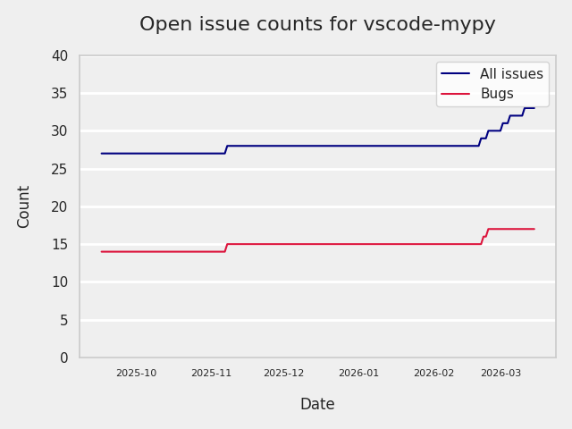
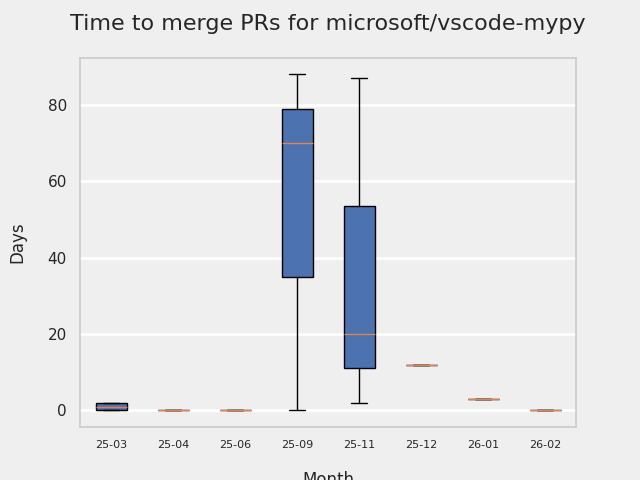
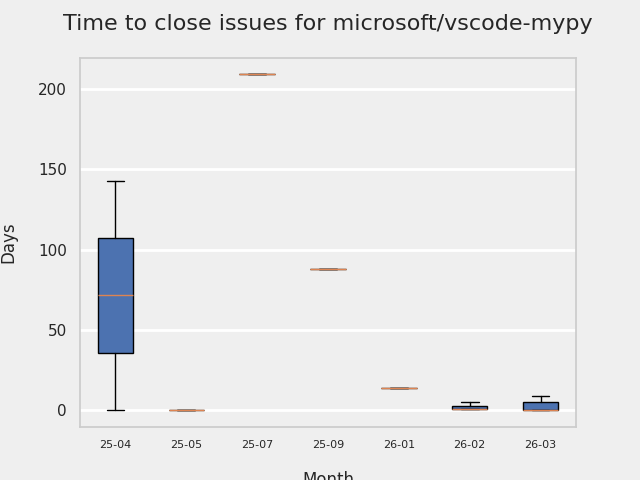
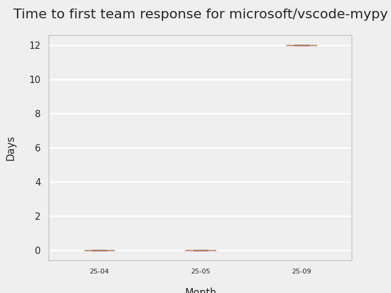
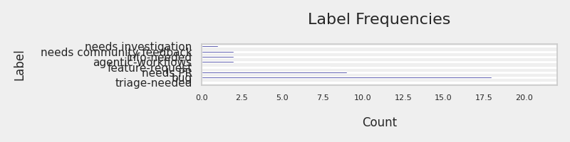
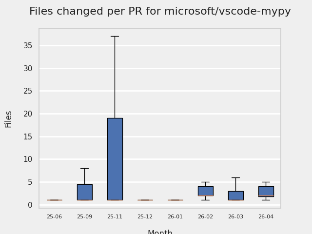
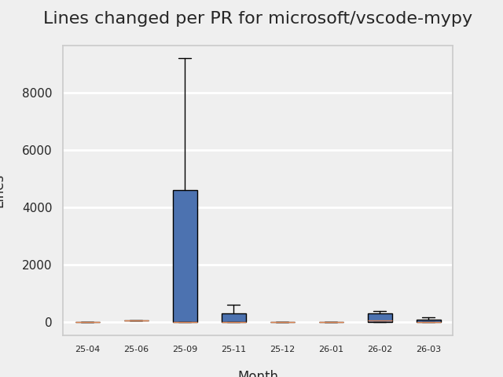
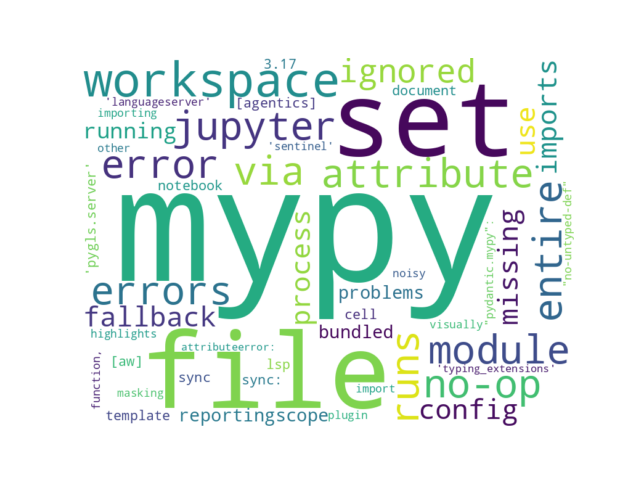

# GITHUB ISSUES REPORT FOR microsoft/vscode-mypy

Generated on 2026-04-05 using: stale=30, all=True

* marks items that are new to report in past 7 day(s)

## FOR ISSUES THAT ARE MARKED AS BUGS:

### Issues in vscode-mypy that need a response from team:

| Days Ago | Issue | Title |
| --- | --- | --- |
 | \* OP:4  |[497](https://github.com/microsoft/vscode-mypy/issues/497 "incorrectly reports type error for union types in property setters")  |incorrectly reports type error for union types in property setters |
 |  OP:41  |[431](https://github.com/microsoft/vscode-mypy/issues/431 "module 'pygls.server' has no attribute 'LanguageServer'") | module 'pygls.server' has no attribute 'LanguageServer' |
 |  OP:44  |[429](https://github.com/microsoft/vscode-mypy/issues/429 "Mypy &quot;no-untyped-def&quot; error highlights entire function, visually noisy and masking other errors") | Mypy "no-untyped-def" error highlights entire function, visually noisy and masking other errors |
 |  OP:149  |[380](https://github.com/microsoft/vscode-mypy/issues/380 "Error importing plugin &quot;pydantic.mypy&quot;: cannot import name 'Sentinel' from 'typing_extensions'") | Error importing plugin "pydantic.mypy": cannot import name 'Sentinel' from 'typing_extensions' |
 |  OP:360  |[362](https://github.com/microsoft/vscode-mypy/issues/362 "`ignorePatterns` appears to be ignored when `reportingScope=workspace`") | `ignorePatterns` appears to be ignored when `reportingScope=workspace` |
 |  OP:710  |[300](https://github.com/microsoft/vscode-mypy/issues/300 "`mypy-type-checker.cwd` conflicting documentation") | `mypy-type-checker.cwd` conflicting documentation |

### Issues in vscode-mypy that have comments from OP after last team response:

| Days Ago | Issue | Title |
| --- | --- | --- |
 |  TM:347, OP:347  |[363](https://github.com/microsoft/vscode-mypy/issues/363 "Mypy cannot find implementation if launched via the extension") | Mypy cannot find implementation if launched via the extension |
 |  TM:503, OP:502  |[330](https://github.com/microsoft/vscode-mypy/issues/330 "Use daemon of mypy is slower than not used,and may get stucked when user save changes.") | Use daemon of mypy is slower than not used,and may get stucked when user save changes. |
 |  TM:870, OP:851  |[217](https://github.com/microsoft/vscode-mypy/issues/217 "PYTHONPATH is corrupted by bundled dependencies dir in mypy process when using mypy-type-checker.path") | PYTHONPATH is corrupted by bundled dependencies dir in mypy process when using mypy-type-checker.path |
 |  TM:880, OP:880  |[208](https://github.com/microsoft/vscode-mypy/issues/208 "`--ignore-missing-imports` not working for all imports") | `--ignore-missing-imports` not working for all imports |
 |  TM:895, OP:894  |[184](https://github.com/microsoft/vscode-mypy/issues/184 "Can not fallback to bundled mypy with fromEnvironment") | Can not fallback to bundled mypy with fromEnvironment |

### Issues in vscode-mypy that have comments from 3rd party after last team response:

| Days Ago | Issue | Title |
| --- | --- | --- |
 |  P:399,  |[306](https://github.com/microsoft/vscode-mypy/issues/306 "Missing Language Server Features (autocomplete & inlay hints)") | Missing Language Server Features (autocomplete & inlay hints) |
 |  P:360,  |[206](https://github.com/microsoft/vscode-mypy/issues/206 "The problem found by mypy do not shown in PROBLEMS") | The problem found by mypy do not shown in PROBLEMS |

### Issues in vscode-mypy that have no external responses since team response in 30+ days:

| Days Ago | Issue | Title |
| --- | --- | --- |
 |  TM:406  |[329](https://github.com/microsoft/vscode-mypy/issues/329 "Unable to set config to ignore errors related to a specific module") | Unable to set config to ignore errors related to a specific module |
 |  TM:558  |[324](https://github.com/microsoft/vscode-mypy/issues/324 "`vscode-mypy` wrongly linters missing imports when `mypy` is used with `pre-commit`") | `vscode-mypy` wrongly linters missing imports when `mypy` is used with `pre-commit` |
 |  TM:745  |[236](https://github.com/microsoft/vscode-mypy/issues/236 "`dmypy` process remains running") | `dmypy` process remains running |
 |  TM:858  |[226](https://github.com/microsoft/vscode-mypy/issues/226 "mypy shows stale results") | mypy shows stale results |

---

## FOR ISSUES THAT ARE NOT MARKED AS BUGS:

### Issues in vscode-mypy that need a response from team:

| Days Ago | Issue | Title |
| --- | --- | --- |
 | \* OP:4  |[496](https://github.com/microsoft/vscode-mypy/issues/496 "Phase 2: Add missing test coverage before shared package extraction")  |Phase 2: Add missing test coverage before shared package extraction |
 | \* OP:5  |[494](https://github.com/microsoft/vscode-mypy/issues/494 "Feature Parity: Priority fixes before shared package extraction")  |Feature Parity: Priority fixes before shared package extraction |
 |  OP:26  |[474](https://github.com/microsoft/vscode-mypy/issues/474 "Template Sync: Add Jupyter notebook cell support via LSP 3.17 Notebook Document Sync") | Template Sync: Add Jupyter notebook cell support via LSP 3.17 Notebook Document Sync |
 |  OP:32  |[457](https://github.com/microsoft/vscode-mypy/issues/457 "[aw] No-Op Runs") | [aw] No-Op Runs |
 |  OP:35  |[450](https://github.com/microsoft/vscode-mypy/issues/450 "[agentics] No-Op Runs") | [agentics] No-Op Runs |
 |  OP:502  |[331](https://github.com/microsoft/vscode-mypy/issues/331 "Broken `fromEnvironment` fallback causing issue with monorepo workspaces") | Broken `fromEnvironment` fallback causing issue with monorepo workspaces |
 |  OP:998  |[86](https://github.com/microsoft/vscode-mypy/issues/86 "Enable on Jupyter notebooks") | Enable on Jupyter notebooks |

### Issues in vscode-mypy that have comments from OP after last team response:

| Days Ago | Issue | Title |
| --- | --- | --- |
 |  TM:975, OP:960  |[93](https://github.com/microsoft/vscode-mypy/issues/93 "&quot;Server initialization failed&quot; with Poetry environment") | "Server initialization failed" with Poetry environment |

### Issues in vscode-mypy that have comments from 3rd party after last team response:

| Days Ago | Issue | Title |
| --- | --- | --- |
 |  P:677,  |[259](https://github.com/microsoft/vscode-mypy/issues/259 "Monorepo: allow a way to configure `cwd` based on `pyproject.toml` or `ini` file location") | Monorepo: allow a way to configure `cwd` based on `pyproject.toml` or `ini` file location |
 |  P:795,  |[154](https://github.com/microsoft/vscode-mypy/issues/154 "python.envFile setting looks to be ignored") | python.envFile setting looks to be ignored |
 |  P:1000,  |[37](https://github.com/microsoft/vscode-mypy/issues/37 "IntelliSense and mypy config support") | IntelliSense and mypy config support |
 |  P:711,  |[193](https://github.com/microsoft/vscode-mypy/issues/193 "show some indication that mypy is running") | show some indication that mypy is running |
 |  P:416,  |[190](https://github.com/microsoft/vscode-mypy/issues/190 "Automatically use mypy.ini or pyproject.toml when not in the root directory of the workspace") | Automatically use mypy.ini or pyproject.toml when not in the root directory of the workspace |

### Issues in vscode-mypy that have no external responses since team response in 30+ days:

| Days Ago | Issue | Title |
| --- | --- | --- |
 |  TM:202  |[381](https://github.com/microsoft/vscode-mypy/issues/381 "AttributeError: 'FuncDef' object has no attribute 'is_trivial_self'") | AttributeError: 'FuncDef' object has no attribute 'is_trivial_self' |
 |  TM:844  |[234](https://github.com/microsoft/vscode-mypy/issues/234 "Support reportingScope &quot;project&quot;") | Support reportingScope "project" |
 |  TM:1027  |[56](https://github.com/microsoft/vscode-mypy/issues/56 "Feature request: Offer &quot;# type: ignore&quot; quick fix for line and entire file") | Feature request: Offer "# type: ignore" quick fix for line and entire file |

## PULL REQUEST ACTIVITY

### Pull Requests opened in the past 7 day(s):

| | PR | Created By | Created | Days Open | Closed/Merged | Closed/Merged By | Title |
| --- | --- | --- | --- | --- | --- | --- | --- |
| \* | [#499](https://github.com/microsoft/vscode-mypy/pull/499) | dependabot | 2026-04-01 | 3 | - | - | Bump the npm-minor-patch group across 1 directory with 5 updates |
| \* | [#498](https://github.com/microsoft/vscode-mypy/pull/498) | edvilme | 2026-04-01 | 4 | - | - | test: add missing test coverage for PRs #325, #347, #357, #467 |
| \* | [#495](https://github.com/microsoft/vscode-mypy/pull/495) | edvilme | 2026-03-31 | 5 | - | - | Feature Parity: Tier 1 priority fixes |

### Pull Requests closed (not merged) in the past 7 day(s):

| | PR | Created By | Created | Days Open | Closed/Merged | Closed/Merged By | Title |
| --- | --- | --- | --- | --- | --- | --- | --- |
| \* | [#489](https://github.com/microsoft/vscode-mypy/pull/489) | dependabot | 2026-03-23 | 9 | 2026-04-01 | - | Bump the npm-minor-patch group across 1 directory with 4 updates |

### Pull Requests still open that were opened more than 7 days ago:

| | PR | Created By | Created | Days Open | Closed/Merged | Closed/Merged By | Title |
| --- | --- | --- | --- | --- | --- | --- | --- |
| \* | [#366](https://github.com/microsoft/vscode-mypy/pull/366) | dependabot | 2025-05-19 | 321 | - | - | Bump setuptools from 75.8.0 to 78.1.1 |
| \* | [#392](https://github.com/microsoft/vscode-mypy/pull/392) | dependabot | 2026-01-22 | 73 | - | - | Bump lodash from 4.17.21 to 4.17.23 |
| \* | [#393](https://github.com/microsoft/vscode-mypy/pull/393) | dependabot | 2026-01-22 | 73 | - | - | Bump wheel from 0.45.1 to 0.46.2 |
| \* | [#394](https://github.com/microsoft/vscode-mypy/pull/394) | dependabot | 2026-02-02 | 62 | - | - | Bump pip from 25.0.1 to 26.0 |
| \* | [#403](https://github.com/microsoft/vscode-mypy/pull/403) | dependabot | 2026-02-13 | 51 | - | - | Bump qs from 6.14.1 to 6.14.2 |
| \* | [#405](https://github.com/microsoft/vscode-mypy/pull/405) | dependabot | 2026-02-13 | 51 | - | - | Bump pytest from 8.3.4 to 9.0.2 in /src/test/python_tests |
| \* | [#407](https://github.com/microsoft/vscode-mypy/pull/407) | dependabot | 2026-02-13 | 51 | - | - | Bump actions/setup-node from 4 to 6 |
| \* | [#408](https://github.com/microsoft/vscode-mypy/pull/408) | dependabot | 2026-02-13 | 51 | - | - | Bump actions/checkout from 4 to 6 |
| \* | [#409](https://github.com/microsoft/vscode-mypy/pull/409) | dependabot | 2026-02-13 | 51 | - | - | Bump packaging from 24.2 to 26.0 |
| \* | [#411](https://github.com/microsoft/vscode-mypy/pull/411) | dependabot | 2026-02-13 | 51 | - | - | Bump github/codeql-action from 3 to 4 |
| \* | [#412](https://github.com/microsoft/vscode-mypy/pull/412) | dependabot | 2026-02-13 | 51 | - | - | Bump actions/github-script from 7 to 8 |
| \* | [#413](https://github.com/microsoft/vscode-mypy/pull/413) | dependabot | 2026-02-13 | 51 | - | - | Bump eslint from 8.57.1 to 10.0.0 |
| \* | [#415](https://github.com/microsoft/vscode-mypy/pull/415) | dependabot | 2026-02-13 | 51 | - | - | Bump nox from 2025.2.9 to 2026.2.9 |
| \* | [#416](https://github.com/microsoft/vscode-mypy/pull/416) | dependabot | 2026-02-13 | 51 | - | - | Bump chai from 4.5.0 to 6.2.2 |
| \* | [#417](https://github.com/microsoft/vscode-mypy/pull/417) | dependabot | 2026-02-13 | 51 | - | - | Bump @typescript-eslint/eslint-plugin from 7.18.0 to 8.55.0 |
| \* | [#418](https://github.com/microsoft/vscode-mypy/pull/418) | dependabot | 2026-02-13 | 51 | - | - | Bump webpack-cli from 5.1.4 to 6.0.1 |
| \* | [#419](https://github.com/microsoft/vscode-mypy/pull/419) | dependabot | 2026-02-13 | 51 | - | - | Bump glob from 11.1.0 to 13.0.3 |
| \* | [#420](https://github.com/microsoft/vscode-mypy/pull/420) | dependabot | 2026-02-13 | 51 | - | - | Bump @typescript-eslint/parser from 7.18.0 to 8.55.0 |
| \* | [#461](https://github.com/microsoft/vscode-mypy/pull/461) | dependabot | 2026-03-06 | 30 | - | - | Bump filelock from 3.17.0 to 3.20.3 |
| \* | [#473](https://github.com/microsoft/vscode-mypy/pull/473) | edvilme | 2026-03-10 | 26 | - | - | Add Jupyter notebook cell support via LSP 3.17 Notebook Document Sync |
| \* | [#476](https://github.com/microsoft/vscode-mypy/pull/476) | dependabot | 2026-03-11 | 24 | - | - | Bump the github-actions-minor-patch group across 1 directory with 2 updates |
| \* | [#480](https://github.com/microsoft/vscode-mypy/pull/480) | dependabot | 2026-03-17 | 19 | - | - | Bump undici from 7.22.0 to 7.24.4 |
| \* | [#481](https://github.com/microsoft/vscode-mypy/pull/481) | dependabot | 2026-03-18 | 18 | - | - | Bump ujson from 5.10.0 to 5.12.0 in /src/test/python_tests |
| \* | [#486](https://github.com/microsoft/vscode-mypy/pull/486) | dependabot | 2026-03-20 | 16 | - | - | Bump flatted from 3.3.3 to 3.4.2 |
|   | [#491](https://github.com/microsoft/vscode-mypy/pull/491) | dependabot | 2026-03-25 | 10 | - | - | Bump the pip-minor-patch group across 1 directory with 3 updates |
|   | [#492](https://github.com/microsoft/vscode-mypy/pull/492) | dependabot | 2026-03-26 | 10 | - | - | Bump picomatch from 2.3.1 to 2.3.2 |
|   | [#493](https://github.com/microsoft/vscode-mypy/pull/493) | dependabot | 2026-03-27 | 9 | - | - | Bump brace-expansion from 1.1.12 to 1.1.13 |

## MOST FREQUENTLY CHANGED FILES (by # of PRs):

 14: package-lock.json

 10: package.json

  6: bundled/tool/lsp_server.py

  5: .github/workflows/extension-template-sync.md

  5: bundled/tool/lsp_utils.py

