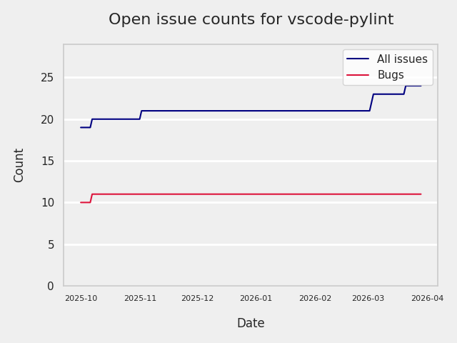
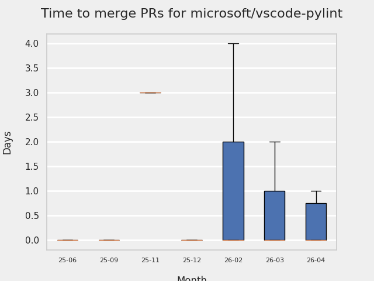
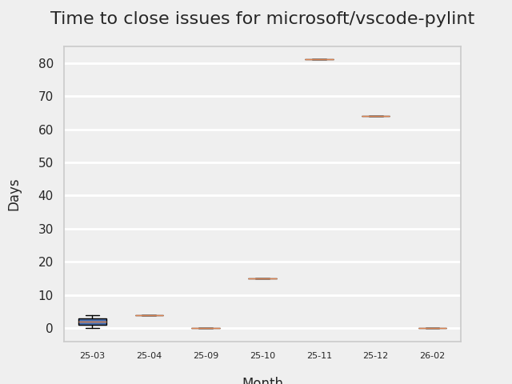
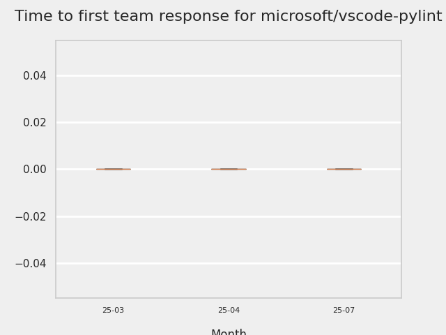
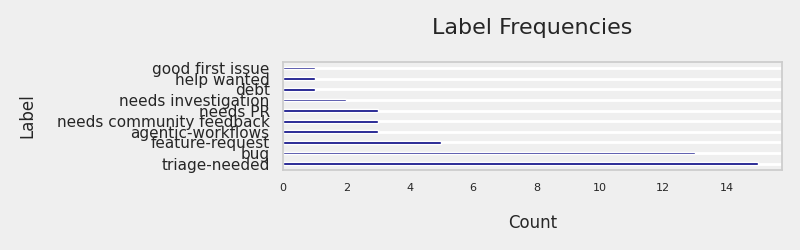
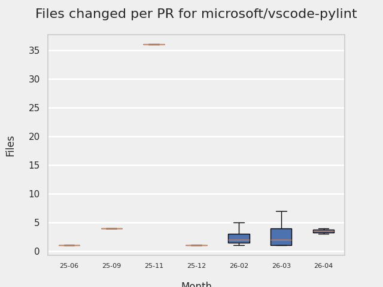
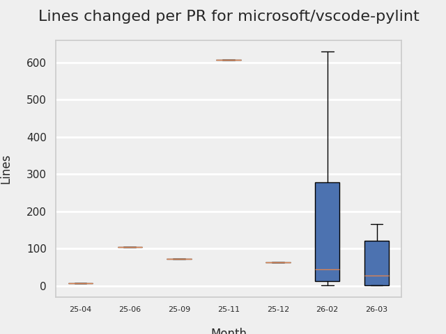
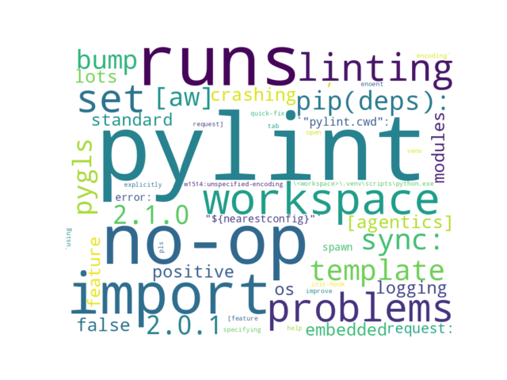

# GITHUB ISSUES REPORT FOR microsoft/vscode-pylint

Generated on 2026-03-29 using: stale=30, all=True

* marks items that are new to report in past 7 day(s)

## FOR ISSUES THAT ARE MARKED AS BUGS:

### Issues in vscode-pylint that need a response from team:

| Days Ago | Issue | Title |
| --- | --- | --- |
 |  OP:174  |[620](https://github.com/microsoft/vscode-pylint/issues/620 "False positive Unable to import with standard modules like os , logging using python embedded inside the workspace") | False positive Unable to import with standard modules like os , logging using python embedded inside the workspace |
 |  OP:359  |[605](https://github.com/microsoft/vscode-pylint/issues/605 "init-hook not working") | init-hook not working |
 |  OP:397  |[599](https://github.com/microsoft/vscode-pylint/issues/599 "Improve docs for pylint.args") | Improve docs for pylint.args |

### Issues in vscode-pylint that have comments from 3rd party after last team response:

| Days Ago | Issue | Title |
| --- | --- | --- |
 |  P:186,  |[581](https://github.com/microsoft/vscode-pylint/issues/581 "Cannot globally set Import Strategy") | Cannot globally set Import Strategy |
 |  P:474,  |[454](https://github.com/microsoft/vscode-pylint/issues/454 "Linting on change/save (with autosave) can be slow") | Linting on change/save (with autosave) can be slow |
 |  P:870,  |[376](https://github.com/microsoft/vscode-pylint/issues/376 "Support dotenv files discovery") | Support dotenv files discovery |
 |  P:399,  |[433](https://github.com/microsoft/vscode-pylint/issues/433 "Pylint doesn't find the path set in `.env` and `terminal.integrated.env.linux`") | Pylint doesn't find the path set in `.env` and `terminal.integrated.env.linux` |

### Issues in vscode-pylint that have no external responses since team response in 30+ days:

| Days Ago | Issue | Title |
| --- | --- | --- |
 |  TM:404  |[594](https://github.com/microsoft/vscode-pylint/issues/594 "Unrecognized option found: max-positional-arguments") | Unrecognized option found: max-positional-arguments |
 |  TM:398  |[476](https://github.com/microsoft/vscode-pylint/issues/476 "[BUG] multiple lsp_server.py processes are spawned for each folder in a multi-root workspace") | [BUG] multiple lsp_server.py processes are spawned for each folder in a multi-root workspace |
 |  TM:1459  |[26](https://github.com/microsoft/vscode-pylint/issues/26 "Problems duplicated when using Jedi") | Problems duplicated when using Jedi |

---

## FOR ISSUES THAT ARE NOT MARKED AS BUGS:

### Issues in vscode-pylint that need a response from team:

| Days Ago | Issue | Title |
| --- | --- | --- |
 |  OP:9  |[756](https://github.com/microsoft/vscode-pylint/issues/756 "Template Sync: pip(deps): bump pygls from 2.0.1 to 2.1.0") | Template Sync: pip(deps): bump pygls from 2.0.1 to 2.1.0 |
 |  OP:26  |[724](https://github.com/microsoft/vscode-pylint/issues/724 "[aw] No-Op Runs") | [aw] No-Op Runs |
 |  OP:27  |[719](https://github.com/microsoft/vscode-pylint/issues/719 "[agentics] No-Op Runs") | [agentics] No-Op Runs |
 |  OP:148  |[625](https://github.com/microsoft/vscode-pylint/issues/625 "Lots of crashing") | Lots of crashing |
 |  OP:191  |[618](https://github.com/microsoft/vscode-pylint/issues/618 "Feature Request: `&quot;pylint.cwd&quot;: &quot;${nearestConfig}&quot;`") | Feature Request: `"pylint.cwd": "${nearestConfig}"` |
 |  OP:336  |[607](https://github.com/microsoft/vscode-pylint/issues/607 "[feature request] Quick-fix for `Using open without explicitly specifying an encoding` W1514:unspecified-encoding") | [feature request] Quick-fix for `Using open without explicitly specifying an encoding` W1514:unspecified-encoding |
 |  OP:612  |[567](https://github.com/microsoft/vscode-pylint/issues/567 "Pylint makes &quot;Quick Fix&quot; suggestions take 10s+ to load") | Pylint makes "Quick Fix" suggestions take 10s+ to load |
 |  OP:1425  |[79](https://github.com/microsoft/vscode-pylint/issues/79 "Project wide evaluation") | Project wide evaluation |

### Issues in vscode-pylint that have comments from OP after last team response:

| Days Ago | Issue | Title |
| --- | --- | --- |
 |  TM:256, OP:256  |[613](https://github.com/microsoft/vscode-pylint/issues/613 "Error: spawn \<workspace>\.venv\Scripts\python.exe ENOENT") | Error: spawn \<workspace>\.venv\Scripts\python.exe ENOENT |
 |  TM:739, OP:736  |[535](https://github.com/microsoft/vscode-pylint/issues/535 "ignore concrete linting warnings via GUI, e.g. via QuickFix") | ignore concrete linting warnings via GUI, e.g. via QuickFix |
 |  TM:1115, OP:1114  |[297](https://github.com/microsoft/vscode-pylint/issues/297 "pylint goes silent if improperly configured ") | pylint goes silent if improperly configured  |

### Issues in vscode-pylint that have no external responses since team response in 30+ days:

| Days Ago | Issue | Title |
| --- | --- | --- |
 |  TM:326  |[606](https://github.com/microsoft/vscode-pylint/issues/606 "pylint doesn't show problems in problem tab from venv pls help") | pylint doesn't show problems in problem tab from venv pls help |
 |  TM:654  |[560](https://github.com/microsoft/vscode-pylint/issues/560 "Automatic restart after library is installed") | Automatic restart after library is installed |

## PULL REQUEST ACTIVITY

### Pull Requests opened in the past 7 day(s):

| | PR | Created By | Created | Days Open | Closed/Merged | Closed/Merged By | Title |
| --- | --- | --- | --- | --- | --- | --- | --- |
| \* | [#761](https://github.com/microsoft/vscode-pylint/pull/761) | dependabot | 2026-03-25 | 3 | - | - | Bump picomatch |
| \* | [#760](https://github.com/microsoft/vscode-pylint/pull/760) | dependabot | 2026-03-25 | 4 | - | - | Bump the pip-minor-patch group across 1 directory with 2 updates |
| \* | [#759](https://github.com/microsoft/vscode-pylint/pull/759) | edvilme | 2026-03-23 | 1 | 2026-03-25 | edvilme | Template sync: skip dependency update PRs |
| \* | [#759](https://github.com/microsoft/vscode-pylint/pull/759) | edvilme | 2026-03-23 | 1 | 2026-03-25 | edvilme | Template sync: skip dependency update PRs |
| \* | [#758](https://github.com/microsoft/vscode-pylint/pull/758) | copilot-swe-agent | 2026-03-23 | 2 | 2026-03-25 | edvilme | Bump pygls from 2.0.1 to 2.1.0 |
| \* | [#758](https://github.com/microsoft/vscode-pylint/pull/758) | copilot-swe-agent | 2026-03-23 | 2 | 2026-03-25 | edvilme | Bump pygls from 2.0.1 to 2.1.0 |

### Pull Requests merged in the past 7 day(s):

| | PR | Created By | Created | Days Open | Closed/Merged | Closed/Merged By | Title |
| --- | --- | --- | --- | --- | --- | --- | --- |
| \* | [#758](https://github.com/microsoft/vscode-pylint/pull/758) | copilot-swe-agent | 2026-03-23 | 2 | 2026-03-25 | edvilme | Bump pygls from 2.0.1 to 2.1.0 |
| \* | [#758](https://github.com/microsoft/vscode-pylint/pull/758) | copilot-swe-agent | 2026-03-23 | 2 | 2026-03-25 | edvilme | Bump pygls from 2.0.1 to 2.1.0 |
| \* | [#759](https://github.com/microsoft/vscode-pylint/pull/759) | edvilme | 2026-03-23 | 1 | 2026-03-25 | edvilme | Template sync: skip dependency update PRs |
| \* | [#759](https://github.com/microsoft/vscode-pylint/pull/759) | edvilme | 2026-03-23 | 1 | 2026-03-25 | edvilme | Template sync: skip dependency update PRs |
| \* | [#739](https://github.com/microsoft/vscode-pylint/pull/739) | bschnurr | 2026-03-10 | 12 | 2026-03-23 | bschnurr | Bump version to 2026.3.0-dev |
| \* | [#739](https://github.com/microsoft/vscode-pylint/pull/739) | bschnurr | 2026-03-10 | 12 | 2026-03-23 | bschnurr | Bump version to 2026.3.0-dev |

### Pull Requests closed (not merged) in the past 7 day(s):

| | PR | Created By | Created | Days Open | Closed/Merged | Closed/Merged By | Title |
| --- | --- | --- | --- | --- | --- | --- | --- |
| \* | [#744](https://github.com/microsoft/vscode-pylint/pull/744) | dependabot | 2026-03-11 | 13 | 2026-03-25 | - | Bump black from 26.1.0 to 26.3.0 in the pip-minor-patch group |

### Pull Requests still open that were opened more than 7 days ago:

| | PR | Created By | Created | Days Open | Closed/Merged | Closed/Merged By | Title |
| --- | --- | --- | --- | --- | --- | --- | --- |
| \* | [#592](https://github.com/microsoft/vscode-pylint/pull/592) | karthiknadig | 2025-02-13 | 409 | - | - | Remove linting on change |
| \* | [#608](https://github.com/microsoft/vscode-pylint/pull/608) | hamirmahal | 2025-04-27 | 336 | - | - | feat: fix for `Pylint(W1514:unspecified-encoding)` |
| \* | [#619](https://github.com/microsoft/vscode-pylint/pull/619) | DipakHalkude | 2025-09-24 | 186 | - | - | Respect user-level pylint.importStrategy in workspace via inspect fal… |
| \* | [#704](https://github.com/microsoft/vscode-pylint/pull/704) | copilot-swe-agent | 2026-02-24 | 33 | - | - | Support `${nearestConfig}` for `pylint.cwd` and fix symlink path resolution |
| \* | [#746](https://github.com/microsoft/vscode-pylint/pull/746) | dependabot | 2026-03-11 | 18 | - | - | Bump @types/glob from 8.1.0 to 9.0.0 |
| \* | [#747](https://github.com/microsoft/vscode-pylint/pull/747) | dependabot | 2026-03-11 | 18 | - | - | Bump isort from 7.0.0 to 8.0.1 |
| \* | [#748](https://github.com/microsoft/vscode-pylint/pull/748) | dependabot | 2026-03-11 | 18 | - | - | Bump eslint from 8.57.0 to 10.0.3 |
| \* | [#749](https://github.com/microsoft/vscode-pylint/pull/749) | dependabot | 2026-03-11 | 18 | - | - | Bump the github-actions-minor-patch group with 2 updates |
| \* | [#750](https://github.com/microsoft/vscode-pylint/pull/750) | dependabot | 2026-03-12 | 17 | - | - | Bump black from 26.1.0 to 26.3.1 |
|   | [#751](https://github.com/microsoft/vscode-pylint/pull/751) | dependabot | 2026-03-18 | 11 | - | - | Bump ujson from 5.11.0 to 5.12.0 in /src/test/python_tests |
|   | [#752](https://github.com/microsoft/vscode-pylint/pull/752) | dependabot | 2026-03-18 | 11 | - | - | Bump the npm-minor-patch group with 2 updates |
|   | [#753](https://github.com/microsoft/vscode-pylint/pull/753) | dependabot | 2026-03-18 | 11 | - | - | Bump sinon and @types/sinon |
|   | [#754](https://github.com/microsoft/vscode-pylint/pull/754) | dependabot | 2026-03-18 | 11 | - | - | Bump webpack-cli from 5.1.4 to 7.0.2 |
|   | [#755](https://github.com/microsoft/vscode-pylint/pull/755) | dependabot | 2026-03-19 | 10 | - | - | Bump flatted from 3.3.1 to 3.4.2 |

## MOST FREQUENTLY CHANGED FILES (by # of PRs):

 20: package-lock.json

 18: package.json

 10: .github/workflows/check-python-versions.lock.yml

  8: .github/workflows/issue-triage.lock.yml

  6: .github/workflows/extension-template-sync.lock.yml

  6: bundled/tool/lsp_server.py

  5: .github/workflows/extension-template-sync.md

