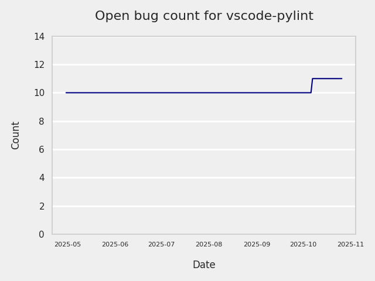
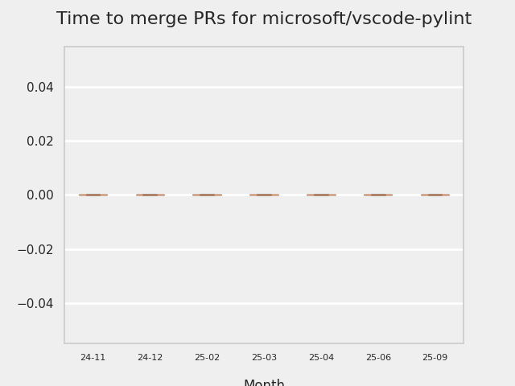

# GITHUB ISSUES REPORT FOR microsoft/vscode-pylint

Generated on 2025-10-23 using: stale=30, all=True

* marks items that are new to report in past 1 day(s)

## FOR ISSUES THAT ARE MARKED AS BUGS:

### Issues in vscode-pylint that need a response from team:

| Days Ago | Issue | Title |
| --- | --- | --- |
 |  OP:17  |[620](https://github.com/microsoft/vscode-pylint/issues/620 "False positive Unable to import with standard modules like os , logging using python embedded inside the workspace") | False positive Unable to import with standard modules like os , logging using python embedded inside the workspace |
 |  OP:201  |[605](https://github.com/microsoft/vscode-pylint/issues/605 "init-hook not working") | init-hook not working |
 |  OP:240  |[599](https://github.com/microsoft/vscode-pylint/issues/599 "Improve docs for pylint.args") | Improve docs for pylint.args |

### Issues in vscode-pylint that have comments from 3rd party after last team response:

| Days Ago | Issue | Title |
| --- | --- | --- |
 |  P:29,  |[581](https://github.com/microsoft/vscode-pylint/issues/581 "Cannot globally set Import Strategy") | Cannot globally set Import Strategy |
 |  P:316,  |[454](https://github.com/microsoft/vscode-pylint/issues/454 "Linting on change/save (with autosave) can be slow") | Linting on change/save (with autosave) can be slow |
 |  P:712,  |[376](https://github.com/microsoft/vscode-pylint/issues/376 "Support dotenv files discovery") | Support dotenv files discovery |
 |  P:241,  |[433](https://github.com/microsoft/vscode-pylint/issues/433 "Pylint doesn't find the path set in `.env` and `terminal.integrated.env.linux`") | Pylint doesn't find the path set in `.env` and `terminal.integrated.env.linux` |

### Issues in vscode-pylint that have no external responses since team response in 30+ days:

| Days Ago | Issue | Title |
| --- | --- | --- |
 |  TM:246  |[594](https://github.com/microsoft/vscode-pylint/issues/594 "Unrecognized option found: max-positional-arguments") | Unrecognized option found: max-positional-arguments |
 |  TM:241  |[476](https://github.com/microsoft/vscode-pylint/issues/476 "[BUG] multiple lsp_server.py processes are spawned for each folder in a multi-root workspace") | [BUG] multiple lsp_server.py processes are spawned for each folder in a multi-root workspace |
 |  TM:1301  |[26](https://github.com/microsoft/vscode-pylint/issues/26 "Problems duplicated when using Jedi") | Problems duplicated when using Jedi |

---

## FOR ISSUES THAT ARE NOT MARKED AS BUGS:

### Issues in vscode-pylint that need a response from team:

| Days Ago | Issue | Title |
| --- | --- | --- |
 |  OP:34  |[618](https://github.com/microsoft/vscode-pylint/issues/618 "Feature Request: `&quot;pylint.cwd&quot;: &quot;${nearestConfig}&quot;`") | Feature Request: `"pylint.cwd": "${nearestConfig}"` |
 |  OP:178  |[607](https://github.com/microsoft/vscode-pylint/issues/607 "[feature request] Quick-fix for `Using open without explicitly specifying an encoding` W1514:unspecified-encoding") | [feature request] Quick-fix for `Using open without explicitly specifying an encoding` W1514:unspecified-encoding |
 |  OP:454  |[567](https://github.com/microsoft/vscode-pylint/issues/567 "Pylint makes &quot;Quick Fix&quot; suggestions take 10s+ to load") | Pylint makes "Quick Fix" suggestions take 10s+ to load |
 |  OP:1255  |[96](https://github.com/microsoft/vscode-pylint/issues/96 "Show indicator that pylint is still running for the file") | Show indicator that pylint is still running for the file |
 |  OP:1268  |[79](https://github.com/microsoft/vscode-pylint/issues/79 "Project wide evaluation") | Project wide evaluation |
 |  OP:1268  |[78](https://github.com/microsoft/vscode-pylint/issues/78 "Reveal pylint evaluation score") | Reveal pylint evaluation score |

### Issues in vscode-pylint that have comments from OP after last team response:

| Days Ago | Issue | Title |
| --- | --- | --- |
 |  TM:98, OP:98  |[613](https://github.com/microsoft/vscode-pylint/issues/613 "Error: spawn \<workspace>\.venv\Scripts\python.exe ENOENT") | Error: spawn \<workspace>\.venv\Scripts\python.exe ENOENT |
 |  TM:581, OP:578  |[535](https://github.com/microsoft/vscode-pylint/issues/535 "ignore concrete linting warnings via GUI, e.g. via QuickFix") | ignore concrete linting warnings via GUI, e.g. via QuickFix |
 |  TM:957, OP:956  |[297](https://github.com/microsoft/vscode-pylint/issues/297 "pylint goes silent if improperly configured ") | pylint goes silent if improperly configured  |

### Issues in vscode-pylint that have comments from 3rd party after last team response:

| Days Ago | Issue | Title |
| --- | --- | --- |
 |  P:283,  |[20](https://github.com/microsoft/vscode-pylint/issues/20 "Support for ipynb files") | Support for ipynb files |

### Issues in vscode-pylint that have no external responses since team response in 30+ days:

| Days Ago | Issue | Title |
| --- | --- | --- |
 |  TM:169  |[606](https://github.com/microsoft/vscode-pylint/issues/606 "pylint doesn't show problems in problem tab from venv pls help") | pylint doesn't show problems in problem tab from venv pls help |
 |  TM:497  |[560](https://github.com/microsoft/vscode-pylint/issues/560 "Automatic restart after library is installed") | Automatic restart after library is installed |
 |  TM:643  |[479](https://github.com/microsoft/vscode-pylint/issues/479 "Resolve Pylance/Pylint overlap (optionally?)") | Resolve Pylance/Pylint overlap (optionally?) |

## MOST FREQUENTLY CHANGED FILES (by # of PRs):

  8: package-lock.json

  6: package.json

