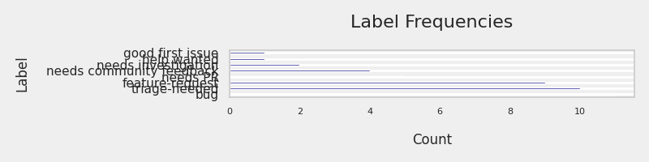
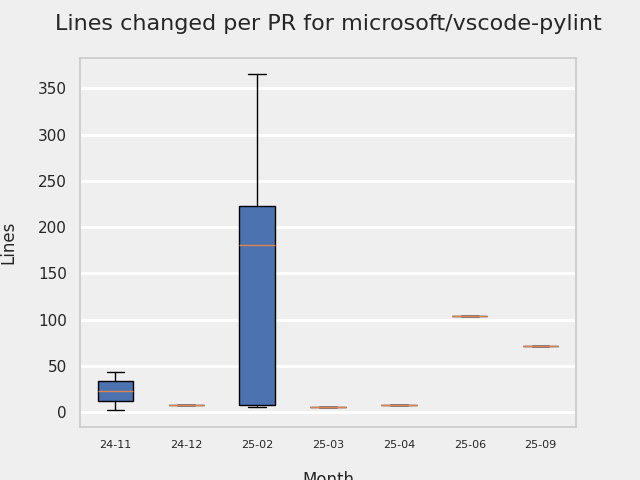
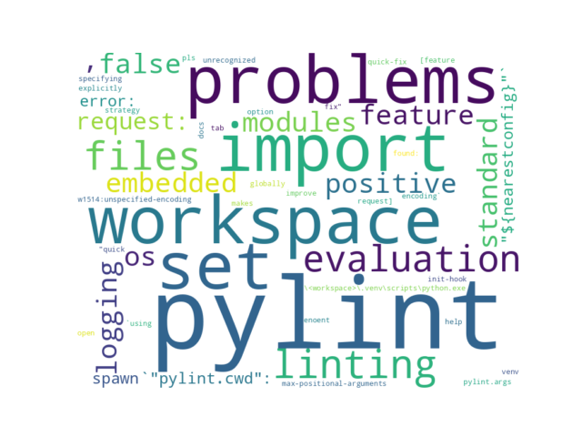

# GITHUB ISSUES REPORT FOR microsoft/vscode-pylint

Generated on 2026-02-23 using: stale=30, all=True

* marks items that are new to report in past 7 day(s)

## FOR ISSUES THAT ARE MARKED AS BUGS:

### Issues in vscode-pylint that need a response from team:

| Days Ago | Issue | Title |
| --- | --- | --- |
 |  OP:140  |[620](https://github.com/microsoft/vscode-pylint/issues/620 "False positive Unable to import with standard modules like os , logging using python embedded inside the workspace") | False positive Unable to import with standard modules like os , logging using python embedded inside the workspace |
 |  OP:324  |[605](https://github.com/microsoft/vscode-pylint/issues/605 "init-hook not working") | init-hook not working |
 |  OP:363  |[599](https://github.com/microsoft/vscode-pylint/issues/599 "Improve docs for pylint.args") | Improve docs for pylint.args |

### Issues in vscode-pylint that have comments from 3rd party after last team response:

| Days Ago | Issue | Title |
| --- | --- | --- |
 |  P:152,  |[581](https://github.com/microsoft/vscode-pylint/issues/581 "Cannot globally set Import Strategy") | Cannot globally set Import Strategy |
 |  P:440,  |[454](https://github.com/microsoft/vscode-pylint/issues/454 "Linting on change/save (with autosave) can be slow") | Linting on change/save (with autosave) can be slow |
 |  P:836,  |[376](https://github.com/microsoft/vscode-pylint/issues/376 "Support dotenv files discovery") | Support dotenv files discovery |
 |  P:365,  |[433](https://github.com/microsoft/vscode-pylint/issues/433 "Pylint doesn't find the path set in `.env` and `terminal.integrated.env.linux`") | Pylint doesn't find the path set in `.env` and `terminal.integrated.env.linux` |

### Issues in vscode-pylint that have no external responses since team response in 30+ days:

| Days Ago | Issue | Title |
| --- | --- | --- |
 |  TM:370  |[594](https://github.com/microsoft/vscode-pylint/issues/594 "Unrecognized option found: max-positional-arguments") | Unrecognized option found: max-positional-arguments |
 |  TM:364  |[476](https://github.com/microsoft/vscode-pylint/issues/476 "[BUG] multiple lsp_server.py processes are spawned for each folder in a multi-root workspace") | [BUG] multiple lsp_server.py processes are spawned for each folder in a multi-root workspace |
 |  TM:1425  |[26](https://github.com/microsoft/vscode-pylint/issues/26 "Problems duplicated when using Jedi") | Problems duplicated when using Jedi |

---

## FOR ISSUES THAT ARE NOT MARKED AS BUGS:

### Issues in vscode-pylint that need a response from team:

| Days Ago | Issue | Title |
| --- | --- | --- |
 |  OP:114  |[625](https://github.com/microsoft/vscode-pylint/issues/625 "Lots of crashing") | Lots of crashing |
 |  OP:157  |[618](https://github.com/microsoft/vscode-pylint/issues/618 "Feature Request: `"pylint.cwd": "${nearestConfig}"`") | Feature Request: `"pylint.cwd": "${nearestConfig}"` |
 |  OP:302  |[607](https://github.com/microsoft/vscode-pylint/issues/607 "[feature request] Quick-fix for `Using open without explicitly specifying an encoding` W1514:unspecified-encoding") | [feature request] Quick-fix for `Using open without explicitly specifying an encoding` W1514:unspecified-encoding |
 |  OP:578  |[567](https://github.com/microsoft/vscode-pylint/issues/567 "Pylint makes "Quick Fix" suggestions take 10s+ to load") | Pylint makes "Quick Fix" suggestions take 10s+ to load |
 |  OP:1391  |[79](https://github.com/microsoft/vscode-pylint/issues/79 "Project wide evaluation") | Project wide evaluation |

### Issues in vscode-pylint that have comments from OP after last team response:

| Days Ago | Issue | Title |
| --- | --- | --- |
 |  TM:221, OP:221  |[613](https://github.com/microsoft/vscode-pylint/issues/613 "Error: spawn \<workspace>\.venv\Scripts\python.exe ENOENT") | Error: spawn \<workspace>\.venv\Scripts\python.exe ENOENT |
 |  TM:705, OP:702  |[535](https://github.com/microsoft/vscode-pylint/issues/535 "ignore concrete linting warnings via GUI, e.g. via QuickFix") | ignore concrete linting warnings via GUI, e.g. via QuickFix |
 |  TM:1081, OP:1079  |[297](https://github.com/microsoft/vscode-pylint/issues/297 "pylint goes silent if improperly configured ") | pylint goes silent if improperly configured  |

### Issues in vscode-pylint that have comments from 3rd party after last team response:

| Days Ago | Issue | Title |
| --- | --- | --- |
 |  P:406,  |[20](https://github.com/microsoft/vscode-pylint/issues/20 "Support for ipynb files") | Support for ipynb files |

### Issues in vscode-pylint that have no external responses since team response in 30+ days:

| Days Ago | Issue | Title |
| --- | --- | --- |
 |  TM:292  |[606](https://github.com/microsoft/vscode-pylint/issues/606 "pylint doesn't show problems in problem tab from venv pls help") | pylint doesn't show problems in problem tab from venv pls help |
 |  TM:620  |[560](https://github.com/microsoft/vscode-pylint/issues/560 "Automatic restart after library is installed") | Automatic restart after library is installed |
 |  TM:767  |[479](https://github.com/microsoft/vscode-pylint/issues/479 "Resolve Pylance/Pylint overlap (optionally?)") | Resolve Pylance/Pylint overlap (optionally?) |

## PULL REQUEST ACTIVITY

### Pull Requests opened in the past 7 day(s):

| | PR | Created By | Created | Days Open | Closed/Merged | Closed/Merged By | Title |
| --- | --- | --- | --- | --- | --- | --- | --- |
| \* | [#694](https://github.com/microsoft/vscode-pylint/pull/694) | bschnurr | 2026-02-23 | 0 | 2026-02-23 | bschnurr | add nuget for pipeline |
| \* | [#694](https://github.com/microsoft/vscode-pylint/pull/694) | bschnurr | 2026-02-23 | 0 | 2026-02-23 | bschnurr | add nuget for pipeline |
| \* | [#693](https://github.com/microsoft/vscode-pylint/pull/693) | bschnurr | 2026-02-20 | 0 | 2026-02-20 | bschnurr | update build template |
| \* | [#693](https://github.com/microsoft/vscode-pylint/pull/693) | bschnurr | 2026-02-20 | 0 | 2026-02-20 | bschnurr | update build template |
| \* | [#692](https://github.com/microsoft/vscode-pylint/pull/692) | edvilme | 2026-02-19 | 3 | - | - | Agentic Workflow: Update Python versions using JSON endpoint |
| \* | [#691](https://github.com/microsoft/vscode-pylint/pull/691) | dependabot | 2026-02-18 | 4 | 2026-02-23 | edvilme | Bump nox from 2025.11.12 to 2026.2.9 |
| \* | [#691](https://github.com/microsoft/vscode-pylint/pull/691) | dependabot | 2026-02-18 | 4 | 2026-02-23 | edvilme | Bump nox from 2025.11.12 to 2026.2.9 |
| \* | [#690](https://github.com/microsoft/vscode-pylint/pull/690) | dependabot | 2026-02-18 | 4 | 2026-02-23 | edvilme | Bump actions/download-artifact from 6.0.0 to 7.0.0 |
| \* | [#690](https://github.com/microsoft/vscode-pylint/pull/690) | dependabot | 2026-02-18 | 4 | 2026-02-23 | edvilme | Bump actions/download-artifact from 6.0.0 to 7.0.0 |
| \* | [#689](https://github.com/microsoft/vscode-pylint/pull/689) | dependabot | 2026-02-18 | 4 | 2026-02-23 | edvilme | Bump github/gh-aw from 0.43.22 to 0.46.1 in the github-actions-minor-patch group |
| \* | [#689](https://github.com/microsoft/vscode-pylint/pull/689) | dependabot | 2026-02-18 | 4 | 2026-02-23 | edvilme | Bump github/gh-aw from 0.43.22 to 0.46.1 in the github-actions-minor-patch group |
| \* | [#688](https://github.com/microsoft/vscode-pylint/pull/688) | dependabot | 2026-02-18 | 4 | 2026-02-23 | edvilme | Bump glob from 13.0.3 to 13.0.5 in the npm-minor-patch group |
| \* | [#688](https://github.com/microsoft/vscode-pylint/pull/688) | dependabot | 2026-02-18 | 4 | 2026-02-23 | edvilme | Bump glob from 13.0.3 to 13.0.5 in the npm-minor-patch group |
| \* | [#687](https://github.com/microsoft/vscode-pylint/pull/687) | edvilme | 2026-02-18 | 0 | 2026-02-18 | edvilme | Add loading indicator |
| \* | [#687](https://github.com/microsoft/vscode-pylint/pull/687) | edvilme | 2026-02-18 | 0 | 2026-02-18 | edvilme | Add loading indicator |
| \* | [#686](https://github.com/microsoft/vscode-pylint/pull/686) | copilot-swe-agent | 2026-02-17 | 0 | 2026-02-17 | edvilme | Add automatic server restart on pylint config file changes |
| \* | [#686](https://github.com/microsoft/vscode-pylint/pull/686) | copilot-swe-agent | 2026-02-17 | 0 | 2026-02-17 | edvilme | Add automatic server restart on pylint config file changes |
| \* | [#685](https://github.com/microsoft/vscode-pylint/pull/685) | edvilme | 2026-02-17 | 0 | 2026-02-17 | edvilme | Agentic Workflow: Update Python requirements annually |
| \* | [#685](https://github.com/microsoft/vscode-pylint/pull/685) | edvilme | 2026-02-17 | 0 | 2026-02-17 | edvilme | Agentic Workflow: Update Python requirements annually |

### Pull Requests merged in the past 7 day(s):

| | PR | Created By | Created | Days Open | Closed/Merged | Closed/Merged By | Title |
| --- | --- | --- | --- | --- | --- | --- | --- |
| \* | [#694](https://github.com/microsoft/vscode-pylint/pull/694) | bschnurr | 2026-02-23 | 0 | 2026-02-23 | bschnurr | add nuget for pipeline |
| \* | [#694](https://github.com/microsoft/vscode-pylint/pull/694) | bschnurr | 2026-02-23 | 0 | 2026-02-23 | bschnurr | add nuget for pipeline |
| \* | [#691](https://github.com/microsoft/vscode-pylint/pull/691) | dependabot | 2026-02-18 | 4 | 2026-02-23 | edvilme | Bump nox from 2025.11.12 to 2026.2.9 |
| \* | [#691](https://github.com/microsoft/vscode-pylint/pull/691) | dependabot | 2026-02-18 | 4 | 2026-02-23 | edvilme | Bump nox from 2025.11.12 to 2026.2.9 |
| \* | [#690](https://github.com/microsoft/vscode-pylint/pull/690) | dependabot | 2026-02-18 | 4 | 2026-02-23 | edvilme | Bump actions/download-artifact from 6.0.0 to 7.0.0 |
| \* | [#690](https://github.com/microsoft/vscode-pylint/pull/690) | dependabot | 2026-02-18 | 4 | 2026-02-23 | edvilme | Bump actions/download-artifact from 6.0.0 to 7.0.0 |
| \* | [#689](https://github.com/microsoft/vscode-pylint/pull/689) | dependabot | 2026-02-18 | 4 | 2026-02-23 | edvilme | Bump github/gh-aw from 0.43.22 to 0.46.1 in the github-actions-minor-patch group |
| \* | [#689](https://github.com/microsoft/vscode-pylint/pull/689) | dependabot | 2026-02-18 | 4 | 2026-02-23 | edvilme | Bump github/gh-aw from 0.43.22 to 0.46.1 in the github-actions-minor-patch group |
| \* | [#688](https://github.com/microsoft/vscode-pylint/pull/688) | dependabot | 2026-02-18 | 4 | 2026-02-23 | edvilme | Bump glob from 13.0.3 to 13.0.5 in the npm-minor-patch group |
| \* | [#688](https://github.com/microsoft/vscode-pylint/pull/688) | dependabot | 2026-02-18 | 4 | 2026-02-23 | edvilme | Bump glob from 13.0.3 to 13.0.5 in the npm-minor-patch group |
| \* | [#693](https://github.com/microsoft/vscode-pylint/pull/693) | bschnurr | 2026-02-20 | 0 | 2026-02-20 | bschnurr | update build template |
| \* | [#693](https://github.com/microsoft/vscode-pylint/pull/693) | bschnurr | 2026-02-20 | 0 | 2026-02-20 | bschnurr | update build template |
| \* | [#687](https://github.com/microsoft/vscode-pylint/pull/687) | edvilme | 2026-02-18 | 0 | 2026-02-18 | edvilme | Add loading indicator |
| \* | [#687](https://github.com/microsoft/vscode-pylint/pull/687) | edvilme | 2026-02-18 | 0 | 2026-02-18 | edvilme | Add loading indicator |
| \* | [#686](https://github.com/microsoft/vscode-pylint/pull/686) | copilot-swe-agent | 2026-02-17 | 0 | 2026-02-17 | edvilme | Add automatic server restart on pylint config file changes |
| \* | [#686](https://github.com/microsoft/vscode-pylint/pull/686) | copilot-swe-agent | 2026-02-17 | 0 | 2026-02-17 | edvilme | Add automatic server restart on pylint config file changes |
| \* | [#685](https://github.com/microsoft/vscode-pylint/pull/685) | edvilme | 2026-02-17 | 0 | 2026-02-17 | edvilme | Agentic Workflow: Update Python requirements annually |
| \* | [#685](https://github.com/microsoft/vscode-pylint/pull/685) | edvilme | 2026-02-17 | 0 | 2026-02-17 | edvilme | Agentic Workflow: Update Python requirements annually |

### Pull Requests still open that were opened more than 7 days ago:

| | PR | Created By | Created | Days Open | Closed/Merged | Closed/Merged By | Title |
| --- | --- | --- | --- | --- | --- | --- | --- |
| \* | [#592](https://github.com/microsoft/vscode-pylint/pull/592) | karthiknadig | 2025-02-13 | 375 | - | - | Remove linting on change |
| \* | [#608](https://github.com/microsoft/vscode-pylint/pull/608) | hamirmahal | 2025-04-27 | 302 | - | - | feat: fix for `Pylint(W1514:unspecified-encoding)` |
| \* | [#619](https://github.com/microsoft/vscode-pylint/pull/619) | DipakHalkude | 2025-09-24 | 152 | - | - | Respect user-level pylint.importStrategy in workspace via inspect fal… |

## MOST FREQUENTLY CHANGED FILES (by # of PRs):

 14: package-lock.json

 11: package.json

