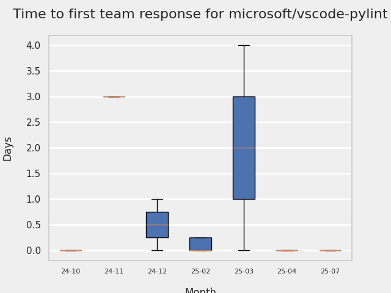

# GITHUB ISSUES REPORT FOR microsoft/vscode-pylint

Generated on 2026-02-08 using: stale=30, all=True

* marks items that are new to report in past 7 day(s)

## FOR ISSUES THAT ARE MARKED AS BUGS:

### Issues in vscode-pylint that need a response from team:

| Days Ago | Issue | Title |
| --- | --- | --- |
 |  OP:125  |[620](https://github.com/microsoft/vscode-pylint/issues/620 "False positive Unable to import with standard modules like os , logging using python embedded inside the workspace") | False positive Unable to import with standard modules like os , logging using python embedded inside the workspace |
 |  OP:310  |[605](https://github.com/microsoft/vscode-pylint/issues/605 "init-hook not working") | init-hook not working |
 |  OP:348  |[599](https://github.com/microsoft/vscode-pylint/issues/599 "Improve docs for pylint.args") | Improve docs for pylint.args |

### Issues in vscode-pylint that have comments from 3rd party after last team response:

| Days Ago | Issue | Title |
| --- | --- | --- |
 |  P:137,  |[581](https://github.com/microsoft/vscode-pylint/issues/581 "Cannot globally set Import Strategy") | Cannot globally set Import Strategy |
 |  P:425,  |[454](https://github.com/microsoft/vscode-pylint/issues/454 "Linting on change/save (with autosave) can be slow") | Linting on change/save (with autosave) can be slow |
 |  P:821,  |[376](https://github.com/microsoft/vscode-pylint/issues/376 "Support dotenv files discovery") | Support dotenv files discovery |
 |  P:350,  |[433](https://github.com/microsoft/vscode-pylint/issues/433 "Pylint doesn't find the path set in `.env` and `terminal.integrated.env.linux`") | Pylint doesn't find the path set in `.env` and `terminal.integrated.env.linux` |

### Issues in vscode-pylint that have no external responses since team response in 30+ days:

| Days Ago | Issue | Title |
| --- | --- | --- |
 |  TM:355  |[594](https://github.com/microsoft/vscode-pylint/issues/594 "Unrecognized option found: max-positional-arguments") | Unrecognized option found: max-positional-arguments |
 |  TM:349  |[476](https://github.com/microsoft/vscode-pylint/issues/476 "[BUG] multiple lsp_server.py processes are spawned for each folder in a multi-root workspace") | [BUG] multiple lsp_server.py processes are spawned for each folder in a multi-root workspace |
 |  TM:1410  |[26](https://github.com/microsoft/vscode-pylint/issues/26 "Problems duplicated when using Jedi") | Problems duplicated when using Jedi |

---

## FOR ISSUES THAT ARE NOT MARKED AS BUGS:

### Issues in vscode-pylint that need a response from team:

| Days Ago | Issue | Title |
| --- | --- | --- |
 |  OP:99  |[625](https://github.com/microsoft/vscode-pylint/issues/625 "Lots of crashing") | Lots of crashing |
 |  OP:142  |[618](https://github.com/microsoft/vscode-pylint/issues/618 "Feature Request: `"pylint.cwd": "${nearestConfig}"`") | Feature Request: `"pylint.cwd": "${nearestConfig}"` |
 |  OP:287  |[607](https://github.com/microsoft/vscode-pylint/issues/607 "[feature request] Quick-fix for `Using open without explicitly specifying an encoding` W1514:unspecified-encoding") | [feature request] Quick-fix for `Using open without explicitly specifying an encoding` W1514:unspecified-encoding |
 |  OP:563  |[567](https://github.com/microsoft/vscode-pylint/issues/567 "Pylint makes "Quick Fix" suggestions take 10s+ to load") | Pylint makes "Quick Fix" suggestions take 10s+ to load |
 |  OP:1364  |[96](https://github.com/microsoft/vscode-pylint/issues/96 "Show indicator that pylint is still running for the file") | Show indicator that pylint is still running for the file |
 |  OP:1376  |[79](https://github.com/microsoft/vscode-pylint/issues/79 "Project wide evaluation") | Project wide evaluation |
 |  OP:1376  |[78](https://github.com/microsoft/vscode-pylint/issues/78 "Reveal pylint evaluation score") | Reveal pylint evaluation score |

### Issues in vscode-pylint that have comments from OP after last team response:

| Days Ago | Issue | Title |
| --- | --- | --- |
 |  TM:207, OP:207  |[613](https://github.com/microsoft/vscode-pylint/issues/613 "Error: spawn \<workspace>\.venv\Scripts\python.exe ENOENT") | Error: spawn \<workspace>\.venv\Scripts\python.exe ENOENT |
 |  TM:690, OP:687  |[535](https://github.com/microsoft/vscode-pylint/issues/535 "ignore concrete linting warnings via GUI, e.g. via QuickFix") | ignore concrete linting warnings via GUI, e.g. via QuickFix |
 |  TM:1066, OP:1065  |[297](https://github.com/microsoft/vscode-pylint/issues/297 "pylint goes silent if improperly configured ") | pylint goes silent if improperly configured  |

### Issues in vscode-pylint that have comments from 3rd party after last team response:

| Days Ago | Issue | Title |
| --- | --- | --- |
 |  P:392,  |[20](https://github.com/microsoft/vscode-pylint/issues/20 "Support for ipynb files") | Support for ipynb files |

### Issues in vscode-pylint that have no external responses since team response in 30+ days:

| Days Ago | Issue | Title |
| --- | --- | --- |
 |  TM:277  |[606](https://github.com/microsoft/vscode-pylint/issues/606 "pylint doesn't show problems in problem tab from venv pls help") | pylint doesn't show problems in problem tab from venv pls help |
 |  TM:605  |[560](https://github.com/microsoft/vscode-pylint/issues/560 "Automatic restart after library is installed") | Automatic restart after library is installed |
 |  TM:752  |[479](https://github.com/microsoft/vscode-pylint/issues/479 "Resolve Pylance/Pylint overlap (optionally?)") | Resolve Pylance/Pylint overlap (optionally?) |

## PULL REQUEST ACTIVITY

### Pull Requests opened in the past 7 day(s):

| | PR | Created By | Created | Days Open | Closed/Merged | Closed/Merged By | Title |
| --- | --- | --- | --- | --- | --- | --- | --- |
| \* | [#662](https://github.com/microsoft/vscode-pylint/pull/662) | dependabot | 2026-02-05 | 3 | - | - | Bump glob from 10.4.1 to 13.0.1 |
| \* | [#661](https://github.com/microsoft/vscode-pylint/pull/661) | dependabot | 2026-02-05 | 3 | - | - | Bump @types/node from 22.18.1 to 25.2.1 |
| \* | [#660](https://github.com/microsoft/vscode-pylint/pull/660) | dependabot | 2026-02-05 | 3 | - | - | Bump mocha from 10.8.2 to 11.7.5 |
| \* | [#659](https://github.com/microsoft/vscode-pylint/pull/659) | dependabot | 2026-02-05 | 3 | - | - | Bump chai from 4.4.1 to 6.2.2 |
| \* | [#658](https://github.com/microsoft/vscode-pylint/pull/658) | dependabot | 2026-02-05 | 3 | - | - | Bump @typescript-eslint/parser from 7.13.0 to 7.18.0 |
| \* | [#657](https://github.com/microsoft/vscode-pylint/pull/657) | dependabot | 2026-02-05 | 3 | - | - | Bump sinon and @types/sinon |
| \* | [#656](https://github.com/microsoft/vscode-pylint/pull/656) | dependabot | 2026-02-05 | 3 | - | - | Bump @typescript-eslint/eslint-plugin from 7.13.0 to 7.18.0 |
| \* | [#655](https://github.com/microsoft/vscode-pylint/pull/655) | dependabot | 2026-02-05 | 3 | - | - | Bump @vscode/vsce from 2.27.0 to 3.7.1 |
| \* | [#654](https://github.com/microsoft/vscode-pylint/pull/654) | dependabot | 2026-02-05 | 3 | - | - | Bump vscode-languageclient from 8.1.0 to 9.0.1 |
| \* | [#653](https://github.com/microsoft/vscode-pylint/pull/653) | dependabot | 2026-02-05 | 3 | - | - | Bump the npm-minor-patch group with 8 updates |
| \* | [#652](https://github.com/microsoft/vscode-pylint/pull/652) | dependabot | 2026-02-05 | 3 | - | - | Bump github/codeql-action from 3 to 4 |
| \* | [#651](https://github.com/microsoft/vscode-pylint/pull/651) | dependabot | 2026-02-05 | 3 | - | - | Bump actions/setup-node from 4 to 6 |
| \* | [#650](https://github.com/microsoft/vscode-pylint/pull/650) | dependabot | 2026-02-05 | 3 | - | - | Bump actions/github-script from 7 to 8 |
| \* | [#649](https://github.com/microsoft/vscode-pylint/pull/649) | dependabot | 2026-02-05 | 3 | - | - | Bump actions/checkout from 3 to 6 |
| \* | [#648](https://github.com/microsoft/vscode-pylint/pull/648) | dependabot | 2026-02-05 | 3 | - | - | Bump actions/setup-python from 5 to 6 |
| \* | [#647](https://github.com/microsoft/vscode-pylint/pull/647) | dependabot | 2026-02-05 | 3 | - | - | Bump webpack from 5.95.0 to 5.105.0 |
| \* | [#646](https://github.com/microsoft/vscode-pylint/pull/646) | edvilme | 2026-02-04 | 0 | 2026-02-05 | edvilme | Add score in statusbar |
| \* | [#646](https://github.com/microsoft/vscode-pylint/pull/646) | edvilme | 2026-02-04 | 0 | 2026-02-05 | edvilme | Add score in statusbar |
| \* | [#645](https://github.com/microsoft/vscode-pylint/pull/645) | edvilme | 2026-02-04 | 0 | 2026-02-04 | edvilme | pygls -> 2.0 |
| \* | [#645](https://github.com/microsoft/vscode-pylint/pull/645) | edvilme | 2026-02-04 | 0 | 2026-02-04 | edvilme | pygls -> 2.0 |
| \* | [#644](https://github.com/microsoft/vscode-pylint/pull/644) | edvilme | 2026-02-03 | 1 | 2026-02-05 | edvilme | Upgrade requirements automatically |
| \* | [#644](https://github.com/microsoft/vscode-pylint/pull/644) | edvilme | 2026-02-03 | 1 | 2026-02-05 | edvilme | Upgrade requirements automatically |
| \* | [#643](https://github.com/microsoft/vscode-pylint/pull/643) | edvilme | 2026-02-03 | 1 | 2026-02-04 | edvilme | Update min version (3.10) and requirements |
| \* | [#643](https://github.com/microsoft/vscode-pylint/pull/643) | edvilme | 2026-02-03 | 1 | 2026-02-04 | edvilme | Update min version (3.10) and requirements |
| \* | [#642](https://github.com/microsoft/vscode-pylint/pull/642) | dependabot | 2026-02-02 | 1 | 2026-02-04 | - | Bump pip from 25.0.1 to 26.0 |

### Pull Requests merged in the past 7 day(s):

| | PR | Created By | Created | Days Open | Closed/Merged | Closed/Merged By | Title |
| --- | --- | --- | --- | --- | --- | --- | --- |
| \* | [#644](https://github.com/microsoft/vscode-pylint/pull/644) | edvilme | 2026-02-03 | 1 | 2026-02-05 | edvilme | Upgrade requirements automatically |
| \* | [#644](https://github.com/microsoft/vscode-pylint/pull/644) | edvilme | 2026-02-03 | 1 | 2026-02-05 | edvilme | Upgrade requirements automatically |
| \* | [#646](https://github.com/microsoft/vscode-pylint/pull/646) | edvilme | 2026-02-04 | 0 | 2026-02-05 | edvilme | Add score in statusbar |
| \* | [#646](https://github.com/microsoft/vscode-pylint/pull/646) | edvilme | 2026-02-04 | 0 | 2026-02-05 | edvilme | Add score in statusbar |
| \* | [#643](https://github.com/microsoft/vscode-pylint/pull/643) | edvilme | 2026-02-03 | 1 | 2026-02-04 | edvilme | Update min version (3.10) and requirements |
| \* | [#643](https://github.com/microsoft/vscode-pylint/pull/643) | edvilme | 2026-02-03 | 1 | 2026-02-04 | edvilme | Update min version (3.10) and requirements |
| \* | [#645](https://github.com/microsoft/vscode-pylint/pull/645) | edvilme | 2026-02-04 | 0 | 2026-02-04 | edvilme | pygls -> 2.0 |
| \* | [#645](https://github.com/microsoft/vscode-pylint/pull/645) | edvilme | 2026-02-04 | 0 | 2026-02-04 | edvilme | pygls -> 2.0 |

### Pull Requests closed (not merged) in the past 7 day(s):

| | PR | Created By | Created | Days Open | Closed/Merged | Closed/Merged By | Title |
| --- | --- | --- | --- | --- | --- | --- | --- |
| \* | [#642](https://github.com/microsoft/vscode-pylint/pull/642) | dependabot | 2026-02-02 | 1 | 2026-02-04 | - | Bump pip from 25.0.1 to 26.0 |
| \* | [#638](https://github.com/microsoft/vscode-pylint/pull/638) | dependabot | 2026-01-13 | 22 | 2026-02-04 | - | Bump virtualenv from 20.29.2 to 20.36.1 |
| \* | [#640](https://github.com/microsoft/vscode-pylint/pull/640) | dependabot | 2026-01-22 | 13 | 2026-02-04 | - | Bump wheel from 0.45.1 to 0.46.2 |
| \* | [#635](https://github.com/microsoft/vscode-pylint/pull/635) | dependabot | 2025-12-17 | 47 | 2026-02-02 | - | Bump pip from 25.0.1 to 25.3 |

### Pull Requests still open that were opened more than 7 days ago:

| | PR | Created By | Created | Days Open | Closed/Merged | Closed/Merged By | Title |
| --- | --- | --- | --- | --- | --- | --- | --- |
| \* | [#592](https://github.com/microsoft/vscode-pylint/pull/592) | karthiknadig | 2025-02-13 | 360 | - | - | Remove linting on change |
| \* | [#608](https://github.com/microsoft/vscode-pylint/pull/608) | hamirmahal | 2025-04-27 | 287 | - | - | feat: fix for `Pylint(W1514:unspecified-encoding)` |
| \* | [#619](https://github.com/microsoft/vscode-pylint/pull/619) | DipakHalkude | 2025-09-24 | 137 | - | - | Respect user-level pylint.importStrategy in workspace via inspect fal… |
| \* | [#630](https://github.com/microsoft/vscode-pylint/pull/630) | dependabot | 2025-12-17 | 53 | - | - | Bump glob from 10.4.1 to 10.5.0 |
| \* | [#631](https://github.com/microsoft/vscode-pylint/pull/631) | dependabot | 2025-12-17 | 53 | - | - | Bump tar-fs from 2.1.3 to 2.1.4 |
| \* | [#632](https://github.com/microsoft/vscode-pylint/pull/632) | dependabot | 2025-12-17 | 53 | - | - | Bump tmp from 0.2.1 to 0.2.5 |
| \* | [#633](https://github.com/microsoft/vscode-pylint/pull/633) | dependabot | 2025-12-17 | 53 | - | - | Bump form-data from 4.0.0 to 4.0.5 |
| \* | [#634](https://github.com/microsoft/vscode-pylint/pull/634) | dependabot | 2025-12-17 | 53 | - | - | Bump js-yaml from 4.1.0 to 4.1.1 |
| \* | [#636](https://github.com/microsoft/vscode-pylint/pull/636) | dependabot | 2025-12-17 | 53 | - | - | Bump setuptools from 75.8.0 to 78.1.1 |
| \* | [#637](https://github.com/microsoft/vscode-pylint/pull/637) | dependabot | 2025-12-31 | 39 | - | - | Bump qs from 6.12.1 to 6.14.1 |
| \* | [#639](https://github.com/microsoft/vscode-pylint/pull/639) | dependabot | 2026-01-21 | 17 | - | - | Bump lodash from 4.17.21 to 4.17.23 |
|   | [#641](https://github.com/microsoft/vscode-pylint/pull/641) | copilot-swe-agent | 2026-01-27 | 12 | - | - | Add pygls 2.0+ compatibility for fromEnvironment import strategy |

## RECENTLY CLOSED ISSUES

### Issues closed in the past 7 day(s):

| Days Ago | Issue | Title |
| --- | --- | --- |
 | \* TM:81  |[626](https://github.com/microsoft/vscode-pylint/issues/626 "crash when `pygls>=2.0.0` is installed and `importStrategy` is `&quot;fromEnvironment&quot;`")  |crash when `pygls>=2.0.0` is installed and `importStrategy` is `"fromEnvironment"` |
 | \* TM:64  |[628](https://github.com/microsoft/vscode-pylint/issues/628 "Keep this wrapper up-to-date v4.0.4 is the current release")  |Keep this wrapper up-to-date v4.0.4 is the current release |

## MOST FREQUENTLY CHANGED FILES (by # of PRs):

  7: package-lock.json

  5: package.json

