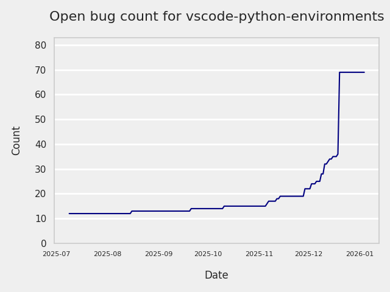
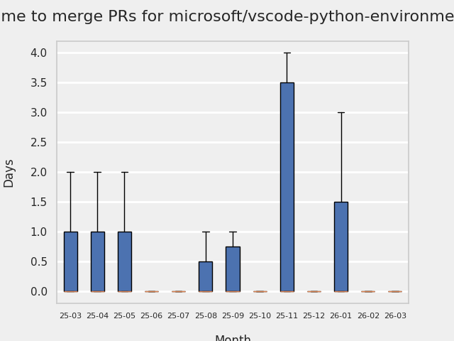
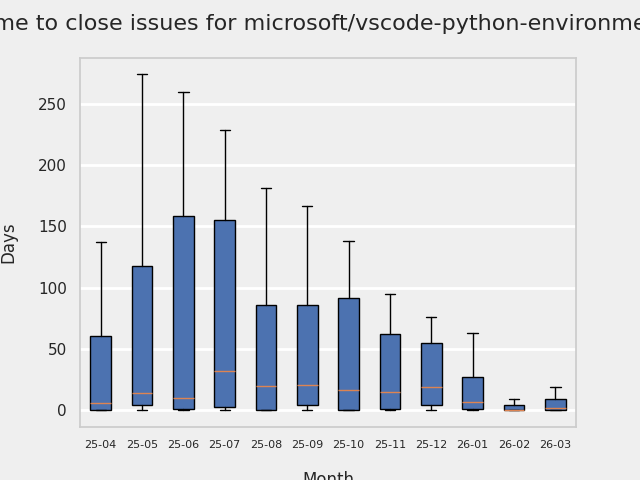
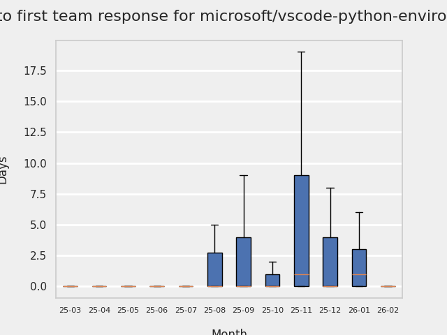
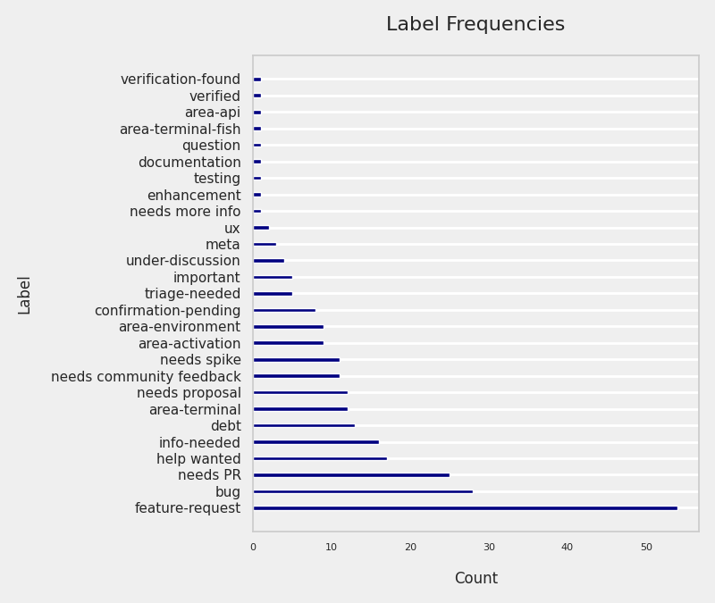
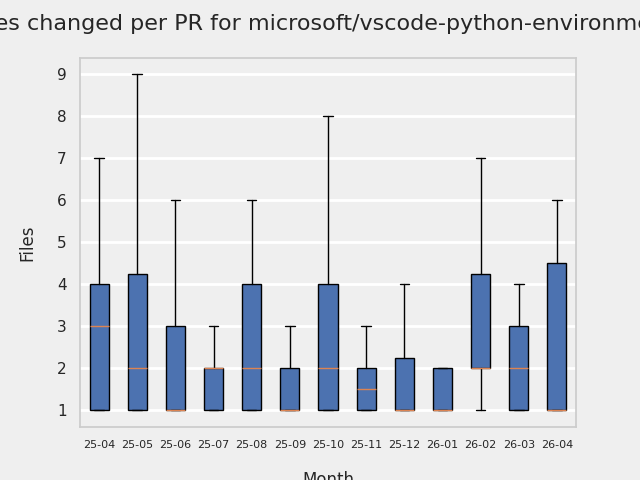
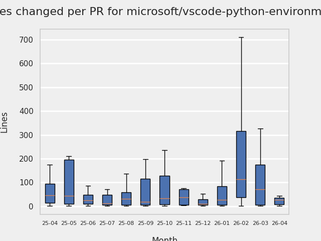
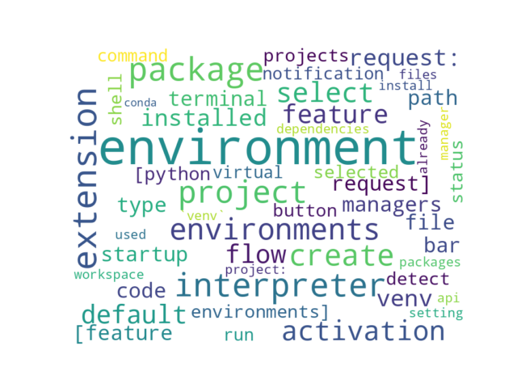

# GITHUB ISSUES REPORT FOR microsoft/vscode-python-environments

Generated on 2025-11-18 using: stale=30, all=True

* marks items that are new to report in past 7 day(s)

## FOR ISSUES THAT ARE MARKED AS BUGS:

### Issues in vscode-python-environments that need a response from team:

| Days Ago | Issue | Title |
| --- | --- | --- |
 |  OP:8  |[974](https://github.com/microsoft/vscode-python-environments/issues/974 "ShellStartup auto-activation adds newline") | ShellStartup auto-activation adds newline |
 |  OP:39  |[926](https://github.com/microsoft/vscode-python-environments/issues/926 "not detecting venvs in %USERPROFILE%\.virtualenvs") | not detecting venvs in %USERPROFILE%\.virtualenvs |
 |  OP:103  |[722](https://github.com/microsoft/vscode-python-environments/issues/722 "Conda terminal activation incorrectly uses name for path-based environments created by VS Code") | Conda terminal activation incorrectly uses name for path-based environments created by VS Code |
 |  OP:113  |[992](https://github.com/microsoft/vscode-python-environments/issues/992 "Python native REPL ignoring workspace interpreter") | Python native REPL ignoring workspace interpreter |
 |  OP:114  |[653](https://github.com/microsoft/vscode-python-environments/issues/653 "Error refreshing packages: Extension uses system Python instead of selected Conda environment in WSL2") | Error refreshing packages: Extension uses system Python instead of selected Conda environment in WSL2 |
 |  OP:146  |[570](https://github.com/microsoft/vscode-python-environments/issues/570 "moving project folder doesn't update project view") | moving project folder doesn't update project view |
 |  OP:161  |[519](https://github.com/microsoft/vscode-python-environments/issues/519 "Appending version after environment name is unclear") | Appending version after environment name is unclear |
 |  OP:167  |[492](https://github.com/microsoft/vscode-python-environments/issues/492 "Error in virtualenv creation causes tree to be outdated") | Error in virtualenv creation causes tree to be outdated |
 |  OP:167  |[489](https://github.com/microsoft/vscode-python-environments/issues/489 "Environment Manager -> Set as Project Environment should pre-select the environments it's already used in") | Environment Manager -> Set as Project Environment should pre-select the environments it's already used in |
 |  OP:167  |[480](https://github.com/microsoft/vscode-python-environments/issues/480 "Project terminal opens scrolled down") | Project terminal opens scrolled down |
 |  OP:167  |[473](https://github.com/microsoft/vscode-python-environments/issues/473 "Getting the error `Error running command python.envManager.refresh`") | Getting the error `Error running command python.envManager.refresh` |
 |  OP:182  |[429](https://github.com/microsoft/vscode-python-environments/issues/429 "deleted folder still lives in project view") | deleted folder still lives in project view |
 |  OP:188  |[411](https://github.com/microsoft/vscode-python-environments/issues/411 "More gracefully fail on `pyproject.toml` error") | More gracefully fail on `pyproject.toml` error |
 |  OP:224  |[272](https://github.com/microsoft/vscode-python-environments/issues/272 "Hide Add Python Project context menu item if already selected as Python Project") | Hide Add Python Project context menu item if already selected as Python Project |

### Issues in vscode-python-environments that have comments from OP after last team response:

| Days Ago | Issue | Title |
| --- | --- | --- |
 | \* TM:92, OP:3  |[664](https://github.com/microsoft/vscode-python-environments/issues/664 "The automatic activation mechanism has been damaged")  |The automatic activation mechanism has been damaged |
 |  TM:267, OP:266  |[198](https://github.com/microsoft/vscode-python-environments/issues/198 "terminal.launchArgs not being used") | terminal.launchArgs not being used |
 |  TM:340, OP:340  |[82](https://github.com/microsoft/vscode-python-environments/issues/82 "relative paths not handled when installing packages from workplace dependencies (requirements.txt)") | relative paths not handled when installing packages from workplace dependencies (requirements.txt) |
 |  TM:348, OP:348  |[60](https://github.com/microsoft/vscode-python-environments/issues/60 "Switching interpreter to global in environment manager doesn't deactivate previously activated .venv") | Switching interpreter to global in environment manager doesn't deactivate previously activated .venv |

### Issues in vscode-python-environments that have comments from 3rd party after last team response:

| Days Ago | Issue | Title |
| --- | --- | --- |
 |  P:346,  |[61](https://github.com/microsoft/vscode-python-environments/issues/61 "Accessibility: Several sub-components in environment manager lacks accessibility") | Accessibility: Several sub-components in environment manager lacks accessibility |

### Issues in vscode-python-environments that have no external responses since team response in 30+ days:

| Days Ago | Issue | Title |
| --- | --- | --- |
 |  TM:162  |[370](https://github.com/microsoft/vscode-python-environments/issues/370 "New terminal unable to activate environment on Windows") | New terminal unable to activate environment on Windows |

---

## FOR ISSUES THAT ARE NOT MARKED AS BUGS:

### Issues in vscode-python-environments that need a response from team:

| Days Ago | Issue | Title |
| --- | --- | --- |
 | \* OP:4  |[990](https://github.com/microsoft/vscode-python-environments/issues/990 "Design for pipenvPath and poetryPath settings")  |Design for pipenvPath and poetryPath settings |
 | \* OP:4  |[989](https://github.com/microsoft/vscode-python-environments/issues/989 "UnicodeError under Windows if project has Unicode chars in path name")  |UnicodeError under Windows if project has Unicode chars in path name |
 | \* OP:4  |[988](https://github.com/microsoft/vscode-python-environments/issues/988 "API Proposal Error - 1.12.0")  |API Proposal Error - 1.12.0 |
 | \* OP:4  |[987](https://github.com/microsoft/vscode-python-environments/issues/987 "VSCode Python test discovery not activating the environment")  |VSCode Python test discovery not activating the environment |
 | \* OP:4  |[986](https://github.com/microsoft/vscode-python-environments/issues/986 "`shellStartup` doesn't work properly in a devcontainer")  |`shellStartup` doesn't work properly in a devcontainer |
 | \* OP:6  |[981](https://github.com/microsoft/vscode-python-environments/issues/981 "Configure environment via VSCode settings?")  |Configure environment via VSCode settings? |
 | \* OP:7  |[978](https://github.com/microsoft/vscode-python-environments/issues/978 "ArcGIS Pro's conda environment is inaccessible in VS Code due to installation under `C:\Program Files` (path contains spaces)")  |ArcGIS Pro's conda environment is inaccessible in VS Code due to installation under `C:\Program Files` (path contains spaces) |
 |  OP:12  |[970](https://github.com/microsoft/vscode-python-environments/issues/970 "Compatibility with Other Extensions") | Compatibility with Other Extensions |
 |  OP:12  |[969](https://github.com/microsoft/vscode-python-environments/issues/969 "Write tests for API surface") | Write tests for API surface |
 |  OP:12  |[967](https://github.com/microsoft/vscode-python-environments/issues/967 "Publish API as npm package") | Publish API as npm package |
 |  OP:12  |[965](https://github.com/microsoft/vscode-python-environments/issues/965 "Avoid using /* eslint-disable @typescript-eslint/no-explicit-any */") | Avoid using /* eslint-disable @typescript-eslint/no-explicit-any */ |
 |  OP:12  |[963](https://github.com/microsoft/vscode-python-environments/issues/963 "Update activation wiki") | Update activation wiki |
 |  OP:12  |[962](https://github.com/microsoft/vscode-python-environments/issues/962 "Experimental roll out shell startup as default") | Experimental roll out shell startup as default |
 |  OP:12  |[991](https://github.com/microsoft/vscode-python-environments/issues/991 "Easier management of terminal and python packages for current python environment") | Easier management of terminal and python packages for current python environment |
 |  OP:12  |[961](https://github.com/microsoft/vscode-python-environments/issues/961 "Python Environments Outstanding Bugs & Tasks") | Python Environments Outstanding Bugs & Tasks |
 |  OP:13  |[960](https://github.com/microsoft/vscode-python-environments/issues/960 "Expose helper for resolving python-env search paths (getAllExtraSearchPaths)") | Expose helper for resolving python-env search paths (getAllExtraSearchPaths) |
 |  OP:18  |[958](https://github.com/microsoft/vscode-python-environments/issues/958 "Cannot read properties of undefined (reading 'show')") | Cannot read properties of undefined (reading 'show') |
 |  OP:23  |[956](https://github.com/microsoft/vscode-python-environments/issues/956 "Perpetually &quot;Refreshing virtual environments&quot;") | Perpetually "Refreshing virtual environments" |
 |  OP:24  |[954](https://github.com/microsoft/vscode-python-environments/issues/954 "SimpleDebounce should be a disposable") | SimpleDebounce should be a disposable |
 |  OP:25  |[953](https://github.com/microsoft/vscode-python-environments/issues/953 "Bring cancellable async timeout from core") | Bring cancellable async timeout from core |
 |  OP:27  |[950](https://github.com/microsoft/vscode-python-environments/issues/950 "Debugger, &quot;Run Python File&quot;, etc. fails when launched into a new terminal") | Debugger, "Run Python File", etc. fails when launched into a new terminal |
 |  OP:29  |[948](https://github.com/microsoft/vscode-python-environments/issues/948 "type checker project boundaries") | type checker project boundaries |
 |  OP:30  |[947](https://github.com/microsoft/vscode-python-environments/issues/947 "Remote Reconnect Forces Ctrl+C on Running Terminal Process for Environment Activation") | Remote Reconnect Forces Ctrl+C on Running Terminal Process for Environment Activation |
 |  OP:35  |[942](https://github.com/microsoft/vscode-python-environments/issues/942 "Environments from custom providers not listed in Python: Select Interpreter command palette") | Environments from custom providers not listed in Python: Select Interpreter command palette |
 |  OP:37  |[936](https://github.com/microsoft/vscode-python-environments/issues/936 ".env File no longer updates commented variables") | .env File no longer updates commented variables |
 |  OP:37  |[934](https://github.com/microsoft/vscode-python-environments/issues/934 "Bug: Debugger on Linux launches Python run/activatedRun command before the activation/shellActivation command from PythonEnvironmentExecutionInfo") | Bug: Debugger on Linux launches Python run/activatedRun command before the activation/shellActivation command from PythonEnvironmentExecutionInfo |
 |  OP:39  |[927](https://github.com/microsoft/vscode-python-environments/issues/927 "[Feature Request] Add a setting to disable specific environment managers") | [Feature Request] Add a setting to disable specific environment managers |
 |  OP:40  |[918](https://github.com/microsoft/vscode-python-environments/issues/918 "support poetry path setting") | support poetry path setting |
 |  OP:42  |[906](https://github.com/microsoft/vscode-python-environments/issues/906 "Behavior of python-env.workspaceSearchPaths") | Behavior of python-env.workspaceSearchPaths |
 |  OP:42  |[904](https://github.com/microsoft/vscode-python-environments/issues/904 "On Windows + git-bash activate command uses the wrong script") | On Windows + git-bash activate command uses the wrong script |
 |  OP:44  |[895](https://github.com/microsoft/vscode-python-environments/issues/895 "[Non-reproducible] Entire disk partition accidentally wiped clean while removing a python environment") | [Non-reproducible] Entire disk partition accidentally wiped clean while removing a python environment |
 |  OP:46  |[888](https://github.com/microsoft/vscode-python-environments/issues/888 "Breaks python locator on mapped drives in Windows") | Breaks python locator on mapped drives in Windows |
 |  OP:48  |[875](https://github.com/microsoft/vscode-python-environments/issues/875 "Python environment not activating and working dir not correct when using scratchpad") | Python environment not activating and working dir not correct when using scratchpad |
 |  OP:50  |[868](https://github.com/microsoft/vscode-python-environments/issues/868 "Detected Python version is wrong and may affect Python Debugger extension.") | Detected Python version is wrong and may affect Python Debugger extension. |
 |  OP:55  |[861](https://github.com/microsoft/vscode-python-environments/issues/861 "Settings Review: Python ext & Python Envs ext") | Settings Review: Python ext & Python Envs ext |
 |  OP:55  |[869](https://github.com/microsoft/vscode-python-environments/issues/869 "Integrated terminal activates base conda environment instead of configured environment") | Integrated terminal activates base conda environment instead of configured environment |
 |  OP:63  |[846](https://github.com/microsoft/vscode-python-environments/issues/846 "Support --system-site-packages") | Support --system-site-packages |
 |  OP:66  |[836](https://github.com/microsoft/vscode-python-environments/issues/836 "Bug: environment being used differs from the one being displayed") | Bug: environment being used differs from the one being displayed |
 |  OP:67  |[833](https://github.com/microsoft/vscode-python-environments/issues/833 "The chosen python interpreter is not written to workspace's .vscode settings.json file") | The chosen python interpreter is not written to workspace's .vscode settings.json file |
 |  OP:70  |[813](https://github.com/microsoft/vscode-python-environments/issues/813 "Adding a scan for missing dependencies in a project - suggestion for a new feature") | Adding a scan for missing dependencies in a project - suggestion for a new feature |
 |  OP:74  |[800](https://github.com/microsoft/vscode-python-environments/issues/800 "看不到运行过程") | 看不到运行过程 |
 |  OP:78  |[834](https://github.com/microsoft/vscode-python-environments/issues/834 "vscode指定环境时默认运行的不存在的文件") | vscode指定环境时默认运行的不存在的文件 |
 |  OP:84  |[765](https://github.com/microsoft/vscode-python-environments/issues/765 "Wrong activate button state when using `shellStartup`") | Wrong activate button state when using `shellStartup` |
 |  OP:89  |[743](https://github.com/microsoft/vscode-python-environments/issues/743 "Poetry ignores `pyenv` local Python when &quot;Python Environments&quot; VS Code extension is active") | Poetry ignores `pyenv` local Python when "Python Environments" VS Code extension is active |
 |  OP:91  |[847](https://github.com/microsoft/vscode-python-environments/issues/847 "Copilot chat cannot detect Python packages installed in the selected Conda Environment") | Copilot chat cannot detect Python packages installed in the selected Conda Environment |
 |  OP:91  |[735](https://github.com/microsoft/vscode-python-environments/issues/735 "Feature Request: Easily Add Folder to PYTHONPATH from VS Code UI") | Feature Request: Easily Add Folder to PYTHONPATH from VS Code UI |
 |  OP:92  |[972](https://github.com/microsoft/vscode-python-environments/issues/972 "shellStartup notification should describe the changes to be made") | shellStartup notification should describe the changes to be made |
 |  OP:92  |[786](https://github.com/microsoft/vscode-python-environments/issues/786 "Python env activates automatically ignoring settings") | Python env activates automatically ignoring settings |
 |  OP:94  |[728](https://github.com/microsoft/vscode-python-environments/issues/728 "Separate zsh out of bash startup file") | Separate zsh out of bash startup file |
 |  OP:97  |[712](https://github.com/microsoft/vscode-python-environments/issues/712 "VS Code opens cmd window on execution") | VS Code opens cmd window on execution |
 |  OP:99  |[705](https://github.com/microsoft/vscode-python-environments/issues/705 "show environment type in python interpreter name in status bar") | show environment type in python interpreter name in status bar |
 |  OP:103  |[692](https://github.com/microsoft/vscode-python-environments/issues/692 "[Python Environments] ") | [Python Environments]  |
 |  OP:104  |[688](https://github.com/microsoft/vscode-python-environments/issues/688 "bug with getEnvironmentVariables") | bug with getEnvironmentVariables |
 |  OP:111  |[669](https://github.com/microsoft/vscode-python-environments/issues/669 "py env ext causing lag with uv pkg installation") | py env ext causing lag with uv pkg installation |
 |  OP:112  |[667](https://github.com/microsoft/vscode-python-environments/issues/667 "Incorrectly loads uv interpreters") | Incorrectly loads uv interpreters |
 |  OP:112  |[666](https://github.com/microsoft/vscode-python-environments/issues/666 "Feature request: repair environment") | Feature request: repair environment |
 |  OP:113  |[661](https://github.com/microsoft/vscode-python-environments/issues/661 "Extension breaks python envy and associated use-case") | Extension breaks python envy and associated use-case |
 |  OP:114  |[656](https://github.com/microsoft/vscode-python-environments/issues/656 "Pixi integration") | Pixi integration |
 |  OP:117  |[639](https://github.com/microsoft/vscode-python-environments/issues/639 "Conda environment activation does not work for R terminals") | Conda environment activation does not work for R terminals |
 |  OP:117  |[634](https://github.com/microsoft/vscode-python-environments/issues/634 "[Feature request] Disable automatically making the root folder a Python project") | [Feature request] Disable automatically making the root folder a Python project |
 |  OP:117  |[633](https://github.com/microsoft/vscode-python-environments/issues/633 "Test discovery doesn't use the selected environment") | Test discovery doesn't use the selected environment |
 |  OP:118  |[630](https://github.com/microsoft/vscode-python-environments/issues/630 "Button to refresh select environment") | Button to refresh select environment |
 |  OP:123  |[613](https://github.com/microsoft/vscode-python-environments/issues/613 "&quot;Run python file in terminal&quot; does not respect cwd configuration") | "Run python file in terminal" does not respect cwd configuration |
 |  OP:125  |[610](https://github.com/microsoft/vscode-python-environments/issues/610 "Pyenv Python Versions aren't listed when creating a new environment") | Pyenv Python Versions aren't listed when creating a new environment |
 |  OP:125  |[609](https://github.com/microsoft/vscode-python-environments/issues/609 "Feature request: Quick Create uses the active global Python interpreter version") | Feature request: Quick Create uses the active global Python interpreter version |
 |  OP:127  |[604](https://github.com/microsoft/vscode-python-environments/issues/604 "Bash activation command without proceeding space bloating bash-history") | Bash activation command without proceeding space bloating bash-history |
 |  OP:132  |[600](https://github.com/microsoft/vscode-python-environments/issues/600 "multiroot project not working with environments extension") | multiroot project not working with environments extension |
 |  OP:137  |[603](https://github.com/microsoft/vscode-python-environments/issues/603 "VSCode forgets Python intepreter with the environments extension") | VSCode forgets Python intepreter with the environments extension |
 |  OP:139  |[592](https://github.com/microsoft/vscode-python-environments/issues/592 "Diagnose Issues with Copilot") | Diagnose Issues with Copilot |
 |  OP:140  |[584](https://github.com/microsoft/vscode-python-environments/issues/584 "Python button is not visible, extension commands are not available in command palette") | Python button is not visible, extension commands are not available in command palette |
 |  OP:141  |[581](https://github.com/microsoft/vscode-python-environments/issues/581 "Extension Experimentation and Roll Out") | Extension Experimentation and Roll Out |
 |  OP:144  |[574](https://github.com/microsoft/vscode-python-environments/issues/574 "publish pet binary") | publish pet binary |
 |  OP:147  |[564](https://github.com/microsoft/vscode-python-environments/issues/564 "incorrect env shown for project while create new environment for project") | incorrect env shown for project while create new environment for project |
 |  OP:155  |[548](https://github.com/microsoft/vscode-python-environments/issues/548 "automatically refresh package list on change") | automatically refresh package list on change |
 |  OP:159  |[533](https://github.com/microsoft/vscode-python-environments/issues/533 "switch to dependency groups for new package flow") | switch to dependency groups for new package flow |
 |  OP:160  |[527](https://github.com/microsoft/vscode-python-environments/issues/527 "Add a &quot;reveal&quot; icon to the environment in the python projects view") | Add a "reveal" icon to the environment in the python projects view |
 |  OP:161  |[524](https://github.com/microsoft/vscode-python-environments/issues/524 "Unclear which packages were installed as dependencies of another") | Unclear which packages were installed as dependencies of another |
 |  OP:161  |[521](https://github.com/microsoft/vscode-python-environments/issues/521 "Should we remove environment creation at the top level") | Should we remove environment creation at the top level |
 |  OP:161  |[520](https://github.com/microsoft/vscode-python-environments/issues/520 "Labeling activity bar icon as Python is unclear") | Labeling activity bar icon as Python is unclear |
 |  OP:161  |[518](https://github.com/microsoft/vscode-python-environments/issues/518 "Select environment for project created with template if no new venv creation") | Select environment for project created with template if no new venv creation |
 |  OP:166  |[498](https://github.com/microsoft/vscode-python-environments/issues/498 "Show status bar item even if no Python file is open in the editor") | Show status bar item even if no Python file is open in the editor |
 |  OP:166  |[497](https://github.com/microsoft/vscode-python-environments/issues/497 "Should we streamline Select Interpreter and Create Environment command into one") | Should we streamline Select Interpreter and Create Environment command into one |
 |  OP:167  |[487](https://github.com/microsoft/vscode-python-environments/issues/487 "Can't tell where a package is located in a multiroot case") | Can't tell where a package is located in a multiroot case |
 |  OP:167  |[479](https://github.com/microsoft/vscode-python-environments/issues/479 "&quot;Auto find&quot; could be in the same quickpick") | "Auto find" could be in the same quickpick |
 |  OP:167  |[476](https://github.com/microsoft/vscode-python-environments/issues/476 "Environment Manager viewlet - no visual  indicatior on the currently selected environment.") | Environment Manager viewlet - no visual  indicatior on the currently selected environment. |
 |  OP:167  |[471](https://github.com/microsoft/vscode-python-environments/issues/471 "Same venv show twice") | Same venv show twice |
 |  OP:167  |[470](https://github.com/microsoft/vscode-python-environments/issues/470 "Offer to create folder/workspace in 'Add as Python Project' flow") | Offer to create folder/workspace in 'Add as Python Project' flow |
 |  OP:168  |[461](https://github.com/microsoft/vscode-python-environments/issues/461 "Should copy button temporarily become a checkmark") | Should copy button temporarily become a checkmark |
 |  OP:183  |[421](https://github.com/microsoft/vscode-python-environments/issues/421 "env listed as parent folder name") | env listed as parent folder name |
 |  OP:188  |[412](https://github.com/microsoft/vscode-python-environments/issues/412 "feature request: supports `requires-python` in &quot;create environment..&quot; flow") | feature request: supports `requires-python` in "create environment.." flow |
 |  OP:193  |[401](https://github.com/microsoft/vscode-python-environments/issues/401 "Bug: Children Projects in Settings") | Bug: Children Projects in Settings |
 |  OP:193  |[397](https://github.com/microsoft/vscode-python-environments/issues/397 "New Project: Flask") | New Project: Flask |
 |  OP:193  |[396](https://github.com/microsoft/vscode-python-environments/issues/396 "New Project: Fast API") | New Project: Fast API |
 |  OP:193  |[395](https://github.com/microsoft/vscode-python-environments/issues/395 "Create Environment workspace warning") | Create Environment workspace warning |
 |  OP:193  |[394](https://github.com/microsoft/vscode-python-environments/issues/394 "New Project: Django") | New Project: Django |
 |  OP:193  |[391](https://github.com/microsoft/vscode-python-environments/issues/391 "Run button does nothing when Python is not installed") | Run button does nothing when Python is not installed |
 |  OP:193  |[390](https://github.com/microsoft/vscode-python-environments/issues/390 "Add Project Meta-issue") | Add Project Meta-issue |
 |  OP:193  |[389](https://github.com/microsoft/vscode-python-environments/issues/389 "Show warning that python isnt installed in select interpreter and/or create environment quick pick") | Show warning that python isnt installed in select interpreter and/or create environment quick pick |
 |  OP:204  |[359](https://github.com/microsoft/vscode-python-environments/issues/359 "Bash shell does not activate venv on subsequent launches") | Bash shell does not activate venv on subsequent launches |
 |  OP:204  |[349](https://github.com/microsoft/vscode-python-environments/issues/349 "Should there be an indication that python has been activated for the terminal?") | Should there be an indication that python has been activated for the terminal? |
 |  OP:218  |[303](https://github.com/microsoft/vscode-python-environments/issues/303 "Duplicates single file in Python Project view") | Duplicates single file in Python Project view |
 |  OP:221  |[291](https://github.com/microsoft/vscode-python-environments/issues/291 "'Python: Create Terminal' doesn't consider multiroot option") | 'Python: Create Terminal' doesn't consider multiroot option |
 |  OP:224  |[270](https://github.com/microsoft/vscode-python-environments/issues/270 "on windows python.condaPath has 2 incompatible usages") | on windows python.condaPath has 2 incompatible usages |
 |  OP:238  |[241](https://github.com/microsoft/vscode-python-environments/issues/241 "Consider activating the environment without environment variables") | Consider activating the environment without environment variables |
 |  OP:259  |[206](https://github.com/microsoft/vscode-python-environments/issues/206 "Finding conda from cache when conda not installed on machine") | Finding conda from cache when conda not installed on machine |
 |  OP:259  |[204](https://github.com/microsoft/vscode-python-environments/issues/204 "Show workspace dependency files earlier in env creation flow") | Show workspace dependency files earlier in env creation flow |
 |  OP:272  |[194](https://github.com/microsoft/vscode-python-environments/issues/194 "Simple requirements.txt check in package install flow") | Simple requirements.txt check in package install flow |
 |  OP:277  |[190](https://github.com/microsoft/vscode-python-environments/issues/190 "Python environments MVP") | Python environments MVP |
 |  OP:284  |[169](https://github.com/microsoft/vscode-python-environments/issues/169 "Leverage execution.exitCode for execution promise resolve") | Leverage execution.exitCode for execution promise resolve |

### Issues in vscode-python-environments that have comments from OP after last team response:

| Days Ago | Issue | Title |
| --- | --- | --- |
 | \* TM:13, OP:4  |[912](https://github.com/microsoft/vscode-python-environments/issues/912 "support pipenv path setting")  |support pipenv path setting |
 |  TM:68, OP:13  |[809](https://github.com/microsoft/vscode-python-environments/issues/809 "update labeling when uv is used") | update labeling when uv is used |
 |  TM:73, OP:73  |[715](https://github.com/microsoft/vscode-python-environments/issues/715 "Regression: python extension no longer allows selecting interpreters from ~/.virtualenvs") | Regression: python extension no longer allows selecting interpreters from ~/.virtualenvs |
 |  TM:99, OP:98  |[694](https://github.com/microsoft/vscode-python-environments/issues/694 "Feature request: ipykernel as a project dependency option") | Feature request: ipykernel as a project dependency option |
 |  TM:114, OP:111  |[658](https://github.com/microsoft/vscode-python-environments/issues/658 "Fails to load pyenv virtualenv's") | Fails to load pyenv virtualenv's |
 |  TM:162, OP:161  |[512](https://github.com/microsoft/vscode-python-environments/issues/512 "Ability to edit the package version that is installed") | Ability to edit the package version that is installed |
 |  TM:183, OP:167  |[422](https://github.com/microsoft/vscode-python-environments/issues/422 "select environment detail info") | select environment detail info |
 |  TM:202, OP:189  |[835](https://github.com/microsoft/vscode-python-environments/issues/835 "set python.terminal.executeInFileDir not working, python file run earlier than cd command") | set python.terminal.executeInFileDir not working, python file run earlier than cd command |
 |  TM:202, OP:180  |[367](https://github.com/microsoft/vscode-python-environments/issues/367 "Quick Create fails to install packages") | Quick Create fails to install packages |
 |  TM:203, OP:203  |[366](https://github.com/microsoft/vscode-python-environments/issues/366 "IntelliCode not conecting to Python extension") | IntelliCode not conecting to Python extension |
 |  TM:204, OP:204  |[351](https://github.com/microsoft/vscode-python-environments/issues/351 "commands getting run when value for setting is `shellStartup`") | commands getting run when value for setting is `shellStartup` |
 |  TM:182, OP:182  |[325](https://github.com/microsoft/vscode-python-environments/issues/325 "Remove terminal creation from environment managers view") | Remove terminal creation from environment managers view |
 |  TM:238, OP:238  |[247](https://github.com/microsoft/vscode-python-environments/issues/247 "Avoid creating new folders outside our existing ones") | Avoid creating new folders outside our existing ones |
 |  TM:238, OP:238  |[240](https://github.com/microsoft/vscode-python-environments/issues/240 "Reduce environment pollution") | Reduce environment pollution |
 |  TM:287, OP:251  |[136](https://github.com/microsoft/vscode-python-environments/issues/136 "User Approval Flow for Package Installation") | User Approval Flow for Package Installation |

### Issues in vscode-python-environments that have comments from 3rd party after last team response:

| Days Ago | Issue | Title |
| --- | --- | --- |
 |  P:41,  |[874](https://github.com/microsoft/vscode-python-environments/issues/874 "Python architecture information missing for conda envs") | Python architecture information missing for conda envs |
 |  P:67,  |[782](https://github.com/microsoft/vscode-python-environments/issues/782 "Expanding `Pipenv` should refresh the children") | Expanding `Pipenv` should refresh the children |
 |  P:131,  |[215](https://github.com/microsoft/vscode-python-environments/issues/215 "The extension always automatically modifies my global environment") | The extension always automatically modifies my global environment |
 |  P:232,  |[191](https://github.com/microsoft/vscode-python-environments/issues/191 "Add a `Python: New Project` command") | Add a `Python: New Project` command |

### Issues in vscode-python-environments that have no external responses since team response in 30+ days:

| Days Ago | Issue | Title |
| --- | --- | --- |
 |  TM:69  |[812](https://github.com/microsoft/vscode-python-environments/issues/812 "allow usage of non-global uv executable") | allow usage of non-global uv executable |
 |  TM:167  |[425](https://github.com/microsoft/vscode-python-environments/issues/425 "Copilot insert command to terminal doesnt successfully activate terminal") | Copilot insert command to terminal doesnt successfully activate terminal |
 |  TM:195  |[378](https://github.com/microsoft/vscode-python-environments/issues/378 "Extension API: How to map it to hatch?") | Extension API: How to map it to hatch? |
 |  TM:139  |[591](https://github.com/microsoft/vscode-python-environments/issues/591 "New File hints") | New File hints |
 |  TM:225  |[165](https://github.com/microsoft/vscode-python-environments/issues/165 "Suggest pinned package dependency updates on pyproject.toml") | Suggest pinned package dependency updates on pyproject.toml |

## PULL REQUEST ACTIVITY

### Pull Requests opened in the past 7 day(s):

| | PR | Created By | Created | Days Open | Closed/Merged | Closed/Merged By | Title |
| --- | --- | --- | --- | --- | --- | --- | --- |
| \* | [#995](https://github.com/microsoft/vscode-python-environments/pull/995) | dependabot | 2025-11-15 | 1 | 2025-11-17 | karthiknadig | chore(deps-dev): bump js-yaml from 4.1.0 to 4.1.1 in /examples/sample1 |
| \* | [#995](https://github.com/microsoft/vscode-python-environments/pull/995) | dependabot | 2025-11-15 | 1 | 2025-11-17 | karthiknadig | chore(deps-dev): bump js-yaml from 4.1.0 to 4.1.1 in /examples/sample1 |
| \* | [#993](https://github.com/microsoft/vscode-python-environments/pull/993) | eleanorjboyd | 2025-11-14 | 0 | 2025-11-14 | eleanorjboyd | Fix: Normalize executable path for Git Bash on Windows in runInTerminal |
| \* | [#993](https://github.com/microsoft/vscode-python-environments/pull/993) | eleanorjboyd | 2025-11-14 | 0 | 2025-11-14 | eleanorjboyd | Fix: Normalize executable path for Git Bash on Windows in runInTerminal |
| \* | [#985](https://github.com/microsoft/vscode-python-environments/pull/985) | anthonykim1 | 2025-11-12 | 0 | 2025-11-13 | anthonykim1 | Update vscode engine to 1.106.0 |
| \* | [#985](https://github.com/microsoft/vscode-python-environments/pull/985) | anthonykim1 | 2025-11-12 | 0 | 2025-11-13 | anthonykim1 | Update vscode engine to 1.106.0 |
| \* | [#984](https://github.com/microsoft/vscode-python-environments/pull/984) | anthonykim1 | 2025-11-12 | 0 | 2025-11-12 | anthonykim1 | Update vscode engine |
| \* | [#984](https://github.com/microsoft/vscode-python-environments/pull/984) | anthonykim1 | 2025-11-12 | 0 | 2025-11-12 | anthonykim1 | Update vscode engine |

### Pull Requests merged in the past 7 day(s):

| | PR | Created By | Created | Days Open | Closed/Merged | Closed/Merged By | Title |
| --- | --- | --- | --- | --- | --- | --- | --- |
| \* | [#995](https://github.com/microsoft/vscode-python-environments/pull/995) | dependabot | 2025-11-15 | 1 | 2025-11-17 | karthiknadig | chore(deps-dev): bump js-yaml from 4.1.0 to 4.1.1 in /examples/sample1 |
| \* | [#995](https://github.com/microsoft/vscode-python-environments/pull/995) | dependabot | 2025-11-15 | 1 | 2025-11-17 | karthiknadig | chore(deps-dev): bump js-yaml from 4.1.0 to 4.1.1 in /examples/sample1 |
| \* | [#993](https://github.com/microsoft/vscode-python-environments/pull/993) | eleanorjboyd | 2025-11-14 | 0 | 2025-11-14 | eleanorjboyd | Fix: Normalize executable path for Git Bash on Windows in runInTerminal |
| \* | [#993](https://github.com/microsoft/vscode-python-environments/pull/993) | eleanorjboyd | 2025-11-14 | 0 | 2025-11-14 | eleanorjboyd | Fix: Normalize executable path for Git Bash on Windows in runInTerminal |
| \* | [#985](https://github.com/microsoft/vscode-python-environments/pull/985) | anthonykim1 | 2025-11-12 | 0 | 2025-11-13 | anthonykim1 | Update vscode engine to 1.106.0 |
| \* | [#985](https://github.com/microsoft/vscode-python-environments/pull/985) | anthonykim1 | 2025-11-12 | 0 | 2025-11-13 | anthonykim1 | Update vscode engine to 1.106.0 |
| \* | [#984](https://github.com/microsoft/vscode-python-environments/pull/984) | anthonykim1 | 2025-11-12 | 0 | 2025-11-12 | anthonykim1 | Update vscode engine |
| \* | [#984](https://github.com/microsoft/vscode-python-environments/pull/984) | anthonykim1 | 2025-11-12 | 0 | 2025-11-12 | anthonykim1 | Update vscode engine |

### Pull Requests still open that were opened more than 7 days ago:

| | PR | Created By | Created | Days Open | Closed/Merged | Closed/Merged By | Title |
| --- | --- | --- | --- | --- | --- | --- | --- |
| \* | [#386](https://github.com/microsoft/vscode-python-environments/pull/386) | eleanorjboyd | 2025-05-07 | 195 | - | - | design doc addition |
| \* | [#449](https://github.com/microsoft/vscode-python-environments/pull/449) | copilot-swe-agent | 2025-05-27 | 175 | - | - | Add error message when Python is not installed |
| \* | [#569](https://github.com/microsoft/vscode-python-environments/pull/569) | copilot-swe-agent | 2025-06-25 | 146 | - | - | Fix Quick Create package installation failure handling with retry flow |
| \* | [#571](https://github.com/microsoft/vscode-python-environments/pull/571) | copilot-swe-agent | 2025-06-25 | 146 | - | - | Fix project view not updating when folders are moved or deleted |
| \* | [#586](https://github.com/microsoft/vscode-python-environments/pull/586) | copilot-swe-agent | 2025-07-01 | 140 | - | - | Implement automatic package list refresh when site-packages change |
| \* | [#629](https://github.com/microsoft/vscode-python-environments/pull/629) | eleanorjboyd | 2025-07-23 | 118 | - | - | Diagnose-w-ai |
| \* | [#689](https://github.com/microsoft/vscode-python-environments/pull/689) | copilot-swe-agent | 2025-08-05 | 104 | - | - | Add EnvironmentVariableScope parameter to getEnvironmentVariables for targeted variable retrieval |
| \* | [#740](https://github.com/microsoft/vscode-python-environments/pull/740) | almarouk | 2025-08-20 | 90 | - | - | Improve shell command formatting |
| \* | [#742](https://github.com/microsoft/vscode-python-environments/pull/742) | kipavy | 2025-08-21 | 89 | - | - | Add commands to manage Python PATH |
| \* | [#837](https://github.com/microsoft/vscode-python-environments/pull/837) | renan-r-santos | 2025-09-13 | 66 | - | - | Fix activation icon state when using `shellStartup` |
| \* | [#854](https://github.com/microsoft/vscode-python-environments/pull/854) | copilot-swe-agent | 2025-09-21 | 58 | - | - | Fix wrong activate command with powershell with conda |
| \* | [#931](https://github.com/microsoft/vscode-python-environments/pull/931) | copilot-swe-agent | 2025-10-10 | 39 | - | - | Merge duplicate progress notifications during environment creation |
| \* | [#932](https://github.com/microsoft/vscode-python-environments/pull/932) | copilot-swe-agent | 2025-10-10 | 39 | - | - | Add cancellation support for dependency search during environment creation |
|   | [#980](https://github.com/microsoft/vscode-python-environments/pull/980) | copilot-swe-agent | 2025-11-11 | 7 | - | - | Add cancellable async timeout utilities from VS Code core |

## RECENTLY CLOSED ISSUES

### Issues closed in the past 7 day(s):

| Days Ago | Issue | Title |
| --- | --- | --- |
 | \* TM:117  |[994](https://github.com/microsoft/vscode-python-environments/issues/994 "Pylance crash at making .env directory")  |Pylance crash at making .env directory |
 | \* TM:84  |[762](https://github.com/microsoft/vscode-python-environments/issues/762 "Can't install 'ms-python.vscode-python-envs' extension because it is not compatible with the current version of Visual Studio Code (version 1.95.3).")  |Can't install 'ms-python.vscode-python-envs' extension because it is not compatible with the current version of Visual Studio Code (version 1.95.3). |
 | \* TM:29  |[971](https://github.com/microsoft/vscode-python-environments/issues/971 "Run Python File no longer escapes slashes in bash terminal")  |Run Python File no longer escapes slashes in bash terminal |
 | \* TM:88  |[759](https://github.com/microsoft/vscode-python-environments/issues/759 "Run Python File via Git Bash suddently stopped working")  |Run Python File via Git Bash suddently stopped working |
 | \* TM:112  |[640](https://github.com/microsoft/vscode-python-environments/issues/640 "CTRL-C is immediately issued upon run")  |CTRL-C is immediately issued upon run |
 | \* TM:150  |[550](https://github.com/microsoft/vscode-python-environments/issues/550 "Python Environment creation fails with uv when using Git Bash as default shell due to Windows path format")  |Python Environment creation fails with uv when using Git Bash as default shell due to Windows path format |
 | \* TM:44  |[937](https://github.com/microsoft/vscode-python-environments/issues/937 "Show pip packages list at left side of VSCODE ! (Feature Request)")  |Show pip packages list at left side of VSCODE ! (Feature Request) |
 | \* TM:14  |[957](https://github.com/microsoft/vscode-python-environments/issues/957 "Extension fails in monorepo scenarios")  |Extension fails in monorepo scenarios |
 | \* TM:0  |[983](https://github.com/microsoft/vscode-python-environments/issues/983 "扩展签名验证失败: Python Environments")  |扩展签名验证失败: Python Environments |
 | \* TM:21  |[951](https://github.com/microsoft/vscode-python-environments/issues/951 "Activating extension 'ms-python.vscode-python-envs' failed: The &quot;paths[1]&quot; argument must be of type string. Received undefined.")  |Activating extension 'ms-python.vscode-python-envs' failed: The "paths[1]" argument must be of type string. Received undefined. |
 | \* TM:17  |[955](https://github.com/microsoft/vscode-python-environments/issues/955 "Keeps removing my selected conda environment and loading base instead!")  |Keeps removing my selected conda environment and loading base instead! |
 | \* TM:0  |[982](https://github.com/microsoft/vscode-python-environments/issues/982 "Error: Extension 'ms-python.vscode-python-envs' CANNOT use API proposal: terminalDataWriteEvent.")  |Error: Extension 'ms-python.vscode-python-envs' CANNOT use API proposal: terminalDataWriteEvent. |

## MOST FREQUENTLY CHANGED FILES (by # of PRs):

 80: package.json

 66: src/extension.ts

 40: src/features/envCommands.ts

 38: package-lock.json

 35: src/managers/conda/condaUtils.ts

 29: src/managers/builtin/venvUtils.ts

 28: src/api.ts

 25: package.nls.json

 22: README.md

 20: src/features/terminal/terminalManager.ts

 20: src/managers/builtin/venvManager.ts

 18: src/common/localize.ts

 14: src/internal.api.ts

 13: src/features/terminal/shells/bash/bashStartup.ts

 12: src/managers/builtin/pipUtils.ts

 12: src/features/terminal/shells/pwsh/pwshStartup.ts

 11: src/features/terminal/utils.ts

 11: src/features/terminal/shells/fish/fishStartup.ts

 11: src/features/pythonApi.ts

 11: src/features/views/treeViewItems.ts

 10: src/features/terminal/shells/common/shellUtils.ts

 10: src/managers/conda/condaEnvManager.ts

 10: src/common/pickers/managers.ts

 10: src/features/envManagers.ts

  9: src/common/window.apis.ts

  9: src/managers/common/utils.ts

  9: src/managers/builtin/pipManager.ts

  9: src/features/creators/newPackageProject.ts

  9: src/managers/sysPython/venvUtils.ts

  8: examples/sample1/src/api.ts

  8: src/managers/builtin/utils.ts

  8: src/common/telemetry/constants.ts

  8: src/features/projectManager.ts

  8: src/managers/conda/condaPackageManager.ts

  8: src/managers/sysPython/utils.ts

  7: .github/instructions/testing-workflow.instructions.md

  7: src/managers/common/nativePythonFinder.ts

  7: src/common/utils/pathUtils.ts

  7: src/features/views/envManagersView.ts

  7: src/features/creators/autoFindProjects.ts

  7: src/features/creators/existingProjects.ts

  7: src/common/pickers/environments.ts

  7: src/features/creators/newScriptProject.ts

  7: src/features/copilotTools.ts

  7: src/managers/builtin/main.ts

  7: src/test/copilotTools.unit.test.ts

  7: src/features/common/shellDetector.ts

  7: src/managers/sysPython/venvManager.ts

  6: src/managers/pipenv/pipenvUtils.ts

  6: src/managers/common/pickers.ts

  6: src/features/views/projectView.ts

  6: src/common/pickers/packages.ts

  6: src/managers/sysPython/sysPythonManager.ts

  5: src/helpers.ts

  5: src/managers/poetry/poetryUtils.ts

  5: src/features/settings/settingHelpers.ts

  5: src/managers/conda/main.ts

  5: src/managers/poetry/main.ts

  5: src/features/terminal/shellStartupSetupHandlers.ts

  5: src/managers/pyenv/pyenvUtils.ts

  5: build/azure-pipeline.stable.yml

  5: build/azure-pipeline.pre-release.yml

  5: src/managers/builtin/sysPythonManager.ts

