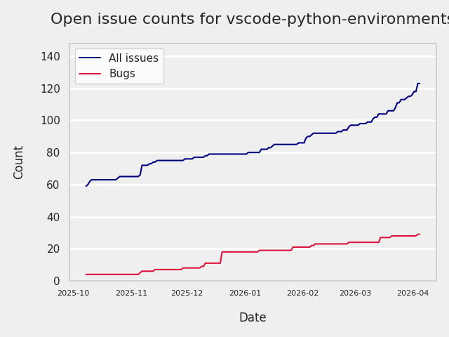

# GITHUB ISSUES REPORT FOR microsoft/vscode-python-environments

Generated on 2026-02-23 using: stale=30, all=True

* marks items that are new to report in past 7 day(s)

## FOR ISSUES THAT ARE MARKED AS BUGS:

### Issues in vscode-python-environments that need a response from team:

| Days Ago | Issue | Title |
| --- | --- | --- |
 |  OP:39  |[1107](https://github.com/microsoft/vscode-python-environments/issues/1107 "This extension does not work with multi-root workspaces and Pixi") | This extension does not work with multi-root workspaces and Pixi |
 |  OP:41  |[1099](https://github.com/microsoft/vscode-python-environments/issues/1099 "Workspace virtual environment interpreter cannot be used for files outside workspace") | Workspace virtual environment interpreter cannot be used for files outside workspace |
 |  OP:52  |[1077](https://github.com/microsoft/vscode-python-environments/issues/1077 "python.terminal.executeInFileDir not working, cd does not change to .py file's diectory") | python.terminal.executeInFileDir not working, cd does not change to .py file's diectory |

### Issues in vscode-python-environments that have comments from OP after last team response:

| Days Ago | Issue | Title |
| --- | --- | --- |
 |  TM:21, OP:12  |[974](https://github.com/microsoft/vscode-python-environments/issues/974 "ShellStartup auto-activation adds newline") | ShellStartup auto-activation adds newline |
 |  TM:14, OP:12  |[664](https://github.com/microsoft/vscode-python-environments/issues/664 "The automatic activation mechanism has been damaged") | The automatic activation mechanism has been damaged |
 |  TM:364, OP:364  |[198](https://github.com/microsoft/vscode-python-environments/issues/198 "terminal.launchArgs not being used") | terminal.launchArgs not being used |

### Issues in vscode-python-environments that have comments from 3rd party after last team response:

| Days Ago | Issue | Title |
| --- | --- | --- |
 |  P:13,  |[1108](https://github.com/microsoft/vscode-python-environments/issues/1108 "My project type was incorrectly identified.") | My project type was incorrectly identified. |

### Issues in vscode-python-environments that have no external responses since team response in 30+ days:

| Days Ago | Issue | Title |
| --- | --- | --- |
 |  TM:152  |[786](https://github.com/microsoft/vscode-python-environments/issues/786 "Python env activates automatically ignoring settings") | Python env activates automatically ignoring settings |
 |  TM:210  |[661](https://github.com/microsoft/vscode-python-environments/issues/661 "Extension breaks python envy and associated use-case") | Extension breaks python envy and associated use-case |

---

## FOR ISSUES THAT ARE NOT MARKED AS BUGS:

### Issues in vscode-python-environments that need a response from team:

| Days Ago | Issue | Title |
| --- | --- | --- |
 |  OP:9  |[1235](https://github.com/microsoft/vscode-python-environments/issues/1235 "python.interpreterPath resolves incorrectly in tasks.json when it isn't first") | python.interpreterPath resolves incorrectly in tasks.json when it isn't first |
 |  OP:38  |[1109](https://github.com/microsoft/vscode-python-environments/issues/1109 "Support pip --upgrade-strategy flag (especially 'eager') for upgrading Python package dependencies") | Support pip --upgrade-strategy flag (especially 'eager') for upgrading Python package dependencies |

### Issues in vscode-python-environments that have comments from OP after last team response:

| Days Ago | Issue | Title |
| --- | --- | --- |
 | \* TM:5, OP:4  |[1094](https://github.com/microsoft/vscode-python-environments/issues/1094 "pythonProjects setting messed up with remote multi-root environment")  |pythonProjects setting messed up with remote multi-root environment |
 |  TM:84, OP:81  |[1028](https://github.com/microsoft/vscode-python-environments/issues/1028 "Feature Request: Conditional Activity Bar Icon Visibility Based on Project Type") | Feature Request: Conditional Activity Bar Icon Visibility Based on Project Type |
 | \* TM:0, OP:0  |[981](https://github.com/microsoft/vscode-python-environments/issues/981 "Configure environment via VSCode settings?")  |Configure environment via VSCode settings? |
 |  TM:130, OP:129  |[927](https://github.com/microsoft/vscode-python-environments/issues/927 "[Feature Request] Add a setting to disable specific environment managers") | [Feature Request] Add a setting to disable specific environment managers |
 |  TM:168, OP:126  |[735](https://github.com/microsoft/vscode-python-environments/issues/735 "Feature Request: Easily Add Folder to PYTHONPATH from VS Code UI") | Feature Request: Easily Add Folder to PYTHONPATH from VS Code UI |
 |  TM:193, OP:64  |[705](https://github.com/microsoft/vscode-python-environments/issues/705 "show environment type in python interpreter name in status bar") | show environment type in python interpreter name in status bar |

### Issues in vscode-python-environments that have comments from 3rd party after last team response:

| Days Ago | Issue | Title |
| --- | --- | --- |
 |  P:69,  |[1053](https://github.com/microsoft/vscode-python-environments/issues/1053 "Feature Request: activate default project python/conda environment when launching a task") | Feature Request: activate default project python/conda environment when launching a task |

### Issues in vscode-python-environments that have no external responses since team response in 30+ days:

| Days Ago | Issue | Title |
| --- | --- | --- |
 |  TM:42  |[1092](https://github.com/microsoft/vscode-python-environments/issues/1092 "[Python Environments] Environment file pop-up") | [Python Environments] Environment file pop-up |
 |  TM:104  |[960](https://github.com/microsoft/vscode-python-environments/issues/960 "Expose helper for resolving python-env search paths (getAllExtraSearchPaths)") | Expose helper for resolving python-env search paths (getAllExtraSearchPaths) |
 |  TM:41  |[639](https://github.com/microsoft/vscode-python-environments/issues/639 "Conda environment activation does not work for R terminals") | Conda environment activation does not work for R terminals |
 |  TM:41  |[634](https://github.com/microsoft/vscode-python-environments/issues/634 "[Feature request] Disable automatically making the root folder a Python project") | [Feature request] Disable automatically making the root folder a Python project |
 |  TM:257  |[476](https://github.com/microsoft/vscode-python-environments/issues/476 "Environment Manager viewlet - no visual  indicatior on the currently selected environment.") | Environment Manager viewlet - no visual  indicatior on the currently selected environment. |
 |  TM:264  |[470](https://github.com/microsoft/vscode-python-environments/issues/470 "Offer to create folder/workspace in 'Add as Python Project' flow") | Offer to create folder/workspace in 'Add as Python Project' flow |
 |  TM:292  |[378](https://github.com/microsoft/vscode-python-environments/issues/378 "Extension API: How to map it to hatch?") | Extension API: How to map it to hatch? |
 |  TM:77  |[165](https://github.com/microsoft/vscode-python-environments/issues/165 "Suggest pinned package dependency updates on pyproject.toml") | Suggest pinned package dependency updates on pyproject.toml |

## PULL REQUEST ACTIVITY

### Pull Requests opened in the past 7 day(s):

| | PR | Created By | Created | Days Open | Closed/Merged | Closed/Merged By | Title |
| --- | --- | --- | --- | --- | --- | --- | --- |
| \* | [#1265](https://github.com/microsoft/vscode-python-environments/pull/1265) | eleanorjboyd | 2026-02-23 | 0 | 2026-02-23 | eleanorjboyd | feat: add ENVIRONMENT_DISCOVERY telemetry event and update related telemetry |
| \* | [#1265](https://github.com/microsoft/vscode-python-environments/pull/1265) | eleanorjboyd | 2026-02-23 | 0 | 2026-02-23 | eleanorjboyd | feat: add ENVIRONMENT_DISCOVERY telemetry event and update related telemetry |
| \* | [#1264](https://github.com/microsoft/vscode-python-environments/pull/1264) | eleanorjboyd | 2026-02-23 | 0 | 2026-02-23 | eleanorjboyd | fix main CI errors |
| \* | [#1264](https://github.com/microsoft/vscode-python-environments/pull/1264) | eleanorjboyd | 2026-02-23 | 0 | 2026-02-23 | eleanorjboyd | fix main CI errors |
| \* | [#1263](https://github.com/microsoft/vscode-python-environments/pull/1263) | eleanorjboyd | 2026-02-23 | 0 | 2026-02-23 | eleanorjboyd | bump: update version to 1.20.1 in package.json and package-lock.json |
| \* | [#1263](https://github.com/microsoft/vscode-python-environments/pull/1263) | eleanorjboyd | 2026-02-23 | 0 | 2026-02-23 | eleanorjboyd | bump: update version to 1.20.1 in package.json and package-lock.json |
| \* | [#1260](https://github.com/microsoft/vscode-python-environments/pull/1260) | anthonykim1 | 2026-02-22 | 0 | 2026-02-22 | karthiknadig | Revert VS Code engine to 1.106, hold task proposed api |
| \* | [#1260](https://github.com/microsoft/vscode-python-environments/pull/1260) | anthonykim1 | 2026-02-22 | 0 | 2026-02-22 | karthiknadig | Revert VS Code engine to 1.106, hold task proposed api |
| \* | [#1259](https://github.com/microsoft/vscode-python-environments/pull/1259) | anthonykim1 | 2026-02-22 | 0 | 2026-02-22 | - | Revert VS Code engine to 1.106, hold task proposed api |
| \* | [#1258](https://github.com/microsoft/vscode-python-environments/pull/1258) | anthonykim1 | 2026-02-22 | 0 | 2026-02-22 | - | Revert vscode engine bump, task proposed api  |
| \* | [#1257](https://github.com/microsoft/vscode-python-environments/pull/1257) | anthonykim1 | 2026-02-22 | 0 | 2026-02-22 | - | Go back to vscode engine 1.106.0 |
| \* | [#1249](https://github.com/microsoft/vscode-python-environments/pull/1249) | karthiknadig | 2026-02-18 | 0 | 2026-02-18 | karthiknadig | feat: add WORKON_HOME and XDG_DATA_HOME support for pipenv (Fixes #1185) |
| \* | [#1249](https://github.com/microsoft/vscode-python-environments/pull/1249) | karthiknadig | 2026-02-18 | 0 | 2026-02-18 | karthiknadig | feat: add WORKON_HOME and XDG_DATA_HOME support for pipenv (Fixes #1185) |
| \* | [#1248](https://github.com/microsoft/vscode-python-environments/pull/1248) | karthiknadig | 2026-02-18 | 0 | 2026-02-18 | karthiknadig | fix: use conda.sh for Git Bash activation on Windows (Fixes #1247) |
| \* | [#1248](https://github.com/microsoft/vscode-python-environments/pull/1248) | karthiknadig | 2026-02-18 | 0 | 2026-02-18 | karthiknadig | fix: use conda.sh for Git Bash activation on Windows (Fixes #1247) |
| \* | [#1245](https://github.com/microsoft/vscode-python-environments/pull/1245) | eleanorjboyd | 2026-02-18 | 0 | 2026-02-18 | eleanorjboyd | Add Rust toolchain setup to push-check workflow |
| \* | [#1245](https://github.com/microsoft/vscode-python-environments/pull/1245) | eleanorjboyd | 2026-02-18 | 0 | 2026-02-18 | eleanorjboyd | Add Rust toolchain setup to push-check workflow |
| \* | [#1244](https://github.com/microsoft/vscode-python-environments/pull/1244) | eleanorjboyd | 2026-02-18 | 0 | 2026-02-18 | eleanorjboyd | fix pipenv and poetry setting |
| \* | [#1244](https://github.com/microsoft/vscode-python-environments/pull/1244) | eleanorjboyd | 2026-02-18 | 0 | 2026-02-18 | eleanorjboyd | fix pipenv and poetry setting |
| \* | [#1243](https://github.com/microsoft/vscode-python-environments/pull/1243) | eleanorjboyd | 2026-02-17 | 0 | 2026-02-17 | eleanorjboyd | add support for `CONDA_PREFIX` set already in vscode environment |
| \* | [#1243](https://github.com/microsoft/vscode-python-environments/pull/1243) | eleanorjboyd | 2026-02-17 | 0 | 2026-02-17 | eleanorjboyd | add support for `CONDA_PREFIX` set already in vscode environment |
| \* | [#1242](https://github.com/microsoft/vscode-python-environments/pull/1242) | eleanorjboyd | 2026-02-17 | 0 | 2026-02-17 | eleanorjboyd | bump: update version to 1.21.0 in package.json |
| \* | [#1242](https://github.com/microsoft/vscode-python-environments/pull/1242) | eleanorjboyd | 2026-02-17 | 0 | 2026-02-17 | eleanorjboyd | bump: update version to 1.21.0 in package.json |
| \* | [#1241](https://github.com/microsoft/vscode-python-environments/pull/1241) | eleanorjboyd | 2026-02-17 | 0 | 2026-02-17 | eleanorjboyd | Bump version to 1.20.0 in package.json and package-lock.json |
| \* | [#1241](https://github.com/microsoft/vscode-python-environments/pull/1241) | eleanorjboyd | 2026-02-17 | 0 | 2026-02-17 | eleanorjboyd | Bump version to 1.20.0 in package.json and package-lock.json |

### Pull Requests merged in the past 7 day(s):

| | PR | Created By | Created | Days Open | Closed/Merged | Closed/Merged By | Title |
| --- | --- | --- | --- | --- | --- | --- | --- |
| \* | [#1265](https://github.com/microsoft/vscode-python-environments/pull/1265) | eleanorjboyd | 2026-02-23 | 0 | 2026-02-23 | eleanorjboyd | feat: add ENVIRONMENT_DISCOVERY telemetry event and update related telemetry |
| \* | [#1265](https://github.com/microsoft/vscode-python-environments/pull/1265) | eleanorjboyd | 2026-02-23 | 0 | 2026-02-23 | eleanorjboyd | feat: add ENVIRONMENT_DISCOVERY telemetry event and update related telemetry |
| \* | [#1264](https://github.com/microsoft/vscode-python-environments/pull/1264) | eleanorjboyd | 2026-02-23 | 0 | 2026-02-23 | eleanorjboyd | fix main CI errors |
| \* | [#1264](https://github.com/microsoft/vscode-python-environments/pull/1264) | eleanorjboyd | 2026-02-23 | 0 | 2026-02-23 | eleanorjboyd | fix main CI errors |
| \* | [#1263](https://github.com/microsoft/vscode-python-environments/pull/1263) | eleanorjboyd | 2026-02-23 | 0 | 2026-02-23 | eleanorjboyd | bump: update version to 1.20.1 in package.json and package-lock.json |
| \* | [#1263](https://github.com/microsoft/vscode-python-environments/pull/1263) | eleanorjboyd | 2026-02-23 | 0 | 2026-02-23 | eleanorjboyd | bump: update version to 1.20.1 in package.json and package-lock.json |
| \* | [#1260](https://github.com/microsoft/vscode-python-environments/pull/1260) | anthonykim1 | 2026-02-22 | 0 | 2026-02-22 | karthiknadig | Revert VS Code engine to 1.106, hold task proposed api |
| \* | [#1260](https://github.com/microsoft/vscode-python-environments/pull/1260) | anthonykim1 | 2026-02-22 | 0 | 2026-02-22 | karthiknadig | Revert VS Code engine to 1.106, hold task proposed api |
| \* | [#1249](https://github.com/microsoft/vscode-python-environments/pull/1249) | karthiknadig | 2026-02-18 | 0 | 2026-02-18 | karthiknadig | feat: add WORKON_HOME and XDG_DATA_HOME support for pipenv (Fixes #1185) |
| \* | [#1249](https://github.com/microsoft/vscode-python-environments/pull/1249) | karthiknadig | 2026-02-18 | 0 | 2026-02-18 | karthiknadig | feat: add WORKON_HOME and XDG_DATA_HOME support for pipenv (Fixes #1185) |
| \* | [#1248](https://github.com/microsoft/vscode-python-environments/pull/1248) | karthiknadig | 2026-02-18 | 0 | 2026-02-18 | karthiknadig | fix: use conda.sh for Git Bash activation on Windows (Fixes #1247) |
| \* | [#1248](https://github.com/microsoft/vscode-python-environments/pull/1248) | karthiknadig | 2026-02-18 | 0 | 2026-02-18 | karthiknadig | fix: use conda.sh for Git Bash activation on Windows (Fixes #1247) |
| \* | [#1218](https://github.com/microsoft/vscode-python-environments/pull/1218) | karthiknadig | 2026-02-10 | 8 | 2026-02-18 | karthiknadig | Add platform-specific default paths for Poetry cache and virtualenvs |
| \* | [#1218](https://github.com/microsoft/vscode-python-environments/pull/1218) | karthiknadig | 2026-02-10 | 8 | 2026-02-18 | karthiknadig | Add platform-specific default paths for Poetry cache and virtualenvs |
| \* | [#1227](https://github.com/microsoft/vscode-python-environments/pull/1227) | eleanorjboyd | 2026-02-12 | 5 | 2026-02-18 | eleanorjboyd | Add integration test |
| \* | [#1227](https://github.com/microsoft/vscode-python-environments/pull/1227) | eleanorjboyd | 2026-02-12 | 5 | 2026-02-18 | eleanorjboyd | Add integration test |
| \* | [#1245](https://github.com/microsoft/vscode-python-environments/pull/1245) | eleanorjboyd | 2026-02-18 | 0 | 2026-02-18 | eleanorjboyd | Add Rust toolchain setup to push-check workflow |
| \* | [#1245](https://github.com/microsoft/vscode-python-environments/pull/1245) | eleanorjboyd | 2026-02-18 | 0 | 2026-02-18 | eleanorjboyd | Add Rust toolchain setup to push-check workflow |
| \* | [#1244](https://github.com/microsoft/vscode-python-environments/pull/1244) | eleanorjboyd | 2026-02-18 | 0 | 2026-02-18 | eleanorjboyd | fix pipenv and poetry setting |
| \* | [#1244](https://github.com/microsoft/vscode-python-environments/pull/1244) | eleanorjboyd | 2026-02-18 | 0 | 2026-02-18 | eleanorjboyd | fix pipenv and poetry setting |
| \* | [#1240](https://github.com/microsoft/vscode-python-environments/pull/1240) | karthiknadig | 2026-02-15 | 2 | 2026-02-18 | karthiknadig | chore: add execProcess wrapper and refactor poetryUtils (Fixes #1239) |
| \* | [#1240](https://github.com/microsoft/vscode-python-environments/pull/1240) | karthiknadig | 2026-02-15 | 2 | 2026-02-18 | karthiknadig | chore: add execProcess wrapper and refactor poetryUtils (Fixes #1239) |
| \* | [#1238](https://github.com/microsoft/vscode-python-environments/pull/1238) | dependabot | 2026-02-15 | 2 | 2026-02-18 | eleanorjboyd | chore(deps-dev): bump qs from 6.14.1 to 6.15.0 |
| \* | [#1238](https://github.com/microsoft/vscode-python-environments/pull/1238) | dependabot | 2026-02-15 | 2 | 2026-02-18 | eleanorjboyd | chore(deps-dev): bump qs from 6.14.1 to 6.15.0 |
| \* | [#1243](https://github.com/microsoft/vscode-python-environments/pull/1243) | eleanorjboyd | 2026-02-17 | 0 | 2026-02-17 | eleanorjboyd | add support for `CONDA_PREFIX` set already in vscode environment |
| \* | [#1243](https://github.com/microsoft/vscode-python-environments/pull/1243) | eleanorjboyd | 2026-02-17 | 0 | 2026-02-17 | eleanorjboyd | add support for `CONDA_PREFIX` set already in vscode environment |
| \* | [#1231](https://github.com/microsoft/vscode-python-environments/pull/1231) | eleanorjboyd | 2026-02-13 | 4 | 2026-02-17 | eleanorjboyd | fix bug: getDedicatedTerminal errors on string value for supported terminalKey |
| \* | [#1231](https://github.com/microsoft/vscode-python-environments/pull/1231) | eleanorjboyd | 2026-02-13 | 4 | 2026-02-17 | eleanorjboyd | fix bug: getDedicatedTerminal errors on string value for supported terminalKey |
| \* | [#1242](https://github.com/microsoft/vscode-python-environments/pull/1242) | eleanorjboyd | 2026-02-17 | 0 | 2026-02-17 | eleanorjboyd | bump: update version to 1.21.0 in package.json |
| \* | [#1242](https://github.com/microsoft/vscode-python-environments/pull/1242) | eleanorjboyd | 2026-02-17 | 0 | 2026-02-17 | eleanorjboyd | bump: update version to 1.21.0 in package.json |
| \* | [#1241](https://github.com/microsoft/vscode-python-environments/pull/1241) | eleanorjboyd | 2026-02-17 | 0 | 2026-02-17 | eleanorjboyd | Bump version to 1.20.0 in package.json and package-lock.json |
| \* | [#1241](https://github.com/microsoft/vscode-python-environments/pull/1241) | eleanorjboyd | 2026-02-17 | 0 | 2026-02-17 | eleanorjboyd | Bump version to 1.20.0 in package.json and package-lock.json |

### Pull Requests closed (not merged) in the past 7 day(s):

| | PR | Created By | Created | Days Open | Closed/Merged | Closed/Merged By | Title |
| --- | --- | --- | --- | --- | --- | --- | --- |
| \* | [#1259](https://github.com/microsoft/vscode-python-environments/pull/1259) | anthonykim1 | 2026-02-22 | 0 | 2026-02-22 | - | Revert VS Code engine to 1.106, hold task proposed api |
| \* | [#1258](https://github.com/microsoft/vscode-python-environments/pull/1258) | anthonykim1 | 2026-02-22 | 0 | 2026-02-22 | - | Revert vscode engine bump, task proposed api  |
| \* | [#1257](https://github.com/microsoft/vscode-python-environments/pull/1257) | anthonykim1 | 2026-02-22 | 0 | 2026-02-22 | - | Go back to vscode engine 1.106.0 |
| \* | [#854](https://github.com/microsoft/vscode-python-environments/pull/854) | copilot-swe-agent | 2025-09-21 | 149 | 2026-02-18 | - | Fix wrong activate command with powershell with conda |

### Pull Requests still open that were opened more than 7 days ago:

| | PR | Created By | Created | Days Open | Closed/Merged | Closed/Merged By | Title |
| --- | --- | --- | --- | --- | --- | --- | --- |
| \* | [#740](https://github.com/microsoft/vscode-python-environments/pull/740) | almarouk | 2025-08-20 | 187 | - | - | Improve shell command formatting |
| \* | [#742](https://github.com/microsoft/vscode-python-environments/pull/742) | kipavy | 2025-08-21 | 186 | - | - | Add commands to manage Python PATH |
| \* | [#980](https://github.com/microsoft/vscode-python-environments/pull/980) | copilot-swe-agent | 2025-11-11 | 104 | - | - | Add cancellable async timeout utilities from VS Code core |
| \* | [#1036](https://github.com/microsoft/vscode-python-environments/pull/1036) | copilot-swe-agent | 2025-12-08 | 77 | - | - | Fix createTerminal command to prompt for project selection in multiroot workspaces |
| \* | [#1095](https://github.com/microsoft/vscode-python-environments/pull/1095) | copilot-swe-agent | 2026-01-12 | 42 | - | - | Add "Don't Show Again" option to environment file notification |

## RECENTLY CLOSED ISSUES

### Issues closed in the past 7 day(s):

| Days Ago | Issue | Title |
| --- | --- | --- |
 | \* TM:76  |[1041](https://github.com/microsoft/vscode-python-environments/issues/1041 "documentation for searchPaths")  |documentation for searchPaths |
 | \* TM:70  |[1064](https://github.com/microsoft/vscode-python-environments/issues/1064 "Add documentation for uv support to README")  |Add documentation for uv support to README |
 | \* TM:40  |[1098](https://github.com/microsoft/vscode-python-environments/issues/1098 "Documentation Changes for MVP")  |Documentation Changes for MVP |
 | \* TM:138  |[906](https://github.com/microsoft/vscode-python-environments/issues/906 "Behavior of python-env.workspaceSearchPaths")  |Behavior of python-env.workspaceSearchPaths |
 | \* TM:2  |[1254](https://github.com/microsoft/vscode-python-environments/issues/1254 "Python Environments extension doesn't discover venvs in python.venvPath (~/.virtualenvs)")  |Python Environments extension doesn't discover venvs in python.venvPath (~/.virtualenvs) |
 | \* TM:0  |[1256](https://github.com/microsoft/vscode-python-environments/issues/1256 "Broken - Cannot find any environments installed - Cannot create any environments")  |Broken - Cannot find any environments installed - Cannot create any environments |
 | \* TM:20  |[1136](https://github.com/microsoft/vscode-python-environments/issues/1136 "[Python Environments] Python Interpreter bottom right GUI Selector doesn't work.")  |[Python Environments] Python Interpreter bottom right GUI Selector doesn't work. |
 | \* TM:0  |[1255](https://github.com/microsoft/vscode-python-environments/issues/1255 "[Python Environments] ")  |[Python Environments]  |
 | \* TM:260  |[496](https://github.com/microsoft/vscode-python-environments/issues/496 "logs in integrated terminal will be cleared after each run")  |logs in integrated terminal will be cleared after each run |
 | \* TM:14  |[1185](https://github.com/microsoft/vscode-python-environments/issues/1185 "Pipenv: Missing support for WORKON_HOME and XDG_DATA_HOME environment variables")  |Pipenv: Missing support for WORKON_HOME and XDG_DATA_HOME environment variables |
 | \* TM:0  |[1250](https://github.com/microsoft/vscode-python-environments/issues/1250 "[Python Environments] ")  |[Python Environments]  |
 | \* TM:0  |[1247](https://github.com/microsoft/vscode-python-environments/issues/1247 "Using the wrong activation script on Windows + gitbash + conda")  |Using the wrong activation script on Windows + gitbash + conda |
 | \* TM:2  |[1239](https://github.com/microsoft/vscode-python-environments/issues/1239 "Consolidate external dependency wrappers for improved testability")  |Consolidate external dependency wrappers for improved testability |
 | \* TM:13  |[1184](https://github.com/microsoft/vscode-python-environments/issues/1184 "Poetry: {cache-dir} placeholder not properly resolved in virtualenvs.path")  |Poetry: {cache-dir} placeholder not properly resolved in virtualenvs.path |
 | \* TM:13  |[1182](https://github.com/microsoft/vscode-python-environments/issues/1182 "Poetry: Incorrect default virtualenvs path on Windows and macOS")  |Poetry: Incorrect default virtualenvs path on Windows and macOS |
 | \* TM:133  |[912](https://github.com/microsoft/vscode-python-environments/issues/912 "support pipenv path setting")  |support pipenv path setting |
 | \* TM:95  |[990](https://github.com/microsoft/vscode-python-environments/issues/990 "Design for pipenvPath and poetryPath settings")  |Design for pipenvPath and poetryPath settings |
 | \* TM:209  |[633](https://github.com/microsoft/vscode-python-environments/issues/633 "Test discovery doesn't use the selected environment")  |Test discovery doesn't use the selected environment |
 | \* TM:229  |[596](https://github.com/microsoft/vscode-python-environments/issues/596 "Add environment path to interpreter selection menu when on multi-root projects")  |Add environment path to interpreter selection menu when on multi-root projects |
 | \* TM:251  |[527](https://github.com/microsoft/vscode-python-environments/issues/527 "Add a &quot;reveal&quot; icon to the environment in the python projects view")  |Add a "reveal" icon to the environment in the python projects view |
 | \* TM:305  |[318](https://github.com/microsoft/vscode-python-environments/issues/318 "Add doc for various scenarios for set and get environment")  |Add doc for various scenarios for set and get environment |
 | \* TM:274  |[422](https://github.com/microsoft/vscode-python-environments/issues/422 "select environment detail info")  |select environment detail info |
 | \* TM:259  |[461](https://github.com/microsoft/vscode-python-environments/issues/461 "Should copy button temporarily become a checkmark")  |Should copy button temporarily become a checkmark |
 | \* TM:14  |[1160](https://github.com/microsoft/vscode-python-environments/issues/1160 "quick create fails for python repo")  |quick create fails for python repo |
 | \* TM:273  |[429](https://github.com/microsoft/vscode-python-environments/issues/429 "deleted folder still lives in project view")  |deleted folder still lives in project view |
 | \* TM:216  |[609](https://github.com/microsoft/vscode-python-environments/issues/609 "Feature request: Quick Create uses the active global Python interpreter version")  |Feature request: Quick Create uses the active global Python interpreter version |
 | \* TM:252  |[519](https://github.com/microsoft/vscode-python-environments/issues/519 "Appending version after environment name is unclear")  |Appending version after environment name is unclear |
 | \* TM:252  |[520](https://github.com/microsoft/vscode-python-environments/issues/520 "Labeling activity bar icon as Python is unclear")  |Labeling activity bar icon as Python is unclear |
 | \* TM:167  |[782](https://github.com/microsoft/vscode-python-environments/issues/782 "Expanding `Pipenv` should refresh the children")  |Expanding `Pipenv` should refresh the children |
 | \* TM:90  |[1014](https://github.com/microsoft/vscode-python-environments/issues/1014 "envFile configuration wrongly includes a trailing comment in environment variable value")  |envFile configuration wrongly includes a trailing comment in environment variable value |
 | \* TM:117  |[951](https://github.com/microsoft/vscode-python-environments/issues/951 "Activating extension 'ms-python.vscode-python-envs' failed: The &quot;paths[1]&quot; argument must be of type string. Received undefined.")  |Activating extension 'ms-python.vscode-python-envs' failed: The "paths[1]" argument must be of type string. Received undefined. |
 | \* TM:146  |[861](https://github.com/microsoft/vscode-python-environments/issues/861 "Settings Review: Python ext & Python Envs ext")  |Settings Review: Python ext & Python Envs ext |
 | \* TM:95  |[986](https://github.com/microsoft/vscode-python-environments/issues/986 "`shellStartup` doesn't work properly in a devcontainer")  |`shellStartup` doesn't work properly in a devcontainer |
 | \* TM:6  |[1219](https://github.com/microsoft/vscode-python-environments/issues/1219 "vscode-python-envs forgets environment and writes faulty ./.vscode/settings.json")  |vscode-python-envs forgets environment and writes faulty ./.vscode/settings.json |
 | \* TM:4  |[1230](https://github.com/microsoft/vscode-python-environments/issues/1230 "runInDedicatedTerminal crashes when terminalKey is a string")  |runInDedicatedTerminal crashes when terminalKey is a string |
 | \* TM:20  |[1125](https://github.com/microsoft/vscode-python-environments/issues/1125 "[Python Environments] ")  |[Python Environments]  |

## MOST FREQUENTLY CHANGED FILES (by # of PRs):

 76: package.json

 59: src/extension.ts

 47: package-lock.json

 31: src/managers/conda/condaUtils.ts

 28: src/features/envCommands.ts

 27: package.nls.json

 26: src/managers/builtin/venvUtils.ts

 20: src/managers/builtin/venvManager.ts

 19: src/common/localize.ts

 17: src/features/terminal/terminalManager.ts

 17: src/api.ts

 16: src/managers/common/nativePythonFinder.ts

 14: src/features/terminal/shells/common/shellUtils.ts

 14: src/features/terminal/shells/bash/bashStartup.ts

 12: src/features/terminal/utils.ts

 12: src/managers/poetry/poetryUtils.ts

 12: .github/instructions/testing-workflow.instructions.md

 12: src/features/terminal/shells/fish/fishStartup.ts

 12: README.md

 12: src/features/terminal/shells/pwsh/pwshStartup.ts

 11: src/managers/pipenv/pipenvUtils.ts

 10: src/internal.api.ts

 10: src/managers/conda/condaEnvManager.ts

 10: build/azure-pipeline.stable.yml

 10: src/common/pickers/managers.ts

 10: src/features/creators/newPackageProject.ts

 10: src/managers/builtin/pipUtils.ts

  9: src/managers/common/utils.ts

  9: src/managers/pyenv/pyenvUtils.ts

  9: src/features/projectManager.ts

  8: src/common/telemetry/constants.ts

  8: src/features/settings/settingHelpers.ts

  7: src/managers/builtin/utils.ts

  7: src/features/views/treeViewItems.ts

  7: src/managers/builtin/main.ts

  7: src/helpers.ts

  7: src/managers/builtin/pipManager.ts

  7: src/features/creators/newScriptProject.ts

  6: src/managers/pipenv/pipenvManager.ts

  6: src/features/terminal/terminalEnvVarInjector.ts

  6: src/features/views/envManagersView.ts

  6: src/features/terminal/shellStartupSetupHandlers.ts

  6: src/features/envManagers.ts

  6: src/features/creators/existingProjects.ts

  6: src/features/copilotTools.ts

  5: .github/workflows/push-check.yml

  5: .github/workflows/pr-check.yml

  5: .github/instructions/generic.instructions.md

  5: src/managers/builtin/sysPythonManager.ts

  5: src/common/window.apis.ts

  5: src/managers/pipenv/main.ts

  5: src/test/features/terminalEnvVarInjectorBasic.unit.test.ts

  5: src/common/constants.ts

  5: src/common/utils/pathUtils.ts

  5: src/managers/poetry/main.ts

  5: src/features/creators/autoFindProjects.ts

  5: src/features/pythonApi.ts

