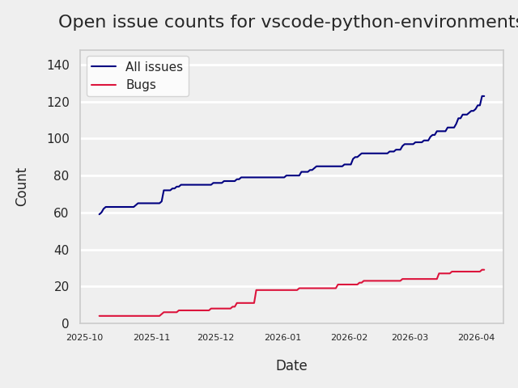
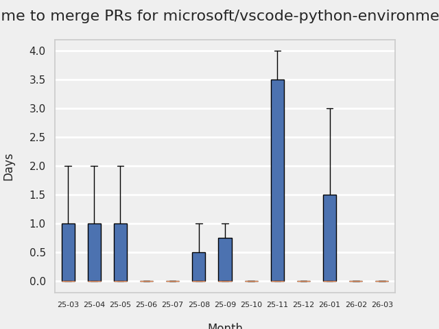
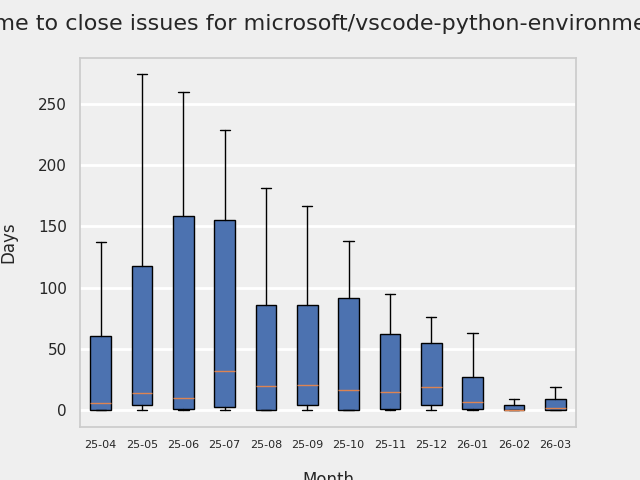
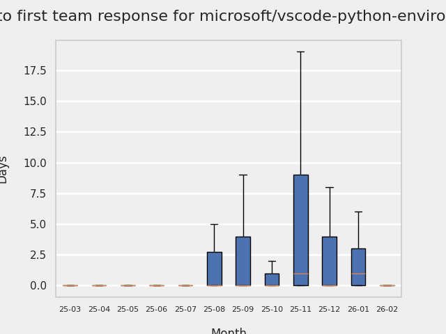
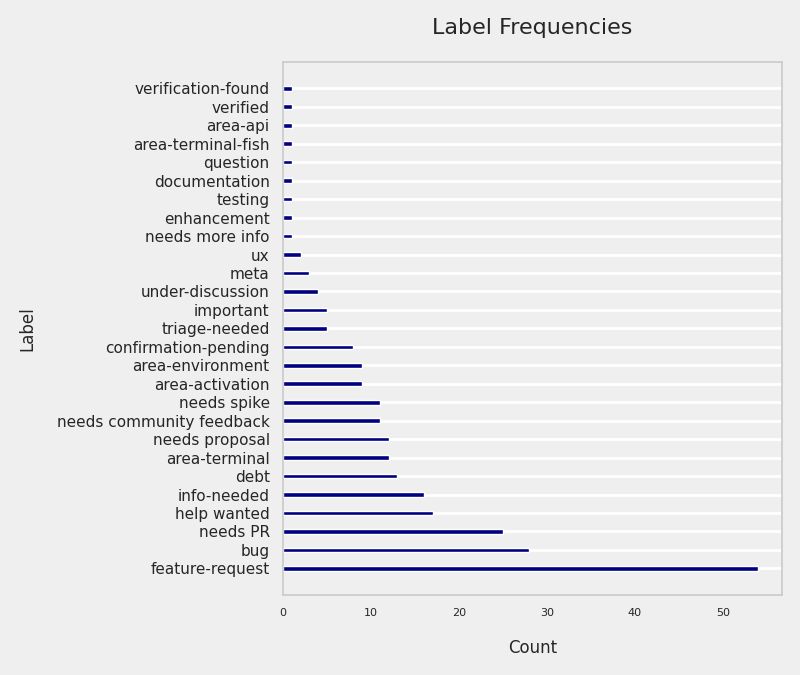
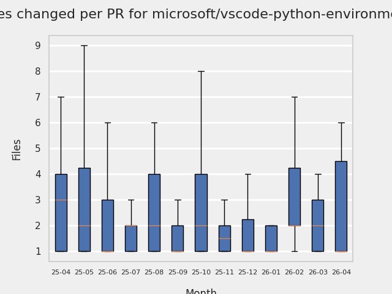
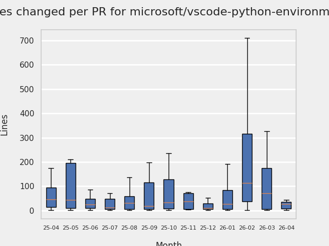
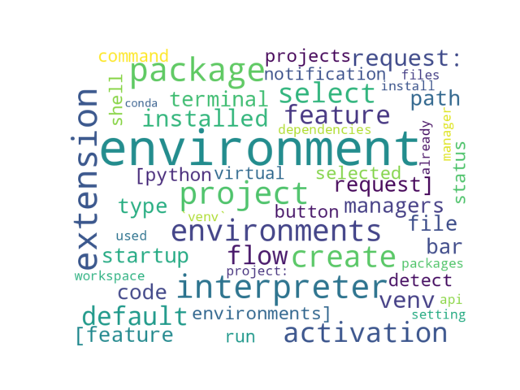

# GITHUB ISSUES REPORT FOR microsoft/vscode-python-environments

Generated on 2026-03-15 using: stale=30, all=True

* marks items that are new to report in past 7 day(s)

## FOR ISSUES THAT ARE MARKED AS BUGS:

### Issues in vscode-python-environments that need a response from team:

| Days Ago | Issue | Title |
| --- | --- | --- |
 |  OP:59  |[1107](https://github.com/microsoft/vscode-python-environments/issues/1107 "This extension does not work with multi-root workspaces and Pixi") | This extension does not work with multi-root workspaces and Pixi |
 |  OP:61  |[1099](https://github.com/microsoft/vscode-python-environments/issues/1099 "Workspace virtual environment interpreter cannot be used for files outside workspace") | Workspace virtual environment interpreter cannot be used for files outside workspace |
 |  OP:72  |[1077](https://github.com/microsoft/vscode-python-environments/issues/1077 "python.terminal.executeInFileDir not working, cd does not change to .py file's diectory") | python.terminal.executeInFileDir not working, cd does not change to .py file's diectory |

### Issues in vscode-python-environments that have comments from OP after last team response:

| Days Ago | Issue | Title |
| --- | --- | --- |
 | \* TM:2, OP:1  |[1357](https://github.com/microsoft/vscode-python-environments/issues/1357 "[BUG] Unable to detect or recognize python executable on certain machines")  |[BUG] Unable to detect or recognize python executable on certain machines |
 | \* TM:3, OP:0  |[1277](https://github.com/microsoft/vscode-python-environments/issues/1277 "Prefix the environment activation command with a space")  |Prefix the environment activation command with a space |
 |  TM:41, OP:32  |[974](https://github.com/microsoft/vscode-python-environments/issues/974 "ShellStartup auto-activation adds newline") | ShellStartup auto-activation adds newline |
 |  TM:34, OP:32  |[664](https://github.com/microsoft/vscode-python-environments/issues/664 "The automatic activation mechanism has been damaged") | The automatic activation mechanism has been damaged |
 |  TM:384, OP:384  |[198](https://github.com/microsoft/vscode-python-environments/issues/198 "terminal.launchArgs not being used") | terminal.launchArgs not being used |

### Issues in vscode-python-environments that have comments from 3rd party after last team response:

| Days Ago | Issue | Title |
| --- | --- | --- |
 | \* P:1,  |[1347](https://github.com/microsoft/vscode-python-environments/issues/1347 "selected python environment doesn't stick")  |selected python environment doesn't stick |
 | \* P:4,  |[1115](https://github.com/microsoft/vscode-python-environments/issues/1115 "Python: Select Interpreter command doesn't work and is not saved")  |Python: Select Interpreter command doesn't work and is not saved |
 |  P:33,  |[1108](https://github.com/microsoft/vscode-python-environments/issues/1108 "My project type was incorrectly identified.") | My project type was incorrectly identified. |
 |  P:13,  |[1059](https://github.com/microsoft/vscode-python-environments/issues/1059 "Refreshing virtual environments keeps on spinning due to missing pyenv") | Refreshing virtual environments keeps on spinning due to missing pyenv |
 |  P:12,  |[1039](https://github.com/microsoft/vscode-python-environments/issues/1039 "Bug: Command 'python.getRecommendedEnvironment' already exists in multi-root workspace") | Bug: Command 'python.getRecommendedEnvironment' already exists in multi-root workspace |
 | \* P:2,  |[603](https://github.com/microsoft/vscode-python-environments/issues/603 "VSCode forgets Python intepreter with the environments extension")  |VSCode forgets Python intepreter with the environments extension |

### Issues in vscode-python-environments that have no external responses since team response in 30+ days:

| Days Ago | Issue | Title |
| --- | --- | --- |
 |  TM:172  |[786](https://github.com/microsoft/vscode-python-environments/issues/786 "Python env activates automatically ignoring settings") | Python env activates automatically ignoring settings |
 |  TM:230  |[661](https://github.com/microsoft/vscode-python-environments/issues/661 "Extension breaks python envy and associated use-case") | Extension breaks python envy and associated use-case |

---

## FOR ISSUES THAT ARE NOT MARKED AS BUGS:

### Issues in vscode-python-environments that need a response from team:

| Days Ago | Issue | Title |
| --- | --- | --- |
 | \* OP:0  |[1360](https://github.com/microsoft/vscode-python-environments/issues/1360 "[Python Environments] ")  |[Python Environments]  |
 |  OP:18  |[1281](https://github.com/microsoft/vscode-python-environments/issues/1281 "Support `uv run` as an optional default run action.") | Support `uv run` as an optional default run action. |
 |  OP:20  |[1286](https://github.com/microsoft/vscode-python-environments/issues/1286 "Feature: Option to select no Python interpreter at all") | Feature: Option to select no Python interpreter at all |
 |  OP:29  |[1235](https://github.com/microsoft/vscode-python-environments/issues/1235 "python.interpreterPath resolves incorrectly in tasks.json when it isn't first") | python.interpreterPath resolves incorrectly in tasks.json when it isn't first |
 |  OP:58  |[1109](https://github.com/microsoft/vscode-python-environments/issues/1109 "Support pip --upgrade-strategy flag (especially 'eager') for upgrading Python package dependencies") | Support pip --upgrade-strategy flag (especially 'eager') for upgrading Python package dependencies |

### Issues in vscode-python-environments that have comments from OP after last team response:

| Days Ago | Issue | Title |
| --- | --- | --- |
 | \* TM:2, OP:1  |[1354](https://github.com/microsoft/vscode-python-environments/issues/1354 "VS Codium: None of python interpreters considered valid")  |VS Codium: None of python interpreters considered valid |
 | \* TM:4, OP:4  |[1341](https://github.com/microsoft/vscode-python-environments/issues/1341 "Windows: error when running environment activation script due to execution policy")  |Windows: error when running environment activation script due to execution policy |
 | \* TM:4, OP:4  |[1319](https://github.com/microsoft/vscode-python-environments/issues/1319 "Environment manager 'ms-python.python:conda' is not registered")  |Environment manager 'ms-python.python:conda' is not registered |
 | \* TM:4, OP:4  |[1315](https://github.com/microsoft/vscode-python-environments/issues/1315 "Failed to resolve environment")  |Failed to resolve environment |
 |  TM:11, OP:11  |[1313](https://github.com/microsoft/vscode-python-environments/issues/1313 "Conda Error caused by wrong activate command") | Conda Error caused by wrong activate command |
 |  TM:12, OP:11  |[1310](https://github.com/microsoft/vscode-python-environments/issues/1310 "python.useEnvsExtension on true - python interpreter can't select environments") | python.useEnvsExtension on true - python interpreter can't select environments |
 |  TM:12, OP:11  |[1309](https://github.com/microsoft/vscode-python-environments/issues/1309 "Stuck on initializing virtual environments") | Stuck on initializing virtual environments |
 |  TM:12, OP:11  |[1303](https://github.com/microsoft/vscode-python-environments/issues/1303 "Pixi environments are no longer detected") | Pixi environments are no longer detected |
 |  TM:20, OP:15  |[1253](https://github.com/microsoft/vscode-python-environments/issues/1253 "Jupyter kernel startup delayed 30s when extension is installed (pixi environment)") | Jupyter kernel startup delayed 30s when extension is installed (pixi environment) |
 |  TM:104, OP:101  |[1028](https://github.com/microsoft/vscode-python-environments/issues/1028 "Feature Request: Conditional Activity Bar Icon Visibility Based on Project Type") | Feature Request: Conditional Activity Bar Icon Visibility Based on Project Type |
 |  TM:20, OP:20  |[981](https://github.com/microsoft/vscode-python-environments/issues/981 "Configure environment via VSCode settings?") | Configure environment via VSCode settings? |
 |  TM:150, OP:149  |[927](https://github.com/microsoft/vscode-python-environments/issues/927 "[Feature Request] Add a setting to disable specific environment managers") | [Feature Request] Add a setting to disable specific environment managers |
 |  TM:188, OP:146  |[735](https://github.com/microsoft/vscode-python-environments/issues/735 "Feature Request: Easily Add Folder to PYTHONPATH from VS Code UI") | Feature Request: Easily Add Folder to PYTHONPATH from VS Code UI |
 |  TM:213, OP:84  |[705](https://github.com/microsoft/vscode-python-environments/issues/705 "show environment type in python interpreter name in status bar") | show environment type in python interpreter name in status bar |
 | \* TM:2, OP:2  |[378](https://github.com/microsoft/vscode-python-environments/issues/378 "Extension API: How to map it to hatch?")  |Extension API: How to map it to hatch? |

### Issues in vscode-python-environments that have comments from 3rd party after last team response:

| Days Ago | Issue | Title |
| --- | --- | --- |
 |  P:13,  |[1284](https://github.com/microsoft/vscode-python-environments/issues/1284 "Duplicate select python interpreter in status bar") | Duplicate select python interpreter in status bar |
 |  P:89,  |[1053](https://github.com/microsoft/vscode-python-environments/issues/1053 "Feature Request: activate default project python/conda environment when launching a task") | Feature Request: activate default project python/conda environment when launching a task |

### Issues in vscode-python-environments that have no external responses since team response in 30+ days:

| Days Ago | Issue | Title |
| --- | --- | --- |
 |  TM:41  |[1138](https://github.com/microsoft/vscode-python-environments/issues/1138 "Python extension prompts blocking Copilot agent flow") | Python extension prompts blocking Copilot agent flow |
 |  TM:62  |[1092](https://github.com/microsoft/vscode-python-environments/issues/1092 "[Python Environments] Environment file pop-up") | [Python Environments] Environment file pop-up |
 |  TM:124  |[960](https://github.com/microsoft/vscode-python-environments/issues/960 "Expose helper for resolving python-env search paths (getAllExtraSearchPaths)") | Expose helper for resolving python-env search paths (getAllExtraSearchPaths) |
 |  TM:61  |[639](https://github.com/microsoft/vscode-python-environments/issues/639 "Conda environment activation does not work for R terminals") | Conda environment activation does not work for R terminals |
 |  TM:61  |[634](https://github.com/microsoft/vscode-python-environments/issues/634 "[Feature request] Disable automatically making the root folder a Python project") | [Feature request] Disable automatically making the root folder a Python project |
 |  TM:277  |[476](https://github.com/microsoft/vscode-python-environments/issues/476 "Environment Manager viewlet - no visual  indicatior on the currently selected environment.") | Environment Manager viewlet - no visual  indicatior on the currently selected environment. |
 |  TM:284  |[470](https://github.com/microsoft/vscode-python-environments/issues/470 "Offer to create folder/workspace in 'Add as Python Project' flow") | Offer to create folder/workspace in 'Add as Python Project' flow |
 |  TM:97  |[165](https://github.com/microsoft/vscode-python-environments/issues/165 "Suggest pinned package dependency updates on pyproject.toml") | Suggest pinned package dependency updates on pyproject.toml |

## PULL REQUEST ACTIVITY

### Pull Requests opened in the past 7 day(s):

| | PR | Created By | Created | Days Open | Closed/Merged | Closed/Merged By | Title |
| --- | --- | --- | --- | --- | --- | --- | --- |
| \* | [#1344](https://github.com/microsoft/vscode-python-environments/pull/1344) | eleanorjboyd | 2026-03-11 | 4 | - | - | fix incorrect error message surfacing for defaultInterpreterPath |
| \* | [#1342](https://github.com/microsoft/vscode-python-environments/pull/1342) | eleanorjboyd | 2026-03-11 | 0 | 2026-03-11 | eleanorjboyd | bump PET on release branch |
| \* | [#1342](https://github.com/microsoft/vscode-python-environments/pull/1342) | eleanorjboyd | 2026-03-11 | 0 | 2026-03-11 | eleanorjboyd | bump PET on release branch |
| \* | [#1340](https://github.com/microsoft/vscode-python-environments/pull/1340) | eleanorjboyd | 2026-03-10 | 0 | 2026-03-10 | rzhao271 | bump PET release version |
| \* | [#1340](https://github.com/microsoft/vscode-python-environments/pull/1340) | eleanorjboyd | 2026-03-10 | 0 | 2026-03-10 | rzhao271 | bump PET release version |
| \* | [#1339](https://github.com/microsoft/vscode-python-environments/pull/1339) | eleanorjboyd | 2026-03-10 | 0 | 2026-03-10 | rzhao271 | bump PET version for release |
| \* | [#1339](https://github.com/microsoft/vscode-python-environments/pull/1339) | eleanorjboyd | 2026-03-10 | 0 | 2026-03-10 | rzhao271 | bump PET version for release |
| \* | [#1338](https://github.com/microsoft/vscode-python-environments/pull/1338) | StellaHuang95 | 2026-03-10 | 0 | 2026-03-10 | StellaHuang95 | Add consumption feed publishing to Azure pipeline |
| \* | [#1338](https://github.com/microsoft/vscode-python-environments/pull/1338) | StellaHuang95 | 2026-03-10 | 0 | 2026-03-10 | StellaHuang95 | Add consumption feed publishing to Azure pipeline |
| \* | [#1336](https://github.com/microsoft/vscode-python-environments/pull/1336) | StellaHuang95 | 2026-03-09 | 0 | 2026-03-09 | StellaHuang95 | Modify Azure pipeline for Azure Artifacts publishing |
| \* | [#1336](https://github.com/microsoft/vscode-python-environments/pull/1336) | StellaHuang95 | 2026-03-09 | 0 | 2026-03-09 | StellaHuang95 | Modify Azure pipeline for Azure Artifacts publishing |

### Pull Requests merged in the past 7 day(s):

| | PR | Created By | Created | Days Open | Closed/Merged | Closed/Merged By | Title |
| --- | --- | --- | --- | --- | --- | --- | --- |
| \* | [#1342](https://github.com/microsoft/vscode-python-environments/pull/1342) | eleanorjboyd | 2026-03-11 | 0 | 2026-03-11 | eleanorjboyd | bump PET on release branch |
| \* | [#1342](https://github.com/microsoft/vscode-python-environments/pull/1342) | eleanorjboyd | 2026-03-11 | 0 | 2026-03-11 | eleanorjboyd | bump PET on release branch |
| \* | [#1338](https://github.com/microsoft/vscode-python-environments/pull/1338) | StellaHuang95 | 2026-03-10 | 0 | 2026-03-10 | StellaHuang95 | Add consumption feed publishing to Azure pipeline |
| \* | [#1338](https://github.com/microsoft/vscode-python-environments/pull/1338) | StellaHuang95 | 2026-03-10 | 0 | 2026-03-10 | StellaHuang95 | Add consumption feed publishing to Azure pipeline |
| \* | [#1339](https://github.com/microsoft/vscode-python-environments/pull/1339) | eleanorjboyd | 2026-03-10 | 0 | 2026-03-10 | rzhao271 | bump PET version for release |
| \* | [#1339](https://github.com/microsoft/vscode-python-environments/pull/1339) | eleanorjboyd | 2026-03-10 | 0 | 2026-03-10 | rzhao271 | bump PET version for release |
| \* | [#1340](https://github.com/microsoft/vscode-python-environments/pull/1340) | eleanorjboyd | 2026-03-10 | 0 | 2026-03-10 | rzhao271 | bump PET release version |
| \* | [#1340](https://github.com/microsoft/vscode-python-environments/pull/1340) | eleanorjboyd | 2026-03-10 | 0 | 2026-03-10 | rzhao271 | bump PET release version |
| \* | [#1336](https://github.com/microsoft/vscode-python-environments/pull/1336) | StellaHuang95 | 2026-03-09 | 0 | 2026-03-09 | StellaHuang95 | Modify Azure pipeline for Azure Artifacts publishing |
| \* | [#1336](https://github.com/microsoft/vscode-python-environments/pull/1336) | StellaHuang95 | 2026-03-09 | 0 | 2026-03-09 | StellaHuang95 | Modify Azure pipeline for Azure Artifacts publishing |
| \* | [#1318](https://github.com/microsoft/vscode-python-environments/pull/1318) | anthonykim1 | 2026-03-04 | 4 | 2026-03-09 | eleanorjboyd | Better handle activateEnvInCurrentTerminal from Python extension |
| \* | [#1318](https://github.com/microsoft/vscode-python-environments/pull/1318) | anthonykim1 | 2026-03-04 | 4 | 2026-03-09 | eleanorjboyd | Better handle activateEnvInCurrentTerminal from Python extension |

### Pull Requests still open that were opened more than 7 days ago:

| | PR | Created By | Created | Days Open | Closed/Merged | Closed/Merged By | Title |
| --- | --- | --- | --- | --- | --- | --- | --- |
| \* | [#740](https://github.com/microsoft/vscode-python-environments/pull/740) | almarouk | 2025-08-20 | 207 | - | - | Improve shell command formatting |
| \* | [#742](https://github.com/microsoft/vscode-python-environments/pull/742) | kipavy | 2025-08-21 | 206 | - | - | Add commands to manage Python PATH |
| \* | [#980](https://github.com/microsoft/vscode-python-environments/pull/980) | copilot-swe-agent | 2025-11-11 | 124 | - | - | Add cancellable async timeout utilities from VS Code core |
| \* | [#1036](https://github.com/microsoft/vscode-python-environments/pull/1036) | copilot-swe-agent | 2025-12-08 | 97 | - | - | Fix createTerminal command to prompt for project selection in multiroot workspaces |
| \* | [#1095](https://github.com/microsoft/vscode-python-environments/pull/1095) | copilot-swe-agent | 2026-01-12 | 62 | - | - | Add "Don't Show Again" option to environment file notification |
| \* | [#1291](https://github.com/microsoft/vscode-python-environments/pull/1291) | eleanorjboyd | 2026-02-27 | 16 | - | - | feat: add Pixi extension recommendation and support for Pixi environments |
|   | [#1306](https://github.com/microsoft/vscode-python-environments/pull/1306) | eleanorjboyd | 2026-03-02 | 12 | - | - | feat: add telemetry for PET process failures and exits |
|   | [#1307](https://github.com/microsoft/vscode-python-environments/pull/1307) | eleanorjboyd | 2026-03-02 | 12 | - | - | feat: pre-warm environment manager caches during activation and background refresh |
|   | [#1308](https://github.com/microsoft/vscode-python-environments/pull/1308) | eleanorjboyd | 2026-03-02 | 12 | - | - | feat: add manager ready timeout setting (experimental) |
|   | [#1311](https://github.com/microsoft/vscode-python-environments/pull/1311) | eleanorjboyd | 2026-03-03 | 12 | - | - | feat: switch to event-driven approach for environment retrieval in integration tests |
|   | [#1320](https://github.com/microsoft/vscode-python-environments/pull/1320) | dependabot | 2026-03-04 | 10 | - | - | chore(deps): bump @tootallnate/once and @vscode/test-electron |
|   | [#1321](https://github.com/microsoft/vscode-python-environments/pull/1321) | karthiknadig | 2026-03-04 | 10 | - | - | fix: use shell-specific conda activation and check conda init status (Fixes #1313) |
|   | [#1334](https://github.com/microsoft/vscode-python-environments/pull/1334) | 00zayn | 2026-03-06 | 8 | - | - | Fix spurious unresolved interpreter warning from ${workspaceFolder}-scoped global defaultInterpreterPath |

## RECENTLY CLOSED ISSUES

### Issues closed in the past 7 day(s):

| Days Ago | Issue | Title |
| --- | --- | --- |
 | \* TM:0  |[1359](https://github.com/microsoft/vscode-python-environments/issues/1359 "[Python Environments]")  |[Python Environments] |
 | \* TM:20  |[1261](https://github.com/microsoft/vscode-python-environments/issues/1261 "Python & Conda Envs are not refreshing")  |Python & Conda Envs are not refreshing |
 | \* TM:0  |[1349](https://github.com/microsoft/vscode-python-environments/issues/1349 "[Python Environments] ")  |[Python Environments]  |
 | \* TM:0  |[1348](https://github.com/microsoft/vscode-python-environments/issues/1348 "[Python Environments] ")  |[Python Environments]  |
 | \* TM:0  |[1350](https://github.com/microsoft/vscode-python-environments/issues/1350 "[Python Environments] ")  |[Python Environments]  |
 | \* TM:0  |[1351](https://github.com/microsoft/vscode-python-environments/issues/1351 "[Python Environments] ")  |[Python Environments]  |
 | \* TM:0  |[1352](https://github.com/microsoft/vscode-python-environments/issues/1352 "[Python Environments] ")  |[Python Environments]  |
 | \* TM:0  |[1353](https://github.com/microsoft/vscode-python-environments/issues/1353 "[Python Environments] ")  |[Python Environments]  |
 | \* TM:0  |[1355](https://github.com/microsoft/vscode-python-environments/issues/1355 "[Python Environments] ")  |[Python Environments]  |
 | \* TM:0  |[1356](https://github.com/microsoft/vscode-python-environments/issues/1356 "[Python Environments] ")  |[Python Environments]  |
 | \* TM:15  |[1285](https://github.com/microsoft/vscode-python-environments/issues/1285 "[Python Environments] ")  |[Python Environments]  |
 | \* TM:0  |[1346](https://github.com/microsoft/vscode-python-environments/issues/1346 "whyis terminal not functioning")  |whyis terminal not functioning |
 | \* TM:0  |[1345](https://github.com/microsoft/vscode-python-environments/issues/1345 "Unexpected delay in activating environments after opening integrated terminal -- Python Environments")  |Unexpected delay in activating environments after opening integrated terminal -- Python Environments |
 | \* TM:5  |[1325](https://github.com/microsoft/vscode-python-environments/issues/1325 "When opening a new terminal, Python venv is activated twice")  |When opening a new terminal, Python venv is activated twice |
 | \* TM:48  |[1113](https://github.com/microsoft/vscode-python-environments/issues/1113 "Environment manager loading forever")  |Environment manager loading forever |
 | \* TM:9  |[1300](https://github.com/microsoft/vscode-python-environments/issues/1300 "Ensure that extension inherits core python activation settings")  |Ensure that extension inherits core python activation settings |
 | \* TM:3  |[1322](https://github.com/microsoft/vscode-python-environments/issues/1322 "[Python Environments] ")  |[Python Environments]  |
 | \* TM:3  |[1323](https://github.com/microsoft/vscode-python-environments/issues/1323 "[Python Environments] ")  |[Python Environments]  |
 | \* TM:3  |[1324](https://github.com/microsoft/vscode-python-environments/issues/1324 "[Python Environments] ")  |[Python Environments]  |
 | \* TM:2  |[1326](https://github.com/microsoft/vscode-python-environments/issues/1326 "[Python Environments] ")  |[Python Environments]  |
 | \* TM:2  |[1327](https://github.com/microsoft/vscode-python-environments/issues/1327 "[Python Environments] ")  |[Python Environments]  |

## MOST FREQUENTLY CHANGED FILES (by # of PRs):

 76: package.json

 62: src/extension.ts

 51: package-lock.json

 30: src/managers/conda/condaUtils.ts

 28: src/features/envCommands.ts

 27: package.nls.json

 26: src/managers/builtin/venvUtils.ts

 20: src/managers/builtin/venvManager.ts

 18: src/features/terminal/terminalManager.ts

 18: src/managers/common/nativePythonFinder.ts

 18: src/common/localize.ts

 17: src/api.ts

 14: src/features/terminal/shells/common/shellUtils.ts

 14: src/features/terminal/shells/bash/bashStartup.ts

 13: build/azure-pipeline.stable.yml

 13: src/features/terminal/utils.ts

 12: src/internal.api.ts

 12: src/managers/poetry/poetryUtils.ts

 12: .github/instructions/testing-workflow.instructions.md

 12: src/features/terminal/shells/fish/fishStartup.ts

 12: README.md

 12: src/features/terminal/shells/pwsh/pwshStartup.ts

 11: src/common/telemetry/constants.ts

 11: src/managers/pipenv/pipenvUtils.ts

 10: src/managers/conda/condaEnvManager.ts

 10: src/common/pickers/managers.ts

 10: src/features/creators/newPackageProject.ts

  9: src/managers/common/utils.ts

  9: src/managers/pyenv/pyenvUtils.ts

  9: src/features/projectManager.ts

  9: src/managers/builtin/pipUtils.ts

  8: src/features/settings/settingHelpers.ts

  7: src/features/envManagers.ts

  7: src/managers/builtin/utils.ts

  7: src/features/views/treeViewItems.ts

  7: src/managers/builtin/main.ts

  7: src/helpers.ts

  7: src/managers/builtin/pipManager.ts

  7: src/features/creators/newScriptProject.ts

  6: build/azure-pipeline.npm.yml

  6: src/common/constants.ts

  6: src/managers/builtin/sysPythonManager.ts

  6: src/managers/pipenv/pipenvManager.ts

  6: src/features/terminal/terminalEnvVarInjector.ts

  6: src/features/views/envManagersView.ts

  6: src/features/terminal/shellStartupSetupHandlers.ts

  6: src/features/creators/existingProjects.ts

  6: src/features/copilotTools.ts

  5: src/common/pickers/environments.ts

  5: .github/workflows/push-check.yml

  5: .github/workflows/pr-check.yml

  5: .github/instructions/generic.instructions.md

  5: src/common/window.apis.ts

  5: src/managers/pipenv/main.ts

  5: src/test/features/terminalEnvVarInjectorBasic.unit.test.ts

  5: src/common/utils/pathUtils.ts

  5: src/managers/poetry/main.ts

  5: src/features/creators/autoFindProjects.ts

  5: src/features/pythonApi.ts

