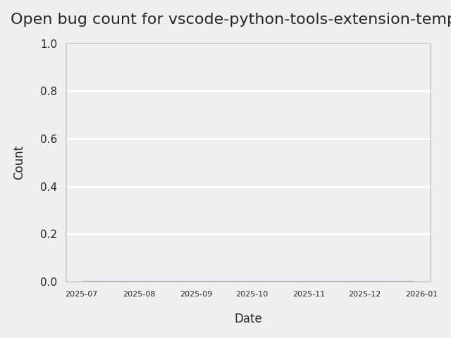
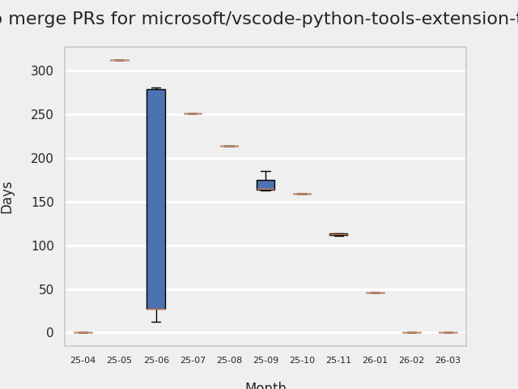
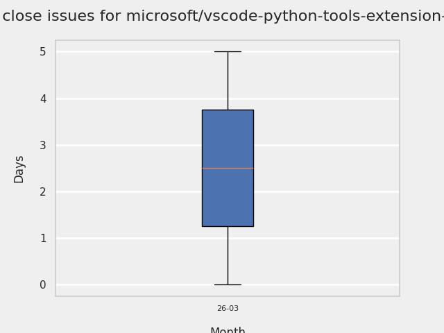
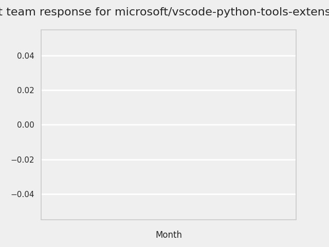
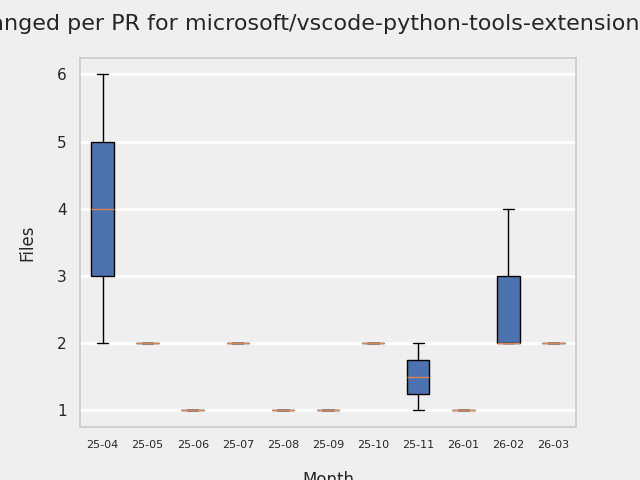
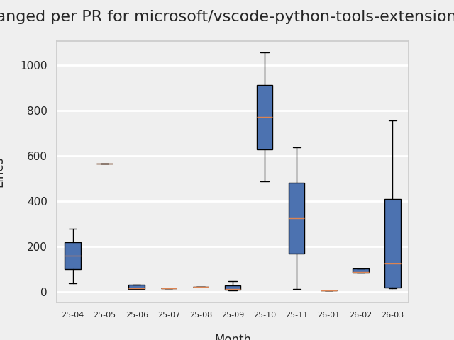

# GITHUB ISSUES REPORT FOR microsoft/vscode-python-tools-extension-template

Generated on 2025-11-09 using: stale=30, all=True

* marks items that are new to report in past 1 day(s)

---

## FOR ISSUES THAT ARE NOT MARKED AS BUGS:

### Issues in vscode-python-tools-extension-template that have no external responses since team response in 30+ days:

| Days Ago | Issue | Title |
| --- | --- | --- |
 |  TM:494  |[209](https://github.com/microsoft/vscode-python-tools-extension-template/issues/209 "Numpy error when using bundled libs from different python version") | Numpy error when using bundled libs from different python version |

## MOST FREQUENTLY CHANGED FILES (by # of PRs):

