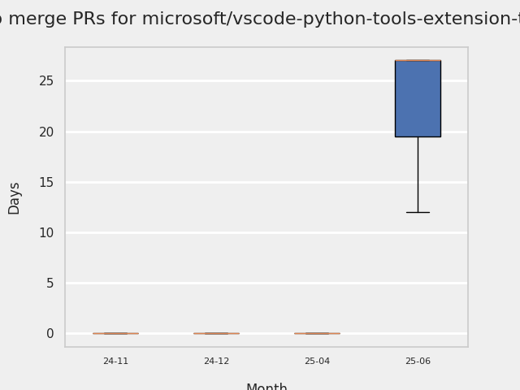
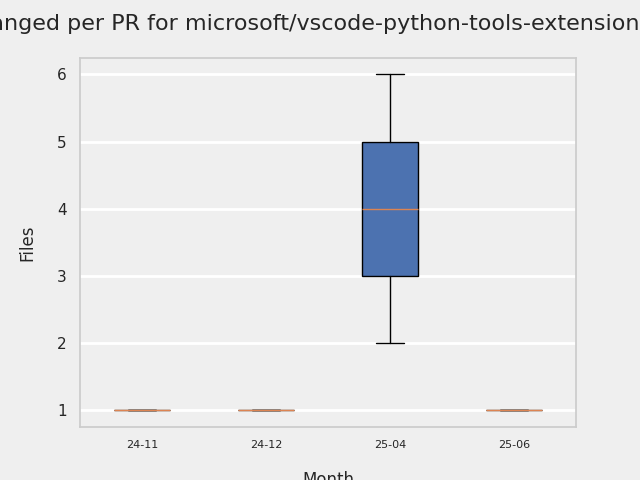
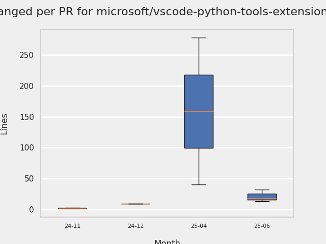
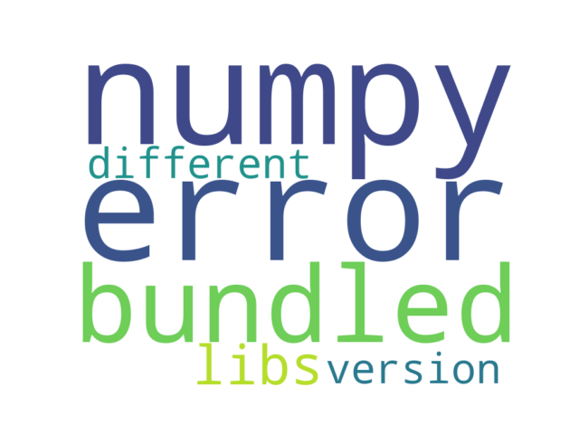

# GITHUB ISSUES REPORT FOR microsoft/vscode-python-tools-extension-template

Generated on 2026-01-11 using: stale=30, all=True

* marks items that are new to report in past 7 day(s)

---

## FOR ISSUES THAT ARE NOT MARKED AS BUGS:

### Issues in vscode-python-tools-extension-template that have no external responses since team response in 30+ days:

| Days Ago | Issue | Title |
| --- | --- | --- |
 |  TM:557  |[209](https://github.com/microsoft/vscode-python-tools-extension-template/issues/209 "Numpy error when using bundled libs from different python version") | Numpy error when using bundled libs from different python version |

## PULL REQUEST ACTIVITY

### Pull Requests still open that were opened more than 7 days ago:

| | PR | Created By | Created | Days Open | Closed/Merged | Closed/Merged By | Title |
| --- | --- | --- | --- | --- | --- | --- | --- |
| \* | [#222](https://github.com/microsoft/vscode-python-tools-extension-template/pull/222) | dependabot | 2025-04-21 | 265 | - | - | pip(deps): bump packaging from 24.2 to 25.0 |
| \* | [#227](https://github.com/microsoft/vscode-python-tools-extension-template/pull/227) | dependabot | 2025-05-01 | 255 | - | - | Bump @vscode/test-electron from 2.3.8 to 2.5.2 |
| \* | [#228](https://github.com/microsoft/vscode-python-tools-extension-template/pull/228) | dependabot | 2025-06-01 | 224 | - | - | Bump @typescript-eslint/eslint-plugin from 6.17.0 to 8.33.0 |
| \* | [#232](https://github.com/microsoft/vscode-python-tools-extension-template/pull/232) | dependabot | 2025-06-03 | 222 | - | - | Bump serialize-javascript from 6.0.1 to 6.0.2 |
| \* | [#236](https://github.com/microsoft/vscode-python-tools-extension-template/pull/236) | dependabot | 2025-07-01 | 194 | - | - | Bump prettier from 3.1.1 to 3.6.2 |
| \* | [#240](https://github.com/microsoft/vscode-python-tools-extension-template/pull/240) | dependabot | 2025-08-06 | 158 | - | - | Bump tmp from 0.2.1 to 0.2.4 |
| \* | [#243](https://github.com/microsoft/vscode-python-tools-extension-template/pull/243) | dependabot | 2025-09-05 | 128 | - | - | Bump pytest from 8.4.1 to 8.4.2 in /src/test/python_tests |
| \* | [#244](https://github.com/microsoft/vscode-python-tools-extension-template/pull/244) | dependabot | 2025-09-24 | 109 | - | - | Bump brace-expansion |
| \* | [#245](https://github.com/microsoft/vscode-python-tools-extension-template/pull/245) | dependabot | 2025-09-26 | 107 | - | - | Bump tar-fs from 2.1.3 to 2.1.4 |
| \* | [#246](https://github.com/microsoft/vscode-python-tools-extension-template/pull/246) | dependabot | 2025-10-01 | 102 | - | - | Bump @typescript-eslint/parser from 6.17.0 to 8.45.0 |
| \* | [#247](https://github.com/microsoft/vscode-python-tools-extension-template/pull/247) | dependabot | 2025-10-01 | 102 | - | - | Bump webpack from 5.89.0 to 5.102.0 |
| \* | [#248](https://github.com/microsoft/vscode-python-tools-extension-template/pull/248) | dependabot | 2025-10-20 | 83 | - | - | pip(deps): bump pygls from 1.3.1 to 2.0.0 |
| \* | [#249](https://github.com/microsoft/vscode-python-tools-extension-template/pull/249) | dependabot | 2025-11-15 | 57 | - | - | Bump js-yaml from 4.1.0 to 4.1.1 |
| \* | [#250](https://github.com/microsoft/vscode-python-tools-extension-template/pull/250) | dependabot | 2025-11-16 | 55 | - | - | Bump webpack from 5.89.0 to 5.102.1 |
| \* | [#252](https://github.com/microsoft/vscode-python-tools-extension-template/pull/252) | dependabot | 2025-11-18 | 54 | - | - | Bump glob from 10.3.10 to 10.5.0 |
|   | [#253](https://github.com/microsoft/vscode-python-tools-extension-template/pull/253) | dependabot | 2025-12-30 | 12 | - | - | Bump qs from 6.10.3 to 6.14.1 |

## MOST FREQUENTLY CHANGED FILES (by # of PRs):

