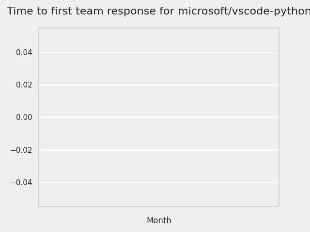

# GITHUB ISSUES REPORT FOR microsoft/vscode-python

Generated on 2024-09-09 using: stale=30, all=True

* marks items that are new to report in past 1 day(s)

## FOR ISSUES THAT ARE MARKED AS BUGS:

### Issues in vscode-python that need a response from team:

| Days Ago | Issue | Title |
| --- | --- | --- |
 |  OP:5  |[24042](https://github.com/microsoft/vscode-python/issues/24042 "Broader search for locating pixi environment ") | Broader search for locating pixi environment  |
 |  OP:10  |[24022](https://github.com/microsoft/vscode-python/issues/24022 "test loader loads irrelevant packages --> slow") | test loader loads irrelevant packages --> slow |
 |  OP:12  |[24012](https://github.com/microsoft/vscode-python/issues/24012 "Extension activation fails when opening a file from a custom fs provider") | Extension activation fails when opening a file from a custom fs provider |
 |  OP:14  |[23988](https://github.com/microsoft/vscode-python/issues/23988 "can't send to Native Python REPL with ⇧&⏎ like send to Jupyter") | can't send to Native Python REPL with ⇧&⏎ like send to Jupyter |
 |  OP:34  |[23911](https://github.com/microsoft/vscode-python/issues/23911 "Pixi") | Pixi |
 |  OP:54  |[23829](https://github.com/microsoft/vscode-python/issues/23829 "Issue with VS Code custom sequences 'OSC 633 ; ... ST' in Python shell for Ubuntu in WSL 2") | Issue with VS Code custom sequences 'OSC 633 ; ... ST' in Python shell for Ubuntu in WSL 2 |
 |  OP:103  |[23503](https://github.com/microsoft/vscode-python/issues/23503 "Native finder: progress never finishes") | Native finder: progress never finishes |
 |  OP:265  |[22675](https://github.com/microsoft/vscode-python/issues/22675 "Fix randomized shell integration decoration bug for Windows pwsh ") | Fix randomized shell integration decoration bug for Windows pwsh  |
 |  OP:286  |[22535](https://github.com/microsoft/vscode-python/issues/22535 "Shell Integration Success/Failure Bubble Colorless on Windows") | Shell Integration Success/Failure Bubble Colorless on Windows |
 |  OP:389  |[21826](https://github.com/microsoft/vscode-python/issues/21826 "Unit Tests with unittest do not show as failed if the setUpClass method raises an exception") | Unit Tests with unittest do not show as failed if the setUpClass method raises an exception |
 |  OP:437  |[21538](https://github.com/microsoft/vscode-python/issues/21538 "Stale nodes stay in test explorer") | Stale nodes stay in test explorer |
 |  OP:439  |[21517](https://github.com/microsoft/vscode-python/issues/21517 "Select environment type and python version should include titles") | Select environment type and python version should include titles |
 |  OP:494  |[21176](https://github.com/microsoft/vscode-python/issues/21176 "pytest arg parsing bug") | pytest arg parsing bug |
 |  OP:502  |[21131](https://github.com/microsoft/vscode-python/issues/21131 "Reconfiguring tests doesn't update Testing panel") | Reconfiguring tests doesn't update Testing panel |
 |  OP:526  |[21151](https://github.com/microsoft/vscode-python/issues/21151 "&quot;Run tests at cursor&quot; takes exponentially longer with more pytest tests") | "Run tests at cursor" takes exponentially longer with more pytest tests |
 |  OP:626  |[20425](https://github.com/microsoft/vscode-python/issues/20425 "Python unittest runner doesn't respect arguments to pass to unittest runner") | Python unittest runner doesn't respect arguments to pass to unittest runner |
 |  OP:649  |[20367](https://github.com/microsoft/vscode-python/issues/20367 "Issue with Untrusted to Trusted Workspaces in Jupyter Notebooks") | Issue with Untrusted to Trusted Workspaces in Jupyter Notebooks |
 |  OP:1013  |[18097](https://github.com/microsoft/vscode-python/issues/18097 "&quot;Run and Debug&quot; welcome view is misleading for virtual workspaces") | "Run and Debug" welcome view is misleading for virtual workspaces |
 |  OP:1111  |[17096](https://github.com/microsoft/vscode-python/issues/17096 "Select a test/framework tool dialog feedback") | Select a test/framework tool dialog feedback |

### Issues in vscode-python that have comments from OP after last team response:

| Days Ago | Issue | Title |
| --- | --- | --- |
 |  TM:39, OP:38  |[23893](https://github.com/microsoft/vscode-python/issues/23893 "Python writes `source .../.venv/bin/activate` to existing terminals") | Python writes `source .../.venv/bin/activate` to existing terminals |
 |  TM:55, OP:54  |[23813](https://github.com/microsoft/vscode-python/issues/23813 "Terminal does not automatically choose the environment") | Terminal does not automatically choose the environment |
 |  TM:69, OP:67  |[23725](https://github.com/microsoft/vscode-python/issues/23725 "VSCode showing the wrong Python version after devcontainer rebuild") | VSCode showing the wrong Python version after devcontainer rebuild |
 |  TM:87, OP:87  |[23607](https://github.com/microsoft/vscode-python/issues/23607 "Code will no longer run after error in terminal") | Code will no longer run after error in terminal |
 |  TM:212, OP:212  |[22884](https://github.com/microsoft/vscode-python/issues/22884 "Check on debug launch configuration's `python` field prevents container debugging") | Check on debug launch configuration's `python` field prevents container debugging |
 |  TM:249, OP:247  |[22718](https://github.com/microsoft/vscode-python/issues/22718 "code in floating window is not updated when doing an import") | code in floating window is not updated when doing an import |
 |  TM:298, OP:286  |[22457](https://github.com/microsoft/vscode-python/issues/22457 "Test classes no longer work with pytest 6.2.5") | Test classes no longer work with pytest 6.2.5 |
 |  TM:282, OP:268  |[21865](https://github.com/microsoft/vscode-python/issues/21865 "Configure test command is not registered when the extension activates") | Configure test command is not registered when the extension activates |
 |  TM:230, OP:169  |[21709](https://github.com/microsoft/vscode-python/issues/21709 "Python Debugger doesn't work on Windows if you don't have local admin privs") | Python Debugger doesn't work on Windows if you don't have local admin privs |
 |  TM:440, OP:439  |[21488](https://github.com/microsoft/vscode-python/issues/21488 "Incorrect Conda Environment Name Displayed in Status Bar") | Incorrect Conda Environment Name Displayed in Status Bar |
 |  TM:612, OP:165  |[20007](https://github.com/microsoft/vscode-python/issues/20007 "Bug on Debug testing restart") | Bug on Debug testing restart |
 |  TM:633, OP:633  |[19933](https://github.com/microsoft/vscode-python/issues/19933 "Conda install prompt missing reload step ") | Conda install prompt missing reload step  |
 |  TM:781, OP:109  |[19499](https://github.com/microsoft/vscode-python/issues/19499 "VSCode运行Python程序提示：ModuleNotFoundError，VSCode未找到导入的自定义的模块，只能手动向sys.path中把项目路径添加，但十分麻烦；Pycharm运行时会自动把项目经路添加至sys.path，开发者无需这般麻烦操作") | VSCode运行Python程序提示：ModuleNotFoundError，VSCode未找到导入的自定义的模块，只能手动向sys.path中把项目路径添加，但十分麻烦；Pycharm运行时会自动把项目经路添加至sys.path，开发者无需这般麻烦操作 |
 |  TM:894, OP:894  |[18778](https://github.com/microsoft/vscode-python/issues/18778 "Read test debug configuration from settings not just launch.json") | Read test debug configuration from settings not just launch.json |
 |  TM:1056, OP:996  |[17777](https://github.com/microsoft/vscode-python/issues/17777 "Jedi LS: Cannot disable language server linting") | Jedi LS: Cannot disable language server linting |
 |  TM:1068, OP:1004  |[17644](https://github.com/microsoft/vscode-python/issues/17644 "[BUG] Debugging with purpose ignored in user/workspace settings.") | [BUG] Debugging with purpose ignored in user/workspace settings. |
 |  TM:1111, OP:1111  |[17100](https://github.com/microsoft/vscode-python/issues/17100 "Error discovering pytest too aggressive") | Error discovering pytest too aggressive |
 |  TM:1371, OP:1371  |[14820](https://github.com/microsoft/vscode-python/issues/14820 "Debug adapter doesn't send pathMappings to local container") | Debug adapter doesn't send pathMappings to local container |

### Issues in vscode-python that have comments from 3rd party after last team response:

| Days Ago | Issue | Title |
| --- | --- | --- |
 |  P:5,  |[24041](https://github.com/microsoft/vscode-python/issues/24041 "VS Code Insiders don't run the cell with shift+Enter in a .py file with #%% cell separators") | VS Code Insiders don't run the cell with shift+Enter in a .py file with #%% cell separators |
 |  P:8,  |[23833](https://github.com/microsoft/vscode-python/issues/23833 "Python interpreter settings ignored if VS Code is launched from an activated environment") | Python interpreter settings ignored if VS Code is launched from an activated environment |
 |  P:2,  |[23037](https://github.com/microsoft/vscode-python/issues/23037 "Activation issue: activation incorrectly using cmd not bat") | Activation issue: activation incorrectly using cmd not bat |
 |  P:193,  |[22045](https://github.com/microsoft/vscode-python/issues/22045 "Add a command to restart the language server") | Add a command to restart the language server |
 |  P:310,  |[21485](https://github.com/microsoft/vscode-python/issues/21485 "Slow &quot;Getting code actions from ...&quot; revisited") | Slow "Getting code actions from ..." revisited |
 |  P:427,  |[21334](https://github.com/microsoft/vscode-python/issues/21334 "Is &quot;create environment&quot; the right action on a missing dependency") | Is "create environment" the right action on a missing dependency |
 |  P:485,  |[18793](https://github.com/microsoft/vscode-python/issues/18793 "&quot;internalConsoleOptions&quot;: &quot;openOnSessionStart&quot; not working out of the box") | "internalConsoleOptions": "openOnSessionStart" not working out of the box |
 |  P:873,  |[18189](https://github.com/microsoft/vscode-python/issues/18189 "The link is invalid when debugging in docker. ") | The link is invalid when debugging in docker.  |
 |  P:80,  |[16231](https://github.com/microsoft/vscode-python/issues/16231 "Base pyenv versions or virtual envs created using pyenv are missing on macOS") | Base pyenv versions or virtual envs created using pyenv are missing on macOS |
 |  P:608,  |[11915](https://github.com/microsoft/vscode-python/issues/11915 "launch envFile cannot use the variable ${fileDirname}") | launch envFile cannot use the variable ${fileDirname} |
 |  P:124,  |[11736](https://github.com/microsoft/vscode-python/issues/11736 "Argument filtering for pytest fails to handle custom arguments") | Argument filtering for pytest fails to handle custom arguments |
 |  P:1062,  |[11562](https://github.com/microsoft/vscode-python/issues/11562 "Unable to debug tests when using zsh") | Unable to debug tests when using zsh |
 |  P:227,  |[10722](https://github.com/microsoft/vscode-python/issues/10722 "Debugging test in VS Code does not work") | Debugging test in VS Code does not work |
 |  P:423,  |[8945](https://github.com/microsoft/vscode-python/issues/8945 "Run Selected Text in Active Terminal gives IndentationError with IPython") | Run Selected Text in Active Terminal gives IndentationError with IPython |
 |  P:154,  |[7283](https://github.com/microsoft/vscode-python/issues/7283 "Terminal doesn't use custom bash profile when debugging") | Terminal doesn't use custom bash profile when debugging |

### Issues in vscode-python that have no external responses since team response in 30+ days:

| Days Ago | Issue | Title |
| --- | --- | --- |
 |  TM:44  |[23865](https://github.com/microsoft/vscode-python/issues/23865 "Setting python.terminal.activateEnvironment: true results in loading env variables from the .env file") | Setting python.terminal.activateEnvironment: true results in loading env variables from the .env file |
 |  TM:47  |[23858](https://github.com/microsoft/vscode-python/issues/23858 "Creating new venv, recommended tag") | Creating new venv, recommended tag |
 |  TM:46  |[23837](https://github.com/microsoft/vscode-python/issues/23837 "Unsolved #11638") | Unsolved #11638 |
 |  TM:61  |[23710](https://github.com/microsoft/vscode-python/issues/23710 "Switch logging for pixi search from error to warning") | Switch logging for pixi search from error to warning |
 |  TM:103  |[23504](https://github.com/microsoft/vscode-python/issues/23504 "Broken/Removed virtual environment can not be cleared") | Broken/Removed virtual environment can not be cleared |
 |  TM:88  |[23529](https://github.com/microsoft/vscode-python/issues/23529 "Re-use terminal after re-starting VS Code") | Re-use terminal after re-starting VS Code |
 |  TM:137  |[23261](https://github.com/microsoft/vscode-python/issues/23261 "Select interpreter via file dialog does not properly load virtual env") | Select interpreter via file dialog does not properly load virtual env |
 |  TM:144  |[23216](https://github.com/microsoft/vscode-python/issues/23216 "Python extension can't show the list of poetry venv in a special situation") | Python extension can't show the list of poetry venv in a special situation |
 |  TM:123  |[23162](https://github.com/microsoft/vscode-python/issues/23162 "VS Code can't find Homebrew-installed Conda") | VS Code can't find Homebrew-installed Conda |
 |  TM:215  |[22865](https://github.com/microsoft/vscode-python/issues/22865 "Jupyter notebook extension on remote server does not work after VScode downgrade.") | Jupyter notebook extension on remote server does not work after VScode downgrade. |
 |  TM:269  |[22576](https://github.com/microsoft/vscode-python/issues/22576 "&quot;Restart debugging&quot; button doesn't work when debugging tests") | "Restart debugging" button doesn't work when debugging tests |
 |  TM:307  |[22415](https://github.com/microsoft/vscode-python/issues/22415 "Open new &quot;Python&quot; when executing using different Python environment") | Open new "Python" when executing using different Python environment |
 |  TM:327  |[22179](https://github.com/microsoft/vscode-python/issues/22179 "Save before run after re-load does not save before executing") | Save before run after re-load does not save before executing |
 |  TM:366  |[21776](https://github.com/microsoft/vscode-python/issues/21776 "Run Selection/Line in Terminal again fails when running from an Untitled file") | Run Selection/Line in Terminal again fails when running from an Untitled file |
 |  TM:445  |[21447](https://github.com/microsoft/vscode-python/issues/21447 "Unexpectedly overlapping import suggestions in multi-root workspace using Jedi") | Unexpectedly overlapping import suggestions in multi-root workspace using Jedi |
 |  TM:416  |[21649](https://github.com/microsoft/vscode-python/issues/21649 "Strings autocompleted as paths") | Strings autocompleted as paths |
 |  TM:915  |[18652](https://github.com/microsoft/vscode-python/issues/18652 "Debug flow") | Debug flow |
 |  TM:1264  |[14950](https://github.com/microsoft/vscode-python/issues/14950 "Variable substitution not working in environment variable definitions file when debugging") | Variable substitution not working in environment variable definitions file when debugging |
 |  TM:1418  |[13961](https://github.com/microsoft/vscode-python/issues/13961 "Exclude *.map files from shipped extension") | Exclude *.map files from shipped extension |
 |  TM:1476  |[13575](https://github.com/microsoft/vscode-python/issues/13575 "&quot;Select Interpreter&quot; can't correct merge 8.3 format python path on Windows") | "Select Interpreter" can't correct merge 8.3 format python path on Windows |

---

## FOR ISSUES THAT ARE NOT MARKED AS BUGS:

### Issues in vscode-python that need a response from team:

| Days Ago | Issue | Title |
| --- | --- | --- |
 | \* OP:1  |[24071](https://github.com/microsoft/vscode-python/issues/24071 "Python environments not detected/found in devcontainer on WSL 2")  |Python environments not detected/found in devcontainer on WSL 2 |
 |  OP:2  |[24069](https://github.com/microsoft/vscode-python/issues/24069 "Indentation Errors in VS Code When Running Old Python Functions with Docstrings/Comments Using Shift + Enter") | Indentation Errors in VS Code When Running Old Python Functions with Docstrings/Comments Using Shift + Enter |
 |  OP:2  |[24064](https://github.com/microsoft/vscode-python/issues/24064 "Regression in sendToRepl - incorrectly passes selected text to repl") | Regression in sendToRepl - incorrectly passes selected text to repl |
 |  OP:5  |[24044](https://github.com/microsoft/vscode-python/issues/24044 "pipe connection error when using pytest-django and pytest-xdist") | pipe connection error when using pytest-django and pytest-xdist |
 |  OP:5  |[24034](https://github.com/microsoft/vscode-python/issues/24034 "Better documentation about .env file") | Better documentation about .env file |
 |  OP:8  |[24031](https://github.com/microsoft/vscode-python/issues/24031 "Insert into Python REPL from Copilot chat panel") | Insert into Python REPL from Copilot chat panel |
 |  OP:11  |[24021](https://github.com/microsoft/vscode-python/issues/24021 "REPL: support window reload") | REPL: support window reload |
 |  OP:11  |[24017](https://github.com/microsoft/vscode-python/issues/24017 "Error getting response from REPL server: Connection is closed") | Error getting response from REPL server: Connection is closed |
 |  OP:12  |[24013](https://github.com/microsoft/vscode-python/issues/24013 "Error: Extension 'ms-python.python' CANNOT use API proposal: terminalDataWriteEvent.") | Error: Extension 'ms-python.python' CANNOT use API proposal: terminalDataWriteEvent. |
 |  OP:12  |[24011](https://github.com/microsoft/vscode-python/issues/24011 "Include cwd in repl editor tooltip in multi root cases") | Include cwd in repl editor tooltip in multi root cases |
 |  OP:12  |[24010](https://github.com/microsoft/vscode-python/issues/24010 "`Start native repl` always opens repl to side even if there is nothing open") | `Start native repl` always opens repl to side even if there is nothing open |
 |  OP:12  |[24009](https://github.com/microsoft/vscode-python/issues/24009 "Cwd choice for repl in multi root workspaces locks in choice") | Cwd choice for repl in multi root workspaces locks in choice |
 |  OP:12  |[24008](https://github.com/microsoft/vscode-python/issues/24008 "Canceling cwd selector for repl in multi root workspaces results in no cwd") | Canceling cwd selector for repl in multi root workspaces results in no cwd |
 |  OP:12  |[24007](https://github.com/microsoft/vscode-python/issues/24007 "Repl cwd doesn't change when extending to multi root workspace") | Repl cwd doesn't change when extending to multi root workspace |
 |  OP:12  |[24005](https://github.com/microsoft/vscode-python/issues/24005 "Unexpected output for cwd in repl on windows when no workspace open") | Unexpected output for cwd in repl on windows when no workspace open |
 |  OP:12  |[24003](https://github.com/microsoft/vscode-python/issues/24003 "Python repl not printing output of last statement") | Python repl not printing output of last statement |
 |  OP:12  |[24000](https://github.com/microsoft/vscode-python/issues/24000 "directory of repl when in empty workspace") | directory of repl when in empty workspace |
 |  OP:12  |[23999](https://github.com/microsoft/vscode-python/issues/23999 "clicking on the provided links shows an error") | clicking on the provided links shows an error |
 |  OP:14  |[23990](https://github.com/microsoft/vscode-python/issues/23990 "Interpreter selection: virtualenvs from `python.venvFolders` are missing") | Interpreter selection: virtualenvs from `python.venvFolders` are missing |
 |  OP:20  |[23972](https://github.com/microsoft/vscode-python/issues/23972 "Fix error logged during CI run") | Fix error logged during CI run |
 |  OP:20  |[23971](https://github.com/microsoft/vscode-python/issues/23971 "Switching Kernel/Interpreter in Python Native REPL dropdown forces use of IPyKernel.") | Switching Kernel/Interpreter in Python Native REPL dropdown forces use of IPyKernel. |
 |  OP:21  |[23966](https://github.com/microsoft/vscode-python/issues/23966 "Poetry flag is missing in the interpreter's name") | Poetry flag is missing in the interpreter's name |
 |  OP:22  |[23964](https://github.com/microsoft/vscode-python/issues/23964 "Error when running command &quot;Python: Report Issue&quot;: cannot read properties of undefined (reading 'localeCompare')") | Error when running command "Python: Report Issue": cannot read properties of undefined (reading 'localeCompare') |
 |  OP:23  |[23961](https://github.com/microsoft/vscode-python/issues/23961 "Support user's test runner when executing Django unit tests") | Support user's test runner when executing Django unit tests |
 |  OP:23  |[23956](https://github.com/microsoft/vscode-python/issues/23956 "Python extension is failing to load") | Python extension is failing to load |
 |  OP:23  |[23954](https://github.com/microsoft/vscode-python/issues/23954 "Anaconda environments listed as 'base'") | Anaconda environments listed as 'base' |
 |  OP:25  |[23949](https://github.com/microsoft/vscode-python/issues/23949 "Output streaming for Django") | Output streaming for Django |
 |  OP:25  |[23948](https://github.com/microsoft/vscode-python/issues/23948 "VSCode Pytest fails when `python.test.cwd` is set.") | VSCode Pytest fails when `python.test.cwd` is set. |
 |  OP:25  |[23947](https://github.com/microsoft/vscode-python/issues/23947 "Activate Environment activates even in REPLs from other languages") | Activate Environment activates even in REPLs from other languages |
 |  OP:25  |[23945](https://github.com/microsoft/vscode-python/issues/23945 "Handling of symlinks in pytest discovery") | Handling of symlinks in pytest discovery |
 |  OP:30  |[23933](https://github.com/microsoft/vscode-python/issues/23933 "Test explorer doesn't show test when addopts have --ruff or --mypy") | Test explorer doesn't show test when addopts have --ruff or --mypy |
 |  OP:31  |[23930](https://github.com/microsoft/vscode-python/issues/23930 "Consider adding PYTHONSTARTUP with shell integration to environment variable collection") | Consider adding PYTHONSTARTUP with shell integration to environment variable collection |
 |  OP:31  |[23929](https://github.com/microsoft/vscode-python/issues/23929 "Use executeCommand instead of sendText to activate Start Terminal REPL") | Use executeCommand instead of sendText to activate Start Terminal REPL |
 |  OP:32  |[23920](https://github.com/microsoft/vscode-python/issues/23920 "Pytest (and often other things) loaded with wrong PYTHONPATH ") | Pytest (and often other things) loaded with wrong PYTHONPATH  |
 |  OP:34  |[23913](https://github.com/microsoft/vscode-python/issues/23913 "Cannot restart unit test") | Cannot restart unit test |
 |  OP:34  |[23907](https://github.com/microsoft/vscode-python/issues/23907 "Custom config for testing and debug v2 design ") | Custom config for testing and debug v2 design  |
 |  OP:34  |[23906](https://github.com/microsoft/vscode-python/issues/23906 "Remote extension host terminated unexpectedly 3 times within the last 5 minutes") | Remote extension host terminated unexpectedly 3 times within the last 5 minutes |
 |  OP:37  |[23928](https://github.com/microsoft/vscode-python/issues/23928 "VS Code repeatedly reports ComSpec environment variable error despite correct configuration") | VS Code repeatedly reports ComSpec environment variable error despite correct configuration |
 |  OP:40  |[23889](https://github.com/microsoft/vscode-python/issues/23889 "Python getting started flow doesn't really help install python") | Python getting started flow doesn't really help install python |
 |  OP:41  |[23883](https://github.com/microsoft/vscode-python/issues/23883 "Multiple envfiles from launch.json") | Multiple envfiles from launch.json |
 |  OP:44  |[23874](https://github.com/microsoft/vscode-python/issues/23874 "Add &quot;run current file as module&quot; in addition to &quot;run current file&quot;") | Add "run current file as module" in addition to "run current file" |
 |  OP:45  |[23868](https://github.com/microsoft/vscode-python/issues/23868 "Test Tree was not builded") | Test Tree was not builded |
 |  OP:47  |[23859](https://github.com/microsoft/vscode-python/issues/23859 "Warning against old python versions") | Warning against old python versions |
 |  OP:48  |[23849](https://github.com/microsoft/vscode-python/issues/23849 "pytest discovery 30x longer for VS Code than in a regular terminal") | pytest discovery 30x longer for VS Code than in a regular terminal |
 |  OP:50  |[23843](https://github.com/microsoft/vscode-python/issues/23843 "Make python.execInREPL keep focus on editor") | Make python.execInREPL keep focus on editor |
 |  OP:53  |[23828](https://github.com/microsoft/vscode-python/issues/23828 "Getting &quot;pytest test discovery error for workspace&quot; when having multiple projects in workspace") | Getting "pytest test discovery error for workspace" when having multiple projects in workspace |
 |  OP:59  |[23793](https://github.com/microsoft/vscode-python/issues/23793 "conda not found despite specification of conda path.") | conda not found despite specification of conda path. |
 |  OP:61  |[23777](https://github.com/microsoft/vscode-python/issues/23777 "Engineering: Custom Configs for Testing") | Engineering: Custom Configs for Testing |
 |  OP:61  |[23774](https://github.com/microsoft/vscode-python/issues/23774 "Test collection fails with unknown hook pytest_xdist_auto_run_workers") | Test collection fails with unknown hook pytest_xdist_auto_run_workers |
 |  OP:67  |[23738](https://github.com/microsoft/vscode-python/issues/23738 "Test shell integration proposed API ") | Test shell integration proposed API  |
 |  OP:67  |[23733](https://github.com/microsoft/vscode-python/issues/23733 "`when` expression for command Python: Run Selection/Line in Python REPL contains `config.python.REPL.sendToNativeREPL` which should not be there") | `when` expression for command Python: Run Selection/Line in Python REPL contains `config.python.REPL.sendToNativeREPL` which should not be there |
 |  OP:72  |[23720](https://github.com/microsoft/vscode-python/issues/23720 "ModuleNotFoundError: No module named xxx when using unittest") | ModuleNotFoundError: No module named xxx when using unittest |
 |  OP:73  |[23717](https://github.com/microsoft/vscode-python/issues/23717 "Add an AI tutorial to our docs") | Add an AI tutorial to our docs |
 |  OP:75  |[23699](https://github.com/microsoft/vscode-python/issues/23699 "highlighting differs in repl vs actual file") | highlighting differs in repl vs actual file |
 |  OP:75  |[23694](https://github.com/microsoft/vscode-python/issues/23694 "Python vsix can be smaller ") | Python vsix can be smaller  |
 |  OP:75  |[23709](https://github.com/microsoft/vscode-python/issues/23709 " Pending response rejected since connection got disposed") |  Pending response rejected since connection got disposed |
 |  OP:75  |[23691](https://github.com/microsoft/vscode-python/issues/23691 "Test-Step: &quot;Open a new terminal&quot;") | Test-Step: "Open a new terminal" |
 |  OP:75  |[23690](https://github.com/microsoft/vscode-python/issues/23690 "Test-Step: &quot;The file is successfully run and prints the session info:&quot;") | Test-Step: "The file is successfully run and prints the session info:" |
 |  OP:75  |[23689](https://github.com/microsoft/vscode-python/issues/23689 "Test-Step: &quot;Verify that a default interpreter has been selected that points to python interpreter in the .pixi\envs directory&quot;") | Test-Step: "Verify that a default interpreter has been selected that points to python interpreter in the .pixi\envs directory" |
 |  OP:75  |[23688](https://github.com/microsoft/vscode-python/issues/23688 "Should have a way to trigger smart send without moving focus") | Should have a way to trigger smart send without moving focus |
 |  OP:76  |[23666](https://github.com/microsoft/vscode-python/issues/23666 "Create virtual environment using astral-sh/uv") | Create virtual environment using astral-sh/uv |
 |  OP:77  |[23656](https://github.com/microsoft/vscode-python/issues/23656 "REPL doesn’t work when the python file is in nested folder") | REPL doesn’t work when the python file is in nested folder |
 |  OP:77  |[23655](https://github.com/microsoft/vscode-python/issues/23655 "miniforge environments can not be detected") | miniforge environments can not be detected |
 |  OP:83  |[23629](https://github.com/microsoft/vscode-python/issues/23629 "Support for PDM's .pdm-python file") | Support for PDM's .pdm-python file |
 |  OP:86  |[23619](https://github.com/microsoft/vscode-python/issues/23619 "Test Explorer fails to find results of tests marked with `xdist_group`") | Test Explorer fails to find results of tests marked with `xdist_group` |
 |  OP:88  |[23604](https://github.com/microsoft/vscode-python/issues/23604 "Terminal environment variables loaded by extension are corrupted") | Terminal environment variables loaded by extension are corrupted |
 |  OP:89  |[23588](https://github.com/microsoft/vscode-python/issues/23588 "Python extension always chooses specific Poetry environment instead of pyenv default") | Python extension always chooses specific Poetry environment instead of pyenv default |
 |  OP:91  |[23582](https://github.com/microsoft/vscode-python/issues/23582 "Search through history") | Search through history |
 |  OP:92  |[23579](https://github.com/microsoft/vscode-python/issues/23579 "Can't jump to source via CTRL + LMB from TEST RESULT OUTPUT") | Can't jump to source via CTRL + LMB from TEST RESULT OUTPUT |
 |  OP:92  |[23578](https://github.com/microsoft/vscode-python/issues/23578 "Test Results Output show only fixtures in test tree") | Test Results Output show only fixtures in test tree |
 |  OP:93  |[23575](https://github.com/microsoft/vscode-python/issues/23575 "Make auto-loading `.env` files optional with a setting to turn it off") | Make auto-loading `.env` files optional with a setting to turn it off |
 |  OP:94  |[23570](https://github.com/microsoft/vscode-python/issues/23570 "Native REPL should allow for environment configuration") | Native REPL should allow for environment configuration |
 |  OP:100  |[23538](https://github.com/microsoft/vscode-python/issues/23538 "Update tests for testController.ts") | Update tests for testController.ts |
 |  OP:102  |[23523](https://github.com/microsoft/vscode-python/issues/23523 "Support interrupt for Python REPL-Windows") | Support interrupt for Python REPL-Windows |
 |  OP:103  |[23507](https://github.com/microsoft/vscode-python/issues/23507 "Dragging and dropping cells in Python REPL does not work.") | Dragging and dropping cells in Python REPL does not work. |
 |  OP:108  |[23469](https://github.com/microsoft/vscode-python/issues/23469 "F8 does not result in line being run") | F8 does not result in line being run |
 |  OP:109  |[23466](https://github.com/microsoft/vscode-python/issues/23466 "Decoding unicode string fails while running unit tests.") | Decoding unicode string fails while running unit tests. |
 |  OP:114  |[23448](https://github.com/microsoft/vscode-python/issues/23448 "Multi-root workspace: Python resolves imports only from venv of first root-folder") | Multi-root workspace: Python resolves imports only from venv of first root-folder |
 |  OP:123  |[23382](https://github.com/microsoft/vscode-python/issues/23382 "Gitbash terminal not opening to workspace folder.") | Gitbash terminal not opening to workspace folder. |
 |  OP:124  |[23385](https://github.com/microsoft/vscode-python/issues/23385 "Success/Fail Test Checkmark Reference wrong after Command-Z is used.") | Success/Fail Test Checkmark Reference wrong after Command-Z is used. |
 |  OP:125  |[23351](https://github.com/microsoft/vscode-python/issues/23351 "Pytest: Display path different from real path") | Pytest: Display path different from real path |
 |  OP:125  |[23350](https://github.com/microsoft/vscode-python/issues/23350 "Problems with new setting to remember Python interpreter for project") | Problems with new setting to remember Python interpreter for project |
 |  OP:129  |[23320](https://github.com/microsoft/vscode-python/issues/23320 "Refactor Code for Terminal Environment Variable Experiment") | Refactor Code for Terminal Environment Variable Experiment |
 |  OP:131  |[23308](https://github.com/microsoft/vscode-python/issues/23308 "Suggest installing Pyright if there are issues with Pylance") | Suggest installing Pyright if there are issues with Pylance |
 |  OP:136  |[23294](https://github.com/microsoft/vscode-python/issues/23294 "Enhancing Debugging Experience: Adding Docstring and Type Hint Support to Debug Console") | Enhancing Debugging Experience: Adding Docstring and Type Hint Support to Debug Console |
 |  OP:141  |[23268](https://github.com/microsoft/vscode-python/issues/23268 "Error occurs with &quot;Python: Report Issue...&quot; if certain extension is loaded") | Error occurs with "Python: Report Issue..." if certain extension is loaded |
 |  OP:150  |[23227](https://github.com/microsoft/vscode-python/issues/23227 "pythonTerminalEnvVarActivation shadows pyenv PATH") | pythonTerminalEnvVarActivation shadows pyenv PATH |
 |  OP:157  |[23181](https://github.com/microsoft/vscode-python/issues/23181 "Python does not properly/consistently contribute to Powershell environment") | Python does not properly/consistently contribute to Powershell environment |
 |  OP:160  |[23154](https://github.com/microsoft/vscode-python/issues/23154 "Investigate template repos for various types of Python projects ") | Investigate template repos for various types of Python projects  |
 |  OP:166  |[23134](https://github.com/microsoft/vscode-python/issues/23134 "Consider contributing a terminal profile for the shell-integration powered Python REPL command") | Consider contributing a terminal profile for the shell-integration powered Python REPL command |
 |  OP:177  |[23079](https://github.com/microsoft/vscode-python/issues/23079 "Shift-enter should not move cursor to end of line") | Shift-enter should not move cursor to end of line |
 |  OP:179  |[23069](https://github.com/microsoft/vscode-python/issues/23069 "Inherited tests show run buttons in child test class") | Inherited tests show run buttons in child test class |
 |  OP:180  |[23053](https://github.com/microsoft/vscode-python/issues/23053 "Run pytest in debug mode 'Debug Stopped' error message, check launch.json") | Run pytest in debug mode 'Debug Stopped' error message, check launch.json |
 |  OP:192  |[23003](https://github.com/microsoft/vscode-python/issues/23003 "[launch.json] Incorrect default value for &quot;args&quot; of configuration &quot;Python Debugger: Current File with Arguments&quot;") | [launch.json] Incorrect default value for "args" of configuration "Python Debugger: Current File with Arguments" |
 |  OP:201  |[22945](https://github.com/microsoft/vscode-python/issues/22945 "Python line is sent before REPL is opened") | Python line is sent before REPL is opened |
 |  OP:201  |[22943](https://github.com/microsoft/vscode-python/issues/22943 "Showing &quot;quit()&quot; in shell history for session") | Showing "quit()" in shell history for session |
 |  OP:201  |[22940](https://github.com/microsoft/vscode-python/issues/22940 "Python unittest error - port listening while ssh'd to server") | Python unittest error - port listening while ssh'd to server |
 |  OP:201  |[22937](https://github.com/microsoft/vscode-python/issues/22937 "Remove the intellisense of &quot;type&quot;:&quot;python&quot; in launch.json") | Remove the intellisense of "type":"python" in launch.json |
 |  OP:206  |[22919](https://github.com/microsoft/vscode-python/issues/22919 "venv isolation broken when debugging") | venv isolation broken when debugging |
 |  OP:215  |[22866](https://github.com/microsoft/vscode-python/issues/22866 "Cursor rendering issue in Python Interpreter started with latest VS code version, 1.86.0") | Cursor rendering issue in Python Interpreter started with latest VS code version, 1.86.0 |
 |  OP:220  |[22827](https://github.com/microsoft/vscode-python/issues/22827 "Design proposal for test coverage") | Design proposal for test coverage |
 |  OP:222  |[22812](https://github.com/microsoft/vscode-python/issues/22812 "No visual indication if pytest `teardown` fails") | No visual indication if pytest `teardown` fails |
 |  OP:223  |[22800](https://github.com/microsoft/vscode-python/issues/22800 "Create GitHub Action to check PyPI and open issue") | Create GitHub Action to check PyPI and open issue |
 |  OP:228  |[22782](https://github.com/microsoft/vscode-python/issues/22782 "new pytests cannot be triggered or queued while previous ones are running") | new pytests cannot be triggered or queued while previous ones are running |
 |  OP:257  |[22699](https://github.com/microsoft/vscode-python/issues/22699 "Is hot reload now supported when debugging？") | Is hot reload now supported when debugging？ |
 |  OP:265  |[22674](https://github.com/microsoft/vscode-python/issues/22674 "Investigate a VS Code-native REPL experience") | Investigate a VS Code-native REPL experience |
 |  OP:265  |[22671](https://github.com/microsoft/vscode-python/issues/22671 "Adopt Proposed API for Test Coverage") | Adopt Proposed API for Test Coverage |
 |  OP:278  |[22594](https://github.com/microsoft/vscode-python/issues/22594 "Enable per test output correlation for pytest") | Enable per test output correlation for pytest |
 |  OP:284  |[22573](https://github.com/microsoft/vscode-python/issues/22573 "Tests hang if subprocess spawned but not killed") | Tests hang if subprocess spawned but not killed |
 |  OP:285  |[22558](https://github.com/microsoft/vscode-python/issues/22558 "Smart send warning message feedback") | Smart send warning message feedback |
 |  OP:285  |[22556](https://github.com/microsoft/vscode-python/issues/22556 "Smart send setting id is inconsistent with other setting ids") | Smart send setting id is inconsistent with other setting ids |
 |  OP:285  |[22543](https://github.com/microsoft/vscode-python/issues/22543 "Smart send needs some UI affordance to notify the user what code was actually sent") | Smart send needs some UI affordance to notify the user what code was actually sent |
 |  OP:285  |[22542](https://github.com/microsoft/vscode-python/issues/22542 "Not convinced about the disable smart send notification flow") | Not convinced about the disable smart send notification flow |
 |  OP:285  |[22541](https://github.com/microsoft/vscode-python/issues/22541 "Do not write disableSmartSend to workspace settings") | Do not write disableSmartSend to workspace settings |
 |  OP:285  |[22540](https://github.com/microsoft/vscode-python/issues/22540 "Sending function definition to REPL after an error command is showing an error") | Sending function definition to REPL after an error command is showing an error |
 |  OP:287  |[22530](https://github.com/microsoft/vscode-python/issues/22530 "Python test debugging falls back to default launch configuration after running custom `debug-test` configuration once") | Python test debugging falls back to default launch configuration after running custom `debug-test` configuration once |
 |  OP:288  |[22526](https://github.com/microsoft/vscode-python/issues/22526 "ERROR: Test not found; the issue occurs with a test that uses random data in pytest.mark.parametrize.") | ERROR: Test not found; the issue occurs with a test that uses random data in pytest.mark.parametrize. |
 |  OP:293  |[22504](https://github.com/microsoft/vscode-python/issues/22504 "Pytest Discovery does nothing when python.testing.cwd is set") | Pytest Discovery does nothing when python.testing.cwd is set |
 |  OP:298  |[22478](https://github.com/microsoft/vscode-python/issues/22478 "Match keys in package.nls.json to setting names") | Match keys in package.nls.json to setting names |
 |  OP:311  |[22469](https://github.com/microsoft/vscode-python/issues/22469 "pythonREPLSmartSend does not fully close a code block with a dict or set at the end") | pythonREPLSmartSend does not fully close a code block with a dict or set at the end |
 |  OP:313  |[22393](https://github.com/microsoft/vscode-python/issues/22393 "Support automatically running tests on file save") | Support automatically running tests on file save |
 |  OP:320  |[22331](https://github.com/microsoft/vscode-python/issues/22331 "Flicker of the cursor going down and then right") | Flicker of the cursor going down and then right |
 |  OP:320  |[22312](https://github.com/microsoft/vscode-python/issues/22312 "The test error zone is not very useful") | The test error zone is not very useful |
 |  OP:325  |[22258](https://github.com/microsoft/vscode-python/issues/22258 "python launch configs don't work when python interpreter path has a space in it and `args` is specified as a string instead of an array") | python launch configs don't work when python interpreter path has a space in it and `args` is specified as a string instead of an array |
 |  OP:338  |[22171](https://github.com/microsoft/vscode-python/issues/22171 "Add end to end debugger tests") | Add end to end debugger tests |
 |  OP:338  |[22170](https://github.com/microsoft/vscode-python/issues/22170 "Expand testing on debugLauncher") | Expand testing on debugLauncher |
 |  OP:340  |[22154](https://github.com/microsoft/vscode-python/issues/22154 "Report errors on discovery more intuitively ") | Report errors on discovery more intuitively  |
 |  OP:342  |[22136](https://github.com/microsoft/vscode-python/issues/22136 "Update TypeScript version to 5.2.2") | Update TypeScript version to 5.2.2 |
 |  OP:355  |[22029](https://github.com/microsoft/vscode-python/issues/22029 "Add logging to socket infrastructure instead of stdout") | Add logging to socket infrastructure instead of stdout |
 |  OP:359  |[21996](https://github.com/microsoft/vscode-python/issues/21996 "Python REPL should use a snake icon") | Python REPL should use a snake icon |
 |  OP:368  |[21930](https://github.com/microsoft/vscode-python/issues/21930 "Add interpreter options") | Add interpreter options |
 |  OP:395  |[21798](https://github.com/microsoft/vscode-python/issues/21798 "Python.testing.pytestArgs does not work with option -m") | Python.testing.pytestArgs does not work with option -m |
 |  OP:402  |[21754](https://github.com/microsoft/vscode-python/issues/21754 "Update inversify to solve @inject warnings for extension repo") | Update inversify to solve @inject warnings for extension repo |
 |  OP:415  |[21673](https://github.com/microsoft/vscode-python/issues/21673 "Cannot attach to a process for debugging") | Cannot attach to a process for debugging |
 |  OP:416  |[21669](https://github.com/microsoft/vscode-python/issues/21669 "Python steals focus of Debug Console when debugging with Platformio") | Python steals focus of Debug Console when debugging with Platformio |
 |  OP:419  |[21646](https://github.com/microsoft/vscode-python/issues/21646 "Python remote SSH debugging") | Python remote SSH debugging |
 |  OP:429  |[21584](https://github.com/microsoft/vscode-python/issues/21584 "Investigate potential uses of the WASI build of CPython") | Investigate potential uses of the WASI build of CPython |
 |  OP:431  |[21565](https://github.com/microsoft/vscode-python/issues/21565 "Running npm run test:functional is different from running functional test via debugger") | Running npm run test:functional is different from running functional test via debugger |
 |  OP:515  |[21044](https://github.com/microsoft/vscode-python/issues/21044 "unittest_discovery evaluates __init__ methods") | unittest_discovery evaluates __init__ methods |
 |  OP:702  |[19971](https://github.com/microsoft/vscode-python/issues/19971 "Adopt changes to enable test discovery before &quot;run at cursor&quot;") | Adopt changes to enable test discovery before "run at cursor" |
 |  OP:1090  |[17411](https://github.com/microsoft/vscode-python/issues/17411 "Syntax highlighting in the output of tests explorer") | Syntax highlighting in the output of tests explorer |
 |  OP:1111  |[17112](https://github.com/microsoft/vscode-python/issues/17112 "pytest assertions should generate rich diffs") | pytest assertions should generate rich diffs |
 |  OP:1111  |[17094](https://github.com/microsoft/vscode-python/issues/17094 "Test discovery flow is unusual/weird") | Test discovery flow is unusual/weird |

### Issues in vscode-python that have comments from OP after last team response:

| Days Ago | Issue | Title |
| --- | --- | --- |
 |  TM:14, OP:13  |[23989](https://github.com/microsoft/vscode-python/issues/23989 "Laggy linting") | Laggy linting |
 |  TM:31, OP:31  |[23923](https://github.com/microsoft/vscode-python/issues/23923 "Paste function on exit function in class with indentation as exist") | Paste function on exit function in class with indentation as exist |
 |  TM:39, OP:34  |[23880](https://github.com/microsoft/vscode-python/issues/23880 "default Interpreter path is not respected when i open a project") | default Interpreter path is not respected when i open a project |
 |  TM:44, OP:39  |[23878](https://github.com/microsoft/vscode-python/issues/23878 "Cannot run or debug python files: An Invalid Python interpreter is selected") | Cannot run or debug python files: An Invalid Python interpreter is selected |
 |  TM:54, OP:49  |[23820](https://github.com/microsoft/vscode-python/issues/23820 "Python extension creates too many zsh processes after update to v2024.10.0") | Python extension creates too many zsh processes after update to v2024.10.0 |
 |  TM:45, OP:13  |[23799](https://github.com/microsoft/vscode-python/issues/23799 "autoloading `.env` file format does not ignore inline comments.") | autoloading `.env` file format does not ignore inline comments. |
 |  TM:76, OP:71  |[23669](https://github.com/microsoft/vscode-python/issues/23669 "Discovering Python Interpreter blocks UI and Kernel on Remote Hosts") | Discovering Python Interpreter blocks UI and Kernel on Remote Hosts |
 |  TM:75, OP:73  |[23703](https://github.com/microsoft/vscode-python/issues/23703 "Python longstring tag vs block comment tag in Vscode ") | Python longstring tag vs block comment tag in Vscode  |
 |  TM:93, OP:8  |[23571](https://github.com/microsoft/vscode-python/issues/23571 "Starting VS Code from conda environment fails to activate that environment") | Starting VS Code from conda environment fails to activate that environment |
 |  TM:106, OP:106  |[23475](https://github.com/microsoft/vscode-python/issues/23475 "[ms-python.python-2024.4.1 python 3.8.10] Error while creating virtual environment.") | [ms-python.python-2024.4.1 python 3.8.10] Error while creating virtual environment. |
 |  TM:69, OP:54  |[23452](https://github.com/microsoft/vscode-python/issues/23452 "Extension v2024.4.0 and v2024.4.1 create indefinite &quot;Discover Python Interpreters&quot;") | Extension v2024.4.0 and v2024.4.1 create indefinite "Discover Python Interpreters" |
 |  TM:118, OP:118  |[23410](https://github.com/microsoft/vscode-python/issues/23410 "Jedi causes &quot;Do you want to terminate the active terminal session?&quot; on close") | Jedi causes "Do you want to terminate the active terminal session?" on close |
 |  TM:139, OP:131  |[23269](https://github.com/microsoft/vscode-python/issues/23269 "Unable to debug if script file path contains certain characters") | Unable to debug if script file path contains certain characters |
 |  TM:146, OP:145  |[23236](https://github.com/microsoft/vscode-python/issues/23236 "Starting in v2024.4.1, extension mangles vscode integrated terminal path") | Starting in v2024.4.1, extension mangles vscode integrated terminal path |
 |  TM:174, OP:173  |[23072](https://github.com/microsoft/vscode-python/issues/23072 "Update how the Python &quot;extension pack&quot; is published") | Update how the Python "extension pack" is published |
 |  TM:165, OP:85  |[22932](https://github.com/microsoft/vscode-python/issues/22932 "Test discovery fails when virtualenv name starts with 'python'") | Test discovery fails when virtualenv name starts with 'python' |
 |  TM:209, OP:209  |[22897](https://github.com/microsoft/vscode-python/issues/22897 "No python formatter installed - Local new setup or Github codespace with python extension + formatter installed") | No python formatter installed - Local new setup or Github codespace with python extension + formatter installed |
 |  TM:271, OP:271  |[22607](https://github.com/microsoft/vscode-python/issues/22607 "Provide a way to enable linters/formatters by directory without deactivating the extension") | Provide a way to enable linters/formatters by directory without deactivating the extension |
 |  TM:270, OP:269  |[22595](https://github.com/microsoft/vscode-python/issues/22595 "Add .code-workspace example for &quot;Mono Repo Set‐up Guide&quot; - &quot;Separate Virtual Environments&quot; scenario ") | Add .code-workspace example for "Mono Repo Set‐up Guide" - "Separate Virtual Environments" scenario  |
 |  TM:283, OP:275  |[22537](https://github.com/microsoft/vscode-python/issues/22537 "On running script, pausing to debug the program terminates silently without error whereever the program is paused but runs successfully otherwise via integrated terminal") | On running script, pausing to debug the program terminates silently without error whereever the program is paused but runs successfully otherwise via integrated terminal |
 |  TM:304, OP:303  |[22438](https://github.com/microsoft/vscode-python/issues/22438 "Relative virtualenv path being from with root (/) as prefix leading to ENOENT on all python backed tooling used by extensions (yapf, flake8, isort)") | Relative virtualenv path being from with root (/) as prefix leading to ENOENT on all python backed tooling used by extensions (yapf, flake8, isort) |
 |  TM:299, OP:299  |[22426](https://github.com/microsoft/vscode-python/issues/22426 "Allow customizing python version selection for conda ") | Allow customizing python version selection for conda  |
 |  TM:220, OP:220  |[22417](https://github.com/microsoft/vscode-python/issues/22417 "command 'python.execInTerminal' not found") | command 'python.execInTerminal' not found |
 |  TM:241, OP:219  |[22388](https://github.com/microsoft/vscode-python/issues/22388 "Switch to using unittest.main and custom runner for unittest design") | Switch to using unittest.main and custom runner for unittest design |
 |  TM:324, OP:320  |[22160](https://github.com/microsoft/vscode-python/issues/22160 "VSCode slow with extension enabled") | VSCode slow with extension enabled |
 |  TM:353, OP:348  |[22042](https://github.com/microsoft/vscode-python/issues/22042 "VS Jupyter kernel crashes in debug mode") | VS Jupyter kernel crashes in debug mode |
 |  TM:96, OP:96  |[21707](https://github.com/microsoft/vscode-python/issues/21707 "REPL Rewrite ") | REPL Rewrite  |
 |  TM:419, OP:383  |[21627](https://github.com/microsoft/vscode-python/issues/21627 "Investigate a potential opinionated package management workflow ") | Investigate a potential opinionated package management workflow  |
 |  TM:377, OP:376  |[21443](https://github.com/microsoft/vscode-python/issues/21443 "Support viewings `numpy` `.npy` and `.npz` and `pickle` `.pkl` files natively by double clicking on them") | Support viewings `numpy` `.npy` and `.npz` and `pickle` `.pkl` files natively by double clicking on them |
 |  TM:717, OP:526  |[19405](https://github.com/microsoft/vscode-python/issues/19405 "Environment created with mamba missing prefix") | Environment created with mamba missing prefix |
 |  TM:892, OP:859  |[18315](https://github.com/microsoft/vscode-python/issues/18315 "execSelectionInTerminal to run in now active terminal") | execSelectionInTerminal to run in now active terminal |
 |  TM:1670, OP:1670  |[9553](https://github.com/microsoft/vscode-python/issues/9553 "[pytest] If present, &quot;python.testing.cwd&quot; expected to change `pytest --rootdir` arg value.") | [pytest] If present, "python.testing.cwd" expected to change `pytest --rootdir` arg value. |

### Issues in vscode-python that have comments from 3rd party after last team response:

| Days Ago | Issue | Title |
| --- | --- | --- |
 | \* P:1,  |[23922](https://github.com/microsoft/vscode-python/issues/23922 "Stuck on &quot;Reactivating terminals&quot; - Failed to resolve env")  |Stuck on "Reactivating terminals" - Failed to resolve env |
 |  P:15,  |[23827](https://github.com/microsoft/vscode-python/issues/23827 "Hatch: Select interpreter list does not show hatch environments from 3.12") | Hatch: Select interpreter list does not show hatch environments from 3.12 |
 |  P:10,  |[23679](https://github.com/microsoft/vscode-python/issues/23679 "`python.linting` error, but no such settings") | `python.linting` error, but no such settings |
 |  P:5,  |[23447](https://github.com/microsoft/vscode-python/issues/23447 "Test Discovery Failing in all repos (for the Testing Panel)") | Test Discovery Failing in all repos (for the Testing Panel) |
 |  P:4,  |[23408](https://github.com/microsoft/vscode-python/issues/23408 "virtual env is ignored while testing") | virtual env is ignored while testing |
 |  P:167,  |[23126](https://github.com/microsoft/vscode-python/issues/23126 "Python extension extra data list full extension identifier") | Python extension extra data list full extension identifier |
 |  P:93,  |[23047](https://github.com/microsoft/vscode-python/issues/23047 "Custom Test Discovery Option") | Custom Test Discovery Option |
 |  P:62,  |[22630](https://github.com/microsoft/vscode-python/issues/22630 "Virtual environment is not fully activated when running tests in non-debug mode") | Virtual environment is not fully activated when running tests in non-debug mode |
 |  P:53,  |[22611](https://github.com/microsoft/vscode-python/issues/22611 "Feature request: option to re-enable traditional virtual environment activation for terminal identifier") | Feature request: option to re-enable traditional virtual environment activation for terminal identifier |
 |  P:244,  |[22139](https://github.com/microsoft/vscode-python/issues/22139 "Support fully integrated IPython terminal") | Support fully integrated IPython terminal |
 |  P:135,  |[21845](https://github.com/microsoft/vscode-python/issues/21845 "Proposal: Enable separate configs per run/discovery/debug with testing") | Proposal: Enable separate configs per run/discovery/debug with testing |
 | \* P:1,  |[20919](https://github.com/microsoft/vscode-python/issues/20919 "Add support for micromamba environments")  |Add support for micromamba environments |
 |  P:93,  |[20086](https://github.com/microsoft/vscode-python/issues/20086 "Enable Pytest Rewrite to Users") | Enable Pytest Rewrite to Users |
 |  P:635,  |[19904](https://github.com/microsoft/vscode-python/issues/19904 "Select interpreter is confusing when there're very few envs") | Select interpreter is confusing when there're very few envs |
 |  P:691,  |[19166](https://github.com/microsoft/vscode-python/issues/19166 "Support symlink Python environments ") | Support symlink Python environments  |
 |  P:472,  |[19132](https://github.com/microsoft/vscode-python/issues/19132 "Allow Environment Shims") | Allow Environment Shims |
 |  P:402,  |[19030](https://github.com/microsoft/vscode-python/issues/19030 "Restart test debugger with &quot;purpose&quot;==[&quot;debug-test&quot;] doesn't work with test-config in launch.json") | Restart test debugger with "purpose"==["debug-test"] doesn't work with test-config in launch.json |
 |  P:892,  |[15473](https://github.com/microsoft/vscode-python/issues/15473 "Respect .python-version as suggested by pyenv (and pyenv-virtualenv)") | Respect .python-version as suggested by pyenv (and pyenv-virtualenv) |
 |  P:228,  |[14518](https://github.com/microsoft/vscode-python/issues/14518 "vscode-variables only expanded in some environment vars from .env file ") | vscode-variables only expanded in some environment vars from .env file  |
 |  P:1073,  |[14495](https://github.com/microsoft/vscode-python/issues/14495 "Feature Request: Open packages in requirements.txt in browser") | Feature Request: Open packages in requirements.txt in browser |
 |  P:72,  |[12997](https://github.com/microsoft/vscode-python/issues/12997 "launch.json &quot;args&quot; don't get passed to pytest unittests") | launch.json "args" don't get passed to pytest unittests |
 |  P:163,  |[12075](https://github.com/microsoft/vscode-python/issues/12075 "Enable multiple test suites and test configurations in the Test UI") | Enable multiple test suites and test configurations in the Test UI |
 |  P:263,  |[12063](https://github.com/microsoft/vscode-python/issues/12063 "allow usage of unittest's load_tests protocol in python unit tests") | allow usage of unittest's load_tests protocol in python unit tests |
 |  P:86,  |[11932](https://github.com/microsoft/vscode-python/issues/11932 "Add &quot;Run Tests&quot; to launch.json") | Add "Run Tests" to launch.json |
 |  P:54,  |[10165](https://github.com/microsoft/vscode-python/issues/10165 "Fix environment-dependent git pre-commit hooks") | Fix environment-dependent git pre-commit hooks |
 |  P:74,  |[3828](https://github.com/microsoft/vscode-python/issues/3828 "Default Python Problem Matcher") | Default Python Problem Matcher |
 |  P:1794,  |[2997](https://github.com/microsoft/vscode-python/issues/2997 "Run Selection/Line and Run File produce error when used consecutively") | Run Selection/Line and Run File produce error when used consecutively |

### Issues in vscode-python that have no external responses since team response in 30+ days:

| Days Ago | Issue | Title |
| --- | --- | --- |
 | \* TM:30  |[23926](https://github.com/microsoft/vscode-python/issues/23926 "PET - not launching due to permissions")  |PET - not launching due to permissions |
 | \* TM:30  |[23925](https://github.com/microsoft/vscode-python/issues/23925 "Shift + def or class with double LMB = select whole function or class")  |Shift + def or class with double LMB = select whole function or class |
 |  TM:86  |[23622](https://github.com/microsoft/vscode-python/issues/23622 "The default Python interpreter failed to load when opening vscode for the first time") | The default Python interpreter failed to load when opening vscode for the first time |
 |  TM:75  |[23509](https://github.com/microsoft/vscode-python/issues/23509 "Go To Definition does not work inside python REPL") | Go To Definition does not work inside python REPL |
 |  TM:104  |[23493](https://github.com/microsoft/vscode-python/issues/23493 "VScode doesn't pick up correct python path from defaultInterpreterPath in settings.json") | VScode doesn't pick up correct python path from defaultInterpreterPath in settings.json |
 |  TM:88  |[23450](https://github.com/microsoft/vscode-python/issues/23450 "Support to copy python import path from opened file") | Support to copy python import path from opened file |
 |  TM:132  |[23305](https://github.com/microsoft/vscode-python/issues/23305 "Integrated terminal profile using tmux creates additional session") | Integrated terminal profile using tmux creates additional session |
 |  TM:158  |[23173](https://github.com/microsoft/vscode-python/issues/23173 "imports not working can't change python intepreter") | imports not working can't change python intepreter |
 |  TM:75  |[22896](https://github.com/microsoft/vscode-python/issues/22896 "Confusing test screen when working with a monorepo") | Confusing test screen when working with a monorepo |
 |  TM:223  |[22797](https://github.com/microsoft/vscode-python/issues/22797 "Add contribution points to extension API to add external support for Rye, pixi etc") | Add contribution points to extension API to add external support for Rye, pixi etc |
 |  TM:75  |[22769](https://github.com/microsoft/vscode-python/issues/22769 "Pre-launch Console Renaming in VSCode Using launch.json Configuration") | Pre-launch Console Renaming in VSCode Using launch.json Configuration |
 |  TM:355  |[22010](https://github.com/microsoft/vscode-python/issues/22010 "Make `pyproject.toml` a selectable option when creating environments") | Make `pyproject.toml` a selectable option when creating environments |
 |  TM:292  |[21998](https://github.com/microsoft/vscode-python/issues/21998 "Try avoid putting run commands into shell history") | Try avoid putting run commands into shell history |
 |  TM:304  |[21874](https://github.com/microsoft/vscode-python/issues/21874 "Show Notification when Pytest Discovery Fails") | Show Notification when Pytest Discovery Fails |
 |  TM:199  |[21705](https://github.com/microsoft/vscode-python/issues/21705 "Support pytest-describe in testing rewrite") | Support pytest-describe in testing rewrite |
 |  TM:346  |[21697](https://github.com/microsoft/vscode-python/issues/21697 "Allow disabling the &quot;Recommended&quot; tag for python interpreter selection") | Allow disabling the "Recommended" tag for python interpreter selection |
 |  TM:327  |[21372](https://github.com/microsoft/vscode-python/issues/21372 "import a library from another vscode extension") | import a library from another vscode extension |
 |  TM:318  |[21238](https://github.com/microsoft/vscode-python/issues/21238 "Add support for refreshing tests in a single project/package/module.") | Add support for refreshing tests in a single project/package/module. |
 |  TM:390  |[21256](https://github.com/microsoft/vscode-python/issues/21256 "Modify `getActiveEnvironmentPath()` API when `resource` is passed as `undefined` in a multiroot workspace") | Modify `getActiveEnvironmentPath()` API when `resource` is passed as `undefined` in a multiroot workspace |
 |  TM:370  |[20950](https://github.com/microsoft/vscode-python/issues/20950 "Rollout for terminal env var activation") | Rollout for terminal env var activation |
 |  TM:170  |[20752](https://github.com/microsoft/vscode-python/issues/20752 "Support discovering interpreters managed using `asdf-vm` which are run from workspace directory") | Support discovering interpreters managed using `asdf-vm` which are run from workspace directory |
 |  TM:535  |[20562](https://github.com/microsoft/vscode-python/issues/20562 "Support profile-specific `terminal.activateEnvInCurrentTerminal` settings") | Support profile-specific `terminal.activateEnvInCurrentTerminal` settings |
 |  TM:577  |[20350](https://github.com/microsoft/vscode-python/issues/20350 "Add filter based on pytest marks to Test Explorer") | Add filter based on pytest marks to Test Explorer |
 |  TM:648  |[20299](https://github.com/microsoft/vscode-python/issues/20299 "Python extension should not register 'python' debugger in web") | Python extension should not register 'python' debugger in web |
 |  TM:493  |[20088](https://github.com/microsoft/vscode-python/issues/20088 "Support terminal link provider to handle python error stacks") | Support terminal link provider to handle python error stacks |
 |  TM:685  |[20047](https://github.com/microsoft/vscode-python/issues/20047 "Add path of function in pytest format to the clipboard from breadcrumb") | Add path of function in pytest format to the clipboard from breadcrumb |
 |  TM:717  |[19415](https://github.com/microsoft/vscode-python/issues/19415 "Support for PyScript & Brython.") | Support for PyScript & Brython. |
 |  TM:892  |[18353](https://github.com/microsoft/vscode-python/issues/18353 "Feature request: `&quot;python.debug.settings.console&quot;`") | Feature request: `"python.debug.settings.console"` |
 |  TM:915  |[18115](https://github.com/microsoft/vscode-python/issues/18115 "Add a pip audit command/task") | Add a pip audit command/task |
 |  TM:1056  |[17776](https://github.com/microsoft/vscode-python/issues/17776 "Jedi LS: &quot;python.autoComplete.showAdvancedMembers&quot; setting ignored") | Jedi LS: "python.autoComplete.showAdvancedMembers" setting ignored |
 |  TM:271  |[17772](https://github.com/microsoft/vscode-python/issues/17772 "Improve feedback when user tries a pytest test when pytest is not installed, but is selected as the testing library") | Improve feedback when user tries a pytest test when pytest is not installed, but is selected as the testing library |
 |  TM:1291  |[15507](https://github.com/microsoft/vscode-python/issues/15507 "Set modules that the application needs") | Set modules that the application needs |
 |  TM:327  |[10645](https://github.com/microsoft/vscode-python/issues/10645 "Add Profiling (code performance analysis) capability") | Add Profiling (code performance analysis) capability |

