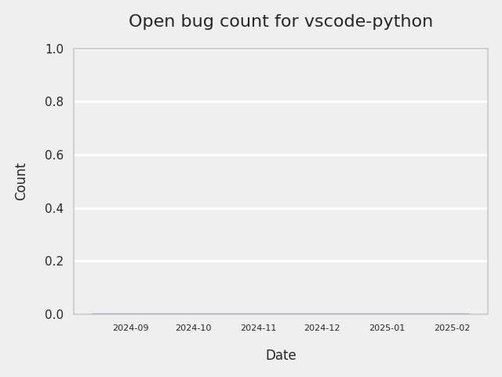
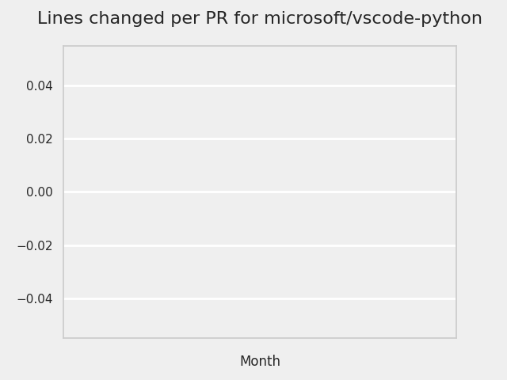
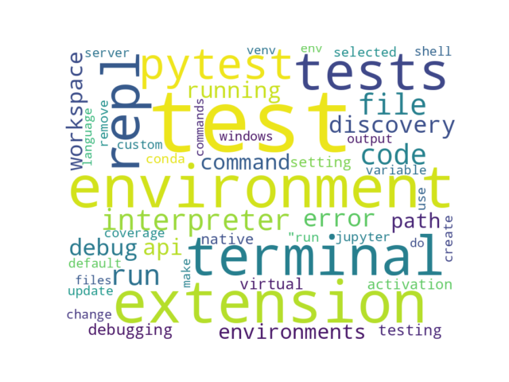

# GITHUB ISSUES REPORT FOR microsoft/vscode-python

Generated on 2024-10-14 using: stale=30, all=True

* marks items that are new to report in past 1 day(s)

## FOR ISSUES THAT ARE MARKED AS BUGS:

### Issues in vscode-python that need a response from team:

| Days Ago | Issue | Title |
| --- | --- | --- |
 |  OP:17  |[24199](https://github.com/microsoft/vscode-python/issues/24199 "Support Django Test Runs with Coverage") | Support Django Test Runs with Coverage |
 |  OP:18  |[24191](https://github.com/microsoft/vscode-python/issues/24191 "Run Recent Command does not cover multi-line Python REPL commands") | Run Recent Command does not cover multi-line Python REPL commands |
 |  OP:25  |[24126](https://github.com/microsoft/vscode-python/issues/24126 "Incorrect quoting for file names causes terminal commands to fail (in varying platform-specific ways)") | Incorrect quoting for file names causes terminal commands to fail (in varying platform-specific ways) |
 |  OP:26  |[24119](https://github.com/microsoft/vscode-python/issues/24119 "Support sandboxed environment selection for testing frameworks (pytest, uinttest)") | Support sandboxed environment selection for testing frameworks (pytest, uinttest) |
 |  OP:32  |[24097](https://github.com/microsoft/vscode-python/issues/24097 "PS1 missing parenthesis around `venv`") | PS1 missing parenthesis around `venv` |
 |  OP:32  |[24095](https://github.com/microsoft/vscode-python/issues/24095 "Extension fails to activate unnamed conda environments") | Extension fails to activate unnamed conda environments |
 |  OP:40  |[24042](https://github.com/microsoft/vscode-python/issues/24042 "Broader search for locating pixi environment ") | Broader search for locating pixi environment  |
 |  OP:46  |[24021](https://github.com/microsoft/vscode-python/issues/24021 "REPL: support window reload") | REPL: support window reload |
 |  OP:47  |[24012](https://github.com/microsoft/vscode-python/issues/24012 "Extension activation fails when opening a file from a custom fs provider") | Extension activation fails when opening a file from a custom fs provider |
 |  OP:49  |[23988](https://github.com/microsoft/vscode-python/issues/23988 "can't send to Native Python REPL with ⇧&⏎ like send to Jupyter") | can't send to Native Python REPL with ⇧&⏎ like send to Jupyter |
 |  OP:69  |[23911](https://github.com/microsoft/vscode-python/issues/23911 "Unable to discover Pixi environment") | Unable to discover Pixi environment |
 |  OP:89  |[23829](https://github.com/microsoft/vscode-python/issues/23829 "Properly differentiate Windows, Linux, and WSL in pythonrc.py script") | Properly differentiate Windows, Linux, and WSL in pythonrc.py script |
 |  OP:138  |[23503](https://github.com/microsoft/vscode-python/issues/23503 "Native finder: progress never finishes") | Native finder: progress never finishes |
 |  OP:300  |[22675](https://github.com/microsoft/vscode-python/issues/22675 "Fix randomized shell integration decoration bug for Windows pwsh ") | Fix randomized shell integration decoration bug for Windows pwsh  |
 |  OP:321  |[22535](https://github.com/microsoft/vscode-python/issues/22535 "Shell Integration Success/Failure Bubble Colorless on Windows") | Shell Integration Success/Failure Bubble Colorless on Windows |
 |  OP:424  |[21826](https://github.com/microsoft/vscode-python/issues/21826 "Unit Tests with unittest do not show as failed if the setUpClass method raises an exception") | Unit Tests with unittest do not show as failed if the setUpClass method raises an exception |
 |  OP:472  |[21538](https://github.com/microsoft/vscode-python/issues/21538 "Stale nodes stay in test explorer") | Stale nodes stay in test explorer |
 |  OP:474  |[21517](https://github.com/microsoft/vscode-python/issues/21517 "Select environment type and python version should include titles") | Select environment type and python version should include titles |
 |  OP:529  |[21176](https://github.com/microsoft/vscode-python/issues/21176 "pytest arg parsing bug") | pytest arg parsing bug |
 |  OP:537  |[21131](https://github.com/microsoft/vscode-python/issues/21131 "Reconfiguring tests doesn't update Testing panel") | Reconfiguring tests doesn't update Testing panel |
 |  OP:561  |[21151](https://github.com/microsoft/vscode-python/issues/21151 "&quot;Run tests at cursor&quot; takes exponentially longer with more pytest tests") | "Run tests at cursor" takes exponentially longer with more pytest tests |
 |  OP:661  |[20425](https://github.com/microsoft/vscode-python/issues/20425 "Python unittest runner doesn't respect arguments to pass to unittest runner") | Python unittest runner doesn't respect arguments to pass to unittest runner |
 |  OP:684  |[20367](https://github.com/microsoft/vscode-python/issues/20367 "Issue with Untrusted to Trusted Workspaces in Jupyter Notebooks") | Issue with Untrusted to Trusted Workspaces in Jupyter Notebooks |
 |  OP:1048  |[18097](https://github.com/microsoft/vscode-python/issues/18097 "&quot;Run and Debug&quot; welcome view is misleading for virtual workspaces") | "Run and Debug" welcome view is misleading for virtual workspaces |
 |  OP:1146  |[17096](https://github.com/microsoft/vscode-python/issues/17096 "Select a test/framework tool dialog feedback") | Select a test/framework tool dialog feedback |

### Issues in vscode-python that have comments from OP after last team response:

| Days Ago | Issue | Title |
| --- | --- | --- |
 |  TM:19, OP:18  |[24174](https://github.com/microsoft/vscode-python/issues/24174 "Variable in `REPL variables` view sometimes requires more than 1 run to expand") | Variable in `REPL variables` view sometimes requires more than 1 run to expand |
 |  TM:74, OP:73  |[23893](https://github.com/microsoft/vscode-python/issues/23893 "Python writes `source .../.venv/bin/activate` to existing terminals") | Python writes `source .../.venv/bin/activate` to existing terminals |
 |  TM:81, OP:32  |[23833](https://github.com/microsoft/vscode-python/issues/23833 "Python interpreter settings ignored if VS Code is launched from an activated environment") | Python interpreter settings ignored if VS Code is launched from an activated environment |
 |  TM:90, OP:89  |[23813](https://github.com/microsoft/vscode-python/issues/23813 "Terminal does not automatically choose the environment") | Terminal does not automatically choose the environment |
 |  TM:104, OP:102  |[23725](https://github.com/microsoft/vscode-python/issues/23725 "VSCode showing the wrong Python version after devcontainer rebuild") | VSCode showing the wrong Python version after devcontainer rebuild |
 |  TM:122, OP:122  |[23607](https://github.com/microsoft/vscode-python/issues/23607 "Code will no longer run after error in terminal") | Code will no longer run after error in terminal |
 |  TM:40, OP:7  |[23037](https://github.com/microsoft/vscode-python/issues/23037 "Activation issue: activation incorrectly using cmd not bat") | Activation issue: activation incorrectly using cmd not bat |
 |  TM:247, OP:247  |[22884](https://github.com/microsoft/vscode-python/issues/22884 "Check on debug launch configuration's `python` field prevents container debugging") | Check on debug launch configuration's `python` field prevents container debugging |
 |  TM:284, OP:282  |[22718](https://github.com/microsoft/vscode-python/issues/22718 "code in floating window is not updated when doing an import") | code in floating window is not updated when doing an import |
 |  TM:333, OP:321  |[22457](https://github.com/microsoft/vscode-python/issues/22457 "Test classes no longer work with pytest 6.2.5") | Test classes no longer work with pytest 6.2.5 |
 |  TM:317, OP:303  |[21865](https://github.com/microsoft/vscode-python/issues/21865 "Configure test command is not registered when the extension activates") | Configure test command is not registered when the extension activates |
 |  TM:265, OP:204  |[21709](https://github.com/microsoft/vscode-python/issues/21709 "Python Debugger doesn't work on Windows if you don't have local admin privs") | Python Debugger doesn't work on Windows if you don't have local admin privs |
 |  TM:475, OP:474  |[21488](https://github.com/microsoft/vscode-python/issues/21488 "Incorrect Conda Environment Name Displayed in Status Bar") | Incorrect Conda Environment Name Displayed in Status Bar |
 |  TM:647, OP:200  |[20007](https://github.com/microsoft/vscode-python/issues/20007 "Bug on Debug testing restart") | Bug on Debug testing restart |
 |  TM:668, OP:668  |[19933](https://github.com/microsoft/vscode-python/issues/19933 "Conda install prompt missing reload step ") | Conda install prompt missing reload step  |
 |  TM:816, OP:144  |[19499](https://github.com/microsoft/vscode-python/issues/19499 "VSCode运行Python程序提示：ModuleNotFoundError，VSCode未找到导入的自定义的模块，只能手动向sys.path中把项目路径添加，但十分麻烦；Pycharm运行时会自动把项目经路添加至sys.path，开发者无需这般麻烦操作") | VSCode运行Python程序提示：ModuleNotFoundError，VSCode未找到导入的自定义的模块，只能手动向sys.path中把项目路径添加，但十分麻烦；Pycharm运行时会自动把项目经路添加至sys.path，开发者无需这般麻烦操作 |
 |  TM:929, OP:929  |[18778](https://github.com/microsoft/vscode-python/issues/18778 "Read test debug configuration from settings not just launch.json") | Read test debug configuration from settings not just launch.json |
 |  TM:1091, OP:1031  |[17777](https://github.com/microsoft/vscode-python/issues/17777 "Jedi LS: Cannot disable language server linting") | Jedi LS: Cannot disable language server linting |
 |  TM:1103, OP:1039  |[17644](https://github.com/microsoft/vscode-python/issues/17644 "[BUG] Debugging with purpose ignored in user/workspace settings.") | [BUG] Debugging with purpose ignored in user/workspace settings. |
 |  TM:1146, OP:1146  |[17100](https://github.com/microsoft/vscode-python/issues/17100 "Error discovering pytest too aggressive") | Error discovering pytest too aggressive |
 |  TM:1406, OP:1406  |[14820](https://github.com/microsoft/vscode-python/issues/14820 "Debug adapter doesn't send pathMappings to local container") | Debug adapter doesn't send pathMappings to local container |

### Issues in vscode-python that have comments from 3rd party after last team response:

| Days Ago | Issue | Title |
| --- | --- | --- |
 |  P:11,  |[24209](https://github.com/microsoft/vscode-python/issues/24209 "Don't export .env values into the global environment") | Don't export .env values into the global environment |
 |  P:228,  |[22045](https://github.com/microsoft/vscode-python/issues/22045 "Add a command to restart the language server") | Add a command to restart the language server |
 |  P:345,  |[21485](https://github.com/microsoft/vscode-python/issues/21485 "Slow &quot;Getting code actions from ...&quot; revisited") | Slow "Getting code actions from ..." revisited |
 |  P:462,  |[21334](https://github.com/microsoft/vscode-python/issues/21334 "Is &quot;create environment&quot; the right action on a missing dependency") | Is "create environment" the right action on a missing dependency |
 |  P:520,  |[18793](https://github.com/microsoft/vscode-python/issues/18793 "&quot;internalConsoleOptions&quot;: &quot;openOnSessionStart&quot; not working out of the box") | "internalConsoleOptions": "openOnSessionStart" not working out of the box |
 |  P:908,  |[18189](https://github.com/microsoft/vscode-python/issues/18189 "The link is invalid when debugging in docker. ") | The link is invalid when debugging in docker.  |
 |  P:115,  |[16231](https://github.com/microsoft/vscode-python/issues/16231 "Base pyenv versions or virtual envs created using pyenv are missing on macOS") | Base pyenv versions or virtual envs created using pyenv are missing on macOS |
 |  P:643,  |[11915](https://github.com/microsoft/vscode-python/issues/11915 "launch envFile cannot use the variable ${fileDirname}") | launch envFile cannot use the variable ${fileDirname} |
 |  P:159,  |[11736](https://github.com/microsoft/vscode-python/issues/11736 "Argument filtering for pytest fails to handle custom arguments") | Argument filtering for pytest fails to handle custom arguments |
 |  P:1097,  |[11562](https://github.com/microsoft/vscode-python/issues/11562 "Unable to debug tests when using zsh") | Unable to debug tests when using zsh |
 |  P:262,  |[10722](https://github.com/microsoft/vscode-python/issues/10722 "Debugging test in VS Code does not work") | Debugging test in VS Code does not work |
 |  P:458,  |[8945](https://github.com/microsoft/vscode-python/issues/8945 "Run Selected Text in Active Terminal gives IndentationError with IPython") | Run Selected Text in Active Terminal gives IndentationError with IPython |
 |  P:189,  |[7283](https://github.com/microsoft/vscode-python/issues/7283 "Terminal doesn't use custom bash profile when debugging") | Terminal doesn't use custom bash profile when debugging |

### Issues in vscode-python that have no external responses since team response in 30+ days:

| Days Ago | Issue | Title |
| --- | --- | --- |
 |  TM:45  |[24023](https://github.com/microsoft/vscode-python/issues/24023 "Extension activation failed when the notebook was opened and switched to restricted mode.") | Extension activation failed when the notebook was opened and switched to restricted mode. |
 |  TM:79  |[23865](https://github.com/microsoft/vscode-python/issues/23865 "Setting python.terminal.activateEnvironment: true results in loading env variables from the .env file") | Setting python.terminal.activateEnvironment: true results in loading env variables from the .env file |
 |  TM:82  |[23858](https://github.com/microsoft/vscode-python/issues/23858 "Creating new venv, recommended tag") | Creating new venv, recommended tag |
 |  TM:81  |[23837](https://github.com/microsoft/vscode-python/issues/23837 "Unsolved #11638") | Unsolved #11638 |
 |  TM:138  |[23504](https://github.com/microsoft/vscode-python/issues/23504 "Broken/Removed virtual environment can not be cleared") | Broken/Removed virtual environment can not be cleared |
 |  TM:123  |[23529](https://github.com/microsoft/vscode-python/issues/23529 "Re-use terminal after re-starting VS Code") | Re-use terminal after re-starting VS Code |
 |  TM:172  |[23261](https://github.com/microsoft/vscode-python/issues/23261 "Select interpreter via file dialog does not properly load virtual env") | Select interpreter via file dialog does not properly load virtual env |
 |  TM:179  |[23216](https://github.com/microsoft/vscode-python/issues/23216 "Python extension can't show the list of poetry venv in a special situation") | Python extension can't show the list of poetry venv in a special situation |
 |  TM:158  |[23162](https://github.com/microsoft/vscode-python/issues/23162 "VS Code can't find Homebrew-installed Conda") | VS Code can't find Homebrew-installed Conda |
 |  TM:250  |[22865](https://github.com/microsoft/vscode-python/issues/22865 "Jupyter notebook extension on remote server does not work after VScode downgrade.") | Jupyter notebook extension on remote server does not work after VScode downgrade. |
 |  TM:304  |[22576](https://github.com/microsoft/vscode-python/issues/22576 "&quot;Restart debugging&quot; button doesn't work when debugging tests") | "Restart debugging" button doesn't work when debugging tests |
 |  TM:342  |[22415](https://github.com/microsoft/vscode-python/issues/22415 "Open new &quot;Python&quot; when executing using different Python environment") | Open new "Python" when executing using different Python environment |
 |  TM:362  |[22179](https://github.com/microsoft/vscode-python/issues/22179 "Save before run after re-load does not save before executing") | Save before run after re-load does not save before executing |
 |  TM:401  |[21776](https://github.com/microsoft/vscode-python/issues/21776 "Run Selection/Line in Terminal again fails when running from an Untitled file") | Run Selection/Line in Terminal again fails when running from an Untitled file |
 |  TM:480  |[21447](https://github.com/microsoft/vscode-python/issues/21447 "Unexpectedly overlapping import suggestions in multi-root workspace using Jedi") | Unexpectedly overlapping import suggestions in multi-root workspace using Jedi |
 |  TM:451  |[21649](https://github.com/microsoft/vscode-python/issues/21649 "Strings autocompleted as paths") | Strings autocompleted as paths |
 |  TM:950  |[18652](https://github.com/microsoft/vscode-python/issues/18652 "Debug flow") | Debug flow |
 |  TM:1299  |[14950](https://github.com/microsoft/vscode-python/issues/14950 "Variable substitution not working in environment variable definitions file when debugging") | Variable substitution not working in environment variable definitions file when debugging |
 |  TM:1453  |[13961](https://github.com/microsoft/vscode-python/issues/13961 "Exclude *.map files from shipped extension") | Exclude *.map files from shipped extension |
 |  TM:1511  |[13575](https://github.com/microsoft/vscode-python/issues/13575 "&quot;Select Interpreter&quot; can't correct merge 8.3 format python path on Windows") | "Select Interpreter" can't correct merge 8.3 format python path on Windows |

---

## FOR ISSUES THAT ARE NOT MARKED AS BUGS:

### Issues in vscode-python that need a response from team:

| Days Ago | Issue | Title |
| --- | --- | --- |
 | \* OP:0  |[24296](https://github.com/microsoft/vscode-python/issues/24296 "Missing first character for execute selection")  |Missing first character for execute selection |
 |  OP:3  |[24284](https://github.com/microsoft/vscode-python/issues/24284 "Python Test unable to file with coverage information") | Python Test unable to file with coverage information |
 |  OP:5  |[24270](https://github.com/microsoft/vscode-python/issues/24270 "Prompt for Native REPL when user types `python` in terminal") | Prompt for Native REPL when user types `python` in terminal |
 |  OP:5  |[24268](https://github.com/microsoft/vscode-python/issues/24268 "`vscode_pytest` not being invoked") | `vscode_pytest` not being invoked |
 |  OP:6  |[24261](https://github.com/microsoft/vscode-python/issues/24261 "Test coverage wrong when importing large library") | Test coverage wrong when importing large library |
 |  OP:6  |[24259](https://github.com/microsoft/vscode-python/issues/24259 "Code coverage breaks when &quot;relative paths&quot; is enabled") | Code coverage breaks when "relative paths" is enabled |
 |  OP:7  |[24258](https://github.com/microsoft/vscode-python/issues/24258 "Allow for hiding of &quot;Run or Debug...&quot; menu via setting") | Allow for hiding of "Run or Debug..." menu via setting |
 |  OP:9  |[24251](https://github.com/microsoft/vscode-python/issues/24251 "KeyboardInterrupt When Running Selection/Line in Python Terminal with 'Shift+Enter'") | KeyboardInterrupt When Running Selection/Line in Python Terminal with 'Shift+Enter' |
 |  OP:9  |[24242](https://github.com/microsoft/vscode-python/issues/24242 "Error during Django test execution: [WinError 206] The filename or extension is too long") | Error during Django test execution: [WinError 206] The filename or extension is too long |
 |  OP:12  |[24219](https://github.com/microsoft/vscode-python/issues/24219 "Add Python run docs") | Add Python run docs |
 |  OP:15  |[24204](https://github.com/microsoft/vscode-python/issues/24204 "`ignoreSync` for path settings element") | `ignoreSync` for path settings element |
 |  OP:18  |[24193](https://github.com/microsoft/vscode-python/issues/24193 "Add Branch Coverage") | Add Branch Coverage |
 |  OP:18  |[24192](https://github.com/microsoft/vscode-python/issues/24192 "Show &quot;install Jupyter extension&quot; only if users have rich output in REPL") | Show "install Jupyter extension" only if users have rich output in REPL |
 |  OP:18  |[24190](https://github.com/microsoft/vscode-python/issues/24190 "Investigate pythonExecutionFactory and Select Interpreter ") | Investigate pythonExecutionFactory and Select Interpreter  |
 |  OP:19  |[24182](https://github.com/microsoft/vscode-python/issues/24182 "Make pass through settings descriptions to adopt inline code") | Make pass through settings descriptions to adopt inline code |
 |  OP:19  |[24176](https://github.com/microsoft/vscode-python/issues/24176 "No line number colours after running tests with pytest") | No line number colours after running tests with pytest |
 |  OP:19  |[24173](https://github.com/microsoft/vscode-python/issues/24173 "Extra line after REPL interactions") | Extra line after REPL interactions |
 |  OP:19  |[24172](https://github.com/microsoft/vscode-python/issues/24172 "Discovering tests with pytest fails if the &quot;.py&quot; extension is removed from _nodeid") | Discovering tests with pytest fails if the ".py" extension is removed from _nodeid |
 |  OP:19  |[24171](https://github.com/microsoft/vscode-python/issues/24171 "Empty lines count towards coverage") | Empty lines count towards coverage |
 |  OP:19  |[24169](https://github.com/microsoft/vscode-python/issues/24169 "Unreachable code was marked as covered") | Unreachable code was marked as covered |
 |  OP:19  |[24167](https://github.com/microsoft/vscode-python/issues/24167 "monaco editor should disable line-number manipulating API") | monaco editor should disable line-number manipulating API |
 |  OP:20  |[24161](https://github.com/microsoft/vscode-python/issues/24161 "Eslint rule to discourage usage of 'suite.only' ") | Eslint rule to discourage usage of 'suite.only'  |
 |  OP:20  |[24154](https://github.com/microsoft/vscode-python/issues/24154 "Additional problem matcher to detect different pytest tracebacks") | Additional problem matcher to detect different pytest tracebacks |
 |  OP:23  |[24152](https://github.com/microsoft/vscode-python/issues/24152 "why vscode change dir to `extensions` automatically after launch?") | why vscode change dir to `extensions` automatically after launch? |
 |  OP:24  |[24139](https://github.com/microsoft/vscode-python/issues/24139 "Remove Run Selection/Line in Terminal and Django from command palette ") | Remove Run Selection/Line in Terminal and Django from command palette  |
 |  OP:24  |[24135](https://github.com/microsoft/vscode-python/issues/24135 "Python shell integration should work on Windows") | Python shell integration should work on Windows |
 |  OP:25  |[24127](https://github.com/microsoft/vscode-python/issues/24127 "pytest discovery fails with ModuleNotFound") | pytest discovery fails with ModuleNotFound |
 |  OP:26  |[24121](https://github.com/microsoft/vscode-python/issues/24121 "Update / improve contributing.md guide for passing CI") | Update / improve contributing.md guide for passing CI |
 |  OP:27  |[24113](https://github.com/microsoft/vscode-python/issues/24113 "command 'python.execInDedicatedTerminal' not found") | command 'python.execInDedicatedTerminal' not found |
 |  OP:31  |[24106](https://github.com/microsoft/vscode-python/issues/24106 "ensureTerminal should return Promise<Terminal> ") | ensureTerminal should return Promise<Terminal>  |
 |  OP:31  |[24105](https://github.com/microsoft/vscode-python/issues/24105 "Investigate why some smoke test are flaky on Windows ") | Investigate why some smoke test are flaky on Windows  |
 |  OP:31  |[24103](https://github.com/microsoft/vscode-python/issues/24103 "Don't monkey patch vscode ext API") | Don't monkey patch vscode ext API |
 |  OP:31  |[24102](https://github.com/microsoft/vscode-python/issues/24102 "Python interpreter unable to use correct python") | Python interpreter unable to use correct python |
 |  OP:31  |[24101](https://github.com/microsoft/vscode-python/issues/24101 "Don't depend on airbnb eslint rules") | Don't depend on airbnb eslint rules |
 |  OP:34  |[24077](https://github.com/microsoft/vscode-python/issues/24077 "Avoid adding types to jsdocs for TS files") | Avoid adding types to jsdocs for TS files |
 |  OP:34  |[24073](https://github.com/microsoft/vscode-python/issues/24073 "Jedi Language Server not launching on v2024.14.0") | Jedi Language Server not launching on v2024.14.0 |
 |  OP:40  |[24034](https://github.com/microsoft/vscode-python/issues/24034 "Better documentation about .env file") | Better documentation about .env file |
 |  OP:43  |[24031](https://github.com/microsoft/vscode-python/issues/24031 "Insert into Python REPL from Copilot chat panel") | Insert into Python REPL from Copilot chat panel |
 |  OP:46  |[24017](https://github.com/microsoft/vscode-python/issues/24017 "Error getting response from REPL server: Connection is closed") | Error getting response from REPL server: Connection is closed |
 |  OP:47  |[24013](https://github.com/microsoft/vscode-python/issues/24013 "Error: Extension 'ms-python.python' CANNOT use API proposal: terminalDataWriteEvent.") | Error: Extension 'ms-python.python' CANNOT use API proposal: terminalDataWriteEvent. |
 |  OP:47  |[24011](https://github.com/microsoft/vscode-python/issues/24011 "Include cwd in repl editor tooltip in multi root cases") | Include cwd in repl editor tooltip in multi root cases |
 |  OP:47  |[24010](https://github.com/microsoft/vscode-python/issues/24010 "`Start native repl` always opens repl to side even if there is nothing open") | `Start native repl` always opens repl to side even if there is nothing open |
 |  OP:47  |[24009](https://github.com/microsoft/vscode-python/issues/24009 "Cwd choice for repl in multi root workspaces locks in choice") | Cwd choice for repl in multi root workspaces locks in choice |
 |  OP:47  |[24008](https://github.com/microsoft/vscode-python/issues/24008 "Canceling cwd selector for repl in multi root workspaces results in no cwd") | Canceling cwd selector for repl in multi root workspaces results in no cwd |
 |  OP:47  |[24007](https://github.com/microsoft/vscode-python/issues/24007 "Repl cwd doesn't change when extending to multi root workspace") | Repl cwd doesn't change when extending to multi root workspace |
 |  OP:47  |[24005](https://github.com/microsoft/vscode-python/issues/24005 "Unexpected output for cwd in repl on windows when no workspace open") | Unexpected output for cwd in repl on windows when no workspace open |
 |  OP:47  |[24003](https://github.com/microsoft/vscode-python/issues/24003 "Python repl not printing output of last statement") | Python repl not printing output of last statement |
 |  OP:47  |[24000](https://github.com/microsoft/vscode-python/issues/24000 "directory of repl when in empty workspace") | directory of repl when in empty workspace |
 |  OP:47  |[23999](https://github.com/microsoft/vscode-python/issues/23999 "clicking on the provided links shows an error") | clicking on the provided links shows an error |
 |  OP:55  |[23972](https://github.com/microsoft/vscode-python/issues/23972 "Fix error logged during CI run") | Fix error logged during CI run |
 |  OP:58  |[23961](https://github.com/microsoft/vscode-python/issues/23961 "Support user's test runner when executing Django unit tests") | Support user's test runner when executing Django unit tests |
 |  OP:58  |[23956](https://github.com/microsoft/vscode-python/issues/23956 "Python extension is failing to load") | Python extension is failing to load |
 |  OP:58  |[23954](https://github.com/microsoft/vscode-python/issues/23954 "Anaconda environments listed as 'base'") | Anaconda environments listed as 'base' |
 |  OP:60  |[23949](https://github.com/microsoft/vscode-python/issues/23949 "Output streaming for Django") | Output streaming for Django |
 |  OP:60  |[23948](https://github.com/microsoft/vscode-python/issues/23948 "VSCode Pytest fails when `python.test.cwd` is set.") | VSCode Pytest fails when `python.test.cwd` is set. |
 |  OP:65  |[23933](https://github.com/microsoft/vscode-python/issues/23933 "Test explorer doesn't show test when addopts have --ruff or --mypy") | Test explorer doesn't show test when addopts have --ruff or --mypy |
 |  OP:69  |[23913](https://github.com/microsoft/vscode-python/issues/23913 "Cannot restart unit test") | Cannot restart unit test |
 |  OP:69  |[23907](https://github.com/microsoft/vscode-python/issues/23907 "Custom config for testing and debug v2 design ") | Custom config for testing and debug v2 design  |
 |  OP:72  |[23928](https://github.com/microsoft/vscode-python/issues/23928 "VS Code repeatedly reports ComSpec environment variable error despite correct configuration") | VS Code repeatedly reports ComSpec environment variable error despite correct configuration |
 |  OP:75  |[23889](https://github.com/microsoft/vscode-python/issues/23889 "Python getting started flow doesn't really help install python") | Python getting started flow doesn't really help install python |
 |  OP:76  |[23883](https://github.com/microsoft/vscode-python/issues/23883 "Multiple envfiles from launch.json") | Multiple envfiles from launch.json |
 |  OP:79  |[23874](https://github.com/microsoft/vscode-python/issues/23874 "Add &quot;run current file as module&quot; in addition to &quot;run current file&quot;") | Add "run current file as module" in addition to "run current file" |
 |  OP:80  |[23868](https://github.com/microsoft/vscode-python/issues/23868 "Test Tree was not builded") | Test Tree was not builded |
 |  OP:82  |[23859](https://github.com/microsoft/vscode-python/issues/23859 "Warning against old python versions") | Warning against old python versions |
 |  OP:83  |[23849](https://github.com/microsoft/vscode-python/issues/23849 "pytest discovery 30x longer for VS Code than in a regular terminal") | pytest discovery 30x longer for VS Code than in a regular terminal |
 |  OP:85  |[23843](https://github.com/microsoft/vscode-python/issues/23843 "Make python.execInREPL keep focus on editor") | Make python.execInREPL keep focus on editor |
 |  OP:88  |[23828](https://github.com/microsoft/vscode-python/issues/23828 "Getting &quot;pytest test discovery error for workspace&quot; when having multiple projects in workspace") | Getting "pytest test discovery error for workspace" when having multiple projects in workspace |
 |  OP:94  |[23793](https://github.com/microsoft/vscode-python/issues/23793 "conda not found despite specification of conda path.") | conda not found despite specification of conda path. |
 |  OP:96  |[23777](https://github.com/microsoft/vscode-python/issues/23777 "Engineering: Custom Configs for Testing") | Engineering: Custom Configs for Testing |
 |  OP:96  |[23774](https://github.com/microsoft/vscode-python/issues/23774 "Test collection fails with unknown hook pytest_xdist_auto_run_workers") | Test collection fails with unknown hook pytest_xdist_auto_run_workers |
 |  OP:102  |[23738](https://github.com/microsoft/vscode-python/issues/23738 "Test shell integration proposed API ") | Test shell integration proposed API  |
 |  OP:102  |[23733](https://github.com/microsoft/vscode-python/issues/23733 "`when` expression for command Python: Run Selection/Line in Python REPL contains `config.python.REPL.sendToNativeREPL` which should not be there") | `when` expression for command Python: Run Selection/Line in Python REPL contains `config.python.REPL.sendToNativeREPL` which should not be there |
 |  OP:107  |[23720](https://github.com/microsoft/vscode-python/issues/23720 "ModuleNotFoundError: No module named xxx when using unittest") | ModuleNotFoundError: No module named xxx when using unittest |
 |  OP:108  |[23717](https://github.com/microsoft/vscode-python/issues/23717 "Add an AI tutorial to our docs") | Add an AI tutorial to our docs |
 |  OP:110  |[23699](https://github.com/microsoft/vscode-python/issues/23699 "highlighting differs in repl vs actual file") | highlighting differs in repl vs actual file |
 |  OP:110  |[23694](https://github.com/microsoft/vscode-python/issues/23694 "Python vsix can be smaller ") | Python vsix can be smaller  |
 |  OP:110  |[23709](https://github.com/microsoft/vscode-python/issues/23709 " Pending response rejected since connection got disposed") |  Pending response rejected since connection got disposed |
 |  OP:110  |[23691](https://github.com/microsoft/vscode-python/issues/23691 "Test-Step: &quot;Open a new terminal&quot;") | Test-Step: "Open a new terminal" |
 |  OP:110  |[23690](https://github.com/microsoft/vscode-python/issues/23690 "Test-Step: &quot;The file is successfully run and prints the session info:&quot;") | Test-Step: "The file is successfully run and prints the session info:" |
 |  OP:110  |[23689](https://github.com/microsoft/vscode-python/issues/23689 "Test-Step: &quot;Verify that a default interpreter has been selected that points to python interpreter in the .pixi\envs directory&quot;") | Test-Step: "Verify that a default interpreter has been selected that points to python interpreter in the .pixi\envs directory" |
 |  OP:110  |[23688](https://github.com/microsoft/vscode-python/issues/23688 "Should have a way to trigger smart send without moving focus") | Should have a way to trigger smart send without moving focus |
 |  OP:111  |[23666](https://github.com/microsoft/vscode-python/issues/23666 "Create virtual environment using astral-sh/uv") | Create virtual environment using astral-sh/uv |
 |  OP:112  |[23656](https://github.com/microsoft/vscode-python/issues/23656 "REPL doesn’t work when the python file is in nested folder") | REPL doesn’t work when the python file is in nested folder |
 |  OP:112  |[23655](https://github.com/microsoft/vscode-python/issues/23655 "miniforge environments can not be detected") | miniforge environments can not be detected |
 |  OP:118  |[23629](https://github.com/microsoft/vscode-python/issues/23629 "Support for PDM's .pdm-python file") | Support for PDM's .pdm-python file |
 |  OP:121  |[23619](https://github.com/microsoft/vscode-python/issues/23619 "Test Explorer fails to find results of tests marked with `xdist_group`") | Test Explorer fails to find results of tests marked with `xdist_group` |
 |  OP:123  |[23604](https://github.com/microsoft/vscode-python/issues/23604 "Terminal environment variables loaded by extension are corrupted") | Terminal environment variables loaded by extension are corrupted |
 |  OP:124  |[23588](https://github.com/microsoft/vscode-python/issues/23588 "Python extension always chooses specific Poetry environment instead of pyenv default") | Python extension always chooses specific Poetry environment instead of pyenv default |
 |  OP:126  |[23582](https://github.com/microsoft/vscode-python/issues/23582 "Search through history") | Search through history |
 |  OP:127  |[23579](https://github.com/microsoft/vscode-python/issues/23579 "Can't jump to source via CTRL + LMB from TEST RESULT OUTPUT") | Can't jump to source via CTRL + LMB from TEST RESULT OUTPUT |
 |  OP:127  |[23578](https://github.com/microsoft/vscode-python/issues/23578 "Test Results Output show only fixtures in test tree") | Test Results Output show only fixtures in test tree |
 |  OP:128  |[23575](https://github.com/microsoft/vscode-python/issues/23575 "Make auto-loading `.env` files optional with a setting to turn it off") | Make auto-loading `.env` files optional with a setting to turn it off |
 |  OP:129  |[23570](https://github.com/microsoft/vscode-python/issues/23570 "Native REPL should allow for environment configuration") | Native REPL should allow for environment configuration |
 |  OP:135  |[23538](https://github.com/microsoft/vscode-python/issues/23538 "Update tests for testController.ts") | Update tests for testController.ts |
 |  OP:137  |[23523](https://github.com/microsoft/vscode-python/issues/23523 "Support interrupt for Python REPL-Windows") | Support interrupt for Python REPL-Windows |
 |  OP:138  |[23507](https://github.com/microsoft/vscode-python/issues/23507 "Dragging and dropping cells in Python REPL does not work.") | Dragging and dropping cells in Python REPL does not work. |
 |  OP:143  |[23469](https://github.com/microsoft/vscode-python/issues/23469 "F8 does not result in line being run") | F8 does not result in line being run |
 |  OP:144  |[23466](https://github.com/microsoft/vscode-python/issues/23466 "Decoding unicode string fails while running unit tests.") | Decoding unicode string fails while running unit tests. |
 |  OP:149  |[23448](https://github.com/microsoft/vscode-python/issues/23448 "Multi-root workspace: Python resolves imports only from venv of first root-folder") | Multi-root workspace: Python resolves imports only from venv of first root-folder |
 |  OP:158  |[23382](https://github.com/microsoft/vscode-python/issues/23382 "Gitbash terminal not opening to workspace folder.") | Gitbash terminal not opening to workspace folder. |
 |  OP:159  |[23385](https://github.com/microsoft/vscode-python/issues/23385 "Success/Fail Test Checkmark Reference wrong after Command-Z is used.") | Success/Fail Test Checkmark Reference wrong after Command-Z is used. |
 |  OP:160  |[23351](https://github.com/microsoft/vscode-python/issues/23351 "Pytest: Display path different from real path") | Pytest: Display path different from real path |
 |  OP:160  |[23350](https://github.com/microsoft/vscode-python/issues/23350 "Problems with new setting to remember Python interpreter for project") | Problems with new setting to remember Python interpreter for project |
 |  OP:164  |[23320](https://github.com/microsoft/vscode-python/issues/23320 "Refactor Code for Terminal Environment Variable Experiment") | Refactor Code for Terminal Environment Variable Experiment |
 |  OP:166  |[23308](https://github.com/microsoft/vscode-python/issues/23308 "Suggest installing Pyright if there are issues with Pylance") | Suggest installing Pyright if there are issues with Pylance |
 |  OP:171  |[23294](https://github.com/microsoft/vscode-python/issues/23294 "Enhancing Debugging Experience: Adding Docstring and Type Hint Support to Debug Console") | Enhancing Debugging Experience: Adding Docstring and Type Hint Support to Debug Console |
 |  OP:176  |[23268](https://github.com/microsoft/vscode-python/issues/23268 "Error occurs with &quot;Python: Report Issue...&quot; if certain extension is loaded") | Error occurs with "Python: Report Issue..." if certain extension is loaded |
 |  OP:185  |[23227](https://github.com/microsoft/vscode-python/issues/23227 "pythonTerminalEnvVarActivation shadows pyenv PATH") | pythonTerminalEnvVarActivation shadows pyenv PATH |
 |  OP:192  |[23181](https://github.com/microsoft/vscode-python/issues/23181 "Python does not properly/consistently contribute to Powershell environment") | Python does not properly/consistently contribute to Powershell environment |
 |  OP:195  |[23154](https://github.com/microsoft/vscode-python/issues/23154 "Investigate template repos for various types of Python projects ") | Investigate template repos for various types of Python projects  |
 |  OP:201  |[23134](https://github.com/microsoft/vscode-python/issues/23134 "Consider contributing a terminal profile for the shell-integration powered Python REPL command") | Consider contributing a terminal profile for the shell-integration powered Python REPL command |
 |  OP:212  |[23079](https://github.com/microsoft/vscode-python/issues/23079 "Shift-enter should not move cursor to end of line") | Shift-enter should not move cursor to end of line |
 |  OP:214  |[23069](https://github.com/microsoft/vscode-python/issues/23069 "Inherited tests show run buttons in child test class") | Inherited tests show run buttons in child test class |
 |  OP:215  |[23053](https://github.com/microsoft/vscode-python/issues/23053 "Run pytest in debug mode 'Debug Stopped' error message, check launch.json") | Run pytest in debug mode 'Debug Stopped' error message, check launch.json |
 |  OP:227  |[23003](https://github.com/microsoft/vscode-python/issues/23003 "[launch.json] Incorrect default value for &quot;args&quot; of configuration &quot;Python Debugger: Current File with Arguments&quot;") | [launch.json] Incorrect default value for "args" of configuration "Python Debugger: Current File with Arguments" |
 |  OP:236  |[22945](https://github.com/microsoft/vscode-python/issues/22945 "Python line is sent before REPL is opened") | Python line is sent before REPL is opened |
 |  OP:236  |[22943](https://github.com/microsoft/vscode-python/issues/22943 "Showing &quot;quit()&quot; in shell history for session") | Showing "quit()" in shell history for session |
 |  OP:236  |[22940](https://github.com/microsoft/vscode-python/issues/22940 "Python unittest error - port listening while ssh'd to server") | Python unittest error - port listening while ssh'd to server |
 |  OP:236  |[22937](https://github.com/microsoft/vscode-python/issues/22937 "Remove the intellisense of &quot;type&quot;:&quot;python&quot; in launch.json") | Remove the intellisense of "type":"python" in launch.json |
 |  OP:241  |[22919](https://github.com/microsoft/vscode-python/issues/22919 "venv isolation broken when debugging") | venv isolation broken when debugging |
 |  OP:250  |[22866](https://github.com/microsoft/vscode-python/issues/22866 "Cursor rendering issue in Python Interpreter started with latest VS code version, 1.86.0") | Cursor rendering issue in Python Interpreter started with latest VS code version, 1.86.0 |
 |  OP:257  |[22812](https://github.com/microsoft/vscode-python/issues/22812 "No visual indication if pytest `teardown` fails") | No visual indication if pytest `teardown` fails |
 |  OP:258  |[22800](https://github.com/microsoft/vscode-python/issues/22800 "Create GitHub Action to check PyPI and open issue") | Create GitHub Action to check PyPI and open issue |
 |  OP:263  |[22782](https://github.com/microsoft/vscode-python/issues/22782 "new pytests cannot be triggered or queued while previous ones are running") | new pytests cannot be triggered or queued while previous ones are running |
 |  OP:292  |[22699](https://github.com/microsoft/vscode-python/issues/22699 "Is hot reload now supported when debugging？") | Is hot reload now supported when debugging？ |
 |  OP:300  |[22674](https://github.com/microsoft/vscode-python/issues/22674 "Investigate a VS Code-native REPL experience") | Investigate a VS Code-native REPL experience |
 |  OP:313  |[22594](https://github.com/microsoft/vscode-python/issues/22594 "Enable per test output correlation for pytest") | Enable per test output correlation for pytest |
 |  OP:319  |[22573](https://github.com/microsoft/vscode-python/issues/22573 "Tests hang if subprocess spawned but not killed") | Tests hang if subprocess spawned but not killed |
 |  OP:320  |[22558](https://github.com/microsoft/vscode-python/issues/22558 "Smart send warning message feedback") | Smart send warning message feedback |
 |  OP:320  |[22556](https://github.com/microsoft/vscode-python/issues/22556 "Smart send setting id is inconsistent with other setting ids") | Smart send setting id is inconsistent with other setting ids |
 |  OP:320  |[22543](https://github.com/microsoft/vscode-python/issues/22543 "Smart send needs some UI affordance to notify the user what code was actually sent") | Smart send needs some UI affordance to notify the user what code was actually sent |
 |  OP:320  |[22542](https://github.com/microsoft/vscode-python/issues/22542 "Not convinced about the disable smart send notification flow") | Not convinced about the disable smart send notification flow |
 |  OP:320  |[22541](https://github.com/microsoft/vscode-python/issues/22541 "Do not write disableSmartSend to workspace settings") | Do not write disableSmartSend to workspace settings |
 |  OP:320  |[22540](https://github.com/microsoft/vscode-python/issues/22540 "Sending function definition to REPL after an error command is showing an error") | Sending function definition to REPL after an error command is showing an error |
 |  OP:322  |[22530](https://github.com/microsoft/vscode-python/issues/22530 "Python test debugging falls back to default launch configuration after running custom `debug-test` configuration once") | Python test debugging falls back to default launch configuration after running custom `debug-test` configuration once |
 |  OP:323  |[22526](https://github.com/microsoft/vscode-python/issues/22526 "ERROR: Test not found; the issue occurs with a test that uses random data in pytest.mark.parametrize.") | ERROR: Test not found; the issue occurs with a test that uses random data in pytest.mark.parametrize. |
 |  OP:328  |[22504](https://github.com/microsoft/vscode-python/issues/22504 "Pytest Discovery does nothing when python.testing.cwd is set") | Pytest Discovery does nothing when python.testing.cwd is set |
 |  OP:333  |[22478](https://github.com/microsoft/vscode-python/issues/22478 "Match keys in package.nls.json to setting names") | Match keys in package.nls.json to setting names |
 |  OP:346  |[22469](https://github.com/microsoft/vscode-python/issues/22469 "pythonREPLSmartSend does not fully close a code block with a dict or set at the end") | pythonREPLSmartSend does not fully close a code block with a dict or set at the end |
 |  OP:348  |[22393](https://github.com/microsoft/vscode-python/issues/22393 "Support automatically running tests on file save") | Support automatically running tests on file save |
 |  OP:355  |[22331](https://github.com/microsoft/vscode-python/issues/22331 "Flicker of the cursor going down and then right") | Flicker of the cursor going down and then right |
 |  OP:355  |[22312](https://github.com/microsoft/vscode-python/issues/22312 "The test error zone is not very useful") | The test error zone is not very useful |
 |  OP:360  |[22258](https://github.com/microsoft/vscode-python/issues/22258 "python launch configs don't work when python interpreter path has a space in it and `args` is specified as a string instead of an array") | python launch configs don't work when python interpreter path has a space in it and `args` is specified as a string instead of an array |
 |  OP:373  |[22171](https://github.com/microsoft/vscode-python/issues/22171 "Add end to end debugger tests") | Add end to end debugger tests |
 |  OP:373  |[22170](https://github.com/microsoft/vscode-python/issues/22170 "Expand testing on debugLauncher") | Expand testing on debugLauncher |
 |  OP:375  |[22154](https://github.com/microsoft/vscode-python/issues/22154 "Report errors on discovery more intuitively ") | Report errors on discovery more intuitively  |
 |  OP:377  |[22136](https://github.com/microsoft/vscode-python/issues/22136 "Update TypeScript version to 5.2.2") | Update TypeScript version to 5.2.2 |
 |  OP:390  |[22029](https://github.com/microsoft/vscode-python/issues/22029 "Add logging to socket infrastructure instead of stdout") | Add logging to socket infrastructure instead of stdout |
 |  OP:394  |[21996](https://github.com/microsoft/vscode-python/issues/21996 "Python REPL should use a snake icon") | Python REPL should use a snake icon |
 |  OP:403  |[21930](https://github.com/microsoft/vscode-python/issues/21930 "Add interpreter options") | Add interpreter options |
 |  OP:430  |[21798](https://github.com/microsoft/vscode-python/issues/21798 "Python.testing.pytestArgs does not work with option -m") | Python.testing.pytestArgs does not work with option -m |
 |  OP:437  |[21754](https://github.com/microsoft/vscode-python/issues/21754 "Update inversify to solve @inject warnings for extension repo") | Update inversify to solve @inject warnings for extension repo |
 |  OP:450  |[21673](https://github.com/microsoft/vscode-python/issues/21673 "Cannot attach to a process for debugging") | Cannot attach to a process for debugging |
 |  OP:451  |[21669](https://github.com/microsoft/vscode-python/issues/21669 "Python steals focus of Debug Console when debugging with Platformio") | Python steals focus of Debug Console when debugging with Platformio |
 |  OP:454  |[21646](https://github.com/microsoft/vscode-python/issues/21646 "Python remote SSH debugging") | Python remote SSH debugging |
 |  OP:464  |[21584](https://github.com/microsoft/vscode-python/issues/21584 "Investigate potential uses of the WASI build of CPython") | Investigate potential uses of the WASI build of CPython |
 |  OP:466  |[21565](https://github.com/microsoft/vscode-python/issues/21565 "Running npm run test:functional is different from running functional test via debugger") | Running npm run test:functional is different from running functional test via debugger |
 |  OP:550  |[21044](https://github.com/microsoft/vscode-python/issues/21044 "unittest_discovery evaluates __init__ methods") | unittest_discovery evaluates __init__ methods |
 |  OP:737  |[19971](https://github.com/microsoft/vscode-python/issues/19971 "Adopt changes to enable test discovery before &quot;run at cursor&quot;") | Adopt changes to enable test discovery before "run at cursor" |
 |  OP:1125  |[17411](https://github.com/microsoft/vscode-python/issues/17411 "Syntax highlighting in the output of tests explorer") | Syntax highlighting in the output of tests explorer |
 |  OP:1146  |[17112](https://github.com/microsoft/vscode-python/issues/17112 "pytest assertions should generate rich diffs") | pytest assertions should generate rich diffs |
 |  OP:1146  |[17094](https://github.com/microsoft/vscode-python/issues/17094 "Test discovery flow is unusual/weird") | Test discovery flow is unusual/weird |

### Issues in vscode-python that have comments from OP after last team response:

| Days Ago | Issue | Title |
| --- | --- | --- |
 | \* TM:1, OP:0  |[24292](https://github.com/microsoft/vscode-python/issues/24292 "Python test extension discovery of tests broken")  |Python test extension discovery of tests broken |
 |  TM:3, OP:2  |[24286](https://github.com/microsoft/vscode-python/issues/24286 "Stuck in ' Reactivating terminals' on the remote server") | Stuck in ' Reactivating terminals' on the remote server |
 |  TM:9, OP:9  |[24239](https://github.com/microsoft/vscode-python/issues/24239 "Running code using the run button in VSC delayed") | Running code using the run button in VSC delayed |
 |  TM:9, OP:6  |[24226](https://github.com/microsoft/vscode-python/issues/24226 "Interpreter discovery times out on first load") | Interpreter discovery times out on first load |
 |  TM:12, OP:12  |[24214](https://github.com/microsoft/vscode-python/issues/24214 "Extension doesn't use MANAGE_PY_PATH") | Extension doesn't use MANAGE_PY_PATH |
 |  TM:13, OP:10  |[24208](https://github.com/microsoft/vscode-python/issues/24208 "vscode trying but failing to use my uv venv") | vscode trying but failing to use my uv venv |
 |  TM:12, OP:12  |[24201](https://github.com/microsoft/vscode-python/issues/24201 "Pytest does not show correct tests without `pytest.ini` file") | Pytest does not show correct tests without `pytest.ini` file |
 |  TM:66, OP:66  |[23923](https://github.com/microsoft/vscode-python/issues/23923 "Paste function on exit function in class with indentation as exist") | Paste function on exit function in class with indentation as exist |
 |  TM:74, OP:69  |[23880](https://github.com/microsoft/vscode-python/issues/23880 "default Interpreter path is not respected when i open a project") | default Interpreter path is not respected when i open a project |
 |  TM:79, OP:2  |[23878](https://github.com/microsoft/vscode-python/issues/23878 "Cannot run or debug python files: An Invalid Python interpreter is selected") | Cannot run or debug python files: An Invalid Python interpreter is selected |
 |  TM:89, OP:84  |[23820](https://github.com/microsoft/vscode-python/issues/23820 "Python extension creates too many zsh processes after update to v2024.10.0") | Python extension creates too many zsh processes after update to v2024.10.0 |
 |  TM:80, OP:48  |[23799](https://github.com/microsoft/vscode-python/issues/23799 "autoloading `.env` file format does not ignore inline comments.") | autoloading `.env` file format does not ignore inline comments. |
 |  TM:111, OP:106  |[23669](https://github.com/microsoft/vscode-python/issues/23669 "Discovering Python Interpreter blocks UI and Kernel on Remote Hosts") | Discovering Python Interpreter blocks UI and Kernel on Remote Hosts |
 |  TM:110, OP:108  |[23703](https://github.com/microsoft/vscode-python/issues/23703 "Python longstring tag vs block comment tag in Vscode ") | Python longstring tag vs block comment tag in Vscode  |
 |  TM:128, OP:4  |[23571](https://github.com/microsoft/vscode-python/issues/23571 "Starting VS Code from conda environment fails to activate that environment") | Starting VS Code from conda environment fails to activate that environment |
 |  TM:141, OP:141  |[23475](https://github.com/microsoft/vscode-python/issues/23475 "[ms-python.python-2024.4.1 python 3.8.10] Error while creating virtual environment.") | [ms-python.python-2024.4.1 python 3.8.10] Error while creating virtual environment. |
 |  TM:104, OP:89  |[23452](https://github.com/microsoft/vscode-python/issues/23452 "Extension v2024.4.0 and v2024.4.1 create indefinite &quot;Discover Python Interpreters&quot;") | Extension v2024.4.0 and v2024.4.1 create indefinite "Discover Python Interpreters" |
 |  TM:153, OP:153  |[23410](https://github.com/microsoft/vscode-python/issues/23410 "Jedi causes &quot;Do you want to terminate the active terminal session?&quot; on close") | Jedi causes "Do you want to terminate the active terminal session?" on close |
 |  TM:174, OP:166  |[23269](https://github.com/microsoft/vscode-python/issues/23269 "Unable to debug if script file path contains certain characters") | Unable to debug if script file path contains certain characters |
 |  TM:181, OP:180  |[23236](https://github.com/microsoft/vscode-python/issues/23236 "Starting in v2024.4.1, extension mangles vscode integrated terminal path") | Starting in v2024.4.1, extension mangles vscode integrated terminal path |
 |  TM:209, OP:208  |[23072](https://github.com/microsoft/vscode-python/issues/23072 "Update how the Python &quot;extension pack&quot; is published") | Update how the Python "extension pack" is published |
 |  TM:200, OP:120  |[22932](https://github.com/microsoft/vscode-python/issues/22932 "Test discovery fails when virtualenv name starts with 'python'") | Test discovery fails when virtualenv name starts with 'python' |
 |  TM:244, OP:244  |[22897](https://github.com/microsoft/vscode-python/issues/22897 "No python formatter installed - Local new setup or Github codespace with python extension + formatter installed") | No python formatter installed - Local new setup or Github codespace with python extension + formatter installed |
 |  TM:306, OP:306  |[22607](https://github.com/microsoft/vscode-python/issues/22607 "Provide a way to enable linters/formatters by directory without deactivating the extension") | Provide a way to enable linters/formatters by directory without deactivating the extension |
 |  TM:305, OP:304  |[22595](https://github.com/microsoft/vscode-python/issues/22595 "Add .code-workspace example for &quot;Mono Repo Set‐up Guide&quot; - &quot;Separate Virtual Environments&quot; scenario ") | Add .code-workspace example for "Mono Repo Set‐up Guide" - "Separate Virtual Environments" scenario  |
 |  TM:318, OP:310  |[22537](https://github.com/microsoft/vscode-python/issues/22537 "On running script, pausing to debug the program terminates silently without error whereever the program is paused but runs successfully otherwise via integrated terminal") | On running script, pausing to debug the program terminates silently without error whereever the program is paused but runs successfully otherwise via integrated terminal |
 |  TM:339, OP:338  |[22438](https://github.com/microsoft/vscode-python/issues/22438 "Relative virtualenv path being from with root (/) as prefix leading to ENOENT on all python backed tooling used by extensions (yapf, flake8, isort)") | Relative virtualenv path being from with root (/) as prefix leading to ENOENT on all python backed tooling used by extensions (yapf, flake8, isort) |
 |  TM:334, OP:334  |[22426](https://github.com/microsoft/vscode-python/issues/22426 "Allow customizing python version selection for conda ") | Allow customizing python version selection for conda  |
 |  TM:255, OP:255  |[22417](https://github.com/microsoft/vscode-python/issues/22417 "command 'python.execInTerminal' not found") | command 'python.execInTerminal' not found |
 |  TM:276, OP:254  |[22388](https://github.com/microsoft/vscode-python/issues/22388 "Switch to using unittest.main and custom runner for unittest design") | Switch to using unittest.main and custom runner for unittest design |
 |  TM:359, OP:355  |[22160](https://github.com/microsoft/vscode-python/issues/22160 "VSCode slow with extension enabled") | VSCode slow with extension enabled |
 |  TM:388, OP:383  |[22042](https://github.com/microsoft/vscode-python/issues/22042 "VS Jupyter kernel crashes in debug mode") | VS Jupyter kernel crashes in debug mode |
 |  TM:131, OP:131  |[21707](https://github.com/microsoft/vscode-python/issues/21707 "REPL Rewrite ") | REPL Rewrite  |
 |  TM:454, OP:418  |[21627](https://github.com/microsoft/vscode-python/issues/21627 "Investigate a potential opinionated package management workflow ") | Investigate a potential opinionated package management workflow  |
 |  TM:412, OP:411  |[21443](https://github.com/microsoft/vscode-python/issues/21443 "Support viewings `numpy` `.npy` and `.npz` and `pickle` `.pkl` files natively by double clicking on them") | Support viewings `numpy` `.npy` and `.npz` and `pickle` `.pkl` files natively by double clicking on them |
 |  TM:752, OP:561  |[19405](https://github.com/microsoft/vscode-python/issues/19405 "Environment created with mamba missing prefix") | Environment created with mamba missing prefix |
 |  TM:927, OP:894  |[18315](https://github.com/microsoft/vscode-python/issues/18315 "execSelectionInTerminal to run in now active terminal") | execSelectionInTerminal to run in now active terminal |
 |  TM:1705, OP:1705  |[9553](https://github.com/microsoft/vscode-python/issues/9553 "[pytest] If present, &quot;python.testing.cwd&quot; expected to change `pytest --rootdir` arg value.") | [pytest] If present, "python.testing.cwd" expected to change `pytest --rootdir` arg value. |

### Issues in vscode-python that have comments from 3rd party after last team response:

| Days Ago | Issue | Title |
| --- | --- | --- |
 |  P:6,  |[24087](https://github.com/microsoft/vscode-python/issues/24087 "Python Test uses incorrect python environment") | Python Test uses incorrect python environment |
 |  P:3,  |[23971](https://github.com/microsoft/vscode-python/issues/23971 "Switching Kernel/Interpreter in Python Native REPL dropdown forces use of IPyKernel.") | Switching Kernel/Interpreter in Python Native REPL dropdown forces use of IPyKernel. |
 |  P:9,  |[23922](https://github.com/microsoft/vscode-python/issues/23922 "Stuck on &quot;Reactivating terminals&quot; - Failed to resolve env") | Stuck on "Reactivating terminals" - Failed to resolve env |
 |  P:11,  |[23773](https://github.com/microsoft/vscode-python/issues/23773 "Pixi errror when loading pytest in VS code") | Pixi errror when loading pytest in VS code |
 |  P:40,  |[23447](https://github.com/microsoft/vscode-python/issues/23447 "Test Discovery Failing in all repos (for the Testing Panel)") | Test Discovery Failing in all repos (for the Testing Panel) |
 |  P:39,  |[23408](https://github.com/microsoft/vscode-python/issues/23408 "virtual env is ignored while testing") | virtual env is ignored while testing |
 |  P:202,  |[23126](https://github.com/microsoft/vscode-python/issues/23126 "Python extension extra data list full extension identifier") | Python extension extra data list full extension identifier |
 |  P:128,  |[23047](https://github.com/microsoft/vscode-python/issues/23047 "Custom Test Discovery Option") | Custom Test Discovery Option |
 |  P:97,  |[22630](https://github.com/microsoft/vscode-python/issues/22630 "Virtual environment is not fully activated when running tests in non-debug mode") | Virtual environment is not fully activated when running tests in non-debug mode |
 |  P:88,  |[22611](https://github.com/microsoft/vscode-python/issues/22611 "Feature request: option to re-enable traditional virtual environment activation for terminal identifier") | Feature request: option to re-enable traditional virtual environment activation for terminal identifier |
 |  P:279,  |[22139](https://github.com/microsoft/vscode-python/issues/22139 "Support fully integrated IPython terminal") | Support fully integrated IPython terminal |
 |  P:170,  |[21845](https://github.com/microsoft/vscode-python/issues/21845 "Proposal: Enable separate configs per run/discovery/debug with testing") | Proposal: Enable separate configs per run/discovery/debug with testing |
 |  P:5,  |[20919](https://github.com/microsoft/vscode-python/issues/20919 "Add support for micromamba environments") | Add support for micromamba environments |
 |  P:128,  |[20086](https://github.com/microsoft/vscode-python/issues/20086 "Enable Pytest Rewrite to Users") | Enable Pytest Rewrite to Users |
 |  P:670,  |[19904](https://github.com/microsoft/vscode-python/issues/19904 "Select interpreter is confusing when there're very few envs") | Select interpreter is confusing when there're very few envs |
 |  P:726,  |[19166](https://github.com/microsoft/vscode-python/issues/19166 "Support symlink Python environments ") | Support symlink Python environments  |
 |  P:507,  |[19132](https://github.com/microsoft/vscode-python/issues/19132 "Allow Environment Shims") | Allow Environment Shims |
 |  P:437,  |[19030](https://github.com/microsoft/vscode-python/issues/19030 "Restart test debugger with &quot;purpose&quot;==[&quot;debug-test&quot;] doesn't work with test-config in launch.json") | Restart test debugger with "purpose"==["debug-test"] doesn't work with test-config in launch.json |
 |  P:927,  |[15473](https://github.com/microsoft/vscode-python/issues/15473 "Respect .python-version as suggested by pyenv (and pyenv-virtualenv)") | Respect .python-version as suggested by pyenv (and pyenv-virtualenv) |
 |  P:263,  |[14518](https://github.com/microsoft/vscode-python/issues/14518 "vscode-variables only expanded in some environment vars from .env file ") | vscode-variables only expanded in some environment vars from .env file  |
 |  P:1108,  |[14495](https://github.com/microsoft/vscode-python/issues/14495 "Feature Request: Open packages in requirements.txt in browser") | Feature Request: Open packages in requirements.txt in browser |
 |  P:107,  |[12997](https://github.com/microsoft/vscode-python/issues/12997 "launch.json &quot;args&quot; don't get passed to pytest unittests") | launch.json "args" don't get passed to pytest unittests |
 |  P:198,  |[12075](https://github.com/microsoft/vscode-python/issues/12075 "Enable multiple test suites and test configurations in the Test UI") | Enable multiple test suites and test configurations in the Test UI |
 |  P:298,  |[12063](https://github.com/microsoft/vscode-python/issues/12063 "allow usage of unittest's load_tests protocol in python unit tests") | allow usage of unittest's load_tests protocol in python unit tests |
 |  P:121,  |[11932](https://github.com/microsoft/vscode-python/issues/11932 "Add &quot;Run Tests&quot; to launch.json") | Add "Run Tests" to launch.json |
 |  P:89,  |[10165](https://github.com/microsoft/vscode-python/issues/10165 "Fix environment-dependent git pre-commit hooks") | Fix environment-dependent git pre-commit hooks |
 |  P:1829,  |[2997](https://github.com/microsoft/vscode-python/issues/2997 "Run Selection/Line and Run File produce error when used consecutively") | Run Selection/Line and Run File produce error when used consecutively |

### Issues in vscode-python that have no external responses since team response in 30+ days:

| Days Ago | Issue | Title |
| --- | --- | --- |
 |  TM:31  |[23989](https://github.com/microsoft/vscode-python/issues/23989 "Laggy linting") | Laggy linting |
 |  TM:65  |[23925](https://github.com/microsoft/vscode-python/issues/23925 "Shift + def or class with double LMB = select whole function or class") | Shift + def or class with double LMB = select whole function or class |
 |  TM:121  |[23622](https://github.com/microsoft/vscode-python/issues/23622 "The default Python interpreter failed to load when opening vscode for the first time") | The default Python interpreter failed to load when opening vscode for the first time |
 |  TM:110  |[23509](https://github.com/microsoft/vscode-python/issues/23509 "Go To Definition does not work inside python REPL") | Go To Definition does not work inside python REPL |
 |  TM:139  |[23493](https://github.com/microsoft/vscode-python/issues/23493 "VScode doesn't pick up correct python path from defaultInterpreterPath in settings.json") | VScode doesn't pick up correct python path from defaultInterpreterPath in settings.json |
 |  TM:123  |[23450](https://github.com/microsoft/vscode-python/issues/23450 "Support to copy python import path from opened file") | Support to copy python import path from opened file |
 |  TM:167  |[23305](https://github.com/microsoft/vscode-python/issues/23305 "Integrated terminal profile using tmux creates additional session") | Integrated terminal profile using tmux creates additional session |
 |  TM:193  |[23173](https://github.com/microsoft/vscode-python/issues/23173 "imports not working can't change python intepreter") | imports not working can't change python intepreter |
 |  TM:110  |[22896](https://github.com/microsoft/vscode-python/issues/22896 "Confusing test screen when working with a monorepo") | Confusing test screen when working with a monorepo |
 |  TM:258  |[22797](https://github.com/microsoft/vscode-python/issues/22797 "Add contribution points to extension API to add external support for Rye, pixi etc") | Add contribution points to extension API to add external support for Rye, pixi etc |
 |  TM:110  |[22769](https://github.com/microsoft/vscode-python/issues/22769 "Pre-launch Console Renaming in VSCode Using launch.json Configuration") | Pre-launch Console Renaming in VSCode Using launch.json Configuration |
 |  TM:390  |[22010](https://github.com/microsoft/vscode-python/issues/22010 "Make `pyproject.toml` a selectable option when creating environments") | Make `pyproject.toml` a selectable option when creating environments |
 |  TM:327  |[21998](https://github.com/microsoft/vscode-python/issues/21998 "Try avoid putting run commands into shell history") | Try avoid putting run commands into shell history |
 |  TM:339  |[21874](https://github.com/microsoft/vscode-python/issues/21874 "Show Notification when Pytest Discovery Fails") | Show Notification when Pytest Discovery Fails |
 |  TM:234  |[21705](https://github.com/microsoft/vscode-python/issues/21705 "Support pytest-describe in testing rewrite") | Support pytest-describe in testing rewrite |
 |  TM:381  |[21697](https://github.com/microsoft/vscode-python/issues/21697 "Allow disabling the &quot;Recommended&quot; tag for python interpreter selection") | Allow disabling the "Recommended" tag for python interpreter selection |
 |  TM:362  |[21372](https://github.com/microsoft/vscode-python/issues/21372 "import a library from another vscode extension") | import a library from another vscode extension |
 |  TM:353  |[21238](https://github.com/microsoft/vscode-python/issues/21238 "Add support for refreshing tests in a single project/package/module.") | Add support for refreshing tests in a single project/package/module. |
 |  TM:425  |[21256](https://github.com/microsoft/vscode-python/issues/21256 "Modify `getActiveEnvironmentPath()` API when `resource` is passed as `undefined` in a multiroot workspace") | Modify `getActiveEnvironmentPath()` API when `resource` is passed as `undefined` in a multiroot workspace |
 |  TM:405  |[20950](https://github.com/microsoft/vscode-python/issues/20950 "Rollout for terminal env var activation") | Rollout for terminal env var activation |
 |  TM:205  |[20752](https://github.com/microsoft/vscode-python/issues/20752 "Support discovering interpreters managed using `asdf-vm` which are run from workspace directory") | Support discovering interpreters managed using `asdf-vm` which are run from workspace directory |
 |  TM:570  |[20562](https://github.com/microsoft/vscode-python/issues/20562 "Support profile-specific `terminal.activateEnvInCurrentTerminal` settings") | Support profile-specific `terminal.activateEnvInCurrentTerminal` settings |
 |  TM:612  |[20350](https://github.com/microsoft/vscode-python/issues/20350 "Add filter based on pytest marks to Test Explorer") | Add filter based on pytest marks to Test Explorer |
 |  TM:683  |[20299](https://github.com/microsoft/vscode-python/issues/20299 "Python extension should not register 'python' debugger in web") | Python extension should not register 'python' debugger in web |
 |  TM:528  |[20088](https://github.com/microsoft/vscode-python/issues/20088 "Support terminal link provider to handle python error stacks") | Support terminal link provider to handle python error stacks |
 |  TM:720  |[20047](https://github.com/microsoft/vscode-python/issues/20047 "Add path of function in pytest format to the clipboard from breadcrumb") | Add path of function in pytest format to the clipboard from breadcrumb |
 |  TM:752  |[19415](https://github.com/microsoft/vscode-python/issues/19415 "Support for PyScript & Brython.") | Support for PyScript & Brython. |
 |  TM:927  |[18353](https://github.com/microsoft/vscode-python/issues/18353 "Feature request: `&quot;python.debug.settings.console&quot;`") | Feature request: `"python.debug.settings.console"` |
 |  TM:950  |[18115](https://github.com/microsoft/vscode-python/issues/18115 "Add a pip audit command/task") | Add a pip audit command/task |
 |  TM:1091  |[17776](https://github.com/microsoft/vscode-python/issues/17776 "Jedi LS: &quot;python.autoComplete.showAdvancedMembers&quot; setting ignored") | Jedi LS: "python.autoComplete.showAdvancedMembers" setting ignored |
 |  TM:306  |[17772](https://github.com/microsoft/vscode-python/issues/17772 "Improve feedback when user tries a pytest test when pytest is not installed, but is selected as the testing library") | Improve feedback when user tries a pytest test when pytest is not installed, but is selected as the testing library |
 |  TM:1326  |[15507](https://github.com/microsoft/vscode-python/issues/15507 "Set modules that the application needs") | Set modules that the application needs |
 |  TM:362  |[10645](https://github.com/microsoft/vscode-python/issues/10645 "Add Profiling (code performance analysis) capability") | Add Profiling (code performance analysis) capability |

